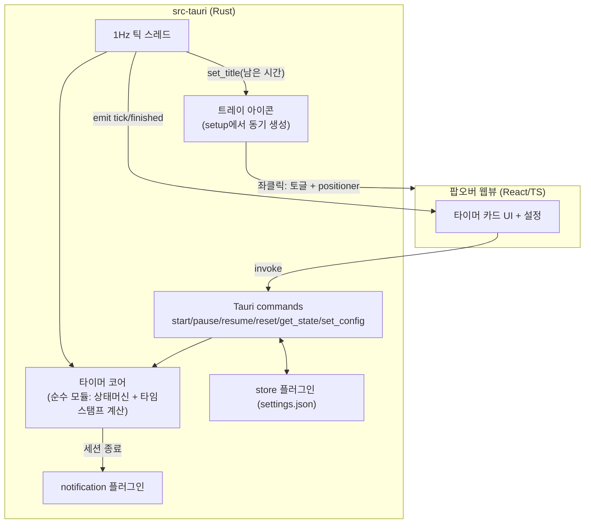
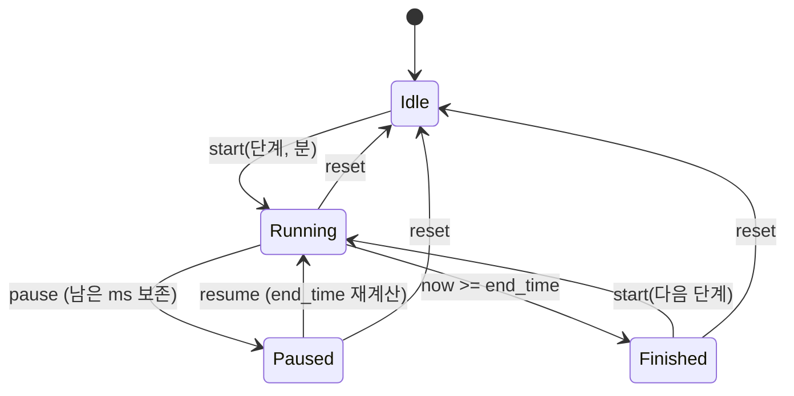

# M1 메뉴바 앱 골격 + 뽀모도로 타이머 - Plan

## Goal Capsule

- **목표**: 펭귄 아이콘으로 상주하는 macOS 메뉴바 앱 골격(Tauri v2 + React/TypeScript)을 만들고, 카드형 팝오버 UI 안에서 동작하는 뽀모도로 타이머(25/5 기본, 커스터마이즈 가능)와 타이머 종료 macOS 알림까지 완성한다. PRD §10 M1 전체.
- **권위 순서**: PRD.md > PRINCIPLE.md > CONVENTIONS.md > 이 플랜. 충돌 시 상위 문서가 이기고, 플랜과 어긋나면 구현을 멈추고 보고한다.
- **실행 프로필**: `main` 직접 커밋 금지 — `feat/m1-menubar-pomodoro-01` 형태의 브랜치에서 작업한다(CONVENTIONS 브랜치 전략). TDD: 타이머 코어는 실패 테스트 먼저, 테스트 이름은 한국어. 커밋은 한국어 Angular 컨벤션, 기능 단위.
- **정지 조건**: (a) Tauri v2 스캐폴딩이 macOS에서 실행 자체가 안 될 때, (b) 트레이 클릭 이벤트가 리서치된 우회법(동기 생성)으로도 동작하지 않을 때, (c) 범위가 M2(Notion) 영역으로 번질 때 — 멈추고 사용자에게 보고한다.
- **꼬리 작업**: PR은 `.github/TEMPLATE/PR.md` 템플릿으로 열고, merge는 사용자가 직접 한다. PRD·TODO 문서 갱신을 같은 PR에 포함한다.

---

## Product Contract

### Summary

브라우저 없이 업무 흐름을 끝내는 개인 비서 앱의 첫 단계로, 외부 서비스 의존성이 전혀 없는 앱 뼈대를 만든다. 메뉴바의 펭귄을 누르면 카드형 팝오버가 열리고, 그 안의 뽀모도로 타이머로 집중 세션을 돌리며, 세션이 끝나면 macOS 알림을 받는다. 이 단계가 끝나면 "혼자 쓰기에 유용한 상태"가 된다.

### Problem Frame

M2~M6의 5개 서비스 통합은 전부 이 팝오버 UI 셸 위에 얹힌다. 셸과 UX(트레이 토글, 팝오버 표시/숨김, 알림 권한)가 검증되지 않으면 이후 마일스톤이 전부 흔들린다. 뽀모도로는 외부 의존성이 없어 뼈대 검증에 가장 적합한 첫 기능이다(PRD §10 M1 근거).

### Requirements

**앱 골격**

- R1. 앱은 macOS 메뉴바 상주형으로 실행되고 Dock 아이콘을 표시하지 않는다.
- R2. 메뉴바 펭귄 아이콘(`assets/penguin-icon.png`) 좌클릭으로 카드형 팝오버 창이 트레이 아이콘 근처에 토글되고, 팝오버가 포커스를 잃으면 자동으로 숨는다.
- R3. 트레이 우클릭 메뉴에 앱 종료(Quit)가 있다.

**뽀모도로 타이머**

- R4. 기본 집중 25분 / 휴식 5분이며 분 단위로 커스터마이즈할 수 있다.
- R5. 시작 / 일시정지 / 재개 / 리셋을 팝오버에서 조작할 수 있다.
- R6. 팝오버가 숨겨져 있어도(5분 이상 포함) 타이머는 벽시계 기준으로 정확히 진행된다.
- R7. 남은 시간이 메뉴바 트레이 타이틀과 팝오버 양쪽에 표시된다. 유휴(Idle/Finished) 시 트레이 타이틀은 비우고, Paused에서는 일시정지 시점의 남은 시간을 고정 표시한다.

**알림·설정**

- R8. 집중/휴식 세션 종료 시 macOS 알림을 보낸다. 알림 권한은 최초 사용 시 요청하고, 거부돼도 앱은 정상 동작한다.
- R9. 타이머 시간 설정은 로컬에 저장되어 앱 재시작 후 유지된다. 로컬에는 설정·캐시 외 데이터를 두지 않는다(PRINCIPLE 4).

### Acceptance Examples

- AE1. **Given** 앱 실행 직후 **When** 메뉴바 펭귄을 좌클릭 **Then** 팝오버가 아이콘 아래 열리고, 바깥을 클릭하면 숨는다. Dock에는 앱이 없다.
- AE2. **Given** 25분 집중 타이머 시작 후 팝오버를 닫고 10분 방치 **When** 팝오버를 다시 열면 **Then** 남은 시간이 약 15:00(±수 초)으로 표시된다.
- AE3. **Given** 집중 세션이 종료되는 순간 **Then** macOS 알림이 도착하고 트레이 타이틀이 비워지며, 타이머는 휴식 세션 대기 상태가 된다.
- AE4. **Given** 집중 시간을 50분으로 변경하고 앱을 재시작 **Then** 타이머 기본값이 50분으로 유지된다.

### Scope Boundaries

- **비목표 (PRD §4)**: 태스크 연결형 뽀모도로, 세션 기록·리포트, 외부 서비스 연동(M2~), 자동 시작(로그인 시 실행), Windows/Linux.
- **Deferred to Follow-Up Work**: 멀티 모니터에서의 팝오버 위치 보정(positioner 플러그인의 알려진 한계 — 단일 모니터 전제), 흑백 템플릿 트레이 아이콘 변형(다크/라이트 메뉴바 자동 적응), 로그인 시 자동 실행(autostart).

---

## Planning Contract

### Key Technical Decisions

- **KTD1. 스택 = Tauri v2 + React/TypeScript(Vite)** (session-settled: user-directed — chosen over Swift 네이티브·Electron: 상주 앱 메모리 부담이 작고 사용자의 TS/React 경험을 활용). Rust 코어 `tauri 2.11.x`(lockfile 고정), 플러그인은 2026-08 기준 최신 2.x(positioner 2.3.3, notification 2.3.3, store 2.4.3).
- **KTD2. 타이머의 진실 원천은 타임스탬프이고 시계는 Rust가 소유한다.** WKWebView는 숨겨진 웹뷰의 JS 타이머를 ~5분 후 정지시킨다(wry#1246, tauri#5250). 따라서 `setInterval` 감산 방식은 금지: 세션 상태(단계, 종료 시각 epoch ms, 일시정지 여부)는 Rust가 보유하고, 남은 시간은 항상 `end_time - now`로 계산한다. Rust의 1Hz 틱이 트레이 타이틀을 갱신하고 `tick`/`finished` 이벤트를 프론트로 emit하며, React는 이벤트와 타임스탬프로만 렌더링한다. 보조로 팝오버 창에 `backgroundThrottling: "disabled"`(macOS 14+, tauri ≥2.3)를 설정한다.
- **KTD3. 트레이는 Rust `setup()`에서 동기 생성한다.** 비동기 컨텍스트에서 만든 트레이는 마우스 이벤트를 받지 못하는 알려진 버그가 있다(tauri#11462). `show_menu_on_left_click(false)`로 좌클릭=토글, 우클릭=메뉴를 분리하고, `on_tray_icon_event`에서 항상 `tauri_plugin_positioner::on_tray_event`를 먼저 호출한다(누락 시 위치 계산이 조용히 실패).
- **KTD4. Dock 숨김은 `ActivationPolicy::Accessory`(Rust setup) + 번들 `LSUIElement`.** Accessory는 dev 모드에서도 동작한다. `LSUIElement`는 `tauri.conf.json` 키가 아니므로 `src-tauri/Info.plist` 파일로 두어 번들 빌드 시 병합한다. Accessory 상태에서 포커스가 꼬이므로 팝오버 표시 시 `app.show()` → `window.set_focus()`, 숨김 시 `app.hide()`를 함께 호출한다.
- **KTD5. 팝오버 위치는 `tauri-plugin-positioner`의 `TrayCenter`.** 첫 클릭 이후에만 위치를 알 수 있고 멀티 모니터에서 불안정하지만(plugins-workspace#724) 단일 모니터 개인 사용에는 충분하다. 창 설정: `decorations:false, transparent:true, alwaysOnTop:true, skipTaskbar:true, resizable:false, visible:false(시작 시 숨김)`, 포커스 상실 시 숨김. 투명 창은 `app.macOSPrivateApi: true` + tauri 크레이트의 `macos-private-api` feature가 전제 조건이다.
- **KTD6. 알림은 `tauri-plugin-notification`, 검증은 번들 빌드로 한다.** macOS dev 모드에서는 번들 ID 문제로 알림이 오지 않는 것이 정상이다(plugins-workspace#2143). `tauri build`로 만든 `.app`(ad-hoc 서명)으로 검증한다. 권한 거부 시 팝오버 내 시각 표시로 대체한다.
- **KTD7. 설정 저장은 `tauri-plugin-store`** — JSON 키-값(`settings.json`), 자동 저장. 커스텀 fs 코드를 만들지 않는다.

### Assumptions

`confirm:auto`로 진행하며 아래는 확인 없이 채택한 추정이다. 틀리면 구현 전에 알려달라.

- 단일 모니터 사용을 전제한다(positioner 멀티 모니터 한계 수용).
- 컬러 펭귄 아이콘을 `icon_as_template(false)`로 그대로 쓴다 — 다크/라이트 메뉴바 자동 반전은 포기한다.
- 세션 종료 시 다음 세션(휴식↔집중)을 자동 시작하지 않고 대기한다. 원클릭으로 다음 세션을 시작한다(v1 단순화).
- 번들 식별자는 `com.kangr.penguin`(변경 쉬움), 앱 이름은 "Penguin"으로 둔다.
- 기존 루트 문서 구조를 유지하고 앱 코드는 리포 루트에 스캐폴딩한다(`src/` 프론트, `src-tauri/` Rust).

### High-Level Technical Design

타이머 상태머신(Rust 순수 모듈, Tauri 타입 무의존):

---

## Implementation Units

### U1. Tauri v2 스캐폴딩 + 테스트 하네스

- **Goal**: 실행되는 빈 메뉴바 앱 프로젝트와 양쪽 테스트 러너를 갖춘다.
- **Requirements**: R1의 기반, KTD1.
- **Dependencies**: 없음.
- **Files**: `package.json`, `vite.config.ts`, `vitest.config.ts`, `src/`(React 엔트리), `src-tauri/`(Cargo 프로젝트, `tauri.conf.json`), `src-tauri/Info.plist`(LSUIElement), `.gitignore`(node_modules·target·dist 추가), `src-tauri/icons/`(펭귄 아이콘 변환 배치).
- **Approach**: `create-tauri-app`(React+TS+Vite 템플릿)으로 스캐폴딩. `tauri.conf.json`에 팝오버 창 설정(KTD5)과 `backgroundThrottling: "disabled"`, `app.macOSPrivateApi: true`(+ Cargo `macos-private-api` feature — 투명 창 전제), identifier `com.kangr.penguin`. Dock 숨김 `LSUIElement`는 `src-tauri/Info.plist` 병합으로 설정한다(KTD4). 이 유닛에서는 창을 visible로 두어 스모크 확인한다 — `visible:false` 전환은 트레이 토글이 생기는 U3에서 한다. Vitest 설치·설정, `src-tauri`는 `cargo test` 사용.
- **Test scenarios**: Test expectation: none — 순수 스캐폴딩. 단, Vitest·cargo test가 빈 스모크 테스트 1개씩으로 구동됨을 확인.
- **Verification**: `npm run tauri dev`로 창이 뜨고, `npx vitest run`·`cargo test`가 통과한다.

### U2. 뽀모도로 타이머 코어 (Rust, TDD)

- **Goal**: Tauri 무의존 순수 Rust 모듈로 타이머 상태머신을 완성한다.
- **Requirements**: R4, R5, R6. KTD2.
- **Dependencies**: U1.
- **Files**: `src-tauri/src/pomodoro.rs`(코어 + 같은 파일 `#[cfg(test)]` 테스트).
- **Approach**: 상태(단계 Focus/Break, Idle/Running/Paused/Finished, `end_time` epoch ms, 일시정지 시 남은 ms)와 전이 함수. `now`를 인자로 주입해 테스트에서 시간을 제어한다. 설정(집중/휴식 분)은 값으로 받는다.
- **Execution note**: 실패하는 테스트 먼저(Red→Green→Refactor). 테스트 함수명은 한국어(예: `fn 일시정지_후_재개하면_남은_시간이_보존된다()`).
- **Test scenarios**:
  - 시작하면 남은 시간이 설정한 분과 같다 (25분 기본, 커스텀 값).
  - 일시정지하면 시간이 흘러도 남은 시간이 줄지 않고, 재개하면 이어서 줄어든다.
  - now가 end_time을 지나면 Finished가 되고 남은 시간은 0 아래로 내려가지 않는다.
  - 리셋하면 Idle로 돌아간다 (Running·Paused·Finished 각각에서).
  - Finished에서 start(다음 단계)를 호출하면 새 세션이 Running으로 시작된다.
  - 긴 공백(10분 방치) 후 계산해도 벽시계 기준으로 정확하다 — Covers AE2.
  - 경계: 0분 설정 거부 또는 최소 1분 처리, Finished 상태에서 pause/resume 호출 무시.
- **Verification**: `cargo test` 전체 통과.

### U3. 메뉴바 트레이 + 팝오버 셸

- **Goal**: 펭귄 트레이 아이콘 클릭으로 팝오버가 토글되는 상주 앱 셸을 만든다.
- **Requirements**: R1, R2, R3. KTD3, KTD4, KTD5.
- **Dependencies**: U1.
- **Files**: `src-tauri/src/lib.rs`(setup: 트레이·정책·positioner·창 이벤트), `src-tauri/Cargo.toml`(positioner `tray-icon` feature), `src-tauri/capabilities/`(positioner 권한), `tauri.conf.json`.
- **Approach**: setup()에서 동기로 `TrayIconBuilder` 생성(KTD3), `ActivationPolicy::Accessory`(KTD4). 좌클릭 Up 이벤트 → positioner `TrayCenter`로 이동 후 표시/숨김 토글, `app.show()`+`set_focus()` / `app.hide()` 쌍. `WindowEvent::Focused(false)` → 숨김 + 숨김 시각(Instant)을 managed state에 기록하고, 트레이 좌클릭이 blur 숨김 직후 ~300ms 이내에 도착하면 닫기 의도로 간주해 재표시하지 않는다(토글 경쟁 방지). 이 유닛에서 창을 `visible:false`로 전환한다(U1은 visible 스모크). 우클릭 메뉴: Quit. 알려진 이슈: 두 번째 show 이후 blur 미발화(tauri#13633) — 매 표시마다 focus를 다시 잡는다.
- **Test scenarios**: Test expectation: none — OS 통합 셸이라 단위 테스트 대상 아님(CONVENTIONS: UI는 수동 확인 대체 가능). 수동 시나리오: AE1 재현(클릭 토글, 바깥 클릭 숨김, Dock 부재), 우클릭 Quit 동작.
- **Verification**: `npm run tauri dev`에서 AE1 수동 재현.

### U4. 타이머 브릿지 — commands·1Hz 틱·트레이 타이틀

- **Goal**: 코어를 앱에 연결한다: 프론트가 조작하고, 트레이 타이틀이 남은 시간을 보여준다.
- **Requirements**: R5, R6, R7. KTD2.
- **Dependencies**: U2, U3.
- **Files**: `src-tauri/src/lib.rs`(commands 등록, managed state, 틱 스레드), `src-tauri/src/pomodoro.rs`(필요 시 직렬화 파생), `src/lib/timer.ts`(invoke·이벤트 구독 래퍼).
- **Approach**: `Mutex<Pomodoro>` managed state. commands: `start/pause/resume/reset/get_state/set_config`. 별도 스레드(1초 간격)가 상태를 읽어 Running이면 `set_title("MM:SS")`, Paused면 일시정지 시점의 남은 시간을 고정 표시, Idle/Finished면 `set_title(None)`, 세션 종료 감지 시 `finished` 이벤트 emit + 상태 전이. `set_config`는 진행 중(Running/Paused) 세션에 영향을 주지 않고 다음 `start`부터 적용된다. 프론트는 `tick`/`finished` 이벤트와 `get_state`(팝오버 표시 시 재동기화)로만 그린다.
- **Test scenarios**:
  - Rust: 남은 ms → "MM:SS" 포맷 함수(한국어 테스트: 한 자리 초 패딩, 0초, 59:59 초과).
  - Rust: `set_config`는 Running/Paused 세션의 end_time을 바꾸지 않고 다음 start부터 적용된다.
  - TS(`src/lib/timer.test.ts`, mockIPC): start 호출이 올바른 command와 인자로 invoke된다; finished 이벤트 수신 시 콜백이 호출된다.
- **Verification**: `cargo test`·`npx vitest run` 통과. 수동: 타이머 시작 → 팝오버 닫고 메뉴바에서 카운트다운 확인 — Covers AE2 절반(트레이 표시).

### U5. 팝오버 타이머 카드 UI + 설정 저장

- **Goal**: 카드형 팝오버 UI에서 타이머를 조작하고 시간 설정을 영속화한다.
- **Requirements**: R4, R5, R7, R9. KTD7.
- **Dependencies**: U4.
- **Files**: `src/App.tsx`, `src/components/TimerCard.tsx`, `src/components/SettingsCard.tsx`, `src/lib/settings.ts`, 대응 `*.test.tsx|ts`, 스타일 파일, `src-tauri/src/lib.rs`(store 플러그인 등록), `src-tauri/Cargo.toml`(tauri-plugin-store 의존성), `src-tauri/capabilities/`(store 권한).
- **Approach**: TimerCard를 단일 컴포넌트로 구현한다 — 카드 컨테이너 추상화는 두 번째 카드 요구가 생기는 M2 플래닝에서 결정한다. 남은 시간 대형 표시, 단계 표시(집중/휴식), 시작·일시정지·재개·리셋 버튼, 분 단위 설정 입력. Finished 상태는 종료된 단계에 맞는 메시지(예: "집중 세션 종료")와 다음 단계 시작 버튼("휴식 시작"/"집중 시작") + 리셋을 노출하며, 교대 규칙(집중↔휴식)은 `src/lib/timer.ts`가 소유한다. 설정 입력은 Idle에서만 활성화하고 그 외 상태에서는 비활성화한다. 설정은 store 플러그인(`settings.json`)에 저장하고 시작 시 로드해 `set_config`로 Rust에 반영.
- **Test scenarios**:
  - 설정 로드/저장 래퍼: 기본값(25/5) 반환, 저장 후 같은 값 로드(mockIPC로 store invoke 모킹) — Covers AE4.
  - TimerCard: 상태별 버튼 노출(Idle→시작만, Running→일시정지·리셋, Paused→재개·리셋, Finished→다음 단계 시작·리셋), 남은 시간 렌더링.
  - 교대 규칙: 직전 단계가 집중이면 다음 시작은 휴식, 그 역도 성립(`src/lib/timer.ts` 단위 테스트) — Covers AE3.
  - 설정 입력 검증: 1 미만·비숫자 입력 거부. Idle 외 상태에서는 입력이 비활성화된다.
- **Verification**: `npx vitest run` 통과. 수동: AE4 재현.

### U6. 타이머 종료 알림 + 문서 최신화

- **Goal**: 세션 종료 시 macOS 알림을 보내고, M1 결과를 문서에 반영한다.
- **Requirements**: R8. KTD6. CONVENTIONS 문서 최신화 규칙.
- **Dependencies**: U4.
- **Files**: `src-tauri/src/lib.rs`(finished 시 알림 발송), `src-tauri/capabilities/`(notification 권한), `src/lib/notification.ts`(권한 요청 플로), `PRD.md`(Q1 확정: Tauri v2 반영, §9 상태 갱신), `TODO.md`(시작 전 결정 1번·M1 체크).
- **Approach**: Rust 쪽 finished 처리에서 notification 플러그인으로 발송(웹뷰 숨김 상태에서도 발송되도록 Rust에서). 최초 팝오버 실행 시 권한 확인·요청. 거부 시 팝오버 내 배지로 대체하고 앱은 계속 동작.
- **Test scenarios**:
  - TS: 권한 거부 상태에서 앱이 에러 없이 동작하고 대체 표시 플래그가 선다(mockIPC).
  - Test expectation(알림 발송 자체): none — OS 통합. dev 모드에서 알림 미수신은 정상(KTD6), 번들 빌드로 수동 검증.
- **Verification**: `tauri build`로 만든 `.app`에서 AE3 수동 재현. 문서 diff 확인.

---

## Verification Contract

| 게이트 | 명령 | 적용 |
|---|---|---|
| Rust 단위 테스트 | `cargo test` (src-tauri에서) | U2, U4 — PR 전 전체 통과(CONVENTIONS) |
| 프론트 단위 테스트 | `npx vitest run` | U1, U4, U5, U6 — PR 전 전체 통과 |
| 개발 스모크 | `npm run tauri dev` | U1, U3~U5 수동 시나리오 |
| 번들 검증 | `npm run tauri build` 후 `.app` 실행 | U6 알림(AE3) — dev 모드 미수신은 정상 |

## Definition of Done

- R1~R9 충족, AE1~AE4 재현 확인(AE3는 번들 빌드에서).
- `cargo test`·`npx vitest run` 전체 통과. 타이머 코어는 테스트가 먼저 작성된 커밋 이력(TDD)을 가진다.
- `feat/` 브랜치에서 한국어 Angular 컨벤션 커밋으로 작업, `.github/TEMPLATE/PR.md` 템플릿으로 PR 오픈(merge는 사용자).
- PRD.md(Q1 확정)·TODO.md(해당 체크박스) 갱신이 같은 PR에 포함된다.
- 실험하다 버린 코드·미사용 스캐폴딩 잔재가 diff에 없다.
