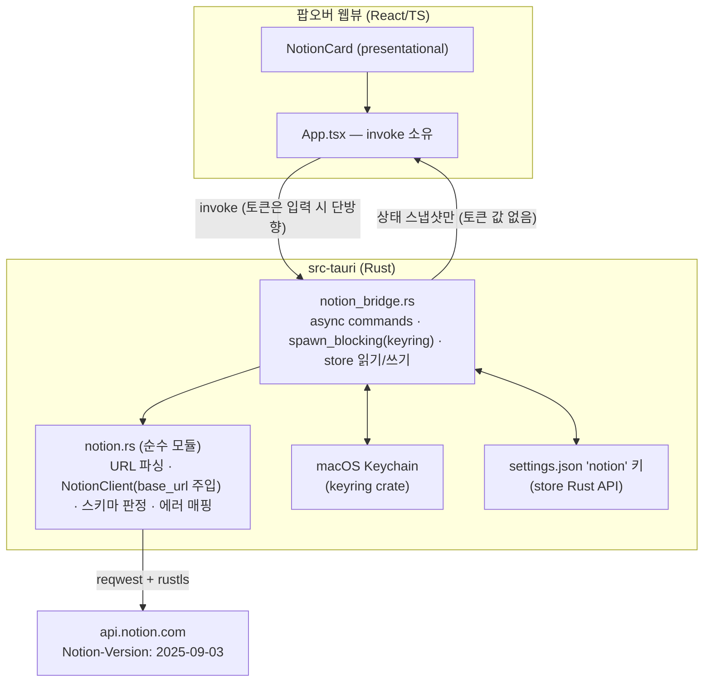
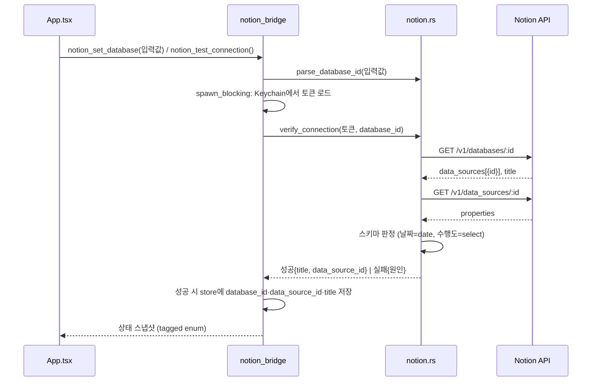

# M2 Notion Integration 연결 및 대상 Database 지정 - Plan

## Goal Capsule

- **목표**: Notion Internal Integration 토큰을 macOS Keychain에 저장하고, 대상 Database를 URL/ID 붙여넣기로 지정·교체하며, 연결 검증(접근 가능 + `날짜` Date·`수행도` Select 스키마 확인) 결과를 팝오버 설정 카드에 표시한다. 후속 M2 항목이 쓸 Notion API 클라이언트 코어(순수 모듈)를 여기서 놓는다. PRD §5.2·§7·Q2, SERVICES.md "실제 DB 구조", TODO.md M2 첫 체크박스.
- **권위 순서**: PRD.md > PRINCIPLE.md > CONVENTIONS.md > 이 플랜. 충돌 시 상위 문서가 이기고, 플랜과 어긋나면 구현을 멈추고 보고한다.
- **실행 프로필**: 브랜치 `feat/m2-notion-connect-01`(이미 체크아웃됨, R3 해소 docs 커밋 포함). TDD: 코어 로직·API 파싱은 실패 테스트 먼저, 테스트 이름은 한국어. 커밋은 한국어 Angular 컨벤션, 유닛 = 커밋.
- **정지 조건**: (a) 실제 Notion API 응답이 플랜의 가정(단일 data source, 에러 코드 체계)과 다를 때, (b) keyring이 dev 빌드에서 KTD3의 예상 동작(프롬프트 승인 후 접근 성공)조차 실패할 때, (c) 사용자 계정에서만 할 수 있는 작업이 필요할 때(Integration 커넥터를 대상 DB에 연결), (d) 범위가 할 일 블록 CRUD(다음 체크박스)로 번질 때 — 멈추고 보고한다.
- **꼬리 작업**: PR은 `.github/TEMPLATE/PR.md` 템플릿, merge는 사용자. TODO.md 체크·SERVICES.md 갱신을 같은 PR에 포함한다. 토큰 값은 코드·문서·커밋·로그·테스트 픽스처 어디에도 남기지 않는다.

---

## Product Contract

### Summary

설정 카드에서 Notion 토큰과 대상 DB를 등록하면 앱이 즉시 연결을 검증해 "연결됨/실패"를 보여준다. 이 단계가 끝나면 앱은 사용자의 `계획표` TODO DB에 안전하게 접근할 수 있는 상태가 되고, 다음 체크박스(할 일 블록 조회)가 바로 그 위에서 시작한다.

### Problem Frame

M2의 나머지 항목(할 일 조회/생성/수정, 수행도, 동기화 루프)은 전부 "검증된 토큰 + 올바른 DB"를 전제한다. 인증·대상 지정이 먼저 서지 않으면 이후 작업마다 연결 문제와 기능 버그가 섞여 디버깅이 흐려진다. 또한 DB가 기간 페이지(`s2026.05.17 ~ 2026.12`) 아래에 있어 기간이 바뀌면 DB가 바뀔 수 있으므로, 대상 교체가 처음부터 설정으로 가능해야 한다(SERVICES.md).

### Requirements

**토큰 보관**

- R1. 설정 카드에서 Notion Internal Integration 토큰을 입력하면 macOS Keychain에 저장된다. 저장 후 토큰 값은 웹뷰로 절대 반환되지 않고, 저장 여부(bool)만 노출된다. 토큰 삭제(연결 해제)도 가능하다.

**대상 DB 지정**

- R2. Notion DB의 URL 또는 32자 ID를 붙여넣으면 앱이 database ID를 추출·정규화해 저장한다. 언제든 새 값으로 교체할 수 있다(하드코딩 금지).
- R3. 검증에 성공하면 database ID와 data source ID를 함께 로컬 설정에 저장한다 — 후속 조회/쓰기는 data source ID를 쓴다(2025-09-03 API 모델).

**연결 검증**

- R4. 토큰 또는 DB 설정을 저장하면 자동으로 연결을 검증하고, 이후에도 "연결 테스트" 버튼으로 재검증할 수 있다. 검증 = DB 조회 성공 + data source 스키마에 `날짜`(date)·`수행도`(select)가 존재. 자동 검증은 토큰과 DB가 모두 저장된 경우에만 수행하고, 한쪽만 있으면 검증 없이 미설정(부족한 쪽 명시) 상태를 보여준다(토큰 단독 유효성 검사는 비목표).
- R5. 필수 속성이 없거나 타입이 다르면 연결 실패로 처리하고 누락·불일치 속성을 메시지에 명시한다. 실패 원인은 구분해 표시한다: 입력 형식 오류(URL/ID가 아님), 토큰 무효(401), DB 미공유/없음(404 — "Integration 연결 여부와 붙여넣은 링크가 DB 원본 링크인지 확인" 힌트 포함), 스키마 불일치, 요청 한도 초과(429 재시도 상한 초과), 네트워크 오류. 오류 메시지에는 사용자 입력 원문을 인용하지 않는다(토큰을 DB 필드에 잘못 붙여넣는 실수 대비 — 형식 안내만 제공).
- R6. 연결 상태(미설정 / 연결됨(DB 제목 표시) / 실패(원인))가 팝오버에 표시되고, 설정은 앱 재시작 후에도 유지된다(토큰 재입력 불요).

### Acceptance Examples

- AE1. **Given** 유효한 토큰과 Integration에 공유된 DB URL 입력 **When** 저장 **Then** "연결됨"과 DB 제목이 표시되고, 재시작 후에도 유지된다.
- AE2. **Given** 유효한 토큰이지만 Integration에 공유되지 않은 DB **When** 저장 **Then** "DB를 찾을 수 없음 — Notion에서 Integration 연결(커넥터)을 확인하세요" 류의 실패 메시지가 표시된다.
- AE3. **Given** `수행도` Select가 없는 다른 DB의 URL **When** 저장 **Then** 연결 실패로 표시되고 메시지에 `수행도` 누락이 명시된다.
- AE4. **Given** 무효화된 토큰 **When** "연결 테스트" 클릭 **Then** 토큰이 유효하지 않다는 실패 메시지가 표시된다(토큰 값은 어디에도 표시·로그되지 않는다).

### Scope Boundaries

- **비목표**: 할 일(to_do 블록) 조회/생성/수정, 수행도 변경, 동기화 검증 루프·재시도 큐 — M2의 다음 체크박스들. 주기 폴링 없음(이번 항목은 사용자 트리거 요청만이라 PRD R4 폴링 주기 설계 대상 아님).
- **Deferred to Follow-Up Work**: 토큰으로 접근 가능한 DB 목록에서 고르는 선택 UI(검색 API 필요 — URL 붙여넣기로 충분해질 때까지 보류), 429 재시도의 일반화된 쓰기 재시도 큐(동기화 루프 체크박스에서 설계).

---

## Planning Contract

### Key Technical Decisions

- **KTD1. Notion API 버전은 `2025-09-03`으로 상수 고정하고, 스키마는 2단계로 조회한다.** 2025-09-03부터 database는 컨테이너이고 스키마(`properties`)는 **data source** 객체에 있다: `GET /v1/databases/:id` → `data_sources[0].id` 추출 → `GET /v1/data_sources/:id` → `properties` 검증. 구버전(2022-06-28)도 아직 동작하지만 신규 통합에는 최신 모델이 권장되고, JS SDK v5가 구버전 지원을 끊은 것이 방향 신호다. database ID와 data source ID는 호환되지 않으므로 둘 다 저장한다(R3). 버전 승격(2026-03-11)은 별도 마이그레이션 작업으로만 한다. (출처: developers.notion.com upgrade-guide-2025-09-03, versioning)
- **KTD2. HTTP는 `reqwest`를 직접 쓰고 `rustls-tls` feature를 명시한다.** reqwest 0.13은 tauri 2.11이 이미 그래프에 갖고 있어 추가 비용이 작다. 단 **현재 lock 파일에 TLS 백엔드가 전혀 없으므로** `default-features = false, features = ["json", "rustls-tls"]`를 빠뜨리면 `https://api.notion.com` 호출이 런타임에 실패한다. `tauri-plugin-http`는 쓰지 않는다 — Rust 쪽은 reqwest 재수출일 뿐이고 차별점(URL 권한 스코핑)은 웹뷰 fetch용인데 이 앱은 웹뷰에서 API를 호출하지 않는다. Rust 전용 crate이므로 capabilities 변경도 불요(positioner 전례).
- **KTD3. 토큰은 `keyring` 4.x(기본 feature `v1` → macOS `apple-native-keyring-store`)로 저장한다.** PRD Q2 확정의 구현. `Entry::new(service, account)` → `set_password`/`get_password`/`delete_credential`, `NoEntry`는 미저장(첫 실행) 경로로 매핑. **dev 빌드는 재빌드마다 ad-hoc 서명 코드 해시가 바뀌어 Keychain 접근 프롬프트가 반복되는 것이 정상이다**(ACL이 서명 정체성에 묶임) — 알림의 "dev에서 안 오는 게 정상" 규칙과 같은 부류로, 최종 UX 검증은 번들 `.app`에서 한다. keyring 호출은 블로킹이므로 async 커맨드 안에서 `spawn_blocking`으로 감싼다.
- **KTD4. Notion 코어는 `pomodoro.rs`처럼 Tauri 무의존 순수 모듈로 두고, base URL을 주입해 `wiremock`으로 테스트한다.** `notion.rs`: URL→ID 파싱, 스키마 판정, 에러 매핑, HTTP 클라이언트(생성자에서 base URL 주입, 기본값 `https://api.notion.com`은 브릿지가 넘김). 테스트는 `#[tokio::test]` + 테스트별 격리 `MockServer`. 실제 API는 절대 호출하지 않고 픽스처의 ID·제목도 전부 가짜 값을 쓴다(verification.md 규칙).
- **KTD5. Notion 커맨드는 async로 만들고, Rust가 Notion 설정을 소유한다.** Tauri v2는 자체 tokio 런타임이 있어 `async fn` 커맨드가 바로 동작한다. 단 `std::sync::Mutex` 가드를 `.await` 너머로 들고 가지 않는다(비-Send). 타이머 설정은 웹뷰가 store를 소유하고 Rust에 재주입하는 구조지만, Notion은 토큰(Keychain)도 API 호출도 Rust 소유이므로 DB ID·data source ID·DB 제목도 **Rust가 `tauri-plugin-store` Rust API로 같은 `settings.json`의 `notion` 키에 저장**한다 — 재주입 댄스를 피하고 웹뷰에는 상태 스냅샷만 내려보낸다. 전제: 두 소유자(웹뷰 `timer` 키, Rust `notion` 키)는 동일 경로 문자열로 store 플러그인 API만 경유해 같은 인스턴스를 공유하고, 프론트에서 `reset()`·파일 직접 쓰기를 하지 않는다. Rust 쓰기 후에는 명시적으로 `save()`를 호출해 auto-save 설정과 무관하게 디스크 플러시를 보장한다.
- **KTD6. 검증은 저장 시 자동 + 수동 "연결 테스트" 버튼.** (session-settled: user-directed — 수동 버튼만 방식 대신: 설정 직후 바로 성공/실패를 알 수 있어야 잘못된 커넥터 연결을 즉시 잡는다)
- **KTD7. 필수 스키마 누락은 연결 실패로 처리한다.** (session-settled: user-directed — "연결 성공 + 경고 표시" 대신: 이후 마일스톤 전체가 이 스키마를 전제하므로 잘못된 DB를 조기에 걸러낸다)
- **KTD8. 대상 DB 지정은 URL/ID 붙여넣기.** (session-settled: user-directed — 접근 가능 DB 목록 선택 대신: 구현이 단순하고 이 체크박스 범위에 맞다. 기간 변경 시 새 링크만 다시 붙여넣으면 된다) URL의 `?v=` 값은 뷰 ID이므로 무시하고, 경로의 32자 hex만 추출해 UUID 형태로 정규화한다. 단, 링크드 뷰·페이지 링크의 경로 hex는 DB가 아니라 페이지 ID일 수 있다 — 이 경우 API가 404를 돌려주므로 404 힌트에 "원본 DB 링크인지 확인" 안내를 함께 담는다(R5).
- **KTD9. 429는 클라이언트 계층에서 `Retry-After` 준수 + 지수 백오프(상한 있음)로 처리한다.** 이번 항목의 호출량(단발 검증)에는 과하지만, Notion 권고대로 클라이언트에 중앙화해 두면 동기화 루프 체크박스의 재시도 큐가 이 위에 선다(PRINCIPLE 3의 기반). rate limit은 평균 3 req/s.

### Assumptions

확인 없이 채택한 추정이다. 틀리면 구현 전에 알려달라.

- 대상 DB는 클래식 DB라 data source가 정확히 1개다. 0개 또는 2개 이상이면 오류로 표시하고 보고한다.
- Integration 토큰은 이미 생성돼 있고(PRD §7 ✅), 대상 DB(`계획표` 워크스페이스)에 커넥터를 연결하는 것은 사용자 작업이다 — 앱은 404 시 힌트만 준다.
- 연결 성공 상태에 DB 제목을 표시한다(제목은 시크릿이 아님).
- 토큰 입력 시 값이 웹뷰→Rust로 한 번 건너가는 것은 불가피하며 허용한다(금지는 반대 방향 — Rust→웹뷰 반환·로그·저장). 입력 필드는 검증 성공 시에만 비운다(U4).
- 세 번째 카드가 360×540 팝오버에 들어간다. 넘치면 팝오버 내 스크롤로 수용한다.

### High-Level Technical Design

연결 검증 흐름:

---

## Implementation Units

### U1. Notion 코어 — URL 파싱·스키마 판정·에러 매핑 (순수 로직, TDD)

- **Goal**: HTTP 없이 판정 로직이 완성된다: 입력 문자열 → database ID, properties JSON → 스키마 판정, Notion 에러 코드 → 사용자 메시지.
- **Requirements**: R2, R5. KTD4, KTD7, KTD8.
- **Dependencies**: 없음.
- **Files**: `src-tauri/src/notion.rs`(신규, `#[cfg(test)]` 인라인 테스트), `src-tauri/src/lib.rs`(`pub mod notion;` 선언).
- **Approach**: `pomodoro.rs` 스타일 순수 모듈. `parse_database_id`는 URL/ID 문자열에서 32자 hex를 추출해 하이픈 정규화하고, `?v=`(뷰 ID)를 DB ID로 오인하지 않는다. `validate_schema`는 data source의 `properties` JSON(serde_json::Value)에서 `날짜`가 `date` 타입, `수행도`가 `select` 타입인지 판정하고 누락·타입 불일치를 열거해 돌려준다. `ConnectError` enum(Unauthorized/NotFound/InvalidId/SchemaMismatch/RateLimited/Network 등)과 한국어 메시지 매핑. 에러 판별은 응답 body의 `code` 필드(안정 enum) 기준, `message` 문자열 매칭 금지. 상태 조합 판정 `determine_connection_state`(토큰 유무 × DB 유무 × 검증 결과 → 미설정/연결됨/실패)도 이 모듈의 순수 함수로 둔다(U3가 호출). 어떤 오류 메시지에도 사용자 입력 원문을 인용하지 않는다.
- **Test scenarios** (한국어 이름, 픽스처는 전부 가짜 ID):
  - URL에서_하이픈_없는_ID를_추출해_정규화한다 (일반 URL, `?v=` 포함 URL, 하이픈 있는 UUID, 맨 ID 문자열).
  - 뷰_ID나_잘못된_길이의_입력은_거부한다.
  - 필수_속성이_모두_있으면_스키마_검증을_통과한다.
  - 수행도가_없거나_타입이_다르면_누락_속성을_명시해_실패한다 (`날짜` 누락, `수행도`가 select 아님, 둘 다 누락).
  - 에러_코드별로_한국어_메시지가_매핑된다 (unauthorized / object_not_found / validation_error / rate_limited).
  - 입력_형식_오류는_전용_한국어_메시지로_매핑되고_원문을_포함하지_않는다.
- **Verification**: `cd src-tauri && cargo test` 통과.

### U2. NotionClient — 2단계 조회 HTTP 클라이언트 (wiremock, TDD)

- **Goal**: base URL 주입형 클라이언트가 database → data source 2단계 조회와 오류·재시도를 처리한다.
- **Requirements**: R3, R4, R5. KTD1, KTD2, KTD4, KTD9.
- **Dependencies**: U1.
- **Files**: `src-tauri/src/notion.rs`, `src-tauri/Cargo.toml`(deps: `reqwest`(default-features=false, json+rustls-tls), `tokio`(time feature — 429 백오프의 논블로킹 sleep); dev-deps: `tokio`(rt·macros), `wiremock`).
- **Approach**: `NotionClient::new(base_url)`, 메서드 `verify_connection(token, database_id) -> Result<Verified, ConnectError>` — GET database(제목·`data_sources` 추출, 개수≠1이면 오류) → GET data source → U1 `validate_schema` 적용. 모든 요청에 `Authorization: Bearer`·`Notion-Version: 2025-09-03`(상수) 헤더. 429는 `Retry-After` 초만큼 대기 후 재시도(지수 백오프, 시도 상한 ~3, 테스트에서는 대기 시간 주입/단축). 토큰은 어떤 로그·에러 메시지에도 포함하지 않는다.
- **Test scenarios** (wiremock `MockServer`, `#[tokio::test]`):
  - 이단계_조회로_스키마_검증에_성공한다 (Notion-Version·Authorization 헤더 매처 포함) — Covers AE1의 백엔드 절반.
  - 미공유_DB는_404를_연결_힌트가_담긴_실패로_매핑한다 — Covers AE2.
  - 무효_토큰은_401을_토큰_실패로_매핑한다 — Covers AE4.
  - 스키마가_다른_DB는_누락_속성을_담아_실패한다 — Covers AE3.
  - data_source가_하나가_아니면_오류로_처리한다 (0개, 2개).
  - 429는_Retry_After를_기다렸다가_재시도해_성공한다 / 재시도_상한을_넘으면_실패한다.
  - 네트워크_오류는_네트워크_실패로_매핑된다.
  - 페이지_ID를_붙여넣으면_404_실패에_원본_링크_확인_안내가_포함된다.
- **Verification**: `cargo test` 통과. 실제 api.notion.com 호출 없음(테스트 중 네트워크 차단 가정으로도 통과해야 함).

### U3. Keychain 보관 + notion_bridge 커맨드

- **Goal**: 프론트가 호출할 커맨드 5종이 동작한다: 토큰 저장/삭제, DB 지정, 상태 조회, 연결 테스트. 설정은 Rust가 store에 영속한다.
- **Requirements**: R1, R3, R4, R6. KTD3, KTD5, KTD6.
- **Dependencies**: U2.
- **Files**: `src-tauri/src/notion_bridge.rs`(신규), `src-tauri/src/lib.rs`(모듈 선언·`invoke_handler` 등록), `src-tauri/Cargo.toml`(`keyring = "4"`).
- **Approach**: `#[tauri::command] async fn` — `notion_save_token(token)`(Keychain 저장 → DB가 지정돼 있으면 자동 검증, 없으면 검증 생략), `notion_delete_token`, `notion_set_database(input)`(U1 파싱 성공 시 database_id를 즉시 store `notion` 키에 저장 → 토큰이 있으면 자동 검증, 없으면 미설정(토큰 없음) 응답 — data_source_id·title은 검증 성공 시에만 채운다), `notion_get_status`, `notion_test_connection`. 상태 응답은 `#[serde(tag = "state", rename_all = "snake_case")]` tagged enum(타이머 `Snapshot` 전례): 미설정(토큰/DB 어느 쪽이 없는지 포함)·연결됨(title)·실패(원인 메시지). **토큰 값은 응답·로그·store 어디에도 넣지 않는다.** keyring 호출은 `spawn_blocking`, `NoEntry`는 "토큰 미저장" 상태로 매핑. 커맨드는 `Result<_, String>` 한국어 메시지(기존 컨벤션) — 웹뷰로 반환하는 오류 문자열은 U1 ConnectError 매핑 결과만 사용하고 reqwest·keyring 에러를 Display/Debug로 직접 이어붙이지 않는다. store 쓰기 후에는 `save()`로 플러시한다(KTD5). base URL 기본값은 브릿지가 넘긴다 — 브릿지엔 분기 로직을 두지 않고 상태 조합 판정(토큰 유무 × DB 유무 → 상태)은 U1 코어의 순수 함수로 둔다.
- **Test scenarios**: 상태_조합_판정이_올바르다(토큰만 있음/DB만 있음/둘 다 없음/둘 다 있음 — 코어 순수 함수 테스트). Keychain 실 접근과 커맨드 배선 자체는 `Test expectation: none — OS 통합(수동 검증)`.
- **Verification**: `cargo test` 통과. `npm run tauri dev`에서 dev용 임시 호출로 저장→상태 조회 확인(Keychain 프롬프트 반복은 정상 — KTD3).

### U4. NotionCard UI + 프론트 래퍼

- **Goal**: 팝오버에서 토큰·DB를 입력하고 연결 상태를 확인할 수 있다.
- **Requirements**: R1, R2, R4, R6. KTD6.
- **Dependencies**: U3.
- **Files**: `src/lib/notion.ts`(+`src/lib/notion.test.ts`), `src/components/NotionCard.tsx`(+`src/components/NotionCard.test.tsx`), `src/App.tsx`, `src/App.css`(라이트·다크 블록 병행 수정).
- **Approach**: 기존 컨벤션 준수 — 카드는 presentational(값+콜백 props, invoke 금지), invoke·핸들러는 `App.tsx` 소유, 래퍼는 `src/lib/notion.ts`의 얇은 화살표 함수(camelCase 인자). 카드 구성: 토큰 입력(type="password") + 명시적 "저장" 버튼·저장됨 배지·삭제 버튼, DB URL/ID 입력 + "저장" 버튼, "연결 테스트" 버튼, 상태 표시(미설정/검증 중/연결됨(제목)/실패(원인)). 저장 트리거는 두 입력 모두 명시적 버튼이다 — 시크릿 필드의 우발적 blur 저장을 막기 위해 SettingsCard의 onBlur 커밋 컨벤션을 의도적으로 따르지 않는다. 토큰 입력 필드는 검증까지 성공했을 때만 비우고 실패 시에는 값을 유지해 바로 수정·재시도할 수 있게 한다. "검증 중"은 프론트 전용 `isVerifying` 플래그로 관리하며 세 트리거(토큰 저장·DB 저장·연결 테스트)가 공유해 진행 중에는 셋 다 비활성화한다. 실패 메시지는 기존 `.notif-hint`(role="status") 배너 패턴 재사용. 라벨은 `htmlFor`/`id` 배선(테스트가 `getByLabelText` 사용).
- **Test scenarios** (mockIPC):
  - 토큰_저장은_올바른_커맨드와_인자로_invoke된다 / 검증_성공_시에만_입력_필드가_비워진다 / 실패_시_입력값이_유지된다.
  - DB_입력_저장이_상태를_갱신한다 (연결됨 응답 픽스처 → 제목 렌더링) — Covers AE1.
  - 실패_상태는_원인_메시지를_표시한다 (404 힌트 메시지) — Covers AE2.
  - 미설정_상태는_안내_문구를_표시한다.
  - 상태별_컨트롤_노출이_올바르다 (토큰 저장됨 → 삭제 버튼, 검증 중(isVerifying) → 세 트리거 모두 비활성).
- **Verification**: `npm test` 통과. `npm run tauri dev`에서 AE1·AE2 수동 재현.

### U5. 문서 최신화

- **Goal**: 완료 상태와 확정 사항이 문서에 반영된다.
- **Requirements**: CONVENTIONS 문서 최신화 규칙, develop 스킬 5단계.
- **Dependencies**: U4.
- **Files**: `TODO.md`(M2 첫 체크박스 체크), `SERVICES.md`(Notion 항목에 연결 방식·API 버전 고정·data source ID 캐시 사실 반영), `PRD.md`(변경 없으면 그대로).
- **Approach**: Deferred 항목(DB 목록 선택 UI)을 TODO.md M2 밑에 한 줄 추가해 잊히지 않게 한다. dev Keychain 프롬프트 반복이 실제로 관찰되면 `docs/solutions/` 기록은 별도 재량 판단(ce-compound)으로 남긴다.
- **Test scenarios**: Test expectation: none — 문서 변경.
- **Verification**: 문서 diff 확인, 두 테스트 러너 최종 전체 통과.

---

## Verification Contract

| 게이트 | 명령 | 적용 |
|---|---|---|
| Rust 단위 테스트 | `cd src-tauri && cargo test` | U1~U3 — PR 전 전체 통과 |
| 프론트 단위 테스트 | `npm test` | U4 — PR 전 전체 통과 |
| 개발 스모크 | `npm run tauri dev` | U3·U4 수동: 토큰 저장 → DB 지정 → 연결됨 표시, 잘못된 DB로 실패 표시 |
| 번들 검증 | `npm run tauri build` 후 `.app` 실행 | Keychain UX(프롬프트가 반복되지 않는지)·재시작 후 설정 유지(AE1 후반) — dev의 반복 프롬프트는 정상(KTD3) |

## Definition of Done

- R1~R6 충족, AE1~AE4 재현 확인(Keychain UX는 번들 빌드에서).
- `cargo test`·`npm test` 전체 통과. 코어 로직(U1·U2)은 테스트가 먼저 작성된 커밋 이력(TDD)을 가진다.
- 토큰 값이 코드·문서·커밋·로그·테스트 픽스처 어디에도 없다. 픽스처의 ID·제목은 전부 가짜 값이다.
- `feat/m2-notion-connect-01` 브랜치에서 한국어 Angular 컨벤션 커밋, `.github/TEMPLATE/PR.md` 템플릿으로 PR 오픈(merge는 사용자).
- TODO.md 체크·SERVICES.md 갱신·Deferred 항목 이관이 같은 PR에 포함된다.
- 실험하다 버린 코드·미사용 스캐폴딩·디버그 출력이 diff에 없다.
