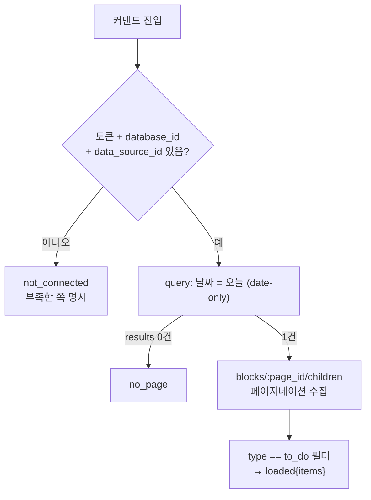
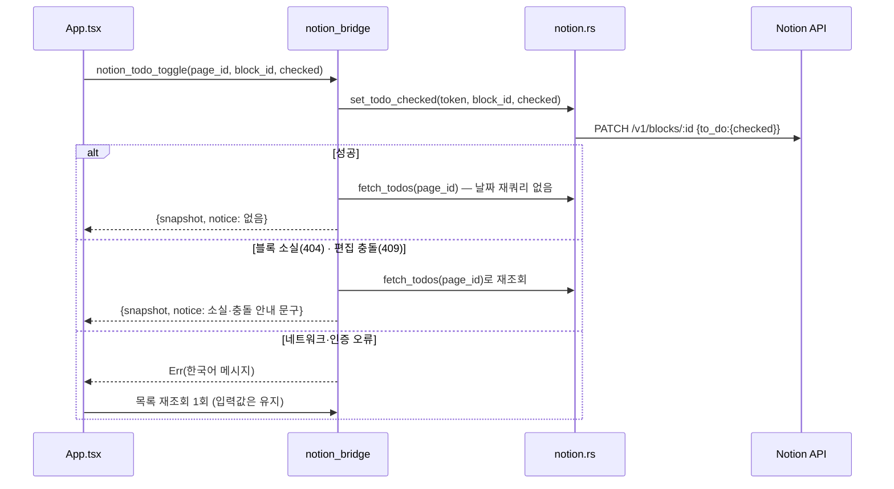

# M2 날짜 페이지 할 일(to_do 블록) 조회·생성·수정 카드 - Plan

## Goal Capsule

- **목표**: 팝오버에 TODO 카드를 추가해 계획표 DB에서 오늘 날짜 행의 페이지 본문 `to_do` 블록을 조회·생성·수정(체크 토글 포함)한다. 오늘 행이 없으면 `[TODO]` 템플릿과 같은 골격으로 페이지를 만들 수 있다. 기존 `notion.rs`/`notion_bridge.rs` 연결 기반 위에 얹는다. TODO.md M2 세 번째 체크박스, PRD §5.2, SERVICES.md "실제 DB 구조".
- **권위 순서**: PRD.md > PRINCIPLE.md > CONVENTIONS.md > 이 플랜. 충돌 시 상위 문서가 이기고, 어긋나면 구현을 멈추고 보고한다.
- **실행 프로필**: 브랜치 `feat/m2-notion-todo-01` (`main`에서 신규). TDD: 코어 로직·API 파싱은 실패 테스트 먼저, 테스트 이름은 한국어, 픽스처는 전부 가짜 값. 커밋은 한국어 Angular 컨벤션, 유닛 = 커밋.
- **정지 조건**: (a) 실제 Notion 응답이 플랜 가정과 다를 때(블록 스키마, 템플릿 헤딩 타입이 생성 골격 설계를 뒤집는 경우), (b) 범위가 카테고리 헤딩·시간 규칙·수행도·동기화 루프(다음 체크박스들)로 번질 때, (c) 사용자 계정에서만 할 수 있는 작업이 필요할 때 — 멈추고 보고한다.
- **꼬리 작업**: PR은 `.github/TEMPLATE/PR.md` 템플릿, merge는 사용자. TODO.md 체크·SERVICES.md 갱신을 같은 PR에 포함. 토큰 값은 코드·문서·커밋·로그·픽스처 어디에도 남기지 않는다.

---

## Product Contract

### Summary

팝오버 TODO 카드에서 오늘 할 일을 보고, 추가하고, 체크하고, 고친다. 저장소는 Notion 그대로이고 앱은 클라이언트다(PRINCIPLE 4). 이번 체크박스는 카테고리 헤딩·시간 접두어를 해석하지 않고 to_do 블록을 페이지 순서 그대로 평평하게 다룬다.

### Problem Frame

M2 데이터 모델(행=하루, 할 일=본문 to_do 블록)은 확정됐지만 앱은 아직 연결 검증까지만 한다. 할 일을 보려면 여전히 브라우저로 Notion을 열어야 한다(PRINCIPLE 2 위반 상태). 이 항목이 M2의 첫 실사용 가치를 만든다 — 이후 체크박스(표현 확장, 수행도, 동기화 루프)는 전부 이 조회·쓰기 경로 위에 선다.

### Requirements

**조회**

- R1. 카드가 오늘(로컬 날짜) 행의 페이지 본문 to_do 블록을 페이지 순서 그대로 목록으로 보여준다 — 텍스트(plain_text 연결)와 체크 상태. 헤딩 등 다른 블록 타입은 표시하지 않는다.
- R2. 새로고침은 수동이다 — 팝오버가 다시 보일 때 자동 재조회 + 카드의 새로고침 버튼. 주기 폴링 없음.
- R3. 오늘 행이 없으면 "오늘 페이지 없음" 상태와 만들기 버튼을 보여준다. 버튼은 `[TODO]` 템플릿과 같은 골격(제목 `[TODO]`, `날짜`=오늘, `공부`/`기타` 헤딩 2개)으로 페이지를 생성한다. 자동 생성하지 않는다.

**생성·수정**

- R4. 새 할 일 텍스트를 입력하면 페이지 본문 끝에 to_do 블록으로 추가된다(카테고리 위치 지정은 다음 체크박스).
- R5. 항목 체크박스 클릭으로 checked를 토글하고, 항목 텍스트를 편집할 수 있다. 토글은 checked만, 텍스트 편집은 rich_text만 보낸다(다른 필드 불변).
- R6. 모든 쓰기 후 스냅샷을 다시 조회해 원격 상태를 화면에 반영한다 — 쓰기 응답으로 로컬 상태를 조립하지 않는다.

**연결·오류**

- R7. 연결이 안 돼 있으면(토큰·DB·data source ID 중 부재) 미연결 안내를 표시한다. `notion_get_status`의 연결됨 표시는 캐시 기반이므로 todo 커맨드는 data source ID 부재를 독립적으로 처리한다.
- R8. 쓰기 실패는 배너로 원인을 표시하고 입력값을 유지해 수동 재시도할 수 있게 하며, 실패 시에도 목록을 1회 재조회해 실제 반영 여부를 보여준다(타임아웃 뒤 재시도가 중복 항목을 만드는 것 방지). 블록 소실(404)과 편집 충돌(409)은 오류로 던지지 않고 자동 재조회 + 안내 문구로 처리한다. 재시도 큐·주기 검증은 동기화 루프 체크박스로 미룬다.

### Acceptance Examples

- AE1. **Given** 연결됨 + 오늘 행에 to_do 3개 **When** 팝오버를 열면 **Then** 3개 항목이 본문 순서대로 체크 상태와 함께 표시된다.
- AE2. **Given** 오늘 행 없음 **When** 새로고침 **Then** "오늘 페이지 없음"과 만들기 버튼이 보이고, 클릭하면 골격 페이지가 생성된 뒤 빈 목록이 표시된다.
- AE3. **Given** 표시된 항목 **When** 체크박스 클릭 **Then** Notion에 반영되고 재조회된 목록에 체크 상태가 나타난다.
- AE4. **Given** 원격에서 지워진 블록 **When** 토글/편집 시도 **Then** 목록이 오래되었다는 안내와 함께 재조회된다.

### Scope Boundaries

- **비목표**: 카테고리 헤딩 인식·시간 접두어 파싱·세부 메모(표현 확장 체크박스), 수행도 표시/변경, 주기 검증·전체 재동기화·쓰기 재시도 큐(동기화 루프 체크박스), 할 일 삭제, 날짜 탐색(오늘만), 중첩 to_do(최상위 블록만 다룬다), 알림·폴링.
- **Deferred to Follow-Up Work**: 헤딩 아래 위치 지정 삽입(`after` 파라미터 — 표현 확장 체크박스에서), API 버전 `2026-03-11` 승격(별도 마이그레이션 작업 — 이 기능 표면에서는 `after`→`position`, `archived`→`in_trash` 두 가지만 바뀐다).

---

## Planning Contract

### Key Technical Decisions

- **KTD1. API 버전은 `2025-09-03`을 유지한다.** 최신은 `2026-03-11`이지만 Notion은 구버전 지속 지원을 명시하고 있고, 이 기능 표면의 차이는 append의 `after`→`position`, 삭제의 `archived`→`in_trash` 뿐이다. 버전 승격은 별도 작업으로만 한다(연결 플랜 KTD1과 동일 방침). (출처: developers.notion.com versioning, upgrade-guide-2026-03-11)
- **KTD2. `get_json`을 메서드·바디를 받는 공용 `request_json`으로 일반화한다.** 429 재시도(Retry-After + 지수 백오프)와 에러 코드 매핑을 GET/POST/PATCH가 공유한다 — 조회(query)·쓰기(append/update)·생성(pages)이 전부 이 위에 선다. `ConnectError`에 `Conflict`(HTTP 409, code `conflict_error`) variant를 추가하고 "재조회 후 재시도" 한국어 메시지를 매핑한다. 기존 검증 경로의 동작·테스트는 그대로 유지된다.
- **KTD3. "오늘" 판정은 Rust가 소유한다.** 브릿지가 `chrono`(`clock` feature)로 로컬 날짜 `YYYY-MM-DD`를 만들어 코어에 주입한다. 코어 함수는 날짜를 파라미터로 받아 순수하게 테스트한다. date-only 값끼리의 `equals` 필터는 타임존 드리프트가 없다 — datetime 값을 절대 섞지 않는다. 숨겨진 웹뷰의 JS 시계에 의존하지 않는다(코드베이스 함정 1번과 같은 부류).
- **KTD4. 페이지 생성은 `children` 골격 방식이다 — `template` 파라미터를 쓰지 않는다.** API는 DB 템플릿을 자동 적용하지 않고, `template` 파라미터는 비동기 적용(생성 직후 조회가 빈 페이지를 봄) + `children` 병용 불가라서 이 앱의 "만들자마자 보인다" 흐름에 맞지 않는다. 골격: 제목 `[TODO]`, `날짜`=오늘(date-only start), 헤딩 2개(`공부`/`기타`). 제목 속성 키는 하드코딩하지 않고 생성 시점에 data source 스키마에서 `title` 타입 속성을 찾아 쓴다. (출처: developers.notion.com creating-pages-from-templates, post-page)
- **KTD5. 모든 todo 커맨드는 `TodoSnapshot` tagged enum을 반환한다.** `ConnectionState` 전례(`#[serde(tag = "state", rename_all = "snake_case")]`)를 따라 미연결 / 오늘 페이지 없음 / 로드됨(항목 목록) 세 상태를 표현한다. 쓰기 커맨드도 성공 시 재조회한 스냅샷을 돌려줘 R6을 커맨드 계층에서 보장한다. 쓰기 후 재조회는 날짜 재쿼리가 아니라 **이미 아는 `page_id`의 children 조회로 시작한다** — 자정 경계에서 어제 페이지에 쓰고 오늘 no_page가 표시되는 어긋남, 생성 직후 쿼리 인덱싱 지연, 불필요한 왕복 1회가 함께 사라진다. 날짜 재쿼리는 children 조회가 404일 때의 폴백으로만 수행하고, 페이지 생성은 POST 응답의 page ID로 곧장 children을 조회해 스냅샷을 조립한다(KTD4가 template 파라미터를 기각한 것과 같은 read-after-write 위험을 재조회 경로에 다시 들이지 않는다).
- **KTD6. 표시·추가는 최상위 to_do 블록만 다룬다.** 조회는 블록 children을 페이지네이션(100개/페이지, `has_more`/`next_cursor`)으로 전부 모은 뒤 `type == "to_do"`만 추려 순서대로 보여준다. 추가는 본문 끝 append(파라미터 없는 기본 동작). 헤딩 구조 인식과 위치 지정 삽입은 표현 확장 체크박스의 몫이다.
- **KTD7. 텍스트 편집은 plain text 배열로 rich_text를 전체 교체한다.** Notion 업데이트는 필드 단위 전체 교체이므로 서식이 있는 항목은 서식이 사라진다. 확인된 사용 양상(시간 접두어를 손수 적는 플레인 텍스트)에서는 손실이 없다고 판단한다. 토글은 `checked`만 보내 rich_text를 건드리지 않는다.
- **KTD8. 로컬 영속은 없다.** 블록 ID·목록은 React 상태에만 존재하고 store에 아무것도 추가하지 않는다(PRINCIPLE 4 — 로컬은 설정과 캐시만, `notion` 키 스키마 불변).
- **KTD9. 이번 단계의 동기화 신뢰성 몫은 "쓰기 후 전체 재조회 + 실패 배너 + 수동 재시도"까지다.** 주기 검증·오류 시 전체 재동기화·쓰기 재시도 큐(PRINCIPLE 3)는 M2 마지막 체크박스가 이 클라이언트 위에 설계한다 — TODO.md가 이를 별도 항목으로 분리해 두었고, 이 플랜의 구조(스냅샷 재조회 중심, 상태 무영속)는 그 설계를 막지 않는다.

### Assumptions

확인 없이 채택한 추정이다. 틀리면 구현 전에 알려달라.

- 템플릿의 카테고리 헤딩은 `heading_3`(`###`)로 추정한다(SERVICES.md 표기 기준). 표시에는 영향이 없고(헤딩은 안 보여줌) 생성 골격에만 쓰인다 — 개발 스모크에서 실제 페이지 블록 타입을 확인해 다르면 골격만 맞춘다.
- 오늘 날짜의 행은 보통 하나다. 단 SERVICES.md가 예외를 기록하고 있으므로(`휴일`·`MT` 등 비-`[TODO]` 행, 날짜 범위 3건) 유일성을 가정하지 않는다 — 복수 결과면 제목이 `[TODO]`인 행을 우선 선택하고, 선택된 페이지 제목을 카드에 노출해 어느 페이지를 편집 중인지 보이게 한다(U2).
- 하루 페이지의 블록 수는 수십 개 수준이라 페이지네이션 1~2회로 끝난다(그래도 루프는 구현한다).
- 카드 4개가 360×540 팝오버를 넘치는 것은 기존 정책(팝오버 스크롤)으로 수용하되, TODO 목록 자체에 max-height 스크롤 영역을 둔다.

### High-Level Technical Design

스냅샷 결정 (모든 todo 커맨드의 공통 종단):

쓰기 흐름 (토글 예 — 추가·편집·생성 동일 패턴):

---

## Implementation Units

### U1. request_json 일반화 + Conflict 에러 (TDD)

- **Goal**: GET 전용 `get_json`이 메서드·바디를 받는 공용 요청 경로가 되고, 409가 전용 에러로 매핑된다.
- **Requirements**: R8 일부. KTD2.
- **Dependencies**: 없음.
- **Files**: `src-tauri/src/notion.rs`.
- **Approach**: `request_json(method, path, token, body: Option<&Value>)`로 일반화하고 `get_json`은 얇은 위임으로 남기거나 호출부를 바꾼다. 429 재시도 루프·에러 body `code` 추출·타임아웃 매핑은 그대로 공유. `ConnectError::Conflict` 추가(코드 `conflict_error`, 그리고 `error_from_code`의 상태 기반 폴백에도 `409 => Conflict` arm을 추가 — 기존 401/404/429 폴백과 대칭), 메시지는 "다른 곳에서 같은 항목이 수정됐습니다. 새로고침 후 다시 시도해 주세요" 류. 기존 http_tests 전부 통과 유지.
- **Test scenarios** (wiremock, 한국어 이름):
  - POST_요청도_429면_Retry_After를_기다렸다가_재시도한다.
  - PATCH_요청의_에러_code가_ConnectError로_매핑된다 (conflict_error → Conflict 포함).
  - 기존_검증_경로_테스트가_변경_없이_통과한다 (회귀 확인 — 별도 테스트 추가 없이 기존 스위트로).
- **Verification**: `cd src-tauri && cargo test` 통과.

### U2. 조회 경로 — 오늘 행 쿼리 + to_do 블록 수집 (TDD)

- **Goal**: 날짜 문자열을 주면 오늘 페이지를 찾고 그 본문의 to_do 항목 목록을 돌려주는 코어가 완성된다.
- **Requirements**: R1, R7 일부. KTD3, KTD5, KTD6.
- **Dependencies**: U1.
- **Files**: `src-tauri/src/notion.rs`.
- **Approach**: `find_page_by_date(token, data_source_id, date)` — `POST /v1/data_sources/:id/query`, 필터 `{property: "날짜", date: {equals: date}}`, `page_size` 소값(예: 5). 결과가 여럿이면 제목이 `[TODO]`인 행을 우선 선택하고 없으면 첫 행을 쓴다. 선택한 페이지의 제목을 함께 돌려줘(`Option<(page_id, title)>`) 스냅샷에 싣는다 — 휴일·MT 행이 같은 날짜에 있을 때 어느 페이지를 편집 중인지 카드에 보이게 한다. `fetch_todos(token, page_id) -> Result<Vec<TodoItem>, ConnectError>` — `GET /v1/blocks/:page_id/children` 페이지네이션 루프, `type == "to_do"` && `archived != true` 필터, `TodoItem { id, text, checked }`(text는 기존 `rich_text_plain` 재사용). 블록 JSON → TodoItem 변환은 순수 함수로 분리해 HTTP 없이도 테스트한다.
- **Test scenarios**:
  - 날짜_필터_쿼리_body가_date_only_equals로_전송된다 (wiremock body 매처) — Covers AE1의 백엔드 절반.
  - 결과가_없으면_None을_돌려준다 — Covers AE2 전반부.
  - 결과가_여러_행이면_TODO_제목_행을_우선_선택한다 (휴일 행 혼재 픽스처).
  - 두_페이지로_나뉜_children을_병합해_순서를_유지한다 (has_more/next_cursor).
  - to_do가_아닌_블록과_archived_블록은_목록에서_제외된다 (heading·paragraph 혼재 픽스처).
  - rich_text_조각들이_plain_text로_연결된다.
- **Verification**: `cargo test` 통과. 실제 API 호출 없음.

### U3. 쓰기 경로 — 추가·토글·편집·페이지 생성 (TDD)

- **Goal**: to_do 추가, checked 토글, 텍스트 교체, 골격 페이지 생성이 코어 메서드로 동작한다.
- **Requirements**: R3, R4, R5, R8 일부. KTD4, KTD6, KTD7.
- **Dependencies**: U1.
- **Files**: `src-tauri/src/notion.rs`.
- **Approach**: `append_todo(token, page_id, text)` — `PATCH /v1/blocks/:page_id/children`, children 1개, `after` 없음(끝 추가). `set_todo_checked(token, block_id, checked)` — `{to_do: {checked}}`만 전송. `set_todo_text(token, block_id, text)` — `{to_do: {rich_text: [plain text]}}`만 전송. `create_day_page(token, data_source_id, date)` — 먼저 `GET /v1/data_sources/:id`에서 `title` 타입 속성 키를 찾고, `POST /v1/pages`에 `parent: {type: "data_source_id", ...}`, 제목 `[TODO]`, `날짜: {date: {start: date}}`, children에 헤딩 2개(`공부`/`기타`, heading_3) — 생성된 페이지 ID 반환. rich_text 생성 헬퍼(plain text 1조각, 2000자 상한 방어)는 공용 순수 함수로.
- **Test scenarios**:
  - 추가_요청_body가_to_do_블록_한_개를_담는다 — Covers AE3과 대칭인 추가 경로.
  - 토글은_checked만_보내고_rich_text를_보내지_않는다 (body 매처로 부재 확인).
  - 텍스트_편집은_rich_text만_보내고_checked를_보내지_않는다.
  - 페이지_생성_body에_data_source_parent와_날짜와_골격_children이_담긴다 (title 키는 스키마 조회 결과를 사용) — Covers AE2 후반부.
  - 소실된_블록_업데이트는_404를_NotFound로_매핑한다 — Covers AE4의 백엔드 절반.
  - 긴_텍스트는_2000자에서_잘리지_않고_거부된다 (형식 오류 메시지 — 원문 미인용 규칙 유지).
- **Verification**: `cargo test` 통과.

### U4. 브릿지 커맨드 + TodoSnapshot

- **Goal**: 프론트가 호출할 todo 커맨드 5종이 동작한다: 목록 조회, 페이지 생성, 추가, 토글, 편집.
- **Requirements**: R2 일부, R3, R6, R7. KTD3, KTD5, KTD9.
- **Dependencies**: U2, U3.
- **Files**: `src-tauri/src/notion_bridge.rs`, `src-tauri/src/lib.rs`(invoke_handler 등록), `src-tauri/Cargo.toml`(`chrono`, default-features off + `clock`).
- **Approach**: `#[tauri::command] async fn` — `notion_todo_list`, `notion_todo_create_page`, `notion_todo_add(text)`, `notion_todo_toggle(block_id, checked)`, `notion_todo_edit(block_id, text)`. 공통 헬퍼가 토큰(`on_keychain(load_token_blocking)`)과 `read_settings`의 `data_source_id`를 읽고, 어느 쪽이든 없으면 `TodoSnapshot::NotConnected`(부족한 쪽 명시)를 반환 — `notion_get_status`의 캐시 기반 연결 표시와 독립으로 판정한다. `missing`은 기존 `Missing` enum을 재사용하지 않고 `token` / `database` / `data_source` snake_case 문자열 배열로 정의한다 — 기존 enum은 data_source 부재를 표현하지 못하고, 프론트 유니언 타입이 이 문자열을 그대로 쓴다. 날짜는 `chrono::Local` 로컬 날짜 `YYYY-MM-DD`. `TodoSnapshot`은 `#[serde(tag = "state", rename_all = "snake_case")]` — `not_connected{missing}` / `no_page{date}` / `loaded{date, page_id, title, items}`. 쓰기 커맨드(추가·토글·편집)는 `page_id`를 인자로 받아 성공 후 그 `page_id`의 children 재조회로 스냅샷을 만들고(KTD5 — 날짜 재쿼리는 children 404 폴백), `notion_todo_create_page`는 POST 응답의 page ID로 곧장 스냅샷을 조립한다(R6). 쓰기 커맨드 반환은 `{snapshot, notice}` 형태다: 블록 소실(`NotFound`)·편집 충돌(`Conflict`)은 Err로 던지지 않고 커맨드가 스스로 재조회한 스냅샷에 안내 문구(예: "할 일이 원격에서 바뀌어 목록을 새로 불러왔습니다")를 실어 성공으로 반환한다 — DB용 NotFound 메시지를 블록 소실에 재사용하지 않는다. 스냅샷을 만들 수 없는 오류(네트워크·인증·미연결)만 기존 컨벤션대로 `Result<_, String>` 한국어 메시지(`e.message()`만 사용)로 남는다. 커맨드는 `notion_bridge.rs`에 추가해 기존 keyring·store 헬퍼를 재사용한다. store `notion` 키 스키마는 건드리지 않는다(기존 키 목록 테스트 불변).
- **Test scenarios**: 스냅샷 직렬화 형태(tag·snake_case·`missing` 문자열 배열·`notice` 유무) 순수 테스트. 상태 판정(토큰/데이터소스 부재 조합 → not_connected)은 순수 함수로 분리해 테스트. Keychain 실 접근·커맨드 배선은 `Test expectation: none — OS 통합(수동 검증)`.
- **Verification**: `cargo test` 통과. `npm run tauri dev`에서 커맨드 호출로 스냅샷 확인.

### U5. TodoCard UI + 프론트 래퍼

- **Goal**: 팝오버에서 오늘 할 일을 보고, 추가·토글·편집·새로고침·페이지 생성을 할 수 있다.
- **Requirements**: R1~R8 프론트 절반. KTD5, KTD8.
- **Dependencies**: U4.
- **Files**: `src/lib/notion.ts`(+`src/lib/notion.test.ts` 확장), `src/components/TodoCard.tsx`(+`src/components/TodoCard.test.tsx`), `src/App.tsx`, `src/App.css`.
- **Approach**: 래퍼는 기존 컨벤션(얇은 화살표 함수, camelCase 인자, `TodoSnapshot` 판별 유니언 타입 — Rust 필드명 그대로). TodoCard는 presentational — props = `snapshot`, `isBusy`, 핸들러들. 구성: 상태별 뷰(미연결 안내 / 페이지 없음+만들기 버튼 / 목록), 목록 항목 = 체크박스 + 텍스트(클릭 시 인라인 입력으로 전환, 저장/취소), 하단 추가 입력 + 버튼, 헤더에 새로고침 버튼과 로드된 페이지 제목 표시(U2 — 비-`[TODO]` 행 대비). 목록은 자체 `max-height` + `overflow-y: auto` 스크롤 영역. 인라인 편집의 커밋 의미론: Enter 또는 저장 버튼으로 커밋, Escape 또는 취소 버튼으로 원복, blur는 자동 커밋하지 않는다(NotionCard의 onBlur 금지 전례). trim 결과가 빈 문자열이면 저장을 no-op 처리한다 — 삭제가 비목표이므로 앱에서 지울 수 없는 빈 항목을 만들지 않는다. 첫 로드(스냅샷 도착 전, `todoSnapshot === null`)는 "불러오는 중…" 안내(`role="status"`, NotionCard "확인 중…" 전례)를 표시하고, 스냅샷이 이미 있는 새로고침은 목록을 유지한 채 busy 비활성화만 적용한다(로딩 뷰로 교체하지 않음). `App.tsx`: `todoSnapshot`·`todoBusy`·`todoError` 상태와 `runNotionCommand` 전례를 따르는 `runTodoCommand`(busy 플래그 공유, 실패 시 방어적 메시지 추출 + 배너), 마운트 시 Notion 상태 로드 뒤 목록 로드, 기존 `visibilitychange` 핸들러에 목록 재조회 추가(R2 — 폴링 없음, 숨겨진 웹뷰 타이머 금지 규칙 준수). 쓰기 실패(Err) 시에는 배너 표시와 함께 목록을 1회 재조회한다 — 입력값은 유지해 사용자가 실제 반영 여부를 확인한 뒤 재시도하게 한다(R8, 타임아웃 뒤 중복 추가 방지). 성공 응답의 `notice`가 있으면 같은 배너 패턴으로 표시한다. 실패 배너는 `.notif-hint`(role="status") 패턴 재사용. 라이트·다크 CSS 병행 수정(11px 보조 텍스트 대비 4.5:1 유지 — 기존 배지 수정 전례).
- **Test scenarios** (mockIPC, 한국어 이름):
  - 로드된_스냅샷의_항목들이_순서와_체크_상태대로_렌더링된다 — Covers AE1.
  - 페이지_없음_상태는_만들기_버튼을_보여주고_클릭이_커맨드를_invoke한다 — Covers AE2.
  - 체크박스_클릭이_notion_todo_toggle을_올바른_인자로_invoke하고_응답_스냅샷으로_갱신한다 — Covers AE3.
  - 추가_입력은_성공_시에만_비워지고_실패_시_값이_유지된다.
  - 빈_텍스트_저장은_커맨드를_invoke하지_않는다 (인라인 편집·추가 입력 공통).
  - 미연결_스냅샷은_안내_문구를_표시한다.
  - busy_중에는_추가·토글·편집·새로고침이_모두_비활성화된다.
  - 실패_시_배너에_원인_메시지가_표시된다 — Covers AE4 프론트 절반.
- **Verification**: `npm test` 통과. `npm run tauri dev`에서 AE1~AE4 수동 재현(실 DB — MEMORY.md: 커넥터가 `계획표` 워크스페이스에 붙어 있어야 한다).

### U6. 문서 최신화

- **Goal**: 완료 상태와 확정 사항이 문서에 반영된다.
- **Requirements**: CONVENTIONS 문서 최신화 규칙.
- **Dependencies**: U5.
- **Files**: `TODO.md`(M2 세 번째 체크박스 체크), `SERVICES.md`(Notion 항목에 블록 조회·쓰기 방식, 오늘 판정·페이지 골격 생성·409/404 처리 요약 추가), `PRD.md`(범위 변화 없으면 그대로).
- **Approach**: Scope Boundaries의 Deferred 항목 중 TODO.md에 이미 체크박스로 존재하는 것(표현 확장, 동기화 루프)은 중복 추가하지 않는다. API 버전 승격(2026-03-11)은 새 정보이므로 TODO.md에 한 줄 추가한다(안 하면 잊힌다).
- **Test scenarios**: Test expectation: none — 문서 변경.
- **Verification**: 문서 diff 확인, 두 테스트 러너 최종 전체 통과.

---

## Verification Contract

| 게이트 | 명령 | 적용 |
|---|---|---|
| Rust 단위 테스트 | `cd src-tauri && cargo test` | U1~U4 — PR 전 전체 통과 |
| 프론트 단위 테스트 | `npm test` | U5 — PR 전 전체 통과 |
| 개발 스모크 | `npm run tauri dev` | 실 DB로 AE1~AE4 수동 재현: 조회 → 추가 → 토글 → 편집, 오늘 행 없는 날짜에서 페이지 생성. 생성된 페이지가 Notion 캘린더 뷰에 정상 표시되는지 확인 |
| 팝오버 수동 체크 | — | 카드 4개 상태에서 스크롤 동작, 닫은 뒤 트레이 아이콘 유지(셸 미수정 확인용), 팝오버 재표시 시 목록 재조회 |

번들 검증(`.app`)은 알림·Keychain UX 변경이 없으므로 이번 항목에서는 생략한다.

## Definition of Done

- R1~R8 충족, AE1~AE4 재현 확인(개발 스모크).
- `cargo test`·`npm test` 전체 통과. 코어 로직(U1~U3)은 테스트가 먼저 작성된 커밋 이력(TDD)을 가진다.
- 토큰 값·실제 페이지 내용이 코드·문서·커밋·로그·픽스처 어디에도 없다(픽스처는 가짜 값).
- store `notion` 키 스키마와 기존 연결 검증 동작이 변하지 않았다(기존 테스트 전체 통과로 확인).
- `feat/m2-notion-todo-01` 브랜치에서 한국어 Angular 컨벤션 커밋, `.github/TEMPLATE/PR.md` 템플릿으로 PR 오픈(merge는 사용자).
- TODO.md 체크·SERVICES.md 갱신·버전 승격 항목 이관이 같은 PR에 포함된다.
- 실험하다 버린 코드·미사용 스캐폴딩·디버그 출력이 diff에 없다.
