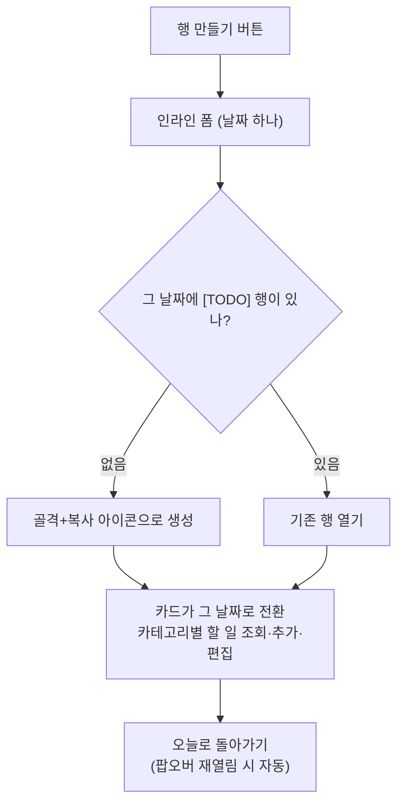
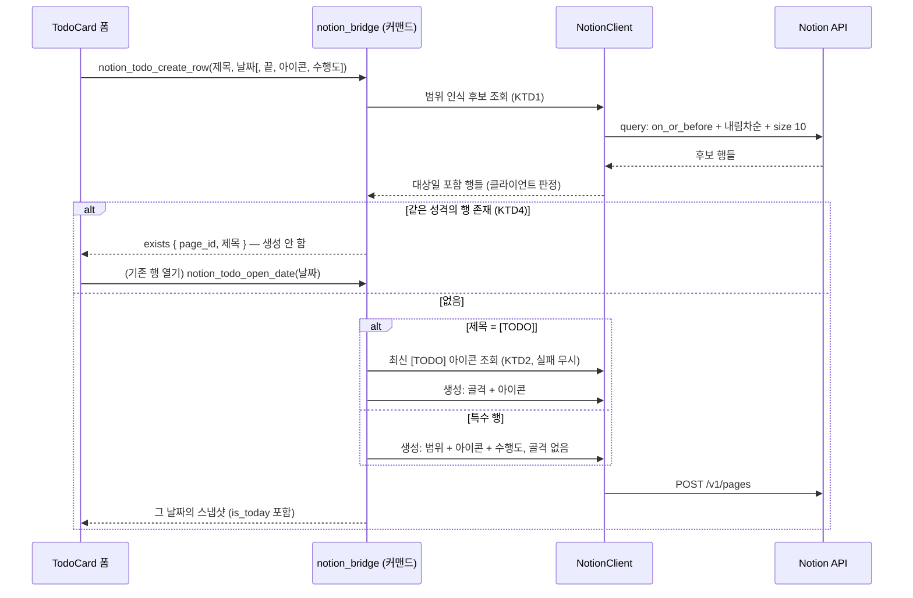

# M2 행 만들기 확장 (미래 [TODO]·카테고리·아이콘 복사) - Plan

## Goal Capsule

- **목표**: TodoCard에 인라인 "행 만들기" 폼을 추가해 계획표 DB에 미래 날짜의 [TODO] 행을 앱 안에서 만들고(2026-08-10 개정: 특수 행 생성은 피드백으로 제거, 공부/기타 카테고리 도입), 생성(또는 기존 행 열기) 직후 카드가 그 날짜 페이지로 전환되어 할 일을 바로 편집한다. 함께 기존 '오늘 페이지 만들기'의 아이콘 누락을 최신 [TODO] 행 아이콘 복사로 고친다. TODO.md에 없는 신규 항목이므로 PRD.md·SERVICES.md·TODO.md 개정을 포함한다.
- **권위 순서**: PRD.md > PRINCIPLE.md > CONVENTIONS.md > 이 플랜. 충돌 시 상위 문서가 이기고, 어긋나면 구현을 멈추고 보고한다.
- **실행 프로필**: 체크박스 2개 = 브랜치·PR 2개 — A `feat/m2-notion-icon-01`(아이콘 복사), B `feat/m2-notion-rowcreate-01`(행 만들기+날짜 전환, A 이후). TDD: 코어 로직·API 파싱은 실패 테스트 먼저, 테스트 이름은 한국어, 픽스처는 전부 가짜 값. 커밋은 한국어 Angular 컨벤션, 유닛 = 커밋.
- **정지 조건**: (a) 실물 DB 스모크에서 범위 행 필터 가정(KTD1)이 설계를 뒤집는 방식으로 어긋날 때, (b) 범위가 자유 날짜 네비게이션·수행도 변경·동기화 루프로 번질 때, (c) 사용자 계정에서만 할 수 있는 작업이 필요할 때 — 멈추고 보고한다.
- **꼬리 작업**: PR은 `.github/TEMPLATE/PR.md` 템플릿, merge는 사용자. 각 PR에 해당 체크박스의 TODO.md 체크와 문서 갱신 포함. 토큰 값은 코드·문서·커밋·로그·픽스처 어디에도 남기지 않는다.
- **열린 블로커**: 없음.

---

## Product Contract

### Summary

TodoCard가 카드 안에서 펼쳐지는 "행 만들기" 폼(날짜 하나)으로 미래 [TODO] 행을 만들고, 만든(또는 이미 있던) 날짜의 페이지로 카드가 전환되어 할 일을 바로 입력한다. 할 일은 공부/기타 카테고리로 나뉘어 보이고 추가 시 카테고리를 골라 해당 헤딩 아래 삽입된다. 기존 '오늘 페이지 만들기'와 폼의 [TODO] 생성은 최신 [TODO] 행의 아이콘을 복사해 붙인다. (2026-08-10 개정: 특수 행 생성은 구현 후 사용 피드백으로 제거 — 아래 Key Decisions 참조.)

### Problem Frame

계획표 DB에는 [TODO] 외에 휴일·MT류 특수 행이 실제로 존재하고(제목 예외 행, 날짜 범위 3건 — SERVICES.md "실제 DB 구조"), 미래 날짜의 할 일을 미리 세팅하는 날도 잦다. 그런데 앱은 오늘 하루만 다루고 행 생성도 오늘 [TODO] 골격뿐이라, 특수 행을 만들거나 미래 할 일을 준비하려면 브라우저로 Notion을 열어야 한다 — PRINCIPLE 2 위반 상태다. 또 앱이 만든 [TODO] 행은 아이콘 없이 생성되어 Notion에서 만든 행과 모양이 다르다.

### Key Decisions

- **인라인 확장 폼.** 진입 버튼을 누르면 TodoCard 안에서 폼이 펼쳐진다 — 뷰 전환도 오버레이 모달도 없다. (session-settled: user-directed — 달력 전체 뷰·오버레이 모달 시안 대비 선택: HTML 프로브 3안을 실제로 조작해 본 뒤 이동 없는 가벼움을 우선했고, 그 대가로 여러 날 일괄 생성을 포기했다.)
- **특수 행 생성 제거, [TODO] 전용 + 카테고리 도입 (2026-08-10 개정).** 휴일·MT 특수 행 생성은 구현 후 실사용 피드백으로 전부 제거하고, 폼은 미래 [TODO] 생성만 남기며, 할 일에 공부/기타 카테고리(헤딩 기준 표시 + 선택 삽입)를 도입한다. legacy 특수 행의 조회·[TODO] 우선 공존 처리는 유지. (session-settled: user-directed — 특수 행 유지 대비: "휴일/MT는 아예 없애자", "공부/기타를 나눌 수가 없어" 피드백.)
- **중복 날짜는 기존 행을 열어 수정한다.** 경고 후 건너뛰기나 차단이 아니라, 이미 있는 행을 알리고 열게 한다. (session-settled: user-directed — 경고·차단 안 대비: Notion과 최대한 비슷하게 동작하기를 원함.)
- **생성·열기 후 그 날짜로 카드 전환.** 미래 할 일을 앱에서 바로 입력하려는 동기가 이 기능의 출발점이므로, 행만 만들고 끝나지 않는다. (session-settled: user-approved — 생성까지만 하고 편집은 후속으로 미루는 안, 정식 날짜 네비게이션 안 대비: 직후 전환 + 오늘 복귀가 최소 범위.)
- **[TODO] 행 아이콘은 최신 [TODO] 행에서 복사한다.** 이모지·외부 URL 타입만 복사하고, file 타입(Notion 업로드 파일, 만료되는 링크)은 기본 이모지로 폴백한다. (session-settled: user-directed — 요청 원문에 복사 대상·타입 규칙·폴백까지 지정됨.)

### Requirements

**행 만들기 폼**

- R1. TodoCard에 "행 만들기" 진입 버튼이 있고, 누르면 카드 안에서 인라인 폼이 펼쳐진다.
- R2. (2026-08-10 개정으로 제거 — 제목 칩·특수 행 분류 없음.)
- R3. (2026-08-10 개정으로 제거 — 특수 행 생성 없음.)
- R4. [TODO] 행은 날짜 하루만 받아 골격(`공부`/`기타` 헤딩) 포함으로 생성하고, 아이콘은 복사 규칙(R9)을 따르며 수행도는 비워 둔다.
- R5. 선택한 날짜에 이미 [TODO] 행이 있으면 생성하지 않고 알림과 함께 "기존 행 열기"를 제공한다. legacy 특수 행만 있는 날의 [TODO] 생성은 정상이다.
- R12. 할 일 목록은 본문 헤딩 기준 카테고리로 나뉘어 보이고(첫 헤딩 전 항목은 미분류), 추가 시 카테고리(기본 공부)를 골라 해당 섹션 끝에 삽입한다. 해당 헤딩이 없으면 본문 끝에 붙인다. (2026-08-10 추가)

**생성·열기 후 날짜 전환**

- R6. 생성 성공 또는 "기존 행 열기" 시 카드가 그 날짜 페이지의 스냅샷으로 전환되고, 조회·추가·토글·편집이 오늘 페이지와 동일하게 동작한다.
- R7. 전환 중에는 보고 있는 날짜를 카드에 표시하고 "오늘로 돌아가기" 버튼을 제공한다. 팝오버를 닫았다 다시 열면 오늘로 복귀한다.

**아이콘 복사**

- R8. 기존 '오늘 페이지 만들기'도 이 기능에서 R9의 아이콘 복사를 적용받는다 (현재는 아이콘 없이 생성).
- R9. [TODO] 행 생성 시 계획표 DB의 가장 최근 [TODO] 행에서 아이콘을 복사한다 — 이모지·외부 URL 타입만 복사하고 file 타입은 기본 이모지로 폴백한다. 아이콘 조회 실패는 생성을 막지 않는다(아이콘 없이 생성).

**신뢰성·문서**

- R10. 쓰기 실패 처리는 기존 규칙을 따른다 — 배너로 원인 표시 + 입력값 유지 + 수동 재시도 + 실패 후 재조회 (docs/plans/2026-08-09-003-feat-m2-notion-todo-plan.md R8). 재시도 큐·주기 검증은 동기화 루프 체크박스 몫이다.
- R11. PRD.md·SERVICES.md에 행 만들기·날짜 전환·아이콘 규칙을 반영하고, TODO.md에 신규 체크박스를 추가한다.

### Key Flows

- F1. (2026-08-10 개정으로 제거 — 특수 행 생성 없음.)
- F2. 미래 [TODO] 준비
  - **Trigger:** 폼에서 미래 하루 선택 후 만들기.
  - **Steps:** 중복 검사([TODO] 행) → 골격+복사 아이콘으로 생성 → 카드 전환 → 카테고리 골라 할 일 입력 → 오늘로 복귀.
  - **Covers:** R1, R4–R7, R9, R12.
- F3. 중복 날짜
  - **Trigger:** 이미 같은 성격의 행이 있는 날짜로 만들기 시도.
  - **Steps:** 생성하지 않고 기존 행 알림 → "기존 행 열기" → 카드 전환.
  - **Covers:** R5, R6.

### Acceptance Examples

- AE1. **Given** 공부 헤딩 아래 2개·기타 아래 1개인 페이지 **When** 카드 조회 **Then** 목록이 공부/기타 라벨로 나뉘어 보이고, 공부 선택 후 추가하면 공부 섹션 끝에 삽입된다. (Covers R12, 2026-08-10 개정)
- AE2. **Given** 행 없는 미래 날짜 **When** 만들기 **Then** 골격과 최신 [TODO] 아이콘이 복사된 행이 생성되고, 전환된 카드에서 할 일을 추가할 수 있다. (Covers R4, R6, R9)
- AE3. **Given** 선택한 날짜에 이미 [TODO] 행 **When** [TODO] 만들기 **Then** 생성 없이 "기존 행 열기"가 제시되고, 열면 그 페이지로 전환된다. (Covers R5, R6)
- AE4. **Given** 그 날짜에 legacy 휴일 행만 있고 [TODO] 없음 **When** 만들기 **Then** 정상 생성된다 — 공존 허용. (Covers R5)
- AE5. **Given** 최신 [TODO] 행 아이콘이 file 타입 **When** [TODO] 생성 **Then** 기본 이모지로 생성된다. (Covers R9)
- AE6. **Given** 미래 날짜 페이지로 전환된 카드 **When** 팝오버를 닫았다 다시 열기 **Then** 오늘 페이지로 복귀한다. (Covers R7)

### Scope Boundaries

- **비목표**: 여러 날 일괄 생성과 미니 달력(인라인 폼 선택으로 제외), 자유로운 날짜 네비게이션(생성·열기 직후 전환만 — ‹ 오늘 › 이동 UI 없음), 기존 행의 속성 편집(제목·아이콘·날짜 변경 — 수행도 변경은 별도 '수행도 4단계 처리' 체크박스), 특수 행 본문 작성, 재시도 큐·주기 검증(동기화 루프 체크박스).
- **Deferred for later**: 정식 날짜 네비게이션, 여러 날 일괄 생성 — 이번 범위의 사용감을 본 뒤 필요하면 별도 항목으로.

### Dependencies / Assumptions

- 기존 M2 조회·쓰기 경로(플랜 003의 카드·커맨드) 위에 얹는다. 현재 커맨드는 전부 오늘 날짜를 하드코딩하므로 날짜 전환은 이 경로의 확장을 요구한다.
- Notion 페이지 생성 API가 이모지·외부 URL 아이콘 지정을 지원한다 (문서 확정 — Planning Contract 리서치).
- `날짜` date 속성에 시작·끝을 함께 쓰면 범위 행이 된다 (문서 확정, 실제 DB에 범위 행 3건 존재).

### Sources

- SERVICES.md "실제 DB 구조" — 특수 행 실물(휴일·MT·vacation), 날짜 범위 3건, 같은 날짜 다중 행 시 [TODO] 우선 규칙.
- src-tauri/src/notion.rs — `create_day_page`(아이콘 미설정, 골격 생성), `find_page_by_date`(date-only equals 필터), 수행도는 연결 검증만.
- src-tauri/src/notion_bridge.rs — 생성 전 날짜 재확인으로 중복 방지, 오늘 날짜를 Rust가 소유.
- src/components/TodoCard.tsx — presentational 카드, 인라인 폼이 들어갈 자리. src/에 모달·오버레이 전례 없음.
- docs/plans/2026-08-09-003-feat-m2-notion-todo-plan.md — R8 쓰기 실패 규칙, KTD9 신뢰성 경계.
- Notion API 문서 — 페이지 생성 `icon`(developers.notion.com/reference/post-page), 아이콘 읽기 타입·file 만료(reference/page, reference/file-object), 날짜 범위 값(reference/page-property-values), 쿼리 정렬·필터(reference/query-a-data-source, reference/filter-data-source-entries), 버전 차이(guides/get-started/upgrade-guide-2026-03-11).

---

## Planning Contract

Product Contract 보존: 본문·R/F/AE ID 변경 없음. 브레인스토밍의 Outstanding Questions 2건(범위 행 필터 시맨틱, TODO.md 체크박스 분할)은 KTD1·KTD6으로 해소되어 섹션을 제거했다.

### Key Technical Decisions

- **KTD1. 하루 행 조회를 범위 인식으로 바꾼다.** Notion 날짜 필터는 범위 값(start+end) 평가를 문서화하지 않았고, 커뮤니티 통설은 "시작일만 비교"다 — `equals`가 기간 중간 날짜를 잡아준다고 기대할 수 없다. 조회를 `on_or_before: 대상일` + `날짜` 내림차순 정렬 + `page_size` 소값(10)으로 바꾸고, 앱에서 `start ≤ 대상일 ≤ (end ?? start)`를 판정한다(YYYY-MM-DD 사전순 비교 = 시간순, 기존 KTD3의 date-only 원칙 유지). 결과: 휴일·MT 기간 중간 날짜에도 그 행이 보이고 R5 중복 검사가 정확해진다. 기존 [TODO] 우선 선택 규칙은 유지. (session-settled: user-approved — equals 유지 + 범위 행 사각지대 수용 대비: 미문서 시맨틱 우회와 기간 중간 가시성 확보를 선택.)
- **KTD2. 아이콘 복사는 쿼리 한 번으로 최신 [TODO] 행에서 읽는다.** `이름` title 필터 `equals "[TODO]"` + `날짜` 내림차순 + `page_size` 1. emoji 타입은 그대로, external 타입은 URL 복사. file(1시간 만료 URL)과 custom_emoji는 기본 이모지 상수(`📝`, 구현 중 교체 가능)로 폴백하고, 아이콘 없음·조회 실패는 아이콘 없이 생성한다 — 조회 실패가 생성을 막지 않는다(R9). (custom_emoji 폴백 확장은 session-settled: user-approved — 복사 범위는 이모지·외부 URL만이라는 확정 유지.)
- **KTD3. "오늘"은 계속 Rust가 소유한다.** 프론트는 날짜를 계산하지 않는다 — 스냅샷에 `is_today`를 실어 내려보내고, 쓰기 커맨드의 날짜 파라미터는 스냅샷이 준 `date`를 그대로 반사한다. 파라미터가 없으면 Rust가 `today_local()`을 쓴다(기존 5개 사용처와 일관).
- **KTD4. 중복 검사는 생성 커맨드 안의 원자 흐름이다.** 폼 입력 중 실시간 검사를 하지 않고 제출 시점에 검사한다(불필요한 쿼리 방지, 기존 `create_page_outcome`의 생성 전 재확인 전례 확장). 같은 성격의 행이 있으면 생성 없이 exists 응답(page_id·제목)을 돌려주고, "기존 행 열기"는 별도 열기 커맨드가 처리한다.
- **KTD5. 수행도는 select name으로 쓴다.** `수행도: {select: {name: "기타"}}` — 4개 옵션은 실물 DB에 전부 존재(SERVICES.md). 특수 행 생성에만 실린다.
- **KTD6. 체크박스 2개, PR 2개로 나눈다.** A: 아이콘 복사(작고 독립, 선행). B: 행 만들기 폼 + 날짜 전환(생성이 아이콘 복사를 쓰므로 A에 의존). "PR 하나 = 체크박스 하나" 규칙에 맞고, B를 더 쪼개면 생성 후 전환이라는 핵심 흐름이 중간 상태로 남는다.

### Assumptions

- 범위 행 필터의 "시작일만 비교" 가정은 문서 미기재(커뮤니티 통설) — U7 dev 스모크에서 실물 DB의 범위 행으로 검증한다. 설령 `equals`가 범위를 잡는다 해도 KTD1의 클라이언트 판정은 무해하다(같은 결과에 수렴).
- 기본 폴백 이모지는 `📝` 상수 — 실물 DB 템플릿과 어울리지 않으면 구현 중 상수만 교체한다.
- API 버전 `2025-09-03` 유지 — 이번 기능 표면(날짜 필터·아이콘·정렬·생성)은 2026-03-11과 차이가 없다.

### High-Level Technical Design

행 생성 커맨드의 흐름 (방향 제시용 — 구현 명세가 아니다):

프론트 날짜 컨텍스트는 새 상태가 아니라 `todoSnapshot.date`/`is_today` 파생이다. 팝오버 재표시의 `visibilitychange → refreshTodos()`(오늘 조회)가 그대로 R7의 "재열림 시 오늘 복귀"를 구현한다 — 새 메커니즘을 만들지 않는다.

---

## Implementation Units

체크박스 A — 아이콘 복사 (`feat/m2-notion-icon-01`)

### U1. 아이콘 조회·아이콘 지정 생성 코어 (TDD)

- **Goal**: 최신 [TODO] 행의 아이콘을 읽고, 생성 시 아이콘을 실을 수 있는 코어가 완성된다.
- **Requirements**: R9. KTD2.
- **Dependencies**: 없음.
- **Files**: `src-tauri/src/notion.rs`.
- **Approach**: `latest_todo_icon(token, data_source_id)` — 쿼리 body: `이름` title 필터 `equals "[TODO]"` + `날짜` 내림차순 정렬 + `page_size` 1. 아이콘 JSON → 내부 표현(emoji / external URL / 폴백 필요 / 없음) 변환은 순수 함수로 분리해 HTTP 없이 테스트한다. 정책: file·custom_emoji → 기본 이모지 상수, 없음·조회 오류 → None(오류를 전파하지 않는다). `create_day_page`에 선택적 아이콘 파라미터를 추가하고, 있으면 생성 body 최상위 `icon`에 싣는다.
- **Test scenarios**:
  - 최신_TODO_행_쿼리_body가_제목_필터와_날짜_내림차순으로_전송된다 (wiremock body 매처)
  - emoji_아이콘은_그대로_복사된다
  - external_아이콘은_url로_복사된다
  - file_아이콘은_기본_이모지로_폴백한다 — Covers AE5의 백엔드 절반.
  - custom_emoji_아이콘도_기본_이모지로_폴백한다
  - 아이콘_없는_행과_빈_결과는_None을_돌려준다
  - 조회_실패는_오류_대신_None으로_수렴한다
  - 아이콘이_있으면_생성_body에_icon이_포함되고_없으면_생략된다
- **Verification**: `cargo test` 통과. 실제 API 호출 없음.

### U2. '오늘 페이지 만들기' 아이콘 적용 + 문서 A

- **Goal**: 오늘 페이지 생성이 아이콘을 복사하고, 체크박스 A가 완결된다.
- **Requirements**: R8, R9, R11 일부. KTD2.
- **Dependencies**: U1.
- **Files**: `src-tauri/src/notion_bridge.rs`, `TODO.md`, `SERVICES.md`.
- **Approach**: `create_page_outcome`이 생성 전에 `latest_todo_icon`을 호출해 결과를 생성에 전달한다. 아이콘 조회 실패는 무시하고 생성을 진행한다. 문서: TODO.md에 체크박스 A를 추가하고 체크, SERVICES.md 생성 규칙에 아이콘 복사 서술 추가.
- **Test scenarios**:
  - 생성_시_최신_TODO_아이콘이_복사된다 (wiremock: 쿼리 + 생성 body 매처)
  - 아이콘_조회가_실패해도_페이지는_생성된다 — Covers AE5.
- **Verification**: `cargo test`·`npm test` 전체 통과, dev 스모크로 실물 생성 1회 확인, PR A 오픈.

체크박스 B — 행 만들기 + 날짜 전환 (`feat/m2-notion-rowcreate-01`)

### U3. 범위 인식 조회 + 범용 생성 코어 (TDD)

- **Goal**: 하루 조회가 범위 행을 인식하고, 임의 제목·범위·수행도·아이콘으로 생성하는 코어가 완성된다.
- **Requirements**: R3, R5의 백엔드 절반. KTD1, KTD5.
- **Dependencies**: U1 (아이콘 파라미터 재사용).
- **Files**: `src-tauri/src/notion.rs`.
- **Approach**: `find_page_by_date`의 내부 쿼리를 KTD1 방식(on_or_before + 내림차순 + page_size 10)으로 바꾸고, 반환을 대상일 포함 후보 목록(page_id·제목)으로 확장한다 — 기존 [TODO] 우선 선택은 그 위에서 유지. 날짜 포함 판정은 순수 함수(YYYY-MM-DD 문자열 비교). 생성은 `create_day_page`를 일반화: 제목·시작·끝(선택)·아이콘(선택)·수행도(선택)·골격 여부를 받는다. 기존 호출부는 [TODO] 기본값으로 동작 불변.
- **Test scenarios**:
  - 조회_body가_on_or_before_필터와_내림차순_정렬로_전송된다 (기존 equals 테스트 대체)
  - 범위_행은_기간_중간_날짜에도_후보에_포함된다
  - 기간이_끝난_과거_행은_후보에서_제외된다
  - 끝_없는_행은_시작일에만_매칭된다
  - 후보가_여럿이면_TODO_제목_행을_우선_선택한다 (기존 유지)
  - 특수_행_생성_body에_제목_범위_아이콘_수행도가_실린다 — Covers AE1의 백엔드 절반.
  - 골격_없는_생성은_children을_보내지_않는다
- **Verification**: `cargo test` 통과.

### U4. 커맨드·스냅샷 확장 (TDD)

- **Goal**: 행 생성/열기 커맨드, `is_today` 스냅샷, 쓰기 커맨드의 날짜 파라미터가 생긴다.
- **Requirements**: R4–R7의 백엔드. KTD3, KTD4.
- **Dependencies**: U2, U3.
- **Files**: `src-tauri/src/notion_bridge.rs`, `src-tauri/src/lib.rs`.
- **Approach**: `TodoSnapshot`의 no_page·loaded에 `is_today` 필드 추가(오늘 판정은 Rust). 새 커맨드 `notion_todo_open_date(date)` — `snapshot_by_date` 재사용. 새 커맨드 `notion_todo_create_row` — 같은 성격 중복 검사(KTD4: [TODO]면 [TODO] 제목, 특수면 같은 제목) 후 exists 응답 또는 생성([TODO]: 골격+아이콘 / 특수: 범위+수행도) → 그 날짜 스냅샷 반환. 기존 add/toggle/edit 커맨드에 선택적 날짜 파라미터(재조회용, 없으면 `today_local()`). `lib.rs`에 커맨드 등록. 안내 문구는 기존 상수 전례(`TODO_PAGE_EXISTS_NOTICE` 등)를 따른다.
- **Test scenarios**:
  - 같은_날짜에_TODO_행이_있으면_생성_없이_exists를_돌려준다 (`POST /v1/pages` `.expect(0)`) — Covers AE3의 백엔드 절반.
  - 다른_성격_행만_있으면_정상_생성한다 — Covers AE4.
  - 특수_행_생성_후_그_날짜_스냅샷을_돌려준다 — Covers AE1.
  - TODO_생성은_골격과_복사_아이콘을_포함한다 — Covers AE2의 백엔드 절반.
  - open_date가_그_날짜_스냅샷을_돌려준다
  - 스냅샷_is_today가_날짜에_따라_직렬화된다 (serde 테스트)
  - 쓰기_커맨드가_전달된_날짜로_재조회한다
- **Verification**: `cargo test` 통과.

### U5. 프론트 래퍼·타입 확장 (TDD)

- **Goal**: 새 커맨드와 확장 타입이 프론트에서 호출 가능해진다.
- **Requirements**: R6, R7의 배선 전제.
- **Dependencies**: U4.
- **Files**: `src/lib/notion.ts`, `src/lib/notion.test.ts`.
- **Approach**: `TodoSnapshot`에 `is_today` 반영, `createTodoRow`·`openTodoDate` 래퍼 추가, add/toggle/edit에 날짜 전달(스냅샷의 `date` 반사 — KTD3). 기존 한 줄 `invoke` 래퍼 패턴 유지.
- **Test scenarios**:
  - create_row_인자가_커맨드에_그대로_전달된다 (`captureIPC` 패턴)
  - open_date_인자가_커맨드에_그대로_전달된다
  - 쓰기_래퍼가_날짜를_전달한다
- **Verification**: `npm test` 통과.

### U6. TodoCard 인라인 폼 + 날짜 전환 UI

- **Goal**: 사용자가 폼으로 행을 만들고, 그 날짜 페이지를 편집하고, 오늘로 돌아올 수 있다.
- **Requirements**: R1, R2, R3·R4의 UI, R5의 UI, R6, R7, R10.
- **Dependencies**: U5.
- **Files**: `src/components/TodoCard.tsx`, `src/components/TodoCard.test.tsx`, `src/App.tsx`, `src/App.css`.
- **Approach**: 헤더에 "행 만들기" 버튼(HTML 프로브 A안) → 카드 하단 인라인 폼: 제목 칩([TODO]·휴일·MT)+직접 입력, [TODO]면 날짜 하루만(아이콘·수행도 숨김), 특수면 아이콘·범위 토글·수행도 노출. 제출은 `runTodoCommand(createTodoRow)` 경로 — busy 중 폼 입력 비활성(기존 타이핑 유실 방지 전례), 실패 시 입력 유지(R10). exists 응답이면 폼 안에 기존 행 안내 + "기존 행 열기" 버튼(`openTodoDate`). `is_today`가 아니면 헤더에 날짜 표시 + "오늘로 돌아가기"(기존 `refreshTodos` 재사용). 팝오버 재표시의 기존 재조회가 오늘 복귀를 겸한다 — 별도 처리 없음. CSS: 칩·폼 스타일 신설(다크 모드 미러 포함), 팝오버 360px 폭 안에서 한 줄 구성.
- **Test scenarios**:
  - TODO_칩에서는_아이콘과_수행도_필드가_숨겨진다
  - 특수_칩에서는_범위_토글과_수행도가_보인다
  - busy_중_폼_입력이_비활성화된다
  - 실패_시_폼_입력값이_유지된다
  - exists_응답이_기존_행_열기_버튼을_보여준다 — Covers AE3의 UI 절반.
  - 열기_클릭이_open_date를_호출하고_스냅샷으로_전환된다 — Covers AE6 전반부.
  - 오늘이_아닌_스냅샷에서_날짜와_돌아가기_버튼이_보인다
  - 돌아가기_클릭이_오늘_목록을_재조회한다
  - 팝오버_재표시_시_오늘로_복귀한다 (App 통합 테스트, 기존 재표시 테스트 확장) — Covers AE6.
- **Verification**: `npm test` 통과, dev 스모크로 폼 조작 확인.

### U7. 문서 최신화 B + 실물 검증

- **Goal**: 기능·범위 변화가 문서에 반영되고, 범위 필터 가정이 실물로 검증된다.
- **Requirements**: R11. Assumptions의 범위 필터 검증.
- **Dependencies**: U6.
- **Files**: `TODO.md`, `SERVICES.md`, `PRD.md`.
- **Approach**: PRD §5.2에 행 만들기·날짜 전환을 추가, SERVICES.md의 조회·생성 규칙 갱신(범위 인식 조회, 특수 행 생성), TODO.md 체크박스 B 체크. dev 스모크에서 실물 DB의 범위 행(3건 중 하나)이 기간 중간 날짜 조회에 잡히는지 확인해 KTD1 가정을 검증한다 — 어긋나면 정지 조건 (a).
- **Test scenarios**: Test expectation: none — 문서 변경.
- **Verification**: 문서 diff 확인, 두 테스트 러너 최종 전체 통과, AE1~AE6 dev 스모크 재현, PR B 오픈.

---

## Verification Contract

| 게이트 | 명령 | 적용 |
|---|---|---|
| Rust 단위 테스트 | `cd src-tauri && cargo test` | U1~U4, 각 PR 전 전체 통과 |
| 프론트 단위 테스트 | `npm test` | U5~U6, 각 PR 전 전체 통과 |
| 개발 스모크 | `npm run tauri dev` | U2(아이콘 실물 확인), U7(AE1~AE6 재현 + 범위 필터 가정 검증) |
| 팝오버 수동 체크 | — | 폼이 360px 폭에서 깨지지 않는지, 다크 모드 확인 |

번들 검증(`.app`)은 알림·Keychain UX 변경이 없으므로 생략한다. 실제 Notion API는 dev 스모크에서만 호출하고 테스트는 전부 wiremock·가짜 픽스처다.

---

## Definition of Done

- R1~R11 충족, AE1~AE6 재현 확인(dev 스모크).
- `cargo test`·`npm test` 전체 통과. 코어 로직(U1, U3~U5)은 테스트가 먼저 작성된 커밋 이력(TDD)을 가진다.
- 토큰 값·실제 페이지 내용이 코드·문서·커밋·로그·픽스처 어디에도 없다(픽스처는 가짜 값).
- 기존 오늘 조회·쓰기 동작이 변하지 않았다(기존 테스트 전체 통과 + 범위 인식 조회로 대체된 쿼리 테스트만 갱신).
- 체크박스 A는 `feat/m2-notion-icon-01`, B는 `feat/m2-notion-rowcreate-01`에서 한국어 Angular 컨벤션 커밋, 각각 `.github/TEMPLATE/PR.md` 템플릿으로 PR 오픈(merge는 사용자). PR 하나가 체크박스 하나를 넘지 않는다.
- 각 PR에 해당 몫의 TODO.md 체크·SERVICES.md/PRD.md 갱신이 포함된다.
- 실험하다 버린 코드·미사용 스캐폴딩·디버그 출력이 diff에 없다.
