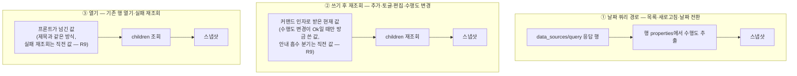

# M2 수행도 4단계 처리 (하루 단위 Select) - Plan

## Goal Capsule

- **목표**: 카드에서 보고 있는 날짜의 `수행도`(완료/일부/미완/기타)를 표시하고 즉시 바꾼다. 값이 없는 날은 "미지정"으로 보이고 거기서 지정할 수 있다. TODO.md M2 체크박스 "수행도 4단계(완료/일부/미완/기타) 처리 — 하루 단위 `수행도` Select" 하나를 끝낸다.
- **권위 순서**: PRD.md > PRINCIPLE.md > CONVENTIONS.md > 이 플랜. 충돌 시 상위 문서가 이기고, 어긋나면 구현을 멈추고 보고한다.
- **실행 프로필**: 브랜치 `feat/m2-notion-perf-01` (`main`에서 신규 — #6·#7·#8·#9 머지 완료 상태). TDD: 코어 로직·API 파싱은 실패 테스트 먼저, 테스트 이름은 한국어, 픽스처는 전부 가짜 값. 커밋은 한국어 Angular 컨벤션, 유닛 = 커밋.
- **정지 조건**: (a) 실물 DB의 `수행도` select 옵션 목록이 기대 4개(완료/일부/미완/기타)와 다를 때 — 값 분포가 아니라 스키마의 옵션 목록 기준이며, U1에서 확인할 수 있으면 스모크까지 미루지 않는다. (b) 범위가 동기화 검증 루프·통계 뷰로 번질 때 — 멈추고 보고한다.
- **꼬리 작업**: PR은 `.github/TEMPLATE/PR.md` 템플릿, merge는 사용자. TODO.md 체크·문서 갱신을 같은 PR에 포함. 토큰 값은 코드·문서·커밋·로그·픽스처 어디에도 남기지 않는다.
- **열린 블로커**: 없음.

---

## Product Contract

### Summary

카드가 보고 있는 날짜의 수행도를 헤더 아래 한 줄로 보여주고, 4개 중 하나를 누르면 즉시 그 날짜 행에 저장한다. 값이 없는 날은 "미지정"으로 표시하고 거기서 바로 지정한다.

### Problem Frame

`수행도`는 계획표 DB가 원래 갖고 있던 Select 속성이고 그 행이 덮는 기간 전체의 달성도를 뜻한다. 행은 보통 하루지만 항상 그런 것은 아니다 — 실물 DB에는 `날짜` 범위를 쓰는 행이 3건 있고(SERVICES.md), `[TODO]` 행이 없는 휴가날에는 카드가 그 범위 행을 띄운다. 앱은 연결 검증에서 이 속성의 타입만 확인할 뿐 읽지도 쓰지도 않아, 하루를 마감하며 수행도를 남기려면 브라우저로 Notion을 열어야 한다 — PRINCIPLE 2 위반 상태다. 게다가 앱이 만든 `[TODO]` 행은 수행도를 비워 두므로(플랜 004 결정), 앱으로 만든 날일수록 비어 있는 채로 남는다.

### Requirements

**표시**

- R1. 카드가 보고 있는 날짜를 덮는 행의 수행도를 4단계 중 현재 값으로 표시한다. 값이 없으면 "미지정" 상태로 보인다.
- R2. 오늘이 아닌 날짜로 전환된 상태에서도 그 날짜를 덮는 행의 값을 표시한다 — legacy 휴일 행처럼 `[TODO]`가 아닌 행도 동일하다.
- R10. 그 행이 날짜 범위를 덮으면(`날짜`에 끝이 있으면) 적용 구간을 함께 표시한다 — 하루가 아니라 기간 전체가 바뀐다는 사실이 누르기 전에 보여야 한다.

**변경**

- R3. 4개 중 하나를 누르면 확인 단계 없이 즉시 그 행의 `수행도`에 저장한다. 한 번 지정한 값을 "미지정"으로 되돌리는 조작은 앱에 없다 — 다른 값으로 바꾸는 것만 가능하다(KTD3).
- R4. 이미 선택된 값을 다시 누르면 아무 요청도 보내지 않는다.
- R5. 앱은 스키마에 있는 4개 옵션 이름만 보낸다 — 사용자 자유 입력을 이 속성에 보내지 않는다.
- R6. 쓰기 진행 중에는 수행도 버튼이 비활성이다.

**신뢰성·문서**

- R7. 쓰기 실패는 기존 규칙을 따른다 — 배너로 원인 표시 + 실패 후 1회 재조회(현재 보고 있는 날짜 기준). 재시도 큐·주기 검증은 동기화 루프 체크박스 몫이다 (docs/plans/2026-08-09-003-feat-m2-notion-todo-plan.md R8).
- R9. 저장이 확인되지 않은 값을 선택된 것처럼 보여주지 않는다 — 쓰기가 실패했거나(오류·안내 흡수 포함) 실패 후 재조회를 탄 경우 화면의 수행도는 **직전 표시값**으로 남고, 방금 시도한 값이 선택된 채로 남지 않는다.
- R8. TODO.md 체크박스를 체크하고, PRD.md·SERVICES.md에 수행도 표시·변경 동작을 반영한다.

### Acceptance Examples

- AE1. **Given** 수행도가 `일부`인 오늘 행 **When** 팝오버를 열면 **Then** 수행도 줄에서 `일부`가 선택된 상태로 보인다. (Covers R1)
- AE2. **Given** 수행도가 비어 있는 행 **When** 카드를 보면 **Then** "미지정"으로 보이고 4개 버튼 중 아무것도 선택돼 있지 않다. (Covers R1)
- AE3. **Given** 미지정 상태 **When** `완료`를 누르면 **Then** 그 페이지의 `수행도`가 `완료`로 저장되고 화면도 `완료`로 바뀐다. (Covers R3)
- AE4. **Given** `완료`가 선택된 상태 **When** `완료`를 다시 누르면 **Then** 네트워크 요청이 발생하지 않는다. (Covers R4)
- AE5. **Given** 미래 날짜로 전환된 카드 **When** `미완`을 누르면 **Then** 오늘이 아니라 그 날짜를 덮는 행에 저장되고 카드는 그 날짜에 머문다. (Covers R2, R3)
- AE8. **Given** 8/13을 보고 있고 그 날짜를 덮는 행이 `휴일 8/12~8/14` **When** 카드를 보면 **Then** 수행도 줄에 적용 구간(8/12~8/14)이 함께 보여 사흘 전체가 바뀐다는 것을 누르기 전에 알 수 있다. (Covers R10)
- AE6. **Given** 오늘 화면에서 수행도 쓰기가 실패 **When** 버튼을 누르면 **Then** 배너에 원인이 뜨고 그 날짜 행이 1회 재조회되어 목록과 수행도가 원격 값으로 돌아온다. (Covers R7)
- AE7. **Given** 오늘이 아닌 날짜로 전환된 화면에서 수행도 쓰기가 실패 **When** 버튼을 누르면 **Then** 배너가 뜨고 목록은 재조회되지만 수행도는 직전 표시값을 유지한다 — 시도한 값이 선택된 채로 남지 않는다. (Covers R7, R9)

### Scope Boundaries

- **비목표**: 할 일 체크 상태로 수행도를 자동 산출·제안하는 기능(판단은 사용자 몫 — PRINCIPLE 1), 수행도를 "미지정"으로 되돌리는 해제 조작(대가는 KTD3에 적었다 — 앱이 만든 미지정 행에서 오클릭하면 앱에서는 복구할 수 없고 Notion에서 지워야 한다), 옵션 목록을 스키마에서 읽어 캐시하는 것(이번엔 상수를 쓰고 U1에서 일치만 확인한다), 범위 행을 읽기 전용으로 막는 것(적용 구간을 표시해 오해만 없앤다 — R10), 수행도 통계·차트(Notion의 기존 도넛 차트가 담당 — SERVICES.md), 변경 이력·알림, 새 페이지 생성 시 기본 수행도 지정(플랜 004에서 비워 두기로 확정), 수행도 기준 필터·정렬 조회, 재시도 큐·주기 검증(동기화 루프 체크박스).

#### Deferred to Follow-Up Work

- `open_page` 커맨드가 페이지 제목을 프론트에서 받아 되돌려주는 현재 구조 — 페이지 조회(GET)로 제목·수행도를 함께 얻으면 파라미터 하나를 없앨 수 있으나, 이번 범위에서는 기존 전례(threading)를 따르고 손대지 않는다.

### Dependencies / Assumptions

- 실물 DB의 `수행도` select **옵션 목록**이 정확히 `완료`/`일부`/`미완`/`기타` 넷이다. 근거로 삼은 SERVICES.md 기록(80행이 완료 51 / 일부 23 / 기타 5 / 미완 1)은 *쓰인 값*의 분포이지 스키마의 옵션 목록이 아니다 — 쓰이지 않은 5번째 옵션이 있을 수 있고, 그런 값을 가진 행은 4개 버튼 중 어느 것도 눌리지 않아 미지정과 구분되지 않는다. 옵션 목록은 연결 검증이 받는 스키마 응답의 `수행도.select.options`에 이미 들어 있으므로, U1 착수 시 그 응답을 한 번 확인해 넷과 일치하는지 본다(불일치면 정지 조건 (a)).
- 한글 속성 키(`수행도`)를 JSON `properties` 키로 그대로 쓸 수 있다 — 가정이 아니라 이미 증명된 사실이다: `create_day_page`가 같은 직렬화로 `"날짜"` 키를 보내 행을 만들고 있고 플랜 004 스모크로 검증됐다. PATCH도 같은 경로다.
- `수행도` 속성 타입은 `select`다 — `validate_schema`가 연결 시점에 이미 강제하므로 `status` 타입 분기는 존재할 수 없다.

---

## Planning Contract

### Key Technical Decisions

- **KTD1. 수행도는 스냅샷이 나르는 "페이지 메타"로 다루고, 스냅샷을 만드는 경로마다 가장 싼 방법으로 채운다 — 단 확인되지 않은 값은 절대 에코하지 않는다(R9).** 날짜 쿼리 경로(`snapshot_by_date`)는 이미 받아 온 행 JSON에서 값을 뽑는다(추가 요청 0). 쓰기 후 재조회(`snapshot_after_write`)와 열기(`open_page_outcome`)는 children만 보므로 **호출자가 아는 값을 넘긴다** — 페이지 제목(`page_title`)을 이미 같은 방식으로 나르고 있는 전례를 그대로 따른다. 정상 경로에서는 새 GET 요청이 하나도 늘지 않는다. 대가는 두 가지다. ① 팝오버가 열려 있는 동안 Notion 쪽에서 수행도를 바꾸면 다음 재조회까지 낡은 값이 보인다 — 제목과 동일한 성질이라 새 위험이 아니다. ② 에코는 "저장됐다"를 증명하지 못하므로 **쓰기가 확인되지 않은 경로에서는 새 값을 싣지 않는다**: `finish_write`가 `NotFound`/`Conflict`를 안내로 흡수하는 분기와 프론트의 실패 재조회 경로는 직전 값을 유지한다(R9, AE7).
- **KTD2. 앱은 4개 고정 옵션 이름만 보낸다.** Notion `select`는 스키마에 없는 이름을 받으면 400을 내지 않고 **조용히 새 옵션을 만든다**(공식 문서 확인). 사용자 자유 입력이 이 속성에 닿으면 DB 스키마가 오염되므로, UI는 4개 버튼만 제공하고 커맨드도 4개 이외의 값을 거부한다. 목록은 Rust와 TS 양쪽에 존재할 수밖에 없다(언어 경계) — **Rust 상수가 권위**이고 UI 목록은 표시용 사본이며, 둘이 어긋나도 Rust 가드가 최종 방어선이다. 표시 순서는 달성도 순(완료·일부·미완·기타)으로 맞춘다.
- **KTD3. 해제(미지정으로 되돌리기)는 넣지 않는다 — 대가를 알고 받아들인다.** `{"select": null}`로 가능하다는 것은 확인했지만(문서) 넣지 않는다. 솔직한 대가: 앱이 매일 다루는 행은 대부분 미지정에서 출발하므로(플랜 004에서 생성 시 비워 두기로 확정), 즉시 저장(KTD4)과 겹쳐 **오클릭 확률이 가장 높은 상태가 유일하게 앱에서 복구 불가능한 상태**다. 그래도 넣지 않는 이유는 되돌리기 자체가 또 다른 오조작 경로이고, 실사용에서 "미지정으로 되돌리고 싶다"는 동기가 약하기 때문이다 — 필요하면 Notion에서 지운다. R3에 이 제약을 명시한다. 같은 값 재클릭은 해제가 아니라 무동작이다(R4). (session-settled: user-approved — 재클릭 해제 안 대비.)
- **KTD4. 고르면 즉시 저장한다.** 확인 단계를 두지 않는다 — 체크박스 토글과 같은 감각이고, 잘못 눌러도 다른 값을 다시 누르면 끝난다. (session-settled: user-approved — 확인 단계를 두는 안 대비: 토글 전례와 같은 즉시성을 선택.)
- **KTD5. 자동 산출·제안을 넣지 않는다.** 할 일 체크 상태에서 수행도를 유추하지 않고 사용자가 직접 고른다. (session-settled: user-approved — 체크 상태 기반 자동 설정·제안 안 대비: 하루 달성도 판단은 사용자 몫이라는 원칙.)
- **KTD6. 속성 키는 이름(`수행도`)을 그대로 쓴다.** 제목 속성만 키가 DB마다 달라 타입 탐색이 필요했고(`title_property_key`), `날짜`·`수행도`는 `validate_schema`가 이미 이름으로 검증하고 있다 — 같은 규칙을 따른다.
- **KTD7. API 버전은 `2025-09-03`을 유지한다.** 페이지 속성 업데이트 계약은 `2026-03-11`과 차이가 없음을 문서로 확인했다(변경은 block append `after`→`position`, `archived`→`in_trash`, transcription 블록뿐). 승격은 기존 후속 항목 그대로 별도 작업이다.

### High-Level Technical Design

수행도가 스냅샷에 채워지는 세 경로 (KTD1):



수행도 쓰기 자체는 기존 블록 쓰기와 같은 모양의 부분 PATCH다 — 대상만 블록이 아니라 페이지다:

```text
PATCH /v1/pages/{page_id}
{ "properties": { "수행도": { "select": { "name": "완료" } } } }
```

부분 `properties`는 나머지 속성을 건드리지 않는다(문서 확인). 응답은 버리고 기존 `finish_write` 흐름으로 재조회한다.

---

## Implementation Units

### U1. 수행도 읽기·쓰기 코어 (TDD)

- **Goal**: 행 JSON에서 수행도를 뽑는 순수 함수와, 페이지의 `수행도`를 바꾸는 클라이언트 메서드가 생긴다.
- **Requirements**: R1, R2, R3, R5. KTD1, KTD2, KTD6, KTD7.
- **Dependencies**: 없음.
- **Files**: `src-tauri/src/notion.rs`.
- **Approach**: 착수 시 연결 검증이 받는 data source 스키마 응답의 `수행도.select.options`를 한 번 확인해 옵션 목록이 기대 넷과 같은지 본다(Assumptions·정지 조건 (a) — 코드로 캐시하지는 않는다). `row_date_range`(같은 파일)와 같은 모양의 순수 추출 함수를 더한다 — `properties.수행도.select.name`이 문자열이면 `Some`, `select`가 `null`이거나 속성이 없으면 `None`. `RowInWindow`에 그 값을 담는 필드를 추가하고 `rows_from_query_response`가 채운다. `find_rows_covering_date`가 `(page_id, title)` 튜플로 축소하는 지점과 `pick_day_page`의 후보 타입이 수행도까지 나르도록 넓힌다 — `find_page_by_date`의 반환도 함께 넓어진다(호출부는 U2에서 맞춘다). 쓰기는 `set_todo_checked`와 같은 골격의 새 메서드: `PATCH /v1/pages/{page_id}`에 부분 properties body, 응답은 버리고 `Ok(())`. 허용 옵션 4개는 이 모듈의 상수로 두고, 목록에 없는 값은 HTTP 이전에 거부한다(`plain_rich_text`의 길이 선검사와 같은 자리).
- **Execution note**: 추출 함수와 옵션 검증은 순수 로직이니 실패 테스트를 먼저 쓰고, PATCH body는 wiremock 정확 매칭으로 고정한다.
- **Patterns to follow**: `row_date_range`·`page_title`(추출), `set_todo_checked`·`set_todo_text`(부분 PATCH + 응답 폐기), `plain_rich_text`(HTTP 전 선검사), `rows_from_query_response`(행 → 구조체).
- **Test scenarios**:
  - 행에서_수행도_이름을_뽑는다 (`select.name`이 "일부"인 행)
  - select가_null이거나_속성이_없으면_None이다 (두 케이스)
  - select_구조가_예상과_다르면_None이다 (name이 문자열이 아님)
  - 수행도_쓰기_body가_부분_properties로_전송된다 (wiremock `body_json` 정확 매칭 — `{"properties":{"수행도":{"select":{"name":"완료"}}}}`)
  - 허용되지_않은_수행도_값은_요청_없이_거부된다 (`.expect(0)`로 PATCH 미발생 확인) — Covers R5.
  - 쓰기_실패는_기존_오류_매핑을_따른다 (409 → Conflict 등 `error_from_code` 경유)
- **Verification**: `cargo test` 통과. 실제 API 호출 없음.

### U2. 스냅샷 확장과 수행도 변경 커맨드 (TDD)

- **Goal**: 스냅샷이 수행도와 적용 구간을 나르고, 프론트가 부를 수 있는 변경 커맨드가 생긴다.
- **Requirements**: R1, R2, R3, R6, R7, R9, R10. KTD1, KTD2.
- **Dependencies**: U1.
- **Files**: `src-tauri/src/notion_bridge.rs`, `src-tauri/src/lib.rs`.
- **Approach**: `TodoSnapshot::Loaded`에 수행도 필드와 적용 구간 끝 날짜 필드를 더한다(둘 다 `Option<String>`; `NoPage`는 페이지가 없으니 대상 아님). 끝 날짜는 U1이 넓힌 조회 결과의 `RowInWindow.end`를 그대로 싣고, 없으면 하루 행이다(R10) — 다른 경로도 수행도와 같은 방식으로 나른다. `snapshot_by_date`는 U1이 넓힌 조회 결과에서 값을 그대로 싣고, `snapshot_after_write`·`open_page_outcome`은 인자로 받은 값을 싣는다 — `page_title`이 이미 같은 방식으로 흐르고 있으니 그 옆에 나란히 붙인다(KTD1). 기존 쓰기 커맨드 세 개(add/toggle/edit)도 현재 수행도를 받아 되돌려주도록 인자를 늘린다. **Loaded를 만드는 지점을 빠짐없이 훑어야 한다** — `create_page_outcome`은 두 곳에서 만든다: 생성 전 재확인에서 기존 행을 찾은 조기 반환 분기는 `find_page_by_date`가 돌려준 값을 싣고(이미 손에 있다), 실제로 생성한 분기와 `create_row_outcome`의 Created 분기만 `None`이다(갓 만든 행이라 값이 없다 — 생성 body에 수행도를 넣지 않는 플랜 004 결정은 그대로). `create_row_outcome`의 `Exists` 분기는 이미 `RowInWindow`를 손에 쥐고 있으므로 `CreateRowOutcome::Exists`에 수행도 필드를 더해 그 값을 실어 보낸다 — 프론트의 "기존 행 열기"가 넘길 값이 여기서 나온다. 새 커맨드는 나머지와 같은 골격 — `todo_access` → 클라이언트 → U1의 쓰기 → `resolve_write_date` → `finish_write`이고, 재조회 스냅샷에는 쓰기가 `Ok`일 때만 방금 쓴 값을, `NotFound`/`Conflict`를 안내로 흡수한 분기에서는 호출자가 넘긴 직전 값을 싣는다(R9) — `finish_write`가 두 값을 구분해 받도록 인자를 나눈다.
- **Execution note**: 커맨드 인자가 늘어나는 변경이라 직렬화 테스트(스냅샷 JSON 모양)를 먼저 고정하고 나서 흐름을 고친다.
- **Patterns to follow**: `notion_todo_toggle`(커맨드 골격), `finish_write`(쓰기 후 재조회·안내 문구), `resolve_write_date`, 안내 문구 상수들, `lib.rs`의 `generate_handler!` 등록 목록.
- **Test scenarios**:
  - 스냅샷이_수행도를_snake_case로_직렬화한다 (값 있음·없음 두 케이스)
  - 날짜_조회_스냅샷이_행의_수행도를_싣는다 (wiremock 쿼리 응답에 `수행도` 포함 픽스처) — Covers AE1, AE2.
  - 범위_행_스냅샷이_적용_구간_끝을_싣는다 (start≠end인 행) — Covers AE8.
  - 수행도_변경_후_스냅샷에_새_값이_실린다 (PATCH 1회 + children 재조회) — Covers AE3.
  - 전환된_날짜의_수행도를_그_날짜_행에_쓴다 (오늘이 아닌 date 인자 → 재조회가 그 날짜 기준) — Covers AE5.
  - 갓_만든_페이지의_스냅샷은_수행도가_없다 (`create_page_outcome`의 생성 분기, `create_row_outcome`의 Created 분기)
  - 이미_있는_페이지를_불러오면_그_행의_수행도가_실린다 (`create_page_outcome`의 재확인 조기 반환 분기)
  - exists_응답이_그_행의_수행도를_싣는다 (`create_row_outcome`의 Exists 분기)
  - 충돌로_안내가_붙은_스냅샷은_직전_수행도를_유지한다 (409 → `TODO_STALE_NOTICE` + 시도값 아님) — Covers R9.
  - 허용되지_않은_값은_커맨드에서_오류로_돌아온다 (PATCH `.expect(0)`)
  - 쓰기_실패는_오류_메시지로_전달된다 (500 → Err)
  - 쓰기_성공_후_재조회_실패는_안내를_돌려준다 (기존 `TODO_WRITE_REFRESH_FAILED_NOTICE` 경로가 그대로 동작)
- **Verification**: `cargo test` 통과. 기존 테스트가 새 필드·인자에 맞게 갱신되고 전부 녹색.

### U3. 프론트 래퍼·타입 확장 (TDD)

- **Goal**: 새 커맨드와 확장된 스냅샷 타입을 프론트에서 쓸 수 있다.
- **Requirements**: R1, R3의 배선 전제.
- **Dependencies**: U2.
- **Files**: `src/lib/notion.ts`, `src/lib/notion.test.ts`.
- **Approach**: `TodoSnapshot`의 loaded 변형과 `CreateRowOutcome`의 exists 변형에 수행도 필드를 반영하고, 수행도 변경 래퍼를 기존 한 줄 `invoke` 스타일로 더한다. 기존 쓰기 래퍼(add/toggle/edit)와 `openTodoPage`에 늘어난 인자를 통과시킨다 — `openTodoPage`가 빠지면 "기존 행 열기"가 값을 잃는다.
- **Patterns to follow**: `toggleTodo` 래퍼 형태, `captureIPC` 테스트 패턴.
- **Test scenarios**:
  - 수행도_래퍼가_인자를_그대로_전달한다
  - 쓰기_래퍼가_현재_수행도를_함께_전달한다
  - open_page_래퍼가_수행도를_전달한다
- **Verification**: `npm test` 통과, `npx tsc --noEmit` clean.

### U4. 카드 수행도 UI와 배선

- **Goal**: 사용자가 카드에서 수행도를 보고 바꿀 수 있다.
- **Requirements**: R1, R2, R3, R4, R6, R7, R9, R10.
- **Dependencies**: U3.
- **Files**: `src/components/TodoCard.tsx`, `src/components/TodoCard.test.tsx`, `src/App.tsx`, `src/App.css`.
- **Approach**: App 배선에서 `openTodoPage` 호출부(`handleTodoOpenPage`·`refetchAfterTodoFailure`)와 `TodoCard`의 `onOpenPage`·exists 결과 타입이 수행도를 함께 나르도록 맞춘다 — 실패 재조회는 시도값이 아니라 직전 값을 넘긴다(R9). 헤더 바로 아래(목록 위)에 수행도 한 줄을 놓는다 — 하루 전체의 값이므로 개별 할 일보다 위에 있어야 의미가 맞고, 360px 헤더는 이미 버튼 세 개로 차 있어 헤더 안에 넣을 자리가 없다. 4개 버튼은 카테고리 세그먼트(`.todo-cats`/`.todo-cat`, `aria-pressed`)와 같은 모양을 쓰되 **선택 즉시 쓰기를 트리거한다는 점이 다르다** — 카테고리 세그먼트는 로컬 상태만 바꾸는 순수 선택 UI이므로 클래스를 재사용하지 말고 별도 클래스를 두어 역할 차이를 남긴다. 현재 값과 같은 버튼을 누르면 핸들러가 즉시 반환한다(R4). 값이 없으면 어느 버튼도 눌린 상태가 아니고 "미지정" 라벨을 함께 보여준다. loaded 스냅샷일 때만 렌더한다. App 배선은 `handleTodoToggle` 전례 그대로 — 스냅샷에서 `page_id`/`title`/`date`/현재 수행도를 꺼내 `runTodoCommand`에 넘기면 busy·seq·실패 재조회가 기존 경로에서 처리된다.
- **Patterns to follow**: `.todo-cats` 세그먼트 마크업(`role="group"` + **`aria-label`** + `aria-pressed` + `disabled={isBusy}` — 카테고리 그룹은 `aria-label="추가 카테고리"`를 갖고 있고, 수행도 그룹도 값이 있든 없든 상시 `aria-label="수행도"`를 붙여 두 pill 세그먼트를 구분한다), `handleTodoToggle`, `runTodoCommand`, `App.css`의 다크 모드 미러 블록.
- **Test scenarios**:
  - 현재_수행도가_선택된_상태로_보인다 (`aria-pressed`) — Covers AE1.
  - 값이_없으면_미지정으로_보이고_아무것도_선택되지_않는다 — Covers AE2.
  - 버튼을_누르면_그_값으로_커맨드가_호출된다 — Covers AE3.
  - 같은_값을_다시_누르면_커맨드를_호출하지_않는다 — Covers AE4.
  - busy_중에는_수행도_버튼이_비활성이다 — Covers R6.
  - 오늘이_아닌_스냅샷에서도_수행도_줄이_보이고_그_날짜로_호출한다 — Covers AE5.
  - 오늘_화면의_수행도_쓰기_실패가_배너를_띄우고_재조회한다 (App 통합) — Covers AE6.
  - 전환된_날짜의_쓰기_실패는_직전_수행도를_유지한다 (App 통합: 실패 재조회가 시도값을 되싣지 않는다) — Covers AE7, R9.
  - exists로_연_행의_수행도가_보인다 (기존 행 열기 경로)
  - 범위_행에서는_적용_구간이_함께_표시된다 (`날짜`에 끝이 있는 스냅샷) — Covers AE8, R10.
  - 하루_행에서는_적용_구간을_표시하지_않는다
  - not_connected와_no_page에서는_수행도_줄이_보이지_않는다
- **Verification**: `npm test` 통과, `npx tsc --noEmit` clean, 개발 스모크에서 360px·다크 모드 확인.

### U5. 문서 최신화와 실물 검증

- **Goal**: 완료 상태와 동작이 문서에 반영되고, 실물 API 가정이 검증된다.
- **Requirements**: R8. Assumptions의 한글 키·옵션 이름 검증.
- **Dependencies**: U4.
- **Files**: `TODO.md`, `PRD.md`, `SERVICES.md`.
- **Approach**: TODO.md의 수행도 체크박스를 체크하고, PRD §5.2의 "하루의 수행도 변경 모두 가능" 서술이 실제 동작과 맞도록 표시·즉시 저장·미지정 처리를 한 줄로 보탠다. SERVICES.md에는 쓰기 계약(부분 properties PATCH, 4개 고정 옵션, 없는 이름은 새 옵션이 생기므로 자유 입력 금지)과 조회 계약(행 쿼리에서 함께 읽고 쓰기·열기 경로는 값을 나른다)을 적는다. dev 스모크로 ① 실물 옵션 목록이 기대 넷과 일치하는지(U1에서 이미 봤다면 재확인), ② AE1~AE8을 재현한다(AE7·AE8은 재현이 어려우면 단위 테스트로 갈음하고 PR에 적는다), ③ 스모크 후 Notion에서 `수행도` 옵션 목록에 새 옵션이 생기지 않았는지 확인한다.
- **Test scenarios**: Test expectation: none — 문서 변경.
- **Verification**: 문서 diff 확인, 두 테스트 러너 최종 전체 통과, PR 오픈.

---

## Verification Contract

| 게이트 | 명령 | 적용 |
|---|---|---|
| Rust 단위 테스트 | `cd src-tauri && cargo test` | U1~U2, PR 전 전체 통과 |
| 프론트 단위 테스트 | `npm test` | U3~U4, PR 전 전체 통과 |
| 타입 체크 | `npx tsc --noEmit` | U3~U4 |
| 개발 스모크 | `npm run tauri dev` | U4(레이아웃·다크 모드), U5(AE1~AE8 + 실물 옵션 목록 검증) |

번들 검증(`.app`)은 알림·Keychain UX 변경이 없으므로 생략한다. 실제 Notion API는 dev 스모크에서만 호출하고 테스트는 전부 wiremock·가짜 픽스처다.

---

## Definition of Done

- R1~R10 충족, AE1~AE8 재현 확인(dev 스모크). AE7·AE8은 각각 실패 주입과 범위 행이 필요하므로, 실물에서 재현이 어려우면 단위 테스트 통과로 갈음하고 그 사실을 PR에 적는다.
- `cargo test`·`npm test`·`tsc --noEmit` 전부 통과. 코어 로직(U1~U3)은 테스트가 먼저 작성된 커밋 이력(TDD)을 가진다.
- 토큰 값·실제 페이지 내용이 코드·문서·커밋·로그·픽스처 어디에도 없다(픽스처는 가짜 값).
- 기존 조회·쓰기 동작이 변하지 않았다(기존 테스트 전체 통과 + 새 필드·인자에 맞춘 갱신만).
- 실물 DB에 의도하지 않은 `수행도` 옵션이 새로 생기지 않았다(스모크 후 Notion에서 옵션 목록 육안 확인).
- `feat/m2-notion-perf-01` 브랜치에서 한국어 Angular 컨벤션 커밋, `.github/TEMPLATE/PR.md` 템플릿으로 PR 오픈(merge는 사용자).
- TODO.md 체크·PRD.md·SERVICES.md 갱신이 같은 PR에 포함된다.
- 실험하다 버린 코드·미사용 스캐폴딩·디버그 출력이 diff에 없다.
