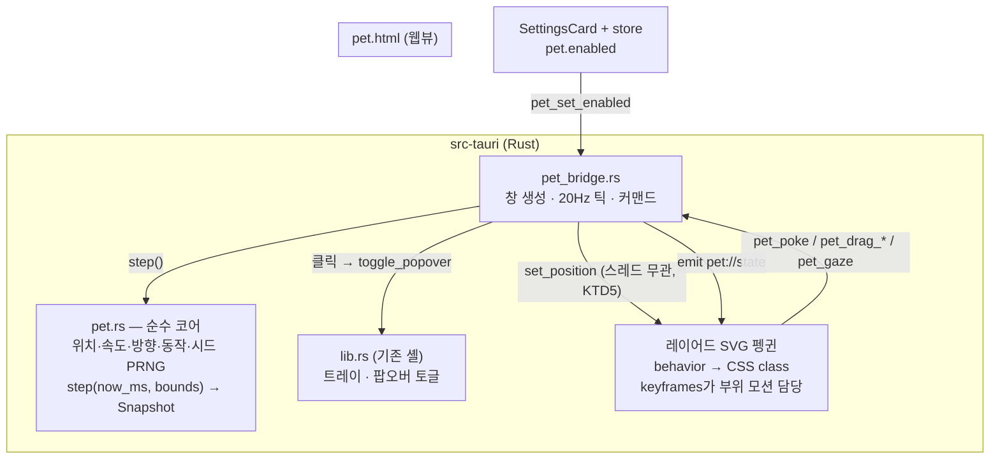
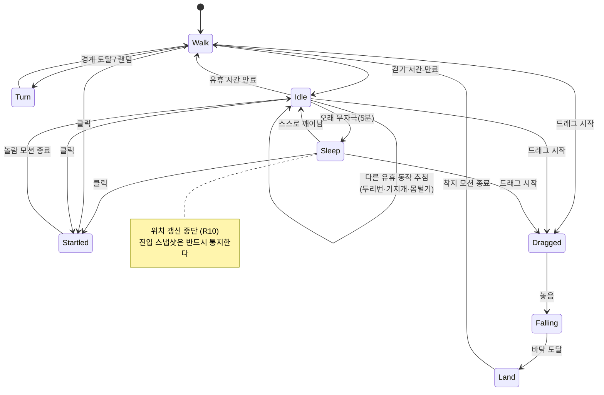

# 바탕화면 펭귄 (데스크톱 펫) — Plan

## Goal Capsule

- **목표** — 메뉴바 아이콘과 별개로, 바탕화면 위를 스스로 걸어다니고 사용자에게 반응하는
  펭귄 창을 만든다. 이 PR의 범위는 **창 골격 + 이동/유휴 동작 + 클릭·드래그 반응 + 설정 on/off**
  까지다. 뽀모도로·할 일 연동 무드는 후속 체크박스로 분리한다.
  근거: PRD §5.8(이 PR에서 신설), PRINCIPLE 2("브라우저를 열게 만들면 실패" — 앱이 상주하며
  존재감을 갖는 방향).
- **권위 순서** — `PRD > PRINCIPLE > CONVENTIONS > 이 플랜`. 충돌하면 상위가 이긴다.
  플랜과 어긋나는 구현이 필요해지면 멈추고 보고한다.
- **실행 프로필** — 브랜치 `feat/pet-desktop-penguin-01`. 코어 상태머신(`pet.rs`)과 순수 변환
  함수는 TDD(실패 테스트 먼저), 창·CSS 애니메이션은 수동 검증. 커밋은 한국어 Angular 컨벤션,
  Implementation Unit 하나 = 커밋 하나.
- **정지 조건** — 아래 중 하나라도 발생하면 구현을 멈추고 보고한다.
  1. **U1의 번들 투명도 검증 실패** — `.app`에서 펭귄 창이 흰 배경으로 뜨면(tauri#13415)
     그 시점에 멈춘다. 이 리스크가 현실화되면 기능 전체가 무산될 수 있으므로 U1을 맨 앞에 둔다.
  2. 펫 창을 띄운 뒤 메뉴바 트레이 아이콘이 사라지거나 팝오버 토글이 깨진다.
  3. 20Hz 틱이 유휴 상태에서 CPU 1%를 넘거나, 상주 메모리 증가분이 60MB를 넘는다.
  4. 펫 창이 다른 앱의 키보드 포커스를 뺏는다.
- **꼬리 작업** — `.github/TEMPLATE/PR.md`로 PR을 열고, PRD §5.8·§10과 `TODO.md`를 같은 PR에서
  갱신한다. **merge는 사용자가 한다.**

---

## Product Contract

### Summary

앱을 켜두면 펭귄 한 마리가 화면 아래쪽을 뒤뚱뒤뚱 걸어다닌다. 가끔 멈춰서 두리번거리고,
날개를 펴 기지개를 켜고, 몸을 털고, 한참 가만두면 앉아서 존다. 커서를 가까이 가져가면 고개를
돌려 쳐다본다. 클릭하면 움찔 놀라며 메뉴바 팝오버가 열리고, 집어서 아무 데나 옮겨 놓으면
버둥거리다 착지해 다시 걷기 시작한다. 거슬리면 설정에서 끈다.

### Problem Frame

현재 앱의 존재감은 메뉴바 아이콘 하나뿐이다. 사용자는 "펭귄 하나로 하루를 끝낸다"는 제품
정체성(PRD §1)에 비해 펭귄이 너무 안 보인다고 느끼고 있고, 남은 M2 항목(동기화 검증 루프)보다
이 쪽을 먼저 원한다. 지금 만들어 두면 이후 마일스톤에서 펭귄이 상태를 표현하는 채널
(집중 중/할 일 남음/새 알림)로 재사용된다 — 알림을 띄우지 않고도 상태를 전달하는 수단이
생기는 것이라 PRD §5.7의 "기본은 조용한 pull"과도 맞다.

### Requirements

- **R1** — 앱 실행 중 바탕화면에 프레임·그림자 없는 투명 펭귄 창이 떠 있고, 배경이 흰
  사각형으로 보이지 않는다. **번들(`.app`) 실행에서 확인한다.**
- **R2** — 펭귄은 현재 모니터의 작업 영역(메뉴바·Dock 제외) 안에서만 움직이고, 좌우 경계에
  닿으면 몸을 돌려 반대로 간다.
- **R3** — 펭귄은 걷기와 여러 유휴 동작(두리번, 눈 깜빡임, 기지개, 몸 털기, 발 갈아 딛기,
  졸기) 사이를 스스로 오간다. 같은 동작만 반복하지 않는다. **졸기는 종착 상태가 아니라
  스스로 깨어나며, 깨어 있는 시간이 기본이다** (구현 중 정정 — 원안대로 90초 뒤 졸면
  하루의 대부분을 자게 되어 이 기능의 목적과 어긋난다. 진입은 5분으로 미뤘다).
- **R4** — 펭귄이 진행 방향을 바라본다. 방향 전환은 순간 반전이 아니라 제자리에서 도는
  것으로 보인다.
- **R5** — 펭귄 몸통을 클릭하면 놀라는 반응 후 메뉴바 팝오버가 열린다(트레이 클릭과 동일 동작).
- **R6** — 펭귄을 드래그해 원하는 위치에 놓을 수 있다. 놓으면 떨어져 착지하고 거기서부터
  다시 걷는다. 드래그 중에는 자율 이동이 멈춘다.
- **R7** — 커서가 펭귄 근처에 오면 고개를 커서 쪽으로 돌린다.
- **R8** — 설정 카드에서 펭귄을 끄고 켤 수 있고, 그 선택이 앱을 다시 켜도 유지된다.
  꺼져 있으면 창도 틱 스레드도 살아 있지 않는다.
- **R9** — 펭귄 창은 키보드 포커스를 뺏지 않고, Cmd-Tab·Dock에 나타나지 않으며,
  **펭귄을 띄운 상태에서도 메뉴바 트레이 아이콘과 팝오버 토글이 M1과 동일하게 동작한다.**
- **R10** — 펭귄이 졸고 있을 때는 창 위치 갱신 틱이 멈춘다(배터리).

### Acceptance Examples

- **AE1** (R1) — Given `npm run tauri build`로 만든 `.app`을 실행했다. When 바탕화면을 본다.
  Then 펭귄만 보이고 그 주변에 흰/검은 사각형 배경이 없다.
- **AE2** (R2) — Given 펭귄이 화면 왼쪽 끝을 향해 걷고 있다. When 작업 영역 왼쪽 경계에 닿는다.
  Then 창이 화면 밖으로 나가지 않고, 제자리에서 몸을 돌려 오른쪽으로 걷기 시작한다.
- **AE3** (R3) — Given 펭귄을 3분간 건드리지 않고 지켜본다. When 시간이 지난다.
  Then 걷기·두리번·기지개·몸 털기 중 **최소 3가지 다른 동작**이 나타나고, 눈 깜빡임이
  4~7초 간격으로 섞인다.
- **AE4** (R3, R10) — Given 펭귄을 오래(5분) 건드리지 않는다. When 유휴가 이어진다.
  Then 앉아서 졸고, 그동안 창은 움직이지 않는다. 잠시 뒤 스스로 깨어나 다시 활동한다.
- **AE5** (R5) — Given 펭귄이 걷고 있다. When 펭귄 몸통을 클릭한다.
  Then 펭귄이 움찔하며 날개를 펴고, 메뉴바 팝오버가 열린다.
- **AE6** (R6) — Given 펭귄이 화면 왼쪽 아래에 있다. When 집어서 화면 오른쪽 위로 끌어다 놓는다.
  Then 놓은 지점에서 아래로 떨어져 작업 영역 바닥에 착지(살짝 눌렸다 펴짐)하고 다시 걷는다.
- **AE7** (R8) — Given 설정에서 펭귄을 껐다. When 앱을 종료하고 다시 켠다.
  Then 펭귄이 나타나지 않는다. 다시 켜면 즉시 나타난다.
- **AE8** (R9) — Given 펭귄이 걷고 있고 다른 앱에서 타이핑 중이다. When 펭귄이 커서 근처를 지나간다.
  Then 타이핑이 끊기지 않고 포커스도 이동하지 않는다. 트레이 클릭 시 팝오버가 정상 토글된다.

### Scope Boundaries

**비목표 (PRD §4 근거)**
- Windows/Linux 지원 — macOS 전용.
- AI로 동작을 생성하거나 사용자 행동을 학습하는 것 (PRINCIPLE 1). 동작은 규칙 + 시드 난수다.
- 업무 데이터를 펭귄이 표시하는 것 — 이 PR에서는 순수 장식·상호작용이다.

**Deferred to Follow-Up Work** (PR "비고"와 `TODO.md`에 함께 남긴다)
- **뽀모도로/할 일 연동 무드** — 집중 중엔 조용히 졸고, 세션 종료 시 환호, 휴식엔 활발히.
  후속 체크박스로 분리한다(이 PR은 창·동작·상호작용까지).
- **배 썰매(tobogganing)·점프·계단 오르기** 등 추가 이동 동작.
- **멀티 모니터** — 현재 모니터 하나의 작업 영역만 쓴다. 모니터 간 이동은 `TODO.md`의 기존
  "멀티 모니터에서 팝오버 위치 보정" 항목과 함께 다룬다.
- **창 크기 밖 클릭 통과** — 창을 펭귄 크기로 딱 맞추는 방식(KTD3)이라 필요 없어졌다.
  전체화면 오버레이로 갈 일이 생기면 그때 재검토한다.
- **데스크톱 레벨(다른 창 뒤) 배치** — KTD3 참고. 원하면 후속으로 전환 가능하게 설계한다.

---

## Planning Contract

### Key Technical Decisions

- **KTD1 — 코어는 `src-tauri/src/pet.rs`, Tauri 무의존 순수 모듈.** `pomodoro.rs` 전례를 그대로
  따른다. 위치·속도·방향·현재 동작·동작 잔여 시간을 소유하고, `step(now_ms, bounds)`가
  스냅샷을 돌려준다. **난수는 코어가 소유한 시드 PRNG(xorshift)로 만든다** — `rand` crate를
  쓰지 않는 이유는 테스트에서 동작 시퀀스를 재현해야 하기 때문이다. 같은 시드 + 같은
  타임스탬프열 = 같은 동작 시퀀스여야 `같은_시드는_같은_행동_시퀀스를_낳는다`를 쓸 수 있다.

- **KTD2 — 애니메이션 책임을 둘로 쪼갠다.** *창이 어디에 있는지*와 *지금 무슨 동작인지*는
  Rust가 소유하고, *부위가 어떻게 움직이는지*는 웹뷰 CSS가 소유한다.
  근거: (a) 보이는 WKWebView는 JS 타이머 스로틀링 대상이 아니므로 스프라이트 프레임을 웹뷰가
  돌려도 안전하다 — 레포의 "숨겨진 웹뷰 타이머 5분 정지" 함정은 *숨겨진* 창 이야기다.
  (b) 반대로 `set_position`은 매 호출이 IPC + AppKit 디스패치라 60Hz로 때리면 안 된다.
  → **Rust 틱 20Hz(위치·동작 전이), CSS keyframes(부위 모션).**

- **KTD3 — 창은 "펭귄 크기에 딱 맞는 항상 위 창"으로 만든다. 클릭 통과를 쓰지 않는다.**
  Tauri/macOS에서 `set_ignore_cursor_events`는 **창 단위 전부/전무**이고 스프라이트 모양대로
  히트 테스트하는 API는 없다(tauri#2090, #13070 — 미구현). 대안인 "전체화면 투명 오버레이 +
  커서 위치 60Hz 폴링으로 토글"은 macOS 26 Tahoe에서 오버레이 창 상주 메모리가 **110MB**로
  측정됐고(Sequoia의 약 4배), 상주 앱에 얹기엔 과하다. 창을 펭귄 바운딩 박스(약 140×140 논리px)
  로 좁히면 통과시킬 투명 영역 자체가 거의 없어 문제가 사라진다.
  → `always_on_top(true)`, `focused(false)`, `accept_first_mouse(true)`, `skip_taskbar(true)`,
  `shadow(false)`, `decorations(false)`, `transparent(true)`, `resizable(false)`,
  `visible_on_all_workspaces(true)`, `backgroundThrottling: "disabled"`.
  *"다른 창 뒤(진짜 바탕화면)"는 채택하지 않는다* — Tauri의 `alwaysOnBottom`은 NSWindow 레벨
  −1이라 여전히 데스크톱보다 한참 위이고, 진짜 배경 레벨(`kCGDesktopIconWindowLevel`)은
  `ns_window()`로 objc2를 직접 만져야 하는 데다 브라우저·에디터를 띄우면 영영 안 보인다.
  창 레벨은 `pet_bridge`의 한 곳에서만 정하므로 나중에 뒤집을 수 있다.

- **KTD4 — 창 위치의 소유자는 Rust 단독이다.** 드래그도 웹뷰가 `setPosition`을 직접 부르지
  않고 **포인터 이동량을 커맨드로 Rust에 넘기고, Rust가 코어 상태를 갱신한 뒤 창을 옮긴다.**
  소유자가 둘이면 틱 스레드와 드래그가 같은 프레임에서 서로 위치를 덮어써 떨림이 생긴다.
  덤으로 `core:window:allow-set-position` 권한을 펫 창에 열지 않아도 된다.

- **KTD5 — `set_position`은 Rust 어느 스레드에서 불러도 된다.** `tauri-runtime-wry`가
  메인 스레드가 아니면 이벤트 루프로 넘기고, tao의 macOS 구현이 추가로 메인 스레드에
  비동기 디스패치한다. **트레이(`set_title`)와 다른 점이니 혼동하지 않는다** — 트레이는
  `run_on_main_thread`로 감싸야 한다(기존 `timer_bridge::refresh_tray`). 단, 이 플랜 밖에서
  `ns_window()`를 직접 만지게 되면 그건 반드시 `run_on_main_thread`로 감싼다.

- **KTD6 — 투명도 리스크를 U1로 앞당긴다.** tauri#13415(미해결): `.transparent(true)` 창이
  `tauri dev`에서는 정상인데 **번들 빌드에서 흰 배경으로 렌더**된다는 보고가 있다
  (Tauri 2.5.1 / wry 0.51.2 / macOS 15.4.1 arm64, 워크어라운드 없음). 이 레포는 이미 알림
  검증을 `.app`에서만 할 수 있는 처지라 번들 검증을 마지막에 몰면 손실이 크다.
  → **U1에서 정적 펭귄 한 장만 띄우고 즉시 `npm run tauri build`로 투명도를 확인한다.**
  실패하면 정지 조건 1에 걸려 보고한다.

- **KTD7 — 펭귄 그림은 기존 사진(`assets/penguin-icon.png`)을 옮겨 그린 레이어드 인라인 SVG.**
  현재 에셋은 아델리 펭귄 사진 컷아웃 한 장이라 부위가 독립적으로 움직일 수 없다. 같은 정체성
  (검은 머리·흰 눈테·흰 배·검은 등·분홍 발)을 유지하되 머리/눈/부리/몸통/왼날개/오른날개/
  왼발/오른발/꼬리/그림자를 각각 `<g id>`로 분리하면 CSS가 부위별로 애니메이션할 수 있다.
  스프라이트 시트 PNG 대신 인라인 SVG인 이유: 바이너리 에셋이 늘지 않고, 부위 조합으로
  동작 카탈로그를 늘리는 비용이 프레임을 다시 그리는 비용보다 훨씬 싸다. `transform`과
  `opacity`만 애니메이션한다(GPU 합성). `backdrop-filter`는 macOS 투명 창에서 깨지므로 쓰지 않는다.
  기존 PNG는 트레이·앱 아이콘 용도로 그대로 둔다.
  **퇴로**: 손으로 옮긴 SVG가 사진의 인상을 못 살리면, 같은 레이어 분해를 사진 자체에 적용한다
  — 원본 PNG를 머리/몸통/날개/발 조각 PNG로 잘라 같은 `<g>` 구조에 넣으면 CSS 애니메이션
  코드는 그대로 두고 그림만 바뀐다. U4에서 이 판단을 하고, 사진 조각이 필요해지면 알린다.

- **KTD8 — 펫 웹뷰는 별도 Vite 엔트리(`pet.html`)다.** 팝오버(`index.html`)와 상태·CSS를
  섞지 않는다. `vite.config.ts`의 `build.rollupOptions.input`에 두 엔트리를 등록하고,
  펫 창은 `WebviewUrl::App("pet.html")`로 연다. 펫 창 라벨 `"pet"`을
  `src-tauri/capabilities/default.json`의 `windows`에 추가해야 `core:default`(이벤트 수신)가
  적용된다 — 안 하면 이벤트가 조용히 안 온다.

### Assumptions

구현 전에 틀렸다면 알려달라.

- **A1** — 펭귄은 화면 최상단이 아니라 **모든 앱 창 위에 항상 보이는** 편이 낫다고 본다
  (KTD3). "브라우저 뒤에 숨는 진짜 바탕화면 펭귄"을 원했다면 여기서 바꿔야 한다.
- **A2** — 기본값은 **켜짐**이다. 사용자가 직접 요청한 기능이라 opt-in으로 숨기지 않는다.
  (PRD §5.7의 opt-in 원칙은 *알림*에 대한 것이고 펭귄은 알림이 아니다.)
- **A3** — 걷는 바닥은 작업 영역 **하단**이다. 창 전체를 자유 배회하지 않는다(드래그로 옮긴
  직후를 제외하면 바닥으로 떨어진다).
- **A4** — 마지막 위치는 저장하지 않는다. 앱을 켜면 바닥 왼쪽에서 시작한다. (설정만 저장 —
  PRINCIPLE 4.)
- **A5** — 펭귄 크기는 약 140×140 논리 px로 시작한다. 크기 설정은 이 PR 범위 밖이다.

### High-Level Technical Design

동작 상태머신 (코어가 소유):

### 동작 카탈로그

Rust 코어가 고르는 **behavior**(창 이동과 전이를 결정)와, 웹뷰 CSS가 항상 얹는
**베이스 레이어**를 나눈다.

| 계층 | 동작 | 소유 | 표현 |
|---|---|---|---|
| 베이스 (항상) | 숨쉬기 | CSS | 몸통 `scaleY` 1.0↔1.02, 3.2초 주기 |
| 베이스 (항상) | 눈 깜빡임 | CSS | 눈 `scaleY`→0, 4~7초 랜덤, 가끔 2연속 |
| 이동 | 뒤뚱 걷기 | Rust + CSS | 좌우 발 교차 0.5초, 몸통 롤 ±6°, 상하 bob 3px |
| 이동 | 방향 전환 | Rust + CSS | 제자리 `scaleX` 1→0→−1, 0.25초 (R4) |
| 유휴 | 두리번 | CSS | 머리 `rotate` ±12°, 좌→우→정면 |
| 유휴 | 기지개 | CSS | 양 날개 펼침 + 몸통 늘임, 1.2초 |
| 유휴 | 몸 털기 | CSS | 전체 `translateX` ±3px 12Hz 진동, 0.5초 |
| 유휴 | 발 갈아 딛기 | CSS | 한 발씩 들었다 놓기 |
| 유휴 | 하품 → 앉기 | CSS | 부리 벌림 → 몸통 낮춤, `Sleep` 진입 모션 |
| 수면 | 졸기 | CSS | 몸통 느린 bob + `Zzz` 텍스트 페이드 업 |
| 반응 | 놀람 | Rust + CSS | 위로 6px 튐 + 날개 활짝, 0.4초 (R5) |
| 반응 | 매달림 | Rust + CSS | 드래그 중 날개 위로, 발 버둥 (R6) |
| 반응 | 착지 | Rust + CSS | 낙하 후 `scaleY` 0.8 스쿼시 → 복원 (R6) |
| 반응 | 응시 | CSS | 커서 방향으로 머리 `rotate`, 눈동자 이동 (R7) |

---

## Implementation Units

### U1. 펫 창 골격 + 번들 투명도 검증

- **Goal** — 정적 펭귄 한 장이 바탕화면에 투명하게 떠 있다. **리스크를 맨 앞에서 태운다.**
- **Requirements** — R1, R9 / KTD3, KTD6, KTD8
- **Dependencies** — 없음
- **Files** — `vite.config.ts`, `pet.html`, `src/pet/main.tsx`, `src/pet/pet.css`,
  `src-tauri/src/pet_bridge.rs`(창 생성만), `src-tauri/src/lib.rs`,
  `src-tauri/capabilities/default.json`
- **Approach** — Vite에 두 번째 엔트리를 등록한다. `pet_bridge::create_pet_window`가
  `WebviewWindowBuilder`로 KTD3의 플래그 전부를 걸어 창을 만든다. `html, body { background:
  transparent }`를 반드시 넣는다(`macOSPrivateApi`만으로는 부족하다 — 이미 `true`로 설정돼 있음).
  capabilities의 `windows`에 `"pet"`을 추가한다. 이 유닛에서는 움직이지 않는 SVG 한 장만 띄운다.
- **Execution note** — 코드를 더 얹기 전에 번들 검증부터 통과시킨다. 실패하면 정지 조건 1.
- **Test scenarios** — `Test expectation: none — 창 생성·투명도는 OS 통합 표면이라 단위
  테스트로 잡히지 않는다. 아래 수동 검증으로 대체한다.`
- **Verification** —
  1. `npm run tauri dev` — 펭귄이 뜨고 배경이 투명하다.
  2. **`npm run tauri build` → `.app` 실행 — 투명도 유지 (AE1, KTD6).**
  3. 트레이 아이콘이 그대로 있고 팝오버 토글이 정상 (AE8 일부, R9).
  4. Cmd-Tab·Dock에 펭귄 창이 없고, 다른 앱 타이핑이 끊기지 않는다.

### U2. 펫 코어 상태머신 (`pet.rs`)

- **Goal** — Tauri 없이 돌아가는, 시간·경계를 주입받는 결정론적 펭귄 상태머신.
- **Requirements** — R2, R3, R4, R6, R10 / KTD1
- **Dependencies** — 없음 (U1과 병렬 가능)
- **Files** — `src-tauri/src/pet.rs`(신규, 인라인 테스트 포함), `src-tauri/src/lib.rs`(`pub mod`)
- **Approach** — `pomodoro.rs`와 같은 모양: 외부 입력은 전부 인자로 받는다.
  `Behavior` enum(`Walk`, `Turn`, `Idle(IdleKind)`, `Sleep`, `Startled`, `Dragged`,
  `Falling`, `Land`), `Bounds { left, right, floor_y }`, `Snapshot { x, y, facing, behavior }`.
  `step(now_ms, bounds)`가 위치를 적분하고 동작 잔여 시간이 끝나면 다음 동작을 추첨한다.
  PRNG는 코어 필드의 xorshift64 — `Pet::with_seed(seed)`로 테스트가 시드를 고정한다.
  경계 clamp은 창 폭을 고려해 `right - width`까지만 간다.
- **Execution note** — 실패 테스트 먼저. 이 유닛이 이 PR에서 유일하게 밀도 높은 로직이다.
- **Test scenarios** (한국어 이름)
  - `걷기_중에는_진행_방향으로_위치가_이동한다`
  - `왼쪽_경계에_닿으면_방향을_전환하고_경계를_넘지_않는다` (오른쪽도) — R2
  - `방향_전환이_끝나면_반대_방향으로_걷는다` — R4
  - `같은_시드는_같은_동작_시퀀스를_낳는다` — KTD1
  - `유휴_동작은_연속으로_같은_종류가_반복되지_않는다` — R3
  - `구십초_이상_자극이_없으면_졸기로_전이한다` — R3
  - `졸기_상태에서는_위치가_변하지_않는다` — R10
  - `드래그_중에는_자율_이동이_멈추고_주어진_위치를_따른다` — R6
  - `드래그를_놓으면_낙하해_바닥에서_멈춘다` — R6
  - `클릭은_졸기_상태에서도_놀람으로_깨운다` — R5
  - `작업_영역이_바뀌면_다음_step에서_경계_안으로_들어온다` (모니터 변경 방어)
- **Verification** — `cd src-tauri && cargo test`

### U3. 20Hz 틱 브릿지 — 창 이동과 상태 이벤트

- **Goal** — 코어가 만든 상태가 실제 창 위치와 웹뷰 클래스로 나간다. 펭귄이 걷는다.
- **Requirements** — R2, R3, R10 / KTD2, KTD4, KTD5
- **Dependencies** — U1, U2
- **Files** — `src-tauri/src/pet_bridge.rs`, `src/pet/main.tsx`, `src/pet/pet.css`,
  `src/lib/pet.ts`(이벤트 래퍼), `src/lib/pet.test.ts`
- **Approach** — `spawn_pet_tick_thread`를 `timer_bridge::spawn_tick_thread` 전례로 만들되
  주기는 50ms다. 매 틱: `step()` → `set_position(LogicalPosition)` → `emit("pet://state")`.
  **`Sleep`이면 위치 갱신과 emit을 건너뛴다**(R10) — 깨우는 커맨드가 다시 돌린다.
  경계는 `window.current_monitor()`의 `work_area()`(물리 px)를 `scale_factor()`로 나눠
  논리 좌표로 바꿔 주입한다 — 이 변환은 **순수 함수로 분리해 테스트한다**.
  틱 스레드에서 `set_position`을 직접 부른다(KTD5) — 트레이와 달리 `run_on_main_thread`
  불필요이며, 그 이유를 코드 주석에 남긴다.
- **Test scenarios**
  - Rust: `작업_영역을_논리_좌표_경계로_변환한다` (scale factor 2.0 포함)
  - Rust: `졸기_스냅샷에서는_창_이동을_건너뛴다` (순수 판정 함수로 분리해 테스트)
  - 프론트: `behavior를_CSS_클래스명으로_매핑한다` (vitest)
- **Verification** — `cargo test`, `npm test`, 그리고 `tauri dev`에서 펭귄이 좌우로 걷고
  경계에서 돌아서는지 육안 확인 (AE2)

### U4. 레이어드 SVG 펭귄과 동작 카탈로그

- **Goal** — 펭귄이 살아 있어 보인다. 걷기·유휴 동작이 실제로 부위별로 움직인다.
- **Requirements** — R3, R4 / KTD7
- **Dependencies** — U3
- **Files** — `src/pet/Penguin.tsx`(레이어드 SVG), `src/pet/pet.css`(keyframes),
  `src/pet/Penguin.test.tsx`
- **Approach** — `assets/penguin-icon.png`을 보고 같은 아델리 펭귄 실루엣을 SVG로 옮긴다.
  `<g id="head">`, `eye`, `beak`, `body`, `wing-left`, `wing-right`, `foot-left`,
  `foot-right`, `tail`, `shadow`로 분리한다. 루트에 `data-behavior` 속성을 걸고 CSS가
  선택자로 keyframes를 붙인다. **`transform`과 `opacity`만 애니메이션한다.**
  숨쉬기·눈 깜빡임은 behavior와 무관하게 항상 도는 베이스 레이어다.
  방향은 루트 `scaleX(±1)`, 전환은 0.25초 keyframe(R4).
- **Test scenarios**
  - `모든_behavior에_대응하는_CSS_클래스가_존재한다` (매핑 누락 방지)
  - `방향이_왼쪽이면_루트에_반전_클래스가_붙는다`
  - `Test expectation: 시각적 모션 자체는 자동 검증하지 않는다 — AE3로 수동 확인한다.`
- **Verification** — `npm test`, 그리고 3분 관찰로 AE3, 90초 관찰로 AE4

### U5. 상호작용 — 클릭·드래그·응시

- **Goal** — 펭귄을 클릭하면 팝오버가 열리고, 집어서 옮길 수 있고, 커서를 쳐다본다.
- **Requirements** — R5, R6, R7 / KTD4
- **Dependencies** — U3, U4
- **Files** — `src-tauri/src/pet_bridge.rs`(커맨드), `src-tauri/src/lib.rs`(핸들러 등록,
  `toggle_popover` 노출), `src/pet/main.tsx`, `src/lib/pet.ts`, `src/lib/pet.test.ts`
- **Approach** — 커맨드 `pet_poke`, `pet_drag_start`, `pet_drag_move`, `pet_drag_end`.
  **웹뷰는 의도만 보내고 위치는 Rust가 옮긴다**(KTD4). 드래그는 웹뷰의 pointer 이벤트에서
  화면 좌표 델타를 계산해 `pet_drag_move(dx, dy)`로 넘긴다.
  `pet_poke`는 코어를 `Startled`로 전이시키고 기존 `toggle_popover`를 호출한다 — 트레이 클릭과
  같은 경로를 쓴다(`lib.rs`의 함수를 `pub(crate)`로 올린다). 응시(R7)는 위치 정보가 필요 없는
  순수 CSS/JS 처리라 웹뷰 안에서 끝낸다.
  주의: `accept_first_mouse(true)`가 없으면 첫 클릭이 앱 활성화에 먹힌다(U1에서 이미 설정).
- **Test scenarios**
  - Rust(코어): `드래그_이동은_경계를_넘어도_받아들이고_놓을_때_정산한다`
  - Rust(코어): `놀람_모션이_끝나면_직전_동작이_아니라_유휴로_돌아온다`
  - 프론트: `포인터_이동_델타를_드래그_커맨드로_전달한다` (mock invoke)
  - 프론트: `클릭은_드래그로_해석되지_않는다` (임계 이동량 미만)
- **Verification** — `cargo test`, `npm test`, 수동으로 AE5·AE6·AE7

### U6. 설정 on/off 토글

- **Goal** — 펭귄을 끄고 켤 수 있고 그 선택이 유지된다. 꺼져 있으면 자원을 안 쓴다.
- **Requirements** — R8
- **Dependencies** — U3
- **Files** — `src/components/SettingsCard.tsx`, `src/components/SettingsCard.test.tsx`,
  `src/lib/settings.ts`, `src/lib/settings.test.ts`, `src/App.tsx`,
  `src-tauri/src/pet_bridge.rs`
- **Approach** — `settings.json`에 `pet` 키를 추가한다(`{ enabled: boolean }`). 기존
  `loadSettings`/`saveSettings`는 타이머 전용이라 **키를 나눠 별도 함수로 추가**한다 —
  기존 시그니처를 깨지 않는다. `pet_set_enabled(false)`는 틱 스레드를 멈추고 창을 닫는다
  (숨기는 게 아니라 닫는다 — R8의 "틱 스레드도 살아 있지 않는다"). `true`는 창을 다시 만든다.
  앱 시작 시 저장값을 읽어 켜져 있을 때만 창을 만든다(기본 켜짐 — A2).
- **Test scenarios**
  - 프론트: `펭귄_설정이_없으면_켜짐이_기본값이다`
  - 프론트: `펭귄_토글을_끄면_저장하고_커맨드를_호출한다`
  - 프론트: `저장_실패해도_토글_상태는_되돌아간다` (기존 `saveFailed` 전례)
- **Verification** — `npm test`, 수동으로 AE7(껐다 재시작)

### U7. 문서 갱신

- **Goal** — PRD·TODO가 이 기능을 반영한다.
- **Requirements** — 전부 (추적성)
- **Dependencies** — U1~U6
- **Files** — `PRD.md`, `TODO.md`
- **Approach** — `PRD.md`에 **§5.8 바탕화면 펭귄 (데스크톱 펫)**을 신설하고 §10 마일스톤
  표에 **M2.5 — 바탕화면 펭귄** 행을 M2와 M3 사이에 넣는다(사용자 우선순위 반영).
  `TODO.md`에 `## M2.5 — 바탕화면 펭귄` 섹션을 만들고 이 PR 항목을 체크, Deferred 항목들
  (뽀모도로 연동 무드, 추가 이동 동작, 멀티 모니터)을 미체크로 남긴다.
  `SERVICES.md`는 외부 서비스 연동이 아니므로 건드리지 않는다.
- **Test scenarios** — `Test expectation: none — 문서 변경.`
- **Verification** — 문서 리뷰

---

## Verification Contract

| 게이트 | 명령 / 방법 | 적용 유닛 |
|---|---|---|
| Rust 단위 테스트 | `cd src-tauri && cargo test` | U2, U3, U5 |
| 프론트 단위 테스트 | `npm test` | U3, U4, U5, U6 |
| 개발 스모크 | `npm run tauri dev` | U1~U6 |
| **번들 투명도 검증** | `npm run tauri build` → `.app` 실행 | **U1 (선행)**, 최종 재확인 |
| 메뉴바 회귀 체크리스트 | `docs/solutions/.../tauri-v2-macos-menubar-app-pitfalls.md`의 수동 항목 — 트레이 클릭 토글, 바깥 클릭 숨김, **닫은 뒤 트레이 아이콘 유지**, 5분 방치 후 타이머 정확성 | U1, U5 |
| 자원 사용 | 활동 모니터에서 유휴 시 CPU < 1%, 상주 메모리 증가분 < 60MB | U3, U6 |
| 코드 리뷰 | `ce-code-review` | PR 직전 |

두 러너를 **모두** 돌린다. 한쪽만 돌리고 통과로 보고하지 않는다.

## Definition of Done

- [ ] R1~R10 충족, AE1~AE8 재현 확인
- [ ] `cargo test`·`npm test` 전체 통과, 코어(U2)는 실패 테스트가 먼저 커밋된 이력
- [ ] 번들 `.app`에서 투명도 확인 (AE1) — U1 시점과 최종 두 번
- [ ] 메뉴바 회귀 체크리스트 통과 (트레이 아이콘 유지 포함)
- [ ] `feat/pet-desktop-penguin-01` 브랜치, 한국어 Angular 커밋, PR 템플릿으로 오픈
- [ ] `PRD.md` §5.8·§10, `TODO.md` M2.5 섹션이 같은 PR에 포함
- [ ] Deferred 항목이 PR "비고"와 `TODO.md`에 모두 남아 있음
- [ ] 실험하다 버린 코드·미사용 잔재가 diff에 없음
- [ ] **merge하지 않음** — 사용자에게 PR 링크 전달 후 정지

---

## Sources & Research

- tauri#13415 (미해결) — 투명 창이 번들 빌드에서 흰 배경으로 렌더. KTD6·U1 순서의 근거.
- tauri#2090, #13070 (미구현) — 투명 영역 클릭 통과 히트 테스트 부재. KTD3의 근거.
- tauri#8255 (미해결) — macOS 14+ 투명 창 포커스 전환 시 아티팩트.
- tauri#5250 / commit a2d36b8 — `backgroundThrottling` 창별 정책(macOS 14+).
- `tauri-runtime-wry`의 `send_user_message`, tao macOS `set_frame_top_left_point_async` —
  `set_position`의 스레드 안전성 근거 (KTD5).
- Manasight, "Why I Chose Tauri v2 for a Desktop Overlay" (2026) — 전체화면 오버레이의
  Tahoe 메모리 측정치(110MB). KTD3에서 오버레이 방식을 배제한 근거.
- CrabNebula, "Building a Desktop Pet with Tauri" (2024) — 위치 갱신과 스프라이트 틱을
  분리하는 구성. KTD2의 참고 사례.
- 레포 내부: `docs/solutions/best-practices/tauri-v2-macos-menubar-app-pitfalls.md`
  (특히 1·5·8번 항목), `src-tauri/src/pomodoro.rs`(순수 코어 전례),
  `src-tauri/src/timer_bridge.rs`(틱 스레드 전례).
