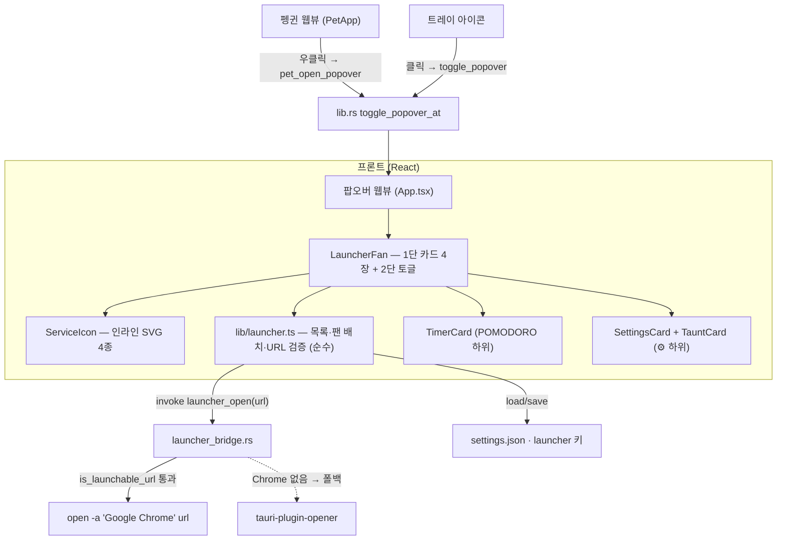
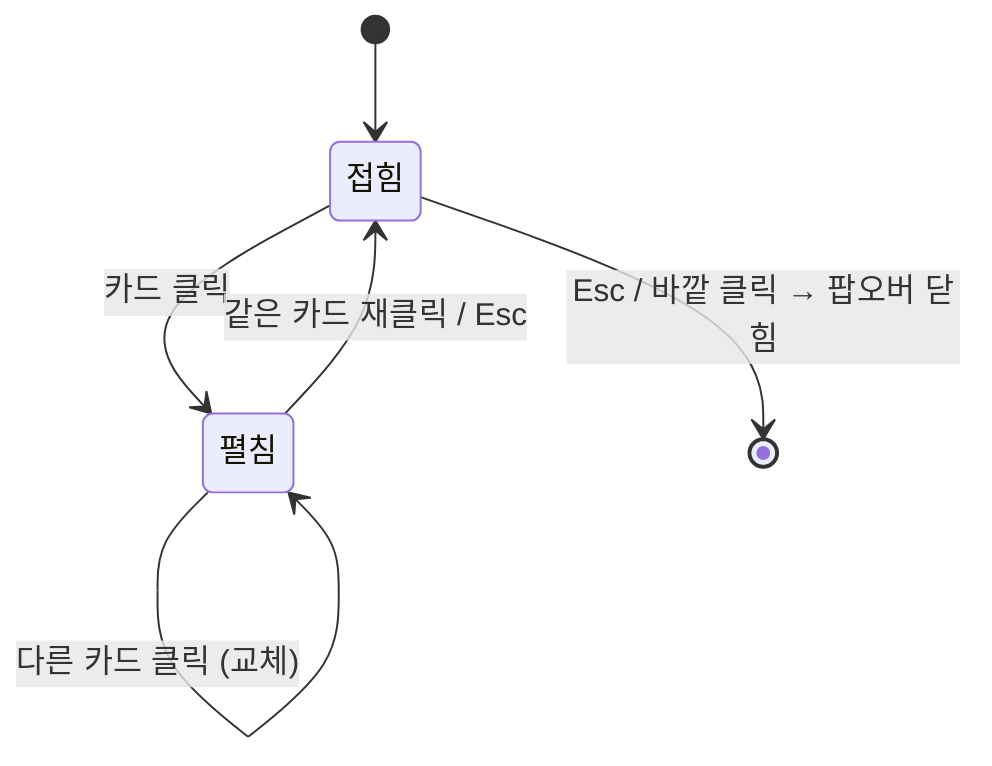

# M4 런처 — 펭귄 우클릭에서 펼쳐지는 스택 팬

## Goal Capsule

- **목표** — 펭귄 우클릭으로 열리는 팝오버의 최상위 화면을 **macOS Dock 스택 팬** 모양의
  런처로 교체한다. 1단에 `NOTION` / `JIRA` / `GOOGLE CALENDAR` / `POMODORO` 4장이 호를 그리며
  펼쳐지고, 카드를 누르면 그 카드의 하위 항목이 토글로 펼쳐진다. 서비스 하위 항목을 고르면
  **Chrome**이 해당 URL을 연다. 근거: PRD §5.2(런처), §9 Q4(런처 UX)·Q5(Chrome 창 제어)·R6.
- **권위 순서** — `PRD > PRINCIPLE > CONVENTIONS > 이 플랜`. 충돌하면 상위가 이기고,
  플랜과 어긋나는 구현이 필요해지면 멈추고 보고한다.
- **실행 프로필** — 브랜치 `feat/m4-launcher-fan-01`. 순수 로직(팬 배치 계산, URL 검증,
  Rust 커맨드)은 실패 테스트 먼저. 컴포넌트 테스트는 동작 단위로만. 커밋은 한국어 Angular 컨벤션,
  유닛 하나가 커밋 하나.
- **정지 조건** — (a) `open -a "Google Chrome"`이 Tauri 프로세스에서 동작하지 않는다,
  (b) 팬 레이아웃이 360×540 팝오버 안에 들어가지 않아 창 크기를 바꿔야 한다(펭귄 앵커 계산에
  파급), (c) Notion·Jira 기본 URL을 알 수 없어 런처가 빈 껍데기가 된다, (d) 팝오버 최상위 화면을
  바꾼 뒤 트레이 진입점이나 펭귄 앵커가 깨진다.
- **꼬리 작업** — `.github/TEMPLATE/PR.md`로 PR을 열고 UI 스크린샷을 넣는다. **merge는 하지 않는다**
  (두 러너 통과 + `ce-code-review` 반영 후 사용자 확인). 같은 PR에서 `PRD.md`·`SERVICES.md`·
  `TODO.md`를 갱신한다.

---

## Product Contract

### Summary

작업 중 Notion 할 일을 열고 싶으면, 바탕화면 펭귄을 오른쪽으로 누른다. 펭귄 옆에 카드 넉 장이
부채처럼 펼쳐지고, `NOTION`을 누르면 그 아래로 갈 곳(`TODO 보드` / `오늘 페이지`)이 열린다.
하나를 고르면 Chrome이 앞으로 나오며 그 페이지를 띄운다. `POMODORO`를 누르면 같은 자리에서
타이머가 펼쳐져 집중을 시작할 수 있다. 브라우저 북마크바를 뒤지거나 앱을 찾아 헤매는 단계가
사라진다.

### Problem Frame

지금 펭귄 우클릭은 타이머·설정·대사 편집 카드가 세로로 쌓인 팝오버를 연다. PRD v2.0에서 앱의
정체성은 **런처**로 바뀌었는데(PRINCIPLE 2 — "앱은 런처다"), 정작 런처가 없어서 펭귄은 하루 업무의
진입점 역할을 하지 못한다. 이게 없으면 M5(뽀모도로 ↔ 펭귄 연동)에서 "타이머를 앱의 별도 화면으로
분리"할 자리가 정해지지 않고, M6(Claude Code 위임)의 대화 진입점도 얹을 곳이 없다.

### Requirements

- **R1** — 펭귄을 오른쪽으로 누르면 팝오버가 열리고, 최상위에 `NOTION`·`JIRA`·`GOOGLE CALENDAR`·
  `POMODORO` 카드 4장이 **호를 그리며 겹쳐 펼쳐진 모양**으로 보인다. 각 카드는 서비스 아이콘과
  알약 모양 라벨을 갖는다.
- **R2** — 카드를 누르면 그 카드의 하위 항목이 펼쳐진다. 다른 카드를 누르면 앞서 펼쳐진 것은
  접히고 누른 카드만 펼쳐진다(한 번에 하나). 펼쳐진 카드를 다시 누르면 접힌다.
- **R3** — 서비스 카드(`NOTION`·`JIRA`·`GOOGLE CALENDAR`)의 하위 항목을 고르면 그 URL이
  **Chrome**에서 열리고 Chrome이 앞으로 나온다. Chrome이 없으면 기본 브라우저로 연다.
- **R4** — `POMODORO` 카드의 하위 항목은 타이머다 — 펼치면 기존 타이머 UI(남은 시간·시작/일시정지/
  리셋·집중/휴식 시간 설정)를 그 자리에서 쓸 수 있다.
- **R5** — 펭귄 on/off와 대사 편집은 사라지지 않는다. 팬 아래의 설정 버튼으로 들어가 쓸 수 있다.
- **R6** — `Esc`를 누르면 펼쳐진 하위 항목이 접히고, 이미 접혀 있으면 팝오버가 닫힌다.
  바깥을 클릭하면 팝오버가 닫힌다(기존 blur 동작 유지).
- **R7** — 하위 항목의 URL이 비어 있으면 열기를 시도하지 않고 "URL이 아직 없어요"라고 그 자리에
  표시한다. `http`/`https`가 아닌 URL은 열지 않는다.
- **R8** — 팝오버를 닫은 뒤에도 메뉴바 트레이 아이콘이 남아 있고, 트레이 클릭으로도 같은 런처가
  메뉴바 밑에서 열린다.

### Acceptance Examples

- **AE1** — Given 펭귄이 바탕화면 가운데에 서 있다. When 펭귄을 오른쪽 버튼으로 누른다.
  Then 펭귄 바로 옆에 팝오버가 뜨고 카드 4장이 위에서 아래로 조금씩 밀리며 겹쳐진 호 모양으로
  보인다. 각 카드 왼쪽에 알약 라벨(`NOTION` 등), 오른쪽에 아이콘이 있다.
- **AE2** — Given 런처가 열려 있고 아무 카드도 펼쳐져 있지 않다. When `NOTION` 카드를 클릭한다.
  Then 그 카드 아래로 `TODO 보드`·`오늘 페이지` 두 항목이 펼쳐진다. When 이어서 `JIRA`를
  클릭한다. Then Notion 하위 항목은 접히고 Jira 하위 항목만 펼쳐진다.
- **AE3** — Given `GOOGLE CALENDAR`가 펼쳐져 있다. When `주간 뷰`를 클릭한다.
  Then Chrome이 앞으로 나오며 `https://calendar.google.com/calendar/r/week` 탭이 열린다.
  Chrome이 이미 실행 중이었다면 새 창이 아니라 기존 창의 새 탭으로 열린다.
- **AE4** — Given `POMODORO`를 클릭해 펼쳤다. When `집중 시작`을 누른다. Then 그 자리에서
  `25:00`부터 카운트다운이 시작되고 메뉴바 트레이 타이틀에도 남은 시간이 표시된다.
- **AE5** — Given `JIRA`의 `내 티켓` URL이 비어 있다. When 그 항목을 클릭한다.
  Then Chrome은 열리지 않고 항목 자리에 "URL이 아직 없어요"가 표시된다.
- **AE6** — Given 런처에서 `NOTION`을 펼쳤다. When `Esc`를 누른다. Then 하위 항목이 접힌다.
  When `Esc`를 한 번 더 누른다. Then 팝오버가 닫히고 **메뉴바의 펭귄 트레이 아이콘은 그대로 남아
  있다**.

### Scope Boundaries

**비목표** (PRD §4 근거)

- 앱 안에 Notion·Jira·Calendar의 조회·편집 UI를 만들지 않는다. 런처는 URL을 열 뿐이다.
- 앱이 서비스 API를 호출하지 않는다. 인증은 Chrome 세션이 갖는다.
- Slack·Webex는 이번 4장에 넣지 않는다 (사용자가 4개로 지정).

**Deferred to Follow-Up Work**

- **런처에 띄울 서비스 목록·URL을 사용자가 편집하는 UI** — `TODO.md` M4의 별도 체크박스다.
  이번 PR은 기본 목록·기본 URL 상수까지만 만들고, 편집은 다음 PR에서 붙인다.
- **Chrome 탭 단위 중복 방지** (PRD Q5의 "이미 열려 있으면 앞으로"를 탭 수준까지). `open -a`는
  앱을 앞으로 가져오고 새 탭을 열지만, 같은 URL 탭이 이미 있으면 그 탭으로 가지는 않는다.
  탭 수준 판정은 AppleScript가 필요하므로 실제로 거슬릴 때 붙인다.
- **타이머를 앱의 별도 화면으로 분리** (M5). 이번에는 런처 2단 안에 기존 카드를 그대로 얹는다.
- **M3의 나머지** — 코드상 Notion 흔적은 이미 없다(grep 0건). 남은 `SERVICES.md` 정리는 이
  PR에서 함께 하고, 의존성 정리(`keyring` 등)는 이미 `Cargo.toml`에서 빠져 있어 확인만 한다.

---

## Planning Contract

### Key Technical Decisions

- **KTD1 — 팝오버의 최상위 화면을 런처로 바꾸고, 기존 카드는 런처 안으로 들어간다.**
  `App.tsx`는 "무엇을 펼쳤는가"만 들고 있는 얇은 껍데기가 되고, 화면 구성은 `LauncherFan`이
  맡는다. `TimerCard`·`SettingsCard`·`TauntCard`는 **지우지 않고** 각각 `POMODORO` 하위와
  설정 패널 하위로 옮긴다. 지우면 펭귄 on/off와 대사 편집 진입점이 사라지고, 그건 M2.5에서
  사용자가 직접 요청해 만든 기능이라 회귀다.

- **KTD2 — 팬은 CSS transform만으로 만든다. DOM은 평범한 세로 버튼 목록이다.**
  각 카드에 `--fan-index`를 넘겨 `translate` + `rotate`를 CSS에서 계산하고, 펼침/접힘은
  `transition`으로 처리한다. JS 애니메이션 루프를 두지 않는다 — **숨겨진 웹뷰의 JS 타이머는
  ~5분 뒤 멈추고**(`docs/solutions/best-practices/tauri-v2-macos-menubar-app-pitfalls.md` 1번),
  런처는 팝오버가 숨겨진 상태에서 다시 열릴 때마다 그려지므로 JS 구동 애니메이션은 조용히
  죽을 수 있다. DOM을 세로 목록으로 두면 Tab 순서·스크린리더·키보드 조작이 공짜로 따라온다.

- **KTD3 — 팝오버 창 크기(360×540)를 바꾸지 않는다.**
  `pet_bridge.rs`의 `popover_position_near`가 창 크기를 읽어 화면 안으로 밀어 넣고, 화면
  가장자리에서 반대쪽으로 접는다. 크기를 바꾸면 그 계산과 테스트(`pet_bridge.rs` 인라인 테스트)를
  전부 재검증해야 한다. 카드 4장 + 하위 항목은 540px 안에 들어가고, 넘치면 기존처럼 팝오버 안에서
  세로 스크롤한다(`App.css`의 `body { overflow-y: auto }`).

- **KTD4 — Chrome 열기는 Rust에서 `open -a "Google Chrome" <url>`로 한다.**
  `tauri-plugin-opener`의 `openUrl`은 **기본 브라우저**를 여는 것이라 PRD §5.2의 "Chrome 창으로
  열린다"를 만족하지 못한다. macOS `open -a`는 (1) 지정한 앱으로 열고, (2) 그 앱을 앞으로
  가져오며, (3) 이미 실행 중이면 새 프로세스를 띄우지 않고 기존 인스턴스의 새 탭으로 연다 —
  PRD Q5의 "이미 열려 있으면 앞으로"를 앱 수준에서 만족한다. 실패(Chrome 미설치 등) 시
  이미 등록돼 있는 `opener` 플러그인으로 폴백해 기본 브라우저를 연다. **`generate_handler!`
  등록을 빠뜨리면 컴파일·테스트·경고가 전부 통과하고 런타임에서만 조용히 reject된다**
  (`docs/solutions/best-practices/tauri-command-registration-silent-failure.md`) — `pet_bridge.rs`에
  이미 있는 "커맨드 등록 누락 검출" 인라인 테스트 패턴을 그대로 따라 회귀를 막는다.

- **KTD5 — URL은 Rust와 프론트 양쪽에서 검증한다. 스킴은 `http`/`https`만 허용한다.**
  URL은 설정 저장소를 거쳐 웹뷰에서 넘어오므로 Rust는 이를 신뢰하지 않는다. 검증을 통과하지
  못하면 프로세스를 띄우지 않고 오류를 돌려준다. 이걸 열어 두면 `open -a`에 임의 파일 경로나
  다른 스킴을 넘길 수 있게 된다. 검증은 Tauri 무의존 순수 함수로 두어 인라인 테스트한다.

- **KTD6 — 아이콘은 Simple Icons 공식 path를 인라인 SVG로 박는다. 새 의존성을 추가하지 않는다.**
  Notion·Jira·Google Calendar는 Simple Icons에 공식 브랜드 path가 있고 아이콘 자체는 CC0다.
  `simple-icons` npm 패키지를 넣으면 3개 쓰자고 3천 개를 끌고 오게 되고, CDN에서 받으면
  오프라인에서 깨진다. `POMODORO`는 브랜드가 없으므로 토마토 글리프를 직접 그린다.
  색: Notion `#111111`(원본은 검정 — 라이트 배경에서 그대로), Jira `#0052CC`,
  Google Calendar `#4285F4`, Pomodoro `#E5533D`.

- **KTD7 — 런처 목록은 코드 안의 기본 상수로 시작하고, 저장소 키(`launcher`)만 미리 판다.**
  편집 UI는 별도 체크박스(Deferred)다. 지금 저장소 키와 타입을 정해 두면 다음 PR이 UI만 붙이면
  된다. 저장된 값이 없거나 깨져 있으면 기본 상수로 수렴시킨다 — 대사 목록(`loadTaunts`)이
  이미 쓰는 방식과 같다.

### Assumptions

틀리면 **구현 시작 전에** 알려주세요. 여기서 고치는 게 가장 쌉니다.

- **A1 — 하위 항목 구성.** 카드마다 2~3개로 잡았습니다:
  `NOTION` → `TODO 보드` / `오늘 페이지`, `JIRA` → `내 티켓` / `스프린트 보드`,
  `GOOGLE CALENDAR` → `주간 뷰` / `오늘`, `POMODORO` → 타이머 UI(집중 시작 / 휴식 시작 /
  시간 설정). 다른 조합을 원하시면 지금 말씀해 주세요.
- **A2 — Notion·Jira 기본 URL을 모릅니다.** Google Calendar는 고정 URL
  (`https://calendar.google.com/calendar/r/week`, `.../r/day`)이라 채울 수 있지만,
  Notion의 계획표 워크스페이스 TODO DB URL과 Jira 사이트 URL은 사용자 계정에만 있습니다.
  **주소만 필요합니다 — 토큰·비밀번호는 채팅에 붙여넣지 마세요.** Notion은 해당 DB 페이지에서
  `공유 → 링크 복사`, Jira는 보드 화면의 브라우저 주소창 URL이면 됩니다.
  주지 않으시면 빈 값으로 두고 R7의 "URL이 아직 없어요" 상태로 나갑니다(기능은 온전하고,
  다음 PR의 편집 UI로 채우게 됩니다).
- **A3 — 왼쪽 클릭(빠따)은 그대로 둡니다.** PRD §5.1과 R6에 따라 런처는 **우클릭** 자리에만
  얹습니다. 트레이 클릭 진입점도 그대로 남습니다(R8).
- **A4 — 펭귄 on/off·대사 편집은 팬 하단의 설정 버튼(⚙︎) 뒤로 들어갑니다.** 카드는 4장이어야
  하므로 다섯 번째 카드로 만들지 않았습니다.

### High-Level Technical Design

1단·2단의 상태는 `LauncherFan` 안의 "지금 펼쳐진 카드 id 하나"뿐이다(`null`이면 전부 접힘).

---

## Implementation Units

### U1. 런처 코어 — 목록·팬 배치·URL 검증 (프론트, 순수)

- **Goal** — Tauri에 의존하지 않는 순수 모듈이 서비스 목록·기본값·팬 배치 계산·URL 검증을
  전부 갖는다.
- **Requirements** — R1, R2, R7 / KTD2, KTD5, KTD7
- **Dependencies** — 없음
- **Files** — `src/lib/launcher.ts` (신규), `src/lib/launcher.test.ts` (신규)
- **Approach** — `LauncherService { id, label, items: LauncherItem[] }`,
  `LauncherItem { label, url }` 타입과 `DEFAULT_LAUNCHER` 상수(A1·A2의 결정 반영).
  `fanOffset(index, count)`가 카드별 `{ dy, rotate }`를 돌려주고 CSS 변수로 넘어간다 —
  값이 아니라 **단조성**(아래로 갈수록 dy 증가, 회전 각이 좌우 대칭)을 테스트한다.
  `isOpenableUrl(url)`은 `http`/`https`만 통과시키고 빈 문자열·다른 스킴은 거른다.
  `normalizeLauncher(value)`는 저장된 값이 깨져 있으면 기본 상수로 수렴시킨다
  (`normalizeTaunts` 패턴). `settings.ts`에 `loadLauncher`/`saveLauncher`를 더한다.
- **Patterns to follow** — `src/lib/settings.ts`의 `loadTaunts`(깨진 값 수렴),
  `src/lib/pet.ts`의 순수 헬퍼 + 인접 테스트 배치.
- **Execution note** — 순수 로직이므로 실패 테스트를 먼저 쓴다.
- **Test scenarios**
  - `기본_런처_목록은_4개_서비스를_지정된_순서로_갖는다`
  - `팬_오프셋은_인덱스가_커질수록_아래로_밀린다`
  - `팬_회전각은_가운데를_기준으로_좌우_대칭이다`
  - `http와_https_URL만_열_수_있다`
  - `빈_문자열과_file_javascript_스킴은_열_수_없다`
  - `저장된_런처_값이_배열이_아니면_기본_목록으로_수렴한다`
  - `저장된_항목의_URL이_비어_있어도_항목_자체는_유지된다` (R7의 "URL 없음" 표시를 위해)
- **Verification** — `npm test`가 위 시나리오를 통과한다.

### U2. Rust 브릿지 — Chrome으로 URL 열기

- **Goal** — 프론트가 `launcher_open(url)`을 부르면 Chrome이 앞으로 나오며 그 URL을 연다.
  잘못된 URL은 프로세스를 띄우지 않고 거절한다.
- **Requirements** — R3, R7 / KTD4, KTD5
- **Dependencies** — 없음 (U1과 병렬 가능)
- **Files** — `src-tauri/src/launcher_bridge.rs` (신규, 인라인 테스트 포함),
  `src-tauri/src/lib.rs` (모듈 선언 + `generate_handler!` 등록)
- **Approach** — `is_launchable_url(&str) -> bool`을 Tauri 무의존 순수 함수로 두고 커맨드가
  먼저 그것을 통과시킨다. 통과하면 `std::process::Command::new("open").args(["-a", "Google
  Chrome", url])`를 `spawn`한다(`status()`로 기다리지 않는다 — 팝오버가 멈춘다).
  실패하거나 종료 코드가 비정상이면 `tauri_plugin_opener`로 기본 브라우저 폴백.
  커맨드는 `Result<(), String>`을 돌려주고 프론트가 실패를 표시할 수 있게 한다.
  **`lib.rs`의 `generate_handler!`에 반드시 추가한다** — 빠뜨리면 조용히 reject된다(KTD4).
  macOS 전용 경로이므로 `#[cfg(target_os = "macos")]`로 감싸고 그 외 플랫폼은 폴백만 쓴다.
- **Patterns to follow** — `src-tauri/src/pet_bridge.rs`의 커맨드 구조와, 같은 파일 하단의
  "`#[tauri::command]` 개수와 `generate_handler!` 등록 개수를 맞춰 보는" 인라인 회귀 테스트.
- **Execution note** — URL 검증은 실패 테스트 먼저. 실제 `open` 실행은 단위 테스트하지 않는다
  (프로세스를 띄우게 되므로) — 수동 검증 항목이다.
- **Test scenarios**
  - `http와_https만_열_수_있다`
  - `file과_javascript_스킴은_거절한다`
  - `빈_URL은_거절한다`
  - `공백만_있는_URL은_거절한다`
  - `새_커맨드가_generate_handler에_등록돼_있다` (기존 등록 누락 검출 테스트 확장)
  - Test expectation: `open -a` 실제 실행은 없음 — 외부 프로세스라 수동 검증으로 넘긴다
- **Verification** — `cd src-tauri && cargo test` 통과. 수동: `npm run tauri dev`에서
  하위 항목을 눌러 Chrome이 앞으로 나오는지 확인.

### U3. 서비스 아이콘 — 인라인 SVG 4종

- **Goal** — `NOTION`·`JIRA`·`GOOGLE CALENDAR`·`POMODORO` 아이콘이 네트워크·새 의존성 없이
  렌더된다.
- **Requirements** — R1 / KTD6
- **Dependencies** — 없음
- **Files** — `src/components/ServiceIcon.tsx` (신규),
  `src/components/ServiceIcon.test.tsx` (신규)
- **Approach** — `id`를 받아 해당 `<svg viewBox="0 0 24 24">`를 돌려주는 단일 컴포넌트.
  Simple Icons 공식 path를 상수로 두고 출처와 라이선스(CC0)를 주석에 남긴다.
  토마토는 직접 그린 path(몸통 + 꼭지)로 만든다. 장식이 아니라 라벨을 보조하므로
  `<title>`을 넣고 `role="img"`를 준다.
- **Test scenarios**
  - `4개_서비스_아이콘이_모두_그려진다`
  - `알_수_없는_id는_아무것도_그리지_않는다` (조용히 깨지지 않게)
- **Verification** — `npm test` 통과.

### U4. LauncherFan — 팬 레이아웃과 2단 토글

- **Goal** — 카드 4장이 호를 그리며 펼쳐지고, 카드를 누르면 하위 항목이 토글된다.
- **Requirements** — R1, R2, R3, R6, R7 / KTD1, KTD2, KTD3
- **Dependencies** — U1, U3
- **Files** — `src/components/LauncherFan.tsx` (신규),
  `src/components/LauncherFan.test.tsx` (신규), `src/App.css` (팬 스타일 추가)
- **Approach** — DOM은 `<ul>` + 카드 하나당 `<button>` + 펼쳐졌을 때만 렌더하는 하위 목록
  (`aria-expanded`). 시각적 팬은 `style={{ "--fan-index": i }}`와 CSS의
  `translateY(calc(var(--fan-index) * ...)) rotate(...)`로만 만든다.
  펼쳐진 카드 id 하나만 상태로 들고, 같은 카드 재클릭이면 `null`로 되돌린다.
  `Esc`는 펼쳐진 게 있으면 접고, 없으면 이벤트를 흘려보내 팝오버가 닫히게 둔다(R6).
  하위 항목 클릭은 `isOpenableUrl` 통과 시에만 `launcher_open`을 부르고, 실패하면 그 항목
  자리에 문구를 띄운다(팝오버를 닫지 않는다).
  `POMODORO`의 하위는 항목 목록이 아니라 `children`으로 받은 타이머 UI를 그대로 펼친다 —
  카드 종류에 따라 2단의 내용이 다르다는 걸 타입으로 드러낸다.
- **Patterns to follow** — `src/components/TauntCard.tsx`의 목록 렌더·편집 상태 관리,
  `src/App.css`의 `.card` 토큰(배경·반경·그림자)을 팬 카드에도 재사용.
- **Test scenarios**
  - `4장의_카드가_지정된_순서로_보인다`
  - `카드를_누르면_그_하위_항목이_펼쳐진다`
  - `다른_카드를_누르면_앞서_펼친_카드는_접힌다`
  - `펼쳐진_카드를_다시_누르면_접힌다`
  - `Esc는_펼쳐진_하위_항목을_먼저_접는다`
  - `하위_항목을_누르면_그_URL로_launcher_open을_부른다` (invoke mock)
  - `URL이_비어_있으면_열지_않고_안내를_보여준다`
  - `POMODORO_카드는_URL_항목_대신_타이머_UI를_펼친다`
- **Verification** — `npm test` 통과. 수동: `npm run tauri dev`에서 AE1·AE2 재현.

### U5. 팝오버 재배선 — 런처를 최상위로

- **Goal** — 펭귄 우클릭·트레이 클릭 모두 런처를 최상위로 하는 팝오버를 연다. 타이머·설정·
  대사 편집은 런처 안에서 계속 쓸 수 있다.
- **Requirements** — R4, R5, R8 / KTD1
- **Dependencies** — U1, U2, U4
- **Files** — `src/App.tsx`, `src/App.css`, `src/smoke.test.ts`(영향 시)
- **Approach** — `App.tsx`가 기존에 갖고 있던 타이머·설정 상태와 핸들러는 그대로 두고,
  렌더만 `LauncherFan`으로 감싼다. `POMODORO` 하위에 `TimerCard`를, 팬 아래 ⚙︎ 버튼 뒤에
  `SettingsCard` + `TauntCard`를 둔다. 알림 권한·저장 실패 안내 문구는 팬 하단에 그대로 남긴다.
  타이머 틱 구독과 `visibilitychange` 재동기화는 **건드리지 않는다** — 런처가 접혀 있어도
  트레이 타이틀과 알림은 계속 나가야 한다.
- **Test scenarios**
  - `팝오버는_런처를_최상위로_그린다`
  - `POMODORO를_펼치면_타이머_카드가_보인다`
  - `설정_버튼을_누르면_펭귄_설정과_대사_편집이_보인다`
  - `알림_권한이_없으면_안내_문구가_그대로_보인다` (기존 동작 회귀)
- **Verification** — `npm test`, `npm run build`(타입) 통과.
  수동: AE1·AE4·AE6 재현 + **팝오버를 닫은 뒤 트레이 아이콘이 남아 있는지**,
  펭귄을 화면 오른쪽 끝으로 옮기고 우클릭했을 때 팝오버가 화면 안으로 접히는지.

### U6. 문서 갱신

- **Goal** — PRD·SERVICES·TODO가 이 구현과 어긋나지 않는다.
- **Requirements** — 전부 (컨벤션)
- **Dependencies** — U5
- **Files** — `PRD.md`, `SERVICES.md`, `TODO.md`
- **Approach** — `PRD.md` §5.2를 실제 구현에 맞춘다 — 진입점은 **우클릭**, 목록은 4장
  (Slack·Webex는 나중), `POMODORO`가 런처 카드 하나라는 점. §9의 **Q4를 "확정 ✅ — 팬(스택)
  레이아웃"**, **Q5를 "부분 확정 — `open -a`로 앱 수준 전면화, 탭 단위는 후속"**,
  **R6을 "해소 — 우클릭이 런처, 트레이 진입점 유지"**로 갱신. `SERVICES.md`는 서비스별
  런처 URL 자리를 명시한다. `TODO.md`는 M4의 1·2·4번을 체크하고, Deferred(편집 UI·탭 중복
  방지)를 남긴다. 코드상 Notion이 이미 없다는 사실을 M3 항목에 반영한다.
- **Test expectation: none** — 문서 변경.
- **Verification** — 문서 상호 참조가 깨지지 않는지 눈으로 확인.

---

## Verification Contract

| 게이트 | 명령 | 적용 유닛 |
|---|---|---|
| Rust 단위 테스트 | `cd src-tauri && cargo test` | U2 |
| 프론트 단위 테스트 | `npm test` | U1, U3, U4, U5 |
| 타입 검사 | `npm run build` | U1, U3, U4, U5 |
| 개발 스모크 + 수동 체크리스트 | `npm run tauri dev` | U2, U4, U5 |
| 코드 리뷰 | `ce-code-review` | PR 직전 (필수) |

**번들 빌드(`npm run tauri build`)는 이번에 필요 없다** — 알림 코드를 건드리지 않는다.

**수동 체크리스트** (`references/verification.md` 기준, OS 통합 표면):

1. 펭귄 우클릭 → 팬이 펭귄 옆에서 열린다 (AE1)
2. 카드 토글이 한 번에 하나만 열린다 (AE2)
3. 하위 항목 클릭 → Chrome이 앞으로 나오며 탭이 열린다 (AE3)
4. `POMODORO` → `집중 시작` → 트레이 타이틀에 남은 시간 (AE4)
5. `Esc` 두 번 → 접힘 → 닫힘, **닫은 뒤 트레이 아이콘 유지** (AE6, R8)
6. 트레이 클릭 → 메뉴바 밑에서 같은 런처가 열린다 (R8)
7. 펭귄을 화면 오른쪽·아래 끝으로 옮기고 우클릭 → 팝오버가 화면 안으로 접힌다
8. 팝오버를 닫고 5분 이상 방치 후 다시 열어 남은 시간이 정확한지 (기존 회귀)

## Definition of Done

- [ ] R1~R8 충족, AE1~AE6을 실제로 재현해 확인
- [ ] `cargo test`·`npm test`·`npm run build` 전부 통과 (한쪽만 돌리고 보고하지 않는다)
- [ ] 순수 로직(U1·U2)은 테스트가 먼저 작성된 커밋 이력이 남아 있다
- [ ] 수동 체크리스트 8항목 통과 — 특히 **닫은 뒤 트레이 아이콘 유지**
- [ ] 새 `#[tauri::command]`가 `generate_handler!`에 등록돼 있고 회귀 테스트가 그걸 지킨다
- [ ] `ce-code-review` 지적 반영, 반영하지 않은 건 PR "비고"에 이유와 함께
- [ ] `PRD.md`·`SERVICES.md`·`TODO.md` 갱신이 같은 PR에 포함
- [ ] 실험하다 버린 코드·미사용 스캐폴딩·디버그 출력이 diff에 없음
- [ ] 브랜치 `feat/m4-launcher-fan-01`, 한국어 Angular 커밋, PR 템플릿 사용, **merge는 사용자**
