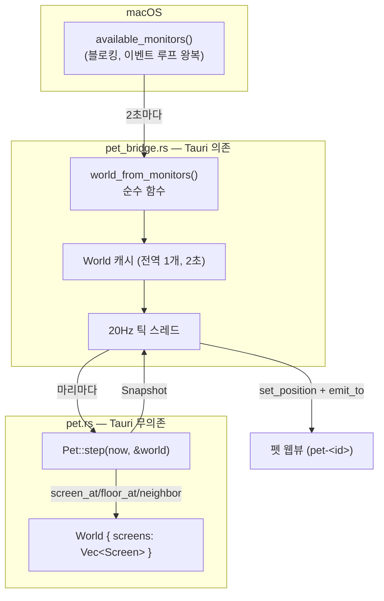
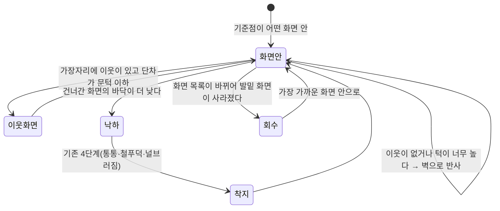

# F2 세계 넓히기 — 연결된 모든 화면을 하나의 세계로

> **이 플랜은 `ce-plan` 없이 손으로 썼다.** 세션에 `develop-fe`의 스킬 훅이 걸려 `ce-plan`이
> 차단됐고(2026-08-31), 사용자 동의를 받고 건너뛰었다. 형식은
> `.claude/skills/develop/references/plan-template.md`와 `docs/plans/…-008-…-plan.md`를 따랐다.

## Goal Capsule

- **목표** — 펭귄이 갇혀 있는 "한 화면"을 걷어내고 **연결된 모든 디스플레이를 하나의 세계**로
  만든다 (PRD §5.2, PRINCIPLE 2). 코어는 `Bounds` 하나가 아니라 **화면 목록**을 받고,
  모니터 경계는 벽이 아니라 통로가 되며, 화면이 붙고 빠져도 살아남는다.
- **권위 순서** — `PRD > PRINCIPLE > CONVENTIONS > MOTIONS > 이 플랜`. 충돌하면 상위가 이기고,
  플랜과 어긋나는 구현이 필요해지면 멈추고 보고한다.
- **실행 프로필** — 브랜치 `feat/f2-multi-screen-01`(U1) 이후 유닛마다 새 브랜치.
  코어(`pet.rs`)의 좌표·경계·착지 판정은 **전부 TDD**(실패 테스트 먼저, 이름은 한국어).
  브릿지의 순수 함수(`bounds_from_work_area`, `world_from_monitors`)도 테스트한다.
  커밋은 한국어 Angular 컨벤션.
- **정지 조건** — ① 배율이 섞인 실제 2화면에서 전역 논리 좌표가 이어지지 않을 때(KTD1이 깨짐 —
  플랜을 다시 쓴다) ② `available_monitors()`가 20Hz 틱 스레드에서 블로킹·패닉을 일으킬 때
  ③ 화면을 뽑았을 때 펫 창이 OS에 의해 임의 위치로 옮겨져 코어 좌표와 어긋날 때
  ④ 유닛 하나가 TODO 체크박스 둘 이상을 건드리게 될 때.
- **꼬리 작업** — 유닛마다 `.github/TEMPLATE/PR.md`로 PR을 열고 **merge는 하지 않는다**.
  같은 PR에서 `TODO.md` 체크박스를 닫고, 범위가 바뀌면 `PRD.md`를 고친다.

## Product Contract

**Summary** — 노트북에 외장 모니터를 꽂으면 펭귄이 그쪽으로 **걸어서** 넘어간다. 오른쪽 끝은
더 이상 벽이 아니라 옆 화면으로 이어지는 통로다. 던지면 화면을 가로질러 날아가고, 화면 배치가
어긋나 있으면 단차에서 떨어진다. 모니터를 뽑으면 펭귄은 사라지지 않고 남은 화면으로 걸어
돌아온다. 설정 창은 펭귄이 있는 화면에서 열린다.

**Problem Frame** — 지금 코어는 `current_monitor()`가 준 `Bounds` **사각형 하나**만 안다.
세계가 한 화면이라는 가정이 `step`의 벽 반사·바닥 판정·헤엄 영역 추첨·던지기 상한에 전부
박혀 있다. F3에서 모션(얼음낚시·슬라이딩·발작)을 먼저 늘리면 이 좌표계가 바뀔 때 **모션을
전부 다시 검증해야 한다.** 그래서 세계를 먼저 넓히고 그 위에 모션을 얹는다 (TODO F2 머리말).

**Requirements**

| # | 요구사항 |
|---|---|
| R1 | 코어는 화면 목록(`World`)을 받는다. 화면이 하나뿐이면 지금과 **똑같이** 동작한다 |
| R2 | 이웃 화면이 있는 가장자리에서는 튕기지 않고 옆 화면으로 이어서 걷는다. 세계의 바깥 끝에서만 튕긴다 |
| R3 | 화면마다 다른 배율·해상도·세로 위치·바닥 높이를 하나의 전역 논리 좌표로 다룬다 |
| R4 | 바닥이 낮아지는 쪽으로 건너가면 **떨어진다**(기존 착지 4단계가 받는다). 높아지면 턱까지만 올라서고, 그보다 높으면 그 가장자리는 벽이다 |
| R5 | 펭귄의 **발밑 기준점은 항상 어떤 화면 안에 있다.** 화면 사이 빈 공간으로 이동하지 않는다 |
| R6 | 화면 목록이 런타임에 바뀌어도(연결·해제·배치 변경) 살아남는다. 있던 화면이 사라지면 가장 가까운 화면으로 회수한다 |
| R7 | 설정 창은 펭귄이 있는 화면에서 열린다 |
| R8 | 20Hz 틱의 상주 비용이 지금보다 늘지 않는다. 마리가 8마리여도 화면 목록은 한 번만 읽는다 |

**Acceptance Examples**

- **AE1** (R1) — Given 화면 한 대만 연결된 상태, When 앱을 켜고 5분 둔다, Then 걷기·헤엄·졸기·
  던지기·착지가 F1 머지 시점과 **육안으로 구분되지 않는다**. 펭귄이 화면 밖으로 나가지 않는다.
- **AE2** (R2) — Given 같은 높이의 두 화면을 좌우로 붙인 배치, When 펭귄이 왼쪽 화면의 오른쪽
  끝까지 걷는다, Then 튕기지 않고 오른쪽 화면으로 **이어서 걸어 들어간다**. 창이 두 화면에
  걸친 순간에도 그림이 끊기지 않는다.
- **AE3** (R3) — Given 내장(배율 2.0) + 외장(배율 1.0) 배치, When 펭귄을 내장에서 외장으로
  던진다, Then 경계에서 **순간이동·점프 없이** 포물선이 이어진다.
- **AE4** (R4) — Given 오른쪽 화면의 바닥이 왼쪽보다 200px 낮은 배치, When 펭귄이 오른쪽으로
  걸어 경계를 넘는다, Then 경계에서 **떨어져** 낙하 세기에 맞는 착지 동작(통통/철푸덕/널브러짐)을 한다.
- **AE5** (R5) — Given 두 화면이 대각선으로 어긋나 사이에 빈 공간이 있는 배치, When 펭귄을
  그 빈 공간 쪽으로 세게 던진다, Then 빈 공간에 **들어가지 않는다** — 그 경계는 벽으로 튕긴다.
- **AE6** (R6) — Given 펭귄이 외장 모니터에 있는 상태, When 외장 케이블을 뽑는다, Then 2초
  안에 내장 화면 안으로 회수되고 계속 논다. 다시 꽂으면 그쪽도 다시 놀이터가 된다.
- **AE7** (R7) — Given 펭귄이 외장 모니터에 있는 상태, When 트레이 아이콘을 누른다,
  Then 설정 창이 **외장 모니터**에서 열린다.

**Scope Boundaries**

비목표 (PRD §4):
- 화면마다 펭귄을 한 마리씩 띄우지 않는다. 마릿수는 사용자가 정하는 별개의 값이다(§5.5).
- 창(다른 앱의 윈도우) 위를 걷는 것은 F2가 아니다 — TODO "후속"에 있다.
- 전체화면 스페이스·Stage Manager 대응은 하지 않는다.

Deferred to Follow-Up Work:
- **D1** 화면 사이 빈 공간을 "떨어져 죽는 구멍"처럼 연출하기 — R5는 빠지지 않는 것까지만 한다.
- **D2** 세로로 쌓은 배치(위/아래 모니터)에서 위 화면으로 **날아 올라가기** — R2는 좌우
  통로만 다룬다. 위아래 통로는 헤엄 동작의 천장 판정과 얽혀 있어 별도 항목으로 뺀다.
- **D3** 화면마다 다른 새로고침 주기(120Hz 외장 등)에 맞춘 틱 조정.

D1~D3은 PR "비고"와 `TODO.md` "후속"에 옮긴다.

## Planning Contract

### Key Technical Decisions

**KTD1 — 전역 논리 좌표(points) 하나로 잇는다. 새 변환을 만들지 않는다.**
tao의 macOS 구현에서 `MonitorHandle::position()`은
`PhysicalPosition::from_logical(CGDisplayBounds(id).origin, self.scale_factor())`이다
(`tao-0.35.3/src/platform_impl/macos/monitor.rs:225`). `CGDisplayBounds`의 origin은 **전역
points**이고 거기에 **그 화면 자신의** 배율을 곱해 물리 좌표를 만든다. 따라서 **그 화면 자신의
배율로 다시 나누면** 배율이 섞여 있어도 좌표가 이어진다. 이건 지금
`bounds_from_work_area(origin, size, scale, …)`가 이미 하는 계산이므로, **화면마다 한 번씩
돌리는 것**으로 좌표계 통일이 끝난다. 전체를 덮는 가상 사각형 + 유효 영역 마스크를 버린 이유는
PRD Q7에 있다 — 마스크를 표현할 방법이 결국 화면 목록이라 사각형은 파생값만 늘린다.

**KTD2 — 화면 id는 기하 키로 만든다. `Monitor::name()`을 쓰지 않는다.**
macOS에서 tao의 `name()`은 `format!("Monitor #{}", CGDisplay::new(id).model_number())`이다
(`monitor.rs:205`). **모델 번호**라서 같은 모델 두 대를 꽂으면 이름이 같다 — 고유 id가 아니다.
고유값인 `native_identifier()`(`CGDirectDisplayID`)는 tao에는 있지만 **Tauri의 `Monitor`가
노출하지 않는다** — `name`/`size`/`position`/`work_area`/`scale_factor` 다섯 개뿐이다
(`tauri-2.11.5/src/window/mod.rs:58`). 그래서 id는 `work_area`의 `(position, size)`를 해시한
기하 키로 만든다. 배치를 바꾸면 키가 바뀌는데, **그건 버그가 아니라 원하는 동작**이다 —
"배치가 바뀌었다"로 처리하면 R6가 그대로 커버한다.

**KTD3 — 화면 목록 변경은 이벤트가 없다. 폴링한다.**
tao 0.35.3에도 tauri 2.11.5에도 모니터 변경 이벤트가 없다(`RunEvent`·`WindowEvent` 어디에도
없고, tao가 `NSApplicationDidChangeScreenParametersNotification`을 잡지 않는다). 그러니 R6는
**주기적으로 다시 읽는 것**으로만 만들 수 있다. 이미 있는 2초짜리 `BOUNDS_REFRESH_MS` 캐시를
**World 캐시로 승격**한다. `available_monitors()`도 `current_monitor()`와 똑같이 dispatcher를
거쳐 이벤트 루프를 왕복하는 블로킹 호출이므로(`window/mod.rs:1621`) **20Hz에서 매번 부르면
안 된다** — `CLAUDE.md` 함정 목록에 이미 있는 그 함정이다.

**KTD4 — World 캐시는 마리별이 아니라 앱 전역 하나다 (R8).**
지금 틱 스레드는 `HashMap<PetId, (Bounds, u64)>`로 **마리마다** 경계를 캐시한다. 화면 목록은
마리와 무관한 값이라, 8마리면 같은 것을 8번 읽게 된다. `World`는 틱 루프 바깥에서 한 번
갱신하고 모든 마리가 같은 참조를 본다. 마리마다 다른 것은 **어느 화면에 서 있는가**뿐이고,
그건 캐시가 아니라 `world.screen_at(발밑)`로 매번 계산한다 — 순수 함수라 공짜다.
`AppHandle::available_monitors()`가 있으므로(`tauri-2.11.5/src/app.rs:888`) 창 없이 읽는다.

**KTD5 — 기준점은 발밑 중앙. 창이 걸치는 것은 허용한다.**
기준점은 `(x + PET_SIZE/2, y + PET_SIZE)`다. 창 좌상단을 쓰면 오른쪽 끝에서 **실제로 서 있는
화면과 판정 화면이 어긋난다.** 창은 두 화면에 걸쳐도 되고 오히려 그게 볼거리이므로 막지
않는다 — 규칙은 이 점 하나가 정한다. 이를 위해 `PET_SIZE` 상수를 `pet_bridge`에서 **`pet.rs`로
옮기고** 브릿지는 재노출(`pub use`)한다. 코어가 자기 판정에 필요한 값을 남의 모듈에서
가져오게 두지 않는다.

**KTD6 — 불변식 하나가 R5를 통째로 해결한다.**
"기준점은 항상 어떤 화면 안에 있다"를 `Pet`의 불변식으로 두고, **이동을 적용하기 전에**
목적지의 기준점이 유효한지 본다. 유효하지 않으면 그 방향은 벽이다. 빈 공간에 "빠졌다가
구조하는" 사후 처리를 만들지 않는다 — 사후 처리는 한 프레임이라도 잘못된 그림을 보여준다.

**KTD7 — 던지기 상한의 "세계 폭"은 union의 가로 폭이다.**
`clamp_throw(vx, vy, world_width)`는 지금 `bounds.right - bounds.left`를 받는다. 다중 화면에서는
**전체 세계의 가로 폭**으로 바꾼다. 화면이 늘면 같은 손짓이 더 멀리 가는데, 이건 PRD §5.1이
정한 의도 그대로다(초당 세계를 0.9번 가로지른다). 007 플랜에서 고정 상한을 버린 이유가
"화면이 넓어지면 더 멀리 가야 한다"였으므로 여기서 뒤집지 않는다.

**KTD8 — U1은 동작이 바뀌지 않는 리팩터로 머지한다.**
`World::single(bounds)`를 두고 브릿지가 **화면 하나짜리 목록**을 넘기게 한 상태로 U1을 끝낸다.
기존 코어 테스트도 이 생성자를 통과시켜 대부분 그대로 산다. 좌표계 교체와 동작 변경을 같은
PR에 넣으면 회귀가 났을 때 어느 쪽인지 가릴 수 없다.

### Assumptions

확인 없이 채택한 추정이다. **틀리면 구현 전에 알려달라.**

- **A1** — macOS의 "디스플레이마다 별도의 Space" 설정 여부와 무관하게 `work_area`가 화면마다
  올바른 가용 영역(메뉴바·Dock 제외)을 준다. 지금 한 화면에서는 맞게 동작하고 있다.
- **A2** — 화면이 사라질 때 OS가 펫 창을 남은 화면으로 옮기더라도, 코어가 2초 안에 좌표를
  회수하므로 어긋남이 눈에 띄지 않는다. (정지 조건 ③이 이 가정의 반증 조건이다)
- **A3** — 사용자의 실제 환경에서 화면은 **최대 2~3대**다. `available_monitors()`를 2초마다
  부르는 비용은 이 규모에서 무시할 수 있다.
- **A4** — 세로로 쌓은 배치는 당분간 쓰지 않는다 (D2로 미룬 근거).

### High-Level Technical Design





## Implementation Units

각 유닛이 `TODO.md`의 F2 체크박스 하나에 대응하고, **PR 하나로 나간다.**

| 유닛 | TODO 체크박스 | PR |
|---|---|---|
| U1 | 코어(`pet.rs`)를 다중 화면 좌표계로 | PR ① (이 브랜치) |
| U2 | 모니터 경계 넘기 | PR ② |
| U3 | 화면마다 다른 배율·해상도·세로 위치 | PR ③ |
| U4 | 빈 공간에 빠지지 않기 | PR ④ |
| U5 | 모니터 연결·해제·배치 변경 대응 | PR ⑤ |
| U6 | 설정 창을 펭귄이 있는 화면에서 열기 | PR ⑥ |

---

### U1 — `World`/`Screen` 도입 (동작 무변경)

- **Goal** — 코어가 `Bounds` 하나 대신 화면 목록을 받는다. 브릿지는 화면 하나짜리 목록을
  넘기므로 **눈에 보이는 동작은 전혀 바뀌지 않는다.**
- **Requirements** — R1, R8 / KTD1, KTD2, KTD5, KTD8
- **Dependencies** — 없음
- **Files** — `src-tauri/src/pet.rs`(수정), `src-tauri/src/pet_bridge.rs`(수정)
- **Approach**
  - `pet.rs`에 추가:
    ```rust
    pub type ScreenId = u64;
    #[derive(Clone, Copy, Debug, PartialEq)]
    pub struct Screen { pub id: ScreenId, pub bounds: Bounds }
    #[derive(Clone, Debug, PartialEq)]
    pub struct World { screens: Vec<Screen> }
    impl World {
        pub fn new(screens: Vec<Screen>) -> Option<Self>;  // 비면 None — 빈 세계는 불변식 위반
        pub fn single(bounds: Bounds) -> Self;             // 1화면 경로·기존 테스트
        pub fn screen_at(&self, ax: f64, ay: f64) -> Option<&Screen>;
        pub fn nearest(&self, ax: f64, ay: f64) -> &Screen; // 비어 있지 않음이 불변식이라 항상 산다
        pub fn width(&self) -> f64;                         // union 가로 폭 (KTD7)
    }
    ```
  - `PET_SIZE`를 `pet_bridge` → `pet.rs`로 옮기고 브릿지는 `pub use pet::PET_SIZE;` (KTD5).
    `pet.rs`에 `fn anchor(&self) -> (f64, f64)`를 둔다.
  - `step`/`new`/`new_at`/`whack`/`drag_end`/`enter_swim`/`pick_next`/`clamp`의 `bounds: Bounds`
    자리를 `world: &World`로 바꾸고, **내부에서는 `world.screen_at(anchor)`로 얻은 화면의
    `bounds`를 지금과 똑같이 쓴다.** 이 유닛에서 판정 규칙 자체는 손대지 않는다.
  - `clamp_throw`에 넘기던 `bounds.right - bounds.left`를 `world.width()`로 바꾼다 (KTD7).
    화면이 하나면 값이 같아서 동작이 안 바뀐다.
  - 기존 테스트의 `BOUNDS` 상수는 살리고 `World::single(BOUNDS)`로 감싼다.
  - 브릿지 `current_bounds(window)` → `current_world(window)`가 `World::single(...)`을 준다.
    틱 스레드의 `HashMap<PetId, (Bounds, u64)>`는 이 유닛에서 **그대로 둔다** — 전역 캐시로
    바꾸는 건 화면 목록이 실제로 여러 개가 되는 U2의 일이다.
- **Test scenarios** (한국어 이름)
  - `화면이_하나면_기존_경계_판정과_같다` — 같은 시드·같은 입력으로 U1 전후 스냅샷 수열이 동일
  - `빈_화면_목록으로는_세계를_만들_수_없다` — `World::new(vec![])`가 `None`
  - `기준점은_펭귄_발밑_중앙이다` — `anchor()`가 `(x + PET_SIZE/2, y + PET_SIZE)`
  - `발밑이_속한_화면을_찾는다` — 두 화면짜리 `World`에서 경계 양쪽의 점이 각각 맞는 화면으로
  - `발밑이_어느_화면에도_없으면_가장_가까운_화면을_준다`
  - `세계_폭은_화면_전체를_덮는다` — 떨어진 두 화면의 union 폭
  - `던지기_상한은_세계_폭에_비례한다` — 007에서 만든 기존 테스트가 `world.width()` 경로로도 통과
- **Verification** — `cd src-tauri && cargo test` 전체 통과 + `npm run tauri dev`로 AE1
  (한 화면에서 F1과 육안 구분 불가)

---

### U2 — 모니터 경계 넘기

- **Goal** — 브릿지가 **모든 화면**을 목록으로 넘기고, 이웃이 있는 가장자리는 통로가 된다.
- **Requirements** — R2, R8 / KTD1, KTD2, KTD3, KTD4
- **Dependencies** — U1
- **Files** — `src-tauri/src/pet.rs`, `src-tauri/src/pet_bridge.rs`
- **Approach**
  - 브릿지에 순수 함수 `world_from_monitors(&[(origin, size, scale)], pet_size) -> Option<World>`.
    화면마다 기존 `bounds_from_work_area`를 돌리고, id는 `work_area`의 `(position, size)`
    기하 해시로 만든다 (KTD2).
  - 틱 스레드의 마리별 `Bounds` 캐시를 **전역 `World` 캐시**로 승격한다 (KTD4).
    갱신 주기는 지금의 `BOUNDS_REFRESH_MS`를 그대로 쓴다. `AppHandle::available_monitors()` 사용.
  - 코어의 벽 판정을 `world.neighbor_at(screen, dir)`로 바꾼다 — 이웃이 있으면 통과, 없으면 반사.
    **이 유닛에서는 바닥 높이가 문턱 이내로 같은 이웃만 통로로 인정한다.** 단차 처리는 U3.
  - `enter_swim`의 영역 추첨과 `pick_next`의 헤엄 확률은 **발밑 화면 기준**으로 유지한다 —
    세계 전체를 대상으로 추첨하면 옆 화면으로 순간이동한다.
- **Test scenarios**
  - `이웃이_있는_가장자리에서는_튕기지_않는다`
  - `세계의_바깥_끝에서만_튕긴다`
  - `경계를_넘으면_옆_화면으로_이어_걷는다` — 기준점이 이웃 화면 안으로 들어가고 x가 연속
  - `바닥_높이가_다른_이웃은_아직_벽이다` — U3 전까지의 의도된 동작을 고정
  - `화면_목록을_모니터_배열에서_만든다` — `world_from_monitors`의 좌표·id
  - `같은_기하의_화면은_같은_id를_받는다` / `배치가_바뀌면_id가_바뀐다`
- **Verification** — `cargo test` + 두 화면 실기로 AE2

---

### U3 — 화면마다 다른 배율·해상도·세로 위치·바닥 높이

- **Goal** — 배율이 섞여도 좌표가 이어지고, 단차에서는 떨어지거나 올라선다.
- **Requirements** — R3, R4 / KTD1, KTD5
- **Dependencies** — U2
- **Files** — `src-tauri/src/pet.rs`, `src-tauri/src/pet_bridge.rs`
- **Approach**
  - `STEP_UP_MAX`(턱 높이 상한) 상수를 도입한다. 건너간 화면의 `floor_y`가
    **더 작으면(=더 위)** 그 차이가 `STEP_UP_MAX` 이하일 때만 올라서고, 넘으면 그 가장자리는 벽.
  - **더 크면(=더 아래)** 통과시키고 걷기 상태를 낙하로 전이한다. y는 건드리지 않는다 —
    기존 중력·`landing_of(impact_vy)`가 그대로 받아 통통/철푸덕/널브러짐을 고른다.
  - 배율 검증은 브릿지 순수 함수 테스트로 고정한다 (KTD1이 깨지면 여기서 빨간불).
- **Test scenarios**
  - `바닥이_낮은_화면으로_건너가면_떨어진다`
  - `낙하_세기에_맞는_착지_동작이_나온다` — 단차가 크면 철푸덕/널브러짐
  - `턱이_문턱_이하면_올라선다`
  - `턱이_너무_높으면_그_가장자리는_벽이다`
  - `배율이_섞여도_전역_좌표가_이어진다` — 배율 2.0 화면과 1.0 화면이 경계에서 맞닿는다
  - `세로_위치가_다른_화면도_같은_좌표계에_놓인다`
- **Verification** — `cargo test` + 배율 섞인 2화면 실기로 AE3·AE4

---

### U4 — 빈 공간에 빠지지 않기

- **Goal** — 어떤 순간에도 기준점이 실제 화면 위에 있다.
- **Requirements** — R5 / KTD6
- **Dependencies** — U3
- **Files** — `src-tauri/src/pet.rs`
- **Approach**
  - **이동을 적용하기 전에** 목적지 기준점을 검사한다. 유효하지 않으면 그 축의 이동을 막고
    벽으로 처리한다. 빠진 뒤 구조하는 사후 처리를 만들지 않는다 (KTD6).
  - 대각선 이동(던지기 포물선·헤엄)은 x·y를 따로 검사한다 — 한 축이 막혀도 다른 축은 산다.
    이렇게 하면 어긋난 배치의 모서리에서 펭귄이 벽을 타고 미끄러진다.
  - 프레임당 이동량이 커서 빈 공간을 **건너뛰는** 경우(고속 던지기)도 목적지 판정만으로는
    통과해 버린다. 이동 구간을 화면 폭 기준으로 쪼개 검사한다.
- **Test scenarios**
  - `빈_공간으로는_이동하지_않는다`
  - `어긋난_배치의_모서리에서_벽을_타고_미끄러진다`
  - `빠르게_던져도_빈_공간을_건너뛰지_않는다`
  - `대각선_이동에서_한_축이_막혀도_다른_축은_움직인다`
- **Verification** — `cargo test` + 대각선 배치 실기로 AE5

---

### U5 — 모니터 연결·해제·배치 변경 대응

- **Goal** — 화면 목록이 바뀌어도 살아남고, 사라진 화면의 펭귄을 회수한다.
- **Requirements** — R6 / KTD2, KTD3
- **Dependencies** — U4
- **Files** — `src-tauri/src/pet.rs`, `src-tauri/src/pet_bridge.rs`
- **Approach**
  - `World`가 갱신될 때마다 각 마리의 기준점을 검사한다. 유효하지 않으면 `world.nearest()`가
    준 화면 안으로 **정산**하고 동작을 `Land` 계열로 초기화한다 — 공중 상태 그대로 옮기면
    허공에서 떨어지는 그림이 된다.
  - 회수는 **순수 함수**로 뺀다: `Pet::rehome(&mut self, now_ms, &World)`. 그래야 테스트된다.
  - 창 자체도 새 좌표로 즉시 `set_position` 한다. OS가 창을 옮겨 놓았을 수 있다 (A2).
- **Test scenarios**
  - `화면이_사라지면_남은_화면으로_회수된다`
  - `회수된_펭귄은_공중이_아니라_바닥에서_시작한다`
  - `새_화면이_붙으면_놀이터에_포함된다`
  - `배치만_바뀌어도_기준점이_유효하게_유지된다`
  - `회수해도_마리별_시드는_유지된다` — 회수가 성격을 리셋하면 안 된다
- **Verification** — `cargo test` + 실기로 AE6 (케이블 뽑기/꽂기)

---

### U6 — 설정 창을 펭귄이 있는 화면에서 열기

- **Goal** — 트레이를 눌렀을 때 설정 창이 펭귄이 있는 화면에 뜬다.
- **Requirements** — R7
- **Dependencies** — U5
- **Files** — `src-tauri/src/pet_bridge.rs`, `src-tauri/src/lib.rs`
- **Approach**
  - `bounds_or_flat` / `bounds_or_flat_any` / `next_to`가 지금은 한 화면 가정이다.
    포커스된 마리(없으면 첫 마리)의 발밑 화면을 골라 그 화면의 `Bounds` 안에서 위치를 잡는다.
  - 트레이 위치와 충돌할 수 있다 — `positioner::on_tray_event`를 항상 먼저 부르는 규칙은
    그대로 지킨다 (`CLAUDE.md` 함정).
  - **함정**: 새 창을 열거나 라벨을 늘리지 않으므로 capabilities 변경은 없다. 커맨드를
    추가하면 `generate_handler!` 등록을 잊지 않는다
    (`docs/solutions/best-practices/tauri-command-registration-silent-failure.md`).
- **Test scenarios**
  - `설정_창은_펭귄이_있는_화면_안에_놓인다` — `next_to`의 순수 계산 테스트
  - `펭귄이_화면_오른쪽_끝에_있으면_창이_화면_밖으로_나가지_않는다`
  - Test expectation: 트레이 클릭 → 실제 표시 경로는 단위 테스트로 잡히지 않는다 —
    `references/verification.md`의 수동 체크리스트로 대체한다
- **Verification** — `cargo test` + `npm test` + 실기로 AE7, 그리고 **팝오버를 닫은 뒤 트레이
  아이콘이 남아 있는지**를 반드시 확인한다 (과거에 깨졌던 항목)

## Verification Contract

| 무엇을 | 명령 / 방법 | 적용 유닛 |
|---|---|---|
| Rust 단위 테스트 | `cd src-tauri && cargo test` | U1~U6 전부 |
| 프론트 단위 테스트 | `npm test` | U6 (그 외 유닛은 프론트 무변경이지만 PR 전 항상 돌린다) |
| 타입 검사 | `npm run build` | 프론트를 고친 유닛만 (U6) |
| 린트 | `cd src-tauri && cargo clippy -- -D warnings` | U1~U6 전부 |
| 개발 스모크 | `npm run tauri dev` | U1~U6 전부 |
| 실기 다중 화면 | AE2·AE3·AE4·AE5·AE6·AE7 수동 재현 | U2~U6 |
| 코드 리뷰 | `ce-code-review`(인자에 `plan:` 경로 포함) | PR 열기 전 매번 |

`npm run tauri build`(번들)는 이 마일스톤에서 요구하지 않는다 — 알림·플러그인 변경이 없다.

## Definition of Done

- [ ] R1~R8 충족, AE1~AE7 재현 확인 (AE2~AE7은 실제 확장 모니터에서)
- [ ] 두 테스트 러너 전체 통과 + `cargo clippy` 경고 0
- [ ] 코어의 좌표·경계·착지 판정은 **테스트가 먼저 작성된 커밋 이력**이 남아 있다
- [ ] 유닛마다 브랜치·PR 하나, `TODO.md` 체크박스 하나. merge는 사용자 확인 후
- [ ] `PRD.md` §5.2·Q7이 구현과 일치한다 (Q7은 이미 확정 반영됨)
- [ ] Deferred D1~D3이 PR "비고"와 `TODO.md` "후속"에 옮겨져 있다
- [ ] 실험하다 버린 코드·미사용 스캐폴딩·디버그 출력이 diff에 없다
- [ ] 새로 밟은 함정이 있으면 `docs/solutions/`에 기록하고 `CLAUDE.md` 함정 목록을 갱신
