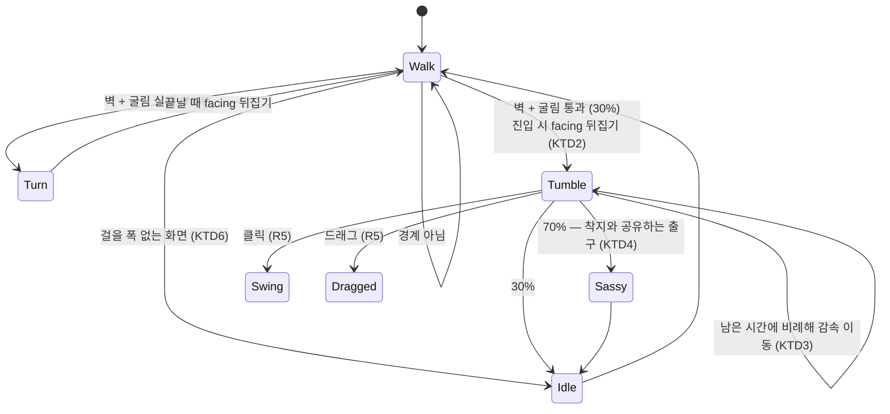
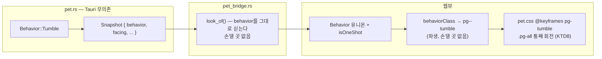

# 벽에서 굴러떨어지기 — 돌아설 줄 알았는데 박고 나자빠진다

> **범위 변경 기록 (2026-08-31)** — 원래 이 자리는 F2 "모니터 경계 넘기"였다. 사용자 판단으로
> **경계 넘기(크로스)를 이번에 하지 않기로** 했고, 대신 벽 도달 반응에 갈래를 하나 더 넣는다.
> F2의 "모니터 경계 넘기" 체크박스는 **접은 게 아니라 보류**다 — `TODO.md`에 그대로 남고
> `PRD.md`의 경계 넘기 조항도 건드리지 않는다. U1 리뷰가 남긴 숙제 셋도 그 항목에 남아 있다.
>
> `TODO.md`에 없던 새 기능이므로 **F3에 체크박스를 새로 만들어** 진행한다 (사용자 승인 2026-08-31).

## Goal Capsule

- **목표** — 펭귄이 걷다가 벽에 닿았을 때 지금처럼 얌전히 도는 것 말고 **가끔 그대로 박고
  나자빠지는** 갈래를 만든다. 근거는 PRINCIPLE 1 — 재미의 반대말은 **예측 가능함**이고,
  지금 벽 반응은 100% `Turn` 하나뿐이다.
- **권위 순서** — `PRD > PRINCIPLE > CONVENTIONS > MOTIONS > 이 플랜`. 충돌하면 상위가 이기고,
  상위와 어긋나야만 구현이 가능해지면 멈추고 보고한다.
- **실행 프로필** — 브랜치 `feat/f3-wall-tumble-01`. 코어(`pet.rs`)의 전이 판정은 **TDD 필수**
  (실패 테스트 먼저, 이름은 한국어). 웹뷰 CSS는 수동 확인. 커밋은 한국어 Angular 컨벤션,
  유닛 하나 = 커밋 하나.
- **정지 조건** — ① 굴리는 회전이 창(`PET_WINDOW_W/H`) 밖으로 삐져나가 잘린다
  ② 벽에 붙은 상태에서 굴러도 이동이 clamp에 다 먹혀 "구르는 것으로 안 보인다"
  ③ 확률 갈래가 기존 걷기 시퀀스의 결정론(같은 시드 = 같은 결과)을 깬다 — 셋 중 하나라도
  걸리면 멈추고 보고한다.
- **꼬리 작업** — `.github/TEMPLATE/PR.md`로 PR을 열고, 두 러너 + 타입 검사 통과와
  `ce-code-review` 지적 반영 후에 merge한다. 같은 PR에 `TODO.md`·`MOTIONS.md`·`PRD.md` 갱신을 포함한다.

---

## Product Contract

**Summary** — 펭귄이 화면 끝까지 걸어가면 지금은 **언제나** 얌전히 제자리에서 돌아선다.
앞으로는 가끔 브레이크를 못 잡고 벽에 그대로 박아서, 반동으로 데굴 굴러 나자빠진 다음
겨우 일어나 반대편으로 걸어간다. 볼 때마다 "이번엔 돌까 박을까"가 정해져 있지 않다.

**Problem Frame** — 지금 벽 반응은 `Turn` 하나뿐이라 **화면 끝은 완전히 예측 가능한 지점**이다.
착지는 이미 세기에 따라 네 갈래(`Land`/`Bounce`/`Splat`/`Sprawl`)로 나뉘어 있는데 벽만
갈래가 없다. 모션을 더 늘리기(F3) 전에, **이미 매일 일어나는 사건에 갈래를 주는 것**이
새 동작을 하나 더 만드는 것보다 체감 밀도를 크게 올린다.

**Requirements**

| # | 요구사항 |
|---|---|
| R1 | 걷다가 좌우 경계에 닿으면 **확률적으로** 굴러떨어지거나(신규) 돌아선다(기존) |
| R2 | 굴러떨어지는 동안 펭귄은 **벽 반대 방향으로 실제로 이동한다.** 제자리 애니메이션이 아니다 |
| R3 | 굴러떨어지기가 끝나면 착지 동작과 같은 갈래로 빠져나온다 — 대체로 약을 올리고, 아니면 유휴 |
| R4 | 굴러떨어지고 나면 방향이 뒤집혀 있다. `Turn`으로 갔을 때와 **결과는 같다** |
| R5 | 굴러떨어지는 중에도 클릭·드래그는 지금처럼 먹는다 |
| R6 | 같은 시드 + 같은 타임스탬프열은 **여전히 같은 동작 시퀀스**를 낳는다 (PRINCIPLE 3) |
| R7 | 걸어다닐 폭이 없는 화면(펭귄보다 좁은 작업 영역)에서 무한히 구르지 않는다 |
| R8 | 굴러떨어지는 그림이 펫 창 밖으로 잘리지 않는다 |

**Acceptance Examples**

- **AE1** (R1, R2) — Given 앱이 떠 있고 펭귄이 걷는 중, When 화면 왼쪽 끝까지 걸어간다,
  Then 어떤 때는 제자리에서 돌고, 어떤 때는 **벽에 박고 오른쪽으로 데굴 굴러 나자빠진다.**
  구르는 동안 창이 실제로 오른쪽으로 이동한다.
- **AE2** (R1) — Given 벽 도달을 10번 이상 관찰, Then 돌아서는 경우와 굴러떨어지는 경우가
  **둘 다 나온다.** 한쪽만 나오면 실패다.
- **AE3** (R3, R4) — Given 굴러떨어지는 중, When 동작이 끝난다, Then 일어나서 대체로 약을
  올리고(싸가지 5종 중 하나), 그다음 **벽 반대 방향으로** 걸어간다.
- **AE4** (R5) — Given 굴러떨어지는 중, When 클릭한다, Then 지금처럼 방망이를 휘두른다.
  드래그하면 집어 올려진다.
- **AE5** (R8) — Given 굴러떨어지는 중, Then 회전한 펭귄의 어느 부분도 창 경계에서 잘리지 않는다.
- **AE6** (R7) — Given 펭귄보다 좁은 작업 영역(예: 폭 0으로 접힌 경계), Then 굴러떨어지기가
  반복 발동하지 않고 지금처럼 유휴로 넘어간다.

**Scope Boundaries**

비목표:
- **모니터 경계 넘기(크로스)는 이 PR이 아니다.** 보류 상태로 `TODO.md` F2에 남는다.
- 천장·바닥에서의 굴러떨어지기는 없다. **좌우 벽만** 다룬다.
- 던져져서 벽에 부딪히는 경우(`Thrown`)는 지금처럼 반사한다 — 굴러떨어지기로 바뀌지 않는다.
  던지기는 사용자의 손이 만든 사건이고, 이 갈래는 **혼자 걷다가** 생기는 사건이다.
- 소리는 넣지 않는다 (기본 무음, PRINCIPLE 5). 효과음은 F3의 별도 항목이다.

Deferred to Follow-Up Work (PR "비고"와 `TODO.md` "후속"에 옮긴다):
- **D1** 굴러떨어질 확률을 설정에 노출할지. 지금은 상수다.
- **D2** 굴러떨어지는 세기를 벽에 닿은 속도로 나눌지 — 지금 걷기 속도는 하나뿐이라 의미가 없다.
  슬라이딩(F3)이 들어오면 다시 볼 값어치가 생긴다.
- **D3** 천장·바닥 모서리에서의 반응.

---

## Planning Contract

### Key Technical Decisions

**KTD1 — 벽 도달 지점에 갈래를 넣는다. 새 진입점을 만들지 않는다.**
지금 `step`의 `Behavior::Walk` 팔은 `x <= bounds.left` / `x >= bounds.right`에서 `Turn`으로
들어간다. 그 **바로 그 자리**에서 굴림을 한 번 해서 `Tumble`과 `Turn`으로 나눈다.
"벽에 닿았다"를 판정하는 코드가 두 곳이 되면 한쪽만 고쳐지고 조용히 갈라진다.

**KTD2 — 진입할 때 방향을 뒤집는다. `Turn`과 결과를 같게 맞춘다 (R4).**
`Turn`은 **끝날 때** 방향을 뒤집는다. `Tumble`은 **진입할 때** 뒤집는다 — 벽에 박은 반동으로
반대 방향으로 굴러가기 때문에, 진행 방향과 `facing`이 어긋나면 웹뷰가 회전 방향을 반대로
그린다(웹뷰는 `facing`으로 좌우를 미러링한다). 두 경로의 **최종 결과는 같다**: 벽에서 멀어지는
방향을 보고 있다.

**KTD3 — 이동 속도는 남은 시간에 비례해 줄인다. 새 물리를 만들지 않는다.**
`vx`에 마찰을 도입하면 감쇠 상수와 정지 판정이 새로 필요해지고, 그 판정이 틀리면 펭귄이
영원히 미끄러진다. 대신 **남은 시간 비율로 속도를 선형 감속**한다
(`속도 = TUMBLE_SPEED × 남은시간/TUMBLE_MS`). 동작이 끝나는 순간 속도가 정확히 0이라
"굴렀는데 안 멈춤" 상태가 **표현 자체로 불가능**하다. `behavior_until_ms`는 이미 있는 값이라
상태도 늘지 않는다.

**KTD4 — 나가는 길은 착지와 공유한다 (R3).**
`Land | Splat | Sprawl` 팔은 이미 "시간이 다 되면 70% 확률로 약을 올리고 아니면 유휴"다.
`Tumble`을 그 팔에 **합류**시킨다. 굴러 넘어진 뒤의 심리는 세게 박고 일어난 뒤와 같으므로,
갈래를 따로 만들면 같은 규칙이 두 벌이 된다.
다만 `is_landing()`에는 넣지 않는다 — 그건 "바닥에 닿은 직후인가"를 묻는 술어이고
굴러떨어지기는 바닥에 닿아서 생긴 게 아니다.

**KTD5 — 확률은 이름 있는 상수 하나, 난수는 기존 PRNG를 쓴다 (R6).**
`TUMBLE_AT_WALL_PERCENT`를 두고 벽에 **닿을 때마다 한 번** 굴린다. 난수는 코어가 소유한
xorshift(`range`)를 그대로 쓴다 — 새 난수원을 만들면 같은 시드가 같은 결과를 낳는다는
성질이 깨지고, 그건 이 코어의 모든 테스트가 얹혀 있는 전제다 (PRINCIPLE 3).
초깃값은 **30**으로 둔다. 벽 도달 자체가 흔하지 않아(걷기 2.5~6초, 42px/s) 이보다 낮으면
평생 못 보고, 이보다 높으면 벽이 곧 넘어지는 곳이 되어 `Turn`이 사라진다.

**KTD6 — 걸을 폭이 없는 화면의 기존 방어를 건드리지 않는다 (R7).**
`bounds.right <= bounds.left`인 화면에서는 양쪽 경계가 겹쳐 매 step마다 벽 판정이 참이 된다.
지금 코드는 그 경우 회전을 건너뛰고 유휴로 넘어가는 분기를 **먼저** 둔다. 굴림은 그 분기
**뒤쪽**, 실제 좌/우 경계 분기 안에만 넣는다. 앞에 넣으면 폭 없는 화면에서 무한히 구른다.

**KTD7 — 웹뷰는 클래스 하나만 늘어난다. 프론트 배선은 이미 일반화돼 있다.**
`behaviorClass`가 `pg--${kebab(kind)}`를 만들므로 코어에 `Tumble`을 넣으면 `pg--tumble`이
**저절로** 나온다. 프론트에서 손댈 곳은 ① `Behavior` 유니온에 `{ kind: "tumble" }` 추가
② `isOneShot`에 `pg--tumble` 추가(같은 클래스가 다시 와도 되감아야 한다)
③ `pet.css`에 `@keyframes` ④ `pet-css.test.ts`의 `ALL_BEHAVIORS`에 추가.
④는 **동작을 추가하고 CSS를 빠뜨리는 조용한 실패**를 잡으려고 이미 있는 가드다.

**KTD8 — 회전은 `.pg-all`을 통째로 돌린다.**
착지 포즈(`pg-splat`/`pg-sprawl`)가 부위별이 아니라 `<g class="pg-all">`을 눌러서 만드는
이유와 같다 — 부위별로 회전시키면 머리와 몸이 따로 돈다. 굴리는 각도는 회전 반경이
`PET_WINDOW_W/H` 안에 들어오는지 실기로 확인한다 (AE5, 정지 조건 ①).

### Assumptions

확인 없이 채택한 추정이다. **틀리면 구현 전에 알려달라.**

- **A1** — 펭귄이 벽까지 실제로 걸어가는 일이 관찰 가능한 빈도로 일어난다. 지금 걷기는
  2.5~6초 단발이라 벽에 닿으려면 근처에서 시작해야 한다. AE2를 10분 안에 못 채우면
  확률(KTD5)이 아니라 **벽에 닿는 빈도 자체**가 문제이므로 그때 보고한다.
- **A2** — 창 여백(`PET_PAD_X = 52`, `PET_PAD_TOP = 80`)이 몸통을 한 바퀴 돌릴 만큼 넉넉하다.
  부족하면 회전 각도를 줄이거나 굴리는 대신 **넘어지는 쪽**으로 연출을 바꾼다 —
  창 크기를 키우는 것은 클릭 판정 영역까지 넓히므로 마지막 수단이다.
- **A3** — 굴러가는 거리(약 100px, 자기 몸 크기 남짓)면 "굴렀다"로 읽힌다. 실기에서
  모자라면 `TUMBLE_SPEED`만 조정한다. 이 값은 취향 상수다.

### High-Level Technical Design

---

## Implementation Units

### U1 — 코어: 벽에서 확률적으로 굴러떨어진다

- **Goal** — `Behavior::Tumble`이 생기고, 걷다가 벽에 닿으면 확률로 `Turn`과 갈린다.
- **Requirements** — R1, R2, R3, R4, R6, R7 / KTD1~KTD6
- **Dependencies** — 없음
- **Files** — `src-tauri/src/pet.rs` (인라인 테스트 포함)
- **Execution note** — **갈래와 출구를 실패 테스트로 먼저 고정한 뒤** 이동 계산을 붙인다.
  이동을 먼저 만들면 확률 갈래를 시드로 고정하기 전에 눈으로 맞추게 된다.
- **Approach**
  - `Behavior`에 `Tumble` 추가. `moves_window()`는 참(기본값 그대로 — `Sleep`만 거짓),
    `is_airborne()`·`is_landing()`은 **거짓**(KTD4).
  - 상수: `TUMBLE_MS`, `TUMBLE_SPEED`, `TUMBLE_AT_WALL_PERCENT`.
    `TUMBLE_MS > TURN_MS`를 기존 `const _: () = assert!(...)` 방식으로 컴파일 타임에 막는다 —
    굴러 넘어지는 게 도는 것보다 짧으면 갈래가 갈래로 안 읽힌다.
  - `Walk` 팔의 좌/우 경계 분기 **안에서만** 굴린다 (KTD6). 통과하면 `facing`을 뒤집고
    (KTD2) `Tumble`로, 실패하면 지금처럼 `Turn`으로.
  - `Tumble` 팔: 남은 시간 비율로 감속하며 `facing` 방향으로 x를 옮기고(KTD3),
    시간이 다 되면 **`Land | Splat | Sprawl`과 같은 팔로 합류**시킨다 (KTD4).
  - `enter()`의 고도 처리에서 `Tumble`은 지상이다 — `Land | Splat | Sprawl`과 같은 취급.
  - 기존 `clamp`가 그대로 받는다. 좁은 화면에서 반대편 벽에 닿으면 벽에 붙어 멈춘다.
- **Test scenarios**
  - `벽에_닿으면_굴러떨어지거나_돌아선다` — 시드를 바꿔가며 두 결과가 **모두** 나온다
  - `굴러떨어지기는_벽_반대_방향으로_이동한다` — 왼쪽 벽에서 시작하면 x가 커진다
  - `굴러떨어지는_동안_속도가_줄어든다` — 앞쪽 틱의 이동량 > 뒤쪽 틱의 이동량
  - `굴러떨어지기가_끝나면_멈춘다` — 종료 시각 이후 x가 더 움직이지 않는다
  - `굴러떨어지고_나면_방향이_뒤집혀_있다` — `Turn`을 탄 경우와 최종 `facing`이 같다
  - `굴러떨어지기_뒤에는_약을_올리거나_유휴로_간다` — 착지와 같은 출구
  - `굴러떨어지기는_지상_동작이다` — `air`가 서지 않는다. 끝난 뒤 y가 바닥 그대로다
  - `굴러떨어지는_중에_클릭하면_방망이를_휘두른다`
  - `굴러떨어지는_중에_들어_올릴_수_있다`
  - `걸을_폭이_없는_화면에서는_굴러떨어지지_않는다` — 기존 무한 회전 방어 회귀 테스트
  - `같은_시드는_같은_동작_시퀀스를_낳는다` — 기존 결정론 테스트가 여전히 통과한다
- **Verification** — `cd src-tauri && cargo test`, `cargo clippy -- -D warnings`

### U2 — 웹뷰: 굴러떨어지는 그림

- **Goal** — `pg--tumble`이 실제로 그려진다. 몸이 통째로 굴러 넘어졌다가 퍼진다.
- **Requirements** — R8 / KTD7, KTD8
- **Dependencies** — U1
- **Files** — `src/lib/pet.ts`, `src/pet/pet.css`, `src/pet/pet-css.test.ts`
- **Approach**
  - `src/lib/pet.ts` — `Behavior` 유니온에 `{ kind: "tumble" }`, `isOneShot`에 `pg--tumble`.
    `behaviorClass`는 파생이라 **손대지 않는다** (KTD7).
  - `pet.css` — `@keyframes pg-tumble`. `.pg--tumble .pg-all`에 `TUMBLE_MS`와 같은 길이로
    건다. 흐름은 ① 벽에 박는 순간 짧은 스쿼시 ② 몸 전체 회전 ③ 마지막에 퍼져서 멈춤.
    ③은 `pg-splat` 계열의 마무리 감각을 참고하되 복붙하지 않는다.
  - `pet-css.test.ts`의 `ALL_BEHAVIORS`에 `{ kind: "tumble" }`을 추가한다. 이걸 빠뜨리면
    가드 테스트가 있는데도 **아무것도 실패하지 않는다** — 목록이 곧 검사 범위다.
  - 회전 반경이 창을 넘지 않는지 실기로 본다 (AE5, A2). 넘으면 각도를 줄인다.
- **Test scenarios**
  - `모든_동작에_CSS가_있다` — 기존 가드 테스트가 `tumble`까지 덮는다 (목록 추가로 자동)
  - `굴러떨어지기는_한_번만_재생된다` — `isOneShot("pg--tumble")`이 참
- **Verification** — `npm test`, `npm run build`(타입), `npm run tauri dev`로 육안 확인

### U3 — 문서 갱신

- **Goal** — `TODO.md`·`MOTIONS.md`·`PRD.md`가 이 동작을 반영한다.
- **Requirements** — 전부
- **Dependencies** — U1, U2
- **Files** — `TODO.md`, `MOTIONS.md`, `PRD.md`
- **Approach**
  - `TODO.md` — **F3에 새 체크박스를 만들고 체크한다** (원래 없던 항목, 사용자 승인 2026-08-31).
    D1~D3을 "후속"에 옮긴다. **F2의 "모니터 경계 넘기"는 건드리지 않는다** — 보류일 뿐
    접은 게 아니다.
  - `MOTIONS.md` — 동작 표에 `Tumble` 행을 넣고, 상세 절을 기존 모션 형식대로 추가한다
    (무엇을·언제·창 이동 여부·끝나는 조건).
  - `PRD.md` §5.3 모션 카탈로그에 행 하나. 벽 반응이 갈래를 갖게 됐다는 사실이 PRD 수준의
    변경이라 같은 PR에서 고친다 (CONVENTIONS).
- **Test expectation: none** — 문서 변경이다.
- **Verification** — 문서 링크가 살아 있는지 확인, 표 정렬이 깨지지 않았는지 확인.

---

## Verification Contract

| 게이트 | 명령 | 적용 |
|---|---|---|
| Rust 단위 테스트 | `cd src-tauri && cargo test` | U1 |
| Rust 린트 | `cd src-tauri && cargo clippy -- -D warnings` | U1 |
| 프론트 단위 테스트 | `npm test` | U2 |
| 타입 검사 | `npm run build` | U2 — `npm test`는 타입을 보지 않는다 |
| 개발 스모크 | `npm run tauri dev` | U2, U3 |
| 코드 리뷰 | `ce-code-review` | PR 열기 전 필수 |

**수동 체크리스트** (확장 모니터 불필요):

1. 펭귄을 화면 끝 근처에 놓고 벽 도달을 **10번 이상** 관찰 — 도는 경우와 굴러떨어지는
   경우가 둘 다 나온다 (AE1, AE2)
2. 굴러떨어질 때 창이 실제로 벽 반대 방향으로 이동한다 (AE1/R2)
3. 회전한 펭귄이 창 경계에서 잘리지 않는다 (AE5) — **정지 조건 ①**
4. 굴러떨어진 뒤 일어나서 약을 올리고, 벽 반대 방향으로 걸어간다 (AE3)
5. 굴러떨어지는 중에 클릭 → 방망이, 드래그 → 들림 (AE4)
6. 팝오버를 닫은 뒤 **트레이 아이콘이 남아 있는지** — 과거에 실제로 깨졌던 항목이다

---

## Definition of Done

- [ ] R1~R8 충족, AE1~AE6 재현 확인
- [ ] `cargo test` · `cargo clippy` · `npm test` · `npm run build` 전부 통과
- [ ] 벽 갈래와 `Tumble` 전이는 **실패 테스트가 먼저 있는 커밋 이력**을 남겼다
- [ ] `pet-css.test.ts`의 `ALL_BEHAVIORS`에 `tumble`이 들어가 가드가 실제로 덮는다
- [ ] `ce-code-review` 지적을 반영했고, 반영하지 않은 것은 PR "비고"에 이유와 함께 있다
- [ ] `TODO.md`(F3 새 항목 체크) · `MOTIONS.md` · `PRD.md` 갱신이 같은 PR에 있다
- [ ] **F2 "모니터 경계 넘기"는 손대지 않았다** — 보류 상태가 문서에 그대로 남아 있다
- [ ] D1~D3이 PR "비고"와 `TODO.md` "후속"에 옮겨져 있다
- [ ] 브랜치 `feat/f3-wall-tumble-01`, PR 템플릿 사용, **merge는 게이트 통과 후**
- [ ] 실험하다 버린 코드·미사용 스캐폴딩·디버그 출력이 diff에 없다
