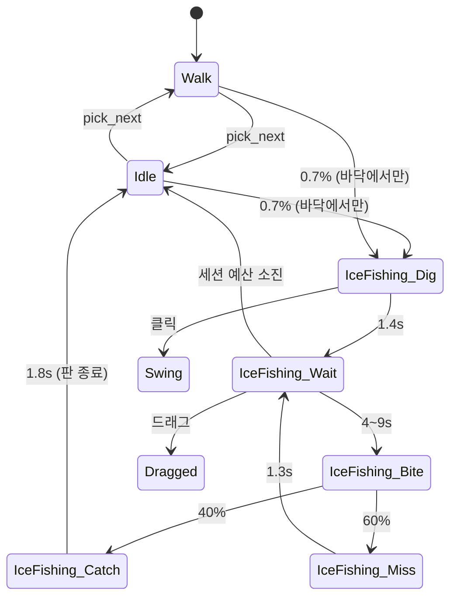
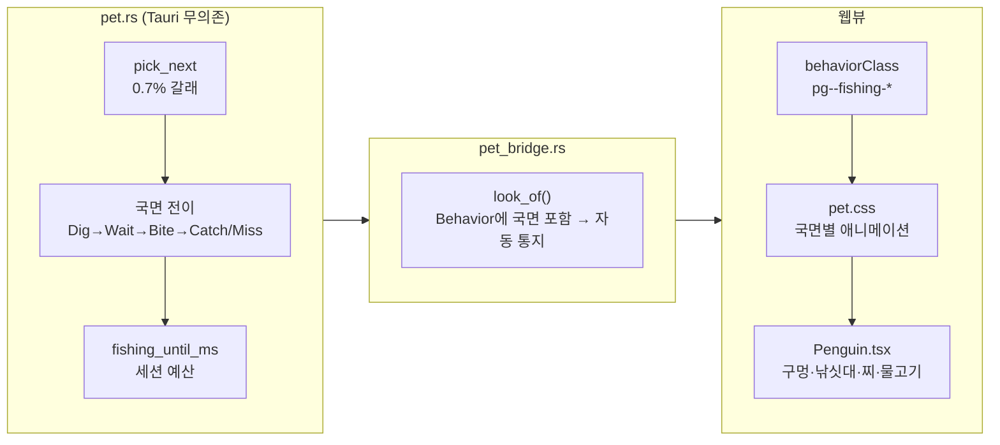

# 얼음낚시 — 30초 넘게 한자리에 앉아 있는 유일한 동작

> **순서 변경 기록 (2026-08-31)** — `TODO.md`의 다음 항목은 F2 "모니터 경계 넘기"였으나
> 사용자 판단으로 **F2를 건너뛰고 F3으로** 간다. F2 항목들은 지우지 않고 보류로 남긴다
> (U3에서 `TODO.md`에 그 사실을 적는다). F2를 먼저 하기로 했던 근거 — "모션을 먼저 만들면
> 좌표계가 바뀔 때 전부 다시 검증해야 한다" — 는 **여전히 유효하고, 그 비용을 나중에 낸다.**
> 다만 얼음낚시는 **창이 움직이지 않는 제자리 동작**이라 좌표계 교체에 가장 덜 노출된
> 모션이다. F3 중에서 이 항목을 먼저 하는 이유가 그것이다.

## Goal Capsule

- **목표** — 펭귄이 아주 가끔 바닥에 앉아 얼음 구멍을 뚫고 30~60초 동안 낚시를 하게 만든다.
  물고기를 잡거나 꽝이 나고, 꽝이면 시무룩하게 다시 드리운다. 근거는 `MOTIONS.md` F3
  "얼음낚시", PRD §5.3.
- **권위 순서** — `PRD > PRINCIPLE > CONVENTIONS > MOTIONS > 이 플랜`. 충돌하면 상위가 이기고,
  상위와 어긋나야만 구현이 가능해지면 멈추고 보고한다.
- **실행 프로필** — 브랜치 `feat/f3-ice-fishing-01`. 코어(`pet.rs`)의 국면 전이·확률 갈래는
  **TDD 필수**(실패 테스트 먼저, 이름은 한국어). 웹뷰 그림은 수동 확인 + `pet-css.test.ts`의
  기계적 가드. 커밋은 한국어 Angular 컨벤션, 유닛 하나 = 커밋 하나.
- **정지 조건** — ① 낚싯대·구멍이 창 밖으로 잘려 `--pg-pad-x`를 늘려야만 그려진다
  (여백은 클릭을 먹으므로 PRD §5.1과 충돌한다) ② 국면 전환이 웹뷰에 도달하지 않아
  30초 내내 한 그림으로 굳는다 ③ 확률 갈래가 기존 동작 시퀀스의 결정론을 깬다
  (`같은_시드는_같은_동작_시퀀스를_낳는다`가 깨진다). 셋 중 하나라도 걸리면 멈추고 보고한다.
- **꼬리 작업** — `.github/TEMPLATE/PR.md`로 PR을 연다. 두 러너(`cargo test`·`npm test`) +
  타입 검사(`npm run build`) 통과와 `ce-code-review` 지적 반영 후 merge한다
  (CLAUDE.md, 2026-08-30 사용자 지시). 같은 PR에 `TODO.md`·`MOTIONS.md` 갱신을 포함한다.

---

## Product Contract

**Summary** — 하루 종일 걷고 헤엄치고 자던 펭귄이, 어쩌다 한 번 바닥에 털썩 앉아 얼음에
구멍을 뚫는다. 낚싯대를 드리우고 한참 가만히 있다가 찌가 까딱하면 홱 낚아챈다. 물고기가
딸려 나오면 들어 올려 자랑하고 그 판을 접는다. 꽝이면 어깨를 늘어뜨렸다가 다시 드리운다.
십 분에 한 번쯤 보이고, 봤을 때 "어 낚시하네" 싶다.

**Problem Frame** — 지금 동작 중 가장 긴 것이 졸기(12~25초)이고 나머지는 전부 1~6초다.
짧은 동작만 빠르게 갈아 끼우면 펭귄이 **안절부절못하는 것처럼** 보인다. 화면이 한 번 차분해지는
구간이 있어야 나머지 동작의 밀도가 산다. 또 지금 모든 동작은 시작하면 끝까지 같은 그림인데,
얼음낚시는 **안에서 갈래가 갈리는 첫 동작**이다 (잡음/꽝).

**Requirements**

| # | 요구사항 |
|---|---|
| R1 | 걷기·유휴가 끝났을 때 **아주 드물게**(체감 십 분에 한 번쯤) 얼음낚시를 시작한다. **바닥에서만** 시작한다 |
| R2 | 한 판은 구멍뚫기 → 드리우기 → 입질 → (잡음 \| 꽝) 국면을 거친다. 꽝이면 **다시 드리운다** |
| R3 | 물고기를 잡으면 자랑하고 그 판이 **끝난다** |
| R4 | 한 판은 **30~60초** 안에 끝나고, 끝나면 일어나 평소 유휴로 돌아간다 |
| R5 | 낚시하는 동안 펭귄의 위치(`x`,`y`)는 변하지 않는다 |
| R6 | 낚시 중 클릭·드래그는 지금처럼 먹는다 — 즉시 방망이를 휘두르거나 들려 올라간다 |
| R7 | 같은 시드 + 같은 타임스탬프열은 **여전히 같은 동작 시퀀스**를 낳는다 (PRINCIPLE 3) |
| R8 | 국면마다 웹뷰의 그림이 다르다. 국면만 바뀌는 전이도 웹뷰에 **반드시 도달한다** |
| R9 | 낚싯대·구멍을 그리려고 **창 여백을 늘리지 않는다** (PRD §5.1 — 여백은 클릭을 먹는다) |

**Acceptance Examples**

- **AE1** — Given 시드 하나로 만든 펭귄, When 20분치 틱(50ms 간격)을 돌리면,
  Then `IceFishing` 국면이 최소 한 번 나타나고 그 판의 시작~종료 간격이 30~60초다.
- **AE2** — Given 낚시 중(`IceFishing` 어느 국면이든)인 펭귄, When `whack()`을 부르면,
  Then 다음 스냅샷의 동작은 `Swing`이다.
- **AE3** — Given 꽝(`Miss`) 국면, When 그 국면이 끝나면, Then 다음은 `Wait`(다시 드리우기)이고
  세션 예산이 남아 있지 않으면 낚시가 끝난다.
- **AE4** (수동) — Given `npm run tauri dev`로 띄운 앱, When 낚시가 시작되면,
  Then 낚싯대 끝과 구멍이 **창 안에 전부 보이고** 잘리지 않는다. 좌·우를 보고 있을 때 둘 다 확인한다.

**Scope Boundaries**

비목표:
- **소리를 내지 않는다.** 효과음은 F3의 별도 항목이고 PRD Q9(음원 라이선스)가 미정이다.
- 잡은 물고기를 세거나 저장하지 않는다 (PRINCIPLE 5 — 설정 셋 말고는 아무것도 저장하지 않는다).
- 물고기 종류를 여러 개로 늘리지 않는다. 한 종류로 시작한다.
- 낚시 중인 펭귄에게 다른 펭귄이 반응하지 않는다.

### Deferred to Follow-Up Work
- **빈도 설계 재조정** — 모션이 늘면 등급이 희석된다. 이미 `TODO.md`에 별도 항목으로 있다.
  이번에는 얼음낚시 하나의 확률만 정하고 전체 재조정은 하지 않는다.
- **F2 모니터 경계 넘기** — 보류. 얼음낚시는 제자리 동작이라 좌표계 교체에 노출되지 않지만,
  창이 움직이는 모션(슬라이딩 등)을 하기 전에는 갚아야 한다.

---

## Planning Contract

### Key Technical Decisions

**KTD1 — 국면(phase)은 코어가 소유한다.** `Behavior::IceFishing { fishing: FishingPhase }`로
동작 안에 국면을 넣고, 전이와 "잡았나 꽝인가"를 전부 `pet.rs`의 시드 난수로 정한다.
웹뷰가 결과를 뽑으면 **같은 시드가 같은 결과를 내지 않아** PRINCIPLE 3이 깨지고, 잡았다/꽝은
"어떻게 보이는지"가 아니라 "무슨 동작"이라 PRINCIPLE 4의 경계상 코어 쪽이다.
`IdleKind`·`SassyKind`가 이미 같은 모양이므로 새 패턴이 아니다.

**KTD2 — 창 여백(`PET_PAD_X`)을 늘리지 않는다.** `.penguin`은 `overflow: visible`이라
viewBox(100×130) 밖도 그려진다. viewBox가 140×140 무대에 `meet`으로 들어가며 배율이 130 기준
(≈1.08px/단위)으로 잡혀 좌우에 각각 약 16px이 남고, 그 바깥에 `--pg-pad-x`(52px)가 또 있다.
낚싯대는 이 안에 충분히 들어간다. 여백은 클릭을 먹으므로(PRD §5.1) 늘리지 않는 쪽이 이득이다.

> **`MOTIONS.md`의 오기를 같은 PR에서 고친다.** "SVG는 기본이 `overflow: hidden`이라
> `viewBox` 밖은 창에 여백이 있어도 잘린다"는 문장이 착지 절에 남아 있는데, `pet.css`는
> 첫 커밋(`cdc584c`)부터 `.penguin { overflow: visible }`이다. 이 문장을 믿으면 이번
> 결정(KTD2)과 정반대로 판단하게 된다. 굴러떨어지기 절의 기울기 계산은 이미 여백을 세고
> 있어 두 문단이 서로 어긋나 있다.

**KTD3 — `moves_window()`를 건드리지 않는다 (true 유지).** `MOTIONS.md`의 "창 이동 X"를
그대로 옮겨 `false`를 돌려주면, 펭귄이 한 마리일 때 틱이 `SLEEP_TICK_MS`(500ms)로 느려져
**700ms짜리 입질 국면이 최대 0.5초 늦게 도착한다.** `Turn`·`Splat`·`Sprawl`도 제자리
동작이면서 `true`다 — 이 함수는 실질적으로 "창을 옮기나"가 아니라 **"틱을 빠르게 유지하나"**다.
`MOTIONS.md`의 "창 이동" 열은 펭귄의 `x`가 변하는가를 뜻하고, 그건 R5로 따로 보장한다.

**KTD4 — 세션 예산은 절대 시각(`fishing_until_ms`) 하나로 갖는다.** 국면마다 남은 시간을
빼 나가는 방식은 국면이 늘 때마다 계산이 갈라진다. 예산 확인은 **드리우기(`Wait`)에 들어가는
순간에만** 한다 — 국면 도중에 자르면 낚싯대를 든 채로 사라지거나, 입질 애니메이션이 반쯤에서
끊긴다. `Catch`는 예산과 무관하게 그 판을 끝낸다 (R3).

**KTD5 — 빈도는 백분율이 아니라 천분율로 잡는다.** 걷기·유휴 한 판이 평균 4초쯤이라
십 분에 한 번은 대략 **0.7%**다. 기존 상수들(`SWIM_PERCENT` 등)이 쓰는 `range((0,99))`로는
최소가 1%라 이 등급을 표현할 수 없다. `range((0, 999)) < ICE_FISHING_PERMILLE`로 간다.

**KTD6 — 나가는 길은 `enter_idle`이다.** 착지·굴러떨어지기가 공유하는 `get_up`을 쓰면 70%
확률로 약을 올리는데, 30~60초 얌전히 앉아 있다가 갑자기 킹받게 구는 건 결이 다르다.
넘어진 뒤의 심리(`get_up`)와 낚시를 마친 뒤의 심리는 같지 않으므로 출구를 공유하지 않는다.

**KTD7 — 국면 클래스는 `pg--fishing-<국면>`이다.** `IdleKind`·`SassyKind`가 이미
`pg--idle-*`·`pg--sassy-*`로 내려가 있어 `behaviorClass`에 갈래를 하나 더 붙이면 된다.
`pg--ice-fishing` 하나로 두고 국면을 별도 클래스로 얹으면 `pet-css.test.ts`의
"모든 동작에 대응하는 규칙이 있다"가 국면을 못 보고 지나간다.

### Assumptions

틀렸다면 구현 전에 알려 주기 바란다.

- **A1** — 구멍·낚싯대·찌·물고기 네 도형을 `Penguin.tsx`에 SVG로 직접 그린다.
  별도 이미지 에셋을 넣지 않는다 (현재 펭귄도 전부 SVG다).
- **A2** — 낚시 중에도 말풍선은 지금처럼 7~18초마다 뜬다. 말풍선은 동작과 분리된 채널이므로
  막지 않는다. 낚시 중에 "일 안 해요?"라고 하는 게 더 웃긴다는 판단이다.
- **A3** — 낚시 중에 졸기로 넘어가지 않는다. 세션 최대 60초가 `SLEEP_AFTER_MS`(5분)보다
  훨씬 짧고 졸기 판정은 `pick_next`에서만 하므로 자동으로 성립한다. 별도 코드가 필요 없다.
- **A4** — 국면 길이는 `DIG 1.4s / WAIT 4~9s / BITE 0.7s / CATCH 1.8s / MISS 1.3s`,
  잡을 확률 40%로 시작한다. 눈으로 보고 조정할 수 있는 값이고 구조를 바꾸지 않는다.

### High-Level Technical Design

책임 경계는 기존과 같다.

---

## Implementation Units

### U1 — 코어: 앉아서 낚고 잡거나 꽝이다

**Goal** — `pet.rs`가 얼음낚시 한 판을 국면 단위로 굴린다. 웹뷰는 아직 아무것도 그리지 않는다.

**Requirements** — R1~R7, KTD1·KTD3~KTD6

**Dependencies** — 없음

**Files**
- `src-tauri/src/pet.rs` (수정 — 인라인 `mod tests` 포함)

**Approach**
- `FishingPhase` 열거형을 `IdleKind`와 같은 모양으로 추가한다
  (`Serialize`, `rename_all = "snake_case"`): `Dig`, `Wait`, `Bite`, `Catch`, `Miss`.
- `Behavior::IceFishing { fishing: FishingPhase }`를 추가한다. `is_airborne`·`is_landing`은
  `false`(기본 분기가 이미 그렇게 준다), `moves_window`는 손대지 않는다 (KTD3).
- `enter()`의 match에서 별도 분기를 만들지 않는다 — `other => self.air = other.is_airborne()`가
  이미 `false`를 준다. **분기를 추가하면 굴러떨어지기와 같은 줄에 얹고 싶어지는데, 그 줄은
  "공중에서 들어와도 지상으로 끌어내린다"는 뜻이라 의미가 다르다.**
- `Pet`에 `fishing_until_ms: u64` 필드 하나를 더한다 (KTD4). `new_at`에서 0으로 초기화한다.
- `pick_next`에 갈래를 넣는다. **졸기 판정 뒤, 헤엄 판정 앞**에 둔다 — 졸기가 우선이어야
  하고(A3의 근거), 헤엄보다 앞에 두어야 헤엄 확률 30%에 두 번 깎이지 않는다.
  `!self.air` 가드를 명시적으로 둔다 (R1, 바닥 전용).
- 국면 전이는 `step`의 `Behavior::IceFishing { fishing }` 팔 하나에서 처리한다.
  위치를 건드리는 코드를 이 팔에 **넣지 않는다** (R5).
- `enter_fishing_wait(now_ms)` 헬퍼 하나를 두고 `Dig` 종료와 `Miss` 종료가 **공유한다.**
  예산 확인이 두 벌이 되면 한쪽만 고쳐지고 조용히 갈라진다 (굴러떨어지기의 `hit_wall`과 같은 이유).
- 상수: `FISHING_DIG_MS`, `FISHING_WAIT_MS: (u64, u64)`, `FISHING_BITE_MS`,
  `FISHING_CATCH_MS`, `FISHING_MISS_MS`, `FISHING_SESSION_MS: (u64, u64)`,
  `FISHING_CATCH_PERCENT`, `ICE_FISHING_PERMILLE`.
  `const _: () = assert!(FISHING_SESSION_MS.0 > FISHING_DIG_MS + FISHING_WAIT_MS.1);`
  — 예산이 첫 드리우기보다 짧으면 구멍만 뚫고 끝나는 판이 생긴다.

**Execution note** — 국면 전이와 확률 갈래는 실패 테스트를 먼저 쓴다. 특히
`같은_시드는_같은_동작_시퀀스를_낳는다`(기존 테스트)가 갈래 추가로 깨지지 않는지를
**갈래를 넣기 전에** 한 번, 넣은 뒤에 다시 확인한다.

**Test scenarios**
- `유휴가_끝나면_아주_가끔_얼음낚시를_한다` — 시드를 훑어 `IceFishing`이 나오는 시드가 존재한다.
  (굴러떨어지기 테스트의 `굴러떨어지는_시드()` 패턴을 그대로 따른다)
- `얼음낚시는_구멍_뚫기부터_시작한다` — 진입 직후 국면이 `Dig`다.
- `구멍을_뚫고_나면_드리운다` — `Dig` 종료 뒤 국면이 `Wait`다.
- `입질_뒤에는_잡거나_꽝이다` — `Bite` 종료 뒤 국면이 `Catch` 또는 `Miss`뿐이다 (여러 시드).
- `꽝이면_다시_드리운다` — `Miss` 종료 뒤 국면이 `Wait`다 (예산이 남은 경우).
- `물고기를_잡으면_그_판이_끝난다` — `Catch` 종료 뒤 동작이 `IceFishing`이 아니다.
- `얼음낚시_한_판은_예산_안에_끝난다` — 시작~종료 간격이 `FISHING_SESSION_MS` 범위 + 마지막
  국면 길이 안이다. **AE1을 덮는다.**
- `얼음낚시_중에는_위치가_변하지_않는다` — 판 전체에서 `x`,`y`가 시작값과 같다 (R5).
- `얼음낚시_중에_클릭하면_방망이를_휘두른다` — **AE2를 덮는다.**
- `얼음낚시_중에_들어_올릴_수_있다` — `drag_start` 뒤 동작이 `Dragged`다 (R6).
- `얼음낚시는_지상_동작이다` — `is_airborne()`·`is_landing()`이 모두 거짓이다.
- `공중에서는_얼음낚시를_시작하지_않는다` — `air`인 상태에서 `pick_next`를 반복해도 안 나온다.
- `얼음낚시가_끝나면_유휴로_간다` — 판 종료 뒤 동작이 `Idle`이다 (KTD6 — `Sassy`가 아니다).
- 기존 `같은_시드는_같은_동작_시퀀스를_낳는다`가 그대로 통과한다 (R7).

**Verification** — `cd src-tauri && cargo test`

---

### U2 — 웹뷰: 구멍을 뚫고 드리우는 그림

**Goal** — 코어가 내보내는 다섯 국면이 화면에 서로 다른 그림으로 나타난다.

**Requirements** — R8, R9, KTD2·KTD7

**Dependencies** — U1

**Files**
- `src/lib/pet.ts` (수정 — `FishingPhase` 타입, `Behavior` 유니온, `behaviorClass`, `isOneShot`)
- `src/lib/pet.test.ts` (수정)
- `src/pet/Penguin.tsx` (수정 — 구멍·낚싯대·찌·물고기 도형)
- `src/pet/pet.css` (수정 — 앉은 자세 + 국면별 애니메이션)
- `src/pet/pet-css.test.ts` (수정 — `ALL_BEHAVIORS` 확장, 길이 동기화 가드 추가)

**Approach**
- `behaviorClass`에 `if (behavior.kind === "ice_fishing") return \`pg--fishing-${kebab(behavior.fishing)}\`;`
  갈래를 더한다 (KTD7).
- `isOneShot`은 `pg--fishing-wait`만 제외하고 나머지 국면을 한 번짜리로 본다.
  드리우기만 반복 애니메이션(찌가 까딱거리는 대기)이다.
- **도형은 `pg-all` 안팎으로 나눈다.** 구멍(`pg-hole`)은 바닥에 붙어 있어야 하므로
  `pg-shadow`와 같은 층(바깥)에 둔다. 낚싯대(`pg-rod`)·찌(`pg-float`)·물고기(`pg-fish`)는
  펭귄이 쥐거나 딸려 올라오므로 `pg-all` 안이다. **착지 포즈가 `pg-all`을 통째로 누르는 것과
  같은 이유다** — 밖에 두면 몸만 앉고 낚싯대는 공중에 남는다.
- 네 도형은 기본이 `opacity: 0`이고 `pg--fishing-*` 클래스가 붙었을 때만 보인다.
  후광(`pg-halo`)이 같은 도형을 한 벌 더 그리므로 낚싯대에도 자동으로 테두리가 생긴다.
- 국면별 그림: `dig` 구멍을 쪼는 상하 반복 → `wait` 앉아서 찌만 까딱 →
  `bite` 홱 채는 한 번 → `catch` 물고기를 들어 올린 자세로 버팀 →
  `miss` 어깨가 처졌다 돌아옴.
- **`pet-css.test.ts`의 세 가드를 모두 만족시켜야 한다** — ① `ALL_BEHAVIORS`에 다섯 국면을
  추가하면 `.pg--fishing-*` 규칙이 CSS에 있어야 통과한다 ② `Penguin.tsx`에 새로 넣는
  `pg-` 클래스마다 CSS 규칙이 있어야 한다 ③ 정의한 `@keyframes`는 전부 쓰여야 한다.
  이건 부담이 아니라 이 유닛의 완료 판정이다.
- **길이 동기화 가드를 넓힌다.** 지금 `cssDurationMs`는 `.pg--<x> .pg-all` 형태만 읽는다.
  국면 넷(`dig`/`bite`/`catch`/`miss`)의 CSS 길이가 Rust 상수와 같은지 같은 방식으로 대조한다.
  `wait`는 무한 반복이라 대조 대상이 아니다.

**Test scenarios**
- `얼음낚시는_국면까지_클래스로_내려간다` — `behaviorClass({kind:"ice_fishing",fishing:"bite"})`
  가 `"pg--fishing-bite"`다.
- `모든_동작이_서로_다른_클래스를_받는다`(기존)에 다섯 국면을 추가해도 충돌이 없다.
- `드리우기만_반복_애니메이션이다` — `isOneShot("pg--fishing-wait")`가 거짓,
  나머지 국면은 참이다.
- `pet.css 커버리지`(기존, `it.each`) — `ALL_BEHAVIORS` 확장으로 다섯 규칙을 자동 검사한다.
- `PetApp이 쓰는 클래스에 스타일이 있다`(기존) — 새 도형 네 클래스를 자동 검사한다.
- `국면_길이가_Rust_상수와_같다` — `dig`/`bite`/`catch`/`miss` 넷을 대조한다.

**Verification** — `npm test` + `npm run build`(타입 검사) + `npm run tauri dev`로 **AE4 수동 확인**
(좌·우 양방향에서 낚싯대와 구멍이 잘리지 않는지).

---

### U3 — 문서 갱신

**Goal** — 문서가 코드와 같은 것을 말한다.

**Requirements** — 없음 (문서)

**Dependencies** — U1, U2

**Files**
- `MOTIONS.md` (수정)
- `TODO.md` (수정)

**Approach**
- `MOTIONS.md` — 얼음낚시를 "넣을 동작 (F3)"에서 **"구현된 동작"** 표로 옮긴다.
  트리거·창 이동·종료 열을 실제 구현값으로 채우고, 국면 다섯과 잡을 확률을 적는다.
  KTD3(창 이동 열의 의미)과 KTD6(출구를 `get_up`과 공유하지 않는 이유)을 짧게 남긴다.
- `MOTIONS.md` — **KTD2의 오기를 고친다.** 착지 절의 "SVG는 기본이 `overflow: hidden`이라…"
  문단을 실제 동작(`.penguin { overflow: visible }`)에 맞게 고친다. 굴러떨어지기 절의
  기울기 계산은 이미 맞으므로 건드리지 않는다.
- `TODO.md` — F3의 얼음낚시 체크박스를 체크하고 한 줄 요약을 단다.
  F2 블록 머리에 **"F3을 먼저 하기로 했다(2026-08-31). 경계 넘기는 접은 게 아니라 보류"**를
  적는다. 항목 자체와 U1 리뷰 숙제 셋은 지우지 않는다.
- `PRD.md`는 건드리지 않는다 — §5.3에 얼음낚시가 이미 있고 범위가 바뀌지 않았다.

**Test expectation: none** — 문서만 고친다.

**Verification** — 문서를 읽고 코드와 대조한다. `npm test`가 계속 통과한다
(`pet-css.test.ts`가 소스를 읽으므로 문서 변경에는 영향이 없다).

---

## Verification Contract

| 무엇을 | 명령 | 적용 유닛 |
|---|---|---|
| 코어 상태 전이·국면·확률 | `cd src-tauri && cargo test` | U1 (U2·U3에서도 회귀 확인) |
| 웹뷰 매핑·CSS 커버리지·길이 동기화 | `npm test` | U2, U3 |
| 타입 검사 (vitest는 안 한다) | `npm run build` | U2 |
| 실제 그림 — AE4 | `npm run tauri dev` 수동 | U2 |
| 코드 리뷰 | `ce-code-review` | PR 직전 |

번들 빌드(`npm run tauri build`)는 이번에 필요 없다 — 알림·플러그인·capabilities를 건드리지 않는다.

## Definition of Done

- R1~R9 충족, AE1~AE3 자동 테스트로 재현, AE4 수동 확인
- 두 러너(`cargo test`·`npm test`) 전체 통과 + `npm run build` 통과
- 코어 국면 전이는 **실패 테스트가 먼저 있는 커밋 이력**이 남는다
- 브랜치 `feat/f3-ice-fishing-01`, 커밋은 한국어 Angular 컨벤션, 유닛 하나 = 커밋 하나
- `MOTIONS.md`·`TODO.md` 갱신이 같은 PR에 포함
- `ce-code-review` 지적을 반영했거나, 반영하지 않은 이유가 PR "비고"에 있다
- 실험하다 버린 코드·미사용 keyframes가 diff에 없다 (`정의된_keyframes가_모두_쓰인다`가 잡는다)
