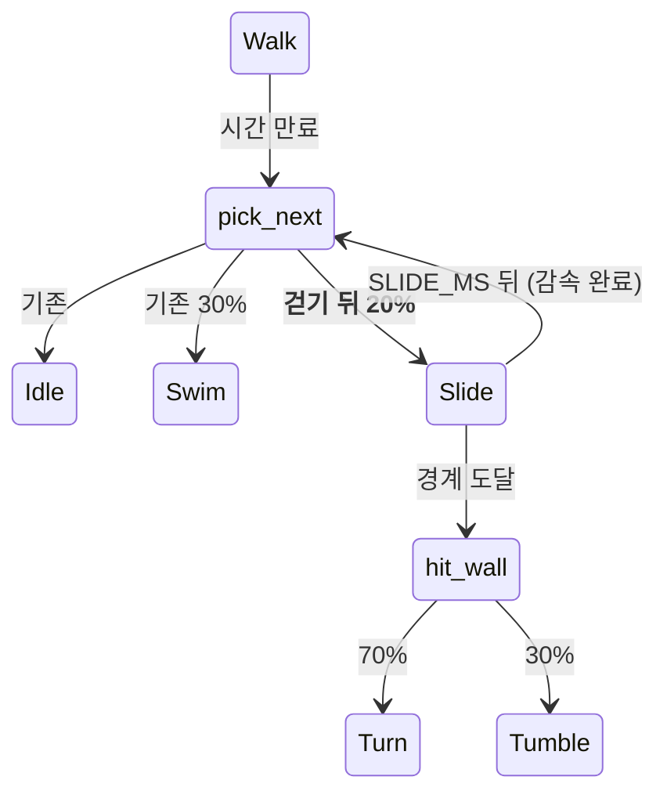

# 슬라이딩 — 배를 깔고 주르륵 미끄러진다

> **F2 보류 상태에서 하는 첫 "창이 움직이는" 모션이다.** 얼음낚시는 제자리 동작이라
> 좌표계 교체에 노출되지 않았지만 슬라이딩은 `x`를 직접 옮긴다. F2가 남긴 숙제 셋
> (브릿지는 `world.first().bounds`로 창을 놓는데 코어는 `screen_for_x`로 고른다 등)은
> **화면이 하나일 때만 우연히 일치**하므로, 지금 만들면 티가 안 나고 테스트도 통과한다.
> 사용자 판단으로 진행하되, **F2를 갚을 때 슬라이딩도 함께 재검증한다** (U4에 남긴다).

## Goal Capsule

- **목표** — 걷기가 끝났을 때 가끔 배를 깔고 미끄러지게 한다. 걷기보다 **빠르고 멀리**
  가고, 멈출 때 주르륵 밀린다. 근거는 `MOTIONS.md` F3 "슬라이딩", PRD §5.3.
- **권위 순서** — `PRD > PRINCIPLE > CONVENTIONS > MOTIONS > 이 플랜`. 충돌하면 상위가 이긴다.
- **실행 프로필** — 브랜치 `feat/f3-slide-01`. 코어(`pet.rs`)의 전이·감속은 **TDD 필수**
  (실패 테스트 먼저, 이름은 한국어). 웹뷰는 정적 렌더 대조 + 설치본 수동 확인.
  커밋은 한국어 Angular 컨벤션, 유닛 하나 = 커밋 하나.
- **정지 조건** — ① 누운 자세가 창(`PET_WINDOW_W/H`) 밖으로 나가 잘린다 ② 미끄러지다
  벽에 닿는 경로가 `hit_wall`과 어긋나 벽 판정이 두 벌이 된다 ③ 확률 갈래가 기존 동작
  시퀀스의 결정론을 깬다. 셋 중 하나라도 걸리면 멈추고 보고한다.
- **꼬리 작업** — `.github/TEMPLATE/PR.md`로 PR을 열고, 두 러너 + 타입 검사 통과와
  `ce-code-review` 반영 후 merge한다. 같은 PR에 `TODO.md`·`MOTIONS.md` 갱신을 포함한다.

---

## Product Contract

**Summary** — 걷던 펭귄이 가끔 배를 깔고 앞으로 쭉 미끄러진다. 걸을 때보다 훨씬 빠르게
출발해서 점점 느려지다 스르륵 멈추고 일어선다. 벽까지 미끄러지면 그대로 박아서 돌아서거나
굴러 넘어진다. 설정 창의 "동작 시켜보기"에서 눌러서 시킬 수도 있다.

**Problem Frame** — 지금 수평 이동 수단이 걷기 하나뿐이라 **속도가 늘 같다.** 헤엄은
공중이고, 던지기는 사용자가 시킨 것이다. 스스로 하는 지상 이동에 완급이 없으면 화면이
한 박자로만 흐른다.

**Requirements**

| # | 요구사항 |
|---|---|
| R1 | **걷기가 끝났을 때** 일정 확률로 미끄러진다. 유휴가 끝났을 때는 나오지 않는다 |
| R2 | 미끄러지는 동안 진행 방향으로 실제로 이동한다. 속도는 **걷기보다 빠르다** |
| R3 | 시간이 갈수록 느려지고, **동작이 끝나는 순간 속도가 정확히 0**이다 |
| R4 | 한 번에 가는 거리가 매번 다르다. 평균적으로 **걷기 한 번보다 멀리** 간다 |
| R5 | 미끄러지다 벽에 닿으면 걷다 닿았을 때와 **같은 갈래**로 반응한다 (`Turn`/`Tumble`) |
| R6 | 미끄러지는 중에도 클릭·드래그는 지금처럼 먹는다 |
| R7 | 걸을 폭이 없는 화면에서는 미끄러지지 않는다 |
| R8 | 같은 시드 + 같은 타임스탬프열은 **여전히 같은 동작 시퀀스**를 낳는다 (PRINCIPLE 3) |
| R9 | 설정 창의 "동작 시켜보기"에서 슬라이딩을 시킬 수 있다 |

**Acceptance Examples**

- **AE1** — Given 걷는 중인 펭귄, When 걷기가 끝나는 순간을 여러 시드로 관찰하면,
  Then `Slide`가 나오는 시드가 있고 `Idle`·`Swim`도 여전히 나온다.
- **AE2** — Given 미끄러지기 시작한 펭귄, When 50ms 간격으로 진행시키면,
  Then 구간별 이동량이 단조 감소하고 종료 시각 이후에는 `x`가 변하지 않는다.
- **AE3** — Given 오른쪽 벽 근처에서 오른쪽으로 미끄러지는 펭귄, When 벽에 닿으면,
  Then 동작이 `Turn` 또는 `Tumble`이고 경계를 넘지 않는다.
- **AE4** (수동) — 설치본에서 "동작 시켜보기 → 슬라이딩"을 누르면 누운 자세가
  **창 밖으로 잘리지 않고** 미끄러진다.

**Scope Boundaries**

비목표:
- 소리를 내지 않는다 (PRD Q9 미정).
- "긴 거리를 이동할 때 슬라이딩" 트리거는 넣지 않는다 — 목적지 개념이 지상 이동에
  없다(걷기는 시간 단발이다). 거리 기반 트리거를 만들려면 걷기부터 목적지 방식으로
  바꿔야 하는데 그건 이 체크박스가 아니다.
- 미끄러지다 다른 펭귄과 부딪히지 않는다.

### Deferred to Follow-Up Work
- **F2 재검증** — 화면이 늘면 슬라이딩의 벽 판정·창 위치를 다시 본다.
- **빈도 설계 재조정** — 이미 `TODO.md`에 별도 항목이 있다. 여기서는 슬라이딩 하나의
  확률만 정한다.

---

## Planning Contract

### Key Technical Decisions

**KTD1 — 감속은 남은 시간 비율로 한다 (굴러떨어지기와 같은 방식).** 마찰 상수를 두면
정지 판정이 따로 필요하고 그게 틀리면 **영원히 미끄러지는 상태**가 생긴다. 남은 시간에
비례시키면 동작이 끝나는 순간 속도가 정확히 0이라 그 상태를 표현할 수 없다 (R3).

**KTD2 — 길이는 고정하고 출발 속도를 뽑는다.** 거리가 매번 달라야 하는데(R4), 길이를
난수로 뽑으면 **CSS 애니메이션 길이를 코어 상수와 맞출 수 없다** — `pet-css.test.ts`의
"동작 길이 동기화"가 대조하는 것이 고정 상수다. 길이를 `SLIDE_MS`로 고정하고 출발
속도를 `SLIDE_SPEED` 범위에서 뽑으면 둘 다 만족한다. 거리는 `속도 × 길이 / 2`다.

**KTD3 — 일어서기를 별도 국면으로 만들지 않는다.** 얼음낚시는 판 길이가 난수라 `Pack`
국면이 필요했지만, 슬라이딩은 길이가 고정이므로 **눕기 → 미끄러짐 → 일어서기를 CSS
한 벌 안에** 넣을 수 있다. 국면을 늘리면 코어 전이·클래스·길이 가드가 전부 따라 는다.

**KTD4 — 벽 반응은 `hit_wall`을 그대로 쓴다.** 걷기와 슬라이딩이 "벽에 닿았다"를 각자
판정하면 한쪽만 고쳐지고 조용히 갈라진다. 굴러떨어지기를 넣을 때 세운 규칙이다.
미끄러지다 박아서 나자빠지는 그림은 덤으로 얻는다 (R5).

**KTD5 — 트리거는 "걷기가 끝났을 때"로 한정한다.** `pick_next`는 걷기·유휴·졸기가
끝날 때 모두 불린다. 유휴 뒤에 미끄러지면 **서 있다가 갑자기 배를 깔게** 되어 준비
동작이 없다. 걷던 관성이 있어야 미끄러지는 것으로 읽힌다 (MOTIONS "걷기가 끝났을 때").

**KTD6 — 누운 자세는 `.pg-all`을 통째로 회전시킨다.** 부위별로 눕히면 몸통만 눕고
머리·날개가 제자리에 남는다 (착지 포즈에서 이미 겪었다). 축은 발밑(50,120)이고,
굴러떨어지기 주석의 계산상 **90도까지 잘리지 않는다** — 78도는 넉넉히 안쪽이다.

### Assumptions

- **A1** — `SLIDE_MS = 2_400`, 출발 속도 `180~340 px/s`. 거리는 216~408px으로 걷기 한 번
  (`WALK_SPEED 42 × 2.5~6초` = 105~252px)보다 확실히 멀다. 눈으로 보고 조정할 수 있는 값이다.
- **A2** — 확률은 걷기가 끝났을 때 **20%**. 걷기·유휴 한 사이클이 평균 6.5초쯤이므로
  대략 30초에 한 번이다. `MOTIONS.md` 빈도 표의 "자주"에 해당한다.
- **A3** — 새 SVG 도형이 필요 없다. 기존 몸으로 눕히기만 한다.

### High-Level Technical Design

---

## Implementation Units

### U1 — 코어: 배를 깔고 미끄러진다

**Goal** — `pet.rs`가 걷기 뒤에 확률적으로 미끄러지고, 감속해 멈추고, 벽에서 기존 갈래를 탄다.

**Requirements** — R1~R8, KTD1·KTD2·KTD4·KTD5

**Dependencies** — 없음

**Files** — `src-tauri/src/pet.rs` (인라인 `mod tests` 포함)

**Approach**
- `Behavior::Slide` 추가. `is_airborne`·`is_landing` 거짓, `moves_window` 참(기본값).
- 상수: `SLIDE_MS: u64 = 2_400`, `SLIDE_SPEED: (f64, f64) = (180.0, 340.0)`,
  `SLIDE_AFTER_WALK_PERCENT: u64 = 20`. `const _: () = assert!(SLIDE_MS > TURN_MS);`
- `Pet`에 `slide_speed: f64` 필드. 출발 속도를 진입 시 한 번 뽑아 들고 있는다 (KTD2).
- `step`의 `Slide` 팔: `remaining = (until - now) / SLIDE_MS`,
  `x += facing.sign() * slide_speed * remaining * dt`. 경계에 닿으면 **`hit_wall`**,
  시간이 끝나면 `pick_next`. `Walk` 팔의 "폭 없는 화면" 방어 분기와 같은 순서를 지킨다.
- `pick_next`: 얼음낚시 갈래 **뒤**, 헤엄 갈래 **앞**에 둔다. 조건은
  `matches!(self.behavior, Behavior::Walk) && bounds.right > bounds.left`
  그리고 `range((0,99)) < SLIDE_AFTER_WALK_PERCENT` (R1·R7).
- 골든 수열(`화면이_하나면_동작_수열이_그대로다`)이 또 밀린다 — **의도한 갈래 추가이므로
  재기준화하고 주석에 세 번째임을 적는다.**

**Execution note** — 감속·정지는 실패 테스트를 먼저 쓴다. 굴러떨어지기 테스트
(`굴러떨어지는_동안_속도가_줄어든다`, `굴러떨어지기가_끝나면_멈춘다`)가 형식의 기준이다.

**Test scenarios**
- `걷기가_끝나면_가끔_미끄러진다` — 시드를 훑어 `Slide`가 나오는 시드가 있고,
  `Idle`도 여전히 나온다. **AE1을 덮는다.**
- `유휴가_끝났을_때는_미끄러지지_않는다` — 유휴에서 출발한 `pick_next`가 `Slide`를 내지 않는다.
- `미끄러지는_동안_진행_방향으로_이동한다`
- `슬라이딩은_걷기보다_빠르다` — 첫 구간 이동량이 같은 시간 걷기보다 크다 (R2).
- `미끄러지는_동안_속도가_줄어든다` — 구간 이동량이 단조 감소한다. **AE2를 덮는다.**
- `슬라이딩이_끝나면_멈춘다` — 종료 후 `x`가 변하지 않는다. **AE2를 덮는다.**
- `미끄러진_거리는_매번_다르다` — 여러 시드의 이동 거리가 한 값이 아니다 (R4·KTD2).
- `슬라이딩이_걷기보다_멀리_간다` — 최소 출발 속도로도 걷기 최대 거리보다 멀다.
- `미끄러지다_벽에_닿으면_돌아서거나_굴러떨어진다` — **AE3을 덮는다.** 경계를 넘지 않는다.
- `걸을_폭이_없는_화면에서는_미끄러지지_않는다` (R7)
- `슬라이딩은_지상_동작이다` — `is_airborne`·`is_landing` 거짓, `moves_window` 참.
- `미끄러지는_중에_클릭하면_방망이를_휘두른다` / `미끄러지는_중에_들어_올릴_수_있다` (R6)
- 기존 `같은_시드는_같은_동작_시퀀스를_낳는다`가 그대로 통과한다 (R8).

**Verification** — `cd src-tauri && cargo test`

---

### U2 — 웹뷰: 누워서 미끄러지는 그림

**Goal** — 미끄러지는 동안 배를 깔고 누운 자세가 보이고, 끝에 일어선다.

**Requirements** — KTD3·KTD6

**Dependencies** — U1

**Files**
- `src/lib/pet.ts` (`Behavior` 유니온에 `slide`), `src/lib/pet.test.ts`
- `src/pet/pet.css`, `src/pet/pet-css.test.ts`

**Approach**
- `behaviorClass`는 손댈 필요가 없다 — `pg--slide`가 기본 규칙으로 나온다. 유니온만 넓힌다.
- `isOneShot`에 `pg--slide`를 넣는다. 눕기→일어서기가 **한 번 재생되고 끝**이다.
- `.pg--slide .pg-all { animation: pg-slide 2.4s ...; }` — 길이가 `SLIDE_MS`와 같아야 하고
  `pet-css.test.ts`의 "동작 길이 동기화"에 항목을 추가해 못박는다.
- 자세: 0% 서 있음 → 12% 78도로 눕고 살짝 늘어남 → 82% 그대로 → 100% 다시 섬.
  발은 뒤로, 날개는 몸에 붙인다. **축은 발밑**이고 78도는 잘림 한계(90도) 안쪽이다.
- `ALL_BEHAVIORS`에 `{ kind: "slide" }` 추가 — CSS 규칙 누락을 자동으로 잡는다.

**Test scenarios**
- `슬라이딩은_한_번짜리다` — `isOneShot("pg--slide")`가 참.
- `모든_동작이_서로_다른_클래스를_받는다`(기존)에 `slide`를 넣어도 충돌이 없다.
- `pet.css 커버리지`(기존 `it.each`) — `.pg--slide` 규칙을 자동 검사한다.
- `슬라이딩_길이가_Rust의_SLIDE_MS와_같다`

**Verification** — `npm test` + `npm run build` + 정적 SVG 렌더로 누운 자세가 창 안에
들어오는지 대조.

---

### U3 — 설정 창에서 슬라이딩 시키기

**Goal** — "동작 시켜보기"에 슬라이딩 버튼이 생긴다 (R9).

**Requirements** — R9

**Dependencies** — U1

**Files**
- `src-tauri/src/pet.rs` (`start_slide`), `src-tauri/src/pet_bridge.rs` (`pet_slide`),
  `src-tauri/src/lib.rs` (등록 — **빠뜨리면 런타임에서만 조용히 reject된다**)
- `src/lib/pet.ts`, `src/components/MotionCard.tsx`, `src/components/MotionCard.test.tsx`,
  `src/App.tsx`, `src/App.test.tsx`

**Approach**
- `start_slide(now)`는 `start_fishing`과 같은 모양이다. 단 **공중에서는 거절한다** —
  낚시는 허공에 앉는 게 웃겼지만 미끄러지는 것은 **바닥과 닿아야** 성립한다.
  들려 있을 때도 거절한다.
- `MotionCard`를 버튼 목록으로 일반화한다. 지금 문구("던지거나 때리면 그만둬요")는
  낚시 전용이므로 **동작마다 다른 설명**을 붙일 수 있게 바꾼다.

**Test scenarios**
- `공중이거나_들려_있으면_시켜도_미끄러지지_않는다`
- `시키면_바로_미끄러진다`
- `슬라이딩_버튼을_누르면_시킨다` / `동작마다_다른_설명이_붙는다`
- `모든_펫_커맨드가_invoke_handler에_등록되어_있다`(기존)가 `pet_slide`를 자동으로 잡는다.

**Verification** — 두 러너 + 설치본에서 버튼을 눌러 **AE4 수동 확인**.

---

### U4 — 문서 갱신

**Goal** — 문서가 코드와 같은 것을 말한다.

**Dependencies** — U1~U3

**Files** — `MOTIONS.md`, `TODO.md`

**Approach**
- `MOTIONS.md` — 슬라이딩을 "구현된 동작"의 이동 표로 옮기고, KTD1(감속 방식)·KTD2(길이
  고정·속도 난수)·KTD5(걷기 뒤에만)를 짧게 남긴다. "넣을 동작"에서 지운다.
- `TODO.md` — 체크하고 한 줄 요약. **F2 보류 블록에 "슬라이딩도 재검증 대상"을 추가한다** —
  창이 움직이는 첫 신규 모션이라 좌표계가 바뀌면 다시 봐야 한다.

**Test expectation: none** — 문서만 고친다.

---

## Verification Contract

| 무엇을 | 명령 | 적용 유닛 |
|---|---|---|
| 코어 전이·감속·벽 반응 | `cd src-tauri && cargo test` | U1, U3 |
| 웹뷰 매핑·CSS 커버리지·길이 동기화 | `npm test` | U2, U3 |
| 타입 검사 | `npm run build` | U2, U3 |
| 누운 자세가 창 안인가 | 정적 SVG 렌더 대조 | U2 |
| 실제 동작 — AE4 | 번들 설치 후 버튼 | U3 |
| 코드 리뷰 | `ce-code-review` | PR 직전 |

## Definition of Done

- R1~R9 충족, AE1~AE3 자동 테스트로 재현, AE4 수동 확인
- 두 러너 전체 통과 + `npm run build` 통과
- 코어 전이·감속은 **실패 테스트가 먼저 있는 커밋 이력**이 남는다
- 브랜치 `feat/f3-slide-01`, 유닛 하나 = 커밋 하나
- `MOTIONS.md`·`TODO.md` 갱신이 같은 PR에 포함되고, **F2 재검증 대상에 슬라이딩이 적힌다**
- `ce-code-review` 지적을 반영했거나 이유가 PR "비고"에 있다
