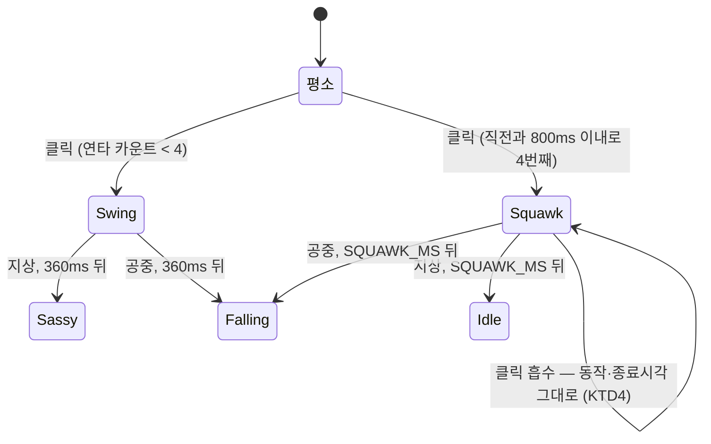
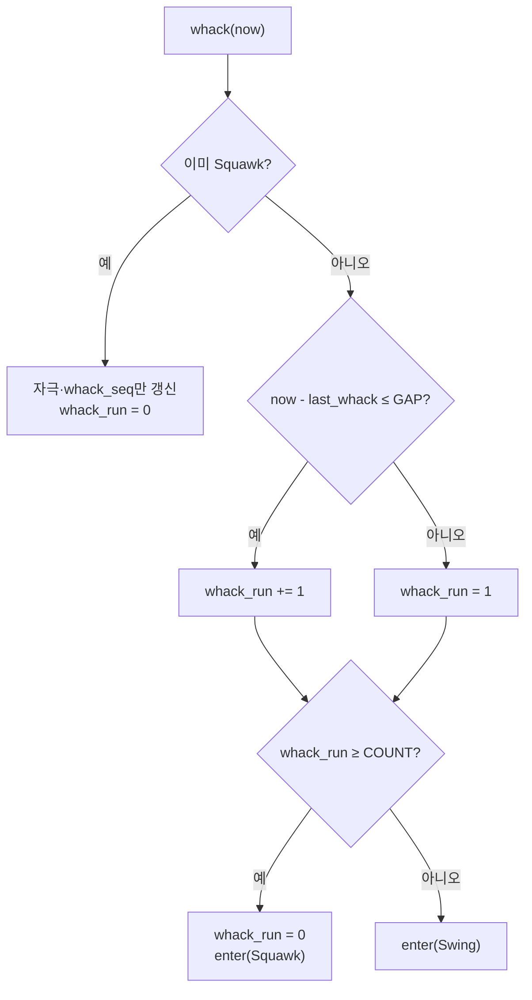

# 빽빽거리기 — 연타로 맞으면 정면으로 화낸다

> **이 앱의 반응 다섯 개가 전부 한 결이다.** 등 돌리기·고개 돌리기·날개 젓기·눈
> 굴리기·엉덩이 흔들기는 모두 "무시하는" 쪽이다. 무시가 다섯 가지여도 대비가 없으면
> 결국 하나로 읽힌다. 정면으로 화내는 반응이 하나 있어야 나머지 다섯이 "일부러
> 무시하는 것"으로 보인다 (`MOTIONS.md` — 넣을 동작 → 빽빽거리기).

## Goal Capsule

- **목표** — 짧은 시간에 여러 번 맞으면 펭귄이 몸을 부풀리고 날개를 퍼덕이며
  빽빽댄다. 근거는 `MOTIONS.md` F3 "빽빽거리기", PRD §5.3·§5.5.
- **권위 순서** — `PRD > PRINCIPLE > CONVENTIONS > MOTIONS > 이 플랜`. 충돌하면 상위가 이긴다.
- **실행 프로필** — 브랜치 `feat/f3-squawk-01`. 코어(`pet.rs`)의 연타 판정·상태 전이는
  **TDD 필수**(실패 테스트 먼저, 이름은 한국어). 웹뷰는 정적 렌더 대조 + 설치본 수동 확인.
  커밋은 한국어 Angular 컨벤션, 유닛 하나 = 커밋 하나.
- **정지 조건** — ① 연타 판정이 기존 빠따(`Swing`) 흐름을 되돌릴 수 없게 바꿔야만
  성립한다 ② 부풀린 몸이 창(244×220) 밖으로 나가 잘린다 ③ `shouldRestart`의 전제
  ("같은 한 번짜리 클래스가 연달아 오지 않는다")를 깨야만 되감기가 된다 ④ 확률·연타
  갈래가 기존 동작 시퀀스의 결정론을 깬다. 하나라도 걸리면 멈추고 보고한다.
- **꼬리 작업** — `.github/TEMPLATE/PR.md`로 PR을 열고, 두 러너 + 타입 검사 통과와
  `ce-code-review` 반영 후 merge한다. 같은 PR에 `TODO.md`·`MOTIONS.md` 갱신을 포함한다.

---

## Product Contract

**Summary** — 펭귄을 빠르게 연달아 때리면, 몇 대째부터는 방망이를 휘두르는 대신 몸을
부풀리고 날개를 퍼덕이며 부리를 크게 벌려 빽빽댄다. 1.4초쯤 화를 내고 나서 아무 일
없었다는 듯 평소로 돌아간다. **소리는 나지 않는다.** 설정 창의 "동작 시켜보기"에서
눌러서 시킬 수도 있다.

**Problem Frame** — 클릭 반응이 지금 두 단계다: 방망이를 한 번 휘두르고(`Swing` 360ms)
곧바로 싸가지 다섯 중 하나(`Sassy` 900ms)로 간다. 다섯 가지 모두 "무시"라서 **얼마나
때리든 결과가 같다.** 연타에 대한 보상이 없으면 사용자가 연타를 그만두고, 그러면 이
앱에서 유일하게 사용자가 하는 행동이 사라진다. 세게 던졌을 때 착지가 네 갈래로
갈리듯(PRINCIPLE 1 — 재미의 반대말은 예측 가능함), 세게 때렸을 때도 갈래가 있어야 한다.

**Requirements**

| # | 요구사항 |
|---|---|
| R1 | 짧은 시간에 정해진 횟수만큼 연달아 맞으면 빽빽거린다 |
| R2 | 한두 번 툭 때리는 것으로는 나오지 않는다 — 평소처럼 방망이를 휘두른다 |
| R3 | 빽빽거리는 동안 **창은 움직이지 않는다** (제자리에서 부르르 떤다) |
| R4 | 빽빽거리는 중에 더 때려도 동작이 중간에 끊기지 않는다 |
| R5 | 한 번 터진 뒤에는 카운터가 초기화된다 — 연타 중 매 클릭마다 다시 터지지 않는다 |
| R6 | 1~2초 뒤 스스로 끝나고 평소 동작으로 돌아간다. 공중에서 터졌으면 마저 떨어진다 |
| R7 | **소리를 내지 않는다** (PRD §5.5 — 소리는 opt-in이고 음원은 Q9 미정) |
| R8 | 빽빽거리는 중에도 드래그로 집어 들 수 있다 |
| R9 | 같은 시드 + 같은 타임스탬프열은 **여전히 같은 동작 시퀀스**를 낳는다 (PRINCIPLE 3) |
| R10 | 설정 창의 "동작 시켜보기"에서 빽빽거리기를 시킬 수 있다 |

**Acceptance Examples**

- **AE1** — Given 바닥에 서 있는 펭귄, When 200ms 간격으로 네 번 클릭하면,
  Then 네 번째 클릭에서 동작이 `Squawk`가 된다.
- **AE2** — Given 바닥에 서 있는 펭귄, When 2초 간격으로 네 번 클릭하면,
  Then 매번 `Swing`이고 `Squawk`는 한 번도 나오지 않는다.
- **AE3** — Given 빽빽거리는 중인 펭귄, When 다시 클릭하면,
  Then 동작이 여전히 `Squawk`이고 종료 시각이 앞당겨지지 않는다.
- **AE4** — Given 빽빽거리기가 끝난 펭귄, When 진행시키면,
  Then 지상이면 유휴로, 공중이면 `Falling`으로 간다. `x`는 시작할 때와 같다.
- **AE5** (수동) — 설치본에서 펭귄을 빠르게 연타하면 몸이 부풀고 날개가 퍼덕이며
  부리가 벌어진다. **창 밖으로 잘리지 않고**, 소리는 나지 않는다.

**Scope Boundaries**

비목표:
- **소리를 붙이지 않는다.** 음원 소스·라이선스가 PRD Q9로 미정이고 `TODO.md`에 별도
  항목("효과음 붙이기")이 있다. 소리 설정 값은 이미 저장되고 있으므로 나중에 이
  동작에 얹기만 하면 된다.
- **말풍선 문구를 연동하지 않는다.** 말풍선은 클릭과 무관한 별도 채널이다
  (`MOTIONS.md` "말풍선"). 화낼 때만 다른 대사를 띄우는 건 그 분리를 깬다.
- 다른 펭귄이 반응하지 않는다.

### Deferred to Follow-Up Work
- **저확률 자발 트리거** — "낮은 확률로 혼자서 빽빽거린다"는 이번에 넣지 않는다.
  이유는 KTD3에 있다. `MOTIONS.md`·`TODO.md`에 후속으로 남긴다.
- **빠따 연타가 되감기지 않는다** — `pg--swing`이 `isOneShot`에 없어서 360ms 안에
  연타하면 방망이가 다시 안 휘둘러지는 기존 버그. 이미 `TODO.md` 후속 항목이고,
  **이 플랜은 그 전제를 새로 깨지 않는 쪽을 고른다**(KTD4). 체크박스 하나 규칙에 따라
  고치지 않는다.
- **빈도 설계 재조정** — 별도 항목이다. 여기서는 빽빽거리기의 문턱만 정한다.

---

## Planning Contract

### Key Technical Decisions

**KTD1 — 연타는 "간격이 짧은 클릭의 연속 횟수"로 센다.** 링버퍼에 최근 N개 시각을
담아 "창 안에 N번"을 재는 방법도 있지만, 필드 하나(`whack_run: u64`)와 마지막 클릭
시각(`last_whack_ms: Option<u64>`)이면 같은 체감을 낸다 — 직전 클릭과의 간격이
`SQUAWK_GAP_MS` 이내면 세고, 넘으면 1로 되돌린다. 버퍼가 없으니 마릿수가 늘어도
메모리가 늘지 않고, 판정이 한 줄이라 테스트가 붙는다.

`Option<u64>`인 것이 중요하다. `0`을 초깃값으로 두면 **에폭 초반 타임스탬프를 쓰는
기존 테스트**(`p.whack(300, ...)`)에서 `300 - 0 = 300 ≤ 800`이 참이 되어 첫 클릭이
이미 두 번째 연타로 세어진다. 실제 앱에서는 안 드러나고 테스트에서만 터진다.

**KTD2 — 문턱을 넘은 그 클릭에서 곧바로 빽빽거린다 (스윙을 건너뛴다).** 대안은
"스윙은 그대로 하고 끝난 뒤 `Sassy` 자리에 빽빽거리기를 넣는" 것이었는데, 연타
중에는 매 클릭이 `Swing`을 다시 걸기 때문에 **연타를 멈춘 뒤에야** 터진다. 자극과
반응 사이가 벌어지면 자기 손짓과 연결이 안 되고, 무엇보다 "때리다 말고 빡쳤다"가
아니라 "다 때린 뒤에 뒤늦게 화냈다"로 읽힌다. 반응은 원인에 붙어 있어야 인과가 산다.

**KTD3 — 저확률 자발 트리거는 이번에 넣지 않는다.** `MOTIONS.md`는 트리거를 "짧은
시간에 여러 번 맞았을 때 / **낮은 확률로 혼자서**"로 적어 두었지만, 이 동작의 존재
이유는 "정면으로 화내는 반응"이다(같은 문서의 "왜"). **화내는 데에는 원인이 있어야
읽힌다** — 아무도 안 건드렸는데 혼자 빽빽대는 것은 화가 아니라 이상 행동이고, 그건
다음 항목인 **발작(`Freakout`)이 담당한다.** 이유 없이 터지는 동작을 둘 만들면 며칠에
한 번짜리인 발작의 희귀함이 먼저 희석된다. `MOTIONS.md`의 트리거 줄과 빈도 표를 이
PR에서 함께 고치고, 후속으로 남긴다.

**KTD4 — `shouldRestart`의 전제를 깨지 않는다.** 웹뷰는 "같은 한 번짜리 클래스가
연달아 오지 않는다"에 기대어 되감기를 판정한다(`src/lib/pet.ts`). 연타로 빽빽거리기가
연달아 진입할 수 있게 만들면 이 전제가 깨져 두 번째부터 애니메이션이 재생되지 않는다 —
`pg--swing`이 이미 그 상태이고 `TODO.md` 후속 항목으로 남아 있다.

그래서 **빽빽거리는 중의 클릭은 흡수한다**: 자극 시각과 `whack_seq`만 갱신하고
동작은 건드리지 않는다(R4). 그러면 빽빽거리기 사이에는 항상 유휴나 낙하가 끼므로
전제가 유지되고, `isOneShot`에 `pg--squawk`를 그냥 넣을 수 있다. 흡수는 우회가
아니라 사양이다 — 1.4초짜리 화내기가 매 클릭마다 360ms 스윙으로 잘리면 화가 보일
시간이 없다.

**KTD5 — 터질 때 카운터를 0으로 되돌린다 (R5).** 되돌리지 않으면 문턱을 넘은 뒤의
모든 클릭이 다시 문턱을 넘어, 흡수 규칙이 없었다면 매 클릭마다 재진입한다. 흡수와
초기화는 같은 문제의 앞뒤다. 빽빽거리는 중에 맞은 것은 **다음 연타로도 세지 않는다** —
세면 끝나자마자 한 번 더 터진다.

**KTD6 — 고도를 물려받고, 끝나면 `Sassy`와 같은 길로 나간다.** `enter()`에서
`Sassy`·`Dragged`·`Swing`·`IceFishing`과 같은 "고도 유지" 부류에 넣는다. 바닥으로
끌어내리면 헤엄치다 맞았을 때 순간이동한다. 끝날 때는 공중이면 `Falling`, 지상이면
**`enter_idle`**이다 — `get_up`(70% 약올리기)을 쓰지 않는 이유는 이미 화를 다 낸 뒤라
곧바로 약을 올리면 화가 연기였던 것처럼 보이기 때문이다. 낚시가 `get_up`을 안 쓰는
것과 같은 판단이다.

**KTD7 — 새 SVG 도형은 아래턱 하나뿐이다.** 기존 부리는 삼각형 path 하나라 벌릴 수
없다. 아래턱 삼각형(`pg-beak-lower`)을 **머리 그룹 안에** 하나 더 그리고 평소에는
숨긴다 — `pg-bat`·`pg-rod`가 같은 방식이다. 부리 뿌리(64,33)를 축으로 아래로 돌리면
벌어진 입이 된다. 부풀리기·떨림은 `.pg-all`이, 퍼덕임은 날개 두 짝이, 젖힘은 머리가
맡는다. 부위를 나눠 놓은 것이 이 SVG의 존재 이유다.

**KTD8 — 부풀리기 배율은 잘림 한계 안에 둔다.** 창이 자르는 경계는 `viewBox`가 아니라
창(244×220)이고, 본체 반폭 34단위 ≈ 36.6px에 창 중심~가장자리가 122px이므로
`scaleX`는 약 3.3까지 안전하다(`MOTIONS.md` "잘림의 경계"). 1.14는 한참 안쪽이라
계산을 다시 할 일이 없다.

### Assumptions

- **A1** — `SQUAWK_MS = 1_400`. `MOTIONS.md`의 "1~2초" 안이고, `SASSY_MS`(900)보다
  확실히 길어야 "한 박자 더 큰 반응"으로 읽힌다. 눈으로 보고 조정할 수 있는 값이다.
- **A2** — `SQUAWK_WHACK_COUNT = 4`, `SQUAWK_GAP_MS = 800`. 스윙 하나가 360ms이므로
  자연스러운 연타 간격은 200~400ms다. 800ms는 넉넉해서 "빠르게 두들기면" 대략 1.2초
  만에 터지고, 한두 번 툭 치는 것으로는 안 터진다(R2). 취향 상수라 한곳에서만 고친다.
- **A3** — `last_whack_ms`는 드래그로 갱신되지 않는다. 기존 `last_stimulus_ms`는
  드래그도 갱신하므로 연타 판정에 쓸 수 없어 필드를 따로 둔다.
- **A4** — 빽빽거리기는 코어의 골든 수열(`화면이_하나면_동작_수열이_그대로다`)에
  **영향을 주지 않는다.** 난수를 뽑지 않고, `pick_next`에 갈래를 더하지 않기 때문이다.
  이 가정이 틀리면(수열이 밀리면) 자발 트리거가 섞여 들어간 것이므로 멈추고 본다.

### High-Level Technical Design

---

## Implementation Units

### U1 — 코어: 연타로 맞으면 빽빽거린다

**Goal** — `pet.rs`가 연타를 세어 `Squawk`로 들어가고, 그 동안의 클릭을 흡수하고,
끝나면 지상/공중에 맞게 나간다.

**Requirements** — R1~R9, KTD1·KTD2·KTD4·KTD5·KTD6

**Dependencies** — 없음

**Files** — `src-tauri/src/pet.rs` (인라인 `mod tests` 포함)

**Approach**
- `Behavior::Squawk` 추가. `is_airborne`·`is_landing` 거짓, `moves_window` 참(기본값 —
  1.4초 동작이 500ms 느린 틱을 받으면 시작·종료가 눈에 띄게 밀린다).
- 상수: `SQUAWK_MS: u64 = 1_400`, `SQUAWK_WHACK_COUNT: u64 = 4`,
  `SQUAWK_GAP_MS: u64 = 800`. 싸가지보다 길어야 한다는 것을 컴파일 타임에 못박는다:
  `const _: () = assert!(SQUAWK_MS > SASSY_MS);`
- `Pet`에 `whack_run: u64`, `last_whack_ms: Option<u64>` 추가 (KTD1).
- `whack()`을 위 flowchart대로 고친다. **자극 시각·`whack_seq`·속도 0은 어느 갈래에서도
  똑같이 한다** — 흡수 갈래에서 빠뜨리면 빽빽거리는 중에 맞으면 졸음 타이머가 안 밀린다.
- `enter()`의 "고도 물려받는" 팔에 `Behavior::Squawk`를 넣는다 (KTD6).
- `step`에 `Squawk` 팔: 시간이 다 되면 `air`면 `Falling`, 아니면 `enter_idle`.
  `Sassy` 팔과 같은 모양이라 **바로 옆에 둔다**.
- `x`를 건드리지 않는다 (R3). `clamp`는 그대로 동작한다.

**Execution note** — 연타 판정과 흡수는 실패 테스트를 먼저 쓴다. 기존
`빠따를_연타하면_계속_휘두른다`가 이 변경으로 **의미가 바뀐다**(네 번째부터 빽빽거린다) —
지우지 말고 간격을 벌려 R2를 지키는 테스트로 고쳐 쓴다.

**Test scenarios**
- `짧은_간격으로_네_번_맞으면_빽빽거린다` — **AE1을 덮는다.**
- `띄엄띄엄_때리면_빽빽거리지_않는다` — 2초 간격 네 번이 모두 `Swing`. **AE2를 덮는다.**
- `첫_클릭이_연타로_세어지지_않는다` — 작은 타임스탬프(300ms)에서 시작해도 한 번으로
  센다 (KTD1의 `Option` 근거).
- `빽빽거리는_중에_맞아도_끊기지_않는다` — 동작이 `Squawk` 그대로이고
  `behavior_until_ms`가 앞당겨지지 않는다. **AE3을 덮는다.**
- `빽빽거리는_중에_맞은_것은_다음_연타로_세지_않는다` — 끝난 직후 한 번 더 때려도
  다시 터지지 않는다 (R5·KTD5).
- `빽빽거리고_나면_카운터가_초기화된다`
- `빽빽거리는_동안_제자리에_있다` — `x`가 변하지 않는다 (R3). **AE4를 덮는다.**
- `빽빽거리기가_끝나면_유휴로_간다` / `공중에서_빽빽거리면_끝나고_떨어진다` (R6·KTD6).
  **AE4를 덮는다.**
- `빽빽거리는_중에_들어_올릴_수_있다` (R8)
- `빽빽거리기는_지상_동작이_아니다` — `is_airborne`·`is_landing` 거짓, `moves_window` 참.
- 기존 `같은_시드는_같은_동작_시퀀스를_낳는다`·`화면이_하나면_동작_수열이_그대로다`가
  **그대로** 통과한다 (R9·A4) — 밀리면 멈추고 본다.

**Verification** — `cd src-tauri && cargo test`

---

### U2 — 웹뷰: 부풀리고 퍼덕이고 부리를 벌린다

**Goal** — 빽빽거리는 동안 몸이 부풀고 떨리고, 날개가 빠르게 퍼덕이고, 고개가 젖혀지며
부리가 벌어진다.

**Requirements** — R3·R7, KTD4·KTD7·KTD8

**Dependencies** — U1

**Files**
- `src/lib/pet.ts` (`Behavior` 유니온에 `squawk`, `isOneShot`), `src/lib/pet.test.ts`
- `src/pet/Penguin.tsx` (아래턱 도형), `src/pet/pet.css`, `src/pet/pet-css.test.ts`

**Approach**
- `behaviorClass`는 손댈 필요가 없다 — `pg--squawk`가 기본 규칙으로 나온다. 유니온만 넓힌다.
- `isOneShot`에 `pg--squawk`를 넣는다. 한 번 재생되고 끝이며, KTD4 덕에 연달아 오지 않는다.
- `Penguin.tsx`의 `<g className="pg-head">` 안, 기존 부리 path 바로 뒤에
  `pg-beak-lower` 삼각형(대략 `M64 33 L77 33 L64 38 Z`, `fill=BEAK`)을 넣는다.
  평소 `opacity: 0`, 빽빽거릴 때만 보인다. 후광이 같은 도형을 한 벌 더 그리지만 클래스가
  같아 애니메이션이 그대로 걸린다.
- CSS:
  - `.pg--squawk .pg-all { animation: pg-squawk 1.4s ...; }` — 길이가 `SQUAWK_MS`와
    같아야 하고 `pet-css.test.ts`의 "동작 길이 동기화"에 항목을 추가해 못박는다.
    부풀리기 `scale(1.14, 0.95)` 진동 + `translateX` ±1.5px 떨림 (KTD8).
  - `.pg--squawk .pg-wing-near` / `.pg-wing-far` — 0.16초 주기 퍼덕임을 반복. 축은
    기존 어깨(`66px 52px` / `38px 54px`)를 그대로 쓴다.
  - `.pg--squawk .pg-head` — 뒤로 젖혔다 앞으로 내지르기를 반복. 축은 목(`50px 44px`).
  - `.pg--squawk .pg-beak-lower` — `opacity: 1` + 축 `64px 33px`으로 20도쯤 벌렸다 닫기.
  - **`@keyframes` 이름은 쓰는 클래스에서 딴다** (`pg-squawk`, `pg-squawk-wing`,
    `pg-squawk-wing-far`, `pg-squawk-head`, `pg-squawk-beak`). 같은 이름을 두 번 정의하면
    앞의 애니메이션이 통째로 죽는다 — 굴러떨어지기에서 실제로 겪었다
    (`docs/solutions/ui-bugs/duplicate-keyframes-silently-kills-animation.md`).
- `ALL_BEHAVIORS`에 `{ kind: "squawk" }` 추가 — CSS 규칙 누락을 자동으로 잡는다.
- **소리를 내는 코드를 넣지 않는다** (R7).

**Test scenarios**
- `빽빽거리기는_한_번짜리다` — `isOneShot("pg--squawk")`가 참.
- `pet.css 커버리지`(기존 `it.each`) — `.pg--squawk` 규칙을 자동 검사한다.
- `PetApp이_쓰는_클래스에_스타일이_있다`(기존) — 새 `pg-beak-lower`를 자동으로 잡는다.
- `같은_이름의_keyframes가_두_번_정의되지_않는다`(기존)가 새 이름 다섯을 검사한다.
- `빽빽거리기_길이가_Rust의_SQUAWK_MS와_같다`

**Verification** — `npm test` + `npm run build` + 정적 SVG 렌더로 부푼 몸과 벌어진
부리가 창 안에 들어오는지 대조.

---

### U3 — 설정 창에서 빽빽거리기 시키기

**Goal** — "동작 시켜보기"에 빽빽거리기 버튼이 생긴다 (R10).

**Requirements** — R10

**Dependencies** — U1

**Files**
- `src-tauri/src/pet.rs` (`start_squawk`), `src-tauri/src/pet_bridge.rs` (`pet_squawk`),
  `src-tauri/src/lib.rs` (**`generate_handler!` 등록** — 빠뜨리면 컴파일·테스트·경고가
  전부 통과하고 런타임에서만 조용히 reject된다:
  `docs/solutions/best-practices/tauri-command-registration-silent-failure.md`)
- `src/lib/pet.ts`, `src/components/MotionCard.test.tsx`, `src/App.tsx`, `src/App.test.tsx`

**Approach**
- `start_squawk(now) -> bool`은 `start_fishing`과 같은 모양이다. **공중은 허용한다** —
  싸가지처럼 고도를 물려받는 반응이라 헤엄치다 빽빽대도 성립한다(KTD6). 거절은
  들려 있을 때(`Dragged`)와 **이미 빽빽거리는 중일 때**뿐이다 — 재진입하면 코어는
  길이를 늘리는데 웹뷰는 클래스가 그대로라 되감지 않는다(`start_slide`와 같은 이유).
- 들어갈 때 `whack_run = 0`으로 맞춘다 (KTD5와 같은 규칙).
- `pet_squawk` 커맨드는 `pet_slide`를 그대로 따르고, 거절 사유를 한국어로 돌려준다.
- `MotionCard`는 이미 버튼 목록을 받으므로 `App.tsx`의 `MOTIONS`에 한 줄 더한다.
  설명(`note`)은 **이 동작 것으로 따로 쓴다** — 끝나는 조건이 다르다("1.4초 뒤 스스로
  그만둬요. 더 때려도 안 끊겨요").

**Test scenarios**
- `들려_있으면_시켜도_빽빽거리지_않는다` / `이미_빽빽거리는_중이면_거절한다`
- `공중에서도_시키면_빽빽거린다`
- `시키면_바로_빽빽거린다`
- `빽빽거리기_버튼을_누르면_시킨다` (MotionCard/App)
- `모든_펫_커맨드가_invoke_handler에_등록되어_있다`(기존)가 `pet_squawk`를 자동으로 잡는다.

**Verification** — 두 러너 + 설치본에서 버튼을 눌러 **AE5 수동 확인**.

---

### U4 — 문서 갱신

**Goal** — 문서가 코드와 같은 것을 말한다.

**Dependencies** — U1~U3

**Files** — `MOTIONS.md`, `TODO.md`

**Approach**
- `MOTIONS.md` — 빽빽거리기를 "넣을 동작"에서 "구현된 동작"으로 옮긴다. 반응이므로
  `Sassy` 표 옆이 아니라 **"그 밖" 표**에 `Swing`과 나란히 둔다(둘 다 클릭이 원인이다).
  KTD2(스윙을 건너뛴다)·KTD4(연타 흡수)·KTD5(카운터 초기화)를 짧게 남긴다.
  **트리거 줄에서 "낮은 확률로 혼자서"를 빼고** 왜 뺐는지(KTD3) 적는다.
  "빈도 설계" 표의 `가끔` 행에서 `Squawk`를 빼고 **"때린 만큼"** 성격으로 옮긴다.
- `TODO.md` — 체크하고 한 줄 요약. **후속에 "빽빽거리기 자발 트리거"를 추가한다**
  (발작을 만들 때 함께 볼 값어치가 있다 — 이유 없이 터지는 동작의 총량 문제다).

**Test expectation: none** — 문서만 고친다.

---

## Verification Contract

| 무엇을 | 명령 | 적용 유닛 |
|---|---|---|
| 연타 판정·전이·흡수 | `cd src-tauri && cargo test` | U1, U3 |
| 웹뷰 매핑·CSS 커버리지·길이 동기화·keyframes 중복 | `npm test` | U2, U3 |
| 타입 검사 | `npm run build` | U2, U3 |
| 부푼 몸·벌어진 부리가 창 안인가 | 정적 SVG 렌더 대조 | U2 |
| 실제 동작 — AE5 | 번들 설치 후 연타 + 버튼 | U3 |
| 코드 리뷰 | `ce-code-review` | PR 직전 |

## Definition of Done

- R1~R10 충족, AE1~AE4 자동 테스트로 재현, AE5 수동 확인
- 두 러너 전체 통과 + `npm run build` 통과
- 연타 판정·상태 전이는 **실패 테스트가 먼저 있는 커밋 이력**이 남는다
- 기존 골든 수열 테스트가 **밀리지 않고** 통과한다 (A4)
- 브랜치 `feat/f3-squawk-01`, 유닛 하나 = 커밋 하나
- `MOTIONS.md`·`TODO.md` 갱신이 같은 PR에 포함되고, 자발 트리거가 후속으로 남는다
- `ce-code-review` 지적을 반영했거나 이유가 PR "비고"에 있다
- 소리를 내는 코드가 diff에 없다 (R7)
