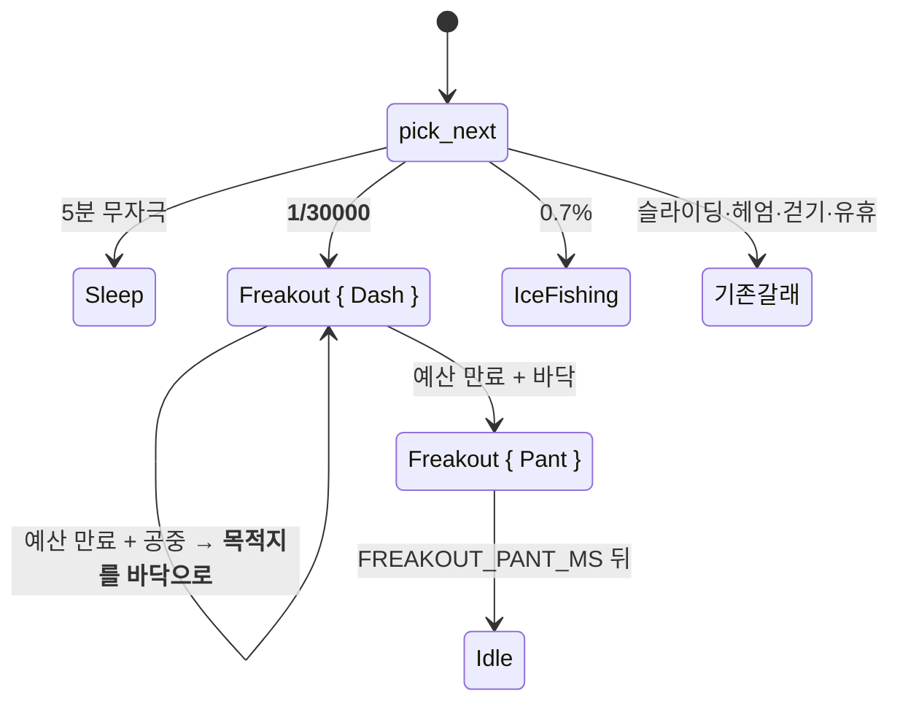
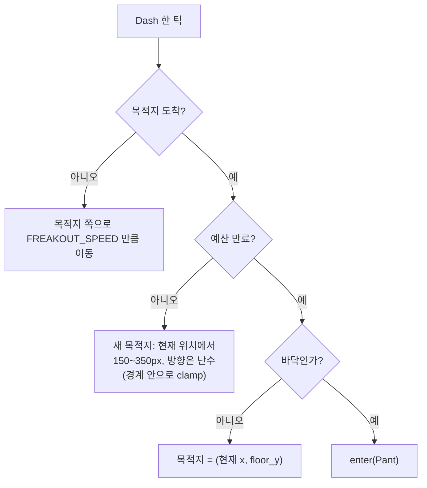

# 발작 — 며칠에 한 번 이유 없이 터지는 광란

> **이 앱에서 가장 드문 동작이다.** 지금 나오는 동작은 전부 "왜 나왔는지" 설명이
> 된다 — 걷다 지쳐 쉬고, 벽에 박아 구르고, 때려서 화낸다. 설명이 안 되는 게 하나도
> 없으면 결국 예측 가능해지고, 그 순간 이 앱은 끝난다 (PRINCIPLE 1).

## Goal Capsule

- **목표** — 며칠에 한 번, 아무 이유 없이 펭귄이 사방으로 마구 튀다가 숨을 고르고
  아무 일 없었다는 듯 돌아간다. 근거는 `MOTIONS.md` F3 "발작", PRD §5.3.
- **권위 순서** — `PRD > PRINCIPLE > CONVENTIONS > MOTIONS > 이 플랜`. 충돌하면 상위가 이긴다.
- **실행 프로필** — 브랜치 `feat/f3-freakout-01`. 코어(`pet.rs`)의 트리거·돌진·복귀·전이는
  **TDD 필수**(실패 테스트 먼저, 이름은 한국어). 웹뷰는 정적 렌더 대조 + 설치본 수동 확인.
  커밋은 한국어 Angular 컨벤션, 유닛 하나 = 커밋 하나.
- **정지 조건** — ① 발작이 화면 밖으로 나간다 ② 발작이 끝나며 철푸덕·널브러짐을
  유발한다("아무 일 없었다는 듯"이 깨진다) ③ 저확률 갈래가 기존 동작 시퀀스의
  결정론을 깬다 ④ 트리거를 테스트로 도달시킬 방법이 없다. 하나라도 걸리면 멈추고 보고한다.
- **꼬리 작업** — `.github/TEMPLATE/PR.md`로 PR을 열고, 두 러너 + 타입 검사 통과와
  `ce-code-review` 반영 후 merge한다. 같은 PR에 `TODO.md`·`MOTIONS.md`·**`PRD.md` Q8**
  갱신을 포함한다.

---

## Product Contract

**Summary** — 며칠에 한 번, 아무것도 안 했는데 펭귄이 갑자기 사방으로 미친 듯이 튀기
시작한다. 2~4초쯤 그러다 바닥에 내려앉아 헐떡이고, 곧 아무 일 없었다는 듯 다시 걷는다.
**소리는 나지 않는다.** 설정 창의 "동작 시켜보기"에서 눌러서 볼 수도 있다.

**Problem Frame** — 지금 동작 열일곱 개가 전부 **원인이 있다.** 유휴가 끝나서 걷고,
벽에 닿아서 구르고, 세게 떨어져서 널브러지고, 스무 번 맞아서 빽빽댄다. 원인-결과가
빈틈없이 채워지면 관찰자는 곧 규칙을 다 알게 되고, 규칙을 다 알면 볼 이유가 없다.
**설명되지 않는 것이 하나는 있어야 한다** — 그게 "얘 뭐야" 하는 순간을 만든다.

**Requirements**

| # | 요구사항 |
|---|---|
| R1 | 아무 자극 없이, **아주 낮은 확률로** 저절로 시작한다 |
| R2 | 시작하면 **사방으로 빠르게 방향을 바꾸며** 돌아다닌다. 헤엄보다 확연히 빠르다 |
| R3 | **떠 있는 화면 밖으로 나가지 않는다** (PRINCIPLE 2 — 경계는 벽이다) |
| R4 | 2~4초 뒤 **바닥으로 돌아와** 숨을 고르고 평소 동작으로 간다 |
| R5 | 끝나면서 **철푸덕·널브러짐이 나오지 않는다** — 아무 일 없었다는 듯 돌아간다 |
| R6 | 발작 중에도 클릭·드래그는 지금처럼 먹는다 |
| R7 | **소리를 내지 않는다** (PRD §5.5 — 음원은 Q9 미정) |
| R8 | 같은 시드 + 같은 타임스탬프열은 **여전히 같은 동작 시퀀스**를 낳는다 (PRINCIPLE 3) |
| R9 | 설정 창의 "동작 시켜보기"에서 발작을 시킬 수 있다 |
| R10 | **PRD Q8이 닫힌다** — 트리거가 문서에 확정으로 남는다 |

**Acceptance Examples**

- **AE1** — Given 바닥에서 걷는 펭귄, When `pick_next`를 아주 많이 반복하면,
  Then `Freakout`이 **적어도 한 번은** 나오고, 같은 횟수의 얼음낚시보다 **훨씬 드물다**.
- **AE2** — Given 발작 중인 펭귄, When 50ms 간격으로 진행시키면,
  Then 진행 방향이 **여러 번 바뀌고**, 매 틱의 `x`·`y`가 항상 경계 안이다.
- **AE3** — Given 발작 중인 펭귄, When 예산이 다 될 때까지 진행시키면,
  Then 마지막에 `y == floor_y`이고 동작이 숨 고르기를 거쳐 유휴가 된다.
  **`Splat`·`Sprawl`은 한 번도 나오지 않는다.**
- **AE4** — Given 서로 다른 시드의 펭귄들, When 같은 타임스탬프열로 진행시키면,
  Then 골든 수열 테스트가 **새 기준값으로** 통과한다.
- **AE5** (수동) — 설치본에서 "동작 시켜보기 → 발작"을 누르면 사방으로 튀다가
  바닥에서 헐떡이고 평소로 돌아온다. **창 밖으로 안 나가고**, 소리는 안 난다.

**Scope Boundaries**

비목표:
- **소리를 붙이지 않는다** (PRD Q9 미정, `TODO.md` 별도 항목).
- **빈도 재조정은 이 PR이 아니다.** 여기서는 발작 하나의 확률만 정한다 —
  네 등급이 체감상 구분되는지 보는 것은 다음 항목이다.
- 발작 중에 다른 펭귄이 반응하지 않는다.
- 말풍선 문구를 연동하지 않는다 (`MOTIONS.md` "말풍선" — 별도 채널이다).

### Deferred to Follow-Up Work
- **빈도 설계 재조정** — 발작이 들어오면 네 등급의 표본이 다 모인다. 다음 PR.
- **빠따 연타가 되감기지 않는다** — 기존 `TODO.md` 후속 항목. 이 플랜은 그 전제를
  새로 깨지 않는다.

---

## Planning Contract

### Key Technical Decisions

**KTD1 — PRD Q8 확정: 트리거는 순수 저확률 무작위다.** 후보는 셋이었다 — 빠따 연타 후,
순수 무작위, 둘 다. **연타는 이미 빽빽거리기(`Squawk`)가 가져갔다**(2초 안쪽 간격 20회).
같은 입력에 두 반응을 걸면 어느 쪽이 나올지가 또 하나의 규칙이 되고 둘 다 희석된다.
결정적으로 `MOTIONS.md`의 정의가 "**아무 일 없었다는 듯** 돌아온다"인데, 이건 **원인이
없어야 성립한다** — 원인이 있으면 그건 화지 발작이 아니다. 이 결론을 `PRD.md` §9 Q8에
확정으로 적는다 (R10).

**KTD2 — 확률은 `1/N` 꼴로 쓴다. `FREAKOUT_ONE_IN = 30_000`.** 얼음낚시는 천분율
(`range((0,999))`)인데 발작은 그보다 두 자릿수 더 드물어야 해서 그 단위로는 표현이 안 된다.
백만분율은 값을 읽고 빈도를 가늠할 수 없다. `range((0, N-1)) == 0`이 문자 그대로 "N번에
한 번"이라 계산이 코드에 드러난다.

**계산**: 걷기·유휴 한 사이클이 평균 4초쯤이다(얼음낚시 상수 주석의 근거). 30,000 사이클
× 4초 = 120,000초 = **깨어 있는 33시간**. 하루 열 시간쯤 켜 둔다면 **사흘에 한 번꼴**이고,
이게 `MOTIONS.md` 빈도 표의 "며칠에 한 번. 봤으면 운이 좋은 것"이다.

**KTD3 — `pick_next`에서 얼음낚시보다 앞에 둔다.** 뒤에 두면 앞 갈래 확률에 한 번 더
깎여 체감 빈도가 계산과 어긋난다(그 주석이 이미 코드에 있다). 발작이 가장 드무므로 가장
덜 깎여야 하고, 둘 다 뽑혔을 때는 **더 드문 쪽이 이겨야** 본 보람이 있다. 자리는
졸기 갈래 바로 뒤다 — 졸기는 5분 무자극이라는 강한 조건이라 발작보다 앞이다.

**KTD4 — "사방으로 튄다"는 헤엄과 같은 목적지 방식이되, 짧고 빠르게 한다.** 던지기
물리(`vx`/`vy`)를 재사용하면 중력이 바닥으로 끌고 가 `landing_of`가 철푸덕·널브러짐을
유발한다(R5 위반). 우회 분기를 넣으면 착지 판정이 두 벌이 된다.

목적지 방식은 **경계 안이 정의상 보장**되고(목적지를 경계 안에서 뽑는다) 착지 경로를
아예 지나지 않는다. 광란으로 읽히게 하는 건 속도가 아니라 **방향이 바뀌는 빈도**이므로,
목적지를 멀리 두지 않고 **150~350px 떨어진 곳**으로 잡아 0.17~0.4초마다 갈아 끼운다.
2~4초 동안 방향이 6~20번 바뀐다.

**KTD5 — 국면 둘로 나눈다 (`Dash` / `Pant`). 얼음낚시와 같은 구조다.** 두 문제가 한
번에 풀린다.

- **길이 동기화**: 판 길이는 2~4초 난수라 `pet-css.test.ts`의 고정 상수 대조를 못 쓴다.
  `Dash`는 **무한 반복** 애니메이션이라 대조 대상이 아니고(드리우기와 같다), `Pant`는
  고정 길이라 대조한다.
- **숨 고르기**: 앉거나 떠는 자세에서 곧장 유휴로 가면 `.pg-all`에 걸린 변형이 한
  프레임에 사라져 펭귄이 튄다 — 얼음낚시가 `Pack`을 만든 이유와 같다.

**KTD6 — 바닥으로 돌아오는 것을 별도 국면으로 만들지 않는다.** 예산이 다 됐을 때
`Pant`로 곧장 가면 `enter()`가 `air = false`로 만들고 `clamp`가 다음 틱에 `y`를
바닥으로 **순간이동**시킨다. 그래서 예산 만료는 **목적지를 고르는 자리**에서 본다:
바닥에 있으면 `Pant`, 아니면 **바닥을 목적지로 한 `Dash`를 한 번 더** 한다. 국면을
늘리지 않고도 "마지막엔 내려온다"가 나오고, 그 판정은 `ARRIVE_EPSILON`과 같은 기준을 쓴다.

**KTD7 — 고도는 국면이 정한다.** `is_airborne()`이 `Dash`에 참, `Pant`에 거짓을
돌려주면 기존 `enter()`의 기본 갈래가 그대로 옳게 동작한다. 예외 목록을 늘리지 않는다.

**KTD8 — 예산(`freakout_until_ms`)은 무효화가 필요 없다.** 빽빽거리기의
`squawk_until_ms`는 `whack()`이 **동작 밖에서** 읽기 때문에 다른 동작으로 나갈 때
지워야 했다. 발작 예산은 `Freakout` 팔 **안에서만** 읽으므로 새지 않는다. 이 차이를
필드 주석에 남긴다 — 안 남기면 다음 사람이 대칭이 깨진 줄 알고 "고친다".

**KTD9 — 새 SVG 도형이 필요 없다.** 떨림은 `.pg-all`, 날개는 두 짝, 눈 크게 뜨기는
기존 `.pg-eye`로 낸다. 도형을 늘리면 후광 규칙(`display: none`으로 숨겨야 한다) 함정을
한 번 더 지나게 된다.

### Assumptions

- **A1** — `FREAKOUT_MS = (2_000, 4_000)`, `FREAKOUT_PANT_MS = 700`,
  `FREAKOUT_SPEED = 900.0`, `FREAKOUT_HOP = (150.0, 350.0)`. 눈으로 보고 조정할 수 있는
  취향 값이다. 속도는 헤엄(95)의 아홉 배 남짓이고, 20Hz 틱에서 한 틱에 45px이라
  순간이동으로는 안 보인다.
- **A2** — 골든 수열(`화면이_하나면_동작_수열이_그대로다`)이 **밀린다.** `pick_next`에
  난수 갈래가 하나 늘기 때문이다 — **네 번째 재기준화**이고, 앞의 셋(벽 굴림·얼음낚시·
  슬라이딩)과 같은 성격의 의도한 변경이다. 그 주석에 네 번째임을 적는다.
- **A3** — 발작 중의 클릭은 기존 경로(`Swing` → `Sassy` → 공중이면 `Falling`)를 그대로
  탄다. 공중에서 맞았으니 세게 떨어져 널브러질 수 있는데, 그건 **사용자가 만든 사건**이라
  R5(저절로 끝날 때)에 어긋나지 않는다.

### High-Level Technical Design

---

## Implementation Units

### U1 — 코어: 이유 없이 터지고, 사방으로 튀고, 내려와 숨을 고른다

**Goal** — `pet.rs`가 아주 낮은 확률로 발작에 들어가 경계 안에서 방향을 바꾸며 돌아다니고,
예산이 다 되면 바닥으로 돌아와 헐떡인 뒤 유휴로 나간다.

**Requirements** — R1~R8, KTD1~KTD8

**Dependencies** — 없음

**Files** — `src-tauri/src/pet.rs` (인라인 `mod tests` 포함)

**Approach**
- `FreakoutPhase { Dash, Pant }` 열거형과 `Behavior::Freakout { freakout: FreakoutPhase }`
  추가. `FishingPhase`/`IceFishing`이 형식의 기준이다.
- `is_airborne()`에 `Freakout { Dash }`만 참을 돌려준다 (KTD7). `is_landing()`은 둘 다 거짓.
  `moves_window()`는 기본값(참) — 창이 실제로 움직인다.
- 상수: `FREAKOUT_ONE_IN: u64 = 30_000`, `FREAKOUT_MS: (u64, u64) = (2_000, 4_000)`,
  `FREAKOUT_PANT_MS: u64 = 700`, `FREAKOUT_SPEED: f64 = 900.0`,
  `FREAKOUT_HOP: (f64, f64) = (150.0, 350.0)`.
  컴파일 타임 가드: `assert!(FREAKOUT_SPEED > SWIM_SPEED)` (광란이 헤엄보다 느리면
  광란이 아니다), `assert!(FREAKOUT_MS.1 >= FREAKOUT_MS.0)`.
- `Pet`에 `freakout_until_ms: u64` 추가. **무효화가 필요 없는 이유를 주석에 남긴다**(KTD8).
- `pick_next`: 졸기 갈래 **바로 뒤**, 얼음낚시 **앞**에
  `if !self.air && self.range((0, FREAKOUT_ONE_IN - 1)) == 0`. `range`가
  `lo + next % (hi - lo + 1)`이므로 이 형태가 정확히 1/N이다.
- `enter_freakout(now_ms)`: 예산을 절대 시각으로 한 번 뽑고(`fishing_until_ms` 선례),
  첫 목적지를 잡은 뒤 `Dash`로 진입.
- `next_freakout_target(bounds)`: 방향은 `fraction() * 2π`, 거리는 `FREAKOUT_HOP`에서
  뽑아 현재 위치에 더한 뒤 **경계 안으로 clamp**한다 (R3).
- `step`의 `Freakout` 팔: `Dash`는 `Swim` 팔의 도착 판정(`ARRIVE_EPSILON`)과 진행
  방향(`facing`) 처리를 그대로 따르되, 도착했을 때 `Falling`이 아니라 위 flowchart의
  갈래를 탄다. `Pant`는 시간이 다 되면 `enter_idle`.
- **`get_up`을 쓰지 않는다** — 70% 약올리기는 "아무 일 없었다는 듯"과 정반대다.
  얼음낚시가 같은 판단을 한 선례가 있다.
- `start_freakout(now_ms) -> bool`: `Dragged`이거나 이미 `Freakout`이면 거절
  (`start_squawk` 선례 — 재진입하면 웹뷰가 되감지 못한다). 공중은 허용한다 —
  `Dash`가 어차피 공중 동작이다.
- 골든 수열 테스트의 기준값을 다시 뜨고 **네 번째 재기준화임을 주석에 적는다** (A2).

**Execution note** — 트리거 도달성과 경계 유지는 실패 테스트를 먼저 쓴다.
`가끔_얼음낚시를_한다`/`얼음낚시는_드물다`가 형식의 기준이다.

**Test scenarios**
- `저절로_발작이_나온다` — **`pick_next`를 직접 20만 번 부른다.** 시드가 다른 펭귄을
  만들어 한 번씩 부르면 `step`을 거치지 않아 빠르다. 기대값 ≈ 6~7회이므로 1회 이상을
  단언한다. **AE1을 덮는다.**
- `발작은_얼음낚시보다_훨씬_드물다` — 같은 표본에서 두 동작의 횟수를 세어 비교한다.
  상수를 참조해 쓴다 — 값을 하드코딩하면 상수를 고칠 때 조용히 무의미해진다.
- `발작은_공중에서_저절로_시작하지_않는다` — `!air` 가드 (R1).
- `발작하는_동안_방향이_여러_번_바뀐다` — 50ms 간격 진행에서 이동 방향 부호가
  여러 번 뒤집힌다 (R2). **AE2를 덮는다.**
- `발작은_헤엄보다_빠르다` — 같은 시간의 이동 거리가 헤엄보다 크다 (R2).
- `발작하는_동안_경계를_넘지_않는다` — 매 틱 `x`·`y`가 `bounds` 안이다. **AE2를 덮는다.**
- `발작이_끝나면_바닥에서_숨을_고른다` — 마지막에 `y == floor_y`, 동작이 `Pant`.
  **AE3을 덮는다.**
- `발작은_철푸덕이나_널브러짐으로_끝나지_않는다` — 시작부터 끝까지 한 번도
  `is_landing()`이 참이 되지 않는다 (R5). **AE3을 덮는다.**
- `숨_고르기가_끝나면_유휴로_간다` — `Sassy`가 아니다 (KTD의 `get_up` 배제).
- `발작_한_판은_예산_안에_끝난다` — 얼음낚시의 같은 이름 테스트가 형식의 기준이다.
- `걸을_폭이_없는_화면에서도_발작이_갇히지_않는다` — 경계가 겹쳐도 판이 끝난다.
- `발작_중에_클릭하면_방망이를_휘두른다` / `발작_중에_들어_올릴_수_있다` (R6).
  **실제 클릭 경로(`drag_start` → `whack`)로 쓴다** — 프론트는 클릭인지 드래그인지
  알기 전에 모든 pointerdown에서 `drag_start`를 부르므로, `whack()`만 직접 부르면
  실제로는 지나지 않는 경로를 재게 된다(빽빽거리기에서 실제로 밟았다).
- `발작은_제자리_동작이_아니다` — `Dash`는 `is_airborne()` 참, `Pant`는 거짓,
  둘 다 `is_landing()` 거짓, `moves_window()` 참.
- `시키면_바로_발작한다` / `들려_있거나_이미_발작_중이면_시켜도_안_한다` (R9).
- 기존 `같은_시드는_같은_동작_시퀀스를_낳는다`가 그대로 통과한다 (R8).
- 기존 `화면이_하나면_동작_수열이_그대로다`를 **새 기준값으로** 다시 뜬다. **AE4를 덮는다.**

**Verification** — `cd src-tauri && cargo test`

---

### U2 — 웹뷰: 부르르 떨며 튀는 그림과 헐떡임

**Goal** — 발작하는 동안 몸이 떨리고 날개가 마구 움직이며 눈이 커지고, 끝에 바닥에서
어깨로 숨을 쉰다.

**Requirements** — R7, KTD5·KTD9

**Dependencies** — U1

**Files**
- `src/lib/pet.ts` (`FreakoutPhase` 타입, `Behavior` 유니온, `behaviorClass`, `isOneShot`),
  `src/lib/pet.test.ts`
- `src/pet/pet.css`, `src/pet/pet-css.test.ts`

**Approach**
- `behaviorClass`에 갈래를 하나 더한다 — `pg--freakout-dash` / `pg--freakout-pant`.
  얼음낚시(`pg--fishing-<phase>`)와 같은 모양이다. 국면을 클래스에 안 실으면 판 내내
  한 그림으로 굳는다.
- `isOneShot`: `pg--freakout-pant`는 참, `pg--freakout-dash`는 **거짓**(무한 반복).
  드리우기(`pg--fishing-wait`)를 뺀 것과 같은 이유다.
- CSS:
  - `.pg--freakout-dash .pg-all` — 짧은 주기(0.1초 안팎)의 떨림을 `infinite`로.
    **길이 대조 대상이 아니다** — 판 길이가 난수다.
  - `.pg--freakout-dash` 날개 두 짝·머리·눈 — 빠른 반복. 눈은 커진 채 유지한다.
  - `.pg--freakout-pant .pg-all { animation: ... 0.7s ...; }` — 길이가
    `FREAKOUT_PANT_MS`와 같아야 하고 `pet-css.test.ts`의 "동작 길이 동기화"에
    항목을 추가해 못박는다.
  - **`@keyframes` 이름은 쓰는 클래스에서 딴다** (`pg-freakout`, `pg-freakout-wing`,
    `pg-freakout-pant`, ...). 같은 이름을 두 번 정의하면 앞의 애니메이션이 통째로
    죽는다 — `docs/solutions/ui-bugs/duplicate-keyframes-silently-kills-animation.md`.
  - 떨림 진폭은 `translate`로 낸다. `scale`을 크게 쓰면 잘림 계산
    (`MOTIONS.md` "잘림의 경계")을 다시 해야 한다.
- `ALL_BEHAVIORS`에 두 국면을 추가 — CSS 규칙 누락을 자동으로 잡는다.
- **소리를 내는 코드를 넣지 않는다** (R7).

**Test scenarios**
- `발작의_국면마다_다른_클래스를_받는다` / `모든_동작이_서로_다른_클래스를_받는다`(기존)에
  두 국면을 넣어도 충돌이 없다.
- `숨_고르기는_한_번짜리고_광란은_아니다` — `isOneShot("pg--freakout-pant")`가 참,
  `isOneShot("pg--freakout-dash")`가 거짓.
- `pet.css 커버리지`(기존 `it.each`) — 두 클래스 규칙을 자동 검사한다.
- `같은_이름의_keyframes가_두_번_정의되지_않는다`(기존)가 새 이름들을 검사한다.
- `숨_고르기_길이가_Rust의_FREAKOUT_PANT_MS와_같다`

**Verification** — `npm test` + `npm run build` + 정적 SVG 렌더로 떨리는 자세가
창 안에 들어오는지 대조.

---

### U3 — 설정 창에서 발작 시키기

**Goal** — "동작 시켜보기"에 발작 버튼이 생긴다 (R9).

**Requirements** — R9

**Dependencies** — U1

**Files**
- `src-tauri/src/pet_bridge.rs` (`pet_freakout`),
  `src-tauri/src/lib.rs` (**`generate_handler!` 등록** — 빠뜨리면 컴파일·테스트·경고가
  전부 통과하고 런타임에서만 조용히 reject된다:
  `docs/solutions/best-practices/tauri-command-registration-silent-failure.md`.
  다만 `모든_펫_커맨드가_invoke_handler에_등록되어_있다` 테스트가 잡는다)
- `src/lib/pet.ts`, `src/App.tsx`, `src/App.test.tsx`

**Approach**
- `pet_freakout`은 `pet_squawk`를 그대로 따른다. 대상은 **우클릭해서 연 그 펭귄**이고
  거절 사유는 한국어 문자열로 돌려준다.
- `App.tsx`의 `MOTIONS`에 한 줄 더한다. 설명(`note`)은 **이 동작 것으로 따로 쓴다** —
  끝나는 조건이 다르다(2~4초 뒤 스스로 바닥으로 내려와 끝난다).

**Test scenarios**
- `발작_버튼을_누르면_시킨다` (App)
- `카드가_전부_그려진다`(기존) 목록에 "발작"을 넣는다.
- `우클릭_대상이_없으면_함께_잠긴다`(기존)에 발작 버튼을 넣는다.
- `모든_펫_커맨드가_invoke_handler에_등록되어_있다`(기존)가 `pet_freakout`을 자동으로 잡는다.

**Verification** — 두 러너 + 설치본에서 버튼을 눌러 **AE5 수동 확인**.

---

### U4 — 문서: Q8을 닫고 카탈로그에 올린다

**Goal** — 문서가 코드와 같은 것을 말하고, **PRD의 마지막 F3 오픈 퀘스천이 닫힌다** (R10).

**Dependencies** — U1~U3

**Files** — `PRD.md`, `MOTIONS.md`, `TODO.md`

**Approach**
- `PRD.md` §9 Q8 — 상태를 **확정**으로 바꾸고 결론(순수 저확률 무작위)과 근거(KTD1)를
  한 줄로 남긴다. "미정 — F3 플랜에서 결정"을 지운다.
- `MOTIONS.md` — 발작을 "넣을 동작"에서 "구현된 동작"으로 옮긴다. 국면이 있는 동작이
  둘이 되므로 얼음낚시 절 옆에 나란히 둔다. KTD1(트리거)·KTD4(목적지 방식을 쓴 이유)·
  KTD5(국면 둘)·KTD6(바닥 복귀를 국면으로 안 만든 이유)를 짧게 남긴다.
  빈도 표의 `희귀` 행에 실제 값(1/30000 ≈ 며칠에 한 번)을 적는다.
- `TODO.md` — 발작을 체크하고 한 줄 요약. **"넣을 동작"이 비었으므로** F3에 남은 것이
  빈도 재조정·효과음·핀볼 모드뿐임이 드러나게 정리한다.

**Test expectation: none** — 문서만 고친다.

---

## Verification Contract

| 무엇을 | 명령 | 적용 유닛 |
|---|---|---|
| 트리거·돌진·경계·복귀·전이 | `cd src-tauri && cargo test` | U1, U3 |
| 웹뷰 매핑·CSS 커버리지·길이 동기화·keyframes 중복 | `npm test` | U2, U3 |
| 타입 검사 | `npm run build` | U2, U3 |
| 떨리는 자세가 창 안인가 | 정적 SVG 렌더 대조 | U2 |
| 실제 동작 — AE5 | 번들 설치 후 버튼 | U3 |
| 코드 리뷰 | `ce-code-review` | PR 직전 |

## Definition of Done

- R1~R10 충족, AE1~AE4 자동 테스트로 재현, AE5 수동 확인
- 두 러너 전체 통과 + `npm run build` 통과
- 트리거·돌진·복귀는 **실패 테스트가 먼저 있는 커밋 이력**이 남는다
- 골든 수열이 **의도한 네 번째 재기준화**로 갱신되고 그 사실이 주석에 있다
- 브랜치 `feat/f3-freakout-01`, 유닛 하나 = 커밋 하나
- **`PRD.md` Q8이 닫힌다.** `MOTIONS.md`·`TODO.md` 갱신이 같은 PR에 포함된다
- `ce-code-review` 지적을 반영했거나 이유가 PR "비고"에 있다
- 소리를 내는 코드가 diff에 없다 (R7)
