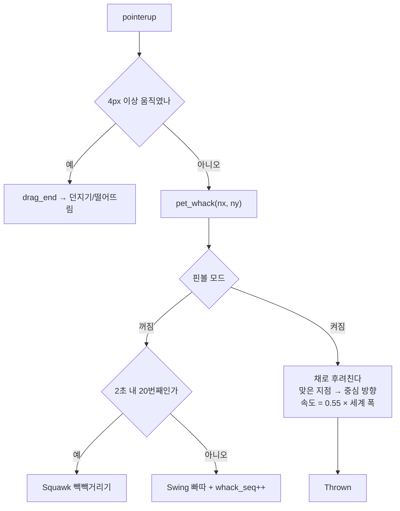
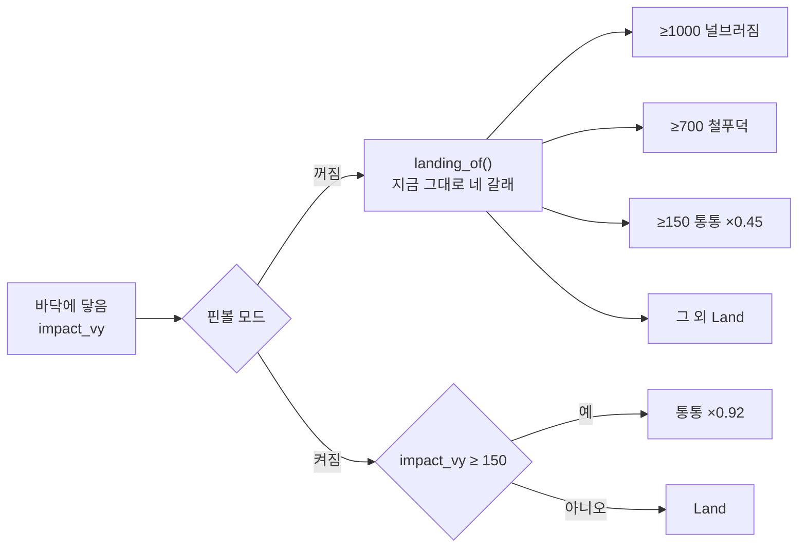

# feat: 핀볼 모드 — 펭귄을 채로 후려쳐 계속 튕긴다

**Goal Capsule** — 설정에서 켜면 착지 등급 판정(통통·철푸덕·널브러짐)이 가려지고
바닥·벽·천장이 전부 반사면이 되며, **왼쪽 클릭이 빠따가 아니라 채가 되어 펭귄을
날려 보낸다.** 커서가 펭귄 위에 있는 동안 방망이 모양으로 바뀐다. 기본은 꺼짐이고,
끄면 지금 동작이 **그대로** 돌아온다. 함께, 헤엄이 끝날 때 **90% 확률로 자유낙하가
부활한다** (별도 PR).

**출처** — `TODO.md` F3 마지막 미완료 항목("핀볼 모드 (on/off)")과 2026-09-01 대화.
미니게임 형태·플리퍼·헤엄 자유낙하 90%는 그 대화에서 확정됐다.

---

## 문제

핀볼 모드가 `TODO.md`에 적혔을 때는 **보는 것**이었다 — 감쇠를 없애면 펭귄이
알아서 오래 튄다. 하지만 사용자가 개입할 자리가 없으면 그건 물리 데모지 게임이
아니다. 실제로 요청된 것은 **"바탕화면에서 펭귄을 핀볼하면서 해보는" 미니게임**이고,
플레이어의 입력이 있어야 성립한다.

그 입력을 만들 자리는 이미 있다. 왼쪽 클릭은 지금 빠따(`Swing`)를 가져가는데,
`PRD.md` §5.1이 **"휘둘러도 날아가지 않는다"**를 명시적으로 못 박아 뒀다. 핀볼
모드는 그 문장을 모드 안에서만 뒤집는다 — 펭귄이 공이 되고 커서가 채가 된다.

동시에, 오늘 머지한 `93d419a`(헤엄이 자유낙하 대신 내려앉는다)로 **하늘에서
떨어지는 펭귄이 사라졌다.** 사용자는 그 그림을 되찾고 싶어 한다. 핀볼과 별개의
변경이지만, 저절로 떠오르고 떨어지는 펭귄은 **핀볼의 재료**이기도 하다.

---

## 요구사항

| ID | 요구사항 |
|---|---|
| R1 | 핀볼 모드를 설정 창에서 켜고 끈다. **기본 꺼짐.** 선택은 저장되고 다음 실행에도 유지된다 |
| R2 | 켜면 착지 등급 판정을 우회한다 — 철푸덕·널브러짐이 **한 번도** 나오지 않는다 |
| R3 | 켜면 바닥·좌우 벽·천장이 전부 반사면이 된다. 감쇠가 거의 없어 한참 튄다 |
| R4 | 끄면 착지 4단계가 **그대로** 돌아온다. 지우는 게 아니라 가려두는 모드다 |
| R5 | 켜면 왼쪽 클릭이 펭귄을 **맞은 지점의 반대 방향으로** 날려 보낸다. 빠따는 안 휘두른다 |
| R6 | 켜면 커서가 펭귄 위에 있는 동안 채 모양으로 바뀐다 |
| R7 | 모드는 앱 전역이다 — 여덟 마리를 켜 놨으면 여덟 마리가 전부 튄다 |
| R8 | 토글은 **즉시** 반영된다. 앱을 다시 띄우지 않아도 된다 |
| R9 | 헤엄이 끝날 때 **90%**는 자유낙하하고 10%는 지금처럼 날개를 저어 내려앉는다. 설정과 무관한 전역 변경이다 |

---

## 핵심 기술 결정 (KTD)

### KTD1 — 핀볼 플래그는 `Pet`의 필드다, `step`의 인자가 아니다

`Pet::set_pinball(&mut self, on: bool)`를 두고 브릿지가 켤 때 전 마리에 건다.

`step(now, world)`에 옵션 인자를 하나 더 붙이는 쪽이 "상태 없는 코어"에는 더
깔끔해 보이지만, **모든 모션 테스트의 호출부를 건드리는 기계적 대공사**가 된다.
`World` 교체 때 이미 겪었고 `TODO.md`에 그 후유증("쓰지 않게 된 다중 화면
좌표계")이 아직 열린 항목으로 남아 있다. 필드는 시드·`slide_speed`처럼 이미
있는 부류라 결정성도 그대로다.

**새로 태어난 펭귄도 값을 받아야 한다** — `pet_add`와 `spawn_saved_pets`가
저장값을 읽어 걸지 않으면 아홉 번째 펭귄만 안 튄다.

### KTD2 — 착지 판정은 `landing_of`를 지우지 않고 앞에서 가로챈다

`landing_of(impact_vy)`는 **그대로 둔다.** `Pet`에 얇은 래퍼를 하나 두고, 핀볼이
켜져 있으면 다른 규칙을 쓰고 꺼져 있으면 `landing_of`를 그대로 부른다.

```text
fn landing(&self, vy) -> Landing:
    if !self.pinball: return landing_of(vy)          # 지금 그대로
    if vy >= BOUNCE_MIN_SPEED: return Bounce(-vy * PINBALL_DAMPING)
    return Settle(Land, LAND_MS)
```

이게 `TODO.md`의 **"착지 4단계를 지우는 게 아니라 가려두는 모드"**를 코드에
그대로 옮긴 것이다. 철푸덕·널브러짐이 있던 속도 구간(700 이상)은 통통이
흡수한다 — 새 분기가 아니라 문턱 하나가 사라지는 것이다.

**호출처 둘(`Falling`, `Thrown`)이 이 한 곳을 공유한다.** 벽 판정을 `hit_wall`
한 곳에 모은 것과 같은 이유다 — 판정이 두 벌이 되면 한쪽만 고쳐지고 조용히 갈라진다.

**아래 문턱(`BOUNCE_MIN_SPEED` 150)은 남긴다.** 없애면 펭귄이 영원히 미세하게
튀며 다시는 걷지 않고, 20Hz 틱이 영영 안 쉰다. 튀다가 결국 서서 제 할 일로
돌아가야 다음 랠리를 시작할 수 있다.

### KTD3 — 반사 계수는 0.92 하나로 통일한다

지금 값은 벽·천장 `BOUNCE_DAMPING` 0.5, 바닥 `FLOOR_BOUNCE_DAMPING` 0.45다.
핀볼 모드에서는 셋 다 `PINBALL_DAMPING` 하나를 쓴다 — 핀볼에서 벽은 범퍼고,
취향 조정이 한 곳에 있어야 한다.

**값의 근거는 랠리 길이다.** 500px 높이에서 떨어지면 착지 속도가 약 949px/s이고,
`BOUNCE_MIN_SPEED`(150) 아래로 죽기까지:

| 계수 | 튀는 횟수 | 판단 |
|---|---|---|
| 0.85 | 11회 | 짧다 — "계속 튕긴다"로 안 읽힌다 |
| 0.90 | 17회 | 괜찮다 |
| **0.92** | **22회** | **채택** |
| 0.95 | 35회 | 길지만 끝이 지루하다 (작은 튐이 오래 남는다) |
| 1.00 | ∞ | 펭귄이 다시는 살지 않는다. 창이 영원히 20Hz로 움직인다 |

### KTD4 — 플리퍼는 새 커맨드가 아니라 `pet_whack`에 좌표를 붙인다

`pet_whack(nx, ny)` — 맞은 지점을 펭귄 기준으로 정규화한 값(-0.5~0.5)을 항상
보낸다. 모드와 무관하게 프론트는 같은 일을 하고, **빠따냐 채냐는 코어가
정한다.** 커맨드를 둘로 나누면 프론트가 모드를 알아야 하고, 그러면 설정이
웹뷰 쪽으로 새어 나간다 (PRINCIPLE 4 — 웹뷰는 "어떻게 보이는지"만 안다).

- **방향** — 맞은 지점에서 펭귄 중심을 잇는 벡터. 아래를 치면 위로, 왼쪽을
  치면 오른쪽으로 간다. 정확히 중심을 치면 길이가 0이라 **바로 위**로 띄운다.
- **속도** — 세계 폭에 비례한다 (`clamp_throw`의 선례, KTD7). `PINBALL_HIT_RATIO`
  0.55 → 1440px 세계에서 792px/s. 던지기 상한(0.9 = 1296px/s)보다 얌전하고
  `THROW_MIN_SPEED`(260)보다는 확실히 세다.
- **`Thrown`으로 들어간다.** 포물선·벽 반사·`facing` 갱신이 전부 거기 있다.
- **`whack_seq`를 올리지 않는다.** 그 값이 늘면 웹뷰가 방망이를 휘두르는데,
  핀볼에서 방망이는 펭귄이 아니라 **커서**가 들고 있다.

### KTD5 — 핀볼 모드에서는 빽빽거리기 연타 판정을 건너뛴다

지금은 2초 안쪽으로 스무 번 맞으면 제자리에서 화를 낸다(`Squawk`). 핀볼에서
스무 번 치는 것은 **정상적인 랠리**고, 거기서 펭귄이 제자리에 멈춰 화를 내면
판이 끊긴다. 핀볼일 때는 `whack_run`을 세지 않는다.

설정 창의 "빽빽거리기" 버튼은 그대로 둔다 — 시켜서 보는 것과 자극에 대한
반응은 다르다.

### KTD6 — 헤엄 끝 자유낙하 90%는 전역이고, 대가를 문서에 적는다

`SWIM_FREEFALL_PERCENT = 90`. 헤엄이 목적지에 닿았을 때 90%는 `Falling`으로
넘기고(= `93d419a` 이전 동작) 10%는 지금처럼 내려앉는다.

**이 결정은 오늘 머지한 측정 기반 결정을 되돌린다.** 되돌린 근거는 사용자의
명시적 지시(2026-09-01)다. 대가는 이미 잰 값으로 알고 있다 — 20시간 실측에서
철푸덕 52회/h, 널브러짐 62회/h가 **전부 헤엄 끝에서** 나왔다. 90%면 그 값의
90%가 돌아온다.

**100%가 아니라 90%인 것에는 값이 있다.** 갈래가 하나 생겨서 헤엄의 끝이
예측 가능한 지점이 아니게 된다 (PRINCIPLE 1 — 재미의 반대말은 예측 가능함).

**핀볼과 겹치면 서로 돕는다.** 핀볼이 켜져 있으면 그 낙하는 철푸덕이 아니라
통통으로 흡수되므로, 저절로 하늘에서 떨어지는 펭귄이 곧 다음 랠리의 재료가 된다.

> **회수 지점** — 켜 보고 "1분에 한 번 널브러진다"가 거슬리면 두 가지 중간값이
> 있다: (a) 확률을 낮춘다, (b) **저절로 생긴 낙하는 통통까지만 허용**하고
> 철푸덕·널브러짐은 사용자가 만들었을 때만 나오게 문턱을 건다. (b)는 "떨어지는
> 그림"은 남기고 "저절로 널브러짐"만 없앤다. 지금은 **요청대로 제한 없이**
> 넣고, 이 선택지는 `TODO.md`에 후속으로 남긴다.

### KTD7 — 설정은 `pet` 키 아래 `pinball`, 읽고-고쳐-쓰기

`enabled`·`sound`·`count`가 이미 사는 곳이다. **객체를 통째로 덮어쓰면 마릿수가
1로 돌아간다** — 이미 한 번 겪은 버그라 `savePetSettings`가 읽고-고쳐-쓰기로
되어 있다. `PetSettings`에 필드 하나를 더하면 그 경로를 그대로 탄다.

Rust는 시작 시 `pet_pinball(app)`으로 읽고, 토글은 `pet_set_pinball` 커맨드로
전 마리에 즉시 건다(R8). **`generate_handler!` 등록을 빠뜨리면 컴파일·테스트·경고가
전부 통과하고 런타임에서만 조용히 reject된다** (`docs/solutions/best-practices/tauri-command-registration-silent-failure.md`).

### KTD8 — 웹뷰는 스냅샷으로 모드를 안다, 저장소를 다시 읽지 않는다

커서 모양을 바꾸려면 펭귄 창이 모드를 알아야 한다. `Snapshot`에 `pinball: bool`을
싣고 **`Look` 튜플에도 넣는다** — `Look`은 "겉모습이 바뀌었는가"의 정의이고,
여기 빠진 값은 그것만 바뀌는 전이가 웹뷰에 **영영 도달하지 않는다**(조용한 실패).
파일 주석이 이미 그렇게 경고하고 있다.

---

## 상위 설계

### 클릭 한 번이 갈리는 지점



### 착지가 갈리는 지점



---

## 구현 단위

> **PR을 둘로 나눈다.** `CONVENTIONS.md`의 "PR 하나는 `TODO.md` 체크박스 하나"를
> 지킨다. 헤엄 자유낙하는 핀볼 체크박스에 속하지 않는 별도 변경이라 `TODO.md`에
> 항목을 새로 만들고 따로 간다. 작고 독립적이라 **먼저** 보낸다 — 대가(철푸덕·
> 널브러짐 복귀)가 눈에 보이는 상태에서 큰 PR을 얹는 편이 낫다.

### PR 1 — `feat/f3-swim-freefall-01`

#### U1. 헤엄이 끝날 때 90%는 자유낙하한다

- **요구사항**: R9 (KTD6)
- **의존**: 없음
- **파일**: `src-tauri/src/pet.rs`
- **접근**: `SWIM_FREEFALL_PERCENT: u64 = 90` 상수를 추가한다. `Behavior::Swim`의
  도착 분기에서, 바닥에 닿지 않았고 아직 내려앉는 중이 아니면 `range((0, 99))`로
  갈래를 뽑아 90%는 `enter(Behavior::Falling, now_ms)`, 10%는 지금의 내려앉기
  경로를 탄다.
  **이미 내려앉는 중(`swim_descending`)일 때는 다시 뽑지 않는다** — 내려오는
  도중에 매 틱 추첨하면 난수를 태우고 갈래도 무의미해진다.
- **따를 패턴**: `pick_next`의 확률 갈래(`range((0, 999)) < ICE_FISHING_PERMILLE`),
  `hit_wall`의 `TUMBLE_AT_WALL_PERCENT`.
- **실행 노트**: 실패 테스트 먼저. 갈래가 하나 늘어 **골든 수열이 여섯 번째로
  재기준화**된다 — 값을 새로 뜨기 전에 "왜 밀렸는지"를 테스트 주석에 적는다
  (다섯 번째까지의 이력이 이미 거기 있다).
- **테스트 시나리오** (`pet.rs` 인라인):
  - `헤엄이_끝나면_대개_자유낙하한다` — 시드를 여럿 돌려 헤엄 종료 직후 동작을
    모으면 `Falling`이 다수, `Land`/내려앉기가 소수다. 비율을 정확히 90%로
    못 박지 말고 **다수/소수 방향만** 본다 (표본이 작으면 흔들린다).
  - `헤엄이_바닥_근처에서_끝나면_그냥_닿는다` — 목적지가 바닥이면 추첨과 무관하게
    `Land`. 회귀 방지: 자유낙하 갈래가 이 경로를 삼키면 안 된다.
  - `내려앉는_중에는_다시_추첨하지_않는다` — 10% 갈래에 들어간 뒤 목적지에
    닿을 때까지 `Falling`으로 새지 않는다.
  - 기존 `수열이_시드에_대해_고정이다` — 새 값으로 재기준화하고, 배열에서
    헤엄 뒤가 `Falling`으로 바뀐 자리에 주석을 남긴다.
- **검증**: `cargo test` 전체 초록. `빈도_등급이_순서대로다`가 그대로 통과한다
  (Walk·Idle·Swim·IceFishing만 보므로 영향이 없어야 한다 — 뒤집히면 그건 신호다).

#### U2. 실측을 다시 뜨고 문서를 맞춘다

- **요구사항**: R9
- **의존**: U1
- **파일**: `MOTIONS.md`, `TODO.md`, `PRD.md`
- **접근**: `cargo test --release 빈도_측정 -- --ignored --nocapture`로 다시 재서
  `MOTIONS.md`의 빈도 표와 `SWIM_DESCENT_SPEED` 주석의 점유율을 실측으로 갱신한다.
  **"철푸덕·널브러짐은 사용자가 만들었을 때만 나온다" 절을 되돌린다** — 그 문단은
  지금 코드와 정면으로 어긋나게 된다. 헤엄 종료가 두 갈래라는 것을 `Swim` 행의
  "종료" 칸에 적는다.
  `TODO.md`에 완료 항목(자유낙하 90% 부활, 근거는 사용자 지시)과 후속 항목
  (KTD6의 회수 지점 (b))을 넣는다.
- **테스트 기대**: 없음 — 문서 변경이다. `빈도_측정`은 `#[ignore]`라 CI에서 안 돈다.
- **검증**: 표의 모든 숫자가 이번에 뜬 출력에서 나온 값이다. 추측한 숫자가
  한 칸도 없다.

### PR 2 — `feat/f3-pinball-mode-01`

#### U3. 코어에 핀볼 플래그와 착지 가로채기를 넣는다

- **요구사항**: R2, R3, R4, R7 (KTD1, KTD2, KTD3)
- **의존**: 없음 (U1과 독립이지만 순서상 뒤)
- **파일**: `src-tauri/src/pet.rs`
- **접근**: `Pet`에 `pinball: bool` 필드와 `set_pinball`/`pinball()` 접근자를
  추가한다. `PINBALL_DAMPING: f64 = 0.92` 상수를 `BOUNCE_DAMPING` 옆에 두고
  근거(랠리 22회, 1.0이면 영원히 튄다)를 주석으로 남긴다.
  `landing_of`를 부르던 두 자리(`Falling`, `Thrown`)를 `self.landing(vy)` 하나로
  바꾸고, 벽·천장 반사 계수도 핀볼이면 `PINBALL_DAMPING`을 쓰게 한다.
- **따를 패턴**: `landing_of`와 `Landing` 열거형, `hit_wall`의 "판정을 한 곳에
  모은다" 규칙.
- **실행 노트**: 실패 테스트 먼저. **기본이 꺼짐이라 새 난수를 뽑지 않으므로
  골든 수열은 흔들리지 않아야 한다** — 흔들리면 어딘가에서 추첨을 했다는 뜻이다.
- **테스트 시나리오**:
  - `핀볼이면_세게_떨어져도_널브러지지_않는다` — 널브러짐 문턱(1000+)을 넘는
    속도로 떨어뜨려도 `Sprawl`/`Splat`이 한 번도 안 나오고 `Thrown`/`Falling`이
    이어진다.
  - `핀볼을_끄면_착지_네_갈래가_그대로다` — 같은 입력에 `Sprawl`이 나온다 (R4).
  - `핀볼이면_바닥에서_여러_번_튄다` — 500px에서 떨어뜨려 바닥 접촉 횟수를 세면
    열 번을 넘는다. 정확한 횟수를 못 박지 않는다 (계수는 취향 상수다).
  - `핀볼이라도_결국_선다` — 충분히 오래 돌리면 지상 동작으로 끝난다. 영원히
    튀는 상태가 없다는 가드다.
  - `핀볼이면_벽에서도_거의_안_죽는다` — 옆으로 던져 벽 반사 후 남은 `vx`가
    평소(0.5)보다 크다.
- **검증**: `cargo test` 초록. 기존 착지·던지기 테스트가 **하나도** 안 바뀐다
  (기본 꺼짐이므로).

#### U4. 클릭이 채가 된다

- **요구사항**: R5 (KTD4, KTD5)
- **의존**: U3
- **파일**: `src-tauri/src/pet.rs`
- **접근**: `whack(now_ms, world)`에 맞은 지점 `(nx, ny)`를 받는 인자를 더한다.
  핀볼이면 `whack_seq`·`whack_run`을 건드리지 않고, 방향 벡터
  `(-nx, -ny)`를 정규화해 `PINBALL_HIT_RATIO * world.width()`를 곱한 뒤
  `Thrown`으로 들어간다. 길이가 0에 가까우면 `(0, -1)`(바로 위).
  `last_stimulus_ms`는 그대로 갱신한다 — 쳐 놓고 5분 뒤에 조는 건 이상하다.
- **따를 패턴**: `drag_end`의 `clamp_throw`·`World::width()` 사용, `enter_swim`의
  목적지 계산.
- **실행 노트**: 실패 테스트 먼저.
- **테스트 시나리오**:
  - `핀볼에서_아래를_치면_위로_날아간다` — `ny > 0`으로 치면 `vy < 0`이고
    동작이 `Thrown`이다.
  - `핀볼에서_왼쪽을_치면_오른쪽으로_간다` — `nx < 0`이면 `vx > 0`.
  - `핀볼에서_정중앙을_치면_위로_뜬다` — `(0, 0)`에 0으로 나누지 않고 위로 간다.
  - `핀볼에서_치는_세기는_세계_폭을_따른다` — 넓은 세계에서 같은 클릭이 더 빠르다.
  - `핀볼에서는_방망이를_휘두르지_않는다` — `whack_seq`가 안 는다.
  - `핀볼에서_스무_번_쳐도_빽빽대지_않는다` — 연타해도 `Squawk`이 안 나온다 (KTD5).
  - `핀볼을_끄면_클릭이_빠따다` — 좌표를 줘도 `Swing`이고 제자리다 (회귀 가드).

#### U5. 브릿지가 설정을 읽고 쓰고 전 마리에 건다

- **요구사항**: R1, R7, R8 (KTD1, KTD7, KTD8)
- **의존**: U3, U4
- **파일**: `src-tauri/src/pet_bridge.rs`, `src-tauri/src/lib.rs`
- **접근**:
  - `pet_pinball(app) -> bool` — `pet_enabled`와 같은 모양으로 `pet.pinball`을
    읽는다. **없으면 `false`** (`enabled`가 `true`로 떨어지는 것과 반대다).
  - `spawn_saved_pets`와 `pet_add`가 새 펭귄에 그 값을 건다.
  - `pet_set_pinball(on)` 커맨드 — 저장은 웹뷰가 하고(기존 방식), 여기서는 살아
    있는 전 마리에 `set_pinball`을 건다. **`lib.rs`의 `generate_handler!`에 등록한다.**
  - `pet_whack` 커맨드에 `nx: f64, ny: f64` 인자를 더해 코어로 넘긴다.
  - `Snapshot`/`Look`에 `pinball`을 싣는다 (KTD8).
- **따를 패턴**: `pet_enabled`/`pet_count`의 저장소 읽기, `pet_set_enabled`의
  커맨드 모양, `look_of`의 "CSS에 영향을 주는 값은 빠짐없이" 규칙.
- **테스트 시나리오** (`pet_bridge.rs` 인라인):
  - `핀볼_설정이_없으면_꺼짐이다` — 기본값 가드.
  - `겉모습_비교에_핀볼이_들어간다` — `should_notify`가 `pinball`만 달라진
    두 `Look`을 다르다고 본다. 이게 없으면 토글이 웹뷰에 영영 안 간다.
  - 기존 커맨드 등록 대조 테스트(`pet_bridge.rs` 954줄 근처의 소스 파싱 테스트)가
    새 커맨드를 잡는지 확인한다 — 이미 있으면 자동으로 걸린다.
- **검증**: `cargo test` 초록. `npm run tauri dev`로 켜고 끄기가 즉시 먹는다.

#### U6. 설정 창에 핀볼 토글을 넣는다

- **요구사항**: R1 (KTD7)
- **의존**: U5
- **파일**: `src/lib/settings.ts`, `src/lib/pet.ts`, `src/components/SettingsCard.tsx`,
  `src/components/SettingsCard.test.tsx`, `src/App.tsx`
- **접근**: `PetSettings`에 `pinball: boolean`을 더하고 `DEFAULT_PET_SETTINGS`에서
  `false`로 둔다. `loadPetSettings`의 항목별 기본값 수렴 방식을 그대로 따른다
  (한 항목이 깨졌다고 나머지를 되돌리지 않는다). 저장은 기존 읽고-고쳐-쓰기
  `savePetSettings`를 탄다. `setPetPinball` invoke 래퍼를 `lib/pet.ts`에 더한다.
  `SettingsCard`에 세 번째 행을 넣고 **무엇이 달라지는지**를 힌트로 적는다 —
  "켜면 안 널브러지고 계속 튕겨요. 클릭하면 방망이 대신 펭귄이 날아가요."
- **따를 패턴**: `SettingsCard`의 소리 토글 행과 `settings-hint` 문구, `App.tsx`의
  `soundEnabled` 상태·저장 흐름(`saveFailed` 처리 포함).
- **테스트 시나리오**:
  - `핀볼_토글을_켜면_콜백이_참으로_불린다` (`SettingsCard.test.tsx`).
  - `저장된_핀볼_값이_없으면_꺼짐이다` (`settings.test.ts`).
  - `핀볼만_저장해도_마릿수가_남는다` (`settings.test.ts`) — 읽고-고쳐-쓰기 회귀 가드.
- **검증**: `npm test` + **`npm run build`**(타입 검사는 vitest가 안 한다).

#### U7. 펭귄 창이 좌표를 보내고 커서가 채가 된다

- **요구사항**: R5, R6 (KTD4, KTD8)
- **의존**: U5
- **파일**: `src/pet/PetApp.tsx`, `src/pet/pet.css`, `src/lib/pet.ts`,
  `src/pet/PetApp.test.tsx`, `src/pet/pet-css.test.ts`
- **접근**: `pointerdown`에서 SVG 기준 정규화 좌표(-0.5~0.5)를 `DragTrack`에
  담아 두고, 클릭으로 판정될 때 `whackPet(nx, ny)`로 넘긴다. **누른 지점을 쓴다** —
  뗀 지점은 4px 안쪽이라 같지만, "어디를 쳤나"의 의미는 누른 쪽에 있다.
  스냅샷의 `pinball`로 루트에 클래스를 걸고, CSS에서 `cursor`를 SVG data-URI
  방망이로 바꾼다. 창이 펭귄 크기라 **커서가 펭귄 위에 있을 때만** 바뀌는데,
  그게 정확히 "칠 수 있는 범위"다.
- **따를 패턴**: 시선 추적의 `getBoundingClientRect` 정규화(이미 같은 계산이
  `handlePointerMove`에 있다), `behaviorClass`의 클래스 조립.
- **함정**: `@keyframes` 이름은 쓰는 클래스에서 딴다 — 같은 이름을 두 번 정의하면
  앞의 애니메이션이 통째로 죽는다
  (`docs/solutions/ui-bugs/duplicate-keyframes-silently-kills-animation.md`).
  이 단위는 키프레임을 새로 만들지 않을 예정이지만, 만들게 되면 규칙을 따른다.
- **테스트 시나리오**:
  - `클릭하면_맞은_지점을_같이_보낸다` (`PetApp.test.tsx`) — `whackPet`이 좌표
    인자와 함께 불린다.
  - `펭귄_왼쪽을_누르면_음수_x가_간다` — 정규화 부호 가드.
  - `핀볼이면_커서_클래스가_붙는다`.
  - `pet-css.test.ts`에 커서 클래스가 CSS에 실제로 있는지 대조를 추가한다
    (클래스를 걸고 CSS를 빠뜨리면 아무것도 안 깨지고 눈으로만 잡힌다 — 이 파일이
    있는 이유다).
- **검증**: `npm test` + `npm run build`. `npm run tauri dev`로 켜고 클릭해서
  실제로 날아가는지, 커서가 바뀌는지 본다.

#### U8. 문서를 맞춘다

- **요구사항**: R1~R8
- **의존**: U3~U7
- **파일**: `PRD.md`, `PRINCIPLE.md`, `MOTIONS.md`, `TODO.md`, `CLAUDE.md`
- **접근**:
  - `PRD.md` §5.1 — "휘둘러도 날아가지 않는다"에 **모드 한정 예외**를 단다.
    §5에 핀볼 모드 절을 만든다. §4 비목표의 "육성·성장·재화·업적 같은 게임화"는
    **그대로 둔다** — 점수·목숨·판을 넣지 않았으므로 어긋나지 않는다. 그 사실을
    새 절에 한 줄 적어 다음 사람이 다시 논의하지 않게 한다.
  - `PRINCIPLE.md` 5 — "설정 세 가지"가 넷이 된다. 열거를 고친다.
  - `MOTIONS.md` — 착지 네 갈래 절에 "핀볼 모드에서는 가려진다"를 적고,
    핀볼 모드 절(무엇을 우회하고 계수가 왜 0.92인지)을 넣는다.
  - `TODO.md` — 핀볼 체크박스를 체크하고, 무엇을 넣고 무엇을 뺐는지(점수·목숨
    없음) 한 줄로 남긴다.
  - `CLAUDE.md` "현재 상태" — 남은 것이 효과음(Q9)뿐임이 드러나게 고친다.
- **테스트 기대**: 없음 — 문서다.
- **검증**: `PRD.md` §5.1을 읽었을 때 핀볼 모드와 모순되지 않는다.

---

## 범위 경계

**이번에 하는 것**은 위 요구사항 R1~R9뿐이다.

### 넣지 않는 것 (비목표)

- **점수·목숨·판 시작/종료·최고 기록.** `PRD.md` §4가 게임화를 비목표로 못 박아
  뒀고, 점수가 붙으면 "잘하려고" 보게 된다 — 이 앱은 보고 웃는 앱이다.
- **플리퍼 그림·범퍼·경사면 같은 핀볼 대(臺) 구성물.** 세계는 여전히 바탕화면
  하나고 벽은 화면 경계다.
- **효과음.** PRD Q9(음원·라이선스)가 미정이고 별도 항목이다.

### 후속으로 미루는 것

- 헤엄 자유낙하의 착지 등급 상한 (KTD6의 회수 지점 (b)).
- 핀볼 모드에서 마리끼리 부딪히기 — 지금 펭귄들은 서로를 모른다. 여덟 마리가
  동시에 튀는데 통과해 지나가는 게 어색하면 그때 본다.
- `pg--swing`이 `isOneShot`에 없어 연타가 안 되감기는 기존 버그 (`TODO.md` 후속).
  핀볼에서는 스윙을 안 쓰므로 이번 범위 밖이다.

---

## 위험

| 위험 | 영향 | 완화 |
|---|---|---|
| 골든 수열 재기준화(U1)가 **의도치 않은** 변경을 함께 삼킨다 | 회귀가 조용히 통과한다 | U1은 헤엄 갈래 **하나만** 바꾼다. 배열이 밀린 자리가 헤엄 뒤인지 눈으로 확인하고 주석에 남긴다 |
| `pet_set_pinball`을 `generate_handler!`에 빠뜨린다 | 토글이 런타임에서만 조용히 실패한다 | 이미 있는 커맨드 등록 대조 테스트가 잡는다. 없으면 U5에서 확인한다 |
| `Look`에 `pinball`을 빠뜨린다 | 토글이 웹뷰에 영영 안 간다 (커서가 안 바뀐다) | U5의 `겉모습_비교에_핀볼이_들어간다` 테스트 |
| 철푸덕·널브러짐 복귀가 예상보다 거슬린다 | 사용자 체감 악화 | 별도 PR로 먼저 보내 눈으로 확인한다. 회수 지점 (a)(b)를 KTD6에 적어 뒀다 |
| `PINBALL_DAMPING`이 너무 높아 펭귄이 사실상 안 쉰다 | 배터리·산만함 | `BOUNCE_MIN_SPEED` 아래 문턱을 남겼다. `핀볼이라도_결국_선다` 테스트가 가드 |

---

## 열린 질문

- **커서 그림을 무엇으로 할지.** SVG data-URI 방망이 하나를 그릴 예정인데,
  16×16에서 방망이가 방망이로 안 보이면 기존 `crosshair`로 떨어진다.
  구현 중에 눈으로 정한다 (실행 시점 미지수).
- **`PINBALL_HIT_RATIO` 0.55가 실제로 칠 맛이 나는지.** 계산으로는 던지기보다
  얌전한데, 손으로 쳐 봐야 안다. 취향 상수라 한 줄로 고칠 수 있게 둔다.

---

## 검증 계약

| 게이트 | 명령 |
|---|---|
| Rust 단위 테스트 | `cd src-tauri && cargo test` |
| 프론트 단위 테스트 | `npm test` |
| **타입 검사** | `npm run build` (vitest는 타입을 안 본다) |
| 개발 스모크 | `npm run tauri dev` |
| 코드 리뷰 | `ce-code-review` (PR 전 필수) |

### 수동 체크리스트 (PR 2)

1. 설정에서 핀볼을 켠다 → **앱을 다시 띄우지 않고** 곧바로 반영된다.
2. 펭귄을 높이 던진다 → 널브러지지 않고 열 번 넘게 튄다.
3. 커서를 펭귄 위에 올린다 → 방망이 모양이다.
4. 펭귄 아래를 클릭한다 → 위로 날아간다. 펭귄이 방망이를 휘두르지 **않는다.**
5. 스무 번 연타한다 → 빽빽대지 않고 계속 날아간다.
6. 핀볼을 끈다 → 세게 던지면 다시 널브러진다. 클릭하면 다시 빠따다.
7. 펭귄을 여러 마리로 늘린다 → 전부 튄다. 새로 부른 펭귄도 튄다.
8. 팝오버를 닫는다 → **트레이 아이콘이 남아 있다** (과거에 실제로 깨졌다).

---

## 완료 정의

- R1~R9가 전부 동작한다.
- `cargo test`·`npm test`·`npm run build`가 모두 초록이다.
- `ce-code-review` 지적을 반영했거나, 반영하지 않은 것은 PR "비고"에 이유를 적었다.
- `PRD.md`·`PRINCIPLE.md`·`MOTIONS.md`·`TODO.md`가 코드와 어긋나지 않는다.
- 수동 체크리스트 여덟 항목을 실제로 돌렸다.
- PR 두 개가 각각 `TODO.md` 체크박스 하나에 대응한다.
