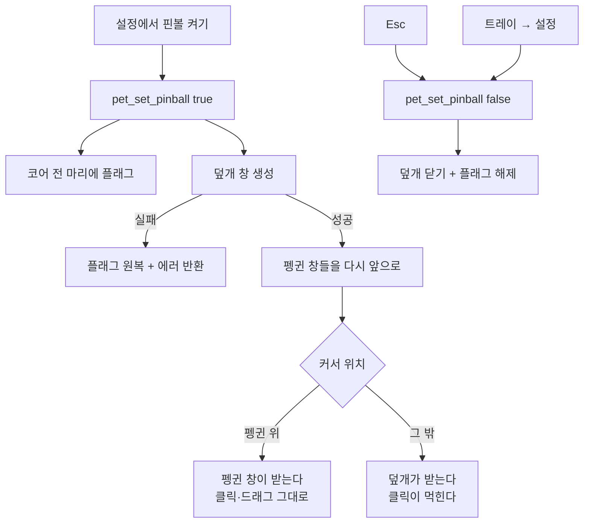

# feat: 핀볼 플레이필드 — 켠 동안 화면 전체가 판이 된다

**Goal Capsule** — 핀볼을 켜면 화면 전체를 덮는 투명 창이 뜬다. 그동안 **커서는 어디서나
방망이**고, 바탕화면과 다른 앱으로 가는 클릭은 **먹힌다.** 끄면 창이 닫히고 전부 원래대로
돌아온다. 나가는 문은 **둘**(트레이 아이콘·Esc)이고, 창을 못 만들면 모드가 스스로 되돌아온다.

**출처** — 2026-09-01 대화. #38(핀볼 모드)이 머지된 뒤의 후속이다. #38에서 커서가 펭귄
위에서만 방망이가 되는 것을 보고 **"켜면 마우스를 아예 비활성화하고 방망이로 바꿔 달라"**는
요청이 나왔다.

---

## 문제

#38의 커서는 **펭귄 창 위에서만** 방망이다. 커서 모양은 그 밑에 있는 창이 정하는데, 이
앱이 소유한 창이 펭귄 창(244×220)뿐이기 때문이다. 채를 들었다 놨다 하는 꼴이라 "핀볼을
하고 있다"는 느낌이 안 난다.

핀볼은 **판 위에서 하는 것**이다. 판이 없으니 방망이가 붙을 데도 없다.

---

## 요구사항

| ID | 요구사항 |
|---|---|
| R1 | 핀볼을 켜면 화면 전체를 덮는 투명 창이 뜨고, 끄면 **닫힌다** |
| R2 | 그 창 위에서 커서는 방망이다 — 결과적으로 **화면 어디서나** 방망이다 |
| R3 | 바탕화면·다른 앱으로 가는 클릭은 먹힌다. 그것이 요청된 "마우스 비활성화"다 |
| R4 | **펭귄은 지금처럼 클릭·드래그된다.** 핀볼을 켰다고 펭귄을 못 옮기게 되면 안 된다 |
| R5 | 나가는 문이 **둘**이다 — 트레이 아이콘(설정 창)과 **Esc** |
| R6 | 창을 못 만들면 모드를 **스스로 되돌린다**. 켜졌다고 표시된 채로 판이 없으면 안 된다 |
| R7 | 설정 창을 다시 열면 Esc로 끈 결과가 반영돼 있다 |

---

## 핵심 기술 결정 (KTD)

### KTD1 — 덮개는 펭귄 창보다 **아래**에 둔다

이게 이 플랜에서 가장 중요한 결정이다.

덮개를 펭귄 위에 두면 모든 클릭을 덮개가 받게 되고, 그러면 **어느 펭귄을 어디서 맞았는지
판정하는 코드와 드래그 라우팅을 새로 만들어야 한다** — 지금 `PetApp`이 하는 일(4px 문턱,
포인터 캡처, 속도 샘플링, 밀린 이동량 정산)을 화면 좌표로 한 벌 더 쓰는 셈이다. 그 코드는
이미 한 번 어렵게 맞춘 것이라 두 벌이 되면 반드시 갈라진다.

**아래에 두면 아무것도 새로 안 만들어도 된다.**

| 커서 위치 | 클릭을 받는 창 | 커서 모양 |
|---|---|---|
| 펭귄 위 | 펭귄 창 (지금 그대로) | 펭귄 창 CSS — 이미 방망이다 (#38) |
| 그 밖 | 덮개 | 덮개 CSS — 방망이 |

펭귄의 클릭·드래그·던지기가 **한 줄도 안 바뀐다** (R4). 덮개는 오직 두 가지만 한다:
방망이 커서를 화면 전체로 넓히는 것과, 바탕화면 클릭을 먹는 것.

**Z 순서를 어떻게 보장하나.** 펭귄 창과 덮개가 둘 다 `always_on_top`이라 같은 레벨이고,
같은 레벨 안에서는 **나중에 앞으로 보내진 창**이 위다. 덮개를 만든 **뒤에** 살아 있는
펭귄 창마다 `set_always_on_top(true)`를 다시 걸어 앞으로 끌어올린다. `pet_add`로 새
펭귄이 생기면 그건 나중에 만들어졌으니 자연히 위다.

### KTD2 — 나가는 문은 둘이고, 하나는 **우리 코드 밖**에 있다

전체 화면 클릭을 먹는 기능이라, 버그 하나가 **마우스를 못 쓰는 맥**을 만든다.
되돌리는 방법이 우리 코드에만 있으면 그 코드가 망가졌을 때 나갈 길이 없다.

- **트레이 아이콘** — `always_on_top`은 `NSFloatingWindowLevel`(3)이고 메뉴바는
  `NSMainMenuWindowLevel`(24)이라 **덮개가 메뉴바를 덮지 못한다.** 이건 우리가 짜는
  로직이 아니라 macOS의 창 레벨 규칙이라 앱이 어떻게 망가지든 남는다. 거기서 설정 창을
  열어 끈다.
- **Esc** — 덮개 웹뷰가 듣는다. 손이 이미 마우스에 있을 때 가장 빠른 길이다.
- **앱 종료** — 최후의 수단. 덮개는 앱이 죽으면 함께 사라진다.

**덮개는 숨기지 않고 닫는다.** 펭귄 on/off가 창을 닫는 것과 같은 판단이다 — 전체 화면
클릭을 먹는 창이 "숨겨진 채로" 남아 있을 이유가 없고, 숨김은 되살아날 여지를 남긴다.

### KTD3 — 켜기가 실패하면 모드를 되돌린다

`pet_set_pinball(true)`가 덮개를 못 만들면 **에러를 돌려주고 코어의 플래그도 원복한다.**
프론트는 이미 실패 시 표시를 되돌리게 돼 있다(#38의 `handlePinballEnabledChange`).

이게 없으면 "켜졌다고 보이는데 판이 없는" 상태가 되는데, 그건 사용자가 고칠 수 없다 —
꺼 봐야 이미 꺼져 있는 것처럼 동작한다.

### KTD4 — 덮개 웹뷰는 React를 쓰지 않는다

하는 일이 **커서 CSS 한 줄과 Esc 핸들러 하나**다. 상태도 없고 그릴 것도 없다.
`pet.html`처럼 엔트리를 하나 더 만들되(`field.html`) 내용은 순수 TS로 둔다.

**투명 창인데 배경을 칠하지 않는다.** 조금이라도 칠하면 화면 전체에 막이 씌워진 것처럼
보인다. 판은 보이지 않아야 한다 — 보이는 것은 커서뿐이다.

### KTD5 — capabilities에 라벨을 등록한다

덮개는 `pet_set_pinball`을 부른다(Esc). `capabilities/default.json`의 `windows`에
라벨이 없으면 **컴파일·테스트·경고가 전부 통과하고 런타임에서만 조용히 reject된다**
(`docs/solutions/best-practices/tauri-command-registration-silent-failure.md`).

---

## 상위 설계

---

## 구현 단위

### U1. 덮개 창을 만들고 닫는다

- **요구사항**: R1, R3, R6 (KTD1, KTD3, KTD5)
- **파일**: `src-tauri/src/pet_bridge.rs`, `src-tauri/capabilities/default.json`,
  `field.html`, `src/field/main.ts`, `vite.config.ts`
- **접근**: `create_field_window` / `close_field_window`를 `pet_set_pinball`에 묶는다.
  창 설정은 `create_pet_window`를 그대로 따르되(`transparent`·`decorations(false)`·
  `always_on_top`·`skip_taskbar`·`visible_on_all_workspaces`·`accept_first_mouse`)
  **크기는 현재 모니터 전체**다. 라벨은 `pinball-field`.
  창을 만든 뒤 살아 있는 펭귄 창마다 `set_always_on_top(true)`를 다시 걸어 앞으로
  올린다(KTD1). 생성이 실패하면 코어 플래그를 되돌리고 `Err`를 돌려준다.
- **따를 패턴**: `create_pet_window`의 빌더 체인, `close_all_pet_windows`.
- **테스트 시나리오** (`pet_bridge.rs` 인라인 — Tauri 앱이 필요한 부분은 뺀다):
  - `덮개_라벨이_capabilities에_있다` — 소스를 직접 대조한다. 커맨드 등록 대조 테스트와
    같은 부류의 조용한 실패라 같은 방식으로 막는다.
  - `덮개_크기는_모니터_전체다` — 모니터 사각형에서 창 크기를 만드는 순수 함수를 분리해
    검증한다 (작업 영역이 아니라 **전체**여야 메뉴바 밑까지 덮인다).
- **검증**: 켜면 창이 생기고 끄면 사라진다. 바탕화면 클릭이 먹힌다.

### U2. 덮개 위에서 커서가 방망이가 된다

- **요구사항**: R2 (KTD4)
- **파일**: `src/field/field.css`, `src/field/main.ts`, `src/field/field.test.ts`
- **접근**: 화면 전체를 채우는 요소 하나에 `cursor`를 건다. **방망이 data URI는
  `pet.css`와 같은 그림이어야 한다** — 펭귄 위와 밖에서 커서가 달라지면 경계가 눈에 띈다.
  같은 문자열이 두 파일에 생기므로 **테스트로 두 파일을 대조한다** (상수를 공유하려면
  CSS를 JS에서 주입해야 하는데, 그건 이 페이지의 유일한 일을 복잡하게 만든다).
- **테스트 시나리오**:
  - `덮개와_펭귄의_방망이가_같은_그림이다` — 두 CSS에서 data URI를 뽑아 비교한다.
  - `덮개는_배경을_칠하지_않는다` — 배경색이 있으면 화면에 막이 씌워진다.
- **검증**: 바탕화면 어디에 올려도 방망이다.

### U3. Esc로 끄고, 설정 창이 그 결과를 안다

- **요구사항**: R5, R7 (KTD2)
- **파일**: `src/field/main.ts`, `src/App.tsx`
- **접근**: 덮개가 `keydown`에서 Esc를 받으면 `setPetPinball(false)`와
  `savePetSettings({ pinball: false })`를 부른다 — **거는 것과 저장을 둘 다** 해야
  다음 실행에도 꺼져 있다 (설정 창의 토글과 같은 규칙).
  `App.tsx`의 `visibilitychange` 재동기화에 **펭귄 설정 다시 읽기**를 넣는다. 지금은
  마릿수만 다시 읽어서, Esc로 끈 뒤 설정 창을 열면 켜진 것으로 보인다.
- **테스트 시나리오**:
  - `Esc를_누르면_핀볼이_꺼지고_저장된다` (`field.test.ts`).
  - `다른_키는_아무것도_안_한다` — 덮개가 키보드를 삼키면 안 된다.
  - `창이_다시_보이면_핀볼_상태를_다시_읽는다` (`App.test.tsx`).
- **검증**: Esc → 커서가 즉시 돌아오고, 설정 창을 열면 꺼져 있다.

### U4. 문서

- **요구사항**: R1~R7
- **파일**: `PRINCIPLE.md`, `PRD.md`, `MOTIONS.md`, `TODO.md`, `CLAUDE.md`
- **접근**: `PRINCIPLE.md` 5에 **예외**를 명시한다 — 핀볼은 **사용자가 켜 놓은 동안만
  명시적으로 방해하는 유일한 기능**이고, 그래서 기본 꺼짐이며 나가는 문이 둘이다.
  적어 두지 않으면 다음에 "방해하지 않는다"와 부딪혀 같은 논의를 처음부터 다시 한다.
  `PRD.md` §5.8에 판을 추가하고, `TODO.md`에 항목을 만들어 체크한다.
  `CLAUDE.md` 함정 목록에 **Z 순서와 나가는 문** 한 줄.
- **테스트 기대**: 없음 — 문서다.

---

## 범위 경계

### 넣지 않는 것

- **덮개가 클릭을 판정하는 것.** 펭귄 창이 지금처럼 받는다 (KTD1).
- **덮개에 무언가 그리는 것** — 범퍼·경사면·점수판. 판은 보이지 않는다.
- **여러 화면 덮기.** 세계는 화면 하나다 (PRD §5.2). `current_monitor()` 하나만 덮는다.

### 후속

- 모니터를 바꾸거나 해상도가 달라졌을 때 덮개 크기 갱신 — 지금은 켤 때 한 번 잰다.

---

## 위험

| 위험 | 영향 | 완화 |
|---|---|---|
| 덮개가 펭귄 위로 올라간다 | 펭귄을 클릭·드래그할 수 없다 | 창 생성 뒤 펭귄 창을 다시 앞으로 (KTD1). 수동 확인 필수 |
| 끄기가 실패해 덮개가 남는다 | **마우스를 못 쓴다** | 나가는 문 둘 + 앱 종료 (KTD2). 트레이는 메뉴바 레벨이라 우리 코드와 무관하게 남는다 |
| 켜기 실패인데 켜진 것으로 보인다 | 판 없이 모드만 켜짐 | 실패 시 플래그 원복 + `Err` (KTD3) |
| Esc가 다른 앱의 Esc를 먹는다 | 방해 | 덮개는 포커스를 뺏지 않는다. **포커스가 있을 때만** 듣는다 — 못 들으면 트레이로 끈다 |

---

## 검증 계약

| 게이트 | 명령 |
|---|---|
| Rust 단위 테스트 | `cd src-tauri && cargo test` |
| 프론트 단위 테스트 | `npm test` |
| 타입 검사 | `npm run build` |
| 번들 실행 | `npm run tauri build` 후 `.app` 실행 |
| 코드 리뷰 | `ce-code-review` |

### 수동 체크리스트 (전부 돌린다 — 이 기능은 잘못되면 맥을 못 쓴다)

1. 핀볼을 켠다 → 바탕화면 어디에 커서를 올려도 방망이다
2. 바탕화면을 클릭한다 → 아무 일도 안 일어난다 (아이콘이 안 눌린다)
3. **펭귄을 클릭한다 → 날아간다.** 덮개가 위로 올라가지 않았다는 증거다
4. **펭귄을 드래그한다 → 따라온다.** 던지면 날아간다
5. **트레이 아이콘을 누른다 → 설정 창이 열린다.** 나가는 문 1
6. **Esc를 누른다 → 즉시 꺼진다.** 나가는 문 2
7. 끈 뒤 설정 창을 연다 → 체크가 풀려 있다
8. 끈 뒤 바탕화면을 클릭한다 → 정상으로 돌아왔다
9. 펭귄을 여러 마리로 늘린다 → 새 펭귄도 덮개 위에 있다
10. 팝오버를 닫는다 → **트레이 아이콘이 남아 있다**

---

## 완료 정의

- R1~R7이 전부 동작한다.
- 두 러너 + 타입 검사 + 번들 실행이 통과한다.
- **수동 체크리스트 열 항목을 실제로 돌렸다.** 특히 3·4·5·6은 건너뛸 수 없다.
- `PRINCIPLE.md`에 예외가 적혀 있다.
