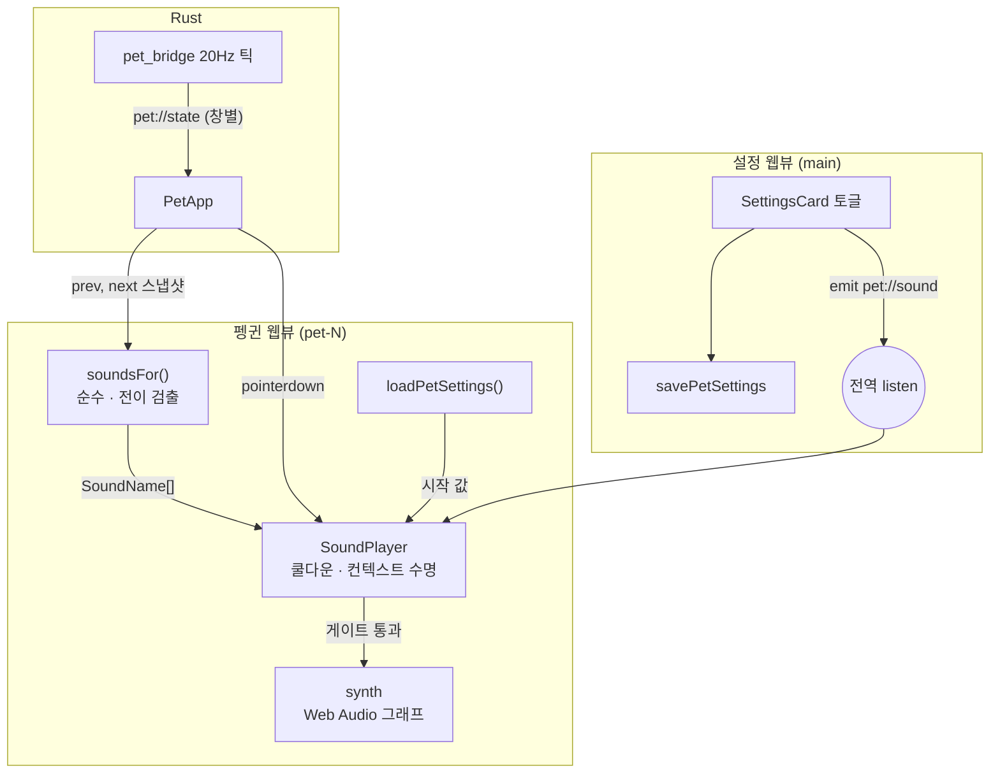
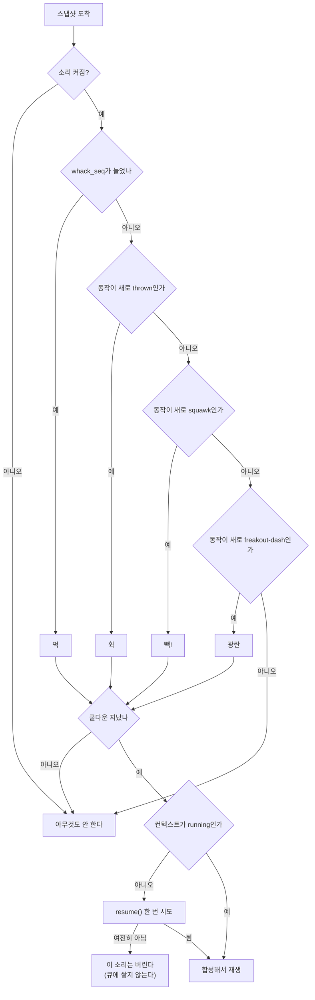

# feat: 효과음 — 켠 사람에게만, 자기가 한 짓에만

**Goal Capsule** — 설정에서 효과음을 켜면 펭귄이 **네 가지 상황에서만** 소리를 낸다:
때렸을 때(퍽), 날아갈 때(휙), 빽빽거릴 때(빽!), 발작할 때(광란). 음원 파일은
쓰지 않고 **Web Audio API로 그 자리에서 합성한다** — 번들이 0바이트 늘고 라이선스
표기가 필요 없다. 기본은 여전히 꺼짐(PRD Q6)이고, **Rust는 한 줄도 안 바뀐다**.

- **출처** — `TODO.md` F3의 마지막 미완료 항목("효과음 붙이기 (선택) — 소리를 켠
  경우에만. **PRD Q9(음원 소스·라이선스) 먼저**")과 2026-09-01 대화.
- **권위 순서** — `PRD > PRINCIPLE > CONVENTIONS > MOTIONS > 이 플랜`. 충돌하면
  상위가 이기고, 상위와 어긋나야만 구현이 되는 상황이면 **멈추고 보고한다.**
- **실행 프로필** — 브랜치 `feat/f3-sound-effects-01`. 전이 검출·쿨다운·음높이
  파생은 **실패 테스트 먼저**(순수 함수라 전부 vitest로 잡힌다). 신시사이저 자체는
  수동 검증. 커밋은 한국어 Angular 컨벤션, 유닛 하나 = 커밋 하나.
- **정지 조건** — (1) `AudioContext`가 어떤 제스처로도 `running`이 되지 않는다
  (KTD4의 전제가 깨진다), (2) 합성만으로 "펭귄 소리"로 안 들려서 음원 파일이
  필요해진다(Q9 재개봉 — 사용자 결정 사항), (3) 소리를 붙이려면 `pet.rs`를 고쳐야
  하는 상황이 나온다(KTD2가 깨진다).
- **꼬리 작업** — `.github/TEMPLATE/PR.md`로 PR을 열고 **merge는 하지 않는다.**
  `PRD.md`(Q9 확정)·`MOTIONS.md`·`TODO.md`·`CLAUDE.md` 갱신을 같은 PR에 넣는다.

---

## 요약

효과음 설정은 F1에서 만들어 놓고 **낼 소리가 없어서 비어 있었다.** 설정 창에는
아직도 "아직 낼 소리가 없어요"가 적혀 있다. 이 작업이 끝나면 그 문장이 사라지고,
켠 사람은 펭귄을 클릭하는 즉시 소리를 듣는다.

---

## 문제

### 왜 지금인가

`PRD.md` §9에 남은 오픈 퀘스천은 **Q9(효과음 음원 소스·라이선스)** 하나뿐이고,
`MOTIONS.md`의 "넣을 동작" 목록은 비어 있다. 효과음은 v3.0에서 마지막으로 남은
항목이다.

### 진짜 위험은 "무슨 소리를 만드나"가 아니라 "언제 내나"다

이 앱은 **상주 앱**이다. 하루 종일 켜 두는 것이 전제고, PRD §3의 목표 2가
"방해하지 않는다"다. 그런데 실측 빈도표(`MOTIONS.md` "빈도 설계")를 소리로
읽으면 상황이 분명해진다:

| 동작 | 실측 간격 | 시간당 |
|---|---|---|
| `Sprawl` 널브러짐 | 66초 | 55회 |
| `Land` 착지 | 71초 | 51회 |
| `Splat` 철푸덕 | 76초 | 47회 |

착지 세 갈래에 "쿵" 소리를 붙이면 **시간당 153번, 평균 24초에 한 번** 소리가 난다.
게다가 그 전부가 저절로 나온다(헤엄 끝의 자유낙하 90%). 그건 효과음이 아니라
고문이고, 켠 사람은 하루를 못 버티고 다시 끈다. **한 번 끄면 다시는 안 켠다.**

그래서 이 플랜의 중심은 신시사이저가 아니라 **소리를 낼 자격을 정하는 규칙**이다.

### 되돌아온 함정 하나

`AudioContext`는 Safari 11+ / WebKit에서 **사용자 제스처 없이는 `suspended` 상태로
시작한다.** Tauri의 웹뷰는 macOS에서 WKWebView이므로 그대로 해당한다. 펭귄 창은
항상 보이지만 **한 번도 클릭되지 않았을 수 있다** — 그 상태에서 첫 소리를 내려고
하면 조용히 실패한다.

---

## 요구사항

| ID | 요구사항 |
|---|---|
| R1 | 효과음 설정을 **끄면 어떤 상황에서도 소리가 나지 않는다.** 기본은 꺼짐이다 (PRD Q6) |
| R2 | 토글은 **즉시** 반영된다 — 이미 떠 있는 펭귄 전부에, 앱을 다시 띄우지 않고 |
| R3 | 켠 상태로 펭귄을 왼쪽 클릭하면 **즉시** 맞는 소리가 난다 (켰는데 조용하면 고장으로 읽힌다) |
| R4 | 펭귄이 날아갈 때(던지기·핀볼 타격) 소리가 난다 |
| R5 | 빽빽거릴 때 빽빽 소리가 난다 (PRD §5.5가 지목한 동작) |
| R6 | 발작할 때 광란 소리가 난다 (PRD §5.5) |
| R7 | **위 넷 말고는 소리를 내지 않는다.** 걷기·헤엄·착지·졸기·낚시·슬라이딩·굴러떨어지기는 무음이다 |
| R8 | 같은 소리가 연달아 겹쳐 기관총처럼 되지 않는다 |
| R9 | 음원 파일을 번들에 넣지 않는다 — 번들 크기가 늘지 않고 라이선스 표기가 필요 없다 |
| R10 | 소리는 마리마다 조금씩 다르게 들린다. 같은 펭귄은 늘 같은 목소리다 (PRINCIPLE 3 — 결정적) |
| R11 | 소리를 못 내는 상황(컨텍스트가 잠김)에서 **앱이 깨지지 않는다.** 그 소리는 조용히 버려진다 |

---

## 수용 예시

- **AE1** — 설정 창에서 효과음을 켠다. 창을 닫지 않고 펭귄을 한 번 클릭한다.
  → **곧바로** 퍽 소리가 나고 방망이가 휘둘러진다.
- **AE2** — 효과음이 켜진 채로 펭귄을 20번 연타한다. → 빽빽대기 시작하고,
  치는 동안 빽 소리가 나되 **클릭 한 번에 한 번 이하**로 난다 (붙어서 기관총이 되지 않는다).
- **AE3** — 효과음을 끈다. 펭귄을 클릭·연타·던지기 한다. → **아무 소리도 안 난다.**
- **AE4** — 효과음을 켜고 10분간 아무것도 건드리지 않는다. → 펭귄이 걷고 헤엄치고
  떨어져 널브러지는 동안 **한 번도 소리가 안 난다.**
- **AE5** — 펭귄을 세 마리로 늘리고 효과음을 켠다. 각각을 클릭한다. → 세 마리의
  소리 높이가 서로 다르다. 앱을 껐다 켜도 각 펭귄의 목소리는 그대로다.
- **AE6** — 핀볼 모드와 효과음을 함께 켠다. 펭귄을 채로 친다. → 날아가는 소리가
  나고 **방망이 소리(퍽)는 안 난다** (핀볼에서 방망이는 커서가 들고 있다).

---

## 핵심 기술 결정 (KTD)

### KTD1 — Q9 확정: 음원 파일을 쓰지 않고 Web Audio API로 합성한다

**결정.** `AudioContext`에 오실레이터·노이즈 버퍼·필터·게인 엔벨로프를 조립해
소리를 그 자리에서 만든다. `.wav`/`.mp3` 한 개도 레포에 넣지 않는다.

**왜 무료 라이선스 음원이 아닌가.** 이 앱은 **배포하지 않는 개인 도구**지만, 그게
라이선스를 무시해도 된다는 뜻은 아니다 — CC0가 아닌 음원은 출처 표기 의무가 남고,
그러면 표기를 어디에 둘지(설정 창? README?)와 그 표기를 누가 유지할지가 새로
생긴다. **아무 일도 하지 않는 앱에 유지보수 의무를 하나 만드는 것**이 이 결정의
진짜 비용이다. 반대편에서 합성이 주는 것은 셋이다: (1) 번들이 0바이트 늘고
`asset://`·파일 포맷·Safari의 OGG 미지원 같은 표면이 통째로 사라진다, (2) 파라미터를
값으로 흔들 수 있어 **마리마다 목소리를 다르게** 만들 수 있다(R10), (3) 소리 하나
고치는 데 오디오 편집기가 아니라 상수 한 줄이면 된다. 펭귄 빽빽 소리는 톱니파에
포먼트 필터 하나 물린 정도로 충분한 난이도라 합성 쪽 비용이 특히 낮다.

**합성으로 안 되면 어떻게 하나.** 만들어 놓고 "이건 펭귄이 아니라 삐 소리다"가
되면 그때 Q9를 다시 연다. **지금 선제적으로 음원 슬롯을 만들어 두지 않는다** —
쓰지 않을 추상은 `TODO.md`의 "쓰지 않게 된 다중 화면 좌표계"가 이미 보여 준 실패다.
후속 항목으로만 남긴다.

### KTD2 — 소리는 웹뷰가 통째로 소유한다. Rust는 한 줄도 안 고친다

`PRINCIPLE.md` 4는 **"Rust 코어는 무슨 동작·어디에, 웹뷰는 어떻게 보이는지"**로
상태의 주인을 나눈다. 소리는 "어떻게 들리는지"이고, 말풍선 문구가 웹뷰에 있는
것과 같은 부류다.

**결과가 검증 가능한 형태로 드러난다: 이 PR의 diff에 `src-tauri/`가 없다.**
새 커맨드도, `Snapshot` 새 필드도, `Look` 변경도 없다. 그래서 이 작업은
**커맨드 등록 누락**(`tauri-command-registration-silent-failure.md`)과 **`Look` 누락**
(핀볼에서 겪은 조용한 실패) 두 함정을 아예 지나가지 않는다.

핀볼 플래그는 왜 Rust에 있었는지가 대조군이다 — 그건 **물리를 바꾸므로** 코어가
알아야 했다. 소리는 아무것도 안 바꾼다.

### KTD3 — 소리를 낼 자격: "사용자가 방금 한 짓의 결과이거나, 시간당 한 번보다 드물거나"

`MOTIONS.md`의 실측 빈도표에 이 규칙을 그대로 적용한 결과가 아래다.

| 동작 | 시간당 | 사용자가 원인? | 판정 |
|---|---|---|---|
| **빠따 맞기**(`whack_seq`↑) | 친 만큼 | **예** | **소리 O — 퍽** |
| **날아가기**(`Thrown` 진입) | 던진 만큼 | **예** (던지기·핀볼 타격뿐) | **소리 O — 휙** |
| **빽빽거리기**(`Squawk`) | 스무 번 때려야 | **예** | **소리 O — 빽!** (PRD §5.5) |
| **발작**(`Freakout`) | **0.017회** (57시간에 한 번) | 아니오 | **소리 O — 광란** (PRD §5.5) |
| 널브러짐 `Sprawl` | 55회 | 대개 아니오 | ✕ |
| 착지 `Land` | 51회 | 대개 아니오 | ✕ |
| 철푸덕 `Splat` | 47회 | 대개 아니오 | ✕ |
| 슬라이딩 `Slide` | 36회 | 아니오 | ✕ |
| 돌기 `Turn` | 43회 | 아니오 | ✕ |
| 굴러떨어지기 `Tumble` | 19회 | 아니오 | ✕ |
| 걷기 `Walk` | 225회 | 아니오 | ✕ (발소리는 연속음이다) |
| 헤엄 `Swim` | 화면 점유 28.7% | 아니오 | ✕ |
| 졸기 `Sleep` | 11회 | 아니오 | ✕ (자는 건 사용자가 자리를 비웠을 때다) |
| 얼음낚시 `IceFishing` | 4회 (잡음은 ≈8회) | 아니오 | ✕ — 후속 |

**규칙의 근거는 둘이다.** 사용자가 방금 클릭했다면 그 소리는 **놀람이 아니라 응답**이고
(자기가 방아쇠를 당겼으니 준비가 돼 있다), 시간당 한 번보다 드문 소리는 **누적되지
않는다.** 그 사이에 있는 것 — 저절로 나면서 자주 나는 것 — 이 정확히 상주 앱을
망치는 구간이고, 착지 셋이 거기 한복판에 있다.

**착지에 소리를 안 붙이는 게 아깝게 느껴질 수 있다.** 실제로 널브러짐은 이 앱에서
가장 웃긴 그림 중 하나다. 하지만 그 웃김은 **가끔 봐서** 나오는 것이고, 소리는
안 보고 있어도 도달한다 — 눈은 감을 수 있지만 귀는 못 감는다. 화면을 안 보고
있을 때 24초마다 쿵 소리가 나는 앱은 끈다.

**얼음낚시는 가장 아까운 탈락이다** (15분에 한 번, 잡았을 때 소리는 딱 좋을 자리다).
후속으로 남긴다 — 이번 PR은 체크박스 하나짜리고, 잡음 소리는 시간당 8회라 위
규칙을 그대로 통과하지 못한다. 규칙에 예외를 만들려면 그 예외의 근거부터 따로 쓴다.

### KTD4 — `AudioContext`는 미리 만들고, 제스처마다 깨우고, 안 깨어나면 그 소리는 버린다

**제약(리서치).** Safari 11+ / WebKit은 사용자 제스처 밖에서 만든 `AudioContext`를
`suspended`로 시작시키고, `resume()`은 제스처 안에서만 확실히 성공한다. Tauri의
macOS 웹뷰는 WKWebView라 그대로 적용된다.

**Tauri 2.11.5에는 이 제약을 끌 방법이 없다.** wry 0.55.1은
`mediaTypesRequiringUserActionForPlayback`을 끄는 `autoplay` 속성을 갖고 있지만
(`wry/src/wkwebview/mod.rs:361`), **Tauri가 그 속성을 노출하지 않는다** —
`tauri-2.11.5/src/` 전체에 `autoplay`가 한 번도 안 나온다. 게다가 그 설정은
`<audio>`/`<video>` 요소를 다스리는 것이지 Web Audio를 다스리지 않는다. **우회로가
없으므로 우회를 설계하지 않는다.**

**그래서 이렇게 한다:**

1. 컨텍스트는 마운트 때 **미리** 만든다 (`suspended`여도 괜찮다).
2. 펭귄 창의 `pointerdown`마다 `resume()`을 시도한다 — 이미 있는 핸들러라 새
   리스너를 달지 않는다. 실패는 무시한다.
3. 소리를 낼 때 `state !== "running"`이면 **한 번 더 `resume()`을 시도하고, 그래도
   아니면 그 소리를 버린다.** 큐에 쌓지 않는다 — 3초 뒤에 도착하는 "퍽"은
   자기 손짓과 연결되지 않아 없느니만 못하다 (빽빽거리기를 스윙 뒤로 미루지 않은
   것과 같은 판단이다, `MOTIONS.md`).

**이 설계가 실제로 통하는 이유는 소리 넷의 성격에 있다.** 셋(퍽·휙·빽)은 **정의상
클릭 뒤에만 난다** — 소리가 필요한 시점에는 이미 제스처가 여러 번 지나갔다.
남은 하나인 발작은 57시간에 한 번이라, **클릭 한 번 없이 57시간을 버틴 세션**에서만
첫 발작이 조용하다. 그 경우를 위해 코드를 더 쓰지 않는다.

**설정 창에서 토글하는 것은 제스처로 안 쳐 준다** — 그건 `main` 창의 제스처고,
펭귄 창은 별개의 웹뷰다. 창마다 자기 컨텍스트를 스스로 깨워야 한다.

**배경 창 문제는 없다.** "macOS Safari를 최소화하면 `AudioContext`가 멈춘다"는
WebKit 버그 231105는 **2022-03에 수정됐다**(r291267). 펭귄 창은 늘 보이고 포커스만
없는 상태인데, 그건 수정 전에도 문제가 아니었다.

### KTD5 — 설정은 새 이벤트 `pet://sound`로 방송한다. `pet://settings`에 얹지 않는다

**두 개가 필요한 이유.** `pet://settings`는 **Rust가 보내는** 이벤트다 —
`pet_set_pinball`이 emit하고 페이로드가 `{ pinball }`이다. 소리는 Rust가 모르는
값이라 여기 얹으려면 (a) Rust에 소리 커맨드를 만들거나, (b) 페이로드를
`{ pinball, sound }`로 넓히고 **보내는 쪽마다 다른 절반이 `undefined`가 되는**
문제를 받는 쪽에서 매번 방어해야 한다. (a)는 KTD2를 깨고, (b)는 조용한 덮어쓰기
버그를 만든다.

**분리가 오히려 경계를 드러낸다**: `pet://settings`는 **Rust가 소유한 상태**의
브로드캐스트, `pet://sound`는 **웹뷰끼리의** 브로드캐스트다.

**프론트에서 직접 emit할 수 있고, capabilities도 이미 열려 있다.**
`core:event:default`(= `core:default`에 포함)가 `allow-emit`·`allow-emit-to`를
포함한다(`tauri-2.11.5/permissions/event/autogenerated/reference.md`). 그래서
`src-tauri/capabilities/default.json`도 **안 고친다.**

**받는 쪽은 전역 `listen()`이다** — `onPetSettings`와 같다. 전역 리스너는 대상을
`Any`로 등록해 emit 대상과 무관하게 전부 받는데
(`docs/solutions/best-practices/tauri-any-listener-receives-every-event.md`),
**여기서는 그게 결함이 아니라 원하는 성질이다**: 앱 전역 설정 하나를 여덟 마리가
전부 들어야 한다. `pet://state`가 창에 묶여야 하는 것과 정확히 반대의 이유다.

시작 시점의 값은 저장소에서 읽는다 — 펭귄 창은 이미 `loadTaunts()`로 같은 저장소를
읽고 있고, capabilities에 `store:default`가 `pet-*`까지 열려 있다.

### KTD6 — 여덟 마리는 여덟 번 운다. 대신 목소리가 다르다

**소리는 마리마다 난다.** 창마다 자기 스냅샷만 듣고 자기 컨텍스트로 재생하므로
이게 기본 동작이고, 굳이 막지 않는다 — 여덟 마리가 튀는 판에서 한 마리만 소리를
내면 어느 놈이 낸 소리인지 알 수 없다.

**겹침이 실제로 문제가 되지 않는 이유는 소리 넷이 전부 희소하기 때문이다.**
클릭 한 번은 한 마리만 맞히고, 빽빽거리기는 한 마리를 스무 번 때려야 나오고,
발작은 57시간에 한 번이다. **의도적으로 만들지 않으면 겹치지 않는다.**

**마리마다 음높이가 다르다** (R10). 창 라벨(`pet-<id>`)에서 결정적으로 파생한
반음 단위 오프셋을 쓴다 — `Math.random()`을 쓰지 않는다. PRINCIPLE 3("같은 시드에
같은 결과")이 소리에도 적용된다: 같은 펭귄은 앱을 껐다 켜도 같은 목소리여야
"그 펭귄"으로 읽힌다.

### KTD7 — 전이 검출은 `whack_seq`(수)와 동작 클래스(edge) 둘로 나눈다

스냅샷은 20Hz로 오지만 **겉모습이 바뀔 때만** emit된다(`should_notify`). 같은
동작이 이어지는 동안 소리를 다시 내면 안 되므로 **직전 스냅샷과 비교**한다.
`shouldRestart`가 이미 같은 자리에서 같은 일을 하고 있다.

| 소리 | 신호 | 왜 이 신호인가 |
|---|---|---|
| 퍽 | `whack_seq`가 **늘었다** | `Look`에 들어 있어 **모든** 빠따가 반드시 도달한다. 동작 클래스로 잡으면 `pg--swing`이 연타에서 안 갈리는 기존 버그(`TODO.md` 후속)에 같이 걸린다 |
| 휙 | 동작이 `thrown`이 **아니었다가 됐다** | 던지기와 핀볼 타격 둘 다 `Thrown`으로 들어간다 |
| 빽! | 동작이 `squawk`이 **아니었다가 됐다** | 판을 새로 열 때마다 클래스가 `squawk`→`dragged`→`squawk`으로 오간다 |
| 광란 | 동작이 `freakout-dash`가 **아니었다가 됐다** | 한 판에 `Dash`는 한 번뿐이다. `Pant`에는 안 붙인다 |

**퍽을 "휘둘렀다"가 아니라 "맞았다"로 잡는 것이 핵심이다.** `whack()`은 이미
빽빽거리는 중이면 스윙을 건너뛰고 판을 새로 여는데(`pet.rs:1317`), **그 경로에서도
`whack_seq`는 늘어난다**(증가가 그 검사보다 앞이다). 소리를 방망이에 묶으면 그
구간에서 소리와 그림이 갈라진다. **소리는 방망이가 아니라 충격의 것**이라고 보면
두 경우가 같은 규칙으로 설명된다 — 그리고 핀볼에서는 `whack_seq`가 안 늘어서
퍽이 저절로 빠진다(AE6). 규칙 하나가 세 경우를 다 맞힌다.

**전이 검출은 순수 함수다** — `soundsFor(prev, next): SoundName[]`. Web Audio가
전혀 안 들어가므로 jsdom에서 전부 테스트된다. 이 플랜에서 TDD가 실제로 붙는 곳이
여기다.

### KTD8 — 소리마다 최소 간격을 둔다 (R8)

빽빽거리기는 **때리는 동안 계속 판을 새로 연다**(`MOTIONS.md`). 클릭할 때마다
`squawk`→`dragged`→`squawk` 전이가 생기므로, 그대로 두면 초당 5~10발의 빽 소리가
난다. 그림은 그래도 되지만(애니메이션은 되감겨야 화가 이어진다) **소리는 아니다** —
같은 소리가 30ms 간격으로 겹치면 화난 펭귄이 아니라 고장난 스피커다.

**소리마다 쿨다운을 하나씩 둔다.** 마지막 재생 시각을 소리별로 기억하고, 간격이
안 됐으면 그 발음을 버린다.

| 소리 | 쿨다운 | 근거 |
|---|---|---|
| 퍽 | 70ms | 사람이 낼 수 있는 최고 연타 속도보다 짧다 — 정상 연타는 하나도 안 잘린다 |
| 휙 | 150ms | 소리 길이(≈180ms)의 대부분. 핀볼 랠리의 정상 간격보다 짧다 |
| 빽! | 400ms | 소리 길이(≈350ms)보다 길다. 연타 중에도 **끊기지 않고 이어지는 하나의 화**로 들린다 |
| 광란 | 1000ms | 한 판에 한 번이면 충분하다. 여유 있게 잡는다 |

**쿨다운도 순수 함수로 뺀다** — 시각을 인자로 받으면 시계 없이 테스트된다
(`pet.rs`가 `now_ms`를 받는 것과 같은 이유다).

### KTD9 — 마스터 게인은 0.12로 고정하고, 볼륨 슬라이더를 만들지 않는다

**소리 크기의 조절은 macOS 시스템 볼륨이 한다.** 설정을 하나 더 만들면
`PRINCIPLE.md` 5의 "설정 세 가지 말고는 아무것도 저장하지 않는다"에서 이미 넷이
된 목록이 다섯이 된다. 상주 앱의 설정은 늘릴수록 앱이 자기 얘기를 하게 된다.

**0.12(≈ -18 dBFS)의 근거는 사고 방지다.** 시스템 볼륨 100%에서 1.0으로 울리면
헤드폰을 낀 사람이 놀란다. -18 dBFS는 시스템 볼륨을 절반쯤 올려 둔 상태에서
"들리되 놀라지 않는" 구간이고, 더 듣고 싶으면 시스템 볼륨이 있다. 소리마다의
상대 크기는 이 게인 **아래에서** 정한다 — 마스터를 한 곳에 두면 나중에 전체를
줄일 때 한 줄이면 된다.

**엔벨로프에 어택을 준다.** 게인을 0에서 시작해 ~5ms 동안 올린다. 0이 아닌 값에서
바로 시작하면 클릭 노이즈("틱")가 나는데, 그게 실제로는 가장 거슬리는 소리다.

---

## 상위 설계

### 모듈 경계

### 클릭 한 번이 소리로 갈리는 지점

### 소리 넷의 합성 스케치

> 아래는 **방향 제시**이지 구현 명세가 아니다. 상수는 귀로 맞춘다.

| 소리 | 그래프 | 길이 |
|---|---|---|
| 퍽 | 화이트노이즈 버스트 → 로우패스(≈1.2kHz) + 저역 사인 "툭"(≈90Hz), 빠른 지수 감쇠 | ≈70ms |
| 휙 | 화이트노이즈 → 밴드패스, 중심주파수를 위로 훑는다(≈400 → 2.2kHz) | ≈180ms |
| 빽! | 톱니파(기본 ≈750Hz, 마리별 오프셋) → 밴드패스 포먼트 둘, 빠른 비브라토, 끝에서 살짝 내려앉는다 | ≈350ms |
| 광란 | 빽 소리를 짧게 줄여 5~7번, 음높이를 계단식으로 올리며 연달아 | ≈700ms |

---

## 구현 단위

### U1. 전이 검출과 게이트를 순수 함수로 만든다

- **요구사항**: R7, R8, R10 (KTD3, KTD7, KTD8)
- **의존**: 없음
- **파일**: `src/pet/sound.ts`(신규), `src/pet/sound.test.ts`(신규)
- **접근**: Web Audio를 **한 줄도 import하지 않는 순수 모듈**로 시작한다.
  - `SoundName = "whack" | "whoosh" | "squawk" | "freakout"`
  - `soundsFor(prev: PetSnapshot | null, next: PetSnapshot): SoundName[]` —
    KTD7의 표를 그대로 옮긴다. `prev`가 `null`(첫 스냅샷)이면 **빈 배열**이다:
    앱을 켜자마자 마침 빽빽거리는 중이었다고 소리를 내면 원인 없는 소리가 된다.
  - `Cooldowns` — 소리별 최소 간격 상수 표(KTD8)와
    `passesCooldown(name, lastAt: number | undefined, now: number): boolean`.
  - `voiceOffsetFor(label: string): number` — `pet-3`처럼 생긴 창 라벨에서 반음
    오프셋을 결정적으로 뽑는다. 라벨이 예상 밖이면 0(기준 음).
- **따를 패턴**: `src/lib/pet.ts`의 `behaviorClass`·`isOneShot`·`shouldRestart` —
  같은 자리에서 같은 종류의 판정을 이미 하고 있다. 이름·주석 밀도를 맞춘다.
- **실행 노트**: **실패 테스트 먼저.** 이 유닛이 이 PR에서 TDD가 실제로 값을 내는
  유일한 곳이다 — 나머지는 귀로 확인한다.
- **테스트 시나리오** (`src/pet/sound.test.ts`, 이름은 한국어):
  - `빠따를_맞으면_퍽이_난다` — `whack_seq`가 3 → 4.
  - `빠따_횟수가_그대로면_소리가_없다` — 말풍선만 바뀐 스냅샷.
  - `빽빽거리는_중에_또_맞아도_퍽이_난다` — `whack_seq`가 늘면 동작이 `squawk`
    그대로여도 퍽이다 (KTD7의 핵심 근거).
  - `핀볼_타격에는_퍽이_없다` — `whack_seq`는 그대로고 동작만 `thrown`이 된다
    → `["whoosh"]`뿐이다 (AE6).
  - `던지면_휙이_난다` / `던지는_중에는_다시_안_난다` — `thrown` → `thrown`.
  - `빽빽거리기가_새로_시작되면_빽이_난다` — `dragged` → `squawk`.
  - `발작은_돌진에서만_소리가_난다` — `freakout-dash`는 O, `freakout-pant`는 X.
  - `걷기_헤엄_착지_졸기에는_소리가_없다` — R7 회귀 가드. 널브러짐·철푸덕·착지·
    슬라이딩·굴러떨어지기·낚시 전 국면을 표로 돌려 **전부 빈 배열**임을 본다.
    **이 테스트가 이 PR에서 가장 중요하다** — 나중에 소리를 하나 더 붙일 때
    "왜 안 붙였는지"를 코드가 기억하는 자리다.
  - `첫_스냅샷에는_소리가_없다` — `prev`가 `null`.
  - `쿨다운_안에_다시_요청하면_버린다` / `쿨다운이_지나면_다시_난다`.
  - `같은_라벨은_늘_같은_음높이다` / `다른_펭귄은_음높이가_다르다` /
    `이상한_라벨이면_기준음이다`.
- **검증**: `npm test` 초록. `npm run build`로 타입 검사.

### U2. 신시사이저와 컨텍스트 수명을 붙인다

- **요구사항**: R9, R10, R11 (KTD1, KTD4, KTD9)
- **의존**: U1
- **파일**: `src/pet/sound.ts`(확장), `src/pet/synth.ts`(신규)
- **접근**:
  - `synth.ts` — `playWhack/playWhoosh/playSquawk/playFreakout(ctx, out, semitones)`.
    각 함수는 노드를 만들어 `out`(마스터 게인)에 물리고 스스로 `stop()` 예약까지
    한다. **`Math.random()`을 쓰지 않는다** (PRINCIPLE 3).
  - `sound.ts`에 `SoundPlayer` 클래스(또는 클로저)를 더한다:
    `new SoundPlayer(label)` → 컨텍스트와 마스터 게인(0.12)을 만든다.
    `setEnabled(on)` / `nudge()`(제스처에서 `resume()`) / `play(name, now)`.
    `play`는 꺼져 있으면 즉시 반환하고, 쿨다운을 보고, `state !== "running"`이면
    `resume()`을 한 번 시도한 뒤 그래도 아니면 **버린다**(KTD4).
  - **모듈 최상위에서 `new AudioContext()`를 하지 않는다.** jsdom에는 `AudioContext`가
    없어서 import만으로 테스트가 터진다. 생성은 전부 생성자 안에 두고,
    `AudioContext`가 없는 환경이면 **소리 없는 무해한 상태**로 남는다 (R11).
  - 모든 Web Audio 호출을 `try/catch`로 감싼다 — 소리 하나가 못 나는 것이 펭귄을
    멈추는 이유가 되면 안 된다.
- **따를 패턴**: `PetApp.tsx`의 방어적 `.catch(() => {})` 관용구 — 이 앱은 부수
  기능의 실패로 본체를 멈추지 않는다.
- **실행 노트**: **여기부터는 귀로 맞춘다.** 상수를 테스트로 못 박지 않는다 —
  `PINBALL_DAMPING`처럼 취향 상수이고, 값을 고정하면 소리를 다듬을 때마다 테스트가
  깨진다.
- **테스트 시나리오**:
  - `오디오가_없는_환경에서도_터지지_않는다` — jsdom(= `AudioContext` 없음)에서
    `SoundPlayer`를 만들고 `play`를 불러도 예외가 안 난다 (R11).
  - `꺼져_있으면_아무것도_재생하지_않는다` — 스텁 컨텍스트를 주입해
    `createOscillator`가 안 불렸음을 본다.
  - 신시사이저 그래프 자체: `Test expectation: none` — **소리의 옳고 그름은 귀가
    판정한다.** 파형 상수를 단언하면 테스트가 소리를 고치는 걸 막는 장치가 된다.
- **검증**: `npm test` + `npm run build`. 실제 소리 확인은 U3 뒤 수동 체크리스트.

### U3. 펭귄 창이 소리를 낸다

- **요구사항**: R1, R2, R3, R4, R5, R6 (KTD2, KTD4, KTD5)
- **의존**: U2
- **파일**: `src/pet/PetApp.tsx`, `src/pet/PetApp.test.tsx`, `src/lib/pet.ts`
- **접근**:
  - `lib/pet.ts`에 `EVENT_PET_SOUND = "pet://sound"`와
    `onPetSound(cb)`(전역 `listen`), `emitPetSound(on)`(전역 `emit`)을 더한다.
    **왜 전역 리스너인지**를 `onPetSettings` 바로 옆에 같은 밀도로 적는다 — 그
    주석이 없으면 다음 사람이 "창에 묶어야 하는 것 아닌가"를 다시 논의한다.
  - `PetApp`에 `SoundPlayer`를 `useRef`로 하나 둔다. 마운트 시
    `getCurrentWebviewWindow().label`로 만들고, `loadPetSettings()`로 초기값을
    걸고, `onPetSound`를 구독한다. 언마운트에서 컨텍스트를 닫는다.
  - **`onPetState` 콜백 안에서** 직전 스냅샷과 비교해 `soundsFor`를 부르고
    결과를 재생한다. 직전 스냅샷은 `useRef`에 둔다 — `lastClassRef`가 이미 같은
    자리에서 같은 일을 한다. **`useEffect`로 `snapshot` 변화를 보면 안 된다**:
    React가 렌더를 배칭하면 중간 스냅샷이 통째로 스킵돼 소리가 새거나 겹친다.
  - `handlePointerDown` 맨 앞에서 `player.nudge()`를 부른다 (KTD4의 제스처 해제).
    **우클릭 분기보다 앞이다** — 우클릭도 제스처다.
- **따를 패턴**: `PetApp.tsx`의 `lastClassRef`/`shouldRestart` 호출부, `snapshot.pinball`
  구독 방식.
- **함정**: 펭귄 창은 여덟 개까지 뜬다. `onPetSound`는 전역이라 **전부** 받는데
  그게 의도다(KTD6). 반면 `onPetState`는 지금처럼 창에 묶인 채로 둔다 — 여기를
  전역으로 바꾸면 남의 스냅샷으로 소리를 낸다.
- **테스트 시나리오** (`PetApp.test.tsx`):
  - `소리가_꺼져_있으면_재생을_시도하지_않는다` — `SoundPlayer`를 모킹하고
    저장된 설정이 꺼짐일 때 `play`가 안 불린다.
  - `설정_이벤트가_오면_즉시_반영된다` — `pet://sound` 방송 뒤 `setEnabled(true)`가
    불린다 (R2).
  - `스냅샷_전이마다_판정을_한_번씩_한다` — 스냅샷 세 개를 흘리면 `soundsFor`가
    직전 값과 함께 세 번 불린다 (중간 스냅샷을 안 흘린다).
  - `누르면_오디오를_깨운다` — `pointerdown`에서 `nudge()`가 불린다.
- **검증**: `npm test` + `npm run build`. `npm run tauri dev`로 실제 소리 확인.

### U4. 설정 창이 토글을 방송하고, "낼 소리가 없어요"를 걷어낸다

- **요구사항**: R1, R2 (KTD5)
- **의존**: U3
- **파일**: `src/App.tsx`, `src/components/SettingsCard.tsx`,
  `src/components/SettingsCard.test.tsx`, `src/App.test.tsx`
- **접근**:
  - `handleSoundEnabledChange`가 저장 **성공 뒤에** `emitPetSound(next)`를 부른다.
    저장이 실패하면 표시를 되돌리는 지금 흐름을 그대로 두고 방송도 안 한다 —
    "저장은 실패했는데 소리는 켜진" 상태를 만들지 않는다.
  - `SettingsCard`의 힌트를 **무엇이 들리는지**로 바꾼다. 예:
    "때리거나 던지면 소리가 나요. 빽빽거리기와 발작에도요. 걸어다닐 때는 조용해요."
    **마지막 절을 빼지 않는다** — 켜는 사람이 가장 알고 싶은 것은 "얼마나 시끄러워지나"다.
  - `App.tsx`의 `handleSoundEnabledChange` 주석("낼 소리는 F3에서 붙는다")을 고친다.
- **따를 패턴**: `handlePinballEnabledChange`의 "거는 것과 저장하는 것 둘 다,
  하나라도 실패하면 표시를 되돌린다" 규칙.
- **테스트 시나리오**:
  - `소리를_켜면_방송한다` (`App.test.tsx`) — `emitPetSound(true)`가 불린다.
  - `저장에_실패하면_방송하지_않는다` — 저장이 reject되면 emit이 안 불리고 표시가
    되돌아간다.
  - `소리만_저장해도_마릿수가_남는다` (`settings.test.ts`에 이미 같은 부류가 있으면
    확인만) — 읽고-고쳐-쓰기 회귀 가드.
  - `SettingsCard.test.tsx`의 기존 힌트 문구 단언이 있으면 새 문구로 갱신한다.
- **검증**: `npm test` + `npm run build`.

### U5. 문서를 맞춘다

- **요구사항**: R1~R11 (특히 Q9 확정)
- **의존**: U1~U4
- **파일**: `PRD.md`, `MOTIONS.md`, `TODO.md`, `CLAUDE.md`
- **접근**:
  - **`PRD.md` §9 Q9를 확정으로 닫는다** — "**직접 합성으로 확정** (Web Audio API).
    음원 파일을 쓰지 않아 라이선스·출처 표기가 없고 번들이 늘지 않는다" + 상태 `확정 ✅`.
    §5.5의 "빽빽거리기·발작에 효과음을 붙이되"를 **실제로 붙인 넷**으로 고친다.
    §5.1의 관련 서술과 §9 표의 오픈 퀘스천 개수를 맞춘다.
  - **`MOTIONS.md`에서 "소리 안 남" 서술 세 곳을 고친다** — `Squawk` 행의
    "**소리는 안 난다**"(67행 근처), 착지 절의 "소리는 내지 않는다"(84행 근처),
    빽빽거리기 절 끝의 "**소리를 내지 않는다.** … 음원은 Q9 미정이라"(277행 근처).
    마지막 것은 지우지 말고 **뒤집어서 남긴다**: 왜 착지에는 여전히 소리가 없는지
    (KTD3의 빈도 논거)가 그 자리에 있어야 다음 사람이 "착지에도 붙이자"를 처음부터
    논의하지 않는다. 효과음 절을 하나 만들어 KTD3의 판정표와 KTD4의 제스처 제약을
    옮긴다.
  - **`TODO.md`** — 효과음 체크박스를 체크하고 무엇을 붙이고 무엇을 뺐는지 한 줄로
    남긴다. 아래 "후속으로 미루는 것"을 후속 목록에 넣는다.
  - **`CLAUDE.md` "현재 상태"** — "남은 것은 **효과음**뿐이다"를 고친다. `PRD.md`에
    남은 오픈 퀘스천이 **없다**는 사실도 함께.
- **테스트 기대**: 없음 — 문서 변경이다.
- **검증**: `MOTIONS.md`를 처음부터 읽었을 때 "소리가 난다/안 난다"가 한 번도
  모순되지 않는다. `PRD.md` §9에 미정 항목이 남아 있지 않다.

---

## 범위 경계

### 넣지 않는 것 (비목표)

- **착지(통통·철푸덕·널브러짐)·걷기·헤엄·졸기·슬라이딩·굴러떨어지기·돌기의 소리.**
  KTD3의 판정표가 근거다. 붙이면 상주 앱이 시간당 200번 넘게 소리를 낸다.
- **볼륨 슬라이더**(KTD9)와 **소리별 on/off.** 설정은 늘리지 않는다.
- **음원 파일·`asset://`·오디오 코덱**(KTD1). 번들에 바이너리를 넣지 않는다.
- **Rust 변경 일체**(KTD2). 새 커맨드·`Snapshot` 필드·`Look` 변경이 없다.
- **말풍선 읽어 주기, 음성, BGM.** PRD에 근거가 없다.

### 후속으로 미루는 것 (`TODO.md`로 옮긴다)

- **얼음낚시 "잡았다" 소리** — KTD3에서 가장 아깝게 탈락했다. 15분에 한 번 나오는
  판이라 자리가 좋은데, 잡음 자체는 시간당 8회라 규칙을 그대로 통과하지 못한다.
  규칙에 예외를 두려면 그 근거를 따로 쓴다.
- **합성으로 안 되면 음원 파일** (KTD1의 탈출구). 만들어 보고 판단한다.
- **`pg--swing` 연타 되감기 버그** — 이미 `TODO.md`에 있다. 이번 PR은 소리를
  `whack_seq`로 잡아 그 버그를 **비껴간다**(KTD7). 고치는 것은 별건이다.
- **창이 다시 보일 때 컨텍스트 되살리기** — iOS WKWebView에서 보고된
  `visibilitychange` 우회법. 펭귄 창은 숨지 않으므로 지금은 불필요하다.

---

## 가정

- **효과음 넷이면 "붙였다"로 충분하다.** 틀리면 구현 전에 알려 달라 — 무엇을
  더 붙일지가 KTD3의 규칙에 예외를 만드는 일이라, 시작 전에 정하는 게 훨씬 싸다.
- **합성만으로 "펭귄"으로 들린다.** 실패하면 KTD1의 탈출구(Q9 재개봉)로 간다.
- 사용자는 macOS 26(Tahoe)에서 실행한다 — WebKit 231105(배경 창 오디오 중단)는
  이미 수정된 버전이다.

---

## 위험

| 위험 | 영향 | 완화 |
|---|---|---|
| `AudioContext`가 어떤 제스처로도 안 깨어난다 | 기능 전체가 조용히 죽는다 | U3 직후 **가장 먼저** 수동 확인한다(체크리스트 1번). 안 되면 **정지 조건**이다 — 우회를 즉흥으로 만들지 않고 보고한다 |
| 합성음이 "펭귄"이 아니라 "삐 소리"다 | 켜 놓을 이유가 없다 | 취향 상수를 테스트로 못 박지 않아 한 줄로 고칠 수 있게 뒀다(U2). 그래도 안 되면 Q9 재개봉 |
| 빽빽거리기 연타에서 소리가 겹쳐 지직댄다 | 가장 중요한 소리가 가장 나쁘게 들린다 | 쿨다운 400ms(KTD8) + 소리 길이 350ms. AE2가 이걸 본다 |
| 저절로 나는 소리를 하나 흘린다 | 상주 앱이 시끄러워진다 — 되돌리려면 사용자가 껐다가 다시는 안 켠다 | U1의 `걷기_헤엄_착지_졸기에는_소리가_없다`가 전 동작을 표로 돈다 |
| 여덟 마리가 동시에 운다 | 시끄럽다 | 소리 넷이 전부 희소해 의도적으로만 겹친다(KTD6). 마리별 음높이가 다르면 겹쳐도 뭉개지지 않는다 |
| 첫 프레임 클릭 노이즈("틱") | 모든 소리가 지저분해진다 | 5ms 어택 엔벨로프(KTD9) |
| jsdom에 `AudioContext`가 없어 테스트가 import만으로 터진다 | 러너가 통째로 빨개진다 | 최상위 생성 금지(U2). `오디오가_없는_환경에서도_터지지_않는다`가 가드 |

---

## 열린 질문

- **실제 상수 값들** — 주파수·길이·필터 Q·마스터 게인 0.12. 계산으로 못 정하고
  귀로 맞춘다 (구현 시점 미지수). 값 자체는 취향이라 테스트로 고정하지 않는다.
- **`resume()`이 `pointerdown`에서 즉시 성공하는지, 아니면 `pointerup`이어야 하는지.**
  WebKit이 "제스처 안"으로 인정하는 범위는 문서에 정확히 안 적혀 있다. 둘 다
  해 보고 되는 쪽을 쓴다.

---

## 검증 계약

| 게이트 | 명령 | 적용 |
|---|---|---|
| 프론트 단위 테스트 | `npm test` | U1~U4 |
| **타입 검사** | `npm run build` | U1~U4 (vitest는 타입을 안 본다) |
| Rust 단위 테스트 | `cd src-tauri && cargo test` | 전체 — **바뀐 게 없어도 돌린다**. 두 러너 규칙이고, 초록이라는 사실 자체가 KTD2("Rust 무변경")의 증거다 |
| 개발 스모크 | `npm run tauri dev` | U3 이후 |
| 코드 리뷰 | `ce-code-review` | PR 전 필수 |

### 수동 체크리스트

1. 효과음을 켜고 펭귄을 **한 번** 클릭한다 → **소리가 난다.** (KTD4의 제스처
   해제가 실제로 통하는지 — 이게 안 되면 정지 조건이다.)
2. 효과음을 끄고 클릭·던지기·연타를 한다 → **아무 소리도 안 난다** (AE3).
3. 다시 켠다 → **앱을 재시작하지 않고** 곧바로 소리가 난다 (AE1/R2).
4. 20번 연타한다 → 빽빽대고, 빽 소리가 **이어지는 하나의 화**로 들린다 (AE2).
   지직대지 않는다.
5. 세게 던진다 → 날아갈 때 휙 소리가 나고, **널브러질 때는 소리가 안 난다** (R7).
6. 10분간 방치한다 → 걷고 헤엄치고 떨어지고 자는 동안 **한 번도 소리가 안 난다** (AE4).
7. 펭귄을 세 마리로 늘리고 각각 클릭한다 → 목소리 높이가 서로 다르다.
   앱을 껐다 켜도 같은 펭귄은 같은 목소리다 (AE5).
8. 핀볼 모드를 함께 켜고 채로 친다 → 날아가는 소리가 나고 **퍽 소리는 안 난다** (AE6).
9. 설정 창의 "발작" 버튼을 누른다 → 광란 소리가 난다 (R6).
10. 팝오버를 닫는다 → **트레이 아이콘이 남아 있다** (과거에 실제로 깨졌다).

---

## 완료 정의

- R1~R11이 전부 동작하고, AE1~AE6을 실제로 재현했다.
- `npm test`·`npm run build`·`cargo test`가 모두 초록이다.
- **diff에 `src-tauri/`가 없다** (KTD2). 있으면 그 이유가 PR 본문에 있다.
- 전이 검출·쿨다운·음높이 파생은 **실패 테스트가 먼저 있는 커밋 이력**을 갖는다.
- `ce-code-review` 지적을 반영했거나, 반영하지 않은 것은 PR "비고"에 이유를 적었다.
- `PRD.md` §9에 미정 오픈 퀘스천이 **하나도 없다** (Q9가 마지막이었다).
- `MOTIONS.md`에 "소리를 내지 않는다"가 모순 없이 남아 있다 — 착지에 왜 안 붙였는지가
  적혀 있다.
- 수동 체크리스트 열 항목을 실제로 돌렸다.
- 브랜치 `feat/f3-sound-effects-01`, PR 템플릿으로 오픈. **merge는 사용자가 한다.**
