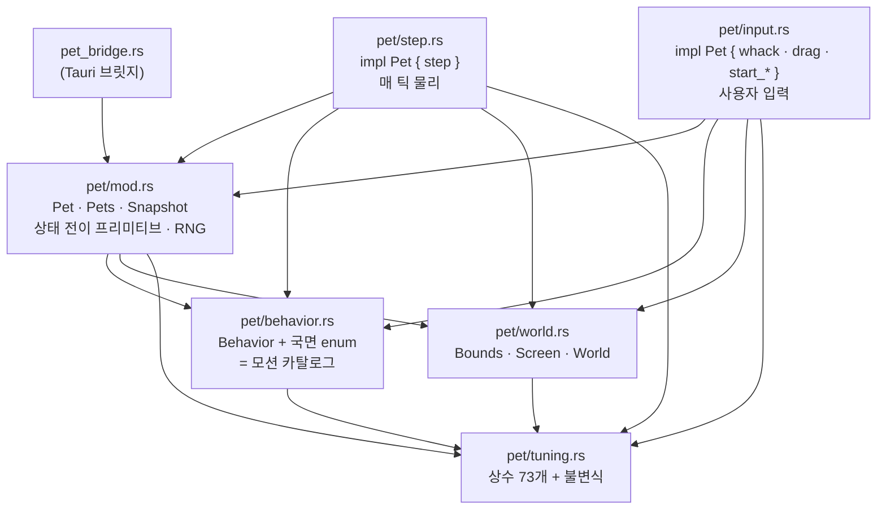

# pet.rs를 `pet/` 모듈로 쪼개기 — Plan

## Goal Capsule

- **목표** — `src-tauri/src/pet.rs`(4616줄)를 `src-tauri/src/pet/` 모듈 여섯 파일로 쪼갠다.
  **동작 변경 0의 순수 이동**이다. 근거는 `TODO.md` 체크박스
  "`pet.rs`가 2500줄을 넘었다 — 모션이 더 얹히기 전에 `world.rs`·`motion.rs`로 쪼갤지 판단"이고,
  이 플랜이 그 "판단"을 **쪼갠다**로 닫는다.
- **권위 순서** — `PRD > PRINCIPLE > CONVENTIONS > MOTIONS > 이 플랜`. 충돌하면 상위가 이기고,
  상위와 어긋나야만 구현이 되는 상황이면 멈추고 보고한다.
- **실행 프로필** — 브랜치 `refactor/pet-core-module-split-01`을 `main`에서 판다.
  커밋은 한국어 Angular 컨벤션, 유닛 하나가 커밋 하나. **TDD는 적용하지 않는다** —
  새 동작이 없으므로 쓸 새 테스트가 없고, 기존 테스트 206개가 그대로 회귀 그물이다.
- **정지 조건** — 아래 넷 중 하나라도 걸리면 멈추고 보고한다.
  1. 어느 유닛 끝에서든 `cargo test`의 **테스트 이름 집합이 기준선과 다르다** (개수 포함).
  2. 이동만 하려던 자리에서 로직을 고쳐야만 컴파일이 된다.
  3. `pub(super)`로 안 되는 가시성이 나와 `pub(crate)` 이상으로 열어야 한다 (KTD4 위반).
  4. `git diff -M`이 이동으로 안 읽혀 리뷰가 불가능한 크기의 diff가 나온다.
- **꼬리 작업** — `.github/TEMPLATE/PR.md`로 PR을 연다. `TODO.md` 체크 + 후속 항목 추가,
  `CLAUDE.md` 구조 섹션 갱신을 **같은 PR에** 넣는다. **merge는 사용자가 한다.**

---

## Product Contract

### Summary

이 작업이 끝나면 **다음 모션을 얹는 사람이 파일 하나만 열면 된다.** 지금은 모션 하나를
추가하려면 4616줄짜리 파일 안에서 상수·enum·`step`의 `match` 팔·진입 규칙을 스크롤로
찾아다녀야 한다. 끝나면 튜닝 값은 `tuning.rs`, 모션 카탈로그는 `behavior.rs`,
매 틱 진행은 `step.rs`, 사용자 입력은 `input.rs`에 있다.

사용자에게 보이는 변화는 **없다.** 펭귄은 같은 시드에 정확히 같은 행동을 한다.

### Problem Frame

`pet.rs`는 4616줄이고 그중 프로덕션이 1823줄, 인라인 테스트가 2793줄이다.
`impl Pet` 한 블록만 975줄이고 `step` 하나가 298줄이다.

`TODO.md`에는 아직 안 만든 모션이 넷 남아 있다 — 점프, 화면 가장자리 기대기,
창 위 올라앉기, 커서 쫓아다니기. **모션이 하나 늘 때마다 이 파일이 200~300줄씩 는다.**
지금 쪼개지 않으면 다음 넷을 얹은 뒤에는 6000줄에서 쪼개게 된다.

부수적으로 이 리팩토링은 **인접 결정 하나를 싸게 만든다.** `TODO.md`의
"쓰지 않게 된 다중 화면 좌표계를 걷어낼지 정한다"는 `World`/`Screen`의 죽은 일반화를
지울지 묻는데, 지금은 그게 얼마나 큰지 눈으로 볼 수가 없다. `world.rs`로 격리하면
파일 하나의 줄 수가 곧 답이 된다.

### Requirements

- **R1** — `src-tauri/src/pet.rs`가 사라지고 `src-tauri/src/pet/` 아래 여섯 파일이 그 자리를 대신한다.
- **R2** — `cargo test`의 **테스트 함수 이름 다중집합이 기준선과 완전히 같다**
  (206개, 중복 이름 포함). 모듈 경로 접두사는 바뀌어도 된다.
- **R3** — 프로덕션 코드에 **의미 변경이 없다.** 옮긴 코드의 본문은 문자 단위로 같고,
  바뀌어도 되는 것은 `use` 구문·가시성 한정자·모듈 문서 주석뿐이다.
- **R4** — `pet_bridge.rs`가 `crate::pet::{...}`로 가져오던 이름들을 **경로 변경 없이**
  그대로 쓴다 (`pet/mod.rs`가 재수출한다).
- **R5** — `src/pet/pet-css.test.ts`가 Rust 상수를 계속 찾아낸다 — 읽는 파일 목록에
  새 상수 파일이 추가돼 있다.
- **R6** — `CLAUDE.md`의 구조 트리가 새 파일 배치를 반영한다.
- **R7** — 모션 하나가 코드베이스의 **어느 일곱 자리**에 흩어져 있는지가
  `behavior.rs`의 모듈 문서로 남는다 (KTD6).

### Acceptance Examples

- **AE1** — 브랜치에서 `cd src-tauri && cargo test`를 돌리면 `205 passed; 0 failed; 1 ignored`가
  나온다. `main`에서 돌린 결과와 숫자가 같다.
- **AE2** — 아래를 돌리면 출력이 비어 있다 (테스트 이름 집합 불변):
  ```
  cargo test 2>&1 | grep -E '^test .+ \.\.\. ' | sed 's/^test //; s/ \.\.\..*//' \
    | awk -F'::' '{print $NF}' | sort | diff - test-names-before.txt
  ```
- **AE3** — `npm test`와 `npm run build`가 통과한다. 특히 `pet-css.test.ts`의
  "동작 길이 동기화" 블록이 초록이다 (상수를 못 찾으면 `not.toBeNull()`이 빨갛게 터진다).
- **AE4** — `npm run tauri dev`로 띄우면 펭귄이 걷고·헤엄치고·벽에서 굴러떨어지고,
  클릭하면 방망이를 휘두르고, 드래그해 던지면 날아가 착지한다. 설정 창의
  "동작 시켜보기" 버튼 넷이 전부 동작한다.
- **AE5** — `git diff -M --stat main...HEAD`가 파일 이동을 이동으로 표시하고,
  프로덕션 코드의 순증감이 0에 가깝다 (`use` 구문과 모듈 문서만큼만 는다).

### Scope Boundaries

**비목표 (이번 PR에서 하지 않는다)**

- **커스텀 모션·공유를 위한 확장점을 만들지 않는다.** 사용자가 모션을 만들어 공유하는
  기능은 (a) 모션을 Rust 제어 흐름에서 데이터로 바꾸는 별도 설계이고, (b) "공유"는
  PRD v3.0의 "사용자는 본인 1명, 배포 없음"과 PRINCIPLE 5의 "설정 말고는 저장하지 않는다"를
  동시에 건드려 **PRD 개정 여부부터 정해야 하는 사안**이다. 설계되지 않은 기능을 위해
  추상화를 미리 파는 것은 PRINCIPLE 1이 금지한 바로 그 논리다 — v1.0과 v2.0이 그렇게
  만들어졌고 둘 다 접혔다. 이번에 하는 대비는 **추상화가 아니라 인벤토리**다 (KTD6).
- **상수 값을 하나도 바꾸지 않는다.** 옮기기만 한다. 빈도 재조정은 이미 실측으로 닫힌
  항목이고(2026-09-01), 값이 바뀌면 R2의 회귀 그물이 무의미해진다.
- **로직을 "겸사겸사" 고치지 않는다.** 옮기다 발견한 개선점은 아래 Deferred로 간다.
- **`World`/`Screen`의 죽은 다중 화면 경로를 지우지 않는다** — 별도 체크박스다.
- **`pet_bridge.rs`(1643줄)·`src/pet/pet.css`(1693줄)를 쪼개지 않는다** — 체크박스가 없다.

**Deferred to Follow-Up Work** (PR 비고 + `TODO.md`에 옮긴다)

- `pet_bridge.rs`(1643줄)를 쪼갤지 판단 — 설정 저장·창 생성·핀볼 판·모니터 경계·
  20Hz 틱·커맨드 15개가 한 파일에 있다.
- `src/pet/pet.css`(1693줄)를 쪼갤지 판단 — `@keyframes` 67개, `animation` 78개인데
  CSS 커스텀 프로퍼티는 6개뿐이라 값이 전부 리터럴로 박혀 있다.
- **CSS 길이와 Rust 상수의 대조 범위를 넓힐지** — `pet-css.test.ts`가 대조하는 것은
  `animation` 78개 중 9개뿐이다. 나머지는 어긋나도 아무것도 실패하지 않는다.
- 커스텀 모션 기능의 PRD 개정 여부 — 위 비목표 참조.

---

## Planning Contract

### Key Technical Decisions

**KTD1 — `pet.rs` 한 파일 → `pet/` 디렉터리 여섯 파일.**
경계는 "무엇을 고치러 오는가"로 잘랐다.

| 파일 | 담는 것 | 프로덕션 대략 |
|---|---|---|
| `pet/tuning.rs` | 상수 73개 + `const _: () = assert!(...)` 불변식 | 255줄 |
| `pet/world.rs` | `Bounds`·`ScreenId`·`Screen`·`World` | 145줄 |
| `pet/behavior.rs` | `Behavior` + 국면 enum 7종 + `SASSY_KINDS`/`IDLE_KINDS` | 200줄 |
| `pet/mod.rs` | `Pet`·`Pets`·`Snapshot`·`Landing`, 상태 전이 프리미티브, RNG | 730줄 |
| `pet/step.rs` | `step` + 지상 이동 뒤처리 + 벽 판정 | 350줄 |
| `pet/input.rs` | `whack`·`flip`·`drag_*`·`start_*`·`say` | 200줄 |

`motion.rs`라는 이름은 **쓰지 않았다.** `TODO.md`가 그 이름을 제안했지만, 이 코드베이스에서
"모션"은 파일 하나에 담기는 것이 아니라 일곱 자리에 흩어진 것이다(KTD6). `motion.rs`를
만들면 그 이름이 "모션은 여기 다 있다"는 거짓말을 하게 된다. 대신 카탈로그는
`behavior.rs`, 매 틱 물리는 `step.rs`로 **하는 일**을 따라 이름 붙였다.

**KTD2 — `impl Pet`을 세 파일로 나눈다 (`mod.rs`·`step.rs`·`input.rs`).**
Rust는 같은 crate 안에서 inherent `impl`을 여러 모듈에 나눠 쓸 수 있고, **자식 모듈은
조상 모듈의 비공개 항목을 볼 수 있다.** 따라서 `pet/step.rs`의 `impl Pet`은
`pet/mod.rs`에 정의된 `Pet`의 비공개 필드에 그대로 접근한다 — 필드를 열 필요가 없다.

한 덩이로 두면 `mod.rs`가 여전히 1300줄이라 쪼갠 값이 절반으로 준다. 더 잘게 쪼개면
(모션마다 파일) 상태머신 한 흐름이 파일 경계로 끊겨 "걷다가 벽에 닿으면 어떻게 되나"를
읽는 데 파일 셋을 열어야 한다.

**KTD3 — 공유되는 상태 전이 프리미티브는 전부 `mod.rs`에 둔다.**
`step.rs`와 `input.rs`는 **형제**라서 서로의 비공개 메서드를 볼 수 없다.
`enter`·`enter_idle`·`enter_sassy`·`enter_swim`·`enter_slide`·`enter_freakout*`·
`enter_ice_fishing`·`enter_fishing*`·`enter_squawk`·`pick_next`·`clamp`·
`next_u64`/`fraction`/`range`는 양쪽이 모두 부르므로 `mod.rs`에 남긴다.
그러면 `pet` 모듈의 비공개 항목이 되어 **두 자식이 모두 별도 한정자 없이 본다.**

`step.rs`/`input.rs`에 `pub(super)`를 다는 대안은 버렸다 — 한정자가 붙는 순간
"이건 형제가 쓴다"를 사람이 기억해야 하고, 안 붙은 것과 붙은 것이 섞이면 다음 사람이
아무 데나 붙인다. 경계는 코드 배치로 강제하는 게 낫다.

**KTD4 — 가시성은 가장 좁게, `pub(super)`를 상한으로 둔다.**
상수는 `pet` 모듈 안에서만 쓰이므로 `pet/tuning.rs`에서 `pub(super)`로 낸다
(= `pet`에서 보이고, `pet`의 모든 자식에서도 보인다). **예외는 `PET_SIZE` 하나** —
`pet_bridge.rs`가 `pub use crate::pet::PET_SIZE;`로 재수출하므로 `pub`을 유지한다.
`pub(crate)`로 뭉뚱그리면 상수 73개가 crate 전체에 노출돼 브릿지가 코어 튜닝 값에
손댈 수 있게 된다 — PRINCIPLE 4의 "상태의 주인을 나눈다"가 코드로 지켜지지 않는다.

**KTD5 — `pet-css.test.ts`의 정규식은 안 고치고, 읽는 파일 목록만 늘린다.**
그 테스트는 `pub const ${name}: f64 = ...` / `const ${name}: u64 = ...`를 찾는데,
`pub(super) const SLIDE_MS: u64 = 2_400;`에도 `const SLIDE_MS: u64 = 2_400`이 부분
문자열로 들어 있어 **현재 정규식이 그대로 맞는다.** 고칠 것은
`readFileSync(resolve("src-tauri/src/pet.rs"))` → `pet/tuning.rs` 추가뿐이다.

이 테스트는 `docs/solutions/best-practices/tauri-command-registration-silent-failure.md`가
말하는 "조용한 실패" 부류를 막으려고 소스를 문자열로 읽는다. 상수가 이사 가면
파일 경로도 같이 이사해야 한다는 것이 이 방식의 대가이고, 다행히 단언이
`not.toBeNull()`이라 **놓치면 빨갛게 터진다** (조용히 통과하지 않는다).

**KTD6 — 커스텀 모션 대비는 "추상화"가 아니라 "인벤토리"로 한다.**
모션 하나(`Slide`)는 지금 일곱 자리에 흩어져 있다:

1. `Behavior` enum 배리언트
2. `step`의 `match` 팔 — 매 틱 물리
3. 진입 규칙 (`pick_next`의 확률)
4. 퇴장 규칙 (`hit_wall` 공유, `enter_idle`)
5. 튜닝 상수 (`SLIDE_MS`·`SLIDE_SPEED`·`SLIDE_AFTER_WALK_PERCENT`)
6. 프론트 — `src/lib/pet.ts`의 `behaviorClass` → `pg--slide` → `pet.css`의 `@keyframes`
7. `pet-css.test.ts`의 `ALL_BEHAVIORS` 목록

이 목록을 `behavior.rs`의 모듈 문서에 남긴다. **오늘 값을 한다** — 남은 모션 넷(점프·
기대기·창 위 올라앉기·커서 쫓기)을 얹을 때 빠뜨리는 자리를 없앤다. 그리고 커스텀
모션을 설계하게 되면 "이 일곱을 전부 데이터로 바꿔야 한다"가 그 설계의 첫 문장이 된다.

확장점(트레이트, 레지스트리, 서술자 구조체)은 **만들지 않는다.** 모양이 미결 질문에
달려 있고 — 서술자인가 코드인가, CSS는 누가 소유하나, PRINCIPLE 3의 결정성이 사용자
저작물에서 어떻게 살아남나 — 지금 찍으면 틀린 이음매와 원래 문제를 둘 다 갖게 된다.
이 레포에는 이미 그 청구서가 하나 있다: `World`/`Screen`의 다중 화면 일반화가
"언젠가 쓸 것"으로 들어와 지금 걷어낼지 정하는 항목으로 남아 있고 `TODO.md`가 그것을
"기계적 대공사"라고 부른다.

**KTD7 — 유닛마다 초록으로 끝나는 7커밋.**
한 커밋에 몰면 diff가 4000줄이라 리뷰가 불가능하고 `git`이 이동을 이동으로 읽지 못한다.
유닛 순서는 **의존성이 적은 잎부터**다 — `tuning`(아무것도 참조 안 함) →
`world`(상수만 참조) → `behavior`(상수만 참조) → `step`/`input`(전부 참조) → 문서.
그래야 각 커밋의 `use` 추가가 단방향이고, 중간에 막혀도 앞 커밋들이 온전하다.

### Assumptions

- **A1** — `pet.rs`의 인라인 테스트 169개는 대상별로 갈라진다고 가정한다. 실제로 열어 보면
  한 테스트가 `step`과 `whack`을 함께 검증할 수 있는데, 그런 테스트는 **쪼개지 않고**
  주 대상 쪽 파일에 통째로 둔다. 테스트를 쪼개면 R2가 깨진다.
- **A2** — 테스트 공용 헬퍼(`world()`·`pet()`·`drive()`·`핀볼_펫()`·`떨어뜨려_세기()` 등)를
  여러 모듈의 테스트가 함께 쓴다고 가정하고, `#[cfg(test)] pub(super) mod test_support`를
  `pet/mod.rs`에 둔다. 각 모듈의 `mod tests`가 `use super::super::test_support::*`로 가져온다.
  헬퍼가 실제로 한 모듈에서만 쓰이면 그 모듈에 남긴다.
- **A3** — `#[ignore]`된 테스트 1개도 이름 집합에 포함된다고 보고 세었다 (206 = 205 + 1).

**A1~A3이 틀리면 구현 전에 알려주세요** — 특히 A1은 유닛 U5·U6의 크기를 정한다.

### High-Level Technical Design

이동 후 모듈 의존 방향. **화살표는 `use`이고, 순환이 없다.**



`step.rs`와 `input.rs` 사이에 화살표가 **없는 것**이 KTD3의 요점이다 — 형제는 서로를
부르지 않고, 공유하는 것은 전부 `mod.rs`를 거친다.

---

## Implementation Units

### U1. `pet.rs`를 `pet/mod.rs`로 옮긴다

- **Goal** — 디렉터리 모듈로 전환한다. 내용은 한 글자도 안 바뀐다.
- **Requirements** — R1, R3
- **Dependencies** — 없음
- **Files** — `src-tauri/src/pet.rs` → `src-tauri/src/pet/mod.rs`
- **Approach** — `git mv`로 옮긴다(이동으로 기록돼야 이후 diff가 읽힌다).
  `lib.rs`의 `pub mod pet;`은 **그대로 둔다** — Rust 2018 이후 `pet/mod.rs`를 자동으로 찾는다.
  이 유닛에서 다른 것은 아무것도 하지 않는다. 순수 이동이 진짜로 초록인지 먼저 확인하는 것이
  이 유닛의 존재 이유다.
- **Test scenarios** — `Test expectation: none — 파일 이동만이라 새 동작이 없다.`
  기존 206개가 그대로 통과하는 것이 검증이다.
- **Verification** — `cargo test` = 205 passed / 1 ignored. AE2의 이름 diff가 비어 있다.

### U2. 상수를 `pet/tuning.rs`로 뺀다

- **Goal** — 튜닝 값을 만지러 갈 곳이 한 곳이 된다. (사용자 요청의 "상수 분리")
- **Requirements** — R1, R3, R5, KTD4, KTD5
- **Dependencies** — U1
- **Files**
  - 새로: `src-tauri/src/pet/tuning.rs`
  - 고침: `src-tauri/src/pet/mod.rs` (`mod tuning; use tuning::*;`)
  - 고침: `src/pet/pet-css.test.ts` (읽는 Rust 파일 목록에 `pet/tuning.rs` 추가)
- **Approach** — `mod.rs` 15~268줄의 상수 73개와 `const _: () = assert!(...)` 불변식 12개를
  통째로 옮긴다. **문서 주석을 같이 가져간다** — 이 파일의 주석이 값의 근거이고
  (측정치·계산·왜 그 값이 아니면 안 되는지) 그게 없으면 숫자 나열이 된다.

  가시성: 전부 `pub(super)`, **`PET_SIZE`만 `pub`** (브릿지가 재수출한다).
  `assert!` 불변식은 `tuning.rs` 안에서 서로를 참조하므로 함께 움직이면 그대로 컴파일된다.

  `pet-css.test.ts`는 지금 `pet.rs` + `pet_bridge.rs`를 이어 붙여 읽는다. 여기에
  `pet/tuning.rs`를 더한다. **정규식은 안 고친다** (KTD5) — `pub(super) const X: u64 = ...`에
  기존 패턴이 부분 문자열로 맞는다.
- **Test scenarios** — `Test expectation: none — 상수 값이 안 바뀌므로 새로 쓸 단언이 없다.`
  다만 **`pet-css.test.ts`가 이 유닛의 진짜 회귀 그물이다**: 파일 목록을 안 고치면
  `rustMs`/`rustConst`가 `null`을 반환해 `not.toBeNull()`이 터진다. 일부러 파일 목록을
  안 고친 상태로 `npm test`를 한 번 돌려 **빨간 것을 눈으로 확인한 뒤** 고친다.
- **Verification** — `cargo test` 불변(AE2). `npm test` 통과, 특히 "동작 길이 동기화"와
  `PET_SIZE` 대조 블록. `npm run build` 통과.

### U3. `World`·`Screen`·`Bounds`를 `pet/world.rs`로 뺀다

- **Goal** — 좌표계가 자기 파일을 갖는다. 죽은 다중 화면 경로의 크기가 눈에 보인다.
- **Requirements** — R1, R2, R3, R4
- **Dependencies** — U2 (`PET_SIZE`를 참조한다)
- **Files**
  - 새로: `src-tauri/src/pet/world.rs`
  - 고침: `src-tauri/src/pet/mod.rs` (`mod world; pub use world::{Bounds, Screen, ScreenId, World};`)
- **Approach** — `mod.rs` 470~612줄(`Bounds`·`ScreenId`·`Screen`+`impl`·`World`+`impl`)을 옮긴다.
  `Screen::anchor_area`가 `PET_SIZE`를 쓰므로 `use super::tuning::PET_SIZE;`가 필요하다.

  **`mod.rs`에서 `pub use`로 재수출한다** — `pet_bridge.rs`가
  `use crate::pet::{... Bounds ... World ...}`로 가져오고 있어(18줄) 재수출이 없으면
  브릿지를 고쳐야 한다. R4가 그것을 막는다.

  `World`/`Screen`의 테스트(`screen_at`·`nearest`·`screen_for_x`·`anchor_area` 관련)를
  `world.rs`의 `mod tests`로 함께 옮긴다.
- **Test scenarios** — `Test expectation: none — 이동만이다.` 옮긴 테스트가 새 위치에서
  그대로 통과하는 것이 검증이다. 이름은 하나도 바꾸지 않는다.
- **Verification** — `cargo test` 불변(AE2). `pet_bridge.rs`를 **한 글자도 안 고치고**
  컴파일되는지 확인한다 — 고쳐야 했다면 재수출이 빠진 것이다.

### U4. `Behavior`와 국면 enum을 `pet/behavior.rs`로 뺀다 — 모션 카탈로그

- **Goal** — "이 앱에 어떤 모션이 있나"의 답이 파일 하나가 된다. **모션 인벤토리(KTD6)를
  모듈 문서로 남긴다.**
- **Requirements** — R1, R2, R3, R4, R7
- **Dependencies** — U2
- **Files**
  - 새로: `src-tauri/src/pet/behavior.rs`
  - 고침: `src-tauri/src/pet/mod.rs` (재수출)
- **Approach** — `mod.rs` 272~469줄을 옮긴다: `Facing`+`impl`, `Speech`, `Vertical`,
  `IdleKind`, `SassyKind`, `FishingPhase`, `FreakoutPhase`, `SASSY_KINDS`, `IDLE_KINDS`,
  `Behavior`+`impl`(`moves_window`·`is_landing`·`is_airborne`).

  `pet_bridge.rs`가 `Behavior`·`Facing`·`Vertical`을 쓰고 테스트에서 `IdleKind`·`SassyKind`도
  쓰므로(1428줄) **전부 `pub use`로 재수출한다.**

  **모듈 문서에 KTD6의 일곱 자리 목록을 적는다.** 이것이 R7이고, 이 유닛에서 유일하게
  "이동이 아닌" 산출물이다. 형식은 기존 모듈 문서(`//!`)를 따르고, `Slide`를 예로 든다.
- **Test scenarios** — `Test expectation: none — 이동 + 문서다.`
- **Verification** — `cargo test` 불변(AE2). `pet_bridge.rs` 무변경 컴파일.
  `behavior.rs`의 모듈 문서를 읽고 **일곱 자리가 실제 코드와 맞는지** 눈으로 대조한다
  (예: `Slide`로 `grep`해서 일곱 곳이 나오는지).

### U5. `step`과 지상 이동 뒤처리를 `pet/step.rs`로 뺀다

- **Goal** — 매 틱 물리가 자기 파일을 갖는다. `mod.rs`에서 298줄짜리 `match`가 빠진다.
- **Requirements** — R1, R2, R3, KTD2, KTD3
- **Dependencies** — U3, U4
- **Files**
  - 새로: `src-tauri/src/pet/step.rs`
  - 고침: `src-tauri/src/pet/mod.rs`
- **Approach** — `impl Pet`에서 넷을 옮긴다: `step`, `after_ground_move`, `hit_wall`, `get_up`.
  `step.rs`에 `impl Pet { ... }` 블록을 새로 연다 — **`Pet`의 비공개 필드에 그대로
  접근된다** (자식 모듈이므로, KTD2). 컴파일이 이걸 증명한다.

  **나머지 `enter_*`·`pick_next`·`clamp`·RNG는 `mod.rs`에 남긴다** (KTD3) —
  `input.rs`도 부르기 때문이다. 이 유닛에서 "step이 부르니까 같이 옮기자"의 유혹이
  가장 크고, 넘어가면 U6에서 형제 간 가시성 문제로 되돌아와야 한다.

  걷기·벽 반응·굴러떨어지기·슬라이딩·헤엄 종료·착지 등급·빈도 측정 테스트를
  `step.rs`의 `mod tests`로 옮긴다. 공용 헬퍼는 A2대로 `test_support`로 뺀다.
- **Test scenarios** — `Test expectation: none — 이동만이다.` 옮긴 테스트의 **이름을
  하나도 바꾸지 않는다** (R2).
- **Verification** — `cargo test` 불변(AE2). `mod.rs`의 줄 수가 눈에 띄게 준다.

### U6. 사용자 입력 메서드를 `pet/input.rs`로 뺀다

- **Goal** — "사용자가 뭘 하면 어떻게 되나"가 자기 파일을 갖는다.
- **Requirements** — R1, R2, R3, KTD2, KTD3
- **Dependencies** — U5
- **Files**
  - 새로: `src-tauri/src/pet/input.rs`
  - 고침: `src-tauri/src/pet/mod.rs`
- **Approach** — `impl Pet`에서 옮긴다: `whack`, `flip`, `drag_start`, `drag_by`, `drag_end`,
  `say`, `start_squawk`, `start_fishing`, `start_slide`, `start_freakout`.
  `throw_max_speed`·`clamp_throw`(자유 함수)도 `drag_end`·`flip`만 쓰므로 함께 옮긴다.

  **KTD3의 시험대다** — `input.rs`가 `mod.rs`의 비공개 `enter`·`enter_squawk`·
  `enter_ice_fishing`·`enter_slide`·`enter_freakout`·`enter_sassy`·RNG를 부르는데,
  전부 조상 모듈의 항목이라 한정자 없이 보여야 한다. 여기서 `pub(super)`를 붙여야만
  컴파일된다면 KTD3의 배치가 틀린 것이니 **정지 조건 3**에 걸린다.

  빠따·연타 빽빽거리기·드래그 던지기·핀볼 채 타격·"동작 시켜보기" 관련 테스트를
  `input.rs`의 `mod tests`로 옮긴다.
- **Test scenarios** — `Test expectation: none — 이동만이다.`
- **Verification** — `cargo test` 불변(AE2). `mod.rs`·`step.rs`·`input.rs` 어디에도
  `pub(super) fn`이 새로 생기지 않았는지 확인한다.

### U7. 문서를 맞춘다

- **Goal** — 다음 사람이 트리를 보고 파일을 찾는다. 체크박스가 닫히고 후속이 남는다.
- **Requirements** — R6
- **Dependencies** — U6
- **Files** — `CLAUDE.md`, `TODO.md`
- **Approach**
  - `CLAUDE.md` 구조 트리의 `pet.rs` 한 줄을 `pet/` 여섯 파일로 바꾼다. **한 줄 설명에
    "무엇을 고치러 오는가"를 적는다** — 트리가 이름만 나열하면 결국 열어 봐야 한다.
  - `CLAUDE.md` "현재 상태"에 이 리팩토링을 한 줄 추가한다.
  - `TODO.md`의 `pet.rs` 체크박스를 체크하고 **결과를 적는다** (판단 결과 + 최종 배치).
  - `TODO.md` 후속에 Deferred 넷을 추가한다 (`pet_bridge.rs`, `pet.css`,
    CSS↔Rust 대조 범위, 커스텀 모션 PRD 개정 여부).
  - **`CLAUDE.md` 함정 목록은 건드리지 않는다** — 새 함정이 나오지 않았다면. 나왔다면
    `docs/solutions/`에 먼저 쓰고(`ce-compound`) 한 줄 링크만 추가한다.
- **Test scenarios** — `Test expectation: none — 문서다.`
- **Verification** — 트리의 파일 경로가 실제로 존재하는지 하나씩 확인한다.
  `TODO.md`에서 이번 PR이 만든 후속 항목이 전부 보인다.

---

## Verification Contract

| 게이트 | 명령 | 적용 유닛 |
|---|---|---|
| Rust 단위 테스트 | `cd src-tauri && cargo test` → `205 passed; 1 ignored` | U1~U6 **매 유닛** |
| 테스트 이름 불변 | AE2의 `diff` 파이프라인이 빈 출력 | U1~U6 **매 유닛** |
| 프론트 단위 테스트 | `npm test` | U2, U7 |
| 타입 검사 | `npm run build` | U2, U7 |
| 개발 스모크 | `npm run tauri dev` → AE4 | U6 이후 1회 |
| 이동 확인 | `git diff -M --stat main...HEAD` | PR 직전 |
| 코드 리뷰 | `ce-code-review` | PR 직전 (필수) |

**기준선 파일을 먼저 만든다.** `main`에서:

```
cargo test 2>&1 | grep -E '^test .+ \.\.\. ' | sed 's/^test //; s/ \.\.\..*//' \
  | awk -F'::' '{print $NF}' | sort > <스크래치패드>/test-names-before.txt
```

206줄이 나온다. 이 파일은 **커밋하지 않는다** — 스크래치패드에 둔다.

번들 빌드(`npm run tauri build`)는 **돌리지 않는다** — 알림·플러그인 변경이 없다.

---

## Definition of Done

- [ ] R1~R7 충족, AE1~AE5 재현 확인
- [ ] `cargo test` 205 passed / 1 ignored, **테스트 이름 다중집합이 기준선과 동일**
- [ ] `npm test` + `npm run build` 통과
- [ ] `npm run tauri dev` 스모크 — AE4의 동작이 전부 나온다
- [ ] `pet_bridge.rs`가 **무변경** (재수출로 흡수됐다는 증거)
- [ ] 프로덕션 코드 순증감이 `use` 구문과 모듈 문서만큼 (`git diff -M --stat`)
- [ ] 새로 생긴 `pub(crate)`·`pub(super) fn`이 없다 (KTD3·KTD4)
- [ ] `behavior.rs` 모듈 문서에 모션 일곱 자리 인벤토리가 있다 (R7)
- [ ] `CLAUDE.md` 구조·현재 상태 갱신, `TODO.md` 체크 + 후속 넷 추가 — **같은 PR에**
- [ ] `ce-code-review` 지적 반영 후 두 러너 재실행
- [ ] `.github/TEMPLATE/PR.md`로 PR 오픈, 비고에 Deferred 명시 — **merge는 사용자**
