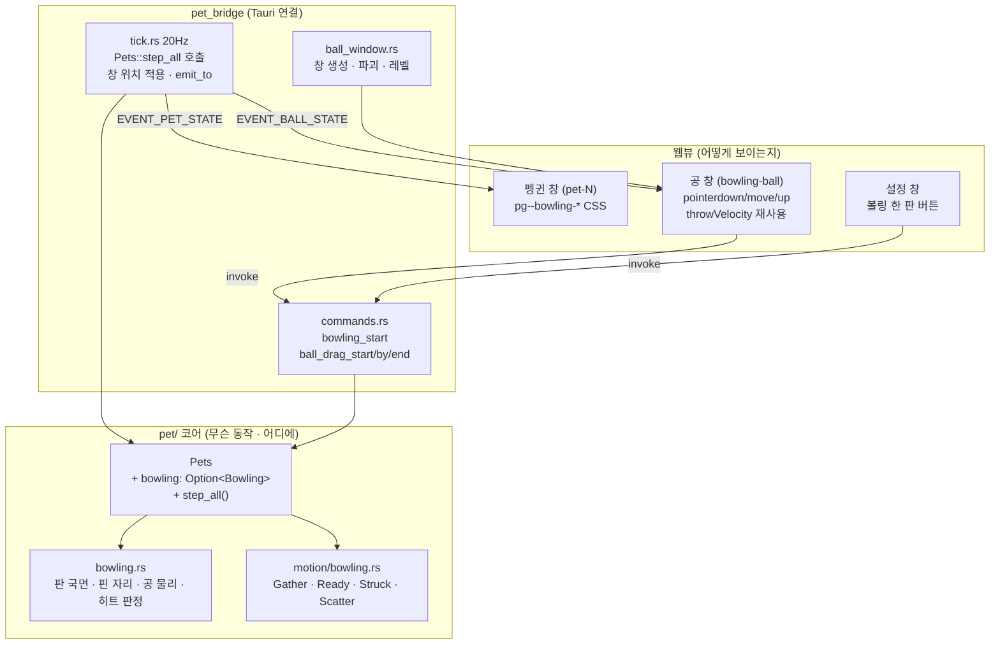
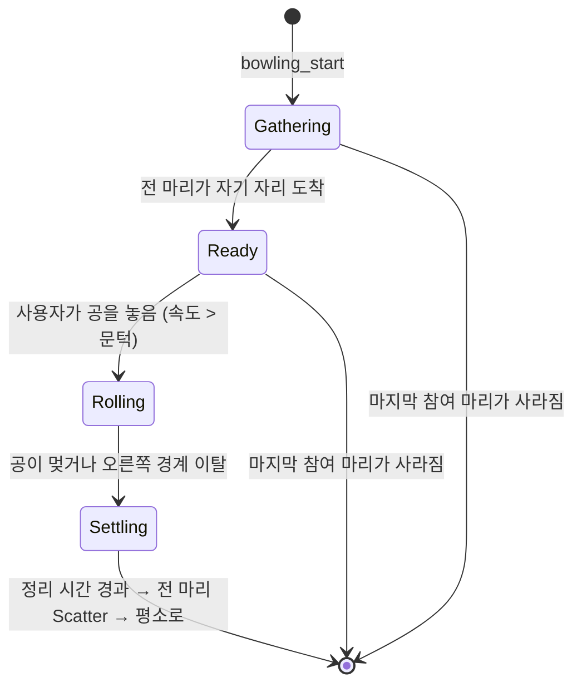

# 볼링 — 펭귄이 핀이 되고 사용자가 공을 굴린다

## Goal Capsule

- **목표** — 설정 창에서 볼링을 시작하면 화면의 펭귄 전부가 **걸어가서** 바닥 오른쪽에 한 줄로
  선다. 다 서면 왼쪽에 공이 놓이고, 사용자가 그 공을 마우스로 집어 **수평으로** 굴린다. 드래그
  세기가 공 속도를 정한다. 공이 지나간 펭귄은 빙글빙글 돌고, 공이 멎거나 화면을 벗어나면 판이
  끝나 전부 평소로 돌아간다. 근거: PRD에 **§5.9로 새로 추가**한다 (§4·§5.8은 고치지 않는다 —
  KTD9 참고).
- **권위 순서** — `PRD > PRINCIPLE > CONVENTIONS > MOTIONS > 이 플랜`. 충돌하면 상위가 이기고,
  상위와 어긋나는 구현이 필요해지면 멈추고 보고한다.
- **실행 프로필** — **PR 셋으로 나눈다** (2026-09-02 사용자 지시). 이 플랜은 그중 둘을 담는다.
  - **PR 1** = U1. 브랜치 `refactor/pets-step-layer-01`. 동작 변화 0인 리팩터링.
  - **PR 2** = U2~U9. 브랜치 `feat/bowling-01`. PR 1 머지 뒤에 시작한다.
  - **PR 3** = 핀볼 모드에서 마리끼리 부딪히기. **이 플랜 밖**이고 별도 플랜을 쓴다.
    PR 1의 이음매를 볼링과 공유하므로 **PR 2와 병렬로** 갈 수 있다 (worktree 권장).
  - TDD는 코어(`src-tauri/src/pet/`)의 상태 전이·경계 판정에 적용한다. 테스트 이름은 한국어.
    커밋은 한국어 Angular 컨벤션, 유닛 하나가 커밋 하나.
- **정지 조건** — 아래 중 하나라도 걸리면 멈추고 보고한다.
  - U1이 골든 테스트(`같은_시드는_같은_동작_시퀀스를_낳는다`)를 깨뜨린다 → 리팩터링이 동작을
    바꿨다는 뜻이다. 되돌리고 원인부터 찾는다.
  - U6 스모크에서 **공을 끄는 동안 포인터가 펭귄 창을 지나면 드래그가 끊긴다** → KTD5의 전제가
    틀렸다. 대안(`set_ignore_cursor_events`)은 이 레포에 선례가 없으므로 진행 전에 보고한다.
  - 핀 대형·공 굴리기가 화면 하나에 안 들어간다(세계가 너무 좁다) → 상수로 못 푸는 문제다.
  - PRD·PRINCIPLE과 어긋나야만 구현이 가능해진다.
- **꼬리 작업** — `.github/TEMPLATE/PR.md`로 PR을 연다. **merge는 사용자가 한다.** PR 2에
  `PRD.md`(§5.9 신설)·`MOTIONS.md`(볼링 절)·`TODO.md`(대청소 + 볼링 항목)를 같이 넣는다.

---

## Product Contract

### Summary

작업이 끝나면 사용자는 설정 창에서 **"볼링 한 판"**을 눌러 이렇게 할 수 있다. 화면에 있던
펭귄들이 하던 짓을 멈추고 뒤뚱뒤뚱 오른쪽으로 걸어가 한 줄로 선다. 다 서면 왼쪽 바닥에 공이
하나 툭 놓인다. 그 공을 마우스로 집어 오른쪽으로 뿌리면 세기만큼 굴러가고, 지나가는 펭귄마다
빙글빙글 돌아버린다. 공이 멎으면 펭귄들이 흩어져 아무 일 없었다는 듯 다시 걷는다.

### Problem Frame

지금 사용자가 펭귄 여럿에게 한꺼번에 할 수 있는 일이 없다. 마릿수를 8까지 늘릴 수 있는데
여덟 마리가 각자 따로 걷기만 한다 — **마릿수가 늘어도 재미가 마릿수만큼 늘지 않는다.**
핀볼 모드가 "여덟 마리가 동시에 튄다"로 이 문제를 처음 건드렸지만 거기서도 펭귄들은 서로를
모른 채 각자 튄다. 볼링은 **여러 마리가 하나의 사건에 함께 참여하는 첫 동작**이다.

동시에 이건 미뤄 둔 부채를 갚는다. `TODO.md`의 "핀볼 모드에서 마리끼리 부딪히기"가 막혀 있던
이유가 정확히 "펭귄들이 서로를 모른다"인데, 볼링이 그 이음매를 요구한다.

### Requirements

| ID | 요구사항 |
|---|---|
| R1 | 설정 창에서 볼링을 시작하면 **화면의 펭귄 전부**가 참여한다. 우클릭한 한 마리가 아니다 |
| R2 | 펭귄들은 순간이동하지 않고 **걸어서** 자기 핀 자리로 간다 |
| R3 | 핀 자리는 바닥 오른쪽에 **한 줄**로, 마리 수(1~8)만큼 만들어진다. 마릿수를 앱이 바꾸지 않는다 |
| R4 | 전부 자리에 서면 바닥 왼쪽에 공이 나타난다. 다 서기 전에는 나타나지 않는다 |
| R5 | 공은 마우스로 집어 끌었다 놓으면 굴러간다. **속도는 놓는 순간의 드래그 세기**가 정하고, 세계 폭에 비례한다 |
| R6 | 공은 **수평으로만** 굴러간다. 조준 각도가 없다 |
| R7 | 공이 지나간 펭귄은 빙글빙글 돌고, 공은 속도를 잃으며 계속 간다 |
| R8 | 공이 멎거나 오른쪽 끝을 벗어나면 판이 끝난다. 펭귄들은 흩어져 평소 동작으로 돌아간다 |
| R9 | 점수·프레임·스트라이크·쓰러뜨린 마릿수를 **세지도 보여주지도 않는다** |
| R10 | 판이 도는 동안에도 사용자는 펭귄을 클릭·드래그할 수 있다. 화면을 덮지 않는다 |
| R11 | 판이 도는 중에 펭귄을 추가·삭제하거나 앱을 끄면 판이 깨지지 않고 정리된다 |
| R12 | 같은 시드에 같은 결과가 나온다 — 공 물리와 핀 자리 배정은 코어가 정한다 |

### Acceptance Examples

**AE1 — 한 판이 도는 전 과정**
Given 펭귄 3마리가 화면에 있고 볼링이 꺼져 있다
When 설정 창에서 "볼링 한 판"을 누른다
Then 세 마리가 걷는 자세로 오른쪽으로 이동해 바닥에 한 줄로 서고(대략 2~4초), 전부 선 뒤에
왼쪽 바닥에 공이 나타난다.
When 공을 오른쪽으로 세게 뿌린다
Then 공이 수평으로 굴러가 세 마리를 차례로 지나가고, 지나간 순서대로 각각 돌기 시작한다.
공이 멎으면 1초쯤 뒤 펭귄들이 흩어져 걷기·유휴로 돌아간다.

**AE2 — 한 마리일 때**
Given 펭귄이 1마리다
When 볼링을 시작한다
Then 그 한 마리가 오른쪽에 서고 공이 왼쪽에 놓인다. 1핀 볼링이 되고 오류나 안내 문구는 없다.

**AE3 — 살살 굴리면 못 닿는다**
Given 핀이 다 서고 공이 놓였다
When 공을 아주 살짝만 민다
Then 공이 조금 가다 멎고, 아무 펭귄도 맞지 않은 채 판이 끝난다. 재시도 버튼은 없다 — 다시
하려면 "볼링 한 판"을 다시 누른다.

**AE4 — 판 도중 펭귄 삭제**
Given 3마리가 핀으로 서 있다
When 그중 한 마리를 우클릭해 삭제한다
Then 남은 두 마리는 그대로 서 있고 판은 계속 돈다. 지운 마리의 핀 자리는 비고, 공은 그 자리를
그냥 지나간다. 크래시·패닉이 없다.

**AE5 — 판이 화면을 막지 않는다**
Given 판이 돌고 있다(핀이 서 있거나 공이 굴러가는 중)
When 바탕화면의 다른 앱을 클릭한다
Then 그 앱이 정상으로 반응한다. 볼링은 화면을 덮는 창을 만들지 않는다.

### Scope Boundaries

**비목표 (PRD §4 근거)**

- **점수·프레임·스트라이크·목숨** — §4의 게임화 비목표를 그대로 지킨다 (R9).
- **조준** — 각도를 주는 순간 "잘 맞히려고" 보게 된다. 수평 고정이다 (R6).
- **핀이 물리적으로 쓰러져 서로를 치는 것** — 맞은 펭귄은 그 자리에서 돌 뿐 옆 펭귄을 밀지
  않는다. 그건 "마리끼리 부딪히기"의 일이고 다른 PR이다.
- **효과음** — 아래 Deferred 참고.
- **화면을 덮는 판 창** — 볼링은 핀볼 판(`pinball-board-*`)을 쓰지 않는다 (KTD4).

**Deferred to Follow-Up Work**

- **볼링 효과음** — 공 구르는 소리, 핀 맞는 소리. `MOTIONS.md`의 자격 규칙 ①("사용자가 방금
  한 짓의 결과")에 자연히 부합하므로 **새 예외가 필요 없다.** 다만 `SoundName` 유니온·
  `soundsFor`·`SOUND_COOLDOWN_MS`·`SYNTH`·`synth.ts` **다섯 자리**를 건드리고, 공 창에는
  `SoundPlayer`가 없어 누가 소리를 낼지부터 정해야 한다. PR을 키우지 않으려고 뺐다.
- **핀볼 모드에서 마리끼리 부딪히기** — U1(이음매) 위에서 이 PR과 **병렬로** 진행한다.
  `TODO.md`에 남기는 유일한 기존 항목이다.
- **다시 굴리기** — 지금은 한 판에 한 번 굴린다. 판을 끝내고 다시 누르면 된다. 연속으로
  굴리고 싶어지면 그때 본다.

---

## Planning Contract

### Key Technical Decisions

**KTD1 — 볼링을 `pick_next`에 넣지 않는다. `start_*` 패턴으로 외부 트리거만 만든다.**
`pick_next`(`pet/mod.rs:371-418`)는 정해진 순서로 `range()`를 소비한다: 발작 → 얼음낚시 →
슬라이딩 → 헤엄 → 걷기/유휴. 여기에 분기를 하나 끼우면 뒤의 모든 확률이 상대적으로 밀려
**튜닝된 빈도표가 통째로 흐트러지고 골든 수열을 일곱 번째로 재기준화**해야 한다. 선례 셋
(`start_fishing` `motion/fishing.rs:35-45`, `start_freakout` `motion/freakout.rs:94-101`,
`start_slide` `motion/ground.rs:70-77`)이 전부 `pub fn start_X(&mut self, now_ms) -> bool`로
`pick_next`를 건드리지 않고 즉시 `enter_X`를 부른다. 볼링은 사용자가 버튼으로만 시작하므로
확률 사다리에 낄 이유가 아예 없다. **결과: 재기준화가 일어나지 않는다.**

**KTD2 — 볼링 판 상태는 `Pets`가 소유한다. `Pet`이 아니다.**
`Pets`(`pet/mod.rs:113-119`)는 지금 `BTreeMap<PetId, Pet>`과 `next_id`뿐이다. 공과 핀 자리
배정표를 `Pet` 안에 넣으면 "어느 마리가 공을 소유하나"라는 답 없는 질문이 생긴다. 결정적인
근거는 **정합성**이다 — 판이 도는 중에 펭귄을 지우면(`Pets::remove`) 그 마리의 핀 자리도
비어야 하고(R11/AE4), 그건 `Pets`가 `remove`를 처리하는 자리에서만 원자적으로 할 수 있다.

**KTD3 — 마리별 `step` 루프를 브릿지에서 `Pets`로 옮긴다 (U1 = PR 1).**
지금 틱은 `pet_bridge/tick.rs:86-129`에서 `for id in ids { pet.step(now, world) }`로 돈다.
한 마리의 `step` 안에서 다른 마리를 볼 방법이 코어에도 브릿지에도 없다. 두 가지 길이 있었다:

- (a) `step`에 다른 마리 위치를 인자로 넘긴다 → **모든 모션 함수와 테스트의 시그니처를
  건드리는 대공사**가 된다. 핀볼 플래그를 인자가 아니라 필드로 둔 이유(`MOTIONS.md`)와 같은
  이유로 기각한다.
- (b) 루프를 `Pets`로 끌어올려 `Pets::step_all(...)`을 만든다 → 읽기 패스(전 마리 위치 수집)와
  쓰기 패스(마리별 `step`)를 한 자리에서 순서대로 할 수 있고 **`step`의 시그니처는 그대로다.**

(b)를 택한다. 이게 볼링과 "마리끼리 부딪히기"가 **공통으로 필요로 하는 최소 이음매**다.
**소비자가 요구하는 것만 담는다** — 지금 없는 미래 기능을 위한 확장점을 파지 않는다
(PRINCIPLE 1: 설계되지 않은 기능을 위한 추상화가 v1.0·v2.0을 만들었다).
**합격 기준은 동작 불변**이다: 골든 테스트와 기존 테스트 전부가 손대지 않은 채 통과해야 한다.

**KTD4 — 볼링은 화면을 덮는 판 창을 만들지 않는다. (합의했던 KTD를 뒤집는다)**
당초 "핀볼 판(`pinball-board-*`)을 재사용한다"로 합의했지만 리서치 뒤에 뒤집는다. 근거 둘:

1. **볼링은 사용자를 가두지 않는다.** 핀볼 판이 화면을 덮는 이유는 "커서가 어디서나 방망이"가
   되어야 해서고, 그래서 나가는 문이 둘 필요했다. 볼링은 공 하나를 끄는 것뿐이라 화면을 덮을
   이유가 없다. 덮으면 PRINCIPLE 5(방해하지 않는다)를 근거 없이 어긴다 (R10/AE5).
2. **판은 지금 입력을 전혀 안 받는다.** `src/pinball/main.ts`는 18줄이고 `keydown Escape`
   하나뿐이다. 방망이 커서는 JS가 아니라 CSS `cursor`/`:active`가 그린다. 볼링 드래그를 얹으려면
   이 창에 포인터 처리를 **처음부터** 만들어야 하는데, 그러면 KTD5의 더 나은 길을 버리게 된다.

**KTD5 — 공은 자기 창을 갖는다. 펭귄 창의 드래그 패턴을 통째로 재사용한다.**
공은 "바탕화면에 놓여 있고, 마우스로 끌 수 있고, Rust 틱이 위치를 옮기는 물체"다 —
**펭귄 창과 정확히 같은 성질**이다. 그러니 같은 패턴을 쓴다.

| | 펭귄 | 공 |
|---|---|---|
| 창 라벨 | `pet-<id>` | `bowling-ball` |
| 위치 | Rust 틱이 `set_position` | 같음 |
| 상태 전파 | `emit_to` + `EVENT_PET_STATE` | `emit_to` + `EVENT_BALL_STATE` |
| 드래그 | `pet_drag_start/by/end`, `throwVelocity` | `ball_drag_start/by/end`, **같은 `throwVelocity`** |

이러면 `src/lib/pet.ts`의 `throwVelocity`(순수 함수)와 `DRAG_THRESHOLD_PX`를 그대로 쓰고,
좌표 변환을 새로 짤 필요가 없다 — 펭귄 드래그가 절대 좌표가 아니라 **델타(dx, dy)**로 오가기
때문이다(`commands.rs:70-85`). 화면 좌표 → 세계 좌표 변환 코드는 이 레포에 없고, 이 설계는
그걸 **만들지 않아도 되게** 한다.

**드래그가 펭귄 창 위를 지나면 끊기는가 — 아니라고 본다.** macOS는 창에서 mouse-down이
일어나면 mouse-up까지 그 창에 이벤트를 암묵적으로 캡처한다. 무엇보다 **이 레포에서 이미
증명돼 있다**: 펭귄 여덟 마리가 겹쳐 있어도 한 마리를 다른 마리 위로 끌고 다니는 게 지금
동작한다. 공 창은 펭귄 창과 같은 레벨(3)에 두고 같은 규칙을 따른다. 다만 이건 코드로 확인한
사실이 아니라 추론이므로 **U6의 스모크 항목으로 명시**하고, 틀리면 정지 조건에 걸린다.

**KTD6 — 핀은 삼각형이 아니라 한 줄이다. (합의했던 KTD를 뒤집는다)**
당초 "삼각형 대형"으로 합의했지만 **기하가 성립하지 않는다.** 펭귄은 전부 `floor_y` 위에 서고
세계에는 깊이가 없다 — 2차원 화면의 바닥은 선 하나다. 삼각형을 만들려면 뒤쪽 핀을 공중에
띄워야 하는데 그건 볼링으로 안 읽힌다. 사용자가 말한 *"정중앙의 쭉 오른쪽에 서있고"*도 줄에
가깝다. **`bounds.right`에서 왼쪽으로 `BOWLING_PIN_GAP` 간격으로 마리 수만큼** 자리를 만든다.

**KTD7 — 핀 자리로 가는 것은 새 동작이다. `Walk`를 못 쓴다.**
`tick_walk`(`motion/ground.rs:6-9`)는 `self.x += facing.sign() * WALK_SPEED * dt`로 **방향과
시간**만으로 돈다 — 목적지 개념이 없다. 목적지를 갖는 건 `Swim`과 `Freakout::Dash`뿐이고 둘 다
`Pet::target`(`mod.rs:84-85`)을 쓴다. 그래서 `Bowling { bowling: Gather }` 국면이 `target`을
재사용하되 **바닥을 걷는** 새 `tick_*`을 갖는다. 이건 공짜가 아니다 — `Behavior`에 변형을
추가하면 `behavior.rs` 모듈 문서가 말한 **일곱 자리**를 전부 건드린다 (U3·U7에 나눠 담았다).

**KTD8 — 국면은 얼음낚시·발작 패턴을 그대로 따른다. 다만 판 국면과 마리 국면이 따로다.**
`FishingPhase`·`FreakoutPhase`의 규약: 예산은 **절대 시각 하나**로 갖고(국면마다 남은 시간을
빼 나가지 않는다), `tick_X`가 `now_ms >= behavior_until_ms`에서 다음 국면으로 넘기고,
**모든 갈래가 하나의 귀결 국면으로 끝난다**(`Pack`/`Pant` — 곧장 유휴로 가면 `.pg-all`에 걸린
변형이 한 프레임에 사라져 펭귄이 튄다).

볼링은 여기에 층이 하나 더 있다. **판 전체의 국면은 `Pets`가 갖고**(모으는 중 → 공 대기 →
굴러가는 중 → 정리), **마리별 국면은 `Behavior::Bowling`이 갖는다**(`Gather`/`Ready`/`Struck`/
`Scatter`). 판 국면이 마리 국면을 몰지, 그 반대가 아니다 — 안 그러면 "전부 섰는가"를 물어볼
자리가 없다.

**KTD9 — PRD는 §5.9 신설만 한다. §4도 §5.8도 고치지 않는다. (앞서 예고한 것보다 작다)**
플랜 착수 시에는 §4(게임화 비목표)와 §5.8의 *"점수·목숨·판 시작과 종료는 없다"*를 둘 다
고쳐야 한다고 봤는데, 원문을 다시 읽으니 아니다.

- **§4의 게임화**는 *"육성·성장·재화·업적"*으로 열거돼 있다. 볼링에는 넷 다 없다 (R9).
- **§5.8의 그 문장은 핀볼 모드에 대한 것**이고, 볼링은 §5.9라는 다른 절이다.

그래서 §5.9 안에 **왜 볼링에는 판의 끝이 있어도 되는지**를 적는다: 핀볼이 판을 거부한 근거는
*"점수가 붙는 순간 잘하려고 보게 된다"*였지 *"끝이 있으면 안 된다"*가 아니었다. 볼링의 끝은
성과 판정이 아니라 **공이 지나가면 상황이 끝난다는 물리적 사실**이다. 이 문단이 없으면 다음
사람이 §5.8과 §5.9를 나란히 읽고 모순으로 본다.

**KTD10 — 시작은 설정 창 버튼, 전역 커맨드다. `MotionCard`가 아니다.**
`pet_fish`/`pet_slide`/`pet_squawk`/`pet_freakout`은 전부 `target_pet(window, state)`로 **우클릭한
그 한 마리**를 대상으로 한다(`commands.rs:216,237,258,279`). 볼링은 전 마리가 참여하므로 이 패턴이
안 맞는다. `pet_set_pinball`/`pet_set_enabled`가 쓰는 **전역 패턴**(`state.pets.ids()` 순회,
창 라벨을 안 본다)을 따른다. 버튼은 `MotionCard`가 아니라 `SettingsCard` 쪽에 둔다 —
`MotionCard`는 "우클릭한 펭귄이 없으면 비활성"이 규칙이고 볼링은 그 규칙을 안 따르기 때문이다.

**KTD11 — 볼링 상태는 저장하지 않는다.**
PRD §7의 저장 목록(7개)에 볼링을 **추가하지 않는다.** 볼링은 몇 초짜리 한 판이지 모드가
아니다. 앱을 껐다 켜면 판은 그냥 없다. 핀볼(§5.8)이 저장되는 이유는 그게 켜 두는 모드이기
때문이고, 볼링에는 해당하지 않는다.

### Assumptions

확인 없이 채택했다. **틀리면 구현 전에 알려주면 가장 싸게 고친다.**

- **A1** — 판이 끝나는 조건은 "공이 멎거나 오른쪽 경계를 벗어남 + 짧은 정리 시간"이다.
  시간 상한(예: 15초)을 따로 두지 않는다 — 공은 감속하므로 반드시 멎는다.
- **A2** — 공은 펭귄을 지나가도 **멈추지 않고** 속도만 잃는다. 한 번 굴려 여러 마리를 지나가는
  그림이 볼링답기 때문이다. 첫 펭귄에서 멈추면 마릿수가 무의미해진다.
- **A3** — 이미 볼링 판이 도는 중에 "볼링 한 판"을 또 누르면 **무시한다**(새 판을 열지 않는다).
  빽빽거리기가 "다시 맞으면 판을 새로 연다"로 간 것과 반대인데, 볼링은 판이 길고 중간에
  리셋되면 걸어가던 펭귄이 튀기 때문이다.
- **A4** — 판이 도는 동안 펭귄을 드래그해 핀 줄에서 빼내면, 그 마리는 **판에서 빠진다**(놓으면
  평소로 돌아간다). 억지로 자리로 되돌려 보내면 사용자와 앱이 싸운다.
- **A5** — 펭귄이 8마리이고 화면이 좁으면 핀 줄이 왼쪽으로 길게 뻗어 공 자리와 가까워질 수
  있다. 이때는 간격을 줄여 넣고, 그래도 안 되면 공 자리를 `bounds.left`에 붙인다.
- **A6** — 공의 그림은 SVG 원 하나 + 손가락 구멍 셋이면 충분하다. 펭귄만큼 공들이지 않는다.

### High-Level Technical Design

**판 국면 (`Pets`가 소유)**

**마리 국면 (`Behavior::Bowling`)** — `Gather`(걸어감) → `Ready`(섬) → `Struck`(빙글빙글, 맞았을
때만) → `Scatter`(귀결 국면). `Scatter`는 얼음낚시의 `Pack`, 발작의 `Pant`와 같은 역할이다 —
곧장 유휴로 가면 `.pg-all`의 변형이 한 프레임에 사라져 펭귄이 튄다.

---

## Implementation Units

### U1. 마리별 `step` 루프를 `Pets`로 끌어올린다 ← **PR 1은 여기까지**

- **Goal** — 브릿지가 도는 `for id { pet.step() }` 루프가 `Pets::step_all(...)` 안으로 들어간다.
  **동작은 하나도 바뀌지 않는다.** 볼링과 "마리끼리 부딪히기"가 공통으로 필요로 하는 이음매다.
- **Requirements** — KTD3. (R12의 전제)
- **Dependencies** — 없음
- **Files**
  - `src-tauri/src/pet/mod.rs` — `Pets::step_all` 추가
  - `src-tauri/src/pet/core_tests.rs` — 루프 이전 전후로 결과가 같음을 고정하는 테스트
  - `src-tauri/src/pet_bridge/tick.rs` — 루프를 `step_all` 호출로 교체
- **Approach**
  - `step_all(&mut self, now_ms, world_of: impl Fn(PetId) -> World) -> Vec<(PetId, Snapshot)>`.
    브릿지가 마리별 `World` 캐시(`worlds: HashMap<PetId, (World, u64)>`, 2초 주기)를 갖고 있으므로
    `World`를 통째로 넘기지 않고 **조회 클로저**로 받는다.
  - **`Pet::step`의 시그니처를 건드리지 않는다** (KTD3). 이 유닛은 호출자를 옮길 뿐이다.
  - 순서를 바꾸지 않는다 — `BTreeMap` 순회 순서(id 오름차순) 그대로. 순서가 바뀌면 난수 소비
    시점이 아니라 **창 위치 적용 순서**가 달라져 눈에 띌 수 있다.
  - `flush(app, id)`가 쓰는 단일 마리 경로는 그대로 둔다. 이 유닛은 주기 틱만 옮긴다.
- **Patterns to follow** — `pet.rs` 4616줄 분할 PR(#43)의 합격 기준 방식: **테스트 이름
  다중집합 불변**. 여기서는 더 강하게, **기존 테스트를 한 줄도 고치지 않고** 전부 통과해야
  한다 — 새 회귀 테스트를 덧붙이는 것은 되지만 기존 테스트를 고쳐 통과시키는 것은 안 된다.
  `core_tests.rs`의 diff에서 **삭제가 0줄**인 것이 그 판정 기준이다.
- **Test scenarios**
  - `여러_마리를_한_번에_돌려도_따로_돌린_것과_같다` — 같은 시드의 `Pets` 둘을 만들어 한쪽은
    `step_all`로, 다른 쪽은 기존처럼 마리별 `step`으로 굴린다. **매 틱** `Snapshot` **전체**를
    대조한다 — 끝에서 한 번만 보면 중간에 갈렸다 우연히 붙은 경우를 놓치고, 필드를 골라
    비교하면 안 고른 필드가 조용히 갈린다
  - `국면이_있는_동작이_섞여도_한_번에_돌린_결과가_같다` — 위 테스트는 확률에 기대므로
    얼음낚시(7‰)·발작(1/30000)이 창 안에 안 나타날 수 있다. 걸리기를 기다리지 않고
    얼음낚시·발작·맞음·들림을 **직접 걸어서** 대조한다
  - `step_all은_id_오름차순으로_돈다` — 반환된 스냅샷 순서가 `ids()`와 같다
  - `펭귄이_없으면_step_all은_빈_결과를_준다`
  - 기존 `같은_시드는_같은_동작_시퀀스를_낳는다`(`core_tests.rs:5-23`)가 **수정 없이** 통과
- **Verification** — `cd src-tauri && cargo test` 전체 통과, `core_tests.rs`의 **diff 삭제 0줄**.
  `npm run tauri dev`로 여러 마리를 띄워 평소와 똑같이 움직이는지 눈으로 확인.

---

> **여기서 PR 1을 열고 머지한다.** 아래 U2부터가 PR 2(`feat/bowling-01`)다.
> "마리끼리 부딪히기"는 U1 위에서 이 PR과 병렬로 간다.

---

### U2. 볼링 판 상태와 핀 자리 배정 (순수 코어)

- **Goal** — 판이 어느 국면이고 누가 어느 자리에 서는지를 `Pets`가 안다. 아직 펭귄은 움직이지
  않는다.
- **Requirements** — R1, R3, R11, R12 / KTD2, KTD6
- **Dependencies** — U1
- **Files**
  - `src-tauri/src/pet/bowling.rs` (신규) — `Bowling` 구조체, 판 국면 enum, 핀 자리 계산
  - `src-tauri/src/pet/bowling_tests.rs` (신규)
  - `src-tauri/src/pet/mod.rs` — `Pets`에 `bowling: Option<Bowling>` 필드, `remove`/`clear` 정합성
  - `src-tauri/src/pet/tuning.rs` — `BOWLING_PIN_GAP`, `BOWLING_PIN_MARGIN`, 국면 길이 상수
- **Approach**
  - 핀 자리: `bounds.right - BOWLING_PIN_MARGIN`에서 시작해 왼쪽으로 `BOWLING_PIN_GAP`씩,
    마리 수만큼. 배정은 **id 오름차순**이라 재현 가능하다 (R12).
  - **`Pets::remove`가 판을 갱신한다** — 지운 마리를 참여 목록에서 빼고, 참여 마리가 0이 되면
    판을 통째로 끝낸다 (R11/AE4). `clear`도 같다.
  - 좁은 화면 방어: 계산한 가장 왼쪽 핀이 공 자리를 침범하면 간격을 줄여 다시 배분한다 (A5).
    `motion/freakout.rs`의 `걸을_폭이_없는_화면에서도` 방어와 같은 성격이다.
  - `tuning.rs`는 섹션 주석(`// ── 볼링 ──`)으로 묶고, 관계 제약은
    `const _: () = assert!(...)`로 컴파일 타임에 고정한다 (기존 관례).
- **Test scenarios**
  - `핀_자리는_오른쪽부터_왼쪽으로_배정된다`
  - `한_마리면_핀이_하나다`
  - `여덟_마리도_화면_안에_들어간다`
  - `좁은_화면에서는_간격을_줄여_공_자리를_침범하지_않는다`
  - `판_도중_지운_마리의_자리는_비워진다`
  - `참여_마리가_모두_사라지면_판이_끝난다`
  - `같은_마릿수는_항상_같은_자리_배정을_낳는다`
- **Verification** — `cargo test`

### U3. 목적지 걷기와 마리 국면 넷 (코어)

- **Goal** — 펭귄이 자기 핀 자리까지 **걸어가서** 서고, 맞으면 돌고, 판이 끝나면 흩어진다.
- **Requirements** — R2, R7, R8 / KTD7, KTD8
- **Dependencies** — U2
- **Files**
  - `src-tauri/src/pet/behavior.rs` — `Behavior::Bowling { bowling: BowlingPhase }`, `BowlingPhase`
  - `src-tauri/src/pet/motion/bowling.rs` (신규) — `tick_bowling`, `enter_bowling`, `start_bowling`
  - `src-tauri/src/pet/motion/bowling_tests.rs` (신규)
  - `src-tauri/src/pet/motion/mod.rs` — 모듈 선언
  - `src-tauri/src/pet/mod.rs` — `step` 디스패치에 분기 추가
  - `src-tauri/src/pet/tuning.rs` — `BOWLING_WALK_SPEED`, `BOWLING_STRUCK_MS`, `BOWLING_SCATTER_MS`
- **Approach**
  - `Gather`는 `Pet::target`(`mod.rs:84-85`)을 재사용하되 **y는 `floor_y`로 고정**하고 x만
    좁혀 간다. `tick_swim`(`motion/air.rs:64-99`)의 도착 판정(`ARRIVE_EPSILON`)을 참고하되
    공중 로직은 안 가져온다.
  - `facing`을 진행 방향에 맞춘다 — 안 그러면 웹뷰가 `pg-stage--flip`을 반대로 걸어 뒷걸음질로
    보인다 (`Tumble`이 같은 이유로 진입할 때 방향을 뒤집는다).
  - **`pick_next`를 건드리지 않는다** (KTD1). `start_bowling(&mut self, now_ms) -> bool`은
    `start_fishing`(`fishing.rs:35-45`)과 같은 꼴 — 이미 볼링 중이거나 `Dragged`면 `false`.
  - **`Scatter`가 귀결 국면**이다. `Struck`에서 곧장 유휴로 가지 않는다 (KTD8).
  - 드래그로 빼내면 판에서 빠진다 (A4) — `Dragged` 진입이 `Bowling`을 이긴다.
  - `enter`(`mod.rs:339-356`)가 `air` 플래그를 동작으로 재계산하므로 `Bowling`은 공중이 아님을
    명시해야 한다.
- **Test scenarios**
  - `볼링을_시작하면_자기_자리로_걸어간다`
  - `자리에_도착하면_서서_기다린다`
  - `핀_자리가_왼쪽이면_왼쪽을_보고_걷는다`
  - `공에_맞으면_빙글빙글_돈다`
  - `모든_국면은_흩어지기로_끝난다` (`모든_판은_낚싯대를_접고_끝난다` 대응)
  - `볼링_중_드래그하면_판에서_빠진다`
  - `볼링은_pick_next에서_뽑히지_않는다`
  - `이미_볼링_중이면_start_bowling이_거짓을_준다`
  - `볼링하는_동안_경계를_넘지_않는다`
- **Verification** — `cargo test`

### U4. 공 물리와 히트 판정 (코어)

- **Goal** — 공이 수평으로 굴러가며 감속하고, 지나간 펭귄을 `Struck`으로 만든다.
- **Requirements** — R5, R6, R7, R8, R12 / KTD2, A1, A2
- **Dependencies** — U2, U3
- **Files**
  - `src-tauri/src/pet/bowling.rs` — 공 상태·`tick_ball`·히트 판정
  - `src-tauri/src/pet/bowling_tests.rs`
  - `src-tauri/src/pet/mod.rs` — `Pets::step_all`에 판 갱신 패스 추가
  - `src-tauri/src/pet/tuning.rs` — `BOWLING_MAX_WORLDS_PER_SEC`, `BOWLING_FRICTION`,
    `BOWLING_HIT_RADIUS`, `BOWLING_SPEED_LOSS_PER_PIN`, `BOWLING_SETTLE_MS`
- **Approach**
  - **속도는 세계 폭에 비례한다** — 기존 관례를 그대로 따른다:
    `THROW_MAX_WORLDS_PER_SEC = 0.9`(`tuning.rs:46`), `PINBALL_HIT_WORLDS_PER_SEC = 0.8`
    (`tuning.rs:73`)와 나란히 `BOWLING_MAX_WORLDS_PER_SEC`를 두고
    `const _: () = assert!(...)`로 상한 관계를 고정한다.
  - **감속은 마찰 상수가 아니라 남은 거리/시간 비율로** — 굴러떨어지기·슬라이딩이 같은 이유로
    이렇게 짰다(`MOTIONS.md`): 마찰 상수를 두면 정지 판정이 따로 필요하고 그게 틀리면 영원히
    미끄러진다. 다만 공은 사용자가 준 속도가 시작값이라 거리가 고정이 아니다 — **정지 문턱
    (`BOUNCE_MIN_SPEED` 같은 하한)을 반드시 둔다.** 없으면 20Hz 틱이 영영 안 쉰다.
  - 히트 판정은 `Pets::step_all`의 **읽기 패스**에서 전 마리 x를 훑어 `|ball.x - pet.x| <
    BOWLING_HIT_RADIUS`이고 아직 안 맞은 마리를 고른다. 같은 마리를 두 번 맞히지 않는다.
  - 맞을 때마다 속도를 `BOWLING_SPEED_LOSS_PER_PIN`만큼 잃되 **멈추지는 않는다** (A2).
  - **난수를 쓰지 않는다.** 공 물리는 완전 결정적이라 R12가 자동으로 만족되고 골든 수열과도
    무관하다.
- **Test scenarios**
  - `공은_수평으로만_굴러간다` (vy가 항상 0)
  - `드래그가_빠를수록_멀리_간다`
  - `속도_상한은_세계_폭에_비례한다`
  - `공은_반드시_멎는다` (정지 문턱, 무한 루프 방지)
  - `공이_지나간_펭귄만_맞는다`
  - `같은_펭귄을_두_번_맞히지_않는다`
  - `펭귄을_맞혀도_공은_계속_간다`
  - `살살_굴리면_아무도_못_맞히고_판이_끝난다` (AE3)
  - `공이_오른쪽_경계를_벗어나면_판이_끝난다`
  - `같은_초기_속도는_같은_결과를_낳는다` (R12)
- **Verification** — `cargo test`

### U5. 공 창과 브릿지 배선

- **Goal** — 공이 화면에 뜨고, 20Hz 틱이 위치를 옮기고, 커맨드가 코어에 닿는다.
- **Requirements** — R1, R4, R10, R11 / KTD5, KTD10
- **Dependencies** — U4
- **Files**
  - `src-tauri/src/pet_bridge/ball_window.rs` (신규) — 창 생성·파괴·레벨
  - `src-tauri/src/pet_bridge/commands.rs` — `bowling_start`, `ball_drag_start/by/end`
  - `src-tauri/src/pet_bridge/tick.rs` — 공 위치 적용, `EVENT_BALL_STATE` emit
  - `src-tauri/src/pet_bridge/mod.rs` — 이벤트 이름 상수
  - `src-tauri/src/lib.rs` — **`generate_handler!`에 새 커맨드 4개 등록**
  - `src-tauri/capabilities/default.json` — `windows`에 `"bowling-ball"` 추가
  - `src-tauri/src/pet_bridge/pet_bridge_tests.rs` — 등록 대조 테스트에 새 커맨드 반영
  - `index.html` 옆에 `ball.html` (신규 엔트리), `vite.config.ts`
- **Approach**
  - 창 플래그는 펭귄 창을 그대로 따른다: `transparent`, `decorations(false)`, `shadow(false)`,
    `always_on_top(true)`, `skip_taskbar(true)`, `visible_on_all_workspaces(true)`,
    `accept_first_mouse(true)`, `focused(false)`. 레벨은 **펭귄과 같은 3**.
  - **커맨드 등록을 빠뜨리면 컴파일·테스트·경고가 전부 통과하고 런타임에서만 조용히
    reject된다** (`docs/solutions/best-practices/tauri-command-registration-silent-failure.md`).
    기존 `모든_펫_커맨드가_invoke_handler에_등록되어_있다` 테스트에 새 커맨드를 넣어 고정한다.
  - **capabilities의 `windows`에 라벨을 안 넣으면 같은 성격의 조용한 실패**가 난다. 지금 값은
    `["main", "pet-*", "pinball-board-*"]`다.
  - `bowling_start`는 **전역 커맨드**다 (KTD10) — 창 라벨을 안 보고 `pets.ids()`를 순회한다.
    `pet_set_pinball`(`commands.rs:123-138`)이 본이다.
  - 판이 끝나면 공 창을 닫는다. `app.hide()`는 **절대 부르지 않는다** — macOS 26에서 트레이
    아이콘까지 사라진다. `window.close()`만 쓴다.
  - `pet_set_enabled(false)`(펭귄 끄기)와 마지막 마리 삭제가 공 창도 정리하게 한다 (R11).
- **Test scenarios**
  - `모든_볼링_커맨드가_invoke_handler에_등록되어_있다` (기존 테스트 확장)
  - `capabilities에_공_창_라벨이_있다` (소스 대조)
  - `펭귄을_끄면_공_창도_닫힌다`
  - Rust 쪽 창 생성 자체는 `Test expectation: none — Tauri 런타임 표면이라 단위 테스트로
    안 잡힌다. U6 스모크가 검증한다.`
- **Verification** — `cargo test`, 그리고 U6과 함께 `npm run tauri dev` 스모크

### U6. 공 웹뷰 — 집어서 굴리기

- **Goal** — 공이 그려지고, 마우스로 집어 끌었다 놓으면 그 세기로 굴러간다.
- **Requirements** — R5, R6, R10 / KTD5
- **Dependencies** — U5
- **Files**
  - `src/ball/main.ts` (신규) — 포인터 처리, 상태 구독
  - `src/ball/ball.css` (신규) — 공 SVG
  - `src/ball/ball.test.ts` (신규)
  - `src/lib/pet.ts` — `throwVelocity`·`DRAG_THRESHOLD_PX`를 공에서도 쓸 수 있게 export 정리,
    `ball_*` invoke 래퍼와 `onBallState`
- **Approach**
  - **`throwVelocity`를 다시 짜지 않는다.** `src/lib/pet.ts`의 순수 함수를 그대로 쓴다.
    펭귄 전용 이름이 걸리면 공용 자리로 옮기되 **동작은 한 줄도 바꾸지 않는다.**
  - **받는 쪽을 창에 묶는다** — `getCurrentWebviewWindow().listen()`을 쓴다. 전역 `listen()`은
    대상을 `Any`로 등록해서 **emit 대상과 무관하게 전부** 호출된다
    (`docs/solutions/best-practices/tauri-any-listener-receives-every-event.md`).
    창이 하나일 때는 안 드러나다가 여러 창에서 터진다.
  - 놓는 순간 `throwVelocity`의 **vx만** 쓴다 — 수평 고정이다 (R6). vy는 버린다.
  - 세로 드래그로도 굴러가는 게 자연스러운지는 스모크에서 본다. vx가 0에 가까우면 공은 제자리에
    남고 사용자가 다시 집을 수 있다.
- **Test scenarios**
  - `놓는_순간의_가로_속도만_전달한다` (vy를 버린다)
  - `문턱보다_짧게_움직이면_굴리지_않는다` (`DRAG_THRESHOLD_PX`)
  - `공_상태_구독이_창에_묶여_있다` (전역 `listen` 금지)
  - **수동 스모크 (필수)** — `npm run tauri dev`
    1. 볼링 시작 → 펭귄들이 걸어가 서는가
    2. 공이 왼쪽에 나타나는가 (다 선 뒤에만)
    3. **공을 끌고 가다 포인터가 펭귄 창 위를 지날 때 드래그가 안 끊기는가** ← KTD5의 전제.
       끊기면 **정지 조건**이다
    4. 굴린 공이 펭귄들을 지나가며 돌리는가, 멎은 뒤 흩어지는가
    5. 판이 도는 동안 다른 앱 클릭이 되는가 (AE5)
    6. 팝오버를 닫은 뒤 **트레이 아이콘이 남아 있는가** (과거에 실제로 깨졌던 항목)
- **Verification** — `npm test`, `npm run build`(타입 검사 — vitest는 안 한다), 위 스모크

### U7. 펭귄 CSS — 서기·빙글빙글·흩어지기

- **Goal** — 볼링 네 국면이 화면에서 구분된다.
- **Requirements** — R2, R7 / KTD7
- **Dependencies** — U3
- **Files**
  - `src/pet/css/bowling.css` (신규)
  - `src/pet/css/index.css` — `@import` 목록에 추가 (**순서 = 캐스케이드 우선순위**)
  - `src/pet/pet-css.test.ts` — `ALL_BEHAVIORS`에 네 국면 추가, CSS 파일 목록(8행)에 추가,
    `동작 길이 동기화`에 `pg--bowling-struck`↔`BOWLING_STRUCK_MS` 행 추가
- **Approach**
  - `behaviorClass()`가 Rust `Behavior`의 kind를 kebab으로 기계 변환하므로 클래스 이름은
    `pg--bowling-gather` / `-ready` / `-struck` / `-scatter`가 **자동으로** 나온다. CSS만 그린다.
  - **`@keyframes` 이름은 쓰는 클래스에서 딴다** — `pg-bowling-spin`처럼. 같은 이름을 두 번
    정의하면 앞의 애니메이션이 **통째로 죽고** 두 러너·타입 검사·리뷰가 전부 통과한다
    (`docs/solutions/ui-bugs/duplicate-keyframes-silently-kills-animation.md`). 이름을 정하기
    전에 grep한다. `pg-spin`·`pg-tumble` 같은 흔한 이름을 쓰지 않는다.
  - "빙글빙글 이리저리"는 회전 + 흔들림이다. 참고: `pg-thrown-spin`(`air.css:212`, 0→360 linear
    — 이름 자체가 이 규약의 사례다. 원래 `pg-tumble`로 지었다가 `Tumble` 동작과 충돌해 개명했다)
    와 `pg-tumble`(`ground.css:55`, rotate+scale 비선형).
  - **`.pg-all` 하나를 돌린다.** 부위별로 돌리면 몸통만 돌고 머리·날개가 제자리에 남는다
    (착지 포즈와 슬라이딩에서 이미 겪었다).
  - 기울기 상한을 넘기지 않는다 — 축이 발밑(`50px 120px`), 창 좌우 여백은 `PET_PAD_X`(52px)뿐이라
    **약 59도가 한계**다. 그 이상 눕히면 창에 잘린다.
  - `Gather`는 걷기 다리 애니메이션을 재사용한다 — 새 다리 동작을 그리지 않는다.
- **Test scenarios**
  - `pet-css.test.ts`의 기존 가드가 자동 적용: 새 클래스에 실제 규칙 존재, keyframes 중복 금지,
    정의된 keyframes 미사용 금지, 숨기는 도형은 `display:none`
  - `pg--bowling-struck의_길이가_BOWLING_STRUCK_MS와_같다` (신규 대조 행)
- **Verification** — `npm test`, `npm run build`, U6 스모크에서 눈으로

### U8. 시작 버튼

- **Goal** — 설정 창에서 볼링을 시작할 수 있다.
- **Requirements** — R1 / KTD10
- **Dependencies** — U5
- **Files**
  - `src/components/SettingsCard.tsx` — 버튼과 설명
  - `src/lib/pet.ts` — `startBowling()` 래퍼
  - 해당 테스트
- **Approach**
  - **`MotionCard`가 아니라 `SettingsCard`다** (KTD10). `MotionCard`는 "우클릭한 펭귄이 없으면
    비활성"이 규칙인데 볼링은 그 규칙을 안 따른다.
  - 얼음낚시 버튼이 그랬듯 **끝나는 조건을 누르기 전에 적는다** — "공이 멎으면 끝나요".
  - 이미 판이 도는 중이면 버튼을 비활성한다 (A3).
- **Test scenarios**
  - `볼링_버튼이_전역_커맨드를_부른다`
  - `판이_도는_중에는_버튼이_비활성이다`
- **Verification** — `npm test`, `npm run build`

### U9. 문서 갱신

- **Goal** — PRD·MOTIONS·TODO가 코드와 맞는다.
- **Requirements** — 전부 / KTD9
- **Dependencies** — U8
- **Files** — `PRD.md`, `MOTIONS.md`, `TODO.md`
- **Approach**
  - **`PRD.md`** — **§5.9 볼링**을 새로 쓴다. §4와 §5.8은 **고치지 않는다** (KTD9). §5.9 안에
    "왜 볼링에는 판의 끝이 있어도 되는가"를 반드시 넣는다 — 없으면 다음 사람이 §5.8과 나란히
    읽고 모순으로 본다. §7 저장 목록에는 **추가하지 않는다** (KTD11).
  - **`MOTIONS.md`** — 볼링 절. 국면 표, 판 국면과 마리 국면이 나뉜 이유(KTD8), 핀이 줄인
    이유(KTD6), 공이 자기 창을 갖는 이유(KTD5)를 남긴다. 코드만 봐서는 알 수 없는 것들이다.
  - **`TODO.md` 대청소** — 열린 항목 19개 중 **"핀볼 모드에서 마리끼리 부딪히기" 하나만
    남기고** 18개를 접는다. **삭제가 아니라 취소선 + 한 줄 이유**다 — F2와 M4를 접을 때 쓴
    방식이고, 그냥 지우면 `CLAUDE.md` 첫 문단이 경고하는 *"같은 논의를 처음부터 다시"*가
    그대로 일어난다. 접히는 18개에 **실제 결함 넷**(빠따 연타 되감기·핀볼 판 생성 실패 시
    잔존·`prefers-reduced-motion`·`pg--sassy-butt-wiggle` 10ms)이 포함되며, 이건 2026-09-02에
    사용자가 명시적으로 결정한 것이라는 사실을 함께 적는다.
  - 볼링 항목을 완료로 추가한다.
- **Test scenarios** — `Test expectation: none — 문서 변경이다.`
- **Verification** — 사람이 읽는다. 링크와 절 번호가 맞는지 확인.

---

## Verification Contract

| 게이트 | 명령 | 적용 유닛 |
|---|---|---|
| Rust 단위 테스트 | `cd src-tauri && cargo test` | U1~U5 (전 유닛에서 회귀 확인) |
| 프론트 단위 테스트 | `npm test` | U6~U8 |
| **타입 검사** | `npm run build` | U6~U8 — **vitest는 타입을 안 본다** |
| 개발 스모크 | `npm run tauri dev` | U6 (필수 체크리스트), U7 |
| 코드 리뷰 | `ce-code-review` | PR 열기 전 (필수) |

**러너가 둘이다.** 한쪽만 돌리고 "전체 통과"로 보고하지 않는다.
지적이 나오면 반영하고 **게이트를 처음부터 다시** 돌린다.

---

## Definition of Done

- R1~R12 충족, AE1~AE5 재현 확인 (AE1·AE5는 스모크로)
- **U1이 기존 테스트를 한 줄도 고치지 않고** 통과 (`core_tests.rs` diff의 삭제가 0줄) —
  동작 불변이 PR 1의 합격 기준이다
- 골든 테스트가 재기준화 없이 통과 — `pick_next`를 건드리지 않았다는 증거 (KTD1)
- 두 러너 + `npm run build` 전체 통과, 코어 상태 전이는 **테스트가 먼저 작성된 커밋 이력**
- 새 커맨드가 `generate_handler!`에, 새 창 라벨이 `capabilities/default.json`에 등록됨
  (등록 대조 테스트로 고정)
- `@keyframes` 이름이 쓰는 클래스에서 나왔고 중복이 없음 (`pet-css.test.ts`가 고정)
- `PRD.md` §5.9 신설, `MOTIONS.md` 볼링 절, `TODO.md` 대청소가 **PR 2에 포함**
- PR 둘 다 `.github/TEMPLATE/PR.md`로 열림. **merge는 사용자가 한다**
- 실험하다 버린 코드·미사용 스캐폴딩·디버그 출력이 diff에 없음

---

## Sources & Research

- **코어 구조** — `pet/mod.rs:113-119`(`Pets`), `:339-356`(`enter`), `:371-418`(`pick_next`),
  `:420-430`(`clamp`), `:433-450`(난수), `:84-85`(`target`), `:109`(`MAX_PETS`)
- **국면 선례** — `motion/fishing.rs:7-45`, `motion/freakout.rs:14-101`
- **목적지 이동 선례** — `motion/air.rs:64-99`(`tick_swim`), `motion/ground.rs:6-9`(`tick_walk`,
  목적지 없음)
- **속도의 세계 폭 비례** — `tuning.rs:46`, `:73-74`, `motion/air.rs:28-35`, `motion/pinball.rs:57`
- **틱과 상태 전파** — `pet_bridge/tick.rs:39,86-129,139-167`
- **커맨드 대상 결정** — `pet_bridge/commands.rs:11-19`(`caller_pet`/`target_pet`),
  `:111-138`(전역 커맨드)
- **판 창** — `pet_bridge/pinball.rs:8-140`, `src/pinball/main.ts`(18줄, 마우스 리스너 없음)
- **드래그·던지기** — `src/lib/pet.ts:194-219`(`throwVelocity`), `commands.rs:70-85`(델타 전달)
- **골든 테스트** — `pet/core_tests.rs:5-23`
- **CSS 가드** — `src/pet/pet-css.test.ts`(`ALL_BEHAVIORS` 31개, 상수 대조 9개)
- **회전 애니메이션** — `src/pet/css/air.css:212`(`pg-thrown-spin`),
  `src/pet/css/ground.css:55`(`pg-tumble`)
- **학습 기록** — `docs/solutions/` 6건 전부 검토. 이 플랜에 직접 걸리는 것: 창 레벨,
  `@keyframes` 중복, `Any` 리스너, 커맨드 등록 조용한 실패, `app.hide()` 금지,
  숨은 웹뷰 타이머 5분 정지
- **선례 플랜** — `docs/plans/2026-09-01-015-feat-f3-pinball-mode-plan.md`,
  `2026-09-01-016-feat-f3-pinball-field-plan.md`, `2026-08-31-011-feat-f3-ice-fishing-plan.md`
