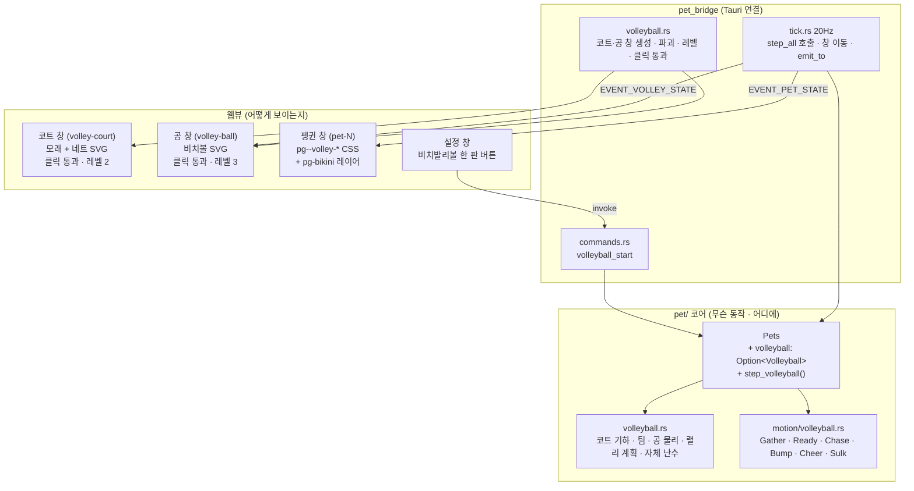
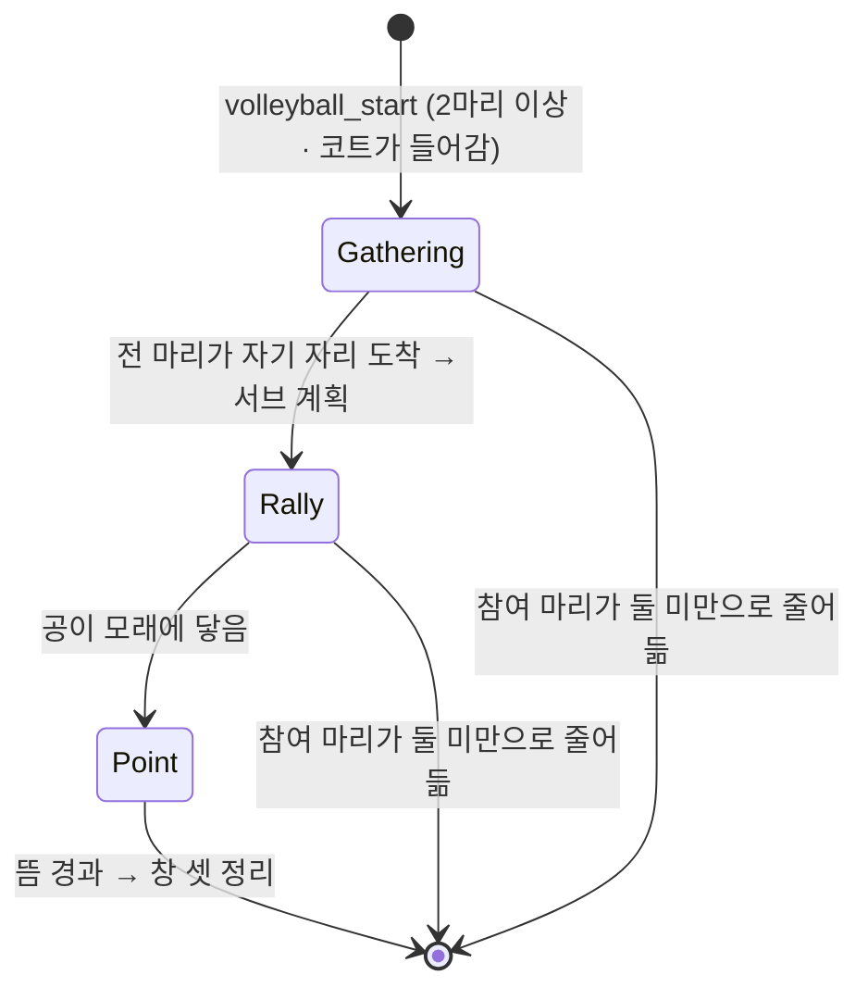

# 비치발리볼 — 관전형 한 판

## Goal Capsule

- **목표** — 설정 창에서 "비치발리볼 한 판"을 누르면 화면의 펭귄들이 **화면 가운데로 모여**
  모래사장과 네트가 깔리고, **핑크 비키니를 입고** 비치볼 하나로 한 판 친다. **20초쯤 걸리고
  알아서 끝난다.** 공이 모래에 닿으면 랠리가 끝나고, 이긴 쪽은 엉덩이를 흔들고 진 쪽은 등을
  홱 돌린 뒤 **선 그 자리에서** 평소 동작으로 돌아간다. 근거: PRD에 **§5.10으로 새로 추가**한다
  (§4·§5.8·§5.9는 고치지 않는다).
- **권위 순서** — `PRD > PRINCIPLE > CONVENTIONS > MOTIONS > 이 플랜`. 충돌하면 상위가 이기고,
  상위와 어긋나는 구현이 필요해지면 멈추고 보고한다.
- **실행 프로필** — **PR 하나.** 브랜치 `feat/f3-beach-volleyball-01`.
  - **구현은 직렬이다** (2026-09-02 사용자 지시). 이 플랜은 먼저 쓰고, 구현은 진행 중인
    두 PR("핀볼 모드에서 마리끼리 부딪히기", "방망이 넉백")이 머지된 뒤에 이 브랜치에서
    이어 간다. 이유는 §"공유 파일 삽입점"에 있다 — 셋이 `pet/mod.rs`·`behavior.rs`·
    `tuning.rs`에서 만난다.
  - TDD는 코어(`src-tauri/src/pet/`)의 국면 전이·경계 판정·랠리 계획에 적용한다. 테스트 이름은
    한국어. 커밋은 한국어 Angular 컨벤션, 유닛 하나가 커밋 하나.
- **정지 조건** — 아래 중 하나라도 걸리면 멈추고 보고한다.
  - **`set_ignore_cursor_events`가 이 레포에서 안 먹는다** — 코트 창이 클릭을 통과시키지
    못하면 "그림뿐인 창이 화면을 먹는" 상태가 되고, 그건 PRINCIPLE 5를 근거 없이 어긴다.
    이 레포에 선례가 없는 유일한 API다 (KTD5).
  - **스모크에서 20초가 지루하다** — 랠리가 "공이 그냥 왔다 갔다"로 읽히면 상수 조정으로
    풀 문제가 아니다. KTD3의 갈래 넷 중 무엇이 안 보이는지를 적어 보고한다.
  - 골든 테스트(`같은_시드는_같은_동작_시퀀스를_낳는다`)가 재기준화를 요구한다 →
    `pick_next`를 건드렸다는 뜻이다. 되돌린다 (KTD1).
  - 코트가 화면 하나에 안 들어간다(세계가 너무 좁다) → 판을 안 여는 것으로 처리하되,
    "한 마리도 못 서는" 경우가 흔하면 상수로 못 푸는 문제다.
  - PRD·PRINCIPLE과 어긋나야만 구현이 가능해진다 (특히 §4 게임화 비목표).
- **꼬리 작업** — `.github/TEMPLATE/PR.md`로 PR을 연다. **merge하지 않는다.** PR에
  `PRD.md`(§5.10 신설)·`MOTIONS.md`(비치발리볼 절 + 효과음 표 한 줄)·`TODO.md`(체크박스 하나)를
  같이 넣는다.

---

## Product Contract

### Summary

작업이 끝나면 사용자는 설정 창에서 **"비치발리볼 한 판"**을 눌러 이렇게 할 수 있다. 화면에
흩어져 걷던 펭귄들이 하던 짓을 멈추고 화면 한가운데로 날아와, 바닥에 모래사장이 깔리고 가운데
네트가 선다. 펭귄들은 어느새 **핑크 비키니**를 입고 네트 양쪽에 나뉘어 선다. 한 마리가 공을
띄워 서브를 넣으면 20초쯤 랠리가 이어진다 — 공이 넘어올 때마다 받는 쪽에서 한 마리가 뛰어나가
받아 넘기고, 어떤 공은 낮고 빠르게 꽂히고 어떤 공은 하늘 높이 뜬다. 마지막에 한 공이 빈 곳에
꽂히면 그쪽 펭귄이 뛰다 못 미치고 공이 모래에 박힌다. 이긴 쪽은 엉덩이를 흔들고 진 쪽은 등을
홱 돌린다. 모래와 네트가 사라지고, 펭귄들은 **선 그 자리에서** 다시 걷기 시작한다.

**점수는 나오지 않는다.** 몇 대 몇인지도, 누가 이겼는지도 어디에도 안 적힌다.

### Problem Frame

볼링(#45)이 "여러 마리가 하나의 사건에 참여한다"를 열었지만, 볼링에서 펭귄은 **사물**이다 —
서 있다가 맞고 튕겨 나간다. 펭귄들끼리 **주고받는** 그림은 아직 없다.

동시에 이 항목은 **볼링과 정반대의 실패 모드**를 갖는다. 볼링은 사용자가 공을 굴리므로
"내가 한 짓의 결과"가 매 순간 화면에 있고, 재미의 책임을 물리가 진다. 비치발리볼은 사용자가
버튼을 누른 뒤 **아무것도 안 한다.** 그래서 이 기능의 위험은 "물리가 틀렸다"가 아니라
**"20초 동안 보고 있기 지루하다"**다. 이 앱의 유일한 성공 기준이 "보고 있으면 웃긴가"이므로,
지루한 20초는 버그가 아니라 **기능의 실패**다. 이 플랜의 절반은 그 답(KTD3)에 있다.

### Requirements

| ID | 요구사항 |
|---|---|
| R1 | 설정 창의 버튼으로만 시작한다. 저절로 나오지 않고 확률 사다리(`pick_next`)에 끼지 않는다 |
| R2 | **화면의 펭귄 전부**가 참여한다. 우클릭한 한 마리가 아니다 (볼링과 같은 규칙) |
| R3 | **최소 두 마리다.** 한 마리면 팀이 안 나오므로 판을 열지 않는다. 홀수면 한 팀이 한 마리 많다 |
| R4 | 펭귄들은 순간이동하지 않고 **날아서** 화면 가운데의 자기 자리로 간다 |
| R5 | 모래사장과 네트가 화면 가운데에 깔린다. **클릭을 통과시키고**, 창 레벨은 펭귄보다 낮다 |
| R6 | 비치볼은 **자기 창**이다. 사용자는 공을 만지지 않는다 |
| R7 | 펭귄은 판이 도는 동안 **핑크 비키니**를 입는다. 그림은 웹뷰가 그리고 Rust는 국면만 준다 |
| R8 | **사용자 입력이 없다.** 랠리는 전부 시드 난수로 만든다 — 같은 시드는 같은 랠리를 낳는다 |
| R9 | 한 판은 **20초쯤** 걸리고 알아서 끝난다. 끝나는 조건은 **공이 모래에 닿는 것**이다 |
| R10 | **점수판이 없다.** 누가 몇 점인지 세지도, 보여주지도, 저장하지도 않는다 |
| R11 | 이긴 쪽이 좋아하고 진 쪽이 약 오른다. **기존 `Sassy` 동작을 재사용**한다 |
| R12 | 끝나면 **선 그 자리에서** 평소 동작으로 돌아간다. 원래 자리로 되돌려 보내지 않는다 |
| R13 | 판이 도는 동안에도 펭귄을 클릭·드래그할 수 있고 다른 앱도 평소대로 쓸 수 있다 |
| R14 | 판이 도는 중에 펭귄을 추가·삭제하거나 앱을 끄면 판이 깨지지 않고 정리된다 |
| R15 | 저장하지 않는다 (PRD §7). 앱을 껐다 켜면 판은 그냥 없다 |

### Acceptance Examples

**AE1 — 네 마리로 한 판**
Given 펭귄 4마리가 화면에 흩어져 있고 아무 판도 안 돌고 있다
When 설정 창에서 "비치발리볼 한 판"을 누른다
Then 네 마리가 화면 가운데로 날아오고(2초 안팎) 그 사이 모래사장과 네트가 깔린다. 네트 양쪽에
두 마리씩 서고 전부 핑크 비키니를 입고 있다. 한 마리가 서브를 넣고 20초쯤 랠리가 이어진다 —
**공이 넘어올 때마다 받는 쪽에서 한 마리가 뛰어나간다.** 마지막에 공이 모래에 꽂히면 한쪽
두 마리는 엉덩이를 흔들고 반대쪽 두 마리는 등을 돌린다. 모래·네트·공이 사라지고 네 마리는
**서 있던 자리에서** 걷기 시작한다. 점수는 어디에도 안 나온다.

**AE2 — 한 마리면 안 연다**
Given 펭귄이 1마리다
When 비치발리볼을 누른다
Then 판이 열리지 않고 "두 마리부터 할 수 있어요"가 설정 창에 뜬다. 그 한 마리는 하던 짓을
그대로 한다. 모래·네트·공 창은 하나도 안 생긴다.

**AE3 — 홀수(세 마리)**
Given 펭귄이 3마리다
When 비치발리볼을 누른다
Then 한쪽에 2, 다른 쪽에 1로 나뉘어 선다. 오류나 안내 문구는 없다. 1인 쪽은 매번 같은 마리가
받으러 뛴다.

**AE4 — 코트 위에서 다른 앱 클릭**
Given 판이 돌고 있고 모래사장이 화면 가운데를 덮고 있다
When 모래사장이 깔린 자리 위에서 다른 앱의 창을 클릭한다
Then 그 앱이 정상으로 반응한다. 모래사장·네트 창은 클릭을 통과시킨다.

**AE5 — 판 도중 펭귄을 집어 든다**
Given 4마리가 랠리 중이다
When 그중 한 마리를 드래그해 코트 밖으로 끌어낸다
Then 그 마리는 판에서 빠지고(놓으면 평소로 돌아간다) 비키니도 벗는다. 남은 세 마리는 계속
친다. 끌려 나간 마리가 받을 차례였으면 그 공은 그냥 모래에 떨어져 판이 끝난다. 크래시가 없다.

**AE6 — 판 도중 마지막 참여 마리가 사라진다**
Given 2마리가 랠리 중이다
When 둘 중 하나를 삭제하고 나머지 하나를 집어 든다
Then 판이 스스로 접히고 모래·네트·공 창이 전부 닫힌다. "비치발리볼 한 판" 버튼이 다시 살아난다.

### Scope Boundaries

**비목표 (PRD §4 근거)**

- **점수·세트·서브권·득점 표시** — §4의 게임화 비목표. "1점 내기"는 **판의 길이**지 기능이
  아니다 (R10). 이긴 쪽/진 쪽 반응은 **기록이 아니라 반응**이라 §4에 걸리지 않는다.
- **사용자 조작** — 공을 치는 것도, 팀을 고르는 것도, 다시 하기도 없다. 다시 하려면 버튼을
  다시 누른다.
- **아웃·네트인·반칙 판정** — 규칙이 붙는 순간 "잘하는지" 보게 된다. 공은 항상 코트 안을
  향하고 포물선이 네트를 넘는 것은 기하로 보장된다 (KTD6).
- **효과음** — 넣지 않는다. 근거는 KTD8 (자격 규칙 ①의 해석).
- **화면을 덮는 판 창** — 코트 창은 코트 사각형만 덮고, 그 위에서도 클릭이 통과한다 (R5/AE4).
- **비치발리볼 중 볼링, 볼링 중 비치발리볼** — 두 판은 서로를 배제한다 (KTD9).

### Deferred to Follow-Up Work

- **다이빙 리시브** — 마지막 공을 향해 몸을 던지는 자세. `Chase`가 충분히 안 웃기면 그때 넣는다.
- **모래 튀김·공 그림자** — 코트 창에 파티클을 얹는 일. 20초가 심심하면 그림보다 먼저
  KTD3의 갈래를 손본다.
- **여러 화면에서의 코트** — 프로덕션이 화면 하나만 담으므로(PRINCIPLE 2) 코트도 하나다.

---

## Planning Contract

### Key Technical Decisions

**KTD1 — `pick_next`를 건드리지 않는다. `start_*` 패턴으로 외부 트리거만 만든다.**
볼링(KTD1, #45)과 완전히 같은 이유다. `pet/mod.rs`의 `pick_next`는 정해진 순서로 `range()`를
소비하고(발작 → 얼음낚시 → 슬라이딩 → 헤엄 → 걷기/유휴), 여기 분기를 하나 끼우면 뒤의 모든
확률이 밀려 **골든 수열을 일곱 번째로 재기준화**해야 한다. 비치발리볼은 버튼으로만 시작하므로
사다리에 낄 이유가 아예 없다. `Pets::start_volleyball`은 참여 마리마다 `Pet::start_volley`를
직접 부른다. **결과: 재기준화가 일어나지 않는다.** 이게 PR의 합격 기준 하나다.

**KTD2 — 판 상태는 `Pets`가 소유하고, 난수는 판이 따로 갖는다.**
앞은 볼링(KTD2)의 근거 그대로다 — 판이 도는 중에 펭귄을 지웠을 때 자리를 비우는 일을 원자적으로
할 자리가 `Pets`밖에 없다 (R14/AE6).

뒤가 볼링과 다른 부분이다. **볼링은 난수를 하나도 안 썼다**(핀 자리는 id 순, 공 물리는 완전
결정적). 비치발리볼은 랠리가 난수로 만들어지므로(R8) 난수의 주인이 필요하다. `Pet::rng`를
쓰면 안 된다 — 마리의 난수를 태우면 **판에 참여한 마리만 이후 동작 시퀀스가 밀린다.** 그래서
`Volleyball` 구조체가 **자기 xorshift 상태**를 갖고, 시드는 `start_volleyball(now_ms, court, seed)`
인자로 받는다. 브릿지는 `now_ms()`를 시드로 넘기고, 테스트는 고정 시드를 넘긴다 —
`같은_시드는_같은_랠리를_낳는다`가 성립한다 (PRINCIPLE 3).

**KTD3 — 20초를 무엇으로 채우는가. (이 플랜의 핵심)**

먼저 **시간표**다. 판 예산은 시드로 18~22초를 뽑는다 ("20초쯤", R9).

| 구간 | 길이 | 화면에 무엇이 |
|---|---|---|
| 모이기 (`Gathering`) | 1.5~3초 | 하던 짓을 멈추고 가운데로 **날아온다.** 같은 순간 모래사장·네트가 아래에서 밀려 올라온다. 비키니는 이때 입는다 |
| 서브 | 0.8초 | 한 마리가 공을 자기 위로 띄웠다가 때려 넘긴다 |
| 랠리 (`Rally`) | 13~17초 | 왕복 **12~18회**. 매 왕복마다 받는 팀에서 한 마리가 뛰어나가 받는다 |
| 득점 (`Point`) | 1.1초 | 마지막 공이 빈 곳에 꽂히고 받으러 뛰던 마리가 못 미친다. 이긴 쪽 엉덩이 흔들기, 진 쪽 등 돌리기 |
| 정리 | — | 모래·네트·공 창이 닫히고, 펭귄은 **선 그 자리에서** 유휴로 |

**지루하지 않게 만드는 장치 다섯.** 랠리 한 번(≈1초)마다 그림이 달라져야 한다.

1. **누가 받으러 뛰는가 — 난수가 아니라 거리로 정한다.** 공이 향하는 자리에서 **가장 가까운
   마리**가 뛴다. 난수로 뽑으면 "왜 쟤가?"가 되고 아무도 안 뛰는 것처럼 보인다. 거리로 정하면
   *공이 저쪽으로 갔으니 쟤가 뛰겠구나*가 읽히고, **뛰는 그림이 랠리 화면의 절반을 채운다.**
   목적지가 매 왕복 다르므로 뛰는 마리도 저절로 바뀐다.
2. **어디로 가는가** — 받는 팀 코트 안의 아무 지점(시드). 이게 (1)을 굴리는 주사위다.
3. **어떻게 가는가 — 체공 시간이 세 등급이다.** 스파이크(0.55초·낮고 빠르다) / 평타(0.95초) /
   토스(1.5초·높이 뜬다). 포물선의 정점 높이가 T²에 비례하므로 **리듬과 그림이 함께 갈린다.**
   랠리 안에서 체감이 가장 큰 갈래다 — 같은 속도로 열두 번 오가는 것이 정확히 지루함이다.
4. **멀리 보내면 저절로 길어진다.** 체공 시간은 "받을 마리가 도착할 수 있는 최소값"으로 아래를
   눌러 잡는다(`거리 / CHASE_SPEED + 여유`). 그래서 먼 곳을 노린 공은 자동으로 토스가 되고
   펭귄이 코트를 가로질러 길게 뛴다 — **주사위 하나(2)가 변화 둘(1·3)을 만든다.**
5. **끝은 항상 스파이크지만 매번 다르다.** 예산이 다 되면 도착 보장을 끄고, **아무 마리에게서도
   가장 먼 자리**에 가장 짧은 T로 꽂는다. 받는 마리는 뛰지만 못 미치고 공이 모래에 박힌다.
   "판이 끝나는 방식"은 늘 같지만 **어느 쪽이 꽂고 누가 놓치는지**는 매번 다르다.

**두 마리(1대1)일 때가 가장 위험하다.** (1)이 죽는다 — 받을 마리가 언제나 그 한 마리다.
그 경우 변화는 (2)(3)(4)가 짊어지고, 뛰는 거리가 코트 반쪽을 다 쓰므로 **오히려 더 많이 뛴다.**
스모크에서 두 마리를 먼저 본다.

**KTD4 — 서브는 국면이 아니다. "자기에게 보내는 왕복" 한 번이다.**
`Serve` 국면을 따로 만들지 않는다. 서브를 *받는 팀 = 자기 팀, 목적지 = 자기 자리, 체공 =
0.8초*인 왕복 0번으로 계획하면, 공은 서버 머리 위로 똑바로 올라갔다가 내려오고 **평소의 접촉
판정이 그대로 발동해** 서버가 때려 넘긴다. 물리도 코드도 한 벌이고, 화면에는 진짜 토스가 보인다.
국면 하나와 분기 하나가 통째로 사라진다.

**KTD5 — 코트 창은 클릭을 통과시킨다. `set_ignore_cursor_events(true)`.**
핀볼 판이 클릭을 **먹는** 근거는 "커서가 어디서나 채가 된다"였고, 그래서 나가는 문이 둘
필요했다(PRD §5.8). 코트는 **그림뿐이라 그 근거가 없다** — 먹으면 "방해하지 않는다"
(PRINCIPLE 5)를 근거 없이 어긴다 (R5/AE4). 비치볼 창도 같다: 56px짜리 창이 화면을 날아다니며
클릭을 채 가면 그게 정확히 방해다.

**이 레포에 선례가 없는 유일한 API다.** 볼링 플랜이 이걸 "대안이지만 선례가 없으니 쓰게 되면
보고한다"로 남겨 뒀다. 여기서 처음 쓴다 — 스모크 체크리스트의 첫 줄이고, 안 먹으면 정지
조건이다. 창 레벨은 별개다: 통과시키는 것(`ignore_cursor_events`)과 뒤에 두는 것(`setLevel`)은
서로를 대신하지 못한다 — 레벨만 내리면 판을 한 번 클릭했을 때 도로 올라온다
(`docs/solutions/ui-bugs/macos-window-order-is-not-stable-level-is.md`).

**KTD6 — 공은 절대 네트에 걸리지 않는다. 기하로 보장한다.**
타점(펭귄이 공을 치는 높이)을 **네트 꼭대기보다 위**에 둔다. 그러면 타점에서 출발해 타점으로
돌아오는 포물선은 **전 구간이 타점 이상**이므로 네트를 넘지 않을 수가 없다. `tuning.rs`의
`const assert!(VOLLEY_NET_HEIGHT < PET_SIZE + VOLLEY_REACH)` 한 줄이 이 관계를 컴파일 시각에
붙든다. 네트 판정 코드도, 네트인 처리도, 그 테스트도 전부 필요 없어진다.

**KTD7 — 끝나는 조건은 예산 하나다. 얼음낚시와 같은 꼴.**
"랠리가 몇 번 오가면 끝"으로 하면 길이가 4초에서 30초까지 튄다. 얼음낚시가 *"잡아도 다시
드리운다 — 판을 끝내는 것은 예산뿐이다"*로 간 이유와 같다. 예산이 다 되면 **다음 왕복이
마지막**이 되고(KTD3-5), 그 순간 `rally_over` 플래그가 서서 **이후의 접촉 판정을 통째로
건너뛴다.** 이게 종료의 증명이다 — 여덟 마리가 코트를 빽빽하게 덮고 있어도 공은 반드시
모래에 닿는다. 받으러 뛰는 것은 막지 않으므로, 화면에는 "못 미치는 리시브"가 그대로 보인다.

**KTD8 — 효과음을 넣지 않는다.**
`MOTIONS.md`의 자격 규칙은 *"사용자가 방금 한 짓의 결과이거나, 시간당 한 번보다 드물거나"*다.
버튼을 눌렀으니 ①에 걸리는 것처럼 보이지만, 규칙이 실제로 막으려던 것은 **누적**이다.

볼링의 "딱"은 드래그 한 번이 소리 몇 발을 낳고 그 전부가 **그 한 손짓의 결과**로 읽힌다.
비치발리볼은 버튼 **한 번**이 20초에 걸쳐 **열몇 발**을 낳는다 — 다섯 번째 타격쯤이면 손짓과
소리의 연결이 이미 끊어져 있고, 남는 것은 20초짜리 배경 소음이다. 그건 규칙이 착지 셋을
자른 것과 같은 성격이다. `MOTIONS.md` 효과음 표에 **✕ 한 줄로 근거를 남긴다** — 빼먹은 것이
아니라 판단한 것임을 다음 사람이 알아야 한다. PRD §5.5의 "일곱에서만"은 그대로 둔다.

**KTD9 — 볼링과 비치발리볼은 서로를 배제한다.**
둘 다 `Pets`가 소유하는 판이고, 둘 다 "전 마리를 몬다". 동시에 열리면 `start_bowling`이
랠리 중인 마리를 핀 자세로 끌어가고 코트만 덩그러니 남는다. 각 시작 커맨드가 **상대 판이
돌면 거절**하고, 설정 창의 버튼 둘은 **어느 쪽이든 도는 동안 함께 비활성**된다.
`PetSummary`에 `volleyball: bool`이 는다.

**KTD10 — 이긴 쪽/진 쪽 반응은 `Sassy`를 CSS 층에서 재사용한다.**
가장 짧은 길은 `Behavior::Sassy`로 곧장 넘기는 것이지만 **비키니가 그 순간 사라진다** — 축하하는
동안에도 코트 위이므로 그건 눈에 띄는 튐이다. 그래서 국면을 `Volleyball` 안에 둔다
(`Cheer`/`Sulk`). 재사용은 CSS에서 한다: `.pg--volley-cheer .pg-all`이 `pg-butt-wiggle`을,
`.pg--volley-sulk .pg-all`이 `pg-turn-away`를 **참조**한다. 새 `@keyframes`를 정의하지 않으므로
중복 정의 함정(`docs/solutions/ui-bugs/duplicate-keyframes-silently-kills-animation.md`)에
걸리지 않고, `정의된_keyframes가_모두_쓰인다`의 사용 횟수도 오히려 는다.
길이는 `SASSY_MS`(900ms)에 맞춘다 — `0.45s × 2` / `0.9s × 1`로 **정수 반복**이라
`정수가_아닌_반복은_없다`도 통과한다.

**KTD11 — `Gather`만 공중이고 나머지는 지상이다.**
`Behavior::is_airborne()`이 `Volleyball { volley: Gather }`에만 `true`를 준다. 이유는 `clamp`다 —
공중이 아니면 매 틱 `y = floor_y`로 눌리므로 날아서 갈 수가 없다. 반대로 `Ready`·`Chase`·
`Bump`·`Cheer`·`Sulk`가 공중이면 모래 위에 서 있질 못한다. 볼링은 판이 화면 세로 중앙이라
전 국면이 공중이었다 — 비치발리볼은 **모래사장 위**라 반대다.

**KTD12 — 저장하지 않는다.** 볼링(KTD11)과 같다. 켜 두는 모드가 아니라 20초짜리 한 판이라
`savePetSettings`를 부르지 않고, 앱을 껐다 켜면 판은 그냥 없다 (R15, PRD §7).

### Assumptions

확인 없이 채택했다. **틀리면 구현 전에 알려주면 가장 싸게 고친다.**

- **A1** — 코트는 **바닥(모래사장)**에 깔린다. 볼링은 판을 화면 세로 중앙으로 올렸지만
  (2차원 바닥으로는 삼각형을 못 세워서), 비치발리볼은 모래 위에서 하는 운동이고 뛰어다니는
  그림이 이 동작의 절반이라 바닥이 맞다.
- **A2** — 코트 창은 **하나**다 (모래사장 + 네트를 한 창이 그린다). 화면이 하나뿐이므로
  배율 문제가 없고, 둘로 나누면 창 둘의 z 순서를 또 다퉈야 한다.
- **A3** — 랠리 중 공이 코트 가로 밖으로 나가는 일은 없다. 목적지가 항상 코트 안이기
  때문이다. 그래도 방어로 "밖으로 나가면 그쪽 실점"을 둔다.
- **A4** — 팀 배정은 **id 오름차순으로 번갈아** 한다 (짝수 id 순번 → 왼쪽, 홀수 → 오른쪽).
  같은 마릿수는 항상 같은 배치를 낳는다. 홀수면 왼쪽이 한 마리 많다.
- **A5** — 비키니는 SVG 도형 둘(상의·하의)이면 충분하다. 평소에는 `display: none`이고
  `pg--volley-*` 아래에서만 보인다. 펭귄만큼 공들이지 않는다.
- **A6** — 판이 도는 동안 클릭한 펭귄은 **판에서 빠진다**(빠따든 핀볼 채든). 억지로 붙들면
  사용자와 앱이 싸운다 — 볼링 A4와 같은 규칙이다.
- **A7** — 핀볼 모드가 켜져 있어도 비치발리볼은 그대로 돈다. 코트 국면들은 착지 판정을
  거치지 않으므로 `PINBALL_DAMPING`과 만나는 지점이 없다. 다만 채로 후려친 마리는 A6대로
  판에서 빠진다.

### High-Level Technical Design

**구성 — 창 셋, 코어 하나**



**판 국면 (`Pets`가 소유)**



`Point`는 참여 마리가 0이어도 접히지 않는다 — 득점 순간 전원이 `Cheer`/`Sulk`로 넘어가므로,
접었다가는 축하 그림이 나오기 전에 코트가 사라진다. (볼링의 *"굴러가는 중에는 핀이 하나도
안 남아도 판을 접지 않는다"*와 같은 자리다.)

**랠리 한 왕복 — 계획과 접촉**

```mermaid
sequenceDiagram
    participant B as 판 (Volleyball)
    participant Ball as 공
    participant R as 받을 마리
    B->>B: 목적지 뽑기 (받는 팀 코트 안, 시드)
    B->>R: 목적지에서 가장 가까운 마리 = 받을 마리
    B->>B: 체공 T = max(등급 T, 뛸 거리/속도 + 여유), 상한은 토스
    B->>Ball: vx = (목적지-지금)/T, vy = -g·T/2
    B->>R: Chase (target = 목적지) — 뛴다
    loop 매 틱
        B->>Ball: vy += g·dt; x += vx·dt; y += vy·dt
    end
    alt 예산이 남았고 · 공이 내려오며 타점에 닿았고 · 받을 마리가 사정거리 안
        B->>R: Bump (0.38초) — 때린다
        B->>B: 다음 왕복 계획 (반대 팀으로)
    else 예산이 다 됐다 (rally_over)
        Note over B,Ball: 접촉 판정을 통째로 건너뛴다 — 공은 반드시 모래로
        Ball->>B: 모래에 닿음 → Point
    end
```

---

## 공유 파일 삽입점

**다른 두 PR과 만나는 지점이다.** 각각 무엇을 몇 줄 넣는지 미리 못 박아 리베이스 비용을
정한다. **원칙: 새 코드는 새 파일에 몰고, 공유 파일에는 "삽입점 한 줄"만 남긴다.**

### Rust 코어

| 파일 | 무엇을 | 규모 | 충돌 위험 |
|---|---|---|---|
| `src-tauri/src/pet/mod.rs` | ① `mod volleyball;` + `pub use volleyball::{...};` (`bowling` 옆) ② `Pets`에 필드 `volleyball: Option<Volleyball>` **1줄** ③ `step_all` 맨 앞 `self.step_volleyball(now_ms);` **1줄** ④ `Pets::start_volleyball` / `end_volleyball` / `leave_volleyball` / `volleyball()` 접근자 ⑤ `remove`·`forget`·`clear`에 `leave_volleyball(id)` / `self.volleyball = None` **각 1줄** ⑥ `start_bowling` 첫 줄에 상호 배제 가드 **1줄** (KTD9) | 새 메서드 ~90줄 + 기존 함수에 삽입 6줄 | **높음.** `step_all`을 다른 PR이 고치는 중이다. 내 삽입은 **함수 맨 앞 한 줄**이고 나머지 본문은 안 건드린다 — 상대가 마리 간 판정을 루프 뒤에 얹으면 인접 줄 충돌뿐이다 |
| `src-tauri/src/pet/behavior.rs` | ① `VolleyPhase` enum 신설 (6변형) ② `Behavior::Volleyball { volley }` 변형 ③ `is_airborne()`에 `Volleyball { volley: Gather }` 한 갈래 (KTD11) | ~45줄 추가, 기존 수정 1줄 | 낮음. 다른 PR도 여기 붙일 수 있으나 전부 **추가**라 병합이 기계적이다 |
| `src-tauri/src/pet/tuning.rs` | **파일 끝에 `// ── 비치발리볼 ──` 새 절**을 만들고 거기에만 상수 ~16개 + `const assert!` ~8개. **기존 절은 한 줄도 안 건드린다** (특히 "던지기"·"착지"·"핀볼 모드") | ~70줄, 전부 파일 끝 | 낮음 — 셋 다 파일 끝에 새 절을 붙이면 순서만 정하면 된다 |
| `src-tauri/src/lib.rs` | `generate_handler!`에 `volleyball_start` **1줄** | 1줄 | 낮음 |
| `src-tauri/src/pet_bridge/mod.rs` | ① `mod volleyball; pub use volleyball::*;` **2줄** ② `EVENT_VOLLEY_STATE`·`EVENT_VOLLEY_OVER` 상수 ③ `PetSummary`에 `volleyball: bool` **1줄** ④ `VolleyLook` 타입과 `volley_look_of` | ~30줄 | 낮음 |
| `src-tauri/src/pet_bridge/commands.rs` | `volleyball_start` 커맨드 하나 (~20줄, `bowling_start`의 꼴 그대로 — **`let ids = ...` 먼저 받고 순회**해 자기 데드락을 피한다). `pet_summary`에 필드 **1줄**. **`pet_whack`은 안 건드린다** | ~25줄 | 낮음. "방망이 넉백" PR이 `pet_whack`을 고치는데 나는 거기 안 간다 |
| `src-tauri/src/pet_bridge/tick.rs` | 코트·공 창을 매 틱 반영하는 `apply_volley(...)` 호출 **1줄** + `VolleyView` 지역 변수 **1줄**. 함수 본체는 `pet_bridge/volleyball.rs`에 산다. **기존 본문은 안 건드린다** | 삽입 2줄 (+ 락 안에서 판 스냅샷 읽는 2줄) | 중간 — 2단계 블록 안이라 정확한 줄을 PR에 명시한다 |
| `src-tauri/capabilities/default.json` | `windows`에 `"volley-court"`, `"volley-ball"` **2줄** + `description` 갱신 | 3줄 | 낮음 |

**절대 안 건드리는 파일**: `pet/motion/pinball.rs`, `pet/motion/react.rs`, `pet/motion/bowling.rs`,
`pet/bowling.rs`, `pet_bridge/pinball.rs`, `pet_bridge/ball_window.rs`,
`commands.rs`의 `pet_whack`, `step_bowling`의 본문.

### 프론트

| 파일 | 무엇을 | 규모 |
|---|---|---|
| `src/lib/pet.ts` | `VolleyPhase` 타입, `Behavior` 유니온 1줄, `behaviorClass` 분기 1줄, `isOneShot`에 `pg--volley-bump`/`-cheer`/`-sulk`, `startVolleyball()`, `VolleyBallSnapshot`, `onVolleyState`, `onVolleyOver`, `PetSummary.volleyball` | ~45줄 |
| `src/pet/css/index.css` | `@import "./volleyball.css";` **1줄** | 1줄 |
| `src/pet/Penguin.tsx` | `.pg-all` 안에 `<g className="pg-bikini">` (상의·하의 도형 둘) + 색 상수 `BIKINI` **1줄** | ~14줄 |
| `src/pet/pet-css.test.ts` | `ALL_BEHAVIORS`에 6줄, `숨기는_도형`에 `pg-bikini` 1줄, 길이 동기화 표에 `pg--volley-bump`/`-cheer` 2줄, CSS 파일 목록에 `"volleyball"` 1줄 | ~10줄 |
| `src/components/SettingsCard.tsx` | props 둘(`volleyballRunning`·`onVolleyball`) + 버튼 행 + 힌트 문단 | ~20줄 |
| `src/components/SettingsCard.test.tsx` | 새 props 채우기 + 비활성 테스트 | ~15줄 |
| `src/App.tsx` | `handleVolleyball` 콜백, `onVolleyOver` 구독, `SettingsCard`에 props 둘, `petSummary` 초기값에 1줄 | ~25줄 |
| `src/App.test.tsx` | 기존 목에 `volleyball: false` 채우기 | ~3줄 |
| `vite.config.ts` | `rollupOptions.input`에 엔트리 둘 **2줄** | 2줄 |

### 문서

| 파일 | 무엇을 |
|---|---|
| `PRD.md` | **§5.10 신설** (§5.9를 형식의 본으로). §5.5의 버튼 목록에 한 줄. §4·§5.8·§5.9는 안 고친다 |
| `MOTIONS.md` | "비치발리볼" 절 신설 + **효과음 표에 ✕ 한 줄** (KTD8의 근거) |
| `TODO.md` | 비치발리볼 체크박스 하나를 `[x]`로 + 결과 요약 |

---

## Output Structure

```text
src-tauri/src/pet/
  volleyball.rs              # 코트 기하 · 팀 · 공 물리 · 랠리 계획 · 자체 난수
  volleyball_tests.rs
  motion/
    volleyball.rs            # 마리별 국면 여섯
    volleyball_tests.rs
src-tauri/src/pet_bridge/
  volleyball.rs              # 코트·공 창 생성 · 클릭 통과 · 레벨 · 매 틱 반영
  volleyball_tests.rs
src/pet/css/
  volleyball.css             # pg--volley-* + pg-bikini
src/volley/
  court.ts                   # 코트 창 웹뷰 (모래 + 네트 SVG, 입력 없음)
  court.css
  ball.ts                    # 공 창 웹뷰 (비치볼 SVG, 입력 없음)
  ball.css
  volley.test.ts             # 코트·공 그리기 단위 테스트
volley-court.html
volley-ball.html
```

---

## Implementation Units

### U1. 코트 기하와 팀 배정 (순수 코어)

- **Goal** — `Bounds` 하나에서 코트를 만든다: 네트 자리, 모래 높이, 팀별 x 범위, 마리별 자리.
  좁은 화면에서 판을 열 수 있는지 판정한다.
- **Requirements** — R3, R4, A1, A2, A4, KTD6, KTD11
- **Dependencies** — 없음
- **Files**
  - `src-tauri/src/pet/volleyball.rs` (신규) — `Court`, `Side`, `spot_of`, `teams_of`, `fits`
  - `src-tauri/src/pet/volleyball_tests.rs` (신규)
  - `src-tauri/src/pet/tuning.rs` — **파일 끝에 `── 비치발리볼 ──` 절 신설**
  - `src-tauri/src/pet/mod.rs` — `mod volleyball;` + `pub use`
- **Approach**
  - 좌표계: 펭귄 자리는 **몸통 가운데 x**로 계산하고 `Pet::x`(좌상단)로 바꿔 넘긴다 —
    볼링이 `center_x()`를 만든 이유와 같다.
  - `net_cx = (bounds.left + bounds.right)/2 + PET_SIZE/2`. 모래 표면 `sand_y = floor_y + PET_SIZE`.
    타점 `contact_y = floor_y - VOLLEY_REACH`.
  - 팀 x 범위: 왼쪽 `[net_cx - HALF, net_cx - GAP]`, 오른쪽은 대칭. 세계 경계로 한 번 clamp한다.
  - 자리 배정: 팀 안에서 x 범위를 균등 분할(1마리면 가운데). `fits()`는
    `bounds` 폭이 `VOLLEY_MIN_WORLD_WIDTH`보다 좁으면 `false`.
  - **난수를 안 쓴다** — 코트와 자리는 마릿수와 경계만으로 정해진다 (볼링 R12와 같다).
- **Patterns to follow** — `src-tauri/src/pet/bowling.rs`의 `pin_positions`·`lane_center_y`·
  `ball_home` (좁은 화면 방어 포함).
- **Test scenarios**
  - `Covers AE3.` `홀수면_왼쪽_팀이_한_마리_많다` — 3마리 → 왼쪽 2 · 오른쪽 1
  - `팀은_id_오름차순으로_번갈아_배정된다` — 같은 마릿수는 항상 같은 배치
  - `양_팀은_네트를_사이에_두고_선다` — 왼쪽 자리 x < net_cx < 오른쪽 자리 x, 전부 `VOLLEY_NET_GAP` 밖
  - `자리는_세계_경계_안에_있다` — 2·4·8마리에서 전부 `[bounds.left, bounds.right]`
  - `좁은_화면에서는_판을_열_수_없다` — 폭 200인 `Bounds`에서 `fits() == false`
  - `납작한_경계에서_패닉하지_않는다` — `FLAT_BOUNDS`(폭 0)로 호출
  - `타점은_네트_꼭대기보다_높다` — 상수 관계를 런타임에서도 한 번 못 박는다 (KTD6)
- **Verification** — `cargo test`. 새 `const assert!` 여덟이 컴파일을 통과한다.

---

### U2. 공 물리와 랠리 계획 (순수 코어) ← **20초의 답이 여기 산다**

- **Goal** — 판이 시드 난수로 왕복을 계획하고, 공이 중력으로 날고, 접촉이 판정되고,
  예산이 다 되면 반드시 끝난다.
- **Requirements** — R6, R8, R9, KTD2, KTD3, KTD4, KTD6, KTD7
- **Dependencies** — U1
- **Files**
  - `src-tauri/src/pet/volleyball.rs` — `Volleyball`, `CourtPhase`, `VolleyBall`,
    `BallSnapshot`, `plan_hit`, `step_ball`, `contact`, 자체 xorshift
  - `src-tauri/src/pet/volleyball_tests.rs`
  - `src-tauri/src/pet/tuning.rs` — 체공·중력·속도 상수
- **Approach**
  - **난수는 판이 갖는다** (KTD2). `Volleyball::new(..., seed)` — 브릿지는 `now_ms()`,
    테스트는 고정값.
  - `plan_hit(to_side)`:
    1. 목적지 x를 `to_side`의 코트 범위 안에서 뽑는다 (`fraction()`)
    2. 받을 마리 = 목적지에서 가장 가까운 그 팀 마리 (**난수가 아니라 거리**, KTD3-1)
    3. 체공 T = `max(등급T[range(0,2)], 뛸_거리/CHASE_SPEED + MARGIN)`, 상한은 토스 등급.
       추가로 정점(`g·T²/8`)이 `bounds.top`을 넘지 않게 T를 한 번 더 자른다
    4. `vx = (목적지 - 지금)/T`, `vy = -g·T/2`
  - **서브는 왕복 0번**이다 (KTD4): `to_side = 서버의 팀`, 목적지 = 서버 자리, T = `VOLLEY_SERVE_MS`.
  - `step_ball(dt)`: `vy += g·dt; x += vx·dt; y += vy·dt`. **틱 상한은 `MAX_STEP_MS`** —
    밀린 틱에 공이 순간이동하면 접촉을 통째로 건너뛴다 (볼링과 같은 함정).
  - `contact(...)`: `rally_over`면 즉시 `None`. 아니면 *내려오는 중(`vy > 0`) + 타점 통과 +
    받을 마리가 `VOLLEY_REACH_X` 안*을 본다. 통과 판정은 **점이 아니라 이번 틱의 y 구간**으로
    한다 — 공 판정에서 두 번 데인 자리다.
  - 예산 만료 → 다음 계획은 **킬샷**: 도착 보장을 끄고, 목적지는 *그 팀 어느 마리에서도 가장
    먼 지점*, T는 스파이크 등급, 그리고 `rally_over = true`.
  - 착지: `y + SIZE/2 >= sand_y` → `Point`. 진 팀 = 공의 x가 있는 쪽.
- **Execution note** — 랠리 계획과 종료는 이 기능의 심장이고 눈으로 못 본다. **테스트 먼저** 쓴다.
- **Test scenarios**
  - `Covers AE1.` `같은_시드는_같은_랠리를_낳는다` — 시드 고정 두 판을 20초 굴려 매 틱
    공 위치·받을 마리·국면 전체를 대조 (끝에서 한 번만 보면 중간에 갈렸다 붙은 것을 놓친다)
  - `다른_시드는_다른_랠리를_낳는다` — 시드 다섯 개의 왕복 횟수·목적지 열이 전부 같지 않다
  - `공은_반드시_네트를_넘는다` — 왕복 200번을 굴려 **비행 중 최저점이 네트 꼭대기보다 높다**
  - `공이_모래에_닿으면_판이_끝난다` — `Rally` → `Point` 전이
  - `예산이_다_되면_반드시_끝난다` — 여덟 마리를 코트에 빽빽하게 세우고 굴려도 상한
    시간 안에 `Point`에 도달한다 (KTD7의 종료 증명)
  - `한_판은_스무_초쯤_걸린다` — 시드 20개의 전체 길이가 전부 `VOLLEY_SESSION_MS` ± 1.5초 안
  - `랠리는_열_번_넘게_오간다` — 시드 20개의 왕복 횟수 중앙값이 12 이상 (KTD3의 밀도를 못 박는다)
  - `체공_등급이_세_가지_다_나온다` — 시드 20개를 합쳐 스파이크·평타·토스가 전부 등장
  - `멀리_보낸_공은_체공이_길다` — 뛸 거리가 길수록 T가 단조 증가
  - `목적지에서_가장_가까운_마리가_받는다` — 손으로 세운 배치에서 받을 마리 지정을 확인
  - `킬샷은_아무도_못_받는다` — 예산 만료 뒤 접촉이 한 번도 안 일어난다
  - `틱이_밀려도_타점을_건너뛰지_않는다` — 250ms 한 틱으로 굴려도 접촉이 잡힌다
  - `서브는_자기_쪽으로_띄웠다_때린다` — 왕복 0번의 목적지가 서버 자기 자리다
- **Verification** — `cargo test`. Tauri를 하나도 안 쓰는 순수 모듈이라 전부 단위 테스트다.

---

### U3. 마리별 국면 여섯 (코어)

- **Goal** — `Behavior::Volleyball`과 국면 여섯이 생기고, 마리가 자기 자리로 날아가고,
  받으러 뛰고, 때리고, 좋아하거나 약 오른다.
- **Requirements** — R4, R11, R12, KTD10, KTD11
- **Dependencies** — U1
- **Files**
  - `src-tauri/src/pet/behavior.rs` — `VolleyPhase` + `Behavior::Volleyball` + `is_airborne` 한 갈래
  - `src-tauri/src/pet/motion/volleyball.rs` (신규)
  - `src-tauri/src/pet/motion/volleyball_tests.rs` (신규)
  - `src-tauri/src/pet/motion/mod.rs` — `mod volleyball;` 1줄
  - `src-tauri/src/pet/mod.rs` — `step`의 `match`에 `Behavior::Volleyball { volley } => ...` 1줄
  - `src-tauri/src/pet/tuning.rs` — 국면 길이
- **Approach**
  - 국면: `Gather`(날아간다) → `Ready`(선다) → `Chase`(받으러 뛴다) → `Bump`(때린다) →
    `Cheer` / `Sulk`(귀결 국면).
  - `Gather`는 볼링의 `tick_bowling_gather`와 같은 꼴 — `target`을 향해 곧장 간다.
    도착하면 `Ready`이고 그때 `air = false`가 된다 (KTD11).
  - `Chase`: `target.0`을 향해 x만 `VOLLEY_CHASE_SPEED`로 움직인다. 도착하면 `Ready`.
    **자기 팀 x 범위 밖으로는 안 나간다** — 네트를 통과하면 안 된다.
  - `Bump`: `VOLLEY_BUMP_MS` 뒤 `Ready`. 위치는 안 바뀐다 — 점프는 CSS가 그린다 (PRINCIPLE 4).
  - `Cheer`/`Sulk`: `SASSY_MS` 뒤 `enter_idle`. **여기가 나가는 문이다** — 곧장 유휴로 가면
    `.pg-all` 변형이 한 프레임에 사라져 튄다 (얼음낚시 `Pack`, 발작 `Pant`, 볼링 `Scatter`와
    같은 자리).
  - `start_volley(now_ms, spot)` — `Dragged`거나 이미 볼링/비치발리볼 중이면 거절
    (`start_fishing`·`start_bowling`과 같은 꼴).
  - **`enter_sassy`를 부르지 않는다** — 그쪽은 `range()`로 난수를 태우고 `react.rs`에 있다
    (건드리지 않기로 한 파일). `Cheer`/`Sulk`는 이 파일에서 `enter`로 직접 들어간다.
  - `is_volleying()` / `volley_stood()` — 판이 참여 목록을 추리는 데 쓴다 (볼링과 같은 꼴).
- **Execution note** — 국면 전이는 실패하는 테스트부터 쓴다.
- **Test scenarios**
  - `자기_자리에_도착하면_선다` — `Gather` → `Ready`, 좌표가 정확히 자리에 앉는다
  - `모이는_중에는_공중이고_서면_바닥이다` — `air` 플래그 (KTD11)
  - `Covers AE5.` `들고_있으면_판에_안_들어간다` — `Dragged` 상태에서 `start_volley` 거절
  - `이미_볼링_중이면_판에_안_들어간다`
  - `받으러_뛰면_목적지에_선다` — `Chase` → 목적지 도달 → `Ready`
  - `뛰어도_네트를_넘지_않는다` — 목적지가 상대 코트여도 자기 팀 범위에서 멈춘다
  - `때리는_동안_제자리에_있다` — `Bump` 동안 x·y 불변
  - `Covers AE1.` `이긴_쪽은_좋아하고_진_쪽은_약_오른다` — `Cheer`/`Sulk` 진입
  - `축하가_끝나면_선_자리에서_유휴로_간다` — 좌표가 안 바뀌는 것까지 본다 (R12)
  - `국면_전이는_난수를_소비하지_않는다` — 전후 `Pet`의 다음 `range()` 결과가 같다 (KTD1의 보강)
  - `안전_상한이_지나면_스스로_풀린다` — 판이 사라져도 영원히 서 있지 않는다
- **Verification** — `cargo test`. 골든 테스트가 **재기준화 없이** 통과한다.

---

### U4. `Pets`가 판을 몬다 (코어 이음매)

- **Goal** — 판이 열리고, 매 틱 진행되고, 마리가 빠지면 정리되고, 볼링과 서로를 배제한다.
- **Requirements** — R1, R2, R3, R14, KTD1, KTD2, KTD9
- **Dependencies** — U2, U3
- **Files**
  - `src-tauri/src/pet/mod.rs` — 필드·`step_volleyball`·`start_volleyball`·`end_volleyball`·
    `leave_volleyball`·접근자, `remove`/`forget`/`clear`/`start_bowling`에 삽입 각 1줄
  - `src-tauri/src/pet/core_tests.rs` — 판 수명 테스트를 **덧붙인다**(기존 줄을 지우지 않는다)
- **Approach**
  - `step_volleyball`은 `step_all` **맨 앞**에서 돈다 (`step_bowling` 바로 뒤) — 판이 마리를
    몰지 그 반대가 아니라서, 이번 틱에 정해진 국면이 곧바로 그 틱의 마리 동작에 반영돼야 한다.
  - 매 틱: ① 판을 떠난 마리 추리기 → ② 둘 미만이면 접기 → ③ 안전 상한 → ④ 국면별 진행.
  - **`for id in <락>.f()` 금지.** `let ids = ...`로 먼저 받는다
    (`docs/solutions/best-practices/rust-for-loop-holds-mutex-guard-across-body.md`).
    코어 안에서는 `let Self { pets, volleyball, .. } = self;`로 빌림을 나눈다 (볼링과 같은 꼴).
  - `start_volleyball(now_ms, bounds, seed)`: 볼링이 돌면 거절 / 코트가 안 들어가면 거절 /
    참여 마리가 둘 미만이면 거절.
  - `end_volleyball(now_ms)`: 브릿지가 창을 못 만들었을 때 판을 즉시 접는 문 (볼링과 같다).
- **Test scenarios**
  - `Covers AE2.` `한_마리면_판을_열지_않는다` — `start_volleyball == false`, 그 마리의 동작 불변
  - `두_마리면_판이_열린다`
  - `볼링이_도는_중에는_판을_열_수_없다` / `비치발리볼이_도는_중에는_볼링을_열_수_없다` (KTD9)
  - `이미_판이_돌면_다시_열지_않는다`
  - `Covers AE6.` `참여_마리가_둘_미만이_되면_판이_접힌다`
  - `Covers AE5.` `드래그로_빠진_마리는_참여_목록에서_빠진다`
  - `펭귄을_지우면_판에서도_빠진다` — `remove`·`forget` 둘 다
  - `펭귄을_전부_끄면_판이_사라진다` — `clear`
  - `득점_뒤에는_참여_마리가_없어도_판이_남는다` (KTD7 주변, 축하 그림을 지키는 규칙)
  - `안전_상한이_지나면_판이_스스로_접힌다`
  - `골든_수열이_그대로다` — 기존 `같은_시드는_같은_동작_시퀀스를_낳는다`가 **수정 없이** 통과
- **Verification** — `cargo test` 전체. `core_tests.rs` diff의 **삭제가 0줄**.

---

### U5. 코트 창과 공 창 (브릿지)

- **Goal** — 모래·네트 창과 비치볼 창이 뜨고 닫히고, **클릭을 통과시키고**, 레벨이 맞고,
  20Hz로 공이 움직인다.
- **Requirements** — R5, R6, R13, KTD5
- **Dependencies** — U4
- **Files**
  - `src-tauri/src/pet_bridge/volleyball.rs` (신규) — 라벨 상수, 창 생성/파괴,
    `set_ignore_cursor_events`, `sink_court_below_pets`, `apply_volley`, `VolleyView`
  - `src-tauri/src/pet_bridge/volleyball_tests.rs` (신규)
  - `src-tauri/src/pet_bridge/mod.rs` — `mod`/`pub use`/이벤트 상수/`VolleyLook`
  - `src-tauri/src/pet_bridge/tick.rs` — `VolleyView` 변수 1줄 + `apply_volley(...)` 호출 1줄
    (+ 락 안에서 판 스냅샷을 읽는 2줄). **기존 본문은 안 건드린다**
  - `src-tauri/capabilities/default.json` — 라벨 둘
- **Approach**
  - 라벨: `volley-court`, `volley-ball`. **`capabilities/default.json`에 없으면 이 창들의
    `listen`이 컴파일·테스트를 다 통과하고 런타임에서만 조용히 죽는다**
    (`docs/solutions/best-practices/tauri-command-registration-silent-failure.md`).
  - 코트 창: 코트 사각형 크기, 투명·무장식·`always_on_top`,
    **`set_ignore_cursor_events(true)`**, 레벨 **2**(펭귄 3보다 아래, `ns_window()`로 내린다).
    *레벨과 클릭 통과는 서로를 대신하지 못한다* — 둘 다 건다 (KTD5).
  - 공 창: `VOLLEY_BALL_SIZE` 크기, 레벨 **3**(펭귄과 같다 — 날아다니는 공이 펭귄 뒤로 숨으면
    랠리가 안 보인다), 역시 **클릭 통과**.
  - `apply_volley`는 `apply_ball`의 꼴을 그대로 쓴다: 창이 없으면 만들고, 위치가 바뀌었을
    때만 `set_position`, 겉모습이 바뀌었을 때만 `emit_to`, 판이 없으면 창을 닫는다.
    **`app.hide()`를 절대 안 부른다.**
  - **창을 못 만들면 판을 접는다** — 잇달아 실패하면 `end_volleyball`을 부르고
    `EVENT_VOLLEY_OVER`를 쏜다. 핀볼이 판을 못 깔았을 때 모드가 스스로 되돌아가는 것과 같은
    규칙이고, 볼링의 `BALL_WINDOW_MAX_FAILS`가 선례다.
  - `emit_to`만으로는 안 된다 — 받는 쪽도 `getCurrentWebviewWindow().listen()`으로 창에
    묶는다 (`docs/solutions/best-practices/tauri-any-listener-receives-every-event.md`).
- **Test scenarios** (창 생성은 Tauri 런타임 표면이라 **판단만** 떼어 테스트한다 —
  `build_all_or_none`이 선례다)
  - `코트_창_좌상단은_코트_사각형에서_나온다`
  - `공_창_좌상단은_공_중심에서_반지름을_뺀다`
  - `판이_사라지면_겉모습_기억이_비워진다`
  - `겉모습이_안_바뀌면_다시_알리지_않는다`
  - `자리가_안_바뀌면_창을_안_옮긴다`
  - `잇달아_실패하면_판을_접는다`
  - `등록_대조` — `capabilities/default.json`에 두 라벨이 있고 `lib.rs`에 커맨드가 등록돼 있다
    (파일을 읽어 문자열로 대조하는 테스트 — 조용한 실패를 막는 유일한 장치다)
- **Verification** — `cargo test`. 스모크에서 코트 위 클릭이 통과하는지 확인 (정지 조건).

---

### U6. 코트·공 웹뷰 (모래·네트·비치볼)

- **Goal** — 코트 창이 모래사장과 네트를, 공 창이 비치볼을 그린다. **입력을 하나도 받지 않는다.**
- **Requirements** — R5, R6, R13
- **Dependencies** — U5
- **Files**
  - `src/volley/court.ts`, `src/volley/court.css` (신규)
  - `src/volley/ball.ts`, `src/volley/ball.css` (신규)
  - `src/volley/volley.test.ts` (신규)
  - `volley-court.html`, `volley-ball.html` (신규)
  - `vite.config.ts` — 엔트리 둘
  - `src/lib/pet.ts` — `VolleyBallSnapshot`, `onVolleyState`, `onVolleyOver`
- **Approach**
  - **React를 쓰지 않는다** — 판·공이 그렇듯 그릴 트리가 없다. SVG 문자열 하나에 클래스 토글이
    전부다 (`src/pinball/main.ts` 18줄, `src/ball/main.ts`가 선례).
  - 코트: 모래 = 아래쪽 가로 띠(모래색 그러데이션 + 위 가장자리의 얕은 물결),
    네트 = 가운데 기둥 둘 + 격자 무늬. 판이 열릴 때 아래에서 밀려 올라오는 등장 애니메이션
    하나(0.4초). `pointer-events: none`을 CSS에도 건다 — `ignore_cursor_events`의 이중 방어다.
  - 공: 비치볼(흰 바탕 + 색 조각 셋). 나는 동안 천천히 돈다.
  - `court.ts`는 **이벤트를 구독하지 않아도 된다** — 코트는 판이 도는 동안 안 변한다.
    창의 존재 자체가 상태다. 공만 `onVolleyState`를 창에 묶어 구독한다.
  - 키보드 핸들러를 두지 않는다 — 나가는 문이 필요 없다 (사용자를 가두지 않으므로, KTD5).
- **Test scenarios**
  - `코트에_모래와_네트가_그려진다` — jsdom에 붙여 두 요소가 있는지
  - `코트는_포인터를_받지_않는다` — 계산된 `pointer-events`가 `none`
  - `공은_나는_동안_돈다` — `rolling` 클래스 토글
  - `공_웹뷰는_자기_창에만_묶인다` — `getCurrentWebviewWindow().listen`을 쓰는지 (전역 `listen`
    금지 — 창이 여럿일 때 터진다)
- **Verification** — `npm test`, **`npm run build`(타입 검사)**.

---

### U7. 펭귄 CSS와 비키니

- **Goal** — 국면 여섯의 그림이 붙고, 판이 도는 동안 핑크 비키니를 입는다.
- **Requirements** — R7, R11, KTD10, A5
- **Dependencies** — U3
- **Files**
  - `src/pet/css/volleyball.css` (신규)
  - `src/pet/css/index.css` — `@import` 1줄
  - `src/pet/Penguin.tsx` — `pg-bikini` 도형 둘
  - `src/lib/pet.ts` — `VolleyPhase`, `behaviorClass` 분기, `isOneShot`
  - `src/pet/pet-css.test.ts` — `ALL_BEHAVIORS` 여섯, `숨기는_도형`, 길이 표
- **Approach**
  - 클래스: `pg--volley-gather` / `-ready` / `-chase` / `-bump` / `-cheer` / `-sulk`.
  - `pg-bikini`는 **`.pg-all` 안**에 그린다 — 밖에 두면 착지 포즈에서 몸만 눌리고 수영복이
    허공에 남는다 (착지 포즈가 `.pg-all`을 통째로 누르는 것과 같은 이유). 평소 `display: none`,
    `pg--volley-*` 아래에서만 보인다. **`opacity: 0`으로 감추지 않는다** — 후광(`pg-halo`)에
    잔상이 남는다 (`pet-css.test.ts`의 `숨기는_도형` 규칙).
  - 날개는 **헤엄(`pg-paddle`)을 재사용**한다 — `Gather`가 공중을 가는 몸짓이라 볼링과 같다.
  - `Chase`는 걷기 애니메이션을 빠르게 돌린다. `Bump`는 한 번짜리 점프+날개 올리기(0.38초).
  - `Cheer`/`Sulk`는 **기존 keyframe을 참조만 한다** (KTD10):
    `pg-butt-wiggle 0.45s × 2` / `pg-turn-away 0.9s × 1` — 둘 다 900ms 정수 반복.
    **새 `@keyframes`를 정의하지 않는다** — 같은 이름을 두 번 정의하면 앞의 애니메이션이 통째로
    죽는다 (`docs/solutions/ui-bugs/duplicate-keyframes-silently-kills-animation.md`).
  - 새로 만드는 `@keyframes` 이름은 **쓰는 클래스에서 딴다**: `pg-volley-bump`, `pg-volley-ready-bob`.
- **Test scenarios** (`pet-css.test.ts`가 대부분 자동으로 잡는다)
  - `ALL_BEHAVIORS`에 여섯을 더해 `%s 동작에 대응하는 규칙이 있다`가 여섯 번 더 돈다
  - `pg-bikini 는 display로 감춘다` — `숨기는_도형` 목록에 넣는다
  - `pg--volley-bump 가 Rust의 VOLLEY_BUMP_MS 와 같다` — 길이 동기화 표
  - `pg--volley-cheer 가 Rust의 VOLLEY_CHEER_MS 와 같다`
  - 기존 `같은_이름의_keyframes가_두_번_정의되지_않는다` / `정의된_keyframes가_모두_쓰인다` /
    `정수가_아닌_반복은_없다`가 새 CSS를 덮는다 (CSS 파일 목록에 `"volleyball"`을 넣어야 덮는다)
  - `Penguin이_쓰는_클래스에_스타일이_있다`가 `pg-bikini`를 자동으로 집는다
- **Verification** — `npm test`, `npm run build`. 스모크에서 여섯 국면을 눈으로 본다.

---

### U8. 시작 버튼과 커맨드

- **Goal** — 설정 창에서 판을 열 수 있고, 도는 동안 두 버튼이 비활성이고, 끝나면 되살아난다.
- **Requirements** — R1, R2, R3, R15, KTD9, KTD12
- **Dependencies** — U4, U5
- **Files**
  - `src-tauri/src/pet_bridge/commands.rs` — `volleyball_start`, `pet_summary`에 1줄
  - `src-tauri/src/lib.rs` — `generate_handler!` 1줄
  - `src/lib/pet.ts` — `startVolleyball`, `PetSummary.volleyball`
  - `src/components/SettingsCard.tsx` (+ `.test.tsx`)
  - `src/App.tsx` (+ `App.test.tsx`)
- **Approach**
  - `volleyball_start`는 **전역 커맨드**다 (`bowling_start`·`pet_set_pinball`과 같은 꼴,
    `target_pet` 패턴이 아니다) — 판에는 화면의 펭귄 전부가 참여한다 (R2).
  - **`let ids = ...`로 먼저 받고 순회한다.** `for id in <락>.ids()`는 `flush`가 같은 뮤텍스를
    다시 잡아 **버튼을 누르면 앱이 통째로 멈춘다.** 두 러너·타입 검사·번들 빌드가 전부 통과하는
    부류의 실패다.
  - 거절 문구: 한 마리면 "두 마리부터 할 수 있어요", 볼링 중이면 "볼링이 도는 중이에요",
    화면이 좁으면 "코트를 깔 자리가 없어요".
  - 버튼은 `MotionCard`가 아니라 `SettingsCard`에 둔다 — 그쪽 규칙("우클릭한 펭귄이 없으면
    비활성")을 비치발리볼이 안 따른다 (볼링 버튼과 같은 자리).
  - `EVENT_VOLLEY_OVER`를 받아 요약을 다시 읽는다 — 판을 끝내는 것은 공이지 사용자가 아니라서,
    없으면 버튼이 비활성인 채로 남는다 (볼링에서 실제로 필요했던 장치).
  - **저장하지 않는다** (KTD12).
- **Test scenarios**
  - `Covers AE2.` `펭귄이_한_마리면_거절_문구가_뜬다`
  - `판이_도는_동안_두_버튼이_모두_비활성이다` — 볼링·비치발리볼 (KTD9)
  - `판이_끝나면_버튼이_되살아난다` — `EVENT_VOLLEY_OVER` 구독
  - `비치발리볼은_설정을_저장하지_않는다` — `savePetSettings`가 안 불린다
  - `커맨드가_generate_handler에_등록돼_있다` — 파일 대조 (U5의 등록 대조에 함께)
- **Verification** — `npm test`, `cargo test`, `npm run build`.

---

### U9. 문서 갱신

- **Goal** — PRD §5.10이 생기고, `MOTIONS.md`에 절과 효과음 판정이 남고, `TODO.md`가 닫힌다.
- **Requirements** — 전부 (기능·범위가 바뀌면 같은 PR에서 문서를 고친다 — `CONVENTIONS.md`)
- **Dependencies** — U1~U8
- **Files** — `PRD.md`, `MOTIONS.md`, `TODO.md`
- **Approach**
  - `PRD.md` **§5.10 신설** — §5.9(볼링)를 형식의 본으로 삼는다. 마지막에
    **"왜 비치발리볼에는 이긴 쪽과 진 쪽이 있어도 되는가"** 문단을 둔다: §5.9가 판의 끝을
    정당화한 논리(*"성과 판정이 아니라 물리적 사실"*)의 연장이고, 반응은 **기록이 아니라
    반응**이라 §4의 넷(육성·성장·재화·업적) 어디에도 안 걸린다.
    §5.5의 버튼 목록에 "비치발리볼 한 판"을 더한다. **§4·§5.8·§5.9는 안 고친다.**
  - `MOTIONS.md` — "비치발리볼 — 사용자가 아무것도 안 하는 첫 동작" 절. 담을 것:
    20초 시간표(KTD3), 갈래 다섯, 예산이 유일한 종료 조건(KTD7)과 그 종료 증명,
    네트를 기하로 넘기는 것(KTD6), 서브가 왕복 0번인 것(KTD4), 코트가 클릭을 통과하는 것(KTD5),
    난수의 주인이 판인 것(KTD2). **효과음 표에 ✕ 한 줄**(KTD8).
  - `TODO.md` — 체크박스를 `[x]`로 바꾸고 결과를 적는다. **골든 수열 재기준화가 없었다는
    사실을 명시한다** — 여섯 번의 기록이 있는 자리라 "이번에는 없었다"가 정보다.
- **Test scenarios** — `Test expectation: none — 문서 변경.` 다만 `pet-css.test.ts`의
  CSS 파일 목록에 `"volleyball"`이 들어갔는지 U7에서 확인된다.
- **Verification** — 두 러너 전체 통과. `ce-code-review` 지적 반영 뒤 다시 돌린다.

---

## Verification Contract

| 게이트 | 명령 | 적용 유닛 |
|---|---|---|
| Rust 단위 테스트 | `cd src-tauri && cargo test` | U1~U5, U8 (전 유닛에서 회귀 확인) |
| 프론트 단위 테스트 | `npm test` | U6~U8 |
| **타입 검사** | `npm run build` | U6~U8 — **vitest는 타입을 안 본다** |
| 개발 스모크 | 아래 체크리스트 | U5~U8 |
| 코드 리뷰 | `ce-code-review` | PR 열기 전 (필수) |

**러너가 둘이다.** 한쪽만 돌리고 "전체 통과"로 보고하지 않는다.

### 수동 확인 체크리스트

`npm run tauri dev`는 `tauri-plugin-single-instance` 때문에 다른 에이전트와 동시에 못 띄운다.
직렬화된 뒤 이 순서로 확인한다.

1. **두 마리로 시작한다.** 우클릭 → 펭귄 추가로 2마리를 만든다.
2. 설정 창 → "비치발리볼 한 판". **두 마리가 화면 가운데로 날아오고**, 그동안 화면 아래쪽에
   모래사장이, 가운데에 네트가 밀려 올라온다.
3. **비키니를 입고 있는지** 본다 (핑크 상·하의 둘).
4. **20초를 눈으로 잰다.** 그동안:
   - 공이 네트를 넘어 왕복하는가 (한 번도 네트에 안 걸리는가)
   - **받는 쪽 펭귄이 매번 뛰어나가는가** — 이게 안 보이면 KTD3-1이 실패한 것이다
   - **낮고 빠른 공과 높이 뜬 공이 섞여 나오는가** (KTD3-3)
   - 열 번 넘게 오가는가 (세어 본다)
5. **끝나는 그림**: 마지막 공이 빈 곳에 꽂히고 받으러 뛰던 마리가 못 미친다. 한쪽은 엉덩이를
   흔들고 반대쪽은 등을 돌린다.
6. **끝난 자리**: 모래·네트·공이 사라지고, 두 마리가 **코트에 서 있던 그 자리에서** 걷기
   시작한다 (원래 자리로 안 돌아간다).
7. **코트 위에서 다른 앱을 클릭한다** — 모래사장이 깔린 자리 위에서 브라우저를 클릭해
   정상으로 반응하는지. **이게 정지 조건이다** (KTD5).
8. **날아다니는 공 위에서 클릭한다** — 역시 통과해야 한다.
9. **네 마리로 다시 한다.** 2대2가 되고 받는 마리가 왕복마다 바뀌는지.
10. **여덟 마리로 한 번.** 코트가 안 넘치는지, 예산 안에 끝나는지.
11. **세 마리(홀수).** 2대1로 나뉘는지.
12. **한 마리로 눌러 본다** — "두 마리부터 할 수 있어요"가 뜨고 아무 창도 안 생기는지.
13. **판 도중에 펭귄을 집어 든다** — 그 마리가 빠지고 비키니가 벗겨지는지, 나머지가 계속 치는지.
14. **판 도중에 펭귄을 삭제한다** — 크래시 없이 정리되는지.
15. **판 도중에 "볼링 한 판"을 눌러 본다** — 비활성이어야 한다 (KTD9).
16. **판 도중에 펭귄을 끈다** — 창이 전부 닫히는지.
17. **핀볼 모드를 켜고 한 판** — 그대로 도는지 (A7).
18. **끝난 뒤 앱을 껐다 켠다** — 판이 안 남아 있는지 (R15).
19. **같은 판을 세 번 연속** — 랠리가 매번 다른지 (시드가 `now_ms()`이므로 달라야 한다).

---

## Definition of Done

- R1~R15 충족, AE1~AE6 재현 확인 (AE1·AE4는 스모크로)
- **골든 테스트가 재기준화 없이 통과** — `pick_next`를 건드리지 않았다는 증거 (KTD1).
  `TODO.md`에 "재기준화 없음"을 명시한다
- `core_tests.rs` diff의 **삭제가 0줄** — 기존 동작을 하나도 안 바꿨다는 증거
- 두 러너 + `npm run build` 전체 통과, 코어 국면 전이·랠리 계획은 **테스트가 먼저 작성된 커밋 이력**
- 새 커맨드가 `generate_handler!`에, 새 창 라벨 둘이 `capabilities/default.json`에 등록됨
  (**등록 대조 테스트로 고정** — 조용한 런타임 실패를 막는 유일한 장치)
- 코트 창이 **클릭을 통과**하고 레벨이 펭귄보다 낮다 (스모크 7·8번)
- `@keyframes` 이름이 쓰는 클래스에서 나왔고 중복이 없다. `Cheer`/`Sulk`는 기존 keyframe을
  **참조만** 한다 (`pet-css.test.ts`가 고정)
- `pg-bikini`가 `display: none`으로 감춰지고 `.pg-all` 안에 있다
- `PRD.md` §5.10 신설, `MOTIONS.md` 비치발리볼 절 + 효과음 ✕ 한 줄, `TODO.md` 체크박스가
  같은 PR에 포함
- **공유 파일 삽입점이 위 표를 넘지 않았다** — 넘었으면 PR에 어디를 왜 넘었는지 적는다
- PR이 `.github/TEMPLATE/PR.md`로 열림. **merge하지 않는다**
- 실험하다 버린 코드·미사용 스캐폴딩·디버그 출력이 diff에 없음

---

## Open Questions

플랜을 쓰면서 나왔고 **지금 게이트로는 답이 안 나오는 것들.** 전부 구현 중에 결정하되,
① 셋은 결정이 화면에 보이므로 스모크 뒤에 사용자에게 되묻는 편이 싸다.

- **Q1 — 두 마리(1대1)일 때 지루하지 않은가.** KTD3의 갈래 다섯 중 (1)"누가 뛰는가"가 죽는다.
  뛰는 거리가 코트 반쪽을 다 쓰므로 오히려 더 많이 뛴다는 것이 이 플랜의 베팅인데,
  **눈으로 봐야 안다.** 스모크 4번의 첫 항목이 이걸 본다. 실패하면 후보 둘: 두 마리일 때
  코트를 좁혀 왕복을 빠르게 하거나, 다이빙 리시브(Deferred)를 앞당긴다.
- **Q2 — 20초가 맞는 길이인가.** 사용자 지시가 "20초쯤"이었지만, **비교 대상이 얼음낚시
  30~60초와 볼링 5~10초 사이의 빈 자리다.** 관전형이라 얼음낚시(배경)와도 볼링(내가 한 짓)과도
  성격이 다르다. 18~22초로 잡았으나 스모크에서 길게 느껴지면 예산 상수 하나로 줄어든다.
- **Q3 — 끝이 항상 스파이크인 것이 예측 가능한가.** KTD3-5가 "판이 끝나는 방식"을 하나로
  고정한다 — PRINCIPLE 1의 *"재미의 반대말은 예측 가능함"*과 정면으로 부딪히는 유일한 자리다.
  예산 종료를 택한 대가이고(KTD7), 종료 증명과 맞바꾼 것이다. 거슬리면 후보:
  랠리 중에도 아주 낮은 확률로 헛치기를 넣는다 — 다만 **판이 4초 만에 끝나는 경우**가 생기고
  그건 "20초쯤"을 깬다. 지금은 안 넣는다.
- **Q4 — 코트 창의 등장·퇴장 애니메이션과 창 생성 시점이 어긋나지 않는가.** 창이 생기는
  순간과 모이기가 시작되는 순간이 최대 한 틱(50ms) 어긋난다. 눈에 안 띌 것으로 보지만
  확인 항목이다 (스모크 2번).
- **Q5 — `set_ignore_cursor_events`가 `always_on_top` 창에서도 먹는가.** 레포에 선례가 없다.
  안 먹으면 **정지 조건**이고, 대안은 창을 아예 안 만들고 코트를 펭귄 창 배경에 그리는 것인데
  그건 코트가 펭귄 창 크기에 갇힌다는 뜻이라 사실상 기능을 접는 것이다.

---

## Sources & Research

- **코어 구조** — `src-tauri/src/pet/mod.rs`(`Pets`·`step_all`·`step_bowling`·`enter`·
  `pick_next`·`clamp`·난수), `src-tauri/src/pet/behavior.rs`(`Behavior`·`is_airborne`)
- **판 선례(가장 가까운 본)** — `src-tauri/src/pet/bowling.rs`(판 상태·기하·공 물리·구간 판정),
  `src-tauri/src/pet/motion/bowling.rs`(마리 국면·`start_*`·귀결 국면),
  `src-tauri/src/pet_bridge/ball_window.rs`(공 창), `src-tauri/src/pet_bridge/tick.rs`
  (`apply_ball`·`BallView`·실패 상한)
- **국면 선례** — `src-tauri/src/pet/motion/fishing.rs`(예산이 유일한 종료 조건 — KTD7의 본),
  `src-tauri/src/pet/motion/freakout.rs`
- **목적지 이동** — `src-tauri/src/pet/motion/air.rs`(`tick_swim`), `motion/ground.rs`(`tick_walk`)
- **클릭을 통과시키지 않는 창(대조군)** — `src-tauri/src/pet_bridge/pinball.rs`
  (`build_all_or_none`·`sink_pinball_below_pets`·레벨 2), `src/pinball/main.ts`
- **커맨드 대상 결정** — `src-tauri/src/pet_bridge/commands.rs`(`bowling_start`의 전역 패턴과
  락 주의 주석)
- **CSS 가드** — `src/pet/pet-css.test.ts`(`ALL_BEHAVIORS` 34개·길이 동기화 9개·
  숨기는 도형·정수 반복·keyframes 중복), `src/pet/css/react.css`(`pg-butt-wiggle`·
  `pg-turn-away` — KTD10이 참조할 대상), `src/pet/css/bowling.css`(국면별 CSS의 본)
- **학습 기록** — `docs/solutions/` 전부 검토. 이 플랜에 직접 걸리는 것 다섯:
  창 레벨(순서가 아니라 레벨), `@keyframes` 중복, `Any` 리스너, 커맨드·capabilities 등록의
  조용한 실패, `for x in <락>.f()` 자기 데드락. `app.hide()` 금지와 숨은 웹뷰 타이머 5분
  정지도 해당된다
- **선례 플랜** — `docs/plans/2026-09-02-021-feat-bowling-plan.md`(형식과 논거의 본),
  `docs/plans/2026-09-01-016-feat-f3-pinball-field-plan.md`(화면을 덮는 창),
  `docs/plans/2026-08-31-011-feat-f3-ice-fishing-plan.md`(예산 기반 종료)
- **상위 문서** — `PRD.md` §4·§5.5·§5.8·§5.9·§7, `PRINCIPLE.md` 1~5,
  `MOTIONS.md` 볼링 절·효과음 절, `TODO.md` 비치발리볼 항목(설계 게이트가 박혀 있다)
