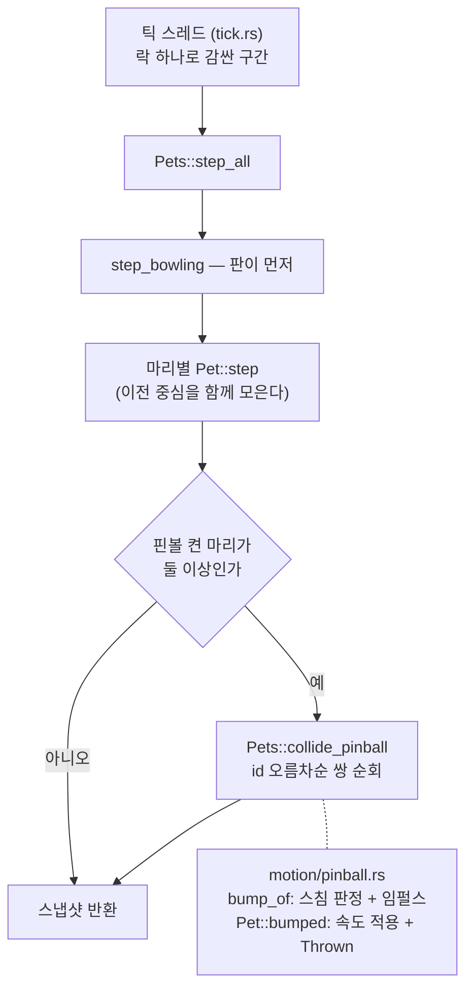
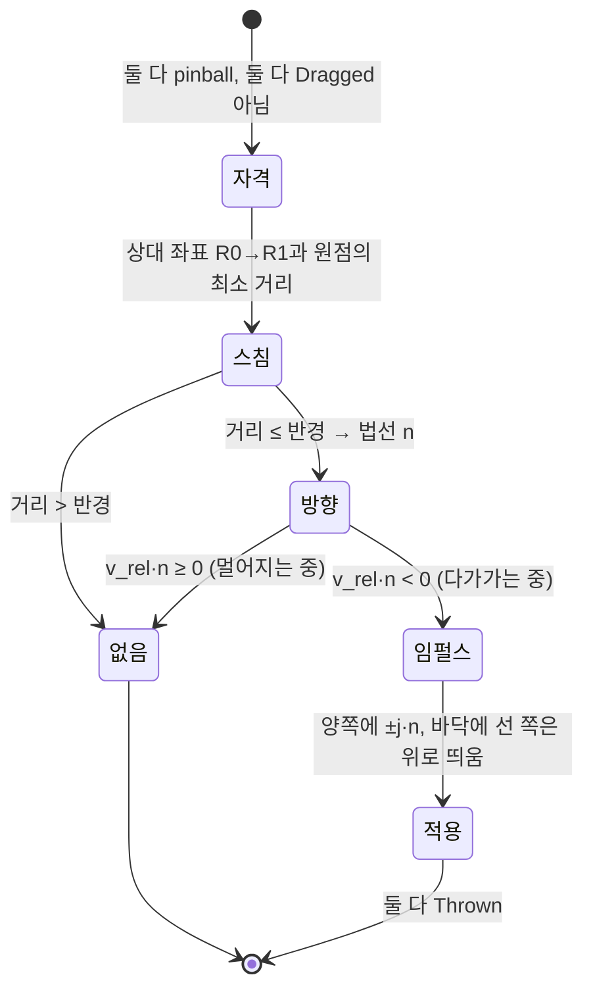

# 핀볼 모드에서 마리끼리 부딪히기

## Goal Capsule

- **목표** — 핀볼 모드에서 날아다니는 펭귄들이 **서로를 통과하지 않는다.** 부딪히면 **양쪽 다**
  방향과 속도가 바뀌어 튕겨 나간다. 근거: PRD §5.8("앱 전역이다 — 여덟 마리를 켜 놨으면
  여덟 마리가 전부 튄다")의 미완성 부분을 채운다. §5.8에 한 줄을 더하고 `MOTIONS.md` 핀볼
  절에 문단 하나를 더한다. **점수·목숨·판은 넣지 않는다** (PRD §4 게임화 비목표).
- **권위 순서** — `PRD > PRINCIPLE > CONVENTIONS > MOTIONS > 이 플랜`. 충돌하면 상위가 이기고,
  상위와 어긋나는 구현이 필요해지면 멈추고 보고한다.
- **실행 프로필** — 브랜치 `feat/f3-pinball-pet-collision-01`, PR 하나(`TODO.md` 체크박스 하나).
  TDD는 코어(`src-tauri/src/pet/`)의 판정·물리에 적용하고 테스트 이름은 한국어다. 커밋은
  한국어 Angular 컨벤션. **`src-tauri/src/pet_bridge/commands.rs`의 `pet_whack`,
  `src-tauri/src/pet/motion/react.rs`, `tuning.rs`의 "던지기"·"착지" 절은 건드리지 않는다** —
  다른 작업(스윙 넉백)이 같은 시각에 거기서 돈다.
- **정지 조건** — 아래 중 하나라도 걸리면 멈추고 보고한다.
  - `Pet::step`의 시그니처를 고쳐야만 판정이 된다 → 모든 모션 함수·테스트를 고치는 대공사다.
  - 판정이 `pick_next`의 난수 소비 순서를 바꿔야 한다 → 골든 수열 재기준화가 필요하다는 뜻이고,
    이 항목은 그럴 이유가 없다.
  - `tick.rs` 3단계 주석의 회수 조건(락 보유 시간·`apply` 지연)이 실제로 발동한다 → 틱 구조를
    바꾸는 일은 이 PR 범위 밖이다.
  - 소유 경계 밖 파일(위 목록)을 고쳐야만 한다.
- **꼬리 작업** — `.github/TEMPLATE/PR.md`로 PR을 연다. **merge하지 않는다.** 같은 PR에
  `PRD.md`(§5.8 한 줄)·`MOTIONS.md`(핀볼 절)·`TODO.md`(체크박스 하나)를 넣는다.
  `npm run tauri dev` 스모크는 다른 에이전트와 `single-instance`가 겹쳐 돌리지 않고, PR
  "테스트" 절에 수동 확인 체크리스트를 적는다.

---

## Product Contract

### Summary

핀볼을 켜고 펭귄을 여러 마리 띄운 다음 하나를 채로 후려치면, 날아간 펭귄이 다른 펭귄에
꽂히면서 **둘 다** 튕겨 나간다. 서 있던 펭귄은 얻어맞고 날아가고, 친 펭귄은 속도를 잃고
비껴간다. 벽·천장·바닥에 이어 **다른 펭귄도 범퍼가 된다** — 여덟 마리를 띄우면 한 번의
타격이 연쇄를 만든다.

### Problem Frame

핀볼 모드는 "여덟 마리가 동시에 튄다"를 팔지만 지금 그 여덟 마리는 **서로를 모른다.**
정면으로 겹쳐 지나가도 아무 일이 없다. 판의 모든 면이 반사면인데 화면에서 가장 큰
움직이는 물체(다른 펭귄)만 유령이라, 마릿수를 늘릴수록 "통과했다"는 사실이 눈에 띈다.

이걸 막고 있던 것은 구조였다 — 마리별 `step` 루프가 브릿지에 있어서 한 마리의 `step`이
다른 마리를 볼 자리가 없었다. #44에서 루프를 `Pets::step_all`로 끌어올렸고 #45(볼링)가 그
자리에서 전 마리를 가로지르는 판정을 처음 돌렸다. 이 항목은 그 자리를 쓰는 두 번째 소비자다.

### Requirements

| ID | 요구사항 |
|---|---|
| R1 | 핀볼 모드가 **켜져 있을 때만** 마리끼리 부딪힌다. 끄면 지금처럼 그대로 통과한다 |
| R2 | 부딪히면 **양쪽 다** 속도가 바뀌고 양쪽 다 움직인다. 한쪽만 날아가지 않는다 |
| R3 | 한 틱에 수백 px을 날아가도 **서로를 뛰어넘지 않는다** — 지나온 경로로 판정한다 |
| R4 | **다가가는 중일 때만** 부딪힌다. 이미 멀어지는 중인 쌍은 다시 튕기지 않는다 |
| R5 | 부딪힘으로 **속도의 총량이 늘지 않는다** — 반발 계수가 1보다 작다 |
| R6 | 서 있거나 걷는 두 마리는 서로를 밀지 않는다. 겹쳐 서 있어도 떨리지 않는다 |
| R7 | 들려 있는(`Dragged`) 마리는 부딪히지 않는다 — 사용자의 손이 잡고 있다 |
| R8 | 판정이 **난수를 한 번도 쓰지 않는다.** 골든 수열(동작 시퀀스)이 그대로여야 한다 |
| R9 | 마릿수 상한 8에서 판정 비용이 20Hz 틱과 락 보유 시간에 유의미하게 붙지 않는다 |
| R10 | 점수·목숨·연쇄 횟수를 세지도 보여주지도 않는다 (PRD §4) |

### Acceptance Examples

**AE1 — 한 마리가 다른 마리를 날린다**
Given 핀볼이 켜져 있고 펭귄 둘이 바닥에 나란히 서 있다
When 왼쪽 펭귄을 아래에서 오른쪽 위로 후려쳐 오른쪽 펭귄에게 날린다
Then 오른쪽 펭귄이 맞고 날아가고(`Thrown`), 왼쪽 펭귄도 속도를 잃고 방향이 꺾인다.
둘 다 움직인다.

**AE2 — 정면충돌**
Given 핀볼이 켜져 있고 펭귄 둘이 서로를 향해 같은 속도로 날아간다
When 두 마리가 만난다
Then 둘 다 왔던 쪽으로 튕겨 나간다. 어느 쪽도 상대를 통과하지 않는다.

**AE3 — 빠르게 지나가기**
Given 한 틱(최대 250ms)에 화면을 가로지르는 속도로 한 마리가 다른 마리 쪽으로 날아간다
When 그 틱이 지난다
Then 시작 위치도 끝 위치도 상대의 반경 밖이지만 **부딪힌 것으로 판정된다.**

**AE4 — 핀볼을 끄면 그대로**
Given 핀볼이 꺼져 있다
When 던진 펭귄이 다른 펭귄을 관통한다
Then 아무 일도 일어나지 않는다. 지금과 완전히 같다.

**AE5 — 서 있는 두 마리**
Given 핀볼이 켜져 있고 펭귄 둘이 겹칠 만큼 가까이 서서 걷고 있다
When 시간이 흐른다
Then 둘 다 평소처럼 걷는다. 서로를 밀어내며 떨지 않는다.

### Scope Boundaries

**비목표**

- 점수·콤보·연쇄 카운터 (PRD §4). 부딪힘은 물리이지 성적이 아니다.
- 핀볼이 꺼진 평소 세계의 마리 간 충돌. 평소에는 겹쳐 서는 것이 정상이고, 거기에 물리를
  넣으면 걷는 펭귄들이 서로를 밀어내며 붙어 다닌다.
- 회전·마찰·질량 차이. 전부 같은 질량의 원 하나로 본다.
- 위치 밀어내기(overlap resolution). 겹친 것을 억지로 떼어놓지 않는다 — R4(다가갈 때만)가
  이중 타격을 막으므로 필요가 없고, 위치를 손대면 `clamp`·창 이동과 다툰다.

**Deferred to Follow-Up Work**

- **부딪힘 효과음.** 소리 자격 규칙(`MOTIONS.md` 효과음 절)의 새 예외가 필요하다 —
  "사용자가 방금 한 짓의 결과"이긴 하나 한 번의 타격이 여러 번 울린다. 별도 판단이 필요해
  이 PR에 넣지 않는다.
- **들고 있는 펭귄으로 다른 펭귄 치기.** `Dragged`를 채로 쓰는 것은 재미있을 수 있지만
  한쪽만 속도를 받는 비대칭 판정이라 설계가 다르다 (R7에서 제외했다).
- **부딪힘 전용 그림.** 지금은 `Thrown`의 기존 그림을 그대로 쓴다. 새 `pg--*` 클래스를
  만들지 않으므로 CSS·`pet-css.test.ts` 변경이 없다.

---

## Planning Contract

### Key Technical Decisions

**KTD1 — 판정 자리는 `Pets::step_all`이고 `Pet::step`의 시그니처는 그대로 둔다.**
`step_all`이 전 마리를 가로지르는 유일한 자리다(#44). 다른 마리를 `step`의 인자로 넘기면
모든 모션 함수와 그 테스트를 고쳐야 한다 — 핀볼 플래그를 인자가 아니라 필드로 둔 것과
같은 이유다. `Pets`에 붙는 새 메서드는 `step_all` **바로 옆**에 둔다.

**KTD2 — 판정은 `step` 뒤에, 스냅샷 확정 전에 한다.**
순서는 `step_bowling` → 마리별 `step`(이때 각 마리의 **이전 중심**을 함께 모은다) →
마리 간 충돌 해소 → 부딪힌 마리의 스냅샷만 갱신. `step` 전에 판정하면 이번 틱의 이동을
못 보고, 스냅샷을 안 갱신하면 웹뷰가 한 틱 늦은 동작을 그린다.
`Pet`에 `last_x`가 없으므로 **이전 위치는 `step_all`이 로컬로 들고 있는다** — `Pet`에
필드를 더하면 `Snapshot` 동치성 테스트가 보는 상태가 늘어난다.

**KTD3 — 스침 판정은 상대 운동으로 접는다.**
두 마리가 각각 한 틱에 수백 px을 움직이므로 "지금 위치"만 보면 서로를 뛰어넘는다 —
볼링에서 실제로 밟은 함정이고(#45) 거기서 `dist2_to_segment`가 나왔다. 다만 볼링은
*움직이는 하나 → 서 있는 여럿*이라 점 하나와 선분 하나였는데, 여기서는 **둘 다 움직인다.**
두 선분의 최소 거리를 새로 짜는 대신 **상대 좌표로 옮긴다**: `R(t) = (A(t) - B(t))`는
`t∈[0,1]`에서 직선이므로, 원점과 선분 `R0 → R1` 사이의 거리가 곧 두 마리의 최근접 거리다.
그러면 `dist2_to_segment(원점, R0, R1)`을 **그대로 재사용**할 수 있고, 그 함수가 돌려주는
최근접점이 곧 충돌 법선(B에서 A로 향하는 방향)이다. 새 기하 함수를 만들지 않는다.

**KTD4 — 임펄스는 질량이 같은 1차원 탄성 충돌이다.**
법선 `n`(B→A 단위벡터), 상대속도 `v_rel = v_A - v_B`에 대해
`j = -(1 + e)·(v_rel·n) / 2`, `v_A' = v_A + j·n`, `v_B' = v_B - j·n`.
`e = PINBALL_BUMP_DAMPING < 1`이므로 **에너지가 늘지 않는다**(R5). 접선 성분은 건드리지
않아 스치면 스친 만큼만 꺾인다. `v_rel·n < 0`(다가가는 중)일 때만 적용한다 — 이 한 줄이
겹쳐 있는 쌍의 이중 타격과 진동을 통째로 막으므로 **위치 밀어내기가 필요 없다**(R4).

**KTD5 — 서 있는 마리가 맞으면 위로 조금 띄운다.**
바닥에 선 마리는 `vy`가 0이라 수평 임펄스만 받으면 다음 틱에 곧바로 다시 착지한다 —
한 틱 미끄러지고 끝나 **맞은 것이 안 보인다.** 그래서 공중에 있지 않은 마리에 한해
결과 속도의 크기 중 `PINBALL_BUMP_LIFT` 비율을 위쪽으로 돌린다. 속도를 더하는 것이 아니라
방향을 트는 것에 가깝고, 최종 속도는 기존 `clamp_throw`로 세계 폭 상한에 걸린다.

**KTD6 — 난수를 한 번도 쓰지 않는다.**
판정·임펄스·진입이 전부 결정적 산술이다. `pick_next`의 확률 사다리를 건드리지 않으므로
**골든 수열 재기준화가 없다**(R8). `TODO.md`에 여섯 번 기록된 재기준화를 일곱 번째로
만들지 않는 것이 이 설계의 제약 조건 중 하나다.

**KTD7 — 반경은 `PET_SIZE`가 아니라 몸통이다.**
창은 140px 정사각형이지만 펭귄 그림은 그보다 좁다. 중심 간 `PINBALL_COLLIDE_RADIUS`(104)를
쓰고 `assert!`로 `PET_SIZE/2 < 반경 < PET_SIZE`에 묶는다 — 크면 안 닿았는데 튕기고,
`PET_SIZE/2`보다 작으면 완전히 겹쳐야 튕긴다.

**KTD8 — `tick.rs`의 회수 조건은 발동하지 않는다.**
3단계 주석이 "마리 간 판정이 들어와 `step_all`이 무거워지면 다시 본다"고 적어 두었다.
확인 결과 **발동하지 않는다**: (1) 상한이 8마리이므로 쌍은 최대 `8·7/2 = 28`개이고 쌍마다
드는 것은 부동소수 30여 번의 산술뿐이다 — IPC도, 할당도, 시스템 호출도 없다.
(2) 늘어나는 할당은 마리당 좌표 하나(최대 8개)를 담는 `Vec` 하나뿐이고 `step_all`이 이미
같은 크기의 결과 `Vec`을 만든다. (3) 락을 쥐고 하는 일의 기존 비용은 마리별 `step`
자체이고, 판정은 그 위에 상수배 이하로 얹힌다. 50ms 틱과 비교할 수 있는 규모가 아니다.
구현 중 8마리 1,000틱 측정치를 PR에 숫자로 남기고, 주석에는 "확인했고 발동하지 않았다"는
결론과 근거를 덧붙인다 — **`apply`를 락 안으로 옮기는 등 틱 구조는 바꾸지 않는다.**

**KTD9 — 부딪힌 마리는 `Thrown`이 된다. 새 동작을 만들지 않는다.**
볼링의 `bowling_knocked`가 같은 선택을 했고 근거도 같다 — 포물선·벽 튕김·착지 갈래를
한 벌만 유지한다. 새 `Behavior`를 만들면 CSS(`pg--*`)·`ALL_BEHAVIORS`·`behavior.rs`의
일곱 자리가 전부 따라온다.

### Assumptions

- **핀볼은 앱 전역 설정이라 마리마다 값이 같다** (PRD §5.8). 그래도 판정은 **쌍의 양쪽 모두**
  `pinball`일 때만 한다 — 필드가 마리마다 있으므로 한쪽만 켜진 상태를 코어가 스스로 방어한다.
- 반발 계수 0.9와 반경 104는 "보기에 어떤가"로 정한 값이고 실물 확인 뒤 조정될 수 있다.
  `tuning.rs` 한 자리에 있으므로 조정 비용은 상수 한 줄이다.
- 프로덕션 세계는 화면 하나다(PRD §5.2). 화면이 여럿이어도 좌표가 같은 세계 좌표계라
  판정 자체는 그대로 돌아간다.

### High-Level Technical Design

쌍 하나의 판정:

---

## Implementation Units

### U1. 튜닝 상수와 충돌 물리 (실패 테스트 먼저)

**Goal** — 쌍 하나의 스침 판정과 임펄스가 순수 함수로 돌아간다.

**Requirements** — R2, R3, R4, R5, R7, KTD3, KTD4, KTD5, KTD7

**Dependencies** — 없음

**Files**
- `src-tauri/src/pet/tuning.rs` — **"── 핀볼 모드 ──" 절 안에만** 상수 셋을 더한다
  (`PINBALL_COLLIDE_RADIUS`, `PINBALL_BUMP_DAMPING`, `PINBALL_BUMP_LIFT`)와 관계 `assert!`
- `src-tauri/src/pet/motion/pinball.rs` — 스침 판정(`bump_of`)과 적용(`Pet::bumped`)
- `src-tauri/src/pet/motion/pinball_tests.rs` — 테스트

**Approach**
- `bump_of(a, a_prev, b, b_prev)`는 두 마리의 **이전 중심 → 지금 중심**을 받아 상대 좌표로
  접고(`R0 = a_prev - b_prev`, `R1 = a_now - b_now`) `dist2_to_segment((0,0), R0, R1)`로
  최근접 거리와 최근접점을 구한다. 최근접점이 곧 법선 방향이다. 정확히 겹쳤으면(길이 0)
  상대속도의 반대 방향으로, 그것도 0이면 판정하지 않는다.
- 자격 검사도 여기에 둔다: 둘 다 `pinball`, 둘 다 `Dragged`가 아니어야 한다.
- 적용은 `Pet::bumped(now_ms, nx, ny, j, world_width)` **하나**로 양쪽에 쓴다 — 상대에게는
  법선을 뒤집어 넘긴다. 대칭을 코드 모양으로 못 박아 한쪽만 움직이는 실수를 막는다.
- `bumped`는 `air`가 아닐 때 KTD5의 띄우기를 적용하고(`enter`가 `air`를 켜기 **전에**
  본다), `clamp_throw`로 상한을 건 뒤 `enter(Behavior::Thrown, now_ms)`를 부른다.
- **난수를 부르지 않는다** (`range`·`next_u64`·`fraction` 금지).

**Patterns to follow** — `Pet::flip`(같은 파일, 방향 정규화·`facing`·`Thrown` 진입),
`Pet::bowling_knocked`(`motion/bowling.rs`, 겹쳤을 때의 대체 방향), `clamp_throw`(`motion/air.rs`).

**Execution note** — 실패 테스트를 먼저 쓴다. 임펄스 부호를 뒤집어 쓰면 "맞은 쪽이 때린 쪽으로
빨려 들어가는" 그림이 나오는데 눈으로는 한참 뒤에야 보인다.

**Test scenarios**
- `마주_보고_날아오면_양쪽_다_튕겨_나간다` — 같은 속도로 정면충돌 → 둘 다 부호가 뒤집힌다 (AE2)
- `한쪽만_날아와도_맞은_쪽이_밀려난다` — 정지한 쪽이 때린 쪽의 진행 방향으로 속도를 얻는다 (AE1)
- `부딪혀도_속도의_합이_커지지_않는다` — 충돌 전후 속력 합 비교 (R5)
- `멀어지는_중이면_부딪히지_않는다` — 반경 안에 있어도 상대속도가 벌어지는 쌍은 무시 (R4)
- `빠르게_지나가도_이웃을_뛰어넘지_않는다` — 한 틱에 반경의 몇 배를 지나가는 경로 (AE3, R3)
- `바닥에_선_마리는_맞으면_뜬다` — 수평 타격인데 결과 `vy < 0` (KTD5)
- `핀볼이_꺼진_쌍은_부딪히지_않는다` (R1)
- `들려_있는_마리는_부딪히지_않는다` (R7)
- `정확히_겹쳐도_속도가_NaN이_되지_않는다` — 0으로 나누기 방어

**Verification** — `cd src-tauri && cargo test`

### U2. `Pets::step_all`에 판정을 얹는다

**Goal** — 매 틱 전 마리 쌍을 훑어 부딪힘을 해소하고, 바뀐 마리의 스냅샷을 갱신한다.

**Requirements** — R1, R2, R6, R8, R9, KTD1, KTD2, KTD6

**Dependencies** — U1

**Files**
- `src-tauri/src/pet/mod.rs` — `step_all` 및 그 **바로 옆**에 붙는 `collide_pinball`
- `src-tauri/src/pet/motion/pinball_tests.rs` — `Pets` 수준 테스트

**Approach**
- `step_all`의 기존 루프에서 `pet.step` **직전에** `(id, 중심, 세계 폭)`을 로컬 `Vec`에
  모은다. 세계 폭을 함께 담아 두면 `world_of` 클로저를 두 번 부르지 않는다.
- 루프가 끝나면 핀볼 켠 마리가 둘 이상일 때만 `collide_pinball`을 부른다 — 꺼져 있으면
  기존 경로와 **한 줄도 다르지 않게** 빠져나가야 한다(동치성 테스트가 이걸 본다).
- 쌍 순회는 `Vec`의 인덱스 이중 루프(`i < j`)다. `ids()`가 id 오름차순이므로 순서가
  결정적이고, 앞선 쌍의 결과가 뒤 쌍에 반영되는 순차 해소가 된다.
- **락을 다시 잡지 않는다**: 순회 대상은 이미 `let`으로 받은 로컬 `Vec`이고, `Pets`
  안에서는 `&mut self.pets`만 쓴다. (`for x in <락>.f()` 함정은 브릿지 쪽 이야기지만
  같은 규칙 — 꺼낸 것을 먼저 `let`으로 받는다.)
- 부딪힌 id의 스냅샷만 `stepped`에서 교체한다.

**Patterns to follow** — `Pets::step_bowling`(같은 파일, 전 마리를 가로지르는 선례와
`let Self { pets, .. } = self` 분해), `dist2_to_segment` 재사용 방식.

**Test scenarios**
- `핀볼에서_날아온_마리가_서_있는_마리를_날린다` — `Pets` 둘, 한 마리를 던져 통과 경로에
  두고 step_all을 돌리면 둘 다 `Thrown`이 된다 (AE1)
- `핀볼을_끄면_그냥_통과한다` — 같은 상황에서 위치·동작이 그대로다 (AE4, R1)
- `걷는_두_마리는_서로를_밀지_않는다` — 겹쳐 세워 두고 여러 틱, 동작이 `Thrown`이 되지 않는다 (AE5, R6)
- `부딪혀도_난수를_쓰지_않는다` — 충돌 전후 `rng` 필드가 같다 (R8, KTD6)
- `여덟_마리가_뒤엉켜도_결국_멎는다` — 상한 마릿수로 오래 돌려 좌표·속도가 유한하고 끝내
  날아다니는 마리가 없다 (R5, R9)

**Verification** — `cd src-tauri && cargo test`. 8마리 1,000틱을 한 번 재서 판정 비용을
숫자로 확인한다(KTD8).

### U3. 문서 갱신

**Goal** — PRD·MOTIONS·TODO가 구현과 맞는다.

**Requirements** — R10, KTD8

**Dependencies** — U2

**Files**
- `PRD.md` — §5.8에 "다른 펭귄도 범퍼다" 한 줄. §4는 고치지 않는다
- `MOTIONS.md` — 핀볼 절에 문단 하나(양방향·스침 판정·다가갈 때만·소리 없음)
- `TODO.md` — 해당 체크박스 하나를 체크하고 결과를 요약
- `src-tauri/src/pet_bridge/tick.rs` — 3단계 주석의 회수 조건에 결론 한 문장

**Approach** — 문서에는 **왜 이렇게 정했는지**를 남긴다. 특히 "다가갈 때만 부딪힌다"가
위치 밀어내기를 대체한다는 것과, 소리를 넣지 않은 이유(자격 규칙의 새 예외가 필요하다)를
적어 다음 사람이 같은 논의를 처음부터 하지 않게 한다.

**Test expectation:** none — 문서 변경이다. `pet-css.test.ts`가 보는 `ALL_BEHAVIORS`는
새 동작이 없으므로 바뀌지 않는다.

**Verification** — `npm test`와 `cargo test`가 둘 다 통과한다.

---

## Verification Contract

| 게이트 | 명령 | 판정 |
|---|---|---|
| Rust 단위 테스트 | `cd src-tauri && cargo test` | 전부 통과. **기존 테스트를 고치지 않는다** |
| 프론트 단위 테스트 | `npm test` | 전부 통과 (프론트 변경 없음 — 회귀 확인) |
| 타입 검사 | 해당 없음 | 프론트를 고치지 않으면 건너뛴다 |
| 개발 스모크 | 돌리지 않는다 | `single-instance`가 다른 작업과 겹친다. 수동 체크리스트로 대체 |
| 코드 리뷰 | `ce-code-review` | 지적 반영 후 두 러너 재실행 |

**수동 확인 체크리스트** (PR "테스트" 절에 그대로 옮긴다)

1. 설정에서 펭귄을 3~4마리로 늘리고 **핀볼을 켠다.**
2. 한 마리를 아래에서 후려쳐 다른 마리 쪽으로 날린다 → **맞은 쪽이 날아가고 친 쪽도 꺾인다.**
3. 두 마리를 각각 서로를 향해 날린다 → 정면에서 둘 다 튕겨 나온다.
4. 여덟 마리로 늘려 마구 친다 → 연쇄로 튀지만 **결국 전부 멎고** 앱이 굳지 않는다
   (버튼이 반응하는지 확인 — 락 관련 굳음의 유일한 증상이다).
5. **핀볼을 끈다** → 던진 펭귄이 다른 펭귄을 그대로 통과한다. 착지 네 갈래가 돌아온다.
6. 핀볼을 켠 채 펭귄 둘을 겹치게 **드래그해 놓는다** → 손에 든 것은 밀리지 않고, 놓은
   뒤에도 서 있는 둘이 서로를 밀며 떨지 않는다.

## Definition of Done

- U1~U3이 커밋되어 있고 `TODO.md` 체크박스가 체크돼 있다.
- `cargo test`·`npm test`가 통과한다. **기존 테스트를 고치지 않았다** (`core_tests.rs`의
  동치성 테스트가 그대로 통과한다 = 핀볼이 꺼진 경로가 안 바뀌었다).
- 골든 수열 재기준화가 없다.
- `ce-code-review`의 지적이 반영됐거나 PR "비고"에 이유가 적혀 있다.
- PR이 열려 있고 **merge하지 않았다.**

---

## Sources & Research

- `docs/plans/2026-09-02-021-feat-bowling-plan.md` — 이음매(`step_all`)와 연쇄 판정의 선례
- `src-tauri/src/pet/bowling.rs` `dist2_to_segment` — 스침 판정의 재사용 대상 (#45)
- `src-tauri/src/pet_bridge/tick.rs` 3단계 주석 — 회수 조건 (KTD8)
- `CLAUDE.md` 함정 목록 — `for x in <락>.f()` 자기 데드락, `@keyframes` 이름 중복
- PRD §4(게임화 비목표)·§5.8(핀볼)·§5.2(세계), `MOTIONS.md` 핀볼 절
