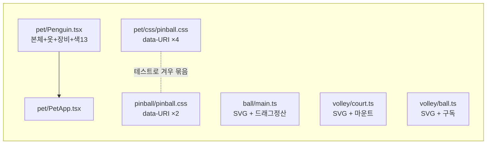
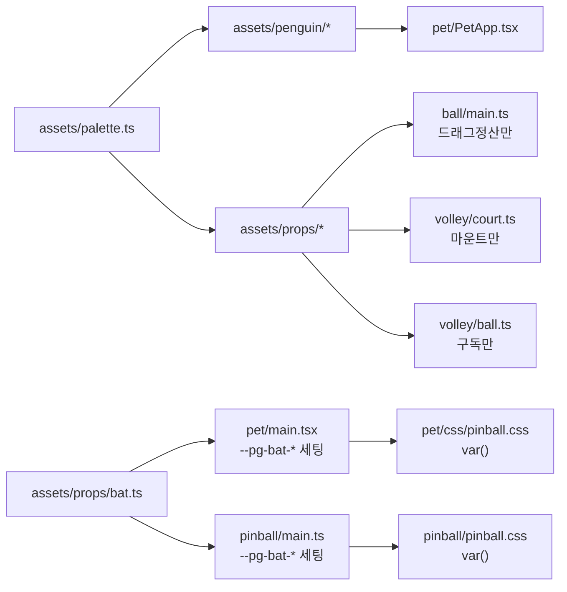

# SVG 에셋을 `src/assets/`로 모으기 — Plan

## Goal Capsule

- **목표** — 로직 파일 사이에 흩어진 SVG 그림과 색을 `src/assets/` 한 곳으로 모은다.
  **그림 변경 0의 순수 이동**이다. 사용자의 불만은 둘이다: *"SVG asset들이 코드 사이에
  섞여있으니까 디자인 수정 및 관리도 어렵고, 펭귄도 어딨는지 몰라서 관리가 힘들다."*
- **`TODO.md`에 열린 체크박스가 없다** — 이 작업은 새 항목이다. 동작이 안 바뀌는
  리팩터링이라 PRD 개정은 필요 없고, 020(`pet.rs`·`pet_bridge.rs`·`pet.css` 쪼개기)과
  같은 성격이다. 항목 문구는 아래 "TODO.md 항목 제안"에 있다 — **사용자 승인 후** 추가한다.
- **권위 순서** — `PRD > PRINCIPLE > CONVENTIONS > MOTIONS > 이 플랜`. 충돌하면 상위가
  이기고, 상위와 어긋나야만 구현이 되면 멈추고 보고한다.
- **실행 프로필** — 브랜치 `refactor/asset-registry-01`을 `main`에서 판다. 커밋은 한국어
  Angular 컨벤션, 유닛 하나가 커밋 하나. **TDD는 U1에만 적용한다** — U1이 회귀 그물을
  먼저 치고, U2~U6은 그 그물 아래에서 옮기기만 한다.
- **정지 조건** — 하나라도 걸리면 멈추고 보고한다.
  1. 어느 유닛 끝에서든 U1의 렌더 스냅샷이 깨진다 (= 그림이 바뀌었다 = 순수 이동이 아니다).
  2. 기존 테스트 **이름**이 하나라도 사라지거나 바뀐다 (경로 상수·메커니즘 변경은 허용, 이름은 불변).
  3. 옮기기만 하려던 자리에서 그림을 고쳐야만 통과한다.
  4. `npm run build`가 잡는 타입 오류가 이동으로 설명되지 않는다.
- **꼬리 작업** — `.github/TEMPLATE/PR.md`로 PR을 연다. `TODO.md` 항목 추가+체크,
  `CLAUDE.md` 구조 트리 갱신을 **같은 PR에** 넣는다. **merge는 두 러너 통과 + 리뷰 반영
  뒤에 에이전트가 해도 된다** (2026-08-30 사용자 지시).

---

## Product Contract

### 문제 (Problem Frame)

그림이 그림의 자리에 없다. 지금 SVG를 고치려면 **어느 로직 파일 안에 문자열로 박혀
있는지를 먼저 찾아야** 하고, 색은 파일마다 지역 상수라 톤을 한 번에 못 바꾼다.
가장 나쁜 것은 방망이다 — 같은 그림이 **일곱 벌**(TSX 1 + CSS data-URI 6) 있고
그중 여섯은 복붙이며, **이미 색이 갈라졌다.**

측정된 실태:

| 자리 | 무엇이 | 문제 |
|---|---|---|
| `src/pet/Penguin.tsx` (285줄) | 펭귄 본체 + 훌라 옷 + 방망이 + 낚싯대·찌·물고기·얼음구멍, 색 상수 13개 | **에셋 6~7개가 한 파일에.** "옷만 고치기"가 285줄을 뒤지는 일이 된다 |
| `src/ball/main.ts` (166줄) | 볼링공 SVG | 포인터 드래그 정산 로직과 같은 파일 |
| `src/volley/court.ts` (92줄) | 모래사장 + 네트 SVG, 색 상수 4개 | 마운트 로직과 같은 파일 |
| `src/volley/ball.ts` (51줄) | 비치볼 SVG | 색이 상수도 아닌 **인라인 리터럴** |
| `src/pet/css/pinball.css` ×4, `src/pinball/pinball.css` ×2 | 커서 방망이 data-URI | **같은 그림 6번 복붙.** 색(`#d59a55`/`#6b4520`/`#3a2a1a`)이 펭귄이 든 방망이(`#a1712f`/`#26262b`)와 **다르다** |
| `src/pet/css/speech.css:28` | `#1b1f24` | `INK`와 같은 값인데 별개 리터럴 |

**중복이 이미 문제였다는 증거가 코드에 있다.** `src/pinball/pinball-css.test.ts`의
`판과_펭귄의_방망이가_같은_그림이다`는 두 CSS의 data-URI 집합이 같은지 대조하는
테스트다 — 위험을 없애는 대신 **테이프를 붙여 둔 것**이고, 이 플랜이 그 위험을
구조적으로 없앤다.

### 요구사항

- **R1** — 그림과 색이 `src/assets/` 아래에 있고, 도메인 이름으로 찾을 수 있다
  ("펭귄 옷" → `src/assets/penguin/hula.tsx`).
- **R2** — 색이 `src/assets/palette.ts` 한 곳에 있다.
- **R3** — 방망이 그림의 원천이 **하나**다. 복붙본이 없다.
- **R4** — **그림이 한 픽셀도 안 바뀐다.** 사용자 눈에 보이는 변화 0.
- **R5** — 기존 테스트 313개의 **이름이 전부 살아남는다.** 이 테스트들은 실제 회귀를
  잡아 온 것들이다("갑바" 되돌림, 물결 오버슈트, `T` 명령 누적, 갑바 테두리 누락).
- **R6** — 로직 파일에는 로직만 남는다. `src/volley/ball.ts`는 상태 구독,
  `src/ball/main.ts`는 드래그 정산, `src/volley/court.ts`는 마운트.

### 성공 기준

1. `npm test` — **313 + 신규 N개**, **기존 이름 0개 소실**.
2. `cargo test` — 423 통과 (Rust는 손대지 않는다; 손대야 하면 정지 조건 3).
3. `npm run build` — 타입·번들 통과.
4. 개발 스모크에서 여섯 그림이 전부 눈으로 확인된다 (아래 Verification Contract).

### 범위 밖 (Scope Boundaries)

**이번에 안 한다:**

- **방망이 색 통일** — KTD5. 순수 이동을 깨고, 커서가 작아서 밝은 것이 의도일 수 있다.
- **`src/pet/css/speech.css:28`의 `#1b1f24`를 팔레트로 끌어오기** — CSS는 TS를 못 부른다.
  제대로 하려면 `base.css`에 `--pg-ink`를 두고 팔레트 값과 대조하는 검사를 붙여야
  하는데(`pet-css.test.ts`의 CSS↔Rust 대조와 같은 꼴), **색 하나 때문에 새 대조
  기계를 들이는 것**은 이번 요청이 아니다.
- **`.svg` 파일로 빼기 / `vite-plugin-svgr` 도입** — KTD1에서 기각.
- **`assets/penguin-icon.png`(트레이 아이콘) 이동** — 레포 루트의 빌드 산출물 입력이고
  `src-tauri`가 참조한다. 웹뷰 그림이 아니다.

**후속으로 남긴다 (`TODO.md`에 한 줄씩):**

- 방망이 색 두 벌(`BAT_WOOD` vs `CURSOR_BAT_WOOD`)을 통일할지 정한다.
- `speech.css`의 `#1b1f24`를 `--pg-ink`로 빼고 팔레트와 대조할지 정한다.

---

## Planning Contract

### Key Technical Decisions

#### KTD1 — `.svg` 파일이 아니라 TS/TSX 모듈로 모은다

`src/assets/` 아래를 `.ts`/`.tsx`로 둔다. 근거 셋:

1. **이 앱의 SVG는 정적 그림이 아니라 CSS 애니메이션의 대상이다.** `.pg-wing-near`,
   `.pg-luau-top` 같은 클래스가 `src/pet/css/` 13개 파일에서 참조된다 — 클래스와
   도형 구조가 계약이다.
2. **테스트가 TS 소스 텍스트를 읽는다.** `pet-css.test.ts`는 JSX 식별자
   (`stroke={STRAW_DARK}`, `fill={STRAW}`)를 세고, `volley.test.ts`는
   `preserveAspectRatio="none"`·`viewBox="0 0 96 85"`·경로 `d`를 grep한다. `.svg`
   파일에는 `{STRAW_DARK}`가 없다 — R5를 정면으로 어긴다.
3. **커서 data-URI는 `.svg` 파일로 대체 불가다.** 각도별 두 벌이 CSS `url()` 안에
   인코딩돼 들어가야 한다. 새 의존성 없이 되는 것은 TS 생성뿐이다 (KTD4).

#### KTD2 — 이동과 쪼개기를 다른 커밋으로 나눈다

펭귄은 **먼저 통째로 옮기고**(U2), **그 다음 부위별로 쪼갠다**(U4). 한 커밋에 둘 다
하면 테스트가 경로 때문에 깨진 건지 그림이 바뀐 건지 구분이 안 된다. U2는 테스트
경로 상수만 바뀌고(메커니즘 불변), U4에서야 메커니즘이 바뀐다.

#### KTD3 — 순수 이동의 증거는 렌더 스냅샷이다

**아무것도 옮기기 전에**(U1) `<Penguin />`·`<Penguin female />`를 렌더해 직렬화한
DOM을 스냅샷으로 못 박는다. 문자열 SVG 셋(볼링공·비치볼·코트)도 마찬가지다.

이유: 두 러너와 타입 검사가 **전부 통과하면서 그림만 조용히 바뀔 수 있다.** 지금
있는 그림 검사는 훌라 상의 하나뿐이고, 나머지 도형의 `d` 하나가 틀려도 아무도 모른다.
이것은 이 레포가 이미 겪은 실패 유형이다 —
`docs/solutions/ui-bugs/duplicate-keyframes-silently-kills-animation.md`에서 굴러떨어지기
그림이 한 PR 내내 죽어 있었고 두 러너·타입 검사·리뷰가 전부 통과했다.

스냅샷은 리팩터링용 임시 비계가 **아니다** — 끝나고도 남겨서 그림의 회귀 그물로 쓴다.
`__snapshots__/`가 이 레포에 처음 생긴다.

#### KTD4 — 커서 방망이는 **런타임 CSS 커스텀 프로퍼티**로 넣는다

`src/assets/props/bat.ts`가 각도를 받아 data-URI를 만들고, 각 창의 엔트리가
시작할 때 `:root`에 `--pg-bat-cursor`·`--pg-bat-swing`을 세팅한다. CSS는
`cursor: var(--pg-bat-cursor, grab)`로 받는다.

기각한 대안:

- **(b) 인라인 `style`** — **`:active`를 인라인 스타일로 못 쓴다.** 휘두르는 프레임이
  바로 `:active`라 이 안은 성립 자체가 안 된다.
- **(c) 빌드 타임 생성 (Vite 플러그인·codegen)** — 생성된 CSS가 원본과 갈라져도
  아무 말도 안 하는 **새로운 조용한 실패 지점**이 생긴다. 이 레포는 같은 근거로 이미
  한 번 거절했다 (`TODO.md`: *"78개를 다 대조하려면 CSS를 파싱해야 하고, 그 파서가
  새로운 조용한 실패 지점이 된다"*).

**깜빡임은 안 생긴다.** 프로퍼티가 세팅되기 전에는 `var()`의 대체값(`grab`/`default`)이
쓰이는데, 그건 지금 CSS의 대체값과 **같다**.

**두 창이 각자 세팅한다.** 펭귄 창(React)은 `src/pet/main.tsx`에서, 핀볼 판(바닐라
18줄)은 `src/pinball/main.ts`에서. 창끼리 CSS를 공유하지 않는 것이 KTD8이고
이 방식이 그걸 지킨다.

#### KTD5 — 방망이 색은 이번에 통일하지 않는다

팔레트에 `BAT_WOOD`(`#a1712f`)와 `CURSOR_BAT_WOOD`(`#d59a55`)를 **둘 다** 이름
붙이고, 다르다는 사실을 주석으로 드러낸다. 통일은 후속으로 `TODO.md`에 남긴다.

근거: (1) 순수 이동(R4)을 깬다. (2) 커서는 48px에서 읽혀야 해서 밝은 것이 의도일 수
있다 — 눈으로 보고 정할 일이지 리팩터링이 몰래 정할 일이 아니다. **이름을 붙이는
것만으로도 이득의 대부분을 얻는다**: 지금은 두 색이 다르다는 사실 자체가 안 보인다.

#### KTD6 — `src/pet/Penguin.tsx`를 재수출 껍데기로 남기지 않는다

지우고 `src/pet/PetApp.tsx:4`의 import 하나를 고친다. 재수출을 남기면 펭귄이 있을
법한 자리가 둘이 되는데, 그게 정확히 사용자가 불평한 *"펭귄이 어딨는지 모르겠다"*이다.

#### KTD7 — `src/assets/props/`는 React를 쓰지 않는다

`penguin/`은 TSX(React), `props/`는 순수 문자열 TS다. 바닐라 창(핀볼·볼링공·코트·
비치볼)이 실수로 React를 끌어오면 그 번들에 React가 통째로 들어간다. **검사로 못
박는다** — `src/assets/props/*.ts`에 `react` import가 없어야 한다.

### Output Structure

```text
src/assets/
  palette.ts              모든 색 — 부위별 이름 (INK·SNOW·STRAW·SAND·MESH·BAT_*·…)
  penguin/
    index.tsx             Penguin 컴포넌트 조립 — 그리는 순서 = 겹치는 순서
    body.tsx              그림자·얼음구멍·꼬리·날개·발·몸통·머리·눈·부리
    hula.tsx              훌라 차림 — 치마·상의(암컷만)·레이
    gear.tsx              방망이·낚싯대·낚싯줄·찌·물고기
  props/
    bat.ts                방망이 한 소스 → 커서 data-URI(각도 인자)
    bowling-ball.ts       볼링공
    beach-ball.ts         비치볼
    court.ts              모래사장 + 네트
  assets.test.ts          그림 스냅샷 + props의 React 무의존 검사
  __snapshots__/
```

### High-Level Technical Design

**지금 — 그림이 로직 안에 있고 방망이가 일곱 벌이다**



**뒤 — 그림은 한 곳, 방망이는 한 소스**



### 테스트 결합 지도 — 이 리팩터링의 진짜 난이도

**기존 테스트가 파일 경로와 소스 텍스트에 단단히 묶여 있다.** 아래 표가 유닛 순서를
결정한 근거다. "메커니즘"으로 표시된 둘만 다시 짜고 나머지는 경로 상수만 바꾼다.

| 테스트 | 무엇을 읽나 | 이동 후 | 변경 |
|---|---|---|---|
| `핀볼_커서_규칙이_실제로_있다` | `PetApp.tsx` + `Penguin.tsx` 합본 | `PetApp.tsx` + `assets/penguin/*.tsx` | 경로 |
| `PetApp이 쓰는 클래스에 스타일이 있다` | 같은 합본에서 `pg-*` 수집 | 같음 | 경로 |
| `훌라_차림은_pg_all_안에_있다` | `indexOf("pg-all") < indexOf("pg-luau")` | `pg-all`은 `index.tsx`, `pg-luau`는 `hula.tsx` — **파일이 갈려 순서 비교가 무의미** | **메커니즘** → 렌더해서 `.pg-all`이 `.pg-luau`를 품는지 본다 (테스트 이름이 원래 말하던 것이고, 더 강하다) |
| `상의가_옷으로_읽히게_그려졌다` | `<g className="pg-luau-top">` 슬라이스 | `assets/penguin/hula.tsx` | 경로 |
| `상의_삼각형이_얕다` | 같음 | 같음 | 경로 |
| `중간에_썼던_이름이_안_남아있다` | `pg-straw` 부재 | 같음 | 경로 |
| `옷_색이_몸_색과_대비된다` | `const SNOW = "#…"` grep | `assets/palette.ts` | 경로 |
| `모래는_가로로만_늘어난다` 외 코트 4건 | `volley/court.ts`의 SVG 텍스트 | `assets/props/court.ts` | 경로 |
| `코트는_구독하지_않는다` | `volley/court.ts`에 `onVolleyState` 부재 | **마운트 파일에 그대로 적용** | 없음 (상수 분리만) |
| `공은_자기_창에만_묶인다` | `volley/ball.ts`의 `listen(` 부재 | 로직은 안 움직인다 | 없음 |
| `판과_펭귄의_방망이가_같은_그림이다` | 두 CSS의 data-URI 집합 대조 | data-URI가 CSS를 떠난다 | **메커니즘** → 두 CSS가 같은 `var(--pg-bat-*)`를 참조하는지 + 생성기가 두 프레임을 내는지 |
| `휘두르는_프레임이_따로_있다` | 두 data-URI가 다른가 | 같음 | **메커니즘** (위와 한 벌) |

---

## Implementation Units

### U1. 그림을 스냅샷으로 못 박는다 — 아무것도 옮기지 않는다

- **목표** — 이동의 정답지를 먼저 만든다. 이 커밋 뒤로 그림이 바뀌면 즉시 빨개진다.
- **요구사항** — R4, R5
- **의존** — 없다 (첫 유닛)
- **파일** — `src/assets/assets.test.ts`(신규), `src/assets/__snapshots__/`(생성됨)
- **접근** — `@testing-library/react`로 `<Penguin />`·`<Penguin female />`를 렌더해
  `container.innerHTML`을 스냅샷한다. 문자열 SVG 셋(`BALL_SVG` from `ball/main.ts`,
  `BALL_SVG` from `volley/ball.ts`, `SAND_SVG`·`NET_SVG` from `volley/court.ts`)도
  스냅샷한다. **이 유닛에서는 import 경로가 아직 옛 자리다** — U2 이후 경로만 바꾼다.
  - **볼링공만 접근이 다르다.** `ball/main.ts`는 `BALL_SVG`를 export하지 않고, import
    시 최상위에서 `document.getElementById`와 Tauri API를 부른다. `volley.test.ts`가
    이미 쓰는 방식을 그대로 쓴다 — `vi.mock`으로 `../lib/pet`을 막고
    `#ball-root`를 심어 import한 뒤, 렌더된 `.bw-ball`의 `outerHTML`을 스냅샷한다.
    **부작용을 피하는 대신 통과시켜 실제 렌더 결과를 본다** — U5가 지켜야 하는 것이
    바로 그 결과다. 프로덕션 코드는 한 줄도 안 바꾼다.
- **실행 노트** — 이 유닛은 **테스트만 추가한다.** 프로덕션 코드는 손대지 않는다.
- **테스트 시나리오**
  - `수컷_펭귄_그림이_그대로다` — `<Penguin />` 렌더 결과가 스냅샷과 같다.
  - `암컷_펭귄_그림이_그대로다` — `<Penguin female />` 렌더 결과가 스냅샷과 같다.
    (수컷과 달라야 한다 — 같은 스냅샷이 나오면 `female` 분기가 죽은 것이다. 두 결과가
    서로 다른지도 함께 단언한다.)
  - `볼링공_그림이_그대로다` — `#ball-root` 안 `.bw-ball`의 마크업이 스냅샷과 같다.
  - `비치볼_그림이_그대로다` — `BALL_SVG`가 스냅샷과 같다.
  - `모래사장_그림이_그대로다` — `SAND_SVG`가 스냅샷과 같다.
  - `네트_그림이_그대로다` — `NET_SVG`가 스냅샷과 같다.
- **검증** — `npm test`가 313 + 6 = **319**. 스냅샷 파일이 커밋에 포함된다.

### U2. 펭귄을 통째로 옮긴다

- **목표** — `src/pet/Penguin.tsx` → `src/assets/penguin/penguin.tsx`. **내용은 한 글자도
  안 바꾼다.**
- **요구사항** — R1, R4, R5
- **의존** — U1
- **파일**
  - 이동: `src/pet/Penguin.tsx` → `src/assets/penguin/penguin.tsx`
  - 수정: `src/pet/PetApp.tsx`(import 한 줄), `src/pet/pet-css.test.ts`(경로 7곳),
    `src/assets/assets.test.ts`(import 경로)
- **접근** — `git mv`로 옮겨 diff가 이동으로 읽히게 한다 (KTD6대로 재수출 껍데기는
  두지 않는다). `pet-css.test.ts`의 `readFileSync(resolve("src/pet/Penguin.tsx"))`
  7곳을 새 경로로 바꾼다 — **상수 하나로 묶어 두면** U4에서 다시 흩어 고칠 일이 없다.
- **패턴** — 020 리팩터링과 같다: `git diff -M`이 이동으로 읽혀야 한다.
- **테스트 시나리오** — 신규 없음. 기존 319개 전원 통과, **U1 스냅샷 무변화**가 이
  유닛의 합격 판정 전부다.
- **검증** — `npm test` 319 통과, `npm run build` 통과, 스냅샷 미갱신
  (`--update` 없이 통과해야 한다).

### U3. 색을 팔레트로 뽑는다

- **목표** — 펭귄의 색 상수 13개를 `src/assets/palette.ts`로. **값은 그대로.**
- **요구사항** — R2, R4, R5
- **의존** — U2
- **파일** — `src/assets/palette.ts`(신규), `src/assets/penguin/penguin.tsx`,
  `src/pet/pet-css.test.ts`
- **접근** — 상수 선언과 그 주석(색을 왜 그 값으로 골랐는지 담고 있다 —
  *"순검정보다 살짝 풀어야 투명 배경에서 덜 딱딱하다"*)을 통째로 옮기고 `penguin.tsx`는
  import한다. **JSX 안의 `fill={INK}` 표기는 안 바꾼다** — `pet-css.test.ts`의
  `상의가_옷으로_읽히게_그려졌다`가 `stroke={STRAW_DARK}`·`fill={STRAW}`를 문자열로
  센다. `import { INK, SNOW, … } from "../palette"` 형태여야 하고
  `import * as palette`로 바꾸면 안 된다 (그러면 `fill={palette.INK}`가 되어 저 검사가
  깨진다).
  `옷_색이_몸_색과_대비된다`가 grep하는 `const SNOW = "#f7f9fb"` 형태를 **팔레트에서도
  유지**하고, 테스트의 읽기 경로를 `src/assets/palette.ts`로 바꾼다.
  KTD5대로 `CURSOR_BAT_WOOD`·`CURSOR_BAT_EDGE`·`CURSOR_BAT_GRIP`도 지금 이름 붙여
  둔다 (아직 아무도 안 쓴다 — U6이 쓴다).
- **테스트 시나리오** — 신규 없음. 기존 통과 + 스냅샷 무변화.
  - 주의: `옷_색이_몸_색과_대비된다`가 팔레트를 읽게 바뀐 뒤에도 **실제로 값을 찾는지**
    확인한다 — `expect(snow).not.toBeNull()`이 이미 있어서 경로를 잘못 바꾸면 잡힌다.
- **검증** — `npm test` 319, `npm run build`, 스냅샷 무변화.

### U4. 펭귄을 부위별로 쪼갠다

- **목표** — `penguin.tsx` 한 파일을 `index.tsx`(조립) + `body.tsx` + `hula.tsx` +
  `gear.tsx`로. **여기가 사용자의 "디자인 수정이 어렵다"를 실제로 푸는 유닛이다.**
- **요구사항** — R1, R4, R5
- **의존** — U3
- **파일**
  - 신규: `src/assets/penguin/index.tsx`, `body.tsx`, `hula.tsx`, `gear.tsx`
  - 삭제: `src/assets/penguin/penguin.tsx`
  - 수정: `src/pet/PetApp.tsx`, `src/pet/pet-css.test.ts`, `src/assets/assets.test.ts`
- **접근** — `Shapes()` 안의 도형을 **그리는 순서 그대로** 셋으로 나눈다. 순서가 곧
  겹치는 순서이므로 `index.tsx`가 `<Body/> <Hula/> <Gear/>`를 부르는 자리가 원본의
  자리와 정확히 같아야 한다.
  **원본의 겹침 순서**: 그림자 → 얼음구멍 → `<g className="pg-all">` [ 꼬리 → 먼쪽날개
  → 먼쪽발 → 가까운쪽발 → 몸통 → 머리 → **훌라** → 가까운쪽날개 → 방망이 → 낚싯대 →
  낚싯줄 → 찌 → 물고기 ] .
  즉 `Gear`가 한 덩어리로 안 빠진다 — **가까운쪽 날개가 훌라와 방망이 사이에 있다.**
  갈라 붙이는 방법을 정한다: `body.tsx`가 `<BodyBack/>`(꼬리~머리)과
  `<WingNear/>`를 따로 내보내고, `index.tsx`가
  `<BodyBack/> <Hula/> <WingNear/> <Gear/>` 순으로 조립한다.
  **주석은 도형을 따라간다** — 훌라의 긴 주석(갑바 되돌림 이력)은 `hula.tsx`로.
- **실행 노트** — 겹침 순서가 이 유닛의 유일한 위험이다. **U1 스냅샷이 그걸 정확히
  잡는다** — 순서가 틀리면 직렬화 결과가 달라진다. 스냅샷을 `--update`로 덮지 않는다.
- **테스트 시나리오**
  - `훌라_차림은_pg_all_안에_있다` — **메커니즘 교체.** 텍스트 `indexOf` 비교를
    버리고 렌더해서 `.pg-all` 요소가 `.pg-luau` 요소를 **품는지**(`.contains`) 본다.
    파일 배치와 무관해지고, 테스트 이름이 원래 말하던 것을 그대로 검사한다.
    (원본 주석의 의도 — *"밖에 두면 착지 포즈에서 몸만 눌리고 옷이 허공에 남는다"* — 가
    보존된다.)
  - `가까운쪽_날개가_훌라_위에_그려진다` (**신규 1개**) — 쪼개면서 날개가 훌라 뒤로
    가는 것이 이 유닛의 고유 위험이다. 렌더된 DOM에서 `.pg-wing-near`가
    `.pg-luau`보다 **뒤에** 오는지 본다. 스냅샷이 이미 잡지만, 깨졌을 때
    *무엇이* 틀렸는지 말해 주는 것은 이 테스트다.
  - 나머지 훌라 검사 4건은 읽는 파일만 `hula.tsx`로 바꾼다.
- **검증** — `npm test` 319 + 1 = **320**, 스냅샷 무변화, `npm run build`.

### U5. 소품 셋을 옮긴다 — 볼링공·비치볼·코트

- **목표** — 로직 파일에서 SVG를 걷어낸다. `src/volley/ball.ts`는 구독만,
  `src/ball/main.ts`는 드래그 정산만, `src/volley/court.ts`는 마운트만 남는다.
- **요구사항** — R1, R2, R6, R4, R5
- **의존** — U3 (팔레트가 있어야 색을 넣는다)
- **파일**
  - 신규: `src/assets/props/bowling-ball.ts`, `beach-ball.ts`, `court.ts`
  - 수정: `src/ball/main.ts`, `src/volley/ball.ts`, `src/volley/court.ts`,
    `src/assets/palette.ts`, `src/volley/volley.test.ts`, `src/assets/assets.test.ts`
- **접근** — SVG 문자열 상수와 그 위의 설계 주석(모래 물결이 왜 `Q`인지, 네트
  `viewBox`가 왜 96×85인지)을 통째로 옮긴다. 색은 팔레트로:
  - 코트의 `SAND_TOP`/`SAND_BOTTOM`/`POST`/`MESH` → 팔레트.
  - 볼링공(`#2b2f4a`/`#12142a`/`#6f76a8`/`#0d0f1e`)·비치볼(`#fdfcf7`/`#ff6f9c`/
    `#3fb8d8`/`#ffd35c`/`#c9c2b0`/`#b9b1a0`) → **처음으로 이름을 얻는다.**
  - 로직 파일은 `import { BOWLING_BALL_SVG } from "../assets/props/bowling-ball"`로 받아
    `root.innerHTML`에 넣는다. `export { BALL_SVG }` 재수출은 남기지 않는다 (KTD6).
  - `volley.test.ts`의 `courtTs`를 **둘로 쪼갠다**: SVG를 grep하는 4건은
    `src/assets/props/court.ts`를, `코트는_구독하지_않는다`는 `src/volley/court.ts`를
    읽는다.
- **테스트 시나리오**
  - `소품에는_React가_없다` (**신규 1개**, KTD7) — `src/assets/props/*.ts`를 전부 읽어
    `react`를 import하지 않는지 본다. 바닐라 창 번들에 React가 딸려 들어가는 것을 막는
    유일한 그물이다.
  - `볼링공_그림이_그대로다`·`비치볼`·`모래사장`·`네트` — 스냅샷 그대로, import 경로만.
  - 기존 코트 검사 4건 + `공은_자기_창에만_묶인다` + `코트는_구독하지_않는다` 전원 통과.
- **검증** — `npm test` 320 + 1 = **321**, 스냅샷 무변화, `npm run build`.
  **번들 확인**: `npm run build` 뒤 `dist/assets/`에서 핀볼·볼링공·코트·비치볼 청크에
  React가 안 들어갔는지 본다.

### U6. 커서 방망이를 한 소스로 모은다

- **목표** — data-URI 복붙 6벌을 `src/assets/props/bat.ts` 하나로. **R3의 본체이자
  이 플랜에서 유일하게 메커니즘이 바뀌는 유닛이다.**
- **요구사항** — R3, R4, R5
- **의존** — U3
- **파일**
  - 신규: `src/assets/props/bat.ts`
  - 수정: `src/pet/css/pinball.css`, `src/pinball/pinball.css`, `src/pet/main.tsx`,
    `src/pinball/main.ts`, `src/pinball/pinball-css.test.ts`, `src/assets/palette.ts`
- **접근** — KTD4대로.
  - `bat.ts`가 각도(`55` = 든 자세, `-40` = 휘두른 자세)를 받아 data-URI를 만드는 함수
    하나와, 두 프레임을 `:root`에 세팅하는 함수 하나를 내보낸다.
  - **인코딩이 지금과 바이트로 같아야 한다** — 현재 CSS의 `%3Csvg`·`%23d59a55` 형태를
    그대로 재현한다. 브라우저는 관대하지만, 다르게 인코딩되면 U6의 테스트가
    "같은 그림"을 증명하는 방식이 흔들린다.
  - 두 CSS는 `cursor: var(--pg-bat-cursor, grab)` / `var(--pg-bat-swing, grab)`로
    바뀐다. **대체값은 지금 CSS의 것을 그대로 쓴다** — 펭귄 창은 `grab`, 판은 `default`.
  - `src/pet/main.tsx`와 `src/pinball/main.ts`가 각자 세터를 부른다.
- **실행 노트** — 이 유닛의 정답은 **눈으로만 확인된다.** 커서 이미지는 jsdom이
  렌더하지 않는다. 스모크에서 핀볼을 켜고 (1) 판 위 커서가 방망이인지 (2) 누르면
  휘두른 프레임으로 바뀌는지 (3) 펭귄 위에서도 같은지 셋을 반드시 본다.
- **테스트 시나리오**
  - `판과_펭귄의_방망이가_같은_그림이다` — **메커니즘 교체.** 두 CSS가 같은
    `var(--pg-bat-cursor)`·`var(--pg-bat-swing)`를 참조하는지 본다. 복붙이 사라졌으므로
    "같은가"가 아니라 "하나를 함께 보는가"가 된다.
  - `휘두르는_프레임이_따로_있다` — **메커니즘 교체.** `bat.ts`가 낸 두 프레임이
    서로 다른지 + 두 CSS에 `:active` 규칙이 각각 있는지.
  - `방망이_복붙이_CSS에_안_남아있다` (**신규 1개**) — 두 CSS에
    `data:image/svg+xml`이 **0회** 등장한다. 나중에 누가 커서를 다시 CSS에 박아 넣는
    것을 막는다.
  - `커서에_대체값이_있다` (**신규 1개**) — 두 CSS의 `var(--pg-bat-…)`에 대체값이
    붙어 있다. 없으면 프로퍼티가 안 세팅됐을 때 커서가 통째로 무효가 된다.
  - `판은_배경을_칠하지_않는다` — 기존, 무변화.
- **검증** — `npm test` 321 + 2 = **323**, `npm run build`, **스모크에서 커서 두
  프레임을 눈으로 확인**. 여기가 두 러너로 증명 불가능한 유일한 자리다.

---

## Verification Contract

### 매 커밋

1. `npm test` — 해당 유닛의 목표 개수, **기존 이름 0개 소실**
2. `npm run build` — `tsc && vite build`. **`npm test`는 타입을 안 본다**
3. U1 스냅샷이 `--update` 없이 통과

### PR 전 (전부)

| 게이트 | 명령 | 기준 |
|---|---|---|
| 프론트 | `npm test` | 313 → **323** (신규 10, 소실 0) |
| Rust | `cargo test` | 423 통과 — **변화 없어야 한다** |
| 타입·번들 | `npm run build` | 통과 |
| 번들 분리 | `dist/assets/` 확인 | 바닐라 창 청크에 React 없음 |
| 스모크 | `npm run tauri dev` | 아래 체크리스트 |
| 리뷰 | `ce-code-review` | 지적 반영 후 위 전부 재실행 |

### 스모크 체크리스트 — 눈으로만 되는 것들

`npm test`가 그림의 **마크업**은 지키지만 **보이는 결과**는 못 지킨다.

1. 펭귄이 걷는다 — 몸·날개·발·눈이 다 있다
2. **암컷 펭귄** — 우클릭으로 여러 마리를 띄워 훌라 상의가 붙은 개체를 확인 (`female`은
   창 라벨에서 파생하므로 몇 마리 띄우면 나온다)
3. 얼음낚시 — 구멍·낚싯대·찌·물고기가 나온다
4. 클릭 → 펭귄이 **방망이**를 든다
5. **핀볼 켜기** — 판 위 커서가 방망이다 / 누르면 휘두른 프레임 / 펭귄 위에서도 같다 (U6)
6. 볼링공 — 트레이에서 켜서 구멍 셋이 보이는지
7. 비치발리볼 — 모래사장 물결·네트·비치볼 색 조각 셋

### Definition of Done

- [ ] 여섯 유닛이 각각 커밋 하나로 들어갔고 각 커밋에서 두 러너가 통과했다
- [ ] `npm test` 323, `cargo test` 423, `npm run build` 통과
- [ ] 스모크 체크리스트 7항목 전부 확인 (스크린샷을 PR에 넣는다)
- [ ] `src/pet/Penguin.tsx`가 없다. `data:image/svg+xml`이 CSS에 없다
- [ ] `TODO.md` — 이 항목 추가+체크, 후속 두 줄 추가
- [ ] `CLAUDE.md` 구조 트리에 `src/assets/` 반영
- [ ] `ce-code-review` 지적 반영
- [ ] PR 템플릿 작성, **merge 전에 사용자에게 링크 전달**

---

## Risks & Dependencies

| 위험 | 왜 무서운가 | 완화 |
|---|---|---|
| **그림이 조용히 바뀐다** | 두 러너·타입 검사·리뷰가 전부 통과한다 — 이 레포가 이미 겪었다 (굴러떨어지기 keyframes) | U1 스냅샷을 **먼저** 친다. `--update` 금지 |
| **U4에서 겹침 순서가 틀린다** | 가까운쪽 날개가 훌라와 방망이 **사이**에 있어 `Gear`가 한 덩어리로 안 빠진다 | 스냅샷 + 신규 `가까운쪽_날개가_훌라_위에_그려진다` |
| **U6이 커서를 죽인다** | jsdom이 커서 이미지를 렌더하지 않아 **테스트로 증명 불가** | 스모크 필수. U6을 **마지막**에 둬서 이것만 되돌릴 수 있게 한다 |
| **바닐라 번들에 React가 들어간다** | 아무도 안 알려 준다. KTD8(엔트리별 분리) 위반 | KTD7 + `소품에는_React가_없다` + `dist/` 확인 |
| **팔레트 import 형태가 테스트를 깬다** | `import * as palette`로 바꾸면 `fill={STRAW}` grep이 죽는다 | U3 접근에 명시. 이름 import만 |
| **`src/pet/Penguin.tsx` 경로 참조를 놓친다** | `readFileSync`는 파일이 없으면 던지므로 **시끄럽게 죽는다** — 이 위험은 낮다 | U2에서 경로를 상수 하나로 묶는다 |

**의존성 없음** — 새 npm 패키지도, Rust 변경도, Tauri capabilities 변경도 없다.
그중 하나라도 필요해지면 정지 조건이다.

---

## TODO.md 항목 제안

`## 펭귄 마릿수` 앞, 완료 절 뒤에 새 절로 넣는다 (사용자 승인 후):

```markdown
## 에셋 정리

- [ ] **SVG 에셋을 `src/assets/`로 모은다** — 그림이 로직 파일 안에 문자열로 박혀 있어
      "펭귄이 어디 있는지" 자체를 못 찾았다. `Penguin.tsx` 285줄에 본체·훌라 옷·방망이·
      낚시 장비가 다 들어 있었고, 커서 방망이는 **같은 그림이 CSS 두 파일에 6번 복붙**돼
      있었으며 그 색이 펭귄이 든 방망이와 이미 갈라져 있었다. 색은 팔레트 하나로,
      그림은 `penguin/`(부위별)과 `props/`(소품)로 나눴다. **그림 변경 0의 순수 이동**이고,
      증거는 **렌더 스냅샷** — 두 러너가 전부 통과하면서 그림만 바뀌는 것이 이 레포가
      이미 겪은 실패다
```

후속 두 줄 (같은 절 아래):

```markdown
- [ ] 방망이 색 두 벌을 통일할지 정한다 — 펭귄이 든 것(`BAT_WOOD` `#a1712f`)과
      커서(`CURSOR_BAT_WOOD` `#d59a55`)가 다르다. 커서는 48px에서 읽혀야 해서 밝은 것이
      의도일 수 있어 리팩터링에서 건드리지 않았다. **눈으로 보고 정할 일이다**
- [ ] `speech.css`의 `#1b1f24`를 `--pg-ink`로 뺄지 정한다 — `INK`와 같은 값인데 별개
      리터럴이다. 제대로 하려면 CSS 변수 ↔ 팔레트 대조 검사가 필요한데(`pet-css.test.ts`의
      CSS↔Rust 대조와 같은 꼴), **색 하나 때문에 대조 기계를 들일 값어치가 있는지**가 질문이다
```

---

## Sources & Research

- **코드베이스 조사 (2026-09-03)** — `src/` 전수 조사로 위 실태표를 만들었다.
  베이스라인: `npm test` 313개/16파일, `cargo test` 423개.
- `src/pet/pet-css.test.ts`, `src/pinball/pinball-css.test.ts`, `src/volley/volley.test.ts` —
  테스트 결합 지도의 근거. **이 셋을 읽지 않고 옮기면 R5가 깨진다.**
- `docs/solutions/ui-bugs/duplicate-keyframes-silently-kills-animation.md` — KTD3
  (스냅샷)의 근거. 그림이 조용히 죽고 모든 게이트가 통과한 실제 사례.
- `docs/plans/2026-09-02-020-refactor-pet-core-module-split-plan.md` — 순수 이동
  리팩터링의 이 레포 선례. "테스트 이름 다중집합 불변"을 여기서 가져왔다.
- `TODO.md` "안 하기로 한 것들" — *"그 파서가 새로운 조용한 실패 지점이 된다"*.
  KTD4에서 빌드 타임 생성을 기각한 근거.
- `CLAUDE.md` — KTD8(엔트리별 상태·CSS 분리), 이중 러너 게이트, `npm test`가 타입을
  안 본다는 사실.

**외부 리서치는 하지 않았다.** 이 작업은 전적으로 이 레포의 내부 구조 문제이고,
`.svg` vs TS 모듈 선택도 외부 관행이 아니라 **이 레포의 테스트가 소스 텍스트를 읽는다**는
로컬 사실이 결정했다.
