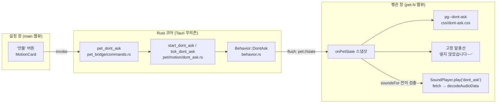
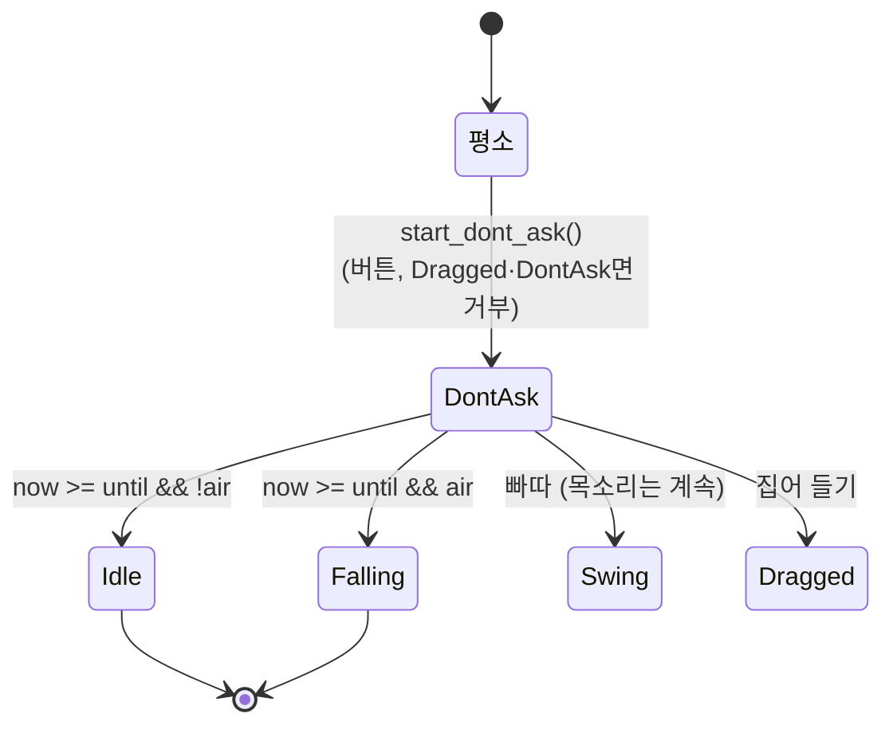

# 안물 — 묻지 않았다며 조잘거리며 춤춘다

## Goal Capsule

- **목표** — 설정 창의 **'안물' 버튼**을 누르면 우클릭한 펭귄이 5.7초 동안 "묻지
  않았습니다~~" 말풍선을 띄우고 조잘거리며 춤춘다. 효과음을 켰으면 사용자가 녹음한
  `src/assets/sounds/dont-ask.m4a`(5.67초)가 함께 난다. 근거는 PRD §5.5(설정 창의
  "동작 시켜보기" 버튼들)이고, **PRD §9 Q9에 예외 하나를 추가한다** (KTD1).
- **권위 순서** — `PRD > PRINCIPLE > CONVENTIONS > MOTIONS > 이 플랜`. 충돌하면 상위가
  이기고, 이 플랜과 어긋나는 구현이 필요해지면 멈추고 보고한다.
- **실행 프로필** — 브랜치 `feat/dont-ask-voice` (이미 `main`에서 갈라져 있다).
  Rust 코어의 상태 전이·경계 판정은 **실패 테스트 먼저**, 테스트 이름은 한국어.
  커밋은 한국어 Angular 컨벤션, 유닛 하나가 커밋 하나.
- **정지 조건** — 아래 넷 중 하나라도 걸리면 멈추고 보고한다.
  1. `decodeAudioData`가 WKWebView에서 이 AAC 파일을 못 읽는다 (U6에서 가장 먼저 확인).
  2. 소리가 나야 할 자리에서 `AudioContext`가 `suspended`로 남아 **트레이로 팝오버를
     연 경우 말고도** 무음이 된다 (KTD6의 가정이 깨진 것).
  3. 5.7초 춤이 실제로 보니 심심하거나 길다 — 이건 테스트로 안 잡히므로 U1의
     아티팩트 게이트에서 잡는다.
  4. `PRD.md` Q9 예외 추가에 대한 사용자 승인이 없다 — **U7 전에 확인한다.**
- **꼬리 작업** — `.github/TEMPLATE/PR.md`로 PR을 열고 **merge는 사용자가 한다.**
  같은 PR에 `PRD.md`·`MOTIONS.md`·`TODO.md` 갱신을 포함한다 (U7).

---

## Product Contract

### Summary

펭귄을 우클릭해 설정 창을 열고 "동작 시켜보기"의 **'안물'** 버튼을 누른다. 펭귄이 몸을
좌우로 흔들며 부리를 빠르게 뻐끔거리고, 머리 위에 "묻지 않았습니다~~" 말풍선이 떠 있다.
효과음을 켜 뒀으면 사용자 본인 목소리로 녹음한 "묻지 않았습니다~~"가 5.7초 동안 흐른다.
끝나면 아무 일 없었다는 듯 평소로 돌아간다.

### Problem Frame

`TODO.md`의 "넣을 동작" 목록은 비었고 모션 추가는 *"지금 있는 것이 심심해진 뒤에 정한다"*로
접혀 있었다 (2026-09-02 정리). 사용자가 음원까지 녹음해 넣었으므로 그 조건이 충족됐다.

이 동작이 기존 열여덟과 다른 점은 **소리가 동작의 목적이라는 것**이다. 지금까지 소리는
동작에 붙는 장식이었고 전부 Web Audio 합성이었다. "묻지 않았습니다~~"는 사람 말소리라
합성으로 도달할 수 없다 — 이 항목은 **음원 파일을 쓰는 첫 사례**이고, 그래서 PRD §9 Q9의
확정 결정을 건드린다. 여기서 예외의 근거를 문서에 남기지 않으면 다음 사람이 "합성 확정"만
읽고 이 파일을 지운다.

### Requirements

| ID | 요구사항 |
|---|---|
| R1 | 설정 창 "동작 시켜보기"에 **'안물' 버튼**이 있고, 우클릭 대상이 없으면 다른 버튼들처럼 비활성된다 |
| R2 | 버튼을 누르면 **우클릭한 그 한 마리만** 5.7초 동안 안물 동작을 한다 (전역이 아니다) |
| R3 | 안물 동작 중에는 "묻지 않았습니다~~" 말풍선이 **계속** 떠 있고, 끝나면 사라진다 |
| R4 | 말풍선 문구는 **사용자가 편집하는 대사 목록과 무관하다** — 목록을 다 지워도 이 문구는 나온다 |
| R5 | 효과음을 켰으면 `dont-ask.m4a`가 동작 시작과 함께 한 번 재생되고, **음량 설정을 따른다** |
| R6 | 효과음이 꺼져 있으면 **춤과 말풍선은 그대로 돌고 소리만 안 난다** |
| R7 | 이미 안물 중이거나 들고 있는 펭귄에게는 거부하고, 버튼이 사유를 보여 준다 |
| R8 | 동작이 끝나면 공중이었으면 낙하로, 바닥이었으면 유휴로 돌아간다 (`Squawk`와 같은 귀결) |
| R9 | `pick_next`의 확률 사다리는 **한 줄도 바뀌지 않는다** — 저절로는 절대 안 나온다 |
| R10 | `prefers-reduced-motion: reduce`에서 춤 애니메이션이 멈춘다 (소리와 말풍선은 남는다) |

### Acceptance Examples

- **AE1** — Given 펭귄 한 마리가 바닥에서 걷고 있고 효과음이 켜져 있다.
  When 펭귄을 우클릭해 설정 창을 열고 '안물'을 누른다.
  Then 즉시 말풍선 "묻지 않았습니다~~"가 뜨고, 펭귄이 몸을 흔들며 부리를 뻐끔거리고,
  녹음된 목소리가 들린다. **약 5.7초(±0.2초)** 뒤 말풍선이 사라지고 걷기로 돌아간다.
- **AE2** — Given 효과음이 **꺼져** 있다. When '안물'을 누른다.
  Then 춤과 말풍선은 AE1과 똑같이 돌고 **소리만 안 난다.**
- **AE3** — Given `TauntCard`에서 대사를 전부 지웠다. When '안물'을 누른다.
  Then 말풍선에 "묻지 않았습니다~~"가 그대로 나온다 (R4).
- **AE4** — Given 안물 중이다. When 다시 '안물'을 누른다.
  Then 거부되고 버튼 밑에 "이미 안 물어봤다고 하는 중이거나 들고 계세요"가 뜬다.
  진행 중인 춤과 소리는 **끊기지도 되감기지도 않는다.**
- **AE5** — Given 안물 중이다. When 펭귄을 클릭한다(빠따).
  Then 펭귄이 날아가고 춤은 그 자리에서 끝나지만 **목소리는 끝까지 흐른다** (KTD7).
- **AE6** — Given 음량을 0단계로 내렸다. When '안물'을 누른다.
  Then 목소리가 다른 소리들과 같은 비율로 작아진다 (`gainForVolume` 공유).
- **AE7** — Given 시스템 설정에서 "동작 줄이기"를 켰다. When '안물'을 누른다.
  Then 펭귄이 움직이지 않고 말풍선과 소리만 나온다.

### Scope Boundaries

**비목표** (PRD §4·§5.5 근거)

- **`pick_next`에 넣지 않는다** — 저절로 나오게 하면 확률 사다리 뒤의 모든 빈도가
  밀리고, 5.7초짜리 사람 목소리가 저절로 나는 것은 §5.5의 "예고 없이 소리를 내면
  회의 중에 사고가 난다"에 정면으로 걸린다.
- **모션별 on/off를 두지 않는다** (PRD §5.5) — 버튼이 유일한 방아쇠다.
- **음원을 여러 개 두지 않는다** — 대사 랜덤화는 이 항목의 범위가 아니다.
- **소리 기본값을 바꾸지 않는다** (PRD Q6) — 기본은 계속 꺼짐이다.
- **여러 마리가 함께 하지 않는다** — 볼링·비치발리볼과 달리 대상은 우클릭한 한 마리다.

**Deferred to Follow-Up Work**

- **말풍선 문구를 소리와 함께 갈아 끼우는 일반 장치** — 지금은 안물 하나뿐이라
  behavior 분기 한 줄이 가장 싸다. 음성 대사가 둘째로 늘어나면 그때 표로 뺀다.
- **재생 중인 목소리를 중단하는 장치** — KTD7에서 일부러 안 넣었다. 거슬리면
  `AudioBufferSourceNode`를 붙들고 `stop()`을 부르는 것이 대안이다.
  (PR 비고 + `TODO.md`에 한 줄로 남긴다.)

---

## Planning Contract

### Key Technical Decisions

**KTD1 — PRD §9 Q9(효과음 = 직접 합성 확정)를 뒤집지 않고 예외 하나를 추가한다.**

Q9의 근거는 셋이었다: ① 라이선스·출처 표기가 없다, ② 번들이 늘지 않는다,
③ 마리마다 목소리를 값으로 다르게 만들 수 있다.
①은 **사용자 본인이 녹음한 파일이라 무효**다. ②는 154KB로, 재는 자가 없던 값이 아니라
받아들일 수 있는 값이다. 남는 건 ③뿐이고 **사람 말소리는 그걸 포기하는 게 맞다** —
반음 오프셋으로 목소리를 옮긴 사람 말소리는 우스운 게 아니라 이상하다.

이건 얼음낚시 "첨벙"이 자격 규칙의 **첫 예외**로 기록된 방식과 같다 (2026-09-01,
`MOTIONS.md` 효과음 절). 규칙을 지우지 않고 예외와 근거를 나란히 적어 둔다.
`TODO.md`의 취소선 *"~~합성음이 '펭귄'으로 안 들리면 음원 파일 재검토~~ — Q9는 그대로
유효하다"*도 이 PR에서 **되살려 고친다**: 취소선을 그은 근거("바꿀 이유가 안 생겼다")가
이제 사실이 아니다.

**KTD2 — 효과음 자격 규칙 ①을 통과한다. "한 발짜리" 원칙도 안 깬다.**

자격 규칙은 *"사용자가 방금 한 짓의 결과이거나, 시간당 한 번보다 드물거나"*다.
버튼이 방아쇠이므로 ①에 그대로 부합한다.

**비치발리볼 랠리를 자른 근거와의 차이를 명시한다.** 그때 잘랐던 이유는 *"버튼 한 번이
20초에 걸쳐 열몇 발을 낳고, 다섯 번째 타격쯤이면 손짓과 소리의 연결이 이미 끊겼다"*였다.
안물은 **버튼 한 번 = 소리 한 발**이고, 그 한 발이 5.7초 이어지는 것과 열몇 발이 20초에
흩어지는 것은 다르다. 볼링 "드르륵"을 굴러가는 내내가 아니라 **시작 한 발**로 자른 것과
같은 결이다 — 이 앱의 소리 장치는 여전히 전부 한 발짜리다.

**KTD3 — 소리와 동작을 묶지 않는다.**

효과음이 꺼져 있으면 춤과 말풍선은 그대로 돌고 소리만 안 난다 (R6). 소리를 켜야
동작이 되게 만들면 `SoundPlayer.setEnabled(false)`의 계약(*"꺼지면 어떤 상황에서도
소리가 나지 않는다"*)이 동작의 유무까지 정하게 되고, 이건 PRD §5.5의 "모션별 on/off는
두지 않는다"를 소리 스위치로 우회하는 셈이다. 버튼 설명(`note`)에 "효과음을 켜야
목소리가 들려요"를 적어 무음의 이유를 알려 준다.

**KTD4 — 말풍선 문구는 웹뷰가 갖고, 대사 목록과 별도 채널이다.**

Rust 코어는 `Behavior::DontAsk`만 알고 문구는 모른다 (PRINCIPLE 4 — 코어는 "무슨
동작·어디에", 웹뷰는 "어떻게 보이는지"). 웹뷰는 `snapshot.speech`(사용자 편집 목록에서
`roll % 길이`로 뽑는 채널)를 **쓰지 않고**, `behavior.kind === "dont_ask"`일 때
상수 문구를 그린다.

`speech` 채널을 재사용하지 않는 이유가 둘이다. ① 사용자가 대사 목록을 다 지우면
`tauntFor`가 무엇을 돌려주든 이 문구가 사라진다 (R4 위반). ② 대사 채널은 7~18초마다
저절로 뜨는 별도 채널이라 동작과 수명이 안 맞는다 — `SPEECH_MS`는 안물 길이와 무관하다.

**말풍선이 겹치면 안물이 이긴다.** 안물을 누른 순간 대사 말풍선이 떠 있을 수 있는데,
둘을 함께 그리면 말풍선 두 개가 겹친다. `dont_ask`일 때는 그것만 그린다.

**KTD5 — 길이는 `DONT_ASK_MS = 5_700`으로 잡는다 (음원 5.673초보다 27ms 길다).**

음원을 자르지 않는다. 춤이 소리보다 짧으면 말이 끝나기 전에 자세가 평소로 돌아가고,
그게 이 동작에서 가장 눈에 띄는 어긋남이다.

**5,700을 고른 것은 정수 반복이 되는 값이라서다.** `pet-css.test.ts`의
`정수가_아닌_반복은_없다`가 전 CSS를 훑어 소수 반복 횟수를 잡고, `동작 길이 동기화` 표가
`.pg--dont-ask .pg-all`의 길이를 Rust의 `DONT_ASK_MS`와 대조한다. 5,673은
0.4·0.475·0.6 어느 것으로도 정수가 안 되지만 5,700은 된다:
`0.475s × 12`, `0.95s × 6`, `0.3s × 19`, `1.14s × 5`.
반쯤 어긋나면 keyframe 중간에서 잘려 **자세가 중간에 멈춘 채 끝난다** —
`pg--sassy-butt-wiggle`이 10ms 어긋나 실제로 그렇게 됐던 자리다 (2026-09-02).

**KTD6 — `AudioContext` 제스처 잠금은 이미 풀려 있다. 코드를 더 쓰지 않는다.**

WKWebView는 사용자 제스처 없이 `AudioContext`를 `suspended`로 시작하고 Tauri에는 이걸
끌 방법이 없다 (`MOTIONS.md` 효과음 절). 버튼은 **설정 창(`main`)**에서 눌리는데 소리는
**펭귄 창(`pet-<id>`)**이 내므로, 설정 창의 클릭은 펭귄 창의 컨텍스트를 깨우지 못한다.

**그런데 이미 깨어 있다.** 설정 창을 여는 유일한 경로가 **펭귄 우클릭**이고
(`pet_open_popover`), `PetApp.handlePointerDown`이 **버튼 종류를 보기 전에**
`playerRef.current?.nudge()`를 부른다 — 우클릭도 포함이다. 즉 안물 버튼을 누를 수
있는 상태라면 그 창의 컨텍스트는 직전 우클릭에 이미 깨어 있다.

**남는 구멍은 하나뿐이다**: 트레이로 팝오버를 열면 우클릭이 없다. 그때는 `focused`가
비어 있어 대상이 없고 버튼이 비활성이므로(R1, `MotionCard`의 `noTarget`) 실제로 도달할
수 없다. 개발 중 HMR로 펭귄 창이 다시 로드되면 잠금이 되돌아가는 것도 기존 동작과 같다.
이 경우들을 위해 코드를 더 쓰지 않는다 — 기존 판단을 그대로 따른다.

**KTD7 — 날아가도 목소리는 끝까지 흐른다.**

빠따·드래그로 춤이 끊기면 `AudioBufferSourceNode`는 계속 울린다. 붙들고 `stop()`을
부르는 장치를 만들 수 있지만 **안 만든다** — 날아가면서 "묻지 않았습니다~~"를 계속
떠드는 게 더 웃기고, 이 앱의 유일한 성공 기준이 그것이다. 후속으로 남긴다.

**KTD8 — 음원은 `?url` + `fetch` + `decodeAudioData`로 붙인다.**

`import DONT_ASK_URL from "../assets/sounds/dont-ask.m4a?url"`로 Vite에 맡긴다.
`?url`을 명시하면 확장자 기본 목록과 무관하게 해시 붙은 URL로 나오고, dev와 번들이
같은 경로를 쓴다. `tauri.conf.json`의 `security.csp`가 `null`이라 `fetch`를 막는
것이 없다.

**base64 인라인을 쓰지 않는다** — 154KB가 205KB로 부풀어 펭귄 창 JS 번들에 들어가고,
창이 마리마다 하나라 8마리면 파싱 비용이 8번이다. **`public/`도 안 쓴다** — CLAUDE.md의
"그림과 색은 전부 `src/assets/`" 규칙이 소리에도 그대로 적용되는 게 맞고, `public/`은
해시가 안 붙어 캐시 무효화가 안 된다.

**디코드는 게을리, 한 번만 한다.** 첫 재생 요청에서 `fetch` → `decodeAudioData`하고
`AudioBuffer`를 창 수명 동안 들고 있는다. 미리 받아 두면 소리를 한 번도 안 쓰는 사용자
(기본값이 꺼짐이다)도 매 창 154KB를 받는다.

**KTD9 — `SoundName`을 여덟으로 늘리고, 재생 백엔드만 둘로 나눈다.**

`soundsFor`(전이 검출)·`SOUND_COOLDOWN_MS`(쿨다운)·`setEnabled`(R1 게이트)·
`gainForVolume`(마스터 게인)을 전부 재사용한다. 별도 `VoicePlayer`를 만들면 "소리는
여덟에서만 난다"의 단일 원천이 둘로 갈라지고, 음량·on/off를 두 곳에서 지켜야 한다.

`SYNTH: Record<SoundName, fn>`이 여덟 번째 항목을 강제하는데 안물은 합성이 아니므로,
`SYNTH`를 일곱만 담는 `Record<Exclude<SoundName, "dont_ask">, fn>`으로 좁히고
`play`가 `dont_ask`만 표본 경로로 보낸다. 타입이 좁아지므로 **여덟 번째를 합성으로
착각해 빠뜨리면 컴파일이 막는다.**

**KTD10 — 안물은 "발작" 부류다 — 볼링·비치발리볼 부류가 아니다** (2026-09-04 사용자 지시).

이 앱의 버튼은 **두 부류**이고 설정 창에서도 카드가 갈려 있다.

| 부류 | 어디에 | 대상 | 예 |
|---|---|---|---|
| **동작 시켜보기** (`MotionCard`) | "동작 시켜보기" 카드 | **우클릭한 한 마리** | 얼음낚시·슬라이딩·빽빽거리기·**발작** |
| 판 열기 (`SettingsCard`) | 설정 카드 | 화면의 **전부** | 볼링 한 판·비치발리볼 한 판 |

안물은 **앞 부류**다. `src/App.tsx`의 `MOTIONS` 배열에 **발작 바로 다음**으로 넣고,
커맨드는 `pet_squawk`/`pet_freakout` 패턴을 그대로 베낀다 — `target_pet`으로 우클릭
대상 한 마리를 잡고, 거부 사유를 `Err(String)`으로 돌려주고, 마지막에 `flush`로 즉시
반영한다. `bowling_start`·`volleyball_start`의 전역 패턴(`ids()` 순회 + 락 주의)은
**쓰지 않는다** (R2).

**성격도 발작 쪽이다.** 발작은 *"이유 없이 터지는 광란"*이고 안물은 *"안 물어봤다며
혼자 떠드는 발광"*이라 결이 같다 — 얼음낚시(길고 조용한 판)나 볼링(여럿이 참여하는
사건)과는 다른 부류다. 다만 **파일은 합치지 않는다**: 이 레포의 `motion/`은 "동작
하나가 파일 하나"이고(`refactor: pet.rs 도메인 분리`, 2026-09-02), `freakout.rs`에
얹으면 그 규칙이 첫 예외를 갖는다. 부류가 같은 것과 코드가 한 파일인 것은 다르다.

**등록을 빠뜨리면 아무것도 안 알려 준다.** `#[tauri::command]`를 만들고 `lib.rs`의
`generate_handler!`에 넣지 않으면 컴파일·테스트·경고가 전부 통과하고 **런타임에서만
조용히 reject**된다 (`docs/solutions/best-practices/tauri-command-registration-silent-failure.md`).
U3의 테스트가 이 한 줄을 지킨다.

### Assumptions

구현 전에 틀렸다고 알려 주면 가장 값싸게 고쳐진다.

1. **PRD Q9 예외 추가에 사용자가 동의한다.** 이 플랜 전체가 여기 얹혀 있다.
   동의가 없으면 U6·U7을 뺀 "무음 춤"만 남는데, 그건 사용자가 요청한 것이 아니다.
2. **`decodeAudioData`가 이 AAC 파일을 읽는다.** WebKit은 시스템 코덱을 쓰므로 m4a/AAC를
   읽는다. 확인 못 한 것은 *"이 특정 파일"*이지 *"AAC 일반"*이 아니다. U6의 첫 수가
   이 확인이다.
3. **춤은 "몸 좌우 흔들기 + 부리 뻐끔"이다.** 조잘거리는 그림은 부리(`pg-beak-lower`)에
   있고 춤은 몸통·발에 있다. 구체적인 진폭·주기는 U1의 아티팩트에서 정한다.
4. **소리 쿨다운은 `DONT_ASK_MS`와 같게 5,700ms.** 코어가 이미 중복 시작을 거부하므로
   (R7) 도달할 일이 없지만, 소리 쪽에도 벽을 세워 두는 게 다른 일곱과 일관된다.
5. **`dont-ask.m4a`는 이 PR에서 git에 추가된다.** 지금 미추적이라 커밋에 안 넣으면
   다른 기계에서 빌드가 깨진다.

### High-Level Technical Design





**소리 경로만 따로** — 왜 `Record` 타입을 좁히는지 (KTD9):

```text
soundsFor(prev, next)  ──▶  "dont_ask" | 기존 일곱
                              │
SoundPlayer.play(name) ──────▶ setEnabled 게이트 → 쿨다운 → ctx.state
                              │
                     ┌────────┴────────┐
              합성 일곱                 표본 하나
        SYNTH[name](ctx, out, semi)   buffer ?? await 디코드
                                      → BufferSource → out
                              └────────┬────────┘
                                   마스터 게인 (gainForVolume) → destination
```
*(방향 안내용 스케치이고 구현 명세가 아니다.)*

---

## Implementation Units

### U1. 춤 후보를 아티팩트로 확정한다 (커밋 없음) — ✅ 끝났다

**결과 (2026-09-04): 후보 "가 — 좌우로 몸 흔들기"로 확정.**
아티팩트: https://claude.ai/code/artifact/6b0a6c79-4410-46ba-aec0-33d807c0dd86

확정된 값 (U5의 입력):

| 부위 | 애니메이션 | 주기 × 횟수 | 내용 |
|---|---|---|---|
| `.pg-all` | `pg-dont-ask-sway` | `0.95s × 6` = 5,700ms | `rotate ±6deg` + `translateY(-2px)` |
| `.pg-head` | `pg-dont-ask-head` | `0.95s × 6` = 5,700ms | `rotate ∓7deg` — 몸과 **반대로** 기운다 |
| `.pg-beak-lower` | `pg-dont-ask-beak` | `0.19s × 30` = 5,700ms | `rotate 11deg`, `transform-origin: 64px 34px`, `display: inline` |

후보 나(통통 뛰며 날개 퍼덕)를 뺀 이유: 날개를 퍼덕이는 그림이 **빽빽거리기와 겹친다.**
후보 다(제자리 스텝)를 뺀 이유: 사용자 선택.

- **Goal** — 어떤 춤을 만들 것인지 사용자와 합의한다.
- **Requirements** — R3(춤이 5.7초를 채운다), 가정 3
- **Dependencies** — 없다
- **Files** — 없다 (아티팩트만 만든다. 스크래치패드에 HTML 하나)
- **Approach** — **연출은 테스트로 판정이 안 된다.** 코드부터 짜면 되돌리게 되므로
  (2026-09-03 사용자 선호) 실제 펭귄 SVG(`src/assets/penguin/`)를 그대로 쓰는 정적
  페이지를 만들어 춤 후보 **2~3개**를 나란히 5.7초 루프로 돌린다. 각 후보에
  "묻지 않았습니다~~" 말풍선을 함께 띄우고, `dont-ask.m4a`를 재생 버튼으로 붙여
  **소리와 몸짓의 박자가 맞는지** 보게 한다. 사용자가 하나를 고르면 그 keyframe
  값이 U5의 입력이 된다.
  - 후보는 진폭·주기로 갈린다: (가) 몸 좌우 흔들기 위주, (나) 위아래 통통 + 날개
    퍼덕, (다) 제자리 스텝 + 고개 까딱. 부리 뻐끔은 셋 다 공통이다.
  - **주기는 KTD5의 정수 반복 후보(0.475·0.95·0.3·1.14초) 안에서만 고른다** —
    아티팩트에서 예쁘던 값이 `정수가_아닌_반복은_없다`에 걸려 되돌아오는 일을 막는다.
- **Test scenarios** — `Test expectation: none — 연출 합의 게이트이고 코드가 안 바뀐다.`
- **Verification** — 사용자가 후보 하나를 고르고, 그 주기가 5,700ms를 정수로 나눈다.

### U2. 코어에 `DontAsk` 동작을 얹는다

- **Goal** — Rust 코어가 안물 동작을 시작·진행·종료한다. Tauri 없이 테스트된다.
- **Requirements** — R2, R7, R8, R9, KTD5
- **Dependencies** — 없다 (U1과 병행 가능 — 코어는 춤 모양을 모른다)
- **Files**
  - `src-tauri/src/pet/behavior.rs` — `Behavior::DontAsk` 추가 (payload 없음)
  - `src-tauri/src/pet/tuning.rs` — `DONT_ASK_MS: u64 = 5_700`
  - `src-tauri/src/pet/motion/dont_ask.rs` — **새 파일.** `start_dont_ask`·
    `enter_dont_ask`·`tick_dont_ask`
  - `src-tauri/src/pet/motion/dont_ask_tests.rs` — **새 파일**
  - `src-tauri/src/pet/motion/mod.rs` — `mod dont_ask;` 등록
  - `src-tauri/src/pet/mod.rs` — `step`의 `match`에 `Behavior::DontAsk => self.tick_dont_ask(now_ms)`
- **Approach** — `motion/react.rs`의 `start_squawk`/`enter_squawk`/`tick_squawk`를
  그대로 베낀다.
  - `start_dont_ask(now_ms) -> bool`: `matches!(self.behavior, Behavior::Dragged |
    Behavior::DontAsk)`이면 `false`. 아니면 `enter(Behavior::DontAsk, now_ms + DONT_ASK_MS)`.
  - `tick_dont_ask(now_ms)`: `now_ms >= self.behavior_until_ms`면 `air`이면
    `Behavior::Falling`, 아니면 `enter_idle` — `tick_squawk`와 같은 귀결 (R8).
  - **`enter`의 두 `match`를 건드리지 않는다.** 첫 `match`(`squawk_until_ms` 초기화)는
    안물이 빽빽거리기 예산과 무관하므로 기본 분기(초기화)가 맞다. 둘째 `match`는
    `other => self.air = other.is_airborne()`로 떨어지는데, `DontAsk`는 지상 동작이
    아니라 **공중에서도 그 자리에서 하는 동작**이므로 `Squawk`와 같은 무변경 분기에
    넣는다 — 공중에서 시켰을 때 `air`가 꺼지면 끝나고 낙하로 안 간다 (R8).
  - `is_airborne()`에 `DontAsk`를 넣지 않는다 (기본 `false`).
  - **`pick_next`를 한 줄도 안 건드린다** (R9). 골든 수열 재기준화가 없다.
  - **`Behavior`에 variant를 더하면 `match`가 비망라라 컴파일이 막는다** — 이게
    "일곱 자리" 중 Rust 쪽 넷을 지키는 유일한 자동 장치다. 나머지 셋(CSS·
    `ALL_BEHAVIORS`·`isOneShot`)은 아무 말도 안 해서 U5가 따로 맡는다.
- **Execution note** — 상태 전이가 핵심이므로 **실패 테스트부터.** 테스트 이름은 한국어.
- **Test scenarios** (`dont_ask_tests.rs`)
  - `버튼으로_시키면_안물_동작에_들어간다` — 걷는 중 → `start_dont_ask` → `true`,
    `behavior == DontAsk`
  - `안물은_5700ms_뒤에_끝난다` — 5,699ms에는 여전히 `DontAsk`, 5,700ms에 아니다
  - `바닥에서_끝나면_유휴로_돌아간다` — `air = false` → 종료 후 `Idle`
  - `공중에서_끝나면_낙하로_떨어진다` — 헤엄 중 시작 → 종료 후 `Falling`
  - `공중에서_시켜도_공중_상태가_유지된다` — 시작 직후 `air == true`
  - `이미_안물_중이면_거부한다` — 두 번째 `start_dont_ask`가 `false`, `behavior_until_ms` 불변
  - `들고_있으면_거부한다` — `Dragged` 상태에서 `false`
  - `빠따를_맞으면_안물이_끊긴다` — `DontAsk` 중 `whack` → `Swing`/`Thrown`
  - `저절로는_안물이_안_나온다` — 시드 여럿 × 긴 시간을 돌려 `DontAsk`가 **한 번도**
    안 나온다 (R9). `빈도_측정` 테스트의 방식을 빌린다
- **Verification** — `cd src-tauri && cargo test`. 새 테스트가 먼저 빨갛고 나서 초록이다.

### U3. 버튼 → 커맨드 경로를 잇는다

- **Goal** — 설정 창의 '안물' 버튼이 실제로 그 펭귄을 춤추게 한다.
- **Requirements** — R1, R2, R7, KTD3, KTD10
- **Dependencies** — U2
- **Files**
  - `src-tauri/src/pet_bridge/commands.rs` — `pet_dont_ask`
  - `src-tauri/src/lib.rs` — `generate_handler!`에 등록
  - `src-tauri/src/lib_tests.rs` — 등록 대조 테스트
  - `src/lib/pet.ts` — `dontAskPet = (): Promise<void> => invoke("pet_dont_ask")`
  - `src/App.tsx` — `MOTIONS` 배열 **맨 끝(발작 다음)**에 `{ name: "안물", ... }` 추가.
    `SettingsCard`는 **안 건드린다** — 거긴 판 버튼 자리다 (KTD10)
- **Approach** — `pet_squawk`를 베낀다: `target_pet(&window, &state)`로 대상을 잡고,
  없으면 `Err("안 물어봤다고 할 펭귄을 우클릭해서 열어 주세요")`, `start_dont_ask`가
  `false`면 `Err("이미 안 물어봤다고 하는 중이거나 들고 계세요")`, 성공하면 `flush`.
  - **락 안의 것을 순회하지 않는다** — 이 커맨드는 대상이 한 마리라
    `bowling_start`류의 `for id in <락>.ids()` 문제가 애초에 생기지 않는다
    (`docs/solutions/best-practices/rust-for-loop-holds-mutex-guard-across-body.md`).
    `pet_squawk`와 같은 `is_some_and` 모양을 유지한다.
  - `MOTIONS`의 `note`: `"5.7초 동안 묻지 않았다며 조잘거려요. 효과음을 켜야 목소리가
    들려요."` — 다른 넷과 같이 **끝나는 조건**을 적고, KTD3의 무음 이유를 알려 준다.
  - `capabilities/default.json`은 **건드리지 않는다** — `core:default`가
    `invoke`를 덮고 기존 커맨드 스물한 개가 추가 없이 동작한다. 새 **창**을 만들 때만
    라벨 등록이 필요하고 이 항목은 창을 안 만든다.
- **Test scenarios**
  - `lib_tests.rs`: `pet_dont_ask가_generate_handler에_등록돼_있다` — `lib.rs` 소스를
    읽어 `commands::pet_dont_ask`가 `generate_handler!` 블록 **안에** 있는지 본다.
    **주석은 걷어내고 대조한다** — 호출을 주석 처리해도 이름이 남아 통과한다
    (`docs/solutions/best-practices/source-text-tests-pass-on-comments.md`).
    **반드시 돌연변이로 한 번 빨갛게 만들어 본다**: 등록 줄을 지우면 빨개지고,
    주석으로 만들어도 빨개지는지 확인한다. 확인 못 하면 이 테스트를 지운다 —
    헛도는 검사는 없는 것보다 나쁘다
  - `App.test.tsx`(있으면): `안물_버튼이_pet_dont_ask를_부른다` — `mockIPC`로 커맨드
    이름을 잡는다
  - `안물_버튼은_대상이_없으면_비활성이다` — `MotionCard`의 기존 `noTarget` 동작이라
    표 기반 테스트에 항목 하나 추가로 덮인다
- **Verification** — `cargo test` + `npm test` + `npm run build`(타입). 그리고
  `npm run tauri dev`로 실제로 버튼을 눌러 펭귄이 **무언가** 한다 (아직 춤 CSS는 없어
  자세만 바뀐다).

### U4. 고정 말풍선 채널

- **Goal** — 안물 중에는 대사 목록과 무관하게 "묻지 않았습니다~~"가 뜬다.
- **Requirements** — R3, R4, KTD4
- **Dependencies** — U2 (behavior kind가 있어야 분기한다)
- **Files**
  - `src/lib/pet.ts` — `DONT_ASK_LINE = "묻지 않았습니다~~"` 상수
  - `src/pet/PetApp.tsx` — 말풍선 렌더 분기
  - `src/pet/PetApp.test.tsx` — 테스트
- **Approach** — `PetApp`의 말풍선 블록에 안물 분기를 앞세운다. `behavior.kind ===
  "dont_ask"`면 `DONT_ASK_LINE`을 담은 `.pg-bubble`을 그리고 `snapshot.speech`는 무시한다
  (KTD4의 겹침 규칙).
  - `key`를 안정적으로 준다 (`"dont-ask"` 같은 고정값). `speech.seq`를 쓰면 안물 중에
    대사 추첨이 돌 때마다 말풍선이 remount되며 튀어나오기 연출을 다시 재생한다.
  - `.pg-bubble` 스타일을 재사용한다 — 새 CSS 없다. `speech.css`는 안 건드린다.
- **Test scenarios**
  - `안물_중에는_고정_문구가_뜬다`
  - `대사_목록이_비어도_안물_문구는_뜬다` — `taunts`를 `[]`로 주고 확인 (R4)
  - `안물_중에는_대사_말풍선이_함께_뜨지_않는다` — `speech`가 있는 스냅샷을 줘도
    말풍선이 **하나**고 그 내용이 고정 문구다
  - `안물이_끝나면_말풍선이_사라진다`
- **Verification** — `npm test` + `npm run build`.

### U5. 춤 CSS와 "일곱 자리" 나머지 셋

- **Goal** — 펭귄이 실제로 춤춘다. 자동 장치가 없는 세 자리를 함께 메운다.
- **Requirements** — R3, R10, KTD5
- **Dependencies** — U1 (확정된 춤), U2 (`DONT_ASK_MS`)
- **Files**
  - `src/pet/css/dont-ask.css` — **새 파일**
  - `src/pet/css/index.css` — `@import "./dont-ask.css";`
  - `src/lib/pet.ts` — `isOneShot`에 `pg--dont-ask` 추가
  - `src/pet/pet-css.test.ts` — `ALL_BEHAVIORS`에 `{ kind: "dont_ask" }` +
    **새 describe** `안물 부위 애니메이션 길이`
- **Approach** — `behaviorClass`는 payload 없는 variant를 `pg--${kebab(kind)}`로
  떨어뜨리므로 **한 줄도 안 고친다** (`dont_ask` → `pg--dont-ask`). `.pg-all`에 몸
  전체 애니메이션을 걸고 부위별(부리·날개·발)을 얹는다 — `react.css`의 `pg--squawk`가
  정확히 그 모양이다.
  - **`@keyframes` 이름은 쓰는 클래스에서 딴다**: `pg-dont-ask`, `pg-dont-ask-beak`,
    `pg-dont-ask-wing`. 같은 이름을 두 번 정의하면 **앞의 애니메이션이 통째로 죽고**
    두 러너·타입 검사·리뷰가 전부 통과한다
    (`docs/solutions/ui-bugs/duplicate-keyframes-silently-kills-animation.md`).
    새 파일이라 파일 안 중복은 없지만 **전 CSS에 같은 이름이 없는지 확인한다.**
  - **길이 검사는 `동작 길이 동기화` 표가 아니라 `주기 × 횟수` 쪽이다.**
    그 표가 쓰는 `cssDurationMs`는 `.pg--<cls> .pg-all`의 **원시 duration만**
    읽는다 — 확정된 춤은 `.pg-all`이 `0.95s × 6`이라 표에 넣으면 950 vs 5700으로
    **반드시 깨진다**. `빽빽거리기 부위 애니메이션 길이`(`부위마다_주기_×_횟수가_
    SQUAWK_MS와_같다`)를 그대로 베낀다 — 그 정규식은 횟수가 없으면 ×1로 치므로
    `.pg-all`과 부위를 한 번에 덮는다. 세 부위 전부 `0.95×6 = 0.19×30 = 5,700ms`다.
  - `.pg-beak-lower`는 평소 `display: none`이므로 `pg--squawk`처럼 `display: inline`을
    함께 건다 — 안 걸면 부리가 안 벌어져 "조잘거림"이 통째로 안 보인다.
  - **`prefers-reduced-motion`에는 아무것도 더하지 않는다** (R10) —
    `base.css`의 블록이 `.penguin, .penguin *`에 `animation: none !important`와
    `transition: none !important`를 이미 걸고 새 클래스도 그 자손이다. 말풍선은
    `.pg-bubble`로 별도로 잡혀 있다. **`transition`까지 함께 꺼져 있는지 확인만 한다** —
    절반만 듣는 접근성 설정은 안 듣는 것보다 나쁘다.
  - `isOneShot`에 넣는 이유: 안물은 한 번 재생하고 멈추는 동작이다. 되감기 조건은
    `shouldRestart`의 기본(클래스가 바뀌면 되감기)으로 충분하다 — `pg--swing`처럼
    `whackSeq` 분기를 더하지 않는다. 중복 시작을 코어가 이미 거부하므로(R7) 같은
    클래스가 연달아 오는 경로가 없다.
- **Test scenarios** (`pet-css.test.ts` — 대부분 기존 표에 항목 추가로 덮인다)
  - `pg--dont-ask 동작에 대응하는 규칙이 있다` — `ALL_BEHAVIORS` 표가 자동 생성
  - `부위마다_주기_×_횟수가_DONT_ASK_MS와_같다` — 몸·머리·부리 셋 다 5,700ms.
    **부위를 셋 미만으로 찾으면 실패**하게 해 둔다(`toBeGreaterThan(2)`) — 정규식이
    헛돌면 "0개 찾았고 전부 통과"가 된다
  - `정수가_아닌_반복은_없다` — 기존 전역 검사가 새 CSS도 훑는다 (추가 코드 없음)
  - `안물이_한_번짜리_목록에_있다` — `isOneShot("pg--dont-ask") === true`
  - **수동**: `@keyframes pg-dont-ask*` 이름이 전 CSS에서 유일한지
    (`grep -c "@keyframes pg-dont-ask"`)
- **Verification** — `npm test` + `npm run build`. 그리고 `npm run tauri dev`로
  **실제로 눈으로 본다** — 애니메이션이 죽는 것은 테스트가 안 잡는다. 스크린샷/영상을
  PR에 넣는다.

### U6. 음원 재생

- **Goal** — 효과음을 켜 뒀으면 목소리가 난다. 꺼져 있으면 무음이고 춤은 그대로다.
- **Requirements** — R5, R6, KTD1, KTD2, KTD8, KTD9
- **Dependencies** — U2 (전이 검출할 behavior), U5(선행 아님 — 병행 가능)
- **Files**
  - `src/assets/sounds/dont-ask.m4a` — **git에 추가한다** (지금 미추적)
  - `src/pet/sound.ts` — `SoundName`에 `"dont_ask"`, 쿨다운, `SYNTH` 타입 좁히기,
    표본 재생 경로
  - `src/pet/sound.test.ts` — 순수 함수 테스트
  - `src/pet/PetApp.sound.test.tsx` — 전이 → 재생 테스트
- **Approach** — **첫 수는 확인이다** (가정 2): `npm run tauri dev`를 띄우고 펭귄
  창 콘솔에서 `fetch(url).then(r => r.arrayBuffer()).then(b => ctx.decodeAudioData(b))`가
  통하는지 본다. 안 되면 **여기서 멈추고 보고한다** (정지 조건 1).
  - `soundsFor`에 전이 검출 한 줄: `prev.behavior.kind !== "dont_ask" &&
    next.behavior.kind === "dont_ask"` → `push("dont_ask")`. `squawk` 줄과 같은 모양이다.
  - `SOUND_COOLDOWN_MS.dont_ask = 5_700` (가정 4).
  - `SYNTH`를 `Record<Exclude<SoundName, "dont_ask">, fn>`으로 좁히고,
    `play`에서 `name === "dont_ask"`면 표본 경로로 보낸다. **게이트 순서는 그대로**:
    `enabled` → 쿨다운 → `ctx.state` (KTD9).
  - 표본 경로: `AudioBuffer`를 `private voice: AudioBuffer | null`에 캐시하고, 없으면
    `fetch` → `decodeAudioData`를 **한 번만** 띄운다(진행 중 플래그로 중복 요청을 막는다).
    받아지면 `BufferSource → this.out`으로 재생 — 마스터 게인을 지나므로 음량 설정이
    자동으로 걸린다 (R5, AE6). `close()`에서 캐시를 버린다.
  - **첫 재생은 디코드 때문에 늦을 수 있다.** 그러면 목소리가 춤보다 늦게 시작한다.
    154KB AAC 디코드는 보통 수십 ms라 문제가 아닐 것으로 보지만, **눈에 띄면**
    표본을 창이 뜰 때 미리 받는 것이 대안이다(KTD8의 "게을리"를 뒤집는 것). U6의
    수동 확인 항목에 넣는다.
  - **URL은 주입 가능하게 둔다** — `SoundPlayer` 생성자가 `createContext?`를 받는
    것과 같은 이유다. vitest는 jsdom이라 `fetch`가 실제 파일을 못 가져오고, 주입 없이
    두면 소리 테스트가 네트워크에 매인다.
  - `assets.test.ts`는 **안 건드린다** — 렌더 스냅샷은 SVG 마크업만 보고 음원은
    렌더할 것이 없다. `src/assets/sounds/`가 `src/assets/` 규칙 안에 있다는 게
    CLAUDE.md와 맞고, 그 규칙을 "소리도 포함"으로 U7에서 한 줄 넓힌다.
- **Test scenarios**
  - `sound.test.ts`
    - `안물_동작에_들어가면_소리를_낸다` — `soundsFor`가 `["dont_ask"]`
    - `안물이_이어지는_동안에는_다시_안_낸다` — `dont_ask` → `dont_ask` 전이는 빈 배열
    - `안물_쿨다운은_동작_길이와_같다` — `SOUND_COOLDOWN_MS.dont_ask === 5_700`
    - `효과음이_꺼져_있으면_안물_소리도_안_난다` — `setEnabled(false)` 후 `play`가
      아무것도 안 한다 (R6)
    - `안물은_합성_표에_없다` — `SYNTH`에 `dont_ask` 키가 없다 (KTD9의 타입 좁히기가
      런타임에서도 유지되는지)
  - `PetApp.sound.test.tsx`
    - `안물_스냅샷이_오면_dont_ask를_재생한다` — 가짜 플레이어로 호출 이름을 잡는다
    - `효과음이_꺼진_창에서도_춤과_말풍선은_나온다` (R6, AE2) — U4의 렌더와 함께
  - **수동** (AE1·AE5·AE6): 소리를 켜고 눌러 목소리가 나는지, 음량 0단계에서 작아지는지,
    춤 중에 클릭했을 때 날아가면서도 목소리가 끝까지 흐르는지 (KTD7).
    **디코드 지연이 눈에 띄는지도 여기서 본다.**
- **Verification** — `npm test` + `npm run build` + `npm run tauri dev` 수동 확인.
  `git status`에 `dont-ask.m4a`가 추적됨으로 잡힌다.

### U7. 문서를 맞춘다

- **Goal** — PRD·MOTIONS·TODO가 코드와 어긋나지 않는다. Q9 예외의 근거가 남는다.
- **Requirements** — KTD1, KTD2, 그리고 CONVENTIONS의 "기능·범위가 바뀌면 같은 PR에서 고친다"
- **Dependencies** — U2~U6 (실제로 만든 것을 적는다)
- **Files** — `PRD.md`, `MOTIONS.md`, `TODO.md`, `CLAUDE.md`
- **Approach**
  - **`PRD.md` §9 Q9** — "직접 합성으로 확정 ✅"을 지우지 않고 **예외를 덧붙인다**:
    *"합성이 원칙이다. 예외 하나 — 사람 목소리 대사(`dont-ask.m4a`)는 합성으로 도달할
    수 없다. 근거 셋 중 라이선스는 본인 녹음이라 무효, 번들은 154KB, 포기하는 것은
    마리별 목소리 하나다 (2026-09-03)."*
  - **`PRD.md` §5.5** — 설정 목록의 소리 항목을 "일곱에서만" → **"여덟에서만"**으로
    고치고 안물을 더한다. "동작 시켜보기" 버튼 목록에도 '안물'을 넣는다.
  - **`MOTIONS.md`** — 모션 표에 안물 한 줄(트리거·길이·끝나는 조건), 효과음 절의
    **판정 표에 한 줄**(안물 / 누른 만큼 / 예 / **음성** — 첫 음원 파일), 그리고
    "합성한다"고 못박은 문단에 KTD1·KTD2의 근거를 짧게 붙인다. **비치발리볼 랠리를
    자른 근거와 어떻게 다른지를 반드시 적는다** — 안 적으면 다음 사람이 둘을 같은
    경우로 읽는다.
  - **`TODO.md`** — "후속" 절에 완료 항목을 추가하고 체크한다. 그리고 **취소선 하나를
    고친다**: `~~합성음이 "펭귄"으로 안 들리면 음원 파일 재검토~~`의 근거가
    *"바꿀 이유가 안 생겼다. Q9는 그대로 유효하다"*였는데 이제 사실이 아니다 —
    취소선을 유지한 채 *"2026-09-03에 안물이 첫 예외를 만들었다"*를 덧붙인다.
    KTD7의 후속(목소리 중단 장치)도 한 줄 남긴다.
  - **`CLAUDE.md`** — 구조 트리의 `src/assets/` 설명을 한 줄 넓힌다
    (`sounds/` — 음원. 지금은 안물 하나) + "그림과 색은 전부 여기 있다"를 소리까지
    포함하게 고친다. 새 함정은 없으므로 함정 목록은 안 건드린다.
- **Test scenarios** — `Test expectation: none — 문서 변경이고 검사 대상 코드가 없다.`
- **Verification** — `PRD.md`를 다시 읽어 §5.5·§9가 코드와 일치한다. `MOTIONS.md`의
  효과음 표 행 수가 여덟이다. `TODO.md`에 체크된 항목이 하나 늘었다.

---

## Verification Contract

| 무엇을 | 명령 | 적용 유닛 |
|---|---|---|
| Rust 단위 테스트 | `cd src-tauri && cargo test` | U2, U3 |
| 프론트 단위 테스트 | `npm test` | U3, U4, U5, U6 |
| **타입 검사** (`npm test`는 안 한다) | `npm run build` | U3, U4, U5, U6 |
| 개발 스모크 — 실제로 눈과 귀로 | `npm run tauri dev` | U3, U5, U6 |
| 연출 합의 | 아티팩트 | U1 |
| 코드 리뷰 | `ce-code-review` | PR 직전 (필수) |

**번들 빌드(`npm run tauri build`)를 게이트에 넣는다** — 이 항목은 **새 종류의 에셋을
번들에 처음 넣는다.** `?url` 임포트가 dev에서 되고 번들에서 안 되면 개발 중에는 절대
안 드러나고 `.app`에서만 무음이 된다. U6 뒤에 한 번 돌려 `.app`을 실행해 목소리가
나는지 확인한다.

**두 러너를 모두 통과시킨다.** 한쪽만 돌리고 "전체 통과"로 보고하지 않는다.

---

## Definition of Done

- [ ] R1~R10 충족, AE1~AE7 재현 확인 (AE1·AE5·AE6·AE7은 수동)
- [ ] `cargo test` + `npm test` + `npm run build` 전부 통과
- [ ] `npm run tauri build`로 만든 `.app`에서 목소리가 난다 (에셋 번들 확인)
- [ ] 핵심 로직(U2)은 **테스트가 먼저 작성된 커밋 이력**이 있다
- [ ] U3의 등록 대조 테스트를 **돌연변이로 한 번 빨갛게 만들어 봤다** (헛도는 검사 금지)
- [ ] `@keyframes pg-dont-ask*` 이름이 전 CSS에서 유일하다
- [ ] `src/assets/sounds/dont-ask.m4a`가 git에 추적된다
- [ ] `PRD.md`·`MOTIONS.md`·`TODO.md`·`CLAUDE.md` 갱신이 **같은 PR에** 있다
- [ ] `ce-code-review` 지적을 반영하고 게이트를 처음부터 다시 돌렸다
- [ ] 실험하다 버린 코드·미사용 잔재·디버그 출력이 diff에 없다
- [ ] `.github/TEMPLATE/PR.md`로 PR을 열고 **스크린샷/영상**을 넣었다 — **merge는 사용자가 한다**
- [ ] KTD7의 후속(목소리 중단 장치)이 PR "비고"와 `TODO.md`에 남았다

---

## Sources & Research

**코드베이스**

- `src-tauri/src/pet/behavior.rs` 모듈 문서 — "모션 하나를 얹으려면 일곱 곳을 건드린다"
- `src-tauri/src/pet/motion/react.rs:99-114` — `start_squawk`/`enter_squawk` (U2의 원본)
- `src-tauri/src/pet/motion/react.rs:28-36` — `tick_squawk` (공중 인식 종료)
- `src-tauri/src/pet_bridge/commands.rs` — `pet_squawk` (U3의 원본), `bowling_start`의
  락 주의사항
- `src-tauri/src/lib.rs:175-198` — `generate_handler!` 등록 목록
- `src/pet/sound.ts` — `SoundName`·`SOUND_COOLDOWN_MS`·`SYNTH`·`SoundPlayer` (U6의 뼈대)
- `src/pet/PetApp.tsx` — `handlePointerDown`의 `nudge()`가 **우클릭에도 걸린다** (KTD6의 근거)
- `src/pet/pet-css.test.ts:69-110, 222-249, 284-297` — `ALL_BEHAVIORS`,
  `동작 길이 동기화`, `정수가_아닌_반복은_없다`
- `src/pet/css/base.css:161-182` — `prefers-reduced-motion` 블록 (R10이 자동으로 덮이는 근거)
- `src-tauri/tauri.conf.json` — `security.csp: null` (KTD8에서 `fetch`를 막는 것이 없다)

**문서**

- `PRD.md` §5.5(설정 창), §9 Q6·Q9
- `MOTIONS.md` 효과음 절 — 자격 규칙, 판정 표, "이 앱의 소리 장치는 전부 한 발짜리다",
  WKWebView `AudioContext` 제약
- `TODO.md` — 취소선 절의 "음원 파일 재검토"와 "모션 더"
- `docs/solutions/best-practices/tauri-command-registration-silent-failure.md`
- `docs/solutions/best-practices/source-text-tests-pass-on-comments.md`
- `docs/solutions/ui-bugs/duplicate-keyframes-silently-kills-animation.md`

**측정**

- `afinfo src/assets/sounds/dont-ask.m4a` — 5.673333초, AAC 1ch 48kHz, 129.6kbps,
  파일 154,057B (오디오 92,617B)
