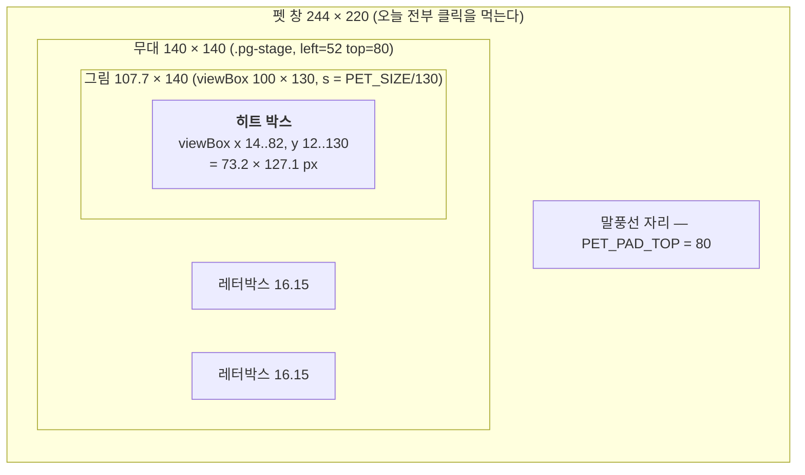
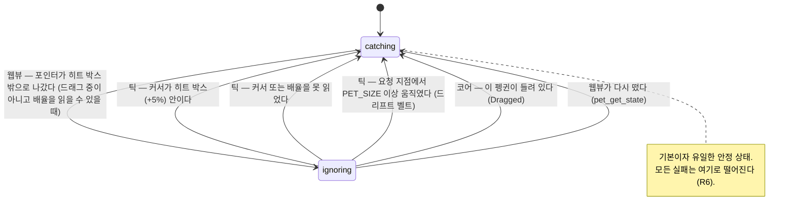
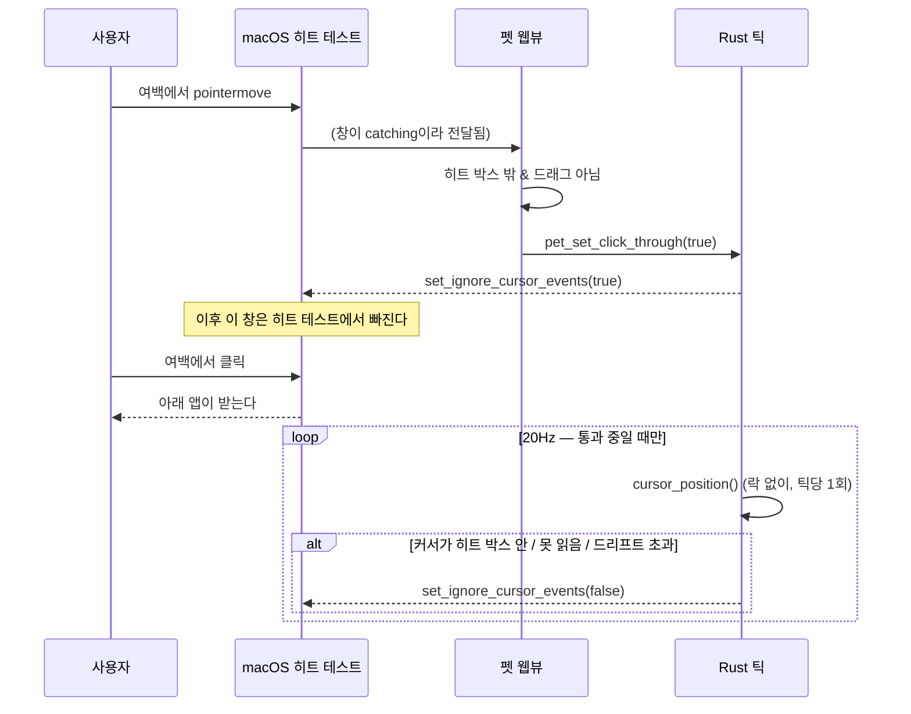

# 펭귄 창의 클릭 판정 범위를 실제 펭귄에 맞게 좁힌다

## Goal Capsule

- **목표** — 펭귄 창(244×220)이 먹는 클릭을 **실제 펭귄이 그려진 자리**로 좁힌다.
  펭귄 밖을 누르면 (a) 펭귄이 반응하지 않고 (b) 클릭이 아래 앱으로 그대로 내려간다.
  근거는 PRINCIPLE 5(**방해하지 않는다**)와 PRD §5.4(왼쪽 클릭 = 빠따 — 펭귄을 눌렀을 때만).
  `MOTIONS.md`가 이미 "여백은 클릭을 먹는다"고 적어 둔 그 여백이 대상이다.
- **권위 순서** — `PRD > PRINCIPLE > CONVENTIONS > MOTIONS > 이 플랜`. 충돌하면 상위가
  이기고, 플랜과 어긋나는 구현이 필요해지면 멈추고 보고한다.
- **실행 프로필** — 브랜치 `fix/f4-pet-hit-area-01`, `main`에서 시작. 순수 기하·판정
  로직은 **실패 테스트 먼저**(테스트 이름 한국어). 커밋은 한국어 Angular 컨벤션,
  유닛 하나 = 커밋 하나.
- **정지 조건** — (1) `set_ignore_cursor_events`가 펫 창에서 실제로는 안 먹는 것으로
  스모크에서 드러날 때 — 단, **호출 직후에 읽어서 판단하지 않는다**(그 오답의 이력이
  `docs/solutions/best-practices/tauri-ignore-cursor-events-is-async.md`에 있다).
  (2) 틱에서 `cursor_position()`을 부르는 것이 눈에 띄는 끊김·데드락을 만들 때.
  (3) 병렬 진행 중인 "펭귄 크기 % 조절"과 `PET_SIZE` 의미가 충돌할 때.
  (4) 히트 박스를 좁히는 것만으로는 사용자 불만이 안 풀리는 것이 스모크에서 드러날 때.
- **꼬리 작업** — `.github/TEMPLATE/PR.md`로 PR을 연다. **merge는 하지 않는다.**
  같은 PR에서 `TODO.md`(`## 후속 (급하지 않음)`에 체크박스 추가 후 체크),
  `MOTIONS.md`("여백은 클릭을 먹는다" 문장 갱신), `PRD.md` §5.4를 고친다.

---

## Product Contract

### Summary

펭귄 옆에서 다른 앱 창을 클릭했는데 아무 일도 안 일어나는 일이 사라진다. 펭귄이
서 있는 자리 바로 왼쪽 40px에서 터미널을 클릭하면 터미널이 눌리고, 펭귄 머리 위
60px에서 브라우저 탭을 클릭하면 탭이 눌린다. 펭귄 발 옆의 빈 자리를 눌러도 펭귄이
방망이를 휘두르지 않는다. 펭귄 몸통을 누르면 지금과 똑같이 빠따가 나가고, 잡아
끌면 지금과 똑같이 끌린다.

### Problem Frame

사용자 원문: *"펭귄 클릭하는 범위가 너무 커. 펭귄을 안눌렀는데도 펭귄이 눌려 다른
작업이 방해돼."*

증상이 하나로 보이지만 **원인이 둘**이고, 한쪽만 고치면 절반만 낫는다.

1. **웹뷰 — "펭귄이 눌린다".** 포인터 핸들러가 `<Penguin>` SVG 루트에 붙어 있는데,
   그 루트는 140×140짜리 **사각형 박스**다. 펭귄 실루엣은 그 박스 안에서 가로
   ≈73px밖에 안 되므로, 무대 안 빈 자리를 눌러도 `pet_whack`이 나간다.
2. **네이티브 — "다른 작업이 방해된다".** 창은 244×220이고 웹뷰가 안 쓰는
   여백(좌우 52 · 위 80)도 **창이 통째로 클릭을 먹는다**. 투명해도 macOS의
   히트 테스트는 알파를 안 본다. 클릭이 아래 앱으로 안 내려간다.

숫자로 보면 창 면적 53,680px² 중 펭귄이 그려진 자리는 약 9,300px² — **83%가 죽은
클릭 영역**이다. 이 앱의 유일한 약속 중 하나가 "방해하지 않는다"(PRINCIPLE 5)인데,
바탕화면 한가운데에 244×220짜리 클릭 블랙홀이 상시로 떠 있다.

이걸 안 고치면 마릿수를 늘리는 기능(최대 8마리)이 그대로 8개의 블랙홀이 된다.

### Requirements

- **R1** — 펭귄 실루엣 밖을 클릭하면 빠따·싸가지 반응이 **나가지 않는다**.
  (창 여백과 무대 안 빈 자리 둘 다)
- **R2** — 펭귄 실루엣 밖을 클릭하면 그 클릭이 **아래 앱·바탕화면으로 내려간다**.
- **R3** — 펭귄 실루엣 위를 클릭하면 지금과 동일하게 빠따가 나가고, 우클릭이면
  설정 창이 열리며, 끌면 끌린다. **이 경로에 회귀가 없다.**
- **R4** — 드래그 중에는 커서가 창 어디로 가든 드래그가 끊기지 않는다.
- **R5** — 판정에 쓰는 모든 치수는 `PET_SIZE`와 SVG `viewBox`에서 **비율로**
  계산된다. 새 픽셀 상수를 하드코딩하지 않는다 (병렬 진행 중인 크기 % 조절 작업이
  `PET_SIZE`를 런타임 값으로 바꿔도 따라간다).
- **R6** — 실패했을 때의 최악은 **"오늘과 같다"**(창이 클릭을 먹는다)이지
  **"펭귄을 못 누른다"가 아니다.** 어떤 오류·읽기 실패·경합에서도 창은 클릭을
  먹는 쪽(catching)으로 떨어진다.
- **R7** — 시선 추적(PRD §5.1, "커서를 올리면 눈동자가 따라온다")이 죽지 않는다.
- **R8** — 핀볼 판·볼링 공·비치발리볼 창과 충돌하지 않는다. 특히 핀볼 모드에서
  여백을 클릭하면 그 클릭은 **핀볼 판**이 받아 채를 휘두른다 (PRD §5.8 "커서가
  어디서나 방망이").

### Acceptance Examples

- **AE1** — *Given* 펭귄이 바닥에 서 있고 그 왼쪽에 터미널 창이 겹쳐 있다.
  *When* 펭귄 몸통에서 왼쪽으로 40px 떨어진 지점(방망이 여백)을 클릭한다.
  *Then* 터미널이 포커스를 받고, 펭귄은 방망이를 휘두르지 않는다.
  (오늘: 아무 일도 안 일어난다)
- **AE2** — *Given* 같은 상태. *When* 펭귄 머리 위 60px(말풍선 자리)에 있는
  브라우저 탭을 클릭한다. *Then* 그 탭이 열린다.
- **AE3** — *Given* 같은 상태. *When* 펭귄 발 옆 무대 안 빈 자리(실루엣 밖,
  히트 박스 밖)를 클릭한다. *Then* 펭귄이 반응하지 않고 아래 앱이 눌린다.
- **AE4** — *Given* 같은 상태. *When* 펭귄 몸통을 10번 연속 클릭한다.
  *Then* 10번 다 방망이가 나간다(실패 0).
- **AE5** — *Given* 펭귄 몸통을 누른 채. *When* 커서를 화면 반대편까지 끌고 가
  놓는다. *Then* 도중에 끊기지 않고 펭귄이 날아간다.
- **AE6** — *Given* 핀볼 모드가 켜져 있다. *When* 펭귄 옆 여백을 클릭한다.
  *Then* 핀볼 판의 채가 휘둘러지고 사거리 안의 펭귄이 날아간다.
- **AE7** — *Given* 커서를 펭귄 여백에 1분간 세워 둔다. *Then* Activity Monitor의
  `penguin` CPU 사용률이 평소(커서가 다른 데 있을 때)와 눈에 띄게 다르지 않다.
- **AE8** — *Given* 펭귄을 5분간 방치했다(웹뷰 타이머가 멈추는 구간). *When*
  펭귄 몸통을 클릭한다. *Then* 방망이가 나간다.

### Scope Boundaries

**비목표**

- **창 크기(`PET_WINDOW_W`/`H`)와 여백 상수(`PET_PAD_X`/`PET_PAD_TOP`)를 바꾸지
  않는다.** 여백은 방망이 스윙과 말풍선이 잘리지 않을 자리이고
  (`MOTIONS.md` "잘림의 경계는 `viewBox`가 아니라 창이다"), `bounds_from_work_area`가
  세계 경계를 만드는 데에도 쓴다. 게다가 **병렬 진행 중인 "펭귄 크기 % 조절"이
  같은 상수를 런타임 값으로 바꾸는 중**이라 여기서 손대면 충돌한다.
- **펭귄 그림을 바꾸지 않는다.** `assets.test.ts`의 렌더 스냅샷은 이 PR에서 갱신
  대상이 아니다 — 갱신이 필요해지면 그건 이 작업이 그림을 건드렸다는 신호다.
- 소리·모션·확률 어느 것도 바꾸지 않는다.

**Deferred to Follow-Up Work**

- **국면별 히트 박스.** 널브러짐(`.pg--sprawl`, `scale(1.42, 0.3)`)과 던져짐
  회전(`pg-thrown-spin`)은 그림이 고정 박스를 넘어간다. 가장자리 클릭이 통과된다
  (가운데는 잡힌다). 상시 동작이 아니고 그 순간 사용자가 정밀 클릭을 하지 않으므로
  뒤로 미룬다.
- **실루엣 다각형 판정.** 지금은 사각형 하나다. 머리(원)+몸통(타원) 두 도형으로
  나누면 죽은 영역이 더 줄지만, 사각형만으로 이미 83% → ~17%다.
- **창 여백 자체 줄이기.** 크기 % 조절이 머지된 뒤에 별도로 검토한다.
- **낚싯대·물고기를 클릭 대상에 넣기.** 이번엔 뺀다(아래 KTD3).

---

## Planning Contract

### Key Technical Decisions

**KTD1 — 히트 영역은 "창 여백"과 "실루엣" 둘 다 좁힌다. 층이 둘이다.**

한 층만으로는 증상의 절반만 없어진다.

| 층 | 무엇을 막나 | 메커니즘 | 정밀도 |
|---|---|---|---|
| A. 웹뷰 | "펭귄이 눌린다" (R1) | CSS `pointer-events` | **실루엣 픽셀 단위** |
| B. 네이티브 | "다른 앱이 안 눌린다" (R2) | `set_ignore_cursor_events` | **사각형 히트 박스** |

A는 SVG 도형이 칠해진 자리에서만 이벤트를 받게 한다 — `.penguin`(루트)에
`pointer-events: none`을 걸고 도형에서 되살리는 표준 hole-punch다. 이벤트는 도형에서
**버블링**으로 SVG 루트의 React 핸들러에 그대로 도달하므로 핸들러 위치는 안 바뀐다.

B는 창 단위 플래그다. **macOS에는 "창의 이 부분만 통과"가 없다** — 통과 여부는
`NSWindow.ignoresMouseEvents` 하나이고 창 전체에 걸린다. 그래서 커서 위치를 따라
창 단위로 껐다 켜는 것 말고는 방법이 없다.

**KTD2 — 히트 박스는 SVG `viewBox` 단위로 한 번만 정의하고, 양쪽이 그걸 비율로
변환한다. 픽셀 상수를 새로 만들지 않는다 (R5).**

```text
viewBox            0 0 100 130       (Penguin의 고정 좌표계)
히트 박스(viewBox)  x 14..82, y 12..130
                   ← 그림자·꼬리·부리·날개·머리를 후광 stroke(2.6/2)까지 감싼
                     실측 bbox(14.7..81.3, 12.7..128.8)를 바깥으로 반올림한 값

배율 s = PET_SIZE / 130                     (= 1.0769 at 140)
무대 안 그림 왼쪽 = (PET_SIZE - 100·s) / 2  (= 16.15 — meet 레터박스)
```

`PET_SIZE`만 들어가고 `PET_PAD_*`는 **한 번도 안 나온다.** 크기 % 조절이 `PET_SIZE`를
바꾸면 히트 박스가 자동으로 따라가고, 여백을 바꿔도 우리 계산은 무관하다.

현재 값으로: 창 244×220 안에서 히트 박스는 **73.2 × 127.1 = 창 면적의 17.3%**.

**KTD3 — 평소 안 보이는 장비(`.pg-bat`·낚시 도구)와 그림자는 클릭 대상에서 뺀다.**

`.pg-bat`은 `opacity: 0`으로 숨긴다 — **`opacity: 0`은 히트 테스트를 안 막는다**
(`visiblePainted`가 보는 것은 `visibility`이지 `opacity`가 아니다). 그냥 두면 몸통
오른쪽에 보이지 않는 세로 막대가 상시로 클릭을 먹는다. 낚시 도구는 `display: none`이라
안 보일 때는 안전하지만, **드리우는 동안에는 낚싯대가 `viewBox` x=98까지 나가** 히트
박스 밖에서 클릭을 받게 된다 — 두 층의 경계가 어긋나면 "웹뷰는 반응하는데 창은
통과시키는" 갈래가 생긴다. 그래서 장비 전부를 `pointer-events: none`으로 고정한다.

**KTD4 — 판정 주체를 나눈다. 웹뷰가 "통과시켜 달라"고 말하고, Rust만이 "다시 먹어라"를
정한다. 이것이 R6(못 누르는 회귀 금지)의 근거다.**

```text
catching(기본)  ──웹뷰: "포인터가 히트 박스 밖이다"──▶  ignoring
     ▲                                                    │
     └──Rust 틱: 커서가 히트 박스(+히스테리시스) 안 ──────┘
        또는 커서를 못 읽음 / 배율을 못 읽음 / 들려 있음
        또는 요청 시점에서 커서가 PET_SIZE 이상 움직임
```

- **웹뷰의 판단에는 스케일도, IPC도, 폴링도 없다.** client 좌표 + CSS px 뿐이다.
  그래서 **포인터가 히트 박스 위에 있는 동안 창이 통과 상태로 넘어가는 일은 없다.**
- **Rust의 폴은 정확성 장치가 아니라 복구 장치다.** 최악의 고장은 "복구가 늦다"이지
  "영영 못 누른다"가 아니다 — 아래 KTD6의 두 번째 벨트가 그 늦음을 한 번의 마우스
  이동으로 묶는다.
- `ignoring`은 **유지되는 동안 계속 근거가 필요한 상태**다. 근거가 하나라도 사라지면
  즉시 `catching`으로 떨어진다.

**대안으로 검토하고 버린 것:**

- *Rust가 매 틱 커서를 폴링해 혼자 결정* — 웹뷰가 필요 없어 단순하지만
  `cursor_position()`을 **항상** 20Hz로 부르게 된다. 이건 `current_monitor()`와 같은
  **메인 스레드 왕복 블로킹 getter**다(`event_loop_window_getter!`, tauri-runtime-wry
  2.11.4 `lib.rs:2815`). `CLAUDE.md`가 "20Hz 틱에서 매번 부르지 않는다"고 못 박은 바로
  그 부류라 기각.
- *웹뷰가 `setIgnoreCursorEvents`를 직접 호출* — `capabilities/default.json`에 권한을
  더해야 하고, 무엇보다 **되돌리는 주체가 없다**(통과 중에는 이벤트가 안 온다).
- *창 여백을 정적으로 줄인다* — 가장 단순하지만 상한이 명확하다. 방망이 스윙과
  말풍선이 실제로 그 자리를 쓰므로 그림이 잘리고, 여백을 다 없애도 무대의
  레터박스 슬랙(좌우 16px)과 실루엣 바깥은 남는다. 게다가 **병렬 작업과 정면으로
  충돌하는 상수**다(RK6).

**KTD5 — 되돌리기 폴은 "하나라도 통과 중일 때만" 돌고, 락을 하나도 쥐지 않은 채
틱 본문 맨 앞에서 딱 한 번 부른다.**

`cursor_position()`이 메인 스레드 왕복이라는 사실에서 두 가지가 따라온다.

1. **비용** — 통과 중인 펭귄이 하나도 없으면 아예 안 부른다. 커서가 펭귄 여백에
   머무는 동안에만 20Hz다. 마릿수와 무관하게 **틱당 최대 1회**(전역 좌표 하나로 8마리를
   전부 판정한다).
2. **데드락** — 틱이 `pets` 락을 쥔 채 이 함수를 부르면, 메인 스레드에서 돌던 커맨드가
   같은 락을 기다리는 순간 **서로를 기다린다.** 증상은 "앱이 통째로 멈춘다" 하나뿐이고
   테스트는 전부 통과한다 — 이 레포가 이미 겪은 모양이다
   (`docs/solutions/best-practices/rust-for-loop-holds-mutex-guard-across-body.md`).
   그래서 호출 자리는 **틱 본문 최상단, 어떤 `lock()`보다 앞**으로 고정하고 주석으로
   못 박는다.

**KTD6 — 배율(scale)은 두 겹으로 막는다. 못 읽으면 통과를 아예 안 하고, 잘못 읽어도
한 번의 마우스 이동으로 풀린다.**

`cursor_position()`은 **물리 px**을 주고 창 좌표는 **논리 px**이다. 배율이 필요하다.
배율이 틀리면 Rust가 "커서가 박스 안"을 영영 못 보고 창이 통과 상태로 굳는다 —
**이게 R6를 깨는 유일한 현실적 경로다.** 두 겹으로 막는다.

1. **배율을 못 읽으면 통과를 요청받아도 무시하고 catching을 유지한다.** 기존 세계
   캐시(`BOUNDS_REFRESH_MS` 2초)와 같은 주기로 모니터에서 읽어 캐시하고, `None`이면
   기능 자체가 꺼진다.
2. **드리프트 벨트 — 배율과 무관한 두 번째 문.** 통과를 요청받은 시점의 커서 물리
   좌표를 기억해 두고, 거기서 `PET_SIZE` 이상(물리 px 기준 — Retina에서 더 빡빡해지는
   쪽이라 안전하다) 멀어지면 배율 계산과 **무관하게** catching으로 되돌린다. 창이
   다시 클릭을 먹으면 웹뷰에 pointermove가 도착하고, 정말 여백이면 즉시 다시 요청한다.

커서를 가만히 세워 두면 통과 상태가 유지된다(기능 손실 없음). 커서가 움직이면 어떤
경우에도 루프가 다시 돈다.

**KTD7 — 상태가 바뀔 때만 IPC를 보낸다. 요청 조건과 되돌리는 조건이 같은 박스라서
진동하지 않는다.**

웹뷰는 "박스 밖 ↔ 박스 안"이 **바뀔 때만** 커맨드를 부른다(매 pointermove가 아니다).
Rust가 되돌리는 조건은 같은 박스를 `PET_SIZE * 0.05`만큼 **부풀린** 것이라, 두 조건
사이에 겹치는 띠가 생겨 경계에서 껐다 켰다 하지 않는다. 이 히스테리시스가
**세터의 비동기 지연 한 프레임도 함께 흡수한다.**

**KTD8 — `set_ignore_cursor_events`를 건 직후에 읽어서 확인하지 않는다.**

`Ok(())`를 즉시 주지만 적용은 이벤트 루프를 왕복한 뒤다. 직후에 읽으면 `false`가
나오고 "이 API는 안 먹는다"는 **오답**이 나온다 — 이 레포가 이미 그 오답에 도달한
적이 있다(`docs/solutions/best-practices/tauri-ignore-cursor-events-is-async.md`).
자동 검증을 넣지 않는다. 검증은 사람이 실제로 클릭해 보는 스모크뿐이다.

**KTD9 — `ns_window()` 아래로 내려가지 않는다. 틱에서 부르는 것은 Tauri API뿐이다.**

`set_ignore_cursor_events`는 `send_user_message`로 이벤트 루프에 넘기는 **Tauri API**라
틱 스레드에서 불러도 안전하다(`set_position`과 같은 성질). 반면 `ns_window()`로 포인터를
꺼내 AppKit을 직접 만지면 **틱 스레드에서 앱이 흔적 없이 죽는다**
(`docs/solutions/best-practices/appkit-from-tick-thread-kills-the-app.md` — 코트 창이
그렇게 죽었다). 이 PR은 AppKit을 한 줄도 쓰지 않는다.

**KTD10 — 다른 창들과의 관계는 "레벨은 그대로, 통과만 추가"다 (R8).**

| 창 | 레벨 | 지금 | 이 PR 뒤 |
|---|---|---|---|
| 펫 창 | 3 | 244×220 전부 먹음 | **히트 박스만 먹음** |
| 핀볼 판 | 2 | 화면 전체를 먹음 | 그대로 — 펫 여백의 클릭이 **판으로 내려간다**(PRD §5.8이 원하던 그림) |
| 볼링 공 | 3 | 공 크기만 먹음 | 그대로 — 펫 여백 아래를 지나는 공을 **집을 수 있게 된다** |
| 코트·비치볼 | 2 | 통과 | 그대로 |

펫 창의 **레벨은 안 건드린다.** 통과와 레벨은 서로를 대신하지 못하므로
(`docs/solutions/ui-bugs/macos-window-order-is-not-stable-level-is.md`) 둘을 섞지 않는다.

**KTD11 — 시선 추적 리스너를 SVG에서 창 루트로 옮긴다 (R7).**

지금 시선은 `<Penguin>`의 `onPointerMove`가 담당하는데, KTD1의 A층이 SVG 루트를
`pointer-events: none`으로 만들면 **시선이 실루엣 위에서만 작동하게 된다** — 명백한
회귀다. 시선은 창 전역 리스너(`window.addEventListener("pointermove")`)로 올리고,
빠따·드래그만 실루엣에 남긴다. 결과적으로 시선이 작동하는 범위는 오늘의 무대
140px에서 히트 박스 73px로 줄지만, 눈동자 이동량이 ±1.6 SVG 단위라 체감 차이가
거의 없고 PRD §5.1의 약속("커서를 올리면 눈동자가 따라온다")은 그대로 지켜진다.

### Assumptions

틀리면 **구현 전에** 알려 달라.

- **A1** — `set_ignore_cursor_events(true)`가 걸린 펫 창의 클릭은 그 아래 창(다른 앱
  포함)으로 내려간다. 근거: 비치발리볼 코트·비치볼이 이미 같은 플래그로 통과하고
  있고 스모크로 확인된 상태다. 펫 창이 코트와 다른 점은 `always_on_top` 레벨 3과
  `accept_first_mouse(true)`인데, 둘 다 히트 테스트에 관여하지 않는다.
- **A2** — 히트 박스는 사각형 하나로 충분하다. 실루엣의 대부분이 이 사각형 안에
  들어차 있어서, 남는 죽은 영역(모서리 네 곳)은 눈에 안 띈다.
- **A3** — 커서를 여백에 세워 둔 채 20Hz 폴을 도는 것이 체감 가능한 CPU를 안 쓴다.
  AE7이 이 가정의 검증이다. 틀리면 폴을 10Hz(`TICK_MS * 2`)로 낮춘다.
- **A4** — 프로덕션은 화면 하나다(PRD §5.2). 그래서 배율 캐시 하나로 충분하다.
  화면이 둘이 되면 배율이 2초까지 낡을 수 있고, 그때는 KTD6의 드리프트 벨트가
  받아 준다.
- **A5** — 웹뷰가 다시 뜨면(HMR·크래시) 통과 요청은 초기화되어야 한다. 웹뷰는 마운트
  시 `pet_get_state`를 부르므로 **그 커맨드에서 해당 펭귄의 요청 플래그를 지운다** —
  새 배관 없이 얹힌다.
- **A6** — JSDOM은 `pointer-events` 히트 테스트를 구현하지 않는다. 따라서 "무대 빈
  자리를 눌러도 빠따가 안 나간다"는 **동작 테스트로 못 잡고** CSS 규칙 검사 + 수동
  스모크로 증명한다. 이걸 동작 테스트로 짜면 초록으로 통과하면서 아무것도 안 지킨다.

### High-Level Technical Design

#### 좌표계 — 창 · 무대 · viewBox · 히트 박스



#### 상태 — 창 하나의 클릭 통과



#### 두 층이 만나는 지점



---

## Implementation Units

### U1. 히트 박스 — 순수 기하와 양쪽 상수 동기화

**Goal** — `viewBox` 단위의 히트 박스 하나에서 Rust와 TS가 각자 픽셀을 계산한다.
아직 아무도 이걸 쓰지 않는다.

**Requirements** — R5, KTD2

**Dependencies** — 없음

**Files**
- `src-tauri/src/pet_bridge/hit.rs` (신규)
- `src-tauri/src/pet_bridge/hit_tests.rs` (신규, `#[path]`로 붙인다)
- `src-tauri/src/pet_bridge/mod.rs` (모듈 등록)
- `src/assets/penguin/hit.ts` (신규 — 그림의 치수이므로 `assets/` 아래다.
  **React를 쓰지 않는다** — `props/`와 같은 규칙)
- `src/pet/pet-css.test.ts` (Rust ↔ TS 상수 대조 추가)

**Execution note** — 순수 기하다. 실패 테스트를 먼저 쓴다.

**Approach**
- Rust: `PET_VIEWBOX_W/H`, `PET_HIT_L/T/R/B`(viewBox 단위), `PET_HIT_HYSTERESIS_RATIO`.
  `hit_rect(pet_x, pet_y) -> (l, t, r, b)`는 `PET_SIZE`만 참조한다 — `PET_PAD_*`를
  쓰지 않는다(KTD2). `contains(rect, x, y)`와 `inflate(rect, by)`도 여기.
- TS: 같은 수의 `PENGUIN_HIT_BOX`·`PENGUIN_VIEWBOX`와, client 좌표를 받는
  `isOutsideHitBox(clientX, clientY, size, padX, padTop)`. CSS 변수
  (`--pg-size`·`--pg-pad-x`·`--pg-pad-top`)에서 읽어 넘기므로 TS에도 픽셀 상수가 없다.
- 대조 검사는 기존 `describe("창 여백 상수 동기화")`의 소스 텍스트 방식을 그대로
  따른다(그 파일이 이미 `window.rs`를 읽고 있다).

**Patterns to follow** — `src-tauri/src/pet_bridge/bounds.rs`(Tauri 무의존 순수 함수 +
얇은 Tauri 래퍼), `src/pet/pet-css.test.ts`의 `cssVar`/`rustConst` 헬퍼.

**Test scenarios** (Rust, 실패 테스트 먼저)
- `히트_박스는_창_안에_들어간다` — 네 변이 `(0,0,PET_WINDOW_W,PET_WINDOW_H)` 안.
- `히트_박스는_창_면적의_4분의_1보다_작다` — 죽은 영역이 실제로 줄었다는 못.
- `펭귄_가운데는_히트_박스_안이다`.
- `방망이_여백은_히트_박스_밖이다` — `pet_x - PET_PAD_X + 10`.
- `말풍선_자리는_히트_박스_밖이다` — `pet_y - PET_PAD_TOP + 10`.
- `무대_안이어도_실루엣_옆은_히트_박스_밖이다` — 레터박스 자리(`pet_x + 5`).
- `크기가_두_배면_히트_박스도_두_배다` — 크기 % 조절이 들어와도 따라간다는 못(R5).
- `되돌리는_박스가_요청_박스보다_넓다` — 히스테리시스 > 0이고 진짜로 포함한다.

**Test scenarios** (TS)
- `실루엣_밖_좌표는_박스_밖으로_판정된다` / `안은_안으로_판정된다`
- `히트_박스_상수가_Rust와_같다` — **소스 텍스트 대조.** 반드시 Rust 상수를 한 번
  틀리게 바꿔 **빨갛게 만들어 본 뒤** 되돌린다
  (`docs/solutions/best-practices/source-text-tests-pass-on-comments.md`).

**Verification** — `cd src-tauri && cargo test`, `npm test`, `npm run build`.

---

### U2. 웹뷰 — 실루엣만 클릭을 받는다

**Goal** — 무대 안 빈 자리를 눌러도 빠따가 안 나간다. 시선은 그대로 산다.

**Requirements** — R1, R3, R7 / KTD1(A층), KTD3, KTD11

**Dependencies** — 없음 (U1과 병렬 가능하나 커밋은 U1 뒤)

**Files**
- `src/pet/css/base.css` (`pointer-events` 규칙)
- `src/pet/PetApp.tsx` (시선 리스너를 창 전역으로)
- `src/pet/pet-css.test.ts`
- `src/pet/PetApp.test.tsx`

**Approach**
- `.penguin { pointer-events: none }` + 도형에서 되살린다. 버블링으로 SVG 루트의
  React 핸들러에 그대로 도달하므로 `PetApp.tsx`의 핸들러 배치는 안 바뀐다.
- `.pg-bat`·`.pg-rod`·`.pg-line`·`.pg-float`·`.pg-fish`·`.pg-hole`·`.pg-shadow`는
  `pointer-events: none`으로 고정한다(KTD3). 후광(`.pg-halo`)은 **살려 둔다** —
  본체와 같은 도형을 stroke 2.6으로 부풀린 것이라 ~1.4px의 관용이 생긴다.
- 시선: `useEffect`에서 `window`에 `pointermove`/`pointerout`을 걸고, 무대 요소의
  `getBoundingClientRect()` 기준으로 계산한다. **드래그 중에는 건너뛴다**(기존
  `dragRef` 가드 재사용). 드래그 경로는 포인터 캡처를 쓰므로 SVG에 그대로 둔다.

**Patterns to follow** — `src/pet/css/fishing.css`의 `display: none` 묶음 규칙,
`pet-css.test.ts`의 `describe("평소 숨기는 도형")` `it.each` 구조.

**Test scenarios**
- `펭귄_루트는_클릭을_안_받는다` — `.penguin` 규칙에 `pointer-events: none`.
- `도형은_클릭을_받는다` — 도형 선택자가 `pointer-events`를 되살린다.
- `평소_안_보이는_장비는_클릭을_안_받는다` — 일곱 클래스 각각(`it.each`).
  기존 `describe("평소 숨기는 도형")` 옆에 나란히 둔다.
- `시선은_실루엣_밖에서도_따라온다` — 창 전역 `pointermove`를 쏘면 `--gaze-x`가
  바뀐다 (오늘은 SVG 위에서만 바뀐다 → 이 테스트가 리스너 이동을 잡는다).
- `드래그_중에는_시선이_안_움직인다`.
- **동작 테스트 — 없음:** "무대 빈 자리를 눌러도 빠따가 안 나간다"는 JSDOM이
  `pointer-events` 히트 테스트를 구현하지 않아 **초록으로 통과하면서 아무것도 안
  지킨다**(A6). CSS 규칙 검사 + 스모크 3으로 증명한다.

**Verification** — `npm test`, `npm run build`. 스모크 항목 3·7.

---

### U3. 통과 요청을 받는 커맨드와 상태

**Goal** — 웹뷰가 "통과시켜 달라"를 Rust에 전달할 수 있다. 아직 아무도 안 부르고
플래그도 아무 효과가 없다(안전한 무동작 커밋).

**Requirements** — R6 / KTD4, A5

**Dependencies** — U1

**Files**
- `src-tauri/src/pet_bridge/mod.rs` (`PetState`에 요청 플래그)
- `src-tauri/src/pet_bridge/commands.rs` (`pet_set_click_through`, `pet_get_state` 초기화)
- `src-tauri/src/lib.rs` (**`generate_handler!` 등록**)
- `src-tauri/src/pet_bridge/tests.rs`
- `src/lib/pet.ts` (invoke 래퍼)

**Approach**
- `PetState`에 `click_through: Mutex<HashMap<PetId, ClickThroughReq>>`를 더한다.
  `ClickThroughReq`는 `{ wanted: bool, at: (f64, f64) }` — `at`은 요청 시점의 커서
  물리 좌표로 드리프트 벨트(KTD6-2)가 쓴다.
- **락 순서 규칙을 주석으로 박는다: `pets`와 `click_through`를 동시에 쥐지 않는다.**
  이 레포가 이미 자기 데드락으로 앱이 멈춘 적이 있다.
- 커맨드는 `caller_pet(&window)`로 **자기 펭귄만** 바꾼다(기존 규칙 그대로).
- `pet_get_state`에서 호출자 펭귄의 요청을 지운다(A5 — 웹뷰 재기동 복구).

**Patterns to follow** — `commands.rs`의 `pet_whack`(caller_pet 게이트),
`is_ball_window`(창 라벨로 권한을 정하는 규칙).

**Test scenarios**
- `커맨드가_generate_handler에_등록돼_있다` — `lib.rs` 소스 대조. 이 레포의
  조용한 실패 1순위다
  (`docs/solutions/best-practices/tauri-command-registration-silent-failure.md`).
  **돌연변이로 빨갛게 만들어 확인한다.**
- `다른_창이_부르면_아무_일도_안_한다` — 펫 창이 아닌 라벨.
- `상태를_다시_읽으면_통과_요청이_지워진다` (A5).

**Verification** — `cd src-tauri && cargo test`, `npm run build`.

---

### U4. 틱 — 되돌리기 폴과 실제 플래그 적용

**Goal** — 요청이 들어오면 창이 실제로 통과 상태가 되고, 커서가 돌아오면 되돌아온다.
아직 요청하는 쪽이 없으므로 프로덕션 동작은 안 바뀐다.

**Requirements** — R2, R4, R6 / KTD4, KTD5, KTD6, KTD7, KTD8, KTD9

**Dependencies** — U1, U3

**Files**
- `src-tauri/src/pet_bridge/tick.rs`
- `src-tauri/src/pet_bridge/bounds.rs` (배율 읽기 헬퍼)
- `src-tauri/src/pet_bridge/hit.rs` (판정 함수 확장)
- `src-tauri/src/pet_bridge/hit_tests.rs`

**Execution note** — 판정을 순수 함수로 먼저 뽑고, 실패 테스트로 여섯 갈래를 전부
고정한 뒤에 틱에 배선한다.

**Approach**
- 판정은 **순수 함수**로 뺀다 — Tauri 타입 없이 테스트한다:
  `decide_click_through(req, cursor, scale, pet_xy, dragged) -> bool`.
  `false`(= catching)로 떨어지는 갈래가 다섯이다: 요청 없음 / 커서 못 읽음 /
  배율 못 읽음 / 들려 있음 / 커서가 부풀린 박스 안. 여섯 번째가 드리프트 초과.
- 틱 본문:
  1. **맨 앞, 락을 쥐기 전에** — 통과 중이거나 요청이 있는 펭귄이 하나라도 있으면
     `app.cursor_position()`을 **한 번** 부른다. 없으면 안 부른다. 호출 자리 위에
     "메인 스레드 왕복 블로킹 getter이므로 락을 쥔 채 부르면 자기 데드락"이라는
     주석을 남긴다(KTD5).
  2. 배율을 캐시에서 읽는다(`BOUNDS_REFRESH_MS` 주기, 못 읽으면 `None`).
  3. 펭귄마다 `decide_click_through`를 돌리고, **직전 값과 다를 때만**
     `set_ignore_cursor_events`를 부른다.
- **적용됐는지 읽어서 확인하지 않는다**(KTD8). `ns_window()`를 쓰지 않는다(KTD9).

**Patterns to follow** — `tick.rs`의 `BallView`(틱 스레드가 소유하는 로컬 캐시),
`should_move`/`tick_interval`(틱 판정을 순수 함수로 빼 둔 선례).

**Test scenarios** (전부 순수 함수, 실패 테스트 먼저)
- `요청이_없으면_클릭을_먹는다`
- `커서를_못_읽으면_클릭을_먹는다`
- `배율을_못_읽으면_클릭을_먹는다`
- `들려_있으면_요청이_있어도_클릭을_먹는다` (R4)
- `커서가_히트_박스_안이면_되돌린다`
- `히스테리시스_띠_안에서는_되돌린_상태를_유지한다` — 경계 진동 없음(KTD7)
- `요청_지점에서_PET_SIZE_이상_움직이면_되돌린다` — 드리프트 벨트(KTD6-2)
- `여백에_요청이_있고_커서가_그대로면_통과를_유지한다` — 유일한 참 갈래

**Verification** — `cd src-tauri && cargo test`. 프로덕션 동작 변화가 없다는 것을
스모크 1·4로 확인(회귀 없음).

---

### U5. 웹뷰가 요청을 보낸다 — 두 끝을 잇는다

**Goal** — 사용자가 실제로 개선을 느낀다. AE1~AE3이 여기서 재현된다.

**Requirements** — R2, R4, R8 / KTD4, KTD7

**Dependencies** — U1, U2, U3, U4

**Files**
- `src/pet/PetApp.tsx`
- `src/pet/PetApp.test.tsx`

**Approach**
- U2에서 만든 창 전역 `pointermove` 리스너 안에서 `isOutsideHitBox`를 돌린다.
- **상태가 바뀔 때만** `setPetClickThrough(next)`를 부른다(`useRef`로 마지막 전송값
  보관). 매 pointermove마다 IPC를 쏘지 않는다(KTD7).
- 안 보내는 조건: 드래그 중(`dragRef.current !== null`), 아직 스냅샷을 못 받음.
- 실패는 삼킨다(`.catch(() => {})`) — 실패하면 catching이 유지될 뿐이라 안전하다.
- 핀볼 모드에서도 그대로 보낸다 — 여백 클릭이 핀볼 판으로 내려가는 것이 PRD §5.8이
  원하는 그림이다(R8, KTD10).

**Test scenarios**
- `히트_박스_밖으로_나가면_통과를_요청한다`
- `히트_박스_안으로_들어오면_요청을_거둔다`
- `같은_구역_안에서_움직이면_두_번_보내지_않는다` (KTD7 — 호출 횟수 1)
- `드래그_중에는_통과를_요청하지_않는다` (R4)
- `요청이_실패해도_창이_망가지지_않는다`

**Verification** — `npm test`, `npm run build`. **수동 스모크 전체를 여기서 돌린다.**

---

### U6. 문서 정합

**Goal** — 코드와 문서가 같은 말을 한다.

**Requirements** — 전부 (꼬리 작업)

**Dependencies** — U5

**Files**
- `TODO.md` — `## 후속 (급하지 않음)`에 체크박스 추가 후 체크
- `MOTIONS.md` — "잘림의 경계는 `viewBox`가 아니라 창이다" 절과 얼음낚시 절의
  **"여백은 클릭을 먹는다 (PRD §5.1)"를 갱신한다.** 이 문장은 이 PR이 뒤집는
  사실이라 그대로 두면 문서가 거짓말이 된다. 히트 박스가 `viewBox` 단위라는 것과,
  그림 모양을 바꾸면 히트 박스를 같이 봐야 한다는 것을 한 줄로 남긴다(RK10).
- `PRD.md` §5.4 — 왼쪽/오른쪽 클릭 행에 "**펭귄이 그려진 자리에서만**" 한 줄
- `CLAUDE.md` — 함정 목록에 한 줄: macOS의 클릭 통과는 창 단위라 부분 통과가 없고,
  그래서 판정 주체를 웹뷰(요청)와 Rust(되돌리기)로 나눴다는 것

**Test expectation: none** — 문서만 바뀐다.

**Verification** — 두 러너 재실행(문서·소스 대조 검사가 있다).

---

## Verification Contract

| 게이트 | 명령 | 적용 유닛 |
|---|---|---|
| Rust 단위 테스트 | `cd src-tauri && cargo test` | U1, U3, U4, U6 |
| 프론트 단위 테스트 | `npm test` | U1, U2, U5, U6 |
| 타입 검사 + 번들 | `npm run build` | U1, U2, U3, U5 |
| 개발 스모크 | `npm run tauri dev` (또는 설치본을 끄고 번들 바이너리 직접 실행) | **U5** |
| 코드 리뷰 | `ce-code-review` | PR 열기 전 |

**번들 빌드(`npm run tauri build`)는 안 돌린다** — 알림·플러그인·capabilities를
건드리지 않는다.

### 수동 스모크 체크리스트 (U5에서 실제로 돌린다)

이 변경은 **단위 테스트로 안 잡히는 OS 통합 표면**이다. `set_ignore_cursor_events`가
걸렸는지는 코드로 읽어서 확인하면 안 되고(KTD8), `pointer-events` 히트 테스트는
JSDOM에 없다(A6). 아래가 유일한 증거다.

| # | 확인 | 기대 | 근거 |
|---|---|---|---|
| 1 | 펭귄 왼쪽 40px(방망이 여백)에서 터미널 클릭 | 터미널이 눌린다 | AE1 |
| 2 | 펭귄 머리 위 60px(말풍선 자리)에서 브라우저 탭 클릭 | 탭이 열린다 | AE2 |
| 3 | 펭귄 발 옆 무대 안 빈 자리 클릭 | 펭귄 무반응 + 아래 앱이 눌린다 | AE3 |
| 4 | 펭귄 몸통을 **10번 연속** 클릭 | 10/10 방망이가 나간다 | **AE4 — R6 회귀 감시** |
| 5 | 몸통을 잡고 화면 반대편까지 끌어 던진다 | 도중에 안 끊긴다 | AE5, R4 |
| 6 | 실루엣 위에서 우클릭 | 설정 창이 펭귄 옆에 열린다 | R3 |
| 7 | 커서를 히트 박스 안에서 좌우로 움직인다 | 눈동자가 따라온다 | R7 |
| 8 | 핀볼 모드 켜고 여백 클릭 | 판의 채가 휘둘러진다 | AE6, R8 |
| 9 | 볼링 공이 펭귄 여백 아래를 지날 때 공 클릭 | 공이 잡힌다 | R8 |
| 10 | 낚시 중 낚싯대 클릭 | 아래 앱이 눌린다 (의도) | KTD3 |
| 11 | 커서를 여백에 1분 세워 두고 Activity Monitor | CPU가 평소와 같다 | **AE7 — A3 검증** |
| 12 | 펭귄을 **5분 방치** 후 몸통 클릭 | 방망이가 나간다 | **AE8 — 숨은 웹뷰 타이머 함정** |
| 13 | 마릿수를 8로 늘리고 1·4를 반복 | 마리마다 동일 | 마릿수 무관성 |
| 14 | 트레이 아이콘 확인 | 살아 있다 | 상시 확인 항목 |
| 15 | **여백에 커서를 세워 둔 채 펭귄이 걸어와 커서 밑을 지나간다** | 지나가는 동안 클릭이 펭귄에게 간다 | KTD4의 되돌리기 폴이 창 이동도 따라잡는가 |

**4·12·15가 R6의 감시탑이다.** 하나라도 실패하면 이 PR은 사용자를 더 나쁘게 만든
것이므로 되돌리고 보고한다.

---

## Risks & Mitigations

| # | 위험 | 완화 |
|---|---|---|
| **RK1** | **"펭귄을 아예 못 누른다" 회귀** — 이 PR의 최악 시나리오 | catching이 **기본이자 유일한 안정 상태**다(KTD4). `ignoring`은 (a) 웹뷰가 명시적으로 요청했고 (b) 매 틱 폴이 근거를 갱신하는 동안에만 유지된다. 웹뷰의 판단에는 스케일·IPC·폴링이 없어서 **포인터가 펭귄 위에 있는 동안 통과로 넘어가는 경로가 없다.** 배율이 유일한 위험 벡터이고 KTD6이 두 겹으로 막는다. 스모크 4·12·15가 감시탑 |
| **RK2** | 틱이 `cursor_position()`에서 블록 / 자기 데드락 | 통과 중일 때만 호출 · **락을 하나도 쥐지 않은 틱 본문 최상단** · 틱당 1회 (KTD5). 이 레포가 이미 겪은 모양이라 주석으로 자리를 못 박는다 |
| **RK3** | 세터가 비동기라 "안 먹는다"는 오답에 도달 | 직후에 읽어 확인하는 코드를 **아예 안 넣는다**(KTD8). 히스테리시스 띠가 프레임 지연을 흡수한다. 검증은 사람의 클릭뿐 |
| **RK4** | AppKit을 틱에서 만져 앱이 흔적 없이 죽는다 | `ns_window()`를 **한 줄도 안 쓴다**(KTD9). `set_ignore_cursor_events`는 Tauri API라 디스패치를 탄다. 코드 리뷰에서 이 항목을 명시적으로 확인한다 |
| **RK5** | 새 커맨드를 `generate_handler!`에 안 넣어 런타임에서만 조용히 reject | U3에 소스 대조 테스트를 넣고 **돌연변이로 빨갛게 만들어 본다** |
| **RK6** | 병렬 작업(펭귄 크기 %)과 충돌 | 히트 박스는 `PET_SIZE` 비율로만 계산하고 `PET_PAD_*`·`PET_WINDOW_*`를 **한 줄도 안 건드린다**(KTD2, R5). 겹치는 파일은 `tick.rs`(본문 최상단 한 블록) · `commands.rs`(끝에 커맨드 하나) · `mod.rs`(필드 하나) · `PetApp.tsx`. 이 PR이 먼저 머지되는 전제 |
| **RK7** | 경계에서 통과/먹기가 진동해 IPC를 태운다 | 요청과 되돌리기가 같은 박스이고, 되돌리기 쪽만 5% 부풀어 겹치는 띠가 있다(KTD7). 웹뷰는 상태 전환에서만 보낸다 |
| **RK8** | 널브러짐·스핀 중에 그림이 박스를 넘어 가장자리가 안 눌린다 | 가운데는 잡힌다. 후속으로 명시적으로 미룬다 |
| **RK9** | 시선 추적 범위가 줄어 체감 회귀 | 리스너를 창 전역으로 올려 catching 구간 전체를 덮는다(KTD11). 눈동자 이동량이 ±1.6 SVG 단위라 73px 안에서도 차이가 안 보인다. 스모크 7 |
| **RK10** | 그림이 바뀌면 히트 박스가 실루엣과 어긋난다 | 히트 박스는 `viewBox` 단위라 크기 변경엔 면역이고 **모양** 변경에는 취약하다. `assets.test.ts`의 렌더 스냅샷이 모양 변경을 반드시 빨갛게 만들므로 그때 히트 박스를 함께 보게 된다 — U6에서 `MOTIONS.md`에 그 연결을 한 줄 남긴다 |

---

## Open Questions (구현 중 판단)

- **폴 주기를 20Hz로 둘지 10Hz로 낮출지** — AE7(스모크 11)에서 CPU가 눈에 띄면
  `TICK_MS * 2`로 낮춘다. 낮추면 되돌리기가 최대 100ms 늦어진다.
- **히스테리시스 비율 5%(=7px)가 적당한지** — 스모크 15에서 진동이 보이면 올린다.
- **드리프트 벨트 문턱을 `PET_SIZE`로 둘지** — 물리 px 기준이라 Retina에서는
  실질 70논리px이다. 스모크에서 너무 자주 풀리면 `PET_SIZE * 2`로 올린다.

---

## Definition of Done

- [ ] R1~R8 충족, AE1~AE8 재현 확인
- [ ] 수동 스모크 15항목 전부 통과 — 특히 **4·12·15**(R6 감시탑)
- [ ] `cd src-tauri && cargo test` · `npm test` · `npm run build` **셋 다** 통과
- [ ] 새로 쓴 소스 대조 검사 둘(`히트_박스_상수가_Rust와_같다`,
      `커맨드가_generate_handler에_등록돼_있다`)을 **돌연변이로 한 번 빨갛게 만들어 봤다**
- [ ] 핵심 판정 로직(U1·U4)에 **실패 테스트가 먼저 있는 커밋 이력**
- [ ] `assets.test.ts` 렌더 스냅샷이 **손대지 않고** 통과 (그림을 안 건드렸다는 증거)
- [ ] 새 픽셀 상수가 없다 — 히트 박스가 전부 `PET_SIZE`·`viewBox`에서 나온다 (R5)
- [ ] `ns_window()` 호출이 diff에 없다 (KTD9)
- [ ] `PET_PAD_X`·`PET_PAD_TOP`·`PET_WINDOW_W`·`PET_WINDOW_H`의 **값이** diff에 없다 (RK6)
- [ ] `TODO.md`·`MOTIONS.md`·`PRD.md`·`CLAUDE.md` 갱신이 같은 PR에 포함
- [ ] `ce-code-review` 지적 반영(또는 PR 비고에 미반영 사유)
- [ ] 브랜치 `fix/f4-pet-hit-area-01`, 한국어 Angular 커밋, PR 템플릿 사용
- [ ] **merge하지 않는다** — 사용자가 한다

---

## Sources & Research

**코드베이스**
- `src-tauri/src/pet_bridge/window.rs` — `PET_WINDOW_W/H`, `PET_PAD_X/TOP`, `window_origin`
- `src-tauri/src/pet_bridge/tick.rs` — 20Hz 틱, `BOUNDS_REFRESH_MS`, 락 사용 패턴
- `src-tauri/src/pet_bridge/volleyball.rs` `그림_창` — `set_ignore_cursor_events` 선례
- `src-tauri/src/pet/tuning.rs` — `PET_SIZE = 140`, `PINBALL_COLLIDE_RADIUS = 104`
  (**"창은 정사각형이지만 펭귄 그림은 그보다 좁다"를 이미 인정한 상수**)
- `src/pet/PetApp.tsx` — 포인터 핸들러가 SVG 루트에 붙어 있는 자리
- `src/assets/penguin/{index,body,gear}.tsx` — `viewBox="0 0 100 130"`, 실루엣 실측
- `src/pet/css/base.css` — `--pg-size`/`--pg-pad-x`/`--pg-pad-top`, `.pg-stage`, `.penguin`
- `src/pet/pet-css.test.ts` — `창 여백 상수 동기화`(Rust↔CSS 대조 선례),
  `평소 숨기는 도형`(`it.each` 선례)
- `MOTIONS.md` L177-183, L280-281 — "잘림의 경계는 창이다", "여백은 클릭을 먹는다"

**docs/solutions (읽고 반영)**
- `best-practices/tauri-ignore-cursor-events-is-async.md` → KTD8
- `best-practices/appkit-from-tick-thread-kills-the-app.md` → KTD9
- `best-practices/rust-for-loop-holds-mutex-guard-across-body.md` → KTD5
- `best-practices/tauri-command-registration-silent-failure.md` → RK5
- `best-practices/source-text-tests-pass-on-comments.md` → U1·U3 테스트 규칙
- `ui-bugs/macos-window-order-is-not-stable-level-is.md` → KTD10

**외부/의존성 실측**
- `tauri-runtime-wry 2.11.4` `src/lib.rs:2815` — `RuntimeHandle::cursor_position`이
  `event_loop_window_getter!`(메인 스레드 왕복 블로킹)로 구현돼 있다. `current_monitor`과
  같은 부류라는 KTD5의 근거.
- `tauri-runtime-wry 2.11.4` `src/lib.rs:2458` — `set_ignore_cursor_events`는
  `send_user_message`(비블로킹 디스패치). 틱에서 불러도 안전하다는 KTD9의 근거.
- `tauri 2.11.5` `src/app.rs:908` — `AppHandle::cursor_position -> PhysicalPosition<f64>`
  (물리 px). 배율이 필요하다는 KTD6의 근거.
