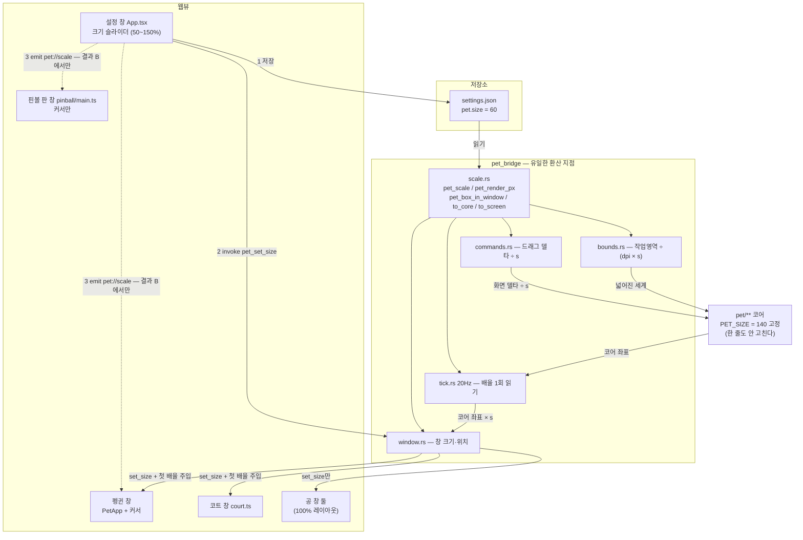
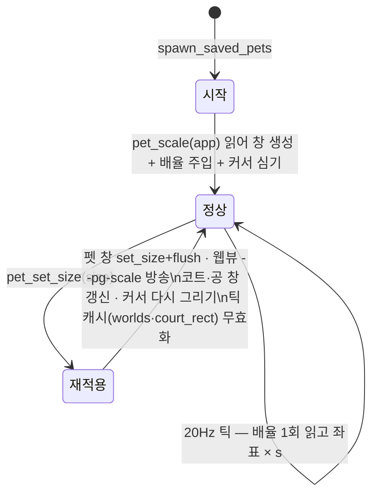

## Goal Capsule

- **목표** — 설정 창에 **음량 슬라이더와 같은 형태의 크기 슬라이더**를 두고, 저장된 배율이
  **화면에 그려지는 이 앱의 모든 그림**과 물리(바닥·벽·앵커·판 기하)에 **하나의 원천에서**
  일관되게 반영되게 한다. 펭귄만 줄고 소품이 원래 크기로 남는 상태는 **완성이 아니다**
  (2026-09-03 사용자: *"다른 asset들 크기도 조정해야지"*). PRD §5.5에 항목을 더하고
  §7에 8번을 더한다. 근거는 사용자 원문: *"모니터가 작은 노트북에서도 화면이 똑같다보니까
  펭귄이 너무 방해될 때가 있다"* — PRINCIPLE 5(방해하지 않는다)에 정확히 걸리는 요청이다.
- **권위 순서** — `PRD > PRINCIPLE > CONVENTIONS > MOTIONS > 이 플랜`. 충돌하면 상위가
  이기고, 플랜과 어긋나는 구현이 필요해지면 멈추고 보고한다.
- **실행 프로필** — 브랜치 `feat/f4-pet-scale-01`. TDD는 Rust 순수 함수
  (`pet_bridge/scale.rs`의 정화·환산, 창 기하 계산)와 프론트 설정 정화·커서 생성에
  적용한다. 테스트 이름은 한국어. 커밋은 한국어 Angular 컨벤션, Implementation Unit
  하나가 커밋 하나.
- **정지 조건** —
  1. 확대 방식(`set_zoom` 또는 CSS 변환)이 투명·무장식 창에서 안 먹거나 그림이
     깨진다 → 보고하고 정한다. **실제로 걸렸고 KTD4′로 뒤집었다.**
  2. **소품을 배율에 맞추려면 코어(`src-tauri/src/pet/**`)를 고쳐야 한다는 결론이 나온다**
     → 고치지 말고 보고한다. KTD1이 틀렸다는 신호이고, 설계를 다시 볼 자리다.
  3. 커서 방망이가 P1(프로브)의 두 갈래 중 어느 쪽으로도 배율을 못 타면 보고한다 —
     "펭귄만 줄고 방망이는 그대로"는 이 작업의 완료 조건을 못 넘는다.
  4. 병렬 작업(`fix/f4-pet-hit-area-01`)과 같은 파일에서 **설계가** 부딪힌다
     (단순 텍스트 충돌은 아님).
- **꼬리 작업** — `.github/TEMPLATE/PR.md`로 PR을 연다. **merge하지 않는다.**
  같은 PR에 `TODO.md`(새 체크박스) · `PRD.md`(§5.5·§7) · `PRINCIPLE.md`(저장 목록 한 줄) ·
  `CLAUDE.md`(원칙 5 요약 줄)를 함께 고친다.

---

## Product Contract

### Summary

작은 노트북 화면에서 펭귄이 너무 크게 느껴질 때, 설정 창을 열어 **크기** 슬라이더를 왼쪽으로
민다. 미는 즉시 화면의 펭귄이 전부 작아지고, 창도 함께 줄어들며, 작아진 펭귄은 **작아진 몸에
맞는 자리에** 선다 — 바닥에 발이 붙고, 벽에 어깨가 닿는다. **펭귄만 줄어드는 게 아니다**:
방망이·낚싯대·훌라 차림, 볼링 공, 비치볼, 코트의 네트와 모래톱, 그리고 **커서 방망이**까지
같은 비율로 줄어든다. 앱을 껐다 켜도 그 크기다.

### Problem Frame

지금 펭귄은 어느 화면에서나 한 변 140 논리 px 고정이다. 27인치에서 적당한 크기가 13인치
노트북에서는 화면의 상당 부분을 먹고, 그게 곧 "방해"다(PRINCIPLE 5). 크기만 CSS로 줄이면
**물리가 따라오지 않아** 바닥에서 뜨거나 벽에서 70px 앞에 멈추고, 소품을 빠뜨리면 **60%
펭귄이 100% 방망이를 휘두르는** 그림이 된다 — 어느 쪽이든 반쪽짜리라 처음부터 전부를 범위에
넣는다.

이 항목이 없으면 뒤에 막히는 것: 모니터가 작은 환경에서 마릿수를 늘리는 것(§5.5)이 사실상
불가능하다 — 8마리 × 140px는 노트북 화면을 덮는다.

### Requirements

- **R1** 설정 창에 **크기** 행이 있다. 음량과 같은 `<input type="range">`이고, 옆에 현재 값이
  `%`로 보인다. 범위는 **50%~150%, 10% 단위**, 기본 100%.
- **R2** 슬라이더를 움직이면 **지금 떠 있는 펭귄 전부**가 즉시 그 크기가 된다. 창을 다시
  만들지 않는다(위치·동작이 유지된다).
- **R3** 배율은 저장되고, 앱을 껐다 켜면 그 크기로 뜬다. 저장 위치는 기존 `settings.json`의
  `pet` 객체 안 **`size`**(퍼센트 정수)이고, 다른 설정을 덮지 않는다.
- **R4** 배율이 바뀌면 **물리가 함께** 바뀐다: 발이 바닥에 붙고, 좌우 벽에서 몸통이 정확히
  걸리고, 던지기·튕김·굴러떨어지기의 경계 판정이 새 크기 기준이다.
- **R5** 배율이 바뀌면 **판 기하도 함께** 바뀐다: 볼링 공·레인 간격, 비치발리볼 코트·네트·
  모래톱·비치볼, 핀볼 마리끼리 부딪히는 반경.
- **R6** 저장된 값이 없거나 깨졌으면 100%로 수렴한다. 손으로 `settings.json`을 고쳐
  `"size": 5000`을 넣어도 화면을 덮는 펭귄이 뜨지 않는다.
- **R7** 펭귄의 **화면상 실제 한 변**을 내는 함수가 코드베이스에 **하나**뿐이다. 창 크기·
  좌표 변환·클릭 판정이 전부 그 함수에서 나온다.
- **R8** 드래그·던지기가 배율과 무관하게 손을 따라온다 — 50%에서 펭귄을 끌면 커서와
  펭귄이 어긋나지 않는다.
- **R9** **`src/assets/`의 그림 전부가 배율을 탄다.** 펭귄 SVG(장비·훌라 포함), 볼링 공,
  비치볼, 코트(네트·모래톱), **커서 방망이**까지 — 어느 하나도 100% 크기로 남지 않는다.
  적용 경로는 아래 "소품 다섯" 표에 항목별로 못 박는다.
- **R10** 병렬 작업이 넣은 **클릭 판정(히트 박스)이 배율을 탄다** — 60%에서 펭귄을 클릭할
  수 있는 영역이 60% 펭귄의 몸통과 일치한다.

### Acceptance Examples

- **AE1** (기본값) Given 저장된 크기 설정이 없다. When 앱을 켠다. Then 펭귄 창은
  244×220 논리 px이고 펭귄은 한 변 140px이다 — 지금과 픽셀 단위로 같다.
- **AE2** (즉시 반영) Given 펭귄 두 마리가 걷고 있다. When 크기를 60%로 민다. Then 두
  마리 모두 84px로 줄고, 걷던 동작이 이어지며, **발이 바닥선에 붙어 있다**
  (창이 다시 뜨지 않는다).
  **가로 자리는 보존되지 않는다** — 코어 좌표가 유지되므로 화면 x는 배율만큼 당겨진다
  (x=1000 → 60%에서 600). 화면 자리를 보존하려면 코어에 좌표를 되쓰는 setter가 필요한데
  그건 KTD1(코어 무수정)을 깬다. **알고 남긴 한계**이고 후속 항목으로 뺐다.
- **AE3** (벽) Given 크기 60%. When 펭귄이 오른쪽 끝까지 걸어간다. Then 몸통 오른쪽이
  화면 오른쪽 여백(방망이 자리)에 닿는 데서 멈춘다 — 100%일 때보다 **더 오른쪽까지** 간다.
- **AE4** (저장) Given 크기를 60%로 두고 앱을 껐다 켠다. Then 펭귄이 처음부터 84px로 뜬다.
- **AE5** (판) Given 크기 60%. When "비치발리볼 한 판"을 누른다. Then 코트·네트·모래톱·
  비치볼이 모두 60% 크기이고, 네트 아래끝이 모래 표면에 닿아 있다(100%일 때와 같은 그림).
- **AE6** (깨진 값) Given `settings.json`의 `pet.size`가 `"크다"`. When 앱을 켠다.
  Then 100%로 뜬다.
- **AE7** (드래그) Given 크기 50%. When 펭귄을 집어 화면을 가로질러 던진다. Then 커서를
  따라오다 놓은 방향으로 포물선을 그린다 — 손보다 두 배 빠르거나 느리지 않다.
- **AE8** (커서 방망이) Given 크기 60%. When 커서를 펭귄 위에 올린다(핀볼 모드에서는 화면
  아무 데나). Then **방망이 커서도 60% 크기**이고, 손잡이 끝(핫스팟)이 여전히 포인터
  자리에 있다 — 클릭한 곳과 맞은 곳이 어긋나지 않는다. 150%에서도 커서가 사라지지 않는다
  (KTD9의 상한).
- **AE9** (히트 박스) Given 크기 60%, 병렬 작업의 클릭 판정이 머지된 상태. When 펭귄의
  투명 여백을 클릭한다. Then 클릭이 밑의 앱으로 통과하고, 몸통을 클릭하면 방망이가
  휘둘러진다 — 판정 경계가 60% 몸통에 붙어 있다.

### Scope Boundaries

**비목표**
- 펭귄마다 다른 크기 — 마리별 설정은 §5.5의 "설정은 전역"과 어긋나고, 저장 항목이
  마릿수만큼 늘어난다.
- 화면(모니터)마다 다른 크기 — 세계는 화면 하나다(PRINCIPLE 2, F2 폐기).
- 창을 드래그해서 크기를 조절하기 — 펭귄 창은 `resizable(false)`이고, 크기의 원천은
  설정 하나여야 한다.
- **핀볼 판 창의 크기** — 화면을 덮는 창이라 펭귄 배율과 무관하다 (아래 표의 근거 참조).
  판 **위의 커서**는 범위 안이다.
- 소품의 **모양**을 배율별로 바꾸는 것 — 작아지면 디테일을 줄인다든가 하는 것은 안 한다.
  균일 축소만 한다.

**Deferred to Follow-Up Work**
- 없음. **커서 방망이를 후속으로 미루는 안은 사용자가 기각했다** (2026-09-03).

---

## 소품 다섯 — 배율이 도달하는 경로

R9의 본문이다. **"자동"은 코드를 안 고친다는 뜻이고, 그 근거를 함께 적는다** — 근거 없이
자동이라고 쓰면 다음 사람이 확인할 방법이 없다.

| # | 그림 | 사는 창 | 배율이 도달하는 경로 | 판정 |
|---|---|---|---|---|
| 1 | **커서 방망이** `props/bat` | 펭귄 창 + 핀볼 판 창 | CSS `cursor: url(...) hx hy`. **CSS 변환은 커서를 안 키운다** — 그림과 핫스팟을 배율만큼 다시 그린다 (KTD9') | **별도 조치** |
| 2 | **볼링 공** `props/bowling-ball` | 공 창(`ball.html`) | `.bw-ball { width:100%; height:100% }` + `viewBox="0 0 64 64"`. 창 크기를 `BOWLING_BALL_SIZE × s`로 만들면(U2) 그림이 창을 채우며 따라온다 | **자동** (창 크기만) |
| 3a | **비치볼** `props/beach-ball` | 공 창(`volley-ball.html`) | `.vb-ball { width:100%; height:100% }` + `viewBox="0 0 64 64"`. 2번과 완전히 같다 | **자동** (창 크기만) |
| 3b | **코트** `props/court` | 코트 창(`volley-court.html`) | `court.css`가 `--vb-net-h: 85px` · `--vb-net-w: 96px` · `--vb-sand-depth: 80px`를 **고정 px**로 박고 `volley.test.ts`가 Rust 상수와 대조한다. 퍼센트가 아니라 자동이 아니다 → `#court-root`에 **CSS 변환**을 건다 (KTD4') | **별도 조치** |
| 4 | **핀볼 판** `src/pinball` | 판 창(`pinball.html`) | `pinball.css`가 전부 `100%`이고 **그림이 하나도 없다** — 판은 "화면을 덮어 커서를 채로 바꾸는 투명 막"이라 기하가 **화면 기하**이지 펭귄 기하가 아니다. 그래서 판 자체는 배율과 무관하다. 판 위의 커서는 1번 | **무관** (근거 명시) |
| 5 | **펭귄 SVG 안의 장비** `penguin/gear`(방망이·낚싯대) · `penguin/hula` | 펭귄 창 | 같은 `<svg class="penguin">` 안의 `.pg-all` 자식이고, `#pet-root`의 변환이 통째로 줄인다 | **자동** |

덧붙여 배율을 **안 타는 것**도 못 박는다: `#ball-root { cursor: grab }`,
`.penguin { cursor: grab }` 같은 **키워드 커서**는 OS가 크기를 정하므로 손대지 않는다.

---

## Planning Contract

### Key Technical Decisions

**KTD1 — 코어는 한 줄도 안 고친다. 배율은 "세계의 축척"으로 브릿지 경계에서만 곱한다.**

`PET_SIZE`는 `tuning.rs`의 `pub const`이고, 파일 전체가 그 값을 기준으로 한 **컴파일 시각
`assert!`**로 짜여 있다 (`SWING_REACH > PET_SIZE`, `PINBALL_COLLIDE_RADIUS < PET_SIZE`,
`VOLLEY_NET_HEIGHT = PET_SIZE - VOLLEY_NET_DROP`, `VOLLEY_MIN_WORLD_WIDTH`, 볼링 간격 …).
`PET_SIZE`를 런타임 값으로 바꾸면 **파생 상수와 `assert!`가 전부 무너지고**, `pet/` 아래
50곳 + 테스트 수백 곳을 고쳐야 한다. 회귀 위험이 기능 자체보다 크다.

그래서 **코어의 좌표계를 "펭귄 단위"로 못 박는다**: 코어 안에서 펭귄은 영원히 140이고,
브릿지가 화면 ↔ 코어를 배율로 환산한다.

```
화면 논리 px  =  코어 좌표 × s          (s = 배율, 0.5 ~ 1.5)
코어 좌표     =  화면 논리 px ÷ s
```

들어가는 곳(경계 읽기·드래그 델타·던진 속도)에서 나누고, 나가는 곳(창 위치·창 크기)에서
곱한다. 코어가 보는 세계는 s=0.6일 때 **더 넓어지고**(1440px 화면 → 2400 코어 px),
그 안에서 여전히 140짜리 펭귄이 논다.

**소품도 이 결정 안에서 전부 해결된다** — 위 표의 다섯 중 코어를 건드려야 하는 것은 하나도
없다. 공·코트의 크기는 이미 코어 상수(`BOWLING_BALL_SIZE`·`VOLLEY_*`)에서 나오고, 그 값이
창 크기로 나갈 때 `× s`가 붙는다. 이 전제가 깨지면 정지 조건 2다.

**KTD2 — 축소는 균일하다. 속도도 함께 줄어든다. (확정)**

KTD1의 직접적 귀결이다. 속도 상수(`WALK_SPEED` 42 코어 px/s 등)가 코어에 있으므로 화면
기준으로는 `42 × s` px/s가 된다. 대안(위치만 줄이고 속도는 화면 기준 유지)은 **보폭과 속도가
어긋나 얼음판에서 미끄러지는 그림**이 되고, 그러려면 속도만 예외로 s로 나누는 코드가
경계에 하나 더 생긴다. 균일 축소는 "같은 장면을 그냥 작게 본다"는 한 문장으로 설명되고
예외가 없다.

**대가를 알고 채택했다** (2026-09-03 사용자 확정): 배율이 작으면 화면을 가로지르는 데
걸리는 시간이 늘어난다. 굼떠 보이면 그때 다시 본다.

**KTD3 — 렌더 크기의 단일 원천은 `pet_bridge::scale`의 함수 하나다.**

```rust
// src-tauri/src/pet_bridge/scale.rs
pub fn pet_scale(app: &AppHandle) -> f64;            // 저장된 배율 (0.5~1.5)
pub fn pet_render_px(scale: f64) -> f64;             // = PET_SIZE * scale  ← 유일한 원천
pub fn pet_window_size(scale: f64) -> (f64, f64);    // 창 한 변
pub fn pet_box_in_window(scale: f64) -> (f64, f64, f64, f64); // 창 안에서 펭귄이 차지하는 사각형
pub fn to_screen(v: f64, scale: f64) -> f64;         // 코어 → 화면
pub fn to_core(v: f64, scale: f64) -> f64;           // 화면 → 코어
```

**새 파일로 만드는 이유가 둘이다.** (1) 병렬 작업(`fix/f4-pet-hit-area-01`)이
`window.rs`·`tick.rs`·`settings.rs`를 함께 만지므로, 배율의 정의를 **그 셋 밖에** 두면
텍스트 충돌 면이 줄어든다. (2) 그쪽이 히트 영역을 잡을 때 부를 함수가
`pet_box_in_window(scale)` **하나**로 고정된다.

**`pet_box_in_window(scale)`의 이름과 시그니처는 바꾸지 않는다** — 병렬 작업이 이 이름을
쓰기로 이미 정했다.

`PET_SIZE`(코어 140)와 `--pg-size: 140px`(CSS)는 **그대로 짝을 유지한다** — 둘 다 "배율 1일
때의 크기"이고, 배율은 CSS 밖에서 곱해진다(KTD4). `pet-css.test.ts`는 손대지 않는다.

**KTD4′ — 확대는 `set_zoom`이 아니라 CSS 변환이다. (2026-09-03 뒤집음)**

> 원래 KTD4는 `WebviewWindow::set_zoom`(macOS `setPageZoom`)이었다. **뒤집은 근거는
> 추측이 아니라 프로브의 한계다** — 아래 KTD9′.

무대를 통째로 스케일한다. 창은 배율만큼 작고, CSS 길이는 전부 배율 1 기준으로 남는다.

```css
#pet-root {           /* 코트 창의 #court-root도 같다 */
  width:  calc(100% / var(--pg-scale, 1));
  height: calc(100% / var(--pg-scale, 1));
  transform: scale(var(--pg-scale, 1));
  transform-origin: 0 0;
}
```

- **`pet-css.test.ts`·`volley.test.ts`의 상수 대조가 그대로 유효하다** — `--pg-size: 140px`,
  `--vb-net-h: 85px`는 여전히 "배율 1일 때의 길이"다.
- 합성 레이어 **하나**를 스케일하므로 자식의 모션 변환도 함께 줄어든다.
- **`set_zoom`을 쓰지 않는 이유**: `setPageZoom`이 CSS `cursor: url()`을 어떻게 다루는지
  확인이 필요했는데 이 환경에서는 확인이 불가능했다(KTD9′). 확인 못 한 축을 설계에
  남기느니, 결과가 **정의상 정해지는** 쪽으로 옮겼다 — CSS 변환은 커서 그림을 건드리지
  않는다(선택자에 걸린 커서는 요소 변환과 무관하다). 그래서 커서 경로가 두 창에서
  **같은 하나**가 된다.
- 배율은 `pet://scale` 브로드캐스트로 각 창에 간다 (`pet://sound`와 같은 경로).
- **공 창 둘(볼링·비치볼)에는 아무것도 안 건다** — 레이아웃이 전부 `100%`라 창 크기만
  바꾸면 그림이 따라온다.
- **핀볼 판에도 안 건다** — 그림이 없다(소품 표 4번).

`getBoundingClientRect()`와 `clientX`는 변환된 같은 좌표계라 정규화 계산(빠따 `nx/ny`,
시선)은 그대로 맞다. 드래그는 `screenX/screenY`(변환 밖)를 쓰므로 Rust에서 `to_core`로
나눈다 (KTD6).

**KTD5 — 배율은 웹뷰가 저장하고 Rust가 읽는다. 저장 형식은 정수 퍼센트다. (확정)**

기존 설정과 같은 규약이다(`enabled`·`pinball`·`count`·`volume`). `settings.json`의 `pet`
객체에 **`"size": 60`**(퍼센트 정수, 기본 100)로 넣는다. 2026-09-03 사용자 확정.

- **퍼센트 정수인 이유**: 사용자의 말이 "%로 조절"이고, 손으로 파일을 열었을 때 `60`이
  `0.6`보다 오독의 여지가 없다.
- **이름을 나눈다**: 저장·UI는 `size`(퍼센트), Rust 내부는 `scale`(비율 0.5~1.5).
  한 이름이 두 단위를 가리키면 반드시 어딘가에서 100을 곱하거나 나눈다.
- 정화는 Rust(`scale_from`)와 TS(`sanitizeSize`) 양쪽에 있다. `theme_from`/`sanitizeTheme`,
  `pinball_from`이 이미 같은 모양이다(R6).
- 프론트의 순서는 **저장 → invoke → 브로드캐스트**다 (`handleVolumeChange`와 같다).
  Rust의 틱과 새 창은 스토어를 원천으로 읽으므로 순서가 뒤집히면 한 틱 동안 옛 배율이다.

**KTD6 — 화면 좌표가 코어로 들어오는 입구는 넷뿐이다. 환산은 Rust에서 한다.**

`pet_drag_by(dx, dy)` · `pet_drag_end(vx, vy)` · `ball_drag_by(dx)` · `ball_drag_end(vx)`.
전부 웹뷰가 잰 **화면 논리 px(/초)**이고, 코어는 코어 단위를 기대한다. 웹뷰에서 나누지
않고 Rust에서 나누는 이유는 "창 위치의 소유자는 Rust 하나"(KTD4/M2.5)와 같은 근거다.

`pet_whack(nx, ny)`는 **정규화 값**이라 환산이 필요 없다. `DRAG_THRESHOLD_PX`(클릭/드래그
구분)는 손가락 제스처의 문턱이지 세계의 길이가 아니므로 화면 px 그대로 둔다.

**KTD7 — 틱의 캐시 세 개가 배율을 기억해야 한다.**

배율을 바꿨을 때 **조용히 안 따라오는** 자리들이다. 셋 다 "값이 안 변했으니 창을 안
옮긴다"는 최적화라, 배율만 바뀌면 캐시가 같은 값을 보고 건너뛴다.

1. `tick.rs`의 `worlds: HashMap<PetId, (World, u64)>` — 2초 TTL이라 최대 2초 동안 옛
   경계로 clamp한다. **캐시 키에 배율을 넣어** 배율이 다르면 즉시 다시 잰다.
2. `VolleyView.court_rect` — **코어 좌표를 기억한다.** 배율이 바뀌어도 코어 좌표는 같으므로
   `set_size`/`set_position`을 건너뛰고 **코트만 옛 크기로 남는다.** 기억을 **화면 좌표
   (변환 후)** 로 바꾼다.
3. `BallView.at` — 이미 화면 좌표(`ball_window_origin`의 결과)라 그대로 두면 된다.
   창 **크기**는 안 바뀌므로 배율 변경 시 `apply_ball`이 한 번 `set_size`를 걸어야 한다
   (소품 표 2번의 "자동"이 성립하려면 이 한 줄이 있어야 한다).

**KTD8 — 배율을 바꿔도 창을 다시 만들지 않는다.**

`pet_set_enabled(false)` → `spawn_saved_pets`로 갈아엎는 길이 이미 있지만, 슬라이더는
단계마다 `onChange`가 오므로 창 8개를 11번 재생성하게 된다. `set_size` + `flush`(Rust)와
`--pg-scale`(웹뷰)이면 창은 그대로 두고 크기만 바뀐다(R2).

**핀볼 판도 다시 만들지 않는다.** 판을 닫았다 여는 것은 "나가는 문이 둘"(PRD §5.8)이
잠깐 하나로 줄어드는 구간을 만든다 — 여는 데 실패하면 모드는 켜짐인데 판이 없다.
판에는 커서 재설치만 건다.

**KTD9′ — 커서 방망이는 그림과 핫스팟을 배율만큼 다시 그린다. (P1 종결)**

`installBatCursor(fallback, doc, scale)` — SVG는 `width=48×s height=48×s`, `viewBox`는
`0 0 48 48` 그대로(그림이 늘어난다), 핫스팟은 `10×s 30×s`. **그림만 키우고 핫스팟을 두면
방망이 끝이 포인터에서 어긋나 때리는 자리가 틀어진다.** 펭귄 창과 판 창이 **같은 경로**를
쓴다 — 어느 창에도 페이지 줌이 없으므로 갈래가 없다.

**P1 프로브는 이 환경에서 완료하지 못했다.** 기록해 둔다:

- `screencapture -C`는 영역 캡처(`-R`)에서 커서를 안 그렸고, 전체 화면 캡처에서도
  프레임마다 나왔다 안 나왔다 했다.
- `cliclick`은 손댈 수 없었다 — 접근성 권한이 없어 **조용히 실패**한다(반환값은 성공).
- `CGWarpMouseCursorPosition`은 포인터를 옮기지만 **마우스 이동 이벤트를 만들지 않아**
  웹뷰가 CSS 커서를 다시 판정하지 않는다. 100%·150%·"그림을 72px로 박은 빌드" 셋에서
  글리프가 **17.0 × 39.5pt로 똑같이** 나온 것이 그 증거다 — 재던 것은 방망이가 아니라
  macOS 화살표였다.

그래서 **재지 못한 값을 근거로 갈래를 고르지 않고**, 갈림길 자체를 없앴다(KTD4′).

**어느 경우에도 지키는 것**

- **`cursor`의 키워드는 목록 맨 끝에만 온다.** `batCursorValue()`가 값 전체
  (`url(…) 10 30, grab`)를 프로퍼티에 담고 CSS는 `cursor: var(--pg-bat-cursor, grab)`으로
  받는다 — **이 구조를 건드리지 않았다**(CLAUDE.md 함정, `pinball-css.test.ts`가 대조).
- **커서 이미지 상한.** WebKit은 상한(대략 128×128 px)을 넘는 커서 그림을 버리고 대체
  키워드로 떨어진다. 48 × 150% = **72px**이라 여유가 있고, `커서_이미지가_128px를_넘지_않는다`가
  상한을 올리는 순간 빨개진다.

**KTD11 — "작을 때 그림이 깨진다" 셋의 판정 (2026-09-03 사용자 보고)**

| 증상 | 판정 | 근거 |
|---|---|---|
| **눈(시선)** | **배율과 무관** — 고치지 않는다. 대신 불변을 테스트로 못 박았다 | `--gaze-x/y`는 `.pg-gaze`의 `translate()`가 읽는 **SVG user unit**이고, 들어가는 값은 요소 크기로 나눈 **정규화 좌표**다. 양쪽 다 배율 항이 없어 배율이 바뀌어도 같은 곳을 가리킨다. 창 px가 그 공간으로 새면 그때 어긋나므로 `normalizedIn`/`gazeFor` 한 곳으로 모으고 `배율이_바뀌어도_시선이_같은_곳을_가리킨다`와 `시선은_SVG_안에서만_쓰인다`로 잠갔다 |
| **팔다리 분리** | **원래 있던 그림** — 이 PR에서 안 고친다 (`TODO.md` 후속) | 100%·50% 창 스크린샷을 **같은 겉보기 크기로 맞춰** 비교했다. 도형 사이의 밝은 이음매는 100%에도 있다 — `.pg-halo`가 도형마다 밝은 테두리를 그리므로 **겹치지 않은 두 도형 사이에는 어느 배율에서나** 그 띠가 보인다. `--pg-halo-spread`는 user unit이라 배율에 비례해 함께 줄어든다(=상대 두께가 안 변한다). 어두운 배경에서 날개가 벌어지는 프레임일 때 가장 도드라진다 |
| **모션 간격** | **배율과 무관** | 모션 변환은 전부 SVG user unit이거나 `#pet-root` 아래의 CSS px라, 합성 레이어를 통째로 스케일하면 함께 줄어든다. 50%·150% 렌더를 눈으로 확인했다 |

**KTD10 — 병렬 작업의 히트 박스를 배율에 물리는 것까지 이 PR의 몫이다.**

`fix/f4-pet-hit-area-01`이 먼저 머지된다. 그쪽은 히트 박스를 `PET_SIZE` 비율로 계산하고
`PET_PAD_*`·`PET_WINDOW_*`를 안 쓴다 — 즉 **배율 1을 가정한 코드**다. 그 위에 rebase한 뒤
그 계산의 기준을 `PET_SIZE` → `pet_render_px(scale)`로, 창 안 원점을
`pet_box_in_window(scale)`로 바꾼다(U7). 안 하면 60%에서 **판정 영역만 100% 자리에** 남아
"몸통을 눌렀는데 반응이 없다"가 된다 — 증상 하나뿐이고 테스트가 전부 통과한다.

### Assumptions

- **A1** `WKWebView.setPageZoom`이 `transparent(true)` + `decorations(false)` 창에서 정상
  동작한다. 확인 못 하면 KTD4 폴백. **틀리면 구현 전에 알려 달라.**
- **A2** WebKit의 커서 이미지 상한이 128×128 px 언저리다. 정확한 값이 달라도 72px는
  안전하다는 판단이지만, 150%에서 커서가 사라지면 이 가정이 틀린 것이다(AE8이 잡는다).
- **A3** 배율은 전역이다 — 마리마다 다르게 하고 싶다는 요구는 없다.
- **A4** 판(볼링·비치발리볼)이 도는 중에 배율을 바꾸는 일은 드물다. 그래도 깨지지는
  않아야 해서 KTD7-2를 넣지만, 그 한 틱의 그림까지 완벽하게 만들지는 않는다.
- **A5** 병렬 작업이 이 PR을 열기 전에 머지된다. 아직이면 U7을 건너뛰고 **그 사실을
  PR "비고"와 보고에 남긴다** — 조용히 빠지면 60%에서 클릭이 안 먹는 회귀가 된다.

### High-Level Technical Design





---

## Implementation Units

### U1 — 배율의 원천 (`pet_bridge/scale.rs`)

- **Goal** 저장된 퍼센트를 배율로 바꾸고, 배율로부터 렌더 크기·창 크기·환산을 내는 순수
  함수가 생긴다. 아직 아무 동작도 안 바뀐다.
- **Requirements** R3, R6, R7 / KTD3, KTD5
- **Dependencies** 없음
- **Files** `src-tauri/src/pet_bridge/scale.rs`(신규) · `scale_tests.rs`(신규) · `mod.rs`
- **Approach**
  - `pub const SIZE_MIN: u32 = 50; SIZE_MAX: u32 = 150; SIZE_STEP: u32 = 10; SIZE_DEFAULT: u32 = 100;`
  - `scale_from(stored: Option<&serde_json::Value>) -> f64` — `pinball_from`·`theme_from`과
    **같은 모양**(값을 받아 `AppHandle` 없이 테스트된다). `pet.size`를 `u64`로 읽어
    `SIZE_MIN..=SIZE_MAX`로 clamp, 없거나 깨졌으면 `SIZE_DEFAULT`. 반환은 `퍼센트 / 100.0`.
  - `pet_scale(app)` · `pet_render_px(scale)`(**R7의 그 함수**) · `pet_window_size(scale)` ·
    `pet_box_in_window(scale)`(= `(PET_PAD_X*s, PET_PAD_TOP*s, PET_SIZE*s, PET_SIZE*s)`) ·
    `to_screen` · `to_core`.
  - `pet_render_px`의 문서 주석에 "화면에 그려지는 펭귄의 한 변. 클릭 판정·창 크기·좌표
    변환이 전부 여기서 나온다"를 적는다.
- **Test scenarios** `저장이_없으면_배율은_1이다` · `크기_퍼센트를_배율로_바꾼다` ·
  `범위를_벗어난_크기는_조인다` · `크기가_숫자가_아니면_기본값이다` ·
  `렌더_크기는_PET_SIZE에_배율을_곱한_값이다` · `창_안의_펭귄_사각형이_여백까지_배율을_탄다` ·
  `화면과_코어를_왕복하면_제자리다`
- **Verification** `cd src-tauri && cargo test`

### U2 — 창 기하와 세계가 배율을 탄다

- **Goal** 배율을 인자로 받는 창 크기·창 위치·경계·팝오버·공 창 계산. 배율 1.0에서는
  **지금과 픽셀 단위로 같다**(AE1). 소품 표의 2·3a번("자동")이 여기서 성립한다.
- **Requirements** R4, R5, R7, R9(2·3a) / KTD1, KTD3
- **Dependencies** U1
- **Files** `window.rs` · `bounds.rs` · `popover.rs` · `ball_window.rs` · `volleyball.rs` ·
  `pet_bridge/tests.rs`
- **Approach**
  - `window_origin(x, y, scale)`, `create_pet_window`가 `pet_window_size(scale)`를 씀.
    `PET_WINDOW_W/H`는 **배율 1의 기준값**으로 남긴다(`pet-css.test.ts`가 읽는
    `PET_PAD_X`·`PET_PAD_TOP`은 그대로).
  - `bounds_of_work_area(pos, size, dpi_scale, pet_scale)`이 **`dpi_scale × pet_scale`로
    나눈다.** `bounds_from_work_area`는 이미 `pet_size` 인자를 받으므로 **시그니처도 본문도
    안 바뀐다** — `PET_SIZE`(코어 140)를 그대로 넘긴다. 인자 이름을 `dpi_scale`/`pet_scale`로
    나눠 적는다(배율이 둘이 되는 순간 가장 헷갈리는 자리다).
  - `popover_anchor`가 `(pet_x*s, pet_y*s)`와 `pet_render_px(s)`를 넘긴다.
    `popover_position_near`(순수)와 `next_to`(코어 좌표)는 안 바뀐다.
  - `ball_window_origin(x, y, scale)` + 창 크기 `BALL_WINDOW_SIZE * s`,
    `vball_window_origin(x, y, scale)` + `VBALL_WINDOW_SIZE * s`, 코트 rect를 **화면 좌표로
    변환한 뒤** 창에 건다.
  - 전역/`static` 캐시를 두지 않는다 — `scale: f64`를 명시적으로 넘긴다.
- **Test scenarios** `배율이_1이면_창_크기가_예전과_같다` · `배율이_반이면_창도_절반이다` ·
  `배율이_작으면_세계가_넓어진다` · `배율이_1일_때_경계가_예전과_같다` ·
  `창_좌표는_코어_좌표에_배율을_곱한_뒤_여백을_뺀_값이다` ·
  `배율이_작으면_팝오버가_펭귄에_더_붙는다` · `공_창_좌상단과_크기가_배율을_탄다`
- **Verification** `cd src-tauri && cargo test`

### U3 — 살아 있는 창에 배율을 건다 (`pet_set_size` + 틱)

- **Goal** 커맨드 하나로 지금 떠 있는 창 전부가 새 크기가 되고, 20Hz 틱이 새 배율로
  좌표를 낸다. 소품 표 3b번(코트)과 5번(장비·훌라)이 여기서 성립한다.
- **Requirements** R2, R4, R5, R8, R9(3b·5) / KTD4, KTD6, KTD7, KTD8
- **Dependencies** U1, U2
- **Files** `commands.rs` · `tick.rs` · `volleyball.rs` · `window.rs` · `lib.rs`
- **Approach**
  - `pet_set_size(size: u32, ...)`: clamp → `scale` → 살아 있는 펫 창마다
    `set_size` → `flush(app, id)`. 코트·공 창은 틱이 50ms 안에 따라온다.
    **락에서 꺼낸 id를 `let`으로 먼저 받는다** — `for id in <락>.ids()`는 가드를 루프 내내
    붙들고 `flush`가 같은 락을 다시 잡아 자기 데드락이다
    (`docs/solutions/best-practices/rust-for-loop-holds-mutex-guard-across-body.md`).
  - **`lib.rs`의 `generate_handler!`에 `pet_set_size`를 등록한다** — 빠뜨리면 컴파일·
    테스트·경고가 전부 통과하고 런타임에서만 조용히 reject된다.
  - 그림을 줄이는 일은 웹뷰가 한다(`--pg-scale`) — Rust는 창 크기와 자리만 만진다
    (PRINCIPLE 4). `initialization_script`로 첫 페인트 전에 배율을 심는다.
  - 틱 시작에 `let scale = pet_scale(&app);` 한 번, `worlds` 캐시 키에 배율 추가,
    `apply`/`apply_ball`/`apply_volley`/`flush`/`flush_ball`에 전파.
    `VolleyView.court_rect`를 **화면 좌표**로 바꾼다(KTD7-2).
  - 공 창에 변환을 **안 거는 이유**를 주석 한 줄로 남긴다(레이아웃이 전부 `100%`).
- **Test scenarios** `배율이_바뀌면_세계_캐시를_다시_잰다`(캐시 판정을 순수 함수로 떼어) ·
  `코트_기억은_화면_좌표라_배율이_바뀌면_달라진다` · `화면_드래그_델타가_코어_단위로_줄어든다`.
  창 생성·`set_size` 자체는 Tauri 런타임 표면이라 단위 테스트로 안 잡힌다 →
  **Test expectation: none — 수동 스모크(AE2·AE3·AE5)로 검증한다.**
- **Verification** `cargo test` + `npm run tauri dev` 스모크(AE2·AE3·AE5·AE7), 판이 도는
  중에 슬라이더 밀어 보기(A4)

### U4 — 커서 방망이가 배율을 탄다 (P1 프로브 → 두 갈래 중 하나)

- **Goal** 60%에서 방망이 커서도 60%이고 핫스팟이 안 어긋난다(AE8). 소품 표 1·4번.
- **Requirements** R9(1·4) / KTD9
- **Dependencies** U3
- **선행: P1 프로브** — U3 뒤에 실측한다(줌이 있어야 관측된다). 크기 150% + 핀볼 모드로
  펭귄 위/판 위 커서를 `screencapture -C`로 찍어 **크기와 핫스팟을** 비교한다.
  **결과를 이 플랜과 `TODO.md`에 한 줄로 기록하고** 갈래를 고른다.
- **Files**
  - 공통: `src/assets/props/bat.ts`(배율 인자) · `src/assets/assets.test.ts` ·
    `src/pinball/main.ts` · `src/lib/pet.ts`(`EVENT_PET_SCALE`·`emitPetScale`·`onPetScale`) ·
    `src/App.tsx`(저장 뒤 브로드캐스트).
  - 결과 B에서만 추가: `src/pet/main.tsx`(펭귄 창도 명시 설치).
  - **`pinball.rs`는 안 만진다** — 판 창에는 확대를 안 건다(KTD4′).
- **Approach**
  - `batCursorUrl(deg, scale)`: SVG `width/height = 48 * scale`, **`viewBox`는 `0 0 48 48`
    그대로**(그림이 늘어난다), 핫스팟은 `10*scale 30*scale`. `HOTSPOT` 상수를 숫자 쌍으로
    쪼개 문자열을 만들 때 곱한다 — 지금은 `"10 30"` 문자열이라 그대로는 못 곱한다.
  - `batCursorValue`/`installBatCursor`의 **맨 키워드 처리 구조는 그대로 둔다**(KTD9).
  - `installBatCursor(fallback, doc, scale)` — 기본값 1로 두면 기존 호출부가 안 깨진다.
  - `pet://scale` 브로드캐스트는 `pet://sound`를 그대로 베낀다. 판 창 엔트리에서는
    **Esc 등록보다 뒤에** 심는다(지금 `installBatCursor` 호출이 그 자리에 있는 이유와 같다 —
    앞에서 던지면 나가는 문 하나가 사라진다).
- **Test scenarios**
  - `커서_이미지가_128px를_넘지_않는다` (`48 * SIZE_MAX/100 <= 128`) — **두 갈래 모두에서 쓴다**
  - 결과 B: `배율이_커서_이미지와_핫스팟에_함께_걸린다` ·
    `커서_값의_맨_끝에만_키워드가_온다`(기존 `pinball-css.test.ts` 규칙과 짝) ·
    `배율이_1이면_예전과_같은_커서_문자열이다`
  - 결과 A: **Test expectation: none — Tauri 런타임 표면이다. AE8 수동 검증.**
- **Verification** `npm test` · `npm run build` · AE8 수동(60%·150% 둘 다)

### U5 — 설정 창의 크기 슬라이더

- **Goal** 음량과 같은 형태의 크기 슬라이더가 생기고, 저장·적용·되돌리기가 붙는다.
- **Requirements** R1, R3, R6
- **Dependencies** U3 (U4와 병렬 가능)
- **Files** `src/lib/settings.ts`(+test) · `src/lib/pet.ts` · `src/components/SettingsCard.tsx`(+test) ·
  `src/App.tsx` · (필요하면 설정 카드 스타일)
- **Approach**
  - `PetSettings.size`(퍼센트), `sanitizeSize`, `DEFAULT_PET_SETTINGS.size = 100`.
    `sanitizeSize`: 정수이고 50~150이면 그대로, 아니면 100 — `sanitizeVolume`과 같은 모양.
    **10 단위로 강제하지 않는다**(슬라이더가 `step`으로 막고, 손으로 넣은 55를 100으로
    되돌리면 오히려 놀란다).
  - `setPetSize = (size) => invoke("pet_set_size", { size })`.
  - `<input type="range" min={50} max={150} step={10}>` + `<span>{size}%</span>`,
    라벨 "크기", 힌트 한 줄("화면이 좁으면 줄이세요. 소품과 물리도 같이 줄어요").
  - `handleSizeChange`: **저장 → invoke → (결과 B면) 브로드캐스트**, 실패하면 되돌리기.
    `handleVolumeChange`와 같은 순서(KTD5).
- **Test scenarios** `크기가_없으면_100이_기본이다` · `범위를_벗어난_크기는_100으로_수렴한다` ·
  `크기가_정수가_아니면_100이다` · `크기_슬라이더를_움직이면_퍼센트가_전달된다` ·
  `현재_크기가_퍼센트로_보인다`
- **Verification** `npm test`, `npm run build`

### U6 — 문서

- **Goal** PRD·PRINCIPLE·TODO·CLAUDE가 이 기능을 알고 있다.
- **Dependencies** U5
- **Files**
  - `TODO.md` — `## 후속 (급하지 않음)` 앞에 **`## 펭귄 크기`** 절을 새로 만들고
    `- [x] **펭귄 크기 % 조절**` 한 줄 + 결정 요약(**소품 전부가 함께 줄어든다는 것**과
    P1 프로브의 결과를 남긴다).
  - `PRD.md` §5.5 — 음량 다음에 **크기** 항목(범위·기본값·"소품과 물리가 함께 줄어든다").
  - `PRD.md` §7 — `8. 크기 배율 (§5.5)`.
  - `PRINCIPLE.md` — 저장 목록을 세는 문장에 크기를 더한다.
  - `CLAUDE.md` — 설계 원칙 요약 5번의 설정 목록에 "크기" 추가.
    P1이 놀라운 결과였으면 함정 목록에도 한 줄(그리고 `ce-compound`로 `docs/solutions/`).
- **Test scenarios** `Test expectation: none — 문서만 바뀐다.`
- **Verification** 두 러너 재실행(소스를 읽는 검사가 있으므로 한 번 더 돌린다)

### U7 — 병렬 작업의 히트 박스를 배율에 물린다

- **Goal** 60%에서 클릭 판정 영역이 60% 몸통과 일치한다(AE9).
- **Requirements** R10 / KTD10
- **Dependencies** `fix/f4-pet-hit-area-01`이 `main`에 머지된 뒤 rebase (A5)
- **Files** 그쪽이 만든 파일(히트 박스 계산부) + `pet_bridge/scale.rs`(추가 없이 사용)
- **Approach** 히트 박스의 기준을 `PET_SIZE` → `pet_render_px(scale)`로, 창 안 원점을
  `pet_box_in_window(scale)`로 바꾼다. **`pet_box_in_window`의 이름·시그니처는 안 바꾼다**
  (그쪽이 이 이름을 쓰기로 정했다). 그쪽이 `PET_PAD_*`·`PET_WINDOW_*`를 안 쓰므로 이
  유닛이 그 연결을 만든다.
- **Test scenarios** `배율이_반이면_히트_박스도_반이다` · `히트_박스가_창_안에서_펭귄과_겹친다`
- **Verification** `cargo test` + AE9 수동. **머지가 아직이면 이 유닛을 건너뛰고 PR "비고"와
  최종 보고에 남긴다** (A5).

---

## Verification Contract

| 무엇 | 명령 | 적용 유닛 |
|---|---|---|
| Rust 단위 테스트 | `cd src-tauri && cargo test` | U1, U2, U3, U6, U7 |
| 프론트 단위 테스트 | `npm test` | U4, U5, U6 |
| 타입 검사 + 번들 | `npm run build` | U4, U5, U6 |
| 개발 스모크 | `npm run tauri dev` | P1, U3, U4, U5 (AE1~AE9) |
| 코드 리뷰 | `ce-code-review` | PR 직전 |

**수동 스모크 체크리스트** (설치본을 끄고 번들 안 바이너리를 직접 실행 — 메모리
`dev-smoke-blocked-by-installed-app`)

1. 기본 100%에서 지금과 같아 보이는가 (AE1)
2. 60%로 밀었을 때 즉시 작아지고 **발이 바닥에 붙는가** (AE2)
3. 좌우 끝까지 걸어가 벽에 어깨가 닿는가 (AE3)
4. 껐다 켜도 60%인가 (AE4)
5. 60%에서 비치발리볼 한 판 — **코트·네트·모래·비치볼이 함께** 줄고 네트가 모래에 닿는가 (AE5)
6. 60%에서 볼링 한 판 — **공 그림과 창이 함께** 줄고 공을 집어 굴릴 수 있는가 (R9-2)
7. 60%에서 드래그·던지기가 손을 따라오는가 (AE7)
8. **60%·150%에서 커서 방망이가 함께 줄고/커지는가. 핫스팟이 안 어긋나는가.
   150%에서 커서가 화살표로 돌아가지 않는가** (AE8)
9. **핀볼 모드를 켠 채로** 크기를 바꿔도 판 위 커서가 따라오고 Esc가 여전히 듣는가
10. 60%에서 방망이를 휘두르고 낚시를 시켰을 때 **펭귄 손의 방망이·낚싯대**가 함께 작은가 (R9-5)
11. 판이 도는 **도중에** 슬라이더를 밀어도 앱이 죽거나 굳지 않는가 (A4)
12. 60%에서 투명 여백 클릭이 통과하고 몸통 클릭이 먹는가 (AE9, U7이 들어간 경우)
13. **트레이 아이콘이 그대로 있는가** (팝오버를 닫은 뒤 — 과거에 실제로 깨졌던 항목)

---

## Definition of Done

- R1~R10 충족, AE1~AE9 재현 확인
- `cargo test` · `npm test` · `npm run build` **셋 다** 통과
- 핵심 로직(U1·U2의 순수 함수, U4의 커서 문자열)은 실패 테스트가 먼저 있는 커밋 이력
- 코어(`src-tauri/src/pet/**`)의 diff가 **0줄** — KTD1이 지켜졌다는 증거
- **소품 다섯 표의 다섯 줄이 전부 확인됐다** — "자동"인 것은 스모크로 눈으로 보고,
  "별도 조치"인 것은 그 조치가 diff에 있다
- 렌더 크기를 내는 함수가 `pet_render_px` 하나뿐이다 (`grep`으로 확인)
- `pet_set_size`가 `lib.rs`의 `generate_handler!`에 등록돼 있다
- P1 프로브의 결과가 플랜과 `TODO.md`에 한 줄로 남았다
- 브랜치 `feat/f4-pet-scale-01`, 한국어 Angular 커밋, `.github/TEMPLATE/PR.md`로 PR
- `TODO.md`·`PRD.md`·`PRINCIPLE.md`·`CLAUDE.md` 갱신이 같은 PR에
- **merge하지 않는다**
- 실험하다 버린 코드·미사용 스캐폴딩이 diff에 없다. 커서는 **창마다 갈래가 하나**여야 하고,
  **어느 창이 어느 갈래인지가 코드에서 읽혀야 한다** — 결과 A에서 두 창이 갈리는 근거는
  "그 창의 줌 값이 다르다"이므로 주석 한 줄로 남긴다

---

## Open Questions

**남은 것 없음.** 2026-09-03 사용자 확정:

- 범위 **50~150% / 10% 단위** — 상한을 남기는 비용이 0이고, 이 앱의 유일한 성공 기준은
  "보고 있으면 웃긴가"다. 큰 모니터의 150%는 그 기준 쪽이다. **PRINCIPLE 5(방해하지
  않는다)는 포커스·소리·알림에 대한 원칙이지 크기 상한에 대한 것이 아니다** — 크게 하는
  것은 사용자가 직접 고르는 일이라 방해가 아니다.
- **균일 축소**(작아지면 화면 기준 이동 속도도 함께 느려짐)
- 저장 키 **`pet.size`**(퍼센트 정수, 기본 100)
- **커서를 포함한 모든 소품이 범위 안**
- **핀볼 판 창에는 확대를 걸지 않는다** (KTD4′·KTD9′)

## 병렬 작업과의 접점

동시에 진행 중인 **`fix/f4-pet-hit-area-01`**(펭귄 클릭 판정 범위 축소)와 겹치는 파일:
`pet_bridge/window.rs` · `tick.rs` · `settings.rs` · `commands.rs` · `src/pet/PetApp.tsx` ·
`TODO.md` · `PRD.md`. **그쪽이 플랜 번호 025를 가져가서 이 문서는 026이다.**

- 배율의 정의는 **새 파일 `pet_bridge/scale.rs`**에 둔다 — 그쪽이 만지는 파일들 밖이다 (KTD3).
- **`pet_box_in_window(scale)`의 이름·시그니처를 바꾸지 않는다** — 그쪽이 쓰기로 정했다.
- **그쪽 PR이 먼저 머지되므로, 그 히트 박스를 배율에 물리는 것은 이 PR의 몫이다** (U7/KTD10).
  그쪽은 `PET_SIZE` 비율로만 계산하고 `PET_PAD_*`·`PET_WINDOW_*`를 안 쓴다.
- `settings.rs`는 **안 만진다** — `PET_KEY`·`SETTINGS_FILE`을 `scale.rs`가 `use`할 뿐이다.
- `PetApp.tsx`는 정규화 계산을 `lib/pet.ts`로 옮기는 만큼만 바뀐다(KTD11). 커서는 엔트리
  (`src/pet/main.tsx`)에 있으므로 P1 결과 B여도 `PetApp.tsx`는 안 건드린다.
- 상대 브랜치의 코드를 미리 가져오지 않는다. U1~U6은 `main` 기준이고, U7만 rebase 뒤에 한다.
