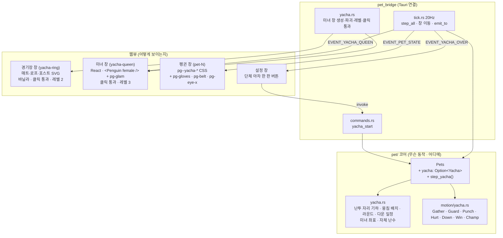
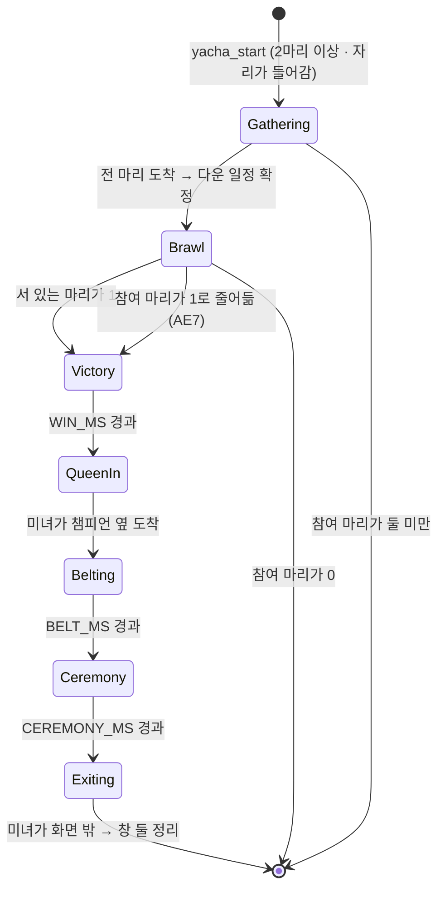
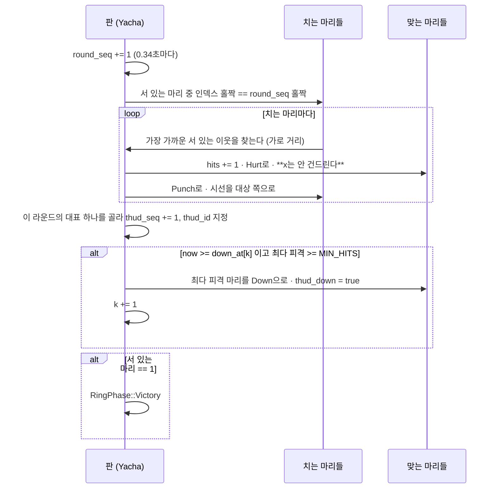

# 단체 야차 — 한가운데에서 치고받고 벨트를 받는다

## Goal Capsule

- **목표** — 설정 창에서 "단체 야차 한 판"을 누르면 화면의 펭귄들이 **화면 세로 중앙**으로
  뭉쳐, **복싱 장갑을 끼고 제자리에서 서로를 친다.** "퍽 퍽" 소리가 나고
  많이 맞은 마리부터 **눈이 X자가 되며 쓰러진다.** 최후의 1인이 남으면 오른쪽에서
  **화장한 미녀 펭귄**이 **챔피언 벨트**를 들고 걸어 나와 벨트를 채우고 세레모니를 한 뒤
  둘 다 정리된다. **25~30초쯤 걸리고 알아서 끝난다.** 근거: PRD에 **§5.11로 새로
  추가한다** (§4·§5.8·§5.9·§5.10은 고치지 않고, §5.5의 버튼 목록과 소리 목록만 갱신한다).
- **권위 순서** — `PRD > PRINCIPLE > CONVENTIONS > MOTIONS > 이 플랜`. 충돌하면 상위가
  이기고, 상위와 어긋나는 구현이 필요해지면 멈추고 보고한다.
- **실행 프로필** — **PR 하나.** 브랜치 `feat/f5-yacha-brawl-01`.
  기준선은 `main`의 `40bdaeb`(펭귄 크기 %, #57)다.
  TDD는 코어(`src-tauri/src/pet/`)의 국면 전이·다운 일정·펀치 판정·종료 증명에 적용한다.
  테스트 이름은 한국어. 커밋은 한국어 Angular 컨벤션, 유닛 하나가 커밋 하나.
- **정지 조건** — 아래 중 하나라도 걸리면 멈추고 보고한다.
  - **골든 테스트(`같은_시드는_같은_동작_시퀀스를_낳는다`)가 재기준화를 요구한다** →
    `pick_next`를 건드렸다는 뜻이다. 되돌린다 (KTD1). 발리볼 PR이 "이번에는 재기준화가
    없었다"를 합격 기준으로 삼은 자리다.
  - **스모크에서 "퍽퍽"이 견딜 수 없다.** 상수(`YACHA_ROUND_MS`)로 한 단계 늘려 보고,
    그래도 안 되면 KTD7의 근거가 무너진 것이다 — 임의로 소리를 빼지 말고 보고한다.
    사용자가 명시적으로 요구한 요소다.
  - **미녀 펭귄 창(React 엔트리 하나 추가)이 번들이나 창 레벨에서 예상 밖으로 걸린다** →
    KTD9의 갈래를 다시 고른다.
  - **미녀 창이 클릭을 통과시키지 못한다** — 그림뿐인 창이 화면을 먹으면 PRINCIPLE 5를
    근거 없이 어긴다 (발리볼 KTD5와 같은 자리).
  - **한 판이 40초를 넘거나 15초 아래로 떨어진다** — 상수로 못 푸는 구조 문제다.
  - PRD·PRINCIPLE과 어긋나야만 구현이 가능해진다 (특히 §4 게임화 비목표).
- **꼬리 작업** — `.github/TEMPLATE/PR.md`로 PR을 연다. **merge는 두 러너 통과 +
  `ce-code-review` 지적 반영 뒤에 한다** (CONVENTIONS, 2026-08-30 사용자 지시). PR에
  `PRD.md`(§5.11 신설 + §5.5 두 줄)·`MOTIONS.md`(단체 야차 절 + 효과음 표 한 줄)·
  `TODO.md`(새 절 + 체크박스 하나)를 같이 넣는다.

---

## 리서치 요약

### "야차"는 무엇인가 — 근거를 찾았다

**야차클럽**은 국내 유튜브 기반 맨손 격투(발리 투도) 대회사다. 최소 방어구·최소 규칙을
표방해 핸드랩·마우스피스·파울컵만 착용한다. 이 대회 이름이 퍼지면서 **"야차룰"·"야차
뜨자"가 격식 없는 1:1 맞장을 뜻하는 은어**가 됐다. 그래서 **"단체 야차" = 여럿이 동시에
붙어 최후의 1인이 남는 난투**이고, 격투 스포츠의 용어로는 **battle royal**(여러 명이
한 링에서 붙어 마지막 한 명이 남을 때까지 하는 경기, 전통적으로 복싱 또는 레슬링 룰)이
정확히 같은 형식이다.

**결론: 이름은 임의가 아니고 사용자의 설명이 그 형식과 정확히 일치한다.** 그래서 연출에
반영할 것이 실제로 있다 — 아래 셋이고, **억지로 더 끼워 맞추지 않는다.**

1. **최후의 1인이 종료 조건이다** (판정도 라운드도 아니다). 이게 이 판의 뼈대다.
2. **격식이 없다** — 심판·코너맨·수건·경고가 없다. 그래서 이 앱이 흉내 낼 것이 적다.
3. **맨손이 야차의 정체성이지만 사용자는 복싱 장갑을 골랐다.** 어긴 것이 아니라
   **의도적인 혼합**이다: 형식(다대다·최후의 1인)은 야차에서, 소품(장갑·벨트·세레모니)은
   복싱에서 온다. 맨손으로 그리면 화면에서 "때리는 중"이 안 읽히고, 빨간 장갑 하나가
   이 판이 무엇인지 즉시 말해 준다. **사용자 설명을 그대로 따른다.**

### 복싱 경기에서 무엇을 가져오고 무엇을 버리는가

가져오는 것 — **"복싱처럼 보이는가"의 최소 집합**:

| 요소 | 왜 남기나 |
|---|---|
| **복싱 장갑** | 이 판이 무엇인지 말하는 **단 하나의 신호**다. 장갑이 없으면 그냥 몸싸움이다 |
| **KO — X자 눈** | 만화적 관습이라 설명이 필요 없다. 사용자가 직접 지정했다 |
| **화남 표시(💢)** | 타격의 순간을 만화 문법으로 찍는다. 때린 놈과 맞은 놈 **사이**에 떠서 짝을 말해 준다 |
| **최후의 1인 → 결과 확정 → 벨트 수여** | 실제 세계 타이틀전 규정이 못 박은 **순서**다: *심판이 벨트를 미리 맡아 두고, 경기가 끝나 링 아나운서가 결과를 발표한 뒤에 단체 관계자가 승자에게 벨트를 채운다.* 이 앱은 글자를 못 쓰므로 "발표"를 **승자가 양 날개를 들어 올리는 것**으로 대체한다 — 순서는 그대로 남는다 |

버리는 것 — **전부 넣으면 안 된다**(기준은 "보고 있으면 웃긴가"이지 시뮬레이션 충실도가
아니다):

| 요소 | 왜 버리나 |
|---|---|
| **라운드(3분 × N)·인터벌** | 한 판이 30초인데 라운드를 넣으면 "쉬는 시간"이 화면 정지가 된다 |
| **심판·에잇 카운트·텐 카운트** | 카운트를 보이려면 **숫자나 캐릭터를 하나 더** 얹어야 하는데, 기여도가 X자 눈보다 작다. 숫자가 화면에 뜨는 순간 §4(게임화)·§5.10(점수판 없음)에 접근한다 |
| **판정승·채점표·심판 셋** | 위와 같다. 야차의 정체성(격식 없음)과도 어긋난다 |
| **링 아나운서** | 글자가 필요하다. 승자의 "양 날개 들기"가 그 자리를 대신한다 |
| **체급·계체·코너맨·수건 투입·반칙 경고** | 전부 링 밖 이야기라 화면에 안 나온다 |
| **링·경기장** | *"경기장 없이 그냥 완전 중앙에서 대형도 없이 서로 얽히고 섥히는 느낌"* (2026-09-03 사용자, 미리보기 피드백). 판을 그리면 **줄 세운 대형**이 따라오고 그게 정확히 아니라고 한 그림이다. 창 하나와 `ns_window()` 함정 하나가 함께 사라진다 |
| **TKO/KO 구분** | 구분해 봐야 화면이 똑같다 |

---

## Product Contract

### Summary

작업이 끝나면 사용자는 설정 창에서 **"단체 야차 한 판"**을 눌러 이렇게 할 수 있다. 화면에
흩어져 걷던 펭귄들이 하던 짓을 멈추고 화면 한가운데로 날아와, 아래에서 사각 판이 밀려
올라온다. 펭귄들은 어느새 **빨간 복싱 장갑**을 끼고 한가운데에 한 줄로 마주 서서 가드를
올린다. 그리고 **퍽, 퍽, 퍽** — 옆에 있는 놈을 친다. 맞은 놈은 튕겨 나가지 않고 **그
자리에서 휘청**한다. 많이 맞은 놈부터 눈이 **X자**가 되며 뒤로 넘어가고, 별 세 개가
머리 위를 돈다. 하나씩 줄어 **마지막 한 마리**가 남으면 그놈은 양 날개를 번쩍 든다.

그때 오른쪽에서 **속눈썹이 길고 입술이 빨간 미녀 펭귄**이 **금빛 챔피언 벨트**를 들고
걸어 나온다. 챔피언 옆에 서서 벨트를 허리에 채워 주면, 챔피언은 벨트를 찬 채로 양 날개를
들고 좌우로 흔들고 미녀는 옆에서 박수를 친다. 세레모니가 끝나면 미녀는 오른쪽으로
걸어 나가고, 판이 사라지고, 쓰러져 있던 놈들이 일어나 **선 그 자리에서** 다시 걷는다.

**전적은 남지 않는다.** 누가 챔피언이었는지도, 몇 대 맞았는지도 어디에도 안 적힌다.

### Problem Frame

볼링(#45)은 사용자가 공을 굴리고, 비치발리볼(#53)은 사용자가 아무것도 안 한다. 둘 다
"여러 마리가 하나의 사건에 참여한다"를 만들었지만 **펭귄들이 서로를 적으로 보는 그림은
아직 없다.** 발리볼조차 네트를 사이에 두고 공을 주고받을 뿐이다.

이 앱의 펭귄은 원래 **싸가지가 없다**(§5.1) — 때리면 방망이를 휘두르고 등을 홱 돌린다.
그 성격이 지금까지는 **사용자와 펭귄 사이**에만 있었다. 단체 야차는 그 성격을 **펭귄들
사이**로 옮긴다. 그리고 볼링·발리볼과 달리 **끝에 이야기가 있다** — 승자가 나오고,
누군가 나와서 그걸 축하해 준다. 20초짜리 물리 시연이 아니라 **30초짜리 짧은 이야기**다.

그래서 이 기능의 위험도 다른 데 있다. 발리볼의 위험이 "20초가 지루한가"였다면 여기는
**"30초 동안 같은 그림이 반복되는가"**다. 한가운데의 펭귄 여덟이 340ms마다 똑같이 팔을
뻗기만 하면 그건 애니메이션이 아니라 GIF다. 답은 KTD5(다운이 만드는 리듬)에 있다.

### Requirements

| ID | 요구사항 |
|---|---|
| R1 | 설정 창의 버튼으로만 시작한다. 저절로 나오지 않고 확률 사다리(`pick_next`)에 끼지 않는다 |
| R2 | **화면의 펭귄 전부**가 참여한다. 우클릭한 한 마리가 아니다 (볼링·발리볼과 같은 규칙) |
| R3 | **최소 두 마리다.** 한 마리면 때릴 상대가 없으므로 판을 열지 않고 "두 마리부터 할 수 있어요"가 뜬다. **홀수 제약은 없다** — 팀이 없는 난투라 3마리도 정상이다 |
| R4 | 펭귄들은 순간이동하지 않고 **날아서** 화면 한가운데로 간다 |
| R5 | **대형이 없다.** 각자 상대를 골라 사방으로 붙었다 빠진다. 경기장·바닥·판을 하나도 그리지 않는다 |
| R6 | 판이 도는 동안 펭귄은 **복싱 장갑**을 낀다. 그림은 웹뷰가 그리고 Rust는 국면만 준다 |
| R7 | **때려도 서로 튕겨 나가지 않는다.** 맞은 마리는 **자기 자리에서** 휘청인다(넉백 없음). **다만 제 발로는 다닌다** — 다가가고·맴돌고·빼고, 겹치면 비켜선다. 구분은 "움직임의 두 종류" 절에 있다 |
| R8 | **많이 맞은 마리부터 쓰러진다.** 쓰러진 마리는 눈이 X자가 되고 판이 끝날 때까지 누워 있는다 |
| R8b | 타격의 순간 **화남 표시(💢)**가 때린 놈과 맞은 놈 **사이**에 뜬다 — 그것만으로 누가 누구를 쳤는지 읽힌다 |
| R9 | **사용자 입력이 없다.** 누가 누구를 치고 언제 쓰러지는지는 전부 시드 난수로 만든다 — 같은 시드는 같은 판을 낳는다 |
| R10 | **최후의 1인**이 남으면 난투가 끝난다. 판이 몇 마리로 시작했든 끝은 하나다 |
| R11 | 오른쪽에서 **화장한 미녀 펭귄**이 **챔피언 벨트**를 들고 걸어 나와 채워 주고, 세레모니 뒤 오른쪽으로 걸어 나간다 |
| R12 | 한 판은 **25~30초쯤**(2.5+14+0.9+2+1.2+2.5+1.2 = 24.3초) 걸리고 알아서 끝난다. 마릿수가 늘어도 길이가 비례해 늘지 않는다 |
| R13 | **점수판·전적이 없다.** 몇 대 맞았는지, 누가 챔피언이었는지 세지도, 보여주지도, 저장하지도 않는다 |
| R14 | 끝나면 **선 그 자리에서** 평소 동작으로 돌아간다. 원래 자리로 되돌려 보내지 않는다 |
| R15 | 판이 도는 동안에도 펭귄을 클릭·드래그할 수 있고 다른 앱도 평소대로 쓸 수 있다 |
| R16 | 판이 도는 중에 펭귄을 추가·삭제하거나 앱을 끄면 판이 깨지지 않고 정리된다 |
| R17 | **효과음을 켰으면 "퍽" 소리가 난다** (기본 꺼짐). 껐으면 그림만으로 때리는 것이 읽혀야 한다 |
| R18 | 볼링·비치발리볼과 **서로를 배제한다.** 어느 하나가 도는 동안 버튼 셋이 함께 비활성된다 |
| R19 | 저장하지 않는다 (PRD §7). 앱을 껐다 켜면 판은 그냥 없다 |

### Acceptance Examples

**AE1 — 다섯 마리로 한 판 (표준 시나리오)**
Given 펭귄 5마리가 화면에 흩어져 있고 아무 판도 안 돌고 있다
When 설정 창에서 "단체 야차 한 판"을 누른다
Then 다섯이 화면 세로 중앙으로 날아오고(2초 안팎) 그 사이 판이 밀려 올라온다. 다섯 다
빨간 장갑을 끼고 한 줄로 서서 가드를 올린다. 0.34초쯤마다 몇 마리가 팔을 뻗고 맞은 쪽이
휘청이며 **퍽 소리가 한 발** 난다(소리를 켰을 때). **아무도 옆으로 밀려나지 않는다.**
15초 안팎 동안 넷이 차례로 눈이 X자가 되며 넘어간다. 마지막 하나가 양 날개를 들면
오른쪽에서 미녀 펭귄이 벨트를 들고 걸어 나와 채워 주고, 챔피언이 벨트를 찬 채 세레모니를
한다. 미녀가 오른쪽으로 나가고 판이 사라지면 다섯 다 **서 있던 자리에서** 걷기 시작한다.
**전체 25~30초.** 점수는 어디에도 안 나온다.

**AE2 — 한 마리면 안 연다**
Given 펭귄이 1마리다
When "단체 야차 한 판"을 누른다
Then 판이 열리지 않고 "두 마리부터 할 수 있어요"가 설정 창에 뜬다. 그 한 마리는 하던
짓을 그대로 한다. 미녀 창은 하나도 안 생긴다.

**AE3 — 두 마리 (원조 야차룰, 1대1)**
Given 펭귄이 2마리다
When "단체 야차 한 판"을 누른다
Then 둘이 마주 서서 치고받고, 예산 후반에 한 마리가 쓰러진다. 세레모니는 다섯 마리일
때와 똑같이 진행된다. **전체 길이가 다섯 마리 때와 크게 다르지 않다** (KTD5).

**AE4 — 여덟 마리 (상한)**
Given 펭귄이 8마리다
When "단체 야차 한 판"을 누른다
Then 여덟이 한 줄로 서고 이웃끼리 친다. 일곱이 차례로 쓰러지는데 **다운 간격이 대략
균등**하다 — 앞에서 몰아서 쓰러지고 뒤가 비지 않는다. 전체 길이는 두 마리 때와 같은
범위(25~30초)다.

**AE5 — 한가운데에서 다른 앱 클릭**
Given 판이 돌고 있고 판이 화면 가운데를 덮고 있다
When 미녀 펭귄이 지나가는 자리 위에서 다른 앱의 창을 클릭한다
Then 그 앱이 정상으로 반응한다. 경기장 창도 미녀 창도 클릭을 통과시킨다.

**AE6 — 판 도중 펭귄을 집어 든다**
Given 다섯이 치고받는 중이다
When 그중 하나를 드래그해 뭉친 자리 밖으로 끌어낸다
Then 그 마리는 판에서 빠지고(놓으면 평소로 돌아간다) 장갑도 벗는다. 남은 넷은 계속
친다. 다운 일정은 남은 마릿수에 맞춰 이어진다. 크래시가 없다.

**AE7 — 판 도중 참여 마리가 하나로 줄어든다**
Given 둘이 치고받는 중이다
When 하나를 삭제한다
Then 남은 하나가 **그대로 챔피언이 되어** 세레모니로 넘어간다. 판이 억지로 접히지 않는다.
(참여가 **0**이 되면 그때는 판을 접고 창을 전부 닫는다.)

**AE8 — 소리를 껐을 때**
Given 효과음이 꺼져 있다 (기본값)
When 판을 연다
Then 소리는 한 발도 안 나지만 팔을 뻗는 자세·맞고 휘청이는 자세·임팩트 별표로
**때리는 중이라는 것이 그림만으로 읽힌다.**

**AE9 — 핀볼 모드를 켜 둔 채로**
Given 핀볼 모드가 켜져 있다
When 판을 연다
Then 판은 정상으로 돌아가고 **판이 도는 동안 마리 간 충돌이 쉰다** — 한가운데에서 서로를
튕기지 않는다 (발리볼과 같은 규칙, PRD §5.10). 커서 방망이로 한가운데의 펭귄을 후려치면
그 마리는 **판에서 빠져** 날아간다 (AE6과 같은 규칙).

### Scope Boundaries

**비목표 (PRD §4 근거)**

- **점수·전적·챔피언 기록·연승** — §4의 게임화 비목표. 챔피언은 900밀리초짜리 자세와
  세레모니로만 존재하고 그 뒤 아무 데도 안 남는다 (R13).
- **사용자 조작** — 누구를 응원하는 것도, 편을 드는 것도, 다시 하기도 없다. 다시 하려면
  버튼을 다시 누른다.
- **심판·카운트·라운드·판정** — 위 리서치 표의 "버리는 것" 그대로.
- **체력 바·데미지 숫자·이펙트 수치** — 화면에 숫자가 뜨지 않는다.
- **경기장·링·바닥** — 2026-09-03 사용자 피드백으로 뺐다. 판을 그리면 줄 세운 대형이
  따라오고 그게 정확히 아니라고 한 그림이다. **창이 하나 줄고**, 창 레벨을 내리려고
  `ns_window()`를 만지는 자리가 통째로 사라진다 (앱이 흔적 없이 죽는 그 함정).
- **누가 누구를 치는지 알려 주는 선·화살표·이름표** — 위치와 화남 표시로 읽힌다
  (*"서로 펭귄 위치 아니까 누가 누구랑 싸우는 지도 알잖아"*).
- **야차 중 볼링/발리볼, 볼링/발리볼 중 야차** — 셋은 서로를 배제한다 (KTD11).
- **미녀 펭귄이 마릿수에 드는 것** — 그 마리는 `Pets`가 아니라 판이 갖는 배우다.
  설정 창의 마릿수도, 삭제 대상도, 시드도 없다.

**Deferred to Follow-Up Work**

- **다운된 마리 위의 별이 도는 것 이상의 연출**(참새·비둘기·의사 펭귄 등) — X자 눈과
  별 셋으로 충분한지 스모크에서 본 뒤에 정한다.
- **세레모니 효과음("짠")** — 이번에 넣는 소리는 **퍽 하나**다. 소리를 여덟에서 아홉으로
  늘리는 판단은 퍽이 실제로 어떻게 들리는지 보고 따로 한다.
- **뭉친 자리의 겹침 순서를 실제로 제어하기** — 지금은 y로만 말하고 창 z 순서와
    다투지 않는다 (KTD9c). 스모크에서 어색하면 먼저 `HUDDLE` 상수를 손보고,
    그래도 안 되면 그때 창 순서를 다시 본다.
- **야차 국면에 클릭 통과 주기** — `TODO.md`의 열린 항목 *"크게 도는 국면에도 통과를
  주기"*에 야차를 한 줄 더한다 (KTD12).

---

## 난투 명세 — 아티팩트에서 옮겨 적은 것 (이 절이 단일 원천이다)

2026-09-03 사용자 지시로 아티팩트(`yacha.html`의 `simulate()`)가 동작 명세가 됐다.
**스크래치패드는 사라지므로 수치와 규칙을 여기 그대로 옮긴다.** 아래와 코드가
어긋나면 아래가 이긴다.

### 좌표계

아티팩트는 1000×620 무대를 쓴다. 코어는 "펭귄이 늘 140인 세계"이므로 **아티팩트의
1픽셀 = 코어의 1픽셀**로 그대로 옮긴다 (`PET_SIZE`가 양쪽에서 같은 뜻이다).

| 이름 | 값 | 뜻 |
|---|---|---|
| `DT` | 20ms | 시뮬레이션 한 걸음. **틱(50ms)과 다르다** — 한 틱에 두세 걸음을 돌린다 |
| `ARENA_X` | 판 가운데 ±408 | 다니는 가로 범위 (화면에 맞춰 줄어든다) |
| `ARENA_Y` | 발밑 기준 −214 ~ +96 | 다니는 세로 범위. **위로 갈수록 멀고 작다** |
| `REACH` | 118 | 주먹이 닿는 거리. **판을 넓혀도 이건 안 건드린다** |
| `NEAR` | 84 | `circle`이 거리를 유지하는 데만 쓴다 — **상태 고르기에는 안 쓴다**(v6) |
| `SEP` | 46 | 이보다 겹치지 않는다 |
| `YW` | 1.35 | 세로 1px을 가로보다 멀게 센다 (원근) |
| 걸음 | 0.124 px/ms | `hunt` 기준. 맴돌기·빼기는 계수가 다르다 |
| 깊이 배율 | `1 + yOff/700` | 아래에 있을수록 크다 |
| `SWING_MS` | **180ms 고정**, **42% 지점에서 판정** | v5는 150~240에서 뽑아 놓고 진행도를 220으로 나눠 어긋나 있었다 |
| `HURT_MS` | **140ms** | v6에서 줄였다 — 빨리 복귀해야 연타가 안 끊긴다 |

### 상태 일곱

`hunt`(다가감) · `circle`(맴돎) · `back`(뺌) · `guard`(막음) · `swing`(침) ·
`hurt`(휘청) · `idle`(혼자 남음).

**상태는 상대와의 거리로 고른다** (`t >= until`일 때만 다시 고른다). **v6에서
표가 둘로 줄었다** — `NEAR`는 이제 상태 고르기에 안 쓴다:

| 거리 | 고르기 | 길이 |
|---|---|---|
| `d > REACH` | hunt 78% / circle 22% | 200~520ms |
| `d <= REACH` | swing 52%(**방금 쳤으면 64%**) / guard 15% / back 14% / circle 나머지 | swing은 `SWING_MS` **고정**, 나머지 140~420ms |

**왜 둘로 줄였나 — 헛스윙이 밀도를 깎았다.** v5는 사정거리 밖에서도 스윙을
골랐는데, 닿지 않으면 판정이 안 나서 **화면에서는 아무 일도 안 일어난다.**
측정으로 4마리 14초에 29발, 2마리는 9발뿐이었다("움직임이 거의 없다"의 정체).
**닿을 때만 친다**로 바꾸고, 멀면 그 시간을 붙는 데 쓴다.

**"방금 쳤으면 더 친다"(52% → 64%)가 연타를 만든다.** 이게 퍽퍽퍽 소리의 정체다.

`circle`을 고르면 도는 방향(`side`)을 새로 뽑는다.

**움직임** (`ux,uy`는 상대 쪽 단위 벡터, `step = 0.124 × DT`):

- `hunt`: `x += ux·step`, `y += uy·step·0.72`
- `circle`: `x += -uy·side·step·0.7`, `y += ux·side·step·0.5`.
  너무 붙으면(`< NEAR-8`) 조금 물러나고, 너무 멀면(`> REACH+66`) 조금 붙는다
- `back`: `x -= ux·step·1.25`, `y -= uy·step·0.9` (v6에서 키웠다 — 판을 더 넓게 쓴다)
- `swing`: 안 움직인다. 진행률 42%에서 한 번만 판정한다

**시선**: `circle`이 아닐 때만 상대 쪽으로 돌린다 (맴돌 때 돌면 도망가는 그림이 된다).

### 상대 고르기

상태를 다시 고르는 순간에만 바꾼다:
- 상대가 없거나 · 쓰러졌거나 · 자기 자신이거나 · **32% 확률**(v6에서 26%→32%)이면
  다시 고른다.
- 고를 때 **절반은 제일 가까운 놈, 절반은 아무나.** 이것 하나로 1:1도 1:N도
  규칙 없이 생긴다 — 한 놈에게 둘이 붙기도 한다.

### 타격 판정

주먹 진행률 42%에서 **한 번만**:
- 거리가 `REACH` 이하이고 상대가 안 쓰러졌으면 맞는다.
- **상대가 `guard`면 막힌다** — 피격 수가 안 오르고 휘청이지도 않는다.
  화남 표시는 뜨되 **작고(0.5배) 흐린 회색**이고 소리도 둔탁하다.
- 안 막혔으면 피격 수 +1, 상대가 이미 `hurt`가 아니면 `hurt` **140ms**
  (v6에서 180→140: 빨리 복귀해야 연타가 안 끊긴다).
- 화남 표시 자리는 **둘 사이의 64:36 지점** (맞은 쪽에 가깝게).

### 합격 기준 — 측정값 (시드 20260903, 난투 14초)

**정확히 같은 값일 필요는 없다** (난수 구현이 다르면 달라진다). **성질**을 본다.

| 마릿수 | 초당 펀치 | 이동폭(가로) |
|---|---|---|
| 2 | 1.2발 | 80~93 |
| 4 | 3.9발 | 53~159 |
| 8 | 6.6발 | 36~260 |

**테스트로 못 박을 성질 셋**
1. **박자가 없다** — 같은 시각에 몰린 펀치가 거의 없다 (마리마다 제 상태 기계라서).
2. **마릿수가 늘수록 초당 펀치가 는다.**
3. **난투 구간 길이는 마릿수와 무관하다.**

### 겹침 해소 — 밀려나는 게 아니라 비켜서는 것

매 걸음, 서 있는 모든 쌍에 대해 거리가 `SEP` 미만이면 **둘 다** 반씩 비켜선다
(`push = (SEP - d) × 0.2`). **이건 넉백이 아니다** — 아래 "움직임의 두 종류" 참조.

### 다운

예산을 마릿수로 나눠 `k`번째 다운 시각을 뽑는다:
`lo = 예산·(k+1)/(n+0.35)`, `hi = 예산·(k+2)/(n+0.35)`, 그 사이에서 `lo + rnd()·(hi-lo)·0.6`.
단조 증가가 구조적으로 보장된다. 그 시각에 **서 있는 마리 중 가장 많이 맞은 놈**이
넘어간다 (KTD5 그대로). 쓰러진 자리에 그대로 눕는다.

### 혼자 남으면 `idle`

아무도 안 친다. **허공에 주먹을 내지르면 이긴 게 아니라 이상해 보인다.**
쓰러진 놈을 치는 것도 막는다.

### 자세 값 (웹뷰가 쓰는 것)

| 상태 | lean | arm | guard |
|---|---|---|---|
| hunt | 5 | 0 | 0 |
| back | −6 | 0 | 0 |
| circle | 1.5 | 0 | 0 |
| guard | −2 | 0 | 1 |
| idle | 0 | 0 | 0 |
| hurt | `−16 × 남은비율` | 0 | 0 |
| swing | `9 × arm` | `sin(진행률 × π)` | 0 |

모든 상태에 숨쉬기 흔들림 `sin(t/190 + i·1.9) × 1.6`이 더해진다.

---

## 움직임의 두 종류 — "튕겨나가지 않는다"의 정확한 뜻

**이 구분을 흐리면 다음 사람이 "야차는 안 움직인다"로 읽는다.**

| | 금지 | 허용이자 필수 |
|---|---|---|
| 무엇 | 맞아서 밀려남(넉백), 마리 간 충돌 튕김, 방망이 스윙의 이웃 넉백 | 제 발로 다가가고·맴돌고·빼는 것, 겹치지 않게 **비켜서는** 것 |
| 누가 정하나 | 남이 준 속도 | 제 상태 기계 |
| 어떻게 막나 | `collide_pinball` 가드 · `whack` 이웃 제외 · `yacha_hurt`가 좌표를 안 건드림 | — |

`yacha_hurt`는 좌표를 **한 줄도** 안 건드린다. 그게 넉백 금지의 자리다.
이동은 `tick_yacha`의 `hunt`/`circle`/`back`이 하고, 그건 **제 의지**다.

---

## Planning Contract

### Key Technical Decisions

**KTD1 — `pick_next`를 건드리지 않는다. `start_yacha` 패턴으로 외부 트리거만 만든다.**
볼링(KTD1, #45)·발리볼(KTD1, #53)과 완전히 같은 이유다. `pet/mod.rs`의 `pick_next`는
정해진 순서로 `range()`를 소비하므로 여기 분기를 하나 끼우면 뒤의 모든 확률이 밀려
**골든 수열을 여덟 번째로 재기준화**해야 한다. 야차는 버튼으로만 시작하므로 사다리에 낄
이유가 아예 없다. `Pets::start_yacha`가 참여 마리마다 `Pet::start_yacha`를 직접 부른다.
**결과: `core_tests.rs` diff의 삭제가 0줄이어야 한다.** 이게 PR의 합격 기준 하나다.

**KTD2 — 판 상태는 `Pets`가 소유하고, 난수는 판이 따로 갖는다.**
발리볼(KTD2)의 근거 그대로다. 판이 도는 중에 펭귄을 지웠을 때 자리를 비우는 일을
원자적으로 할 자리가 `Pets`밖에 없다 (R16/AE6/AE7). 그리고 `Pet::rng`를 태우면 **판에
참여한 마리만 이후 동작 시퀀스가 밀린다** — 그래서 `Yacha` 구조체가 자기 xorshift 상태를
갖고 시드는 `start_yacha(now_ms, ring, seed)` 인자로 받는다. 브릿지는 `now_ms()`를,
테스트는 고정 시드를 넘긴다 → `같은_시드는_같은_판을_낳는다`가 성립한다 (PRINCIPLE 3, R9).

**KTD3 — "서로 튕겨나가지 않는다"는 네 층에서 함께 잡는다.**
사용자 명세의 핵심이고 핀볼과 이 판을 가르는 선이다. **넷 다 이미 발리볼이 밟은 자리라
새로 발명할 것이 없다 — 빠뜨리면 안 되는 것들이다.**

1. **펀치는 좌표를 바꾸지 않는다.** `Yacha::round`는 공격자·피격자 id와 `hits` 카운터만
   갱신하고, `motion/yacha.rs`의 `Punch`·`Hurt` 국면은 `self.x`를 **한 줄도 안 쓴다.**
   테스트 `펀치를_맞아도_x가_변하지_않는다`가 못 박는다. (휘청이는 몸짓은 CSS
   `transform`이라 창이 안 움직인다 — 상태의 주인을 나누는 PRINCIPLE 4 그대로다.)
2. **핀볼의 마리 간 충돌을 판이 도는 동안 통째로 쉰다.** `Pets::step_all`은
   `collide_pinball`을 **판 단위로** 건너뛴다 — `if self.bowling.is_some() ||
   self.volleyball.is_some()`. 여기에 **`|| self.yacha.is_some()` 한 줄**을 더한다.
   마리별 `Behavior` 검사가 아니라 판 유무 검사라는 것이 중요하다: 핀볼은 배타 모드가
   아니라 세계의 규칙이라 KTD11의 상호 배제로는 못 막고, 이 가드가 유일한 문이다.
   발리볼에서 이 가드 없이는 랠리가 **0.4초 만에 찢어졌다**는 실측이 있다 (AE9).
3. **방망이 넉백이 이웃을 안 건드린다.** `Pets::whack`은 넉백 대상에서 `Dragged ||
   is_bowling() || is_volleying()`인 이웃을 **이미 건너뛴다.** 여기에 `is_yachaing()`을
   더한다. **야차가 셋 중 압도적으로 위험하다** — 뭉쳐 서므로 이웃이 `SWING_REACH`(200px)
   안에 **거의 전부** 들어온다. 빠지면 한 번 휘두를 때 판이 통째로 날아간다.
   **직접 클릭한 마리는 그대로 빠진다** — 그건 사용자가 노린 것이다 (PRD §5.10과 같은 규칙).
4. **사용자만이 튕겨 낼 수 있다.** 방망이·핀볼 채·드래그로 맞은 그 마리는
   **판에서 빠지고**(`leave_yacha`) 평소 물리를 탄다 (발리볼 A6).

**KTD4 — 국면을 마리 국면(`YachaPhase`)과 판 국면(`BoutPhase`)으로 나눈다.**
발리볼의 `VolleyPhase` / `CourtPhase` 분할을 그대로 따른다. 마리 국면은 웹뷰가 CSS
클래스로 받아야 하는 것(`Behavior`에 실려 나간다)이고, 판 국면은 창을 언제 만들고 언제
닫는지를 정하는 것(스냅샷으로 나간다)이라 주기와 소비자가 다르다.

```rust
// behavior.rs — 마리 국면 (웹뷰가 `pg--yacha-*`로 받는다)
pub enum YachaPhase {
    Gather,   // 한가운데로 날아온다 — **유일한 공중 국면**
    Guard,    // 가드를 올리고 스텝 (기본 자세)
    Punch,    // 팔을 뻗는다 (0.26초)
    Hurt,     // 맞고 휘청 — **자리는 안 변한다** (0.22초)
    Down,     // X자 눈으로 누워 있다 (판이 끝날 때까지)
    Win,      // 최후의 1인 — 양 날개를 든다 (0.9초)
    Champ,    // 벨트를 차고 세레모니
}

// yacha.rs — 판 국면 (`Pets`가 갖는 판이 소유)
enum RingPhase {
    Gathering,  // 전 마리가 자리에 도착하기를 기다린다
    Brawl,      // 난투 — 다운 일정이 굴러간다
    Victory,    // 최후의 1인이 날개를 든다
    QueenIn,    // 미녀가 오른쪽에서 걸어 들어온다
    Belting,    // 벨트를 채운다
    Ceremony,   // 챔피언 + 미녀 세레모니
    Exiting,    // 미녀가 오른쪽으로 걸어 나간다
}
```

**`Behavior::is_airborne()`은 `Yacha { .. }` 전 국면에 `true`를 준다.** 볼링·발리볼이
둘 다 그렇다 — **자리가 화면 세로 중앙이면 전 국면이 공중이어야 한다.** 하나라도
`false`면 `clamp`가 매 틱 `y = floor_y`로 눌러 그 마리만 바닥으로 끌려 내려간다.
(A1이 뒤집혀 자리가 바닥으로 가면 이 결정도 함께 뒤집힌다 — 그때는 `Gather`만 공중이다.)

**KTD5 — 다운 시각은 예산이 정하고, 누가 쓰러지는지는 피격 수가 정한다. (이 플랜의 핵심)**

*"몇 대 맞으면 쓰러지는가"에 고정 임계값을 두면 안 된다.* 8마리는 서로 나눠 맞아 아무도
임계에 못 닿고, 2마리는 순식간에 닿는다. 판 길이가 마릿수에 좌우되면 R12가 깨진다
(AE3/AE4). 그래서 **둘을 분리한다.**

**언제 — 판 시작에 다운 일정을 미리 뽑는다.** 난투 예산 `B`(시드로 14~18초)를 참가
`N`마리로 나눠 다운 `N-1`회를 구간에 하나씩 배치한다:

> `k`번째 다운(`k = 0..N-2`)은 구간 `[B·(k+1)/N, B·(k+2)/N)` 안에서 균등하게 뽑는다.

이 정의는 **단조 증가가 구조적으로 보장**되고 마지막 다운이 항상 `B` 직전에 온다.
`N=2`면 구간이 `[B/2, B)` 하나뿐이라 1대1도 예산을 다 쓴다 (AE3). `N=8`이면 일곱 번의
다운이 `B/8` 간격으로 고르게 흩어진다 (AE4). **마릿수와 무관하게 판 길이가 같다.**

**누가 — 그 시각에 서 있는 마리 중 `hits`가 가장 많은 마리다.** 동점이면 `PetId`가 작은
쪽. 사용자 요구 *"많이 맞은 펭귄들은 쓰러짐"*을 그대로 만족하면서 완전히 결정적이다.
**한 대도 안 맞고 쓰러지는 일을 막는 최소 조건** `YACHA_MIN_HITS = 3`을 둔다 — 최다
피격이 3 미만이면 그 다운을 다음 틱으로 미룬다. 펀치가 0.34초마다 나므로 실제로는
거의 안 걸리고, 걸려도 몇 틱이면 풀린다.

**이게 "30초 동안 같은 그림"을 막는 장치다.** 난투 화면은 3~4초마다 한 번씩 **한 마리가
넘어가는 사건**으로 끊긴다. 넘어질 때마다 남은 마릿수가 줄어 남은 놈들의 자세와 간격이
달라지고, 마지막 둘이 남는 구간은 저절로 1대1이 된다. 리듬을 만드는 것은 펀치가 아니라
**다운**이다.

**종료가 증명된다.** ① 다운 일정의 마지막 항이 `B` 미만이고 ② `hits`는 서 있는 마리가
둘 이상인 동안 매 라운드 반드시 증가하며(스탠스 간격이 사정거리보다 좁아 이웃이 항상
사정거리 안이다 — 아래 `const assert!`) ③ 그래도 안 끝나면 `YACHA_MAX_MS`가 판을 접는다.
테스트 `아무리_오래_돌아도_최후의_1인이_나온다`가 세 겹을 한 번에 잡는다.

**KTD6 — 난투 라운드: 서 있는 마리의 절반이 매 0.34초마다 이웃을 친다.**

`YACHA_ROUND_MS`(340ms)마다 판이 한 라운드를 돈다. 그 라운드에 치는 것은 **서 있는
마리 중 인덱스 홀짝이 라운드 번호와 맞는 쪽**이다 — 난수가 아니라 교대다. 이유:

- **난수로 뽑으면 "왜 쟤가?"가 된다** (발리볼 KTD3-1이 받는 마리를 거리로 정한 것과 같은
  교훈). 교대면 *한 박자 걸러 서로 주고받는* 리듬이 눈에 읽힌다.
- **동시에 여럿이 치는 그림이 이 판의 볼거리다.** 여덟 마리면 네 쌍이 동시에 퍽 — 한
  쌍씩 순서대로 치면 나머지 여섯이 멍하니 서 있는 시간이 생긴다.

**대상은 거리로 정한다** — 서 있는 이웃 중 가로 거리가 가장 가까운 마리. 시선(`Facing`)이
그쪽을 향하므로 "쟤가 쟤를 친다"가 읽힌다. 대상의 `hits`가 1 늘고 `Hurt`로 넘어간다.

난수가 쓰이는 곳은 **판 예산, 다운 시각, 초기 서는 순서(셔플)** 셋뿐이다. 펀치 자체는
결정적이다 — 그래야 같은 시드가 같은 판을 낳는다는 것을 눈으로 확인할 수 있다.

**KTD7 — "퍽"은 넣는다. 라운드마다 정확히 한 발, 코어가 대표를 지목한다.**

**이건 발리볼(KTD8)이 ✕한 것과 같은 모양이라 근거를 정확히 써 둬야 한다.**
`MOTIONS.md`의 자격 규칙은 *"사용자가 방금 한 짓의 결과이거나, 시간당 한 번보다
드물거나"*이고 발리볼은 *"버튼 한 번이 20초에 걸쳐 열몇 발을 낳으면 다섯 번째쯤에서
손짓과 소리의 연결이 끊긴다"*를 근거로 잘랐다. 야차는 그보다 더 많이 난다(15초에 약 44발).

**그래도 넣는다. 근거 셋:**

1. **사용자가 명세에 직접 넣었다** — *"서로 튕겨나가지 않고 퍽퍽소리나면서 때리다가"*.
   문서 권위 순서상 사용자 지시가 `MOTIONS.md`의 판단 위에 있다. 얼음낚시 "첨벙"이
   자격 규칙의 첫 예외가 된 것도 2026-09-01 사용자 지시였다.
2. **발리볼의 소리는 랠리의 부산물이었지만, 야차에서 "퍽"은 동작 그 자체다.**
   공을 치는 그림은 소리 없이도 공이 날아가는 것으로 읽힌다. 때리는 그림은 **닿는 순간
   아무 일도 안 일어나면** 팔만 흔드는 것이 된다. 소리를 빼면 기능이 절반 죽는다.
3. **규칙적인 "퍽 퍽 퍽"은 배경 소음이 아니라 리듬이다.** 0.34초 등간격의 타격음은
   만화적 관습이고, 판이 끝나면 딱 멎는다.

**대신 누적을 세 겹으로 누른다:**

- **라운드당 정확히 한 발.** 마리마다 소리를 내면 여덟 마리에서 라운드당 네 발이 겹친다.
  그래서 **코어가 대표 타격을 지목한다** — 판이 라운드마다 한 마리를 골라
  **그 마리의 `Snapshot`에만 `punch_seq`를 올린다.** 웹뷰의 판정은 `soundsFor(prev,
  next)`가 보는 것이 **`PetSnapshot` 하나뿐**이므로(판 스냅샷은 안 본다) 소리 신호도
  거기 실려야 한다 — `whack_seq`와 **정확히 같은 꼴**이라 새 개념이 없다.
- **다운의 마무리 한 방만 다르다.** 같은 스냅샷의 `punch_down: bool`이 서면 반음을
  낮춰(-7) 더 낮고 긴 퍽을 낸다 — 44발이 다 똑같으면 그게 소음이다.
- **`Snapshot`에 필드를 더하면 `Look`도 함께 는다.** `pet_bridge/tick.rs`의
  `Look`/`look_of`/`should_notify`가 "무엇이 바뀌면 웹뷰에 알리나"를 정하는데,
  `punch_seq`를 거기 안 넣으면 **자리가 안 변한 라운드의 퍽이 통째로 유실된다.**
  `should_notify`에는 `Look` 구성요소마다 테스트가 하나씩 있으므로 새 항목도 하나 더한다.
  (`whack_seq`가 이미 그 자리에 있으니 그 옆에 붙인다.)
- **소리 자체를 새로 만들지 않는다.** `synth.ts`의 `playWhack`("퍽 — 노이즈 버스트 +
  저역 툭")이 이미 정확히 그 소리다. **소리 목록은 일곱에서 여덟이 된다**
  (`SoundName`에 `punch` 추가, 쿨다운 200ms). PRD §5.5와 `MOTIONS.md` 효과음 표를
  같은 PR에서 갱신하고, 표에는 **○ 한 줄로 위 근거를 남긴다** — 발리볼의 ✕ 바로 아래에
  두어 *왜 비슷해 보이는데 판단이 갈렸는지*가 한눈에 보이게 한다.

**소리가 꺼져 있어도 성립해야 한다** (R17/AE8, 기본 꺼짐이 원칙이다). 그래서 타격은
그림으로도 완결된다: 공격자의 `Punch` 자세, 피격자의 `Hurt` 휘청, 그리고 **닿는 자리에
터지는 임팩트 별표**(CSS `::after`, 새 `@keyframes` 하나).

**KTD8 — 세레모니는 판 국면 넷으로 나눈다. 순서는 실제 타이틀전 규정에서 온다.**

실제 규정은 *경기 종료 → 링 아나운서의 결과 발표 → 단체 관계자가 승자에게 벨트 수여*
순이다. 글자를 못 쓰므로 "발표"를 승자의 **양 날개 들기**로 대체하면 순서가 그대로 산다.

| 국면 | 길이 | 화면에 무엇이 |
|---|---|---|
| `Victory` | 0.9초 (`SASSY_MS`) | 최후의 1인이 양 날개를 번쩍 든다. 쓰러진 놈들은 그대로 누워 있다 |
| `QueenIn` | ~2초 | 오른쪽 화면 밖에서 미녀 펭귄이 벨트를 들고 **걸어** 들어와 챔피언 옆에 선다 |
| `Belting` | 1.2초 | 미녀가 벨트를 챔피언 허리에 채운다. 채워지는 순간 챔피언의 `pg-belt`가 켜진다 |
| `Ceremony` | 2.5초 | 챔피언이 벨트를 차고 양 날개를 들어 좌우로 흔들고, 미녀는 옆에서 박수 |
| `Exiting` | 1.2초 | 미녀가 오른쪽으로 걸어 나간다. 동시에 쓰러진 놈들이 일어난다 |

합계 약 7.8초. 여기에 모이기(1.5~3초) + 난투(14~18초)를 더해 **총 23~29초**다. 볼링·
발리볼(20~25초)과 같은 결이다.

**`QueenIn` 이후로는 참여 마리가 0이 되어도 판을 접지 않는다** — 발리볼의 `Point`가
같은 자리다. 접었다가는 세레모니 그림이 나오기 전에 판이 사라진다. 챔피언이 사라지면
미녀는 챔피언이 서 있던 자리까지 걸어와 혼자 벨트를 들고 세레모니를 하고 나간다.

**KTD9 — 미녀 펭귄은 자기 창이고 `<Penguin>` 그림을 재사용한다. 새 React 엔트리 하나.**

미녀는 `Pets`의 일원이 **아니다** — 마릿수·삭제 대상·시드·저장에 걸리면 안 되므로
가짜 `Pet`을 만들지 않는다. 그러면 자기 창이 필요하고, 갈래는 셋이었다.

| 안 | 판단 |
|---|---|
| **A. 새 React 엔트리 `queen.html` + `src/queen/`** | **채택.** `src/assets/penguin/index.tsx`의 `<Penguin>`을 그대로 렌더하고 `src/pet/css/`를 그대로 쓴다. `QueenApp`은 이벤트 하나를 구독해 클래스를 바꾸는 것이 전부다 |
| B. props에 바닐라 미녀 펭귄 SVG를 새로 그린다 | **금지.** 펭귄 그림이 두 벌이 된다 — #54(에셋 리팩터링)가 정확히 그걸 없앤 PR이다 |
| C. `pet.html`을 라벨만 다르게 띄우고 `PetApp`이 분기 | 기각. `PetApp`은 드래그·히트박스·소리·말풍선을 다 갖는 300줄짜리다. 그 절반이 죽은 채로 도는 창이 생긴다 |

**따라오는 것 넷**: `queen.html`, `vite.config.ts`의 `input`에 `queen`,
`capabilities/default.json`의 `windows`에 `yacha-queen`, 그리고 `followPetScale`
구독(창 안에서 고정 px를 쓰므로 배율을 받아야 한다 — #57).

**창 레벨은 펭귄과 같은 3이다.** **클릭은 통과시킨다**
(`set_ignore_cursor_events(true)`) — 그림뿐인 창이라 클릭을 먹을 근거가 없다 (R15).

**이 판에서 새로 만드는 창은 이것 하나뿐이다** (2026-09-03 사용자 피드백으로 경기장 창을
뺐다). 그래서 `ns_window()`를 만지는 자리가 **하나도 없다** — 창 레벨을 내리려던
그 자리가 앱이 흔적 없이 죽는 함정이었는데, 통째로 사라졌다.

**KTD9b — 대형도 뭉침도 아니다. 각자 제 상태 기계로 쫓아다닌다. (사용자 지시)**

두 번 뒤집혔다. ① 처음엔 이웃 간격 96px로 **줄 세웠고**, ② 피드백을 받아 중앙에
**가만히 뭉치게** 했고, ③ 미리보기를 보고 *"아티팩트대로 하고싶어"*가 왔다
(2026-09-03). 아티팩트는 **가만히 있지 않는다** — 사방으로 붙었다 빠진다.

명세는 위 "난투 명세" 절이다. 요약하면:

- 마리마다 **제 상태 기계**를 돌린다. 박자에 맞춰 다 같이 치지 않으므로 퍽퍽퍽퍽이
  몰렸다 끊겼다 한다.
- **상대를 각자 고르고, 절반은 가까운 놈 절반은 아무나** — 그래서 1:1도 1:N도
  규칙 없이 생기고 한 놈에게 둘이 붙기도 한다.
- **다니는 범위와 닿는 범위가 따로다.** 판을 넓히면 쫓아다니는 그림이 늘고 주먹은
  그대로라 붙어야만 맞는다.
- **가드는 실제로 막는다.** 막힌 주먹은 피격으로 안 세고, 화남 표시가 작고 흐린
  회색으로 뜬다.

**시드 난수로 미리 돌리지 않는다** — 아티팩트는 재생용이라 미리 돌려 프레임에
적어 뒀지만, 앱은 판이 도는 중에 마리가 빠질 수 있으므로(드래그·삭제·방망이)
매 틱 굴린다. 대신 난수는 판이 소유하므로 같은 시드·같은 참가자면 같은 판이다.

**KTD9c′ — 겹친 마리의 앞뒤는 창 레벨로 잡는다 (조사 결과)**

아티팩트는 SVG 하나에 다 그려서 `sortByDepth`(y 오름차순으로 다시 붙이기)가 공짜지만,
**앱은 마리마다 네이티브 창이 따로다.** 위아래로 다니면 누가 앞인지가 매 프레임 바뀐다.

**조사한 것 (2026-09-03, 실기기)**

| 확인한 것 | 결과 |
|---|---|
| `ns_window().setLevel`이 이 레포에서 먹는가 | **먹는다.** 핀볼 판(2)·코트(2)가 이미 그걸로 펭귄(3) 아래에 산다 |
| 20Hz 틱에서 불러도 앱이 사는가 | **산다.** 마리 넷의 레벨을 y 순서로 매 틱 다시 거는 빌드를 30초 넘게 돌렸고 프로세스도 로그도 멀쩡했다. `run_on_main_thread`로 감쌌기 때문이다 — 안 감싸면 흔적 없이 죽는 그 자리다 |
| 레벨 범위가 다른 창과 다투는가 | **안 다툰다.** 펭귄 3~10, 미녀 11. 판들은 2라 여전히 전부 아래고, 메뉴바(24)·팝업 메뉴(101)는 안 뚫는다 — 트레이가 "나가는 문"이라 가려지면 안 된다. 설정 창은 `always_on_top`이 아니라 0이라 **지금도** 펭귄 아래다 (이 기능이 바꾸는 관계가 아니다) |
| 겹친 창이 실제로 다시 쌓이는가 | **눈으로는 못 박았다.** 펭귄이 돌아다녀서 겹침을 억지로 만들려던 드래그가 아래 앱으로 새어 실패했다. **판이 도는 동안에는 겹침이 설계상 보장되므로 완성 스모크가 곧 이 검사다** — 거기서 확인한다 |

**갈래 셋 중 1번을 고른 근거**

1. **마리별 창 레벨** ← 채택. 레포의 `macos-window-order-is-not-stable-level-is.md`가
   *"순서가 아니라 레벨로 잡는다"*고 이미 결론 내린 그 메커니즘이고, 위 표대로 위험이
   전부 닫혔다.
2. 세로 이동을 줄여 겹침을 드물게 만든다 — **마지막 수단.** 세로 범위는 사용자가
   명시적으로 넓혀 달라고 한 것이라 이걸 줄이면 요구를 되돌리는 셈이다.
3. 순서를 포기한다 — 겹칠 때 먼 놈이 앞에 오는 그림이 남는다.

**어떻게 거는가**

- `pet_bridge/depth.rs`가 **뒤에서 앞** 순서를 받아 `PET_DEPTH_BASE`(3)부터 하나씩
  올려 건다. 미녀는 `QUEEN_DEPTH_LEVEL`(11)로 늘 맨 앞이다 — 벨트를 채우는 배우가
  챔피언 뒤로 숨으면 세레모니가 안 보인다.
- **순서가 안 바뀐 틱에는 AppKit을 안 만진다.** 매 틱 메인 스레드로 여덟 번씩
  건너가면 그것대로 비싸다.
- **판이 끝나면 전부 3으로 되돌린다.** 안 되돌리면 야차를 한 번 한 뒤로 그 마리들이
  서로 다른 레벨에 남아 평소에 겹칠 때 앞뒤가 이상해진다.
- 범위 불변식(판들은 아래, 메뉴바는 위, 미녀는 맨 앞)은 `depth_tests.rs`가 못 박는다.

**남은 위험**: 레벨을 바꾸는 순간 창이 깜빡이거나, 레벨이 바뀐 창이 포커스를 채가는
것. 스모크에서 본다. 둘 중 하나라도 나오면 2번으로 내려간다.

**KTD9e — 새 도형도 후광(`pg-halo`)을 그대로 탄다.**

펭귄 몸은 `#1b1f24`(거의 검정)이라 **어두운 바탕에서는 묻힌다.** 앱은 바탕화면 위에
뜨고 `.pg-halo`(같은 도형을 한 번 더 밝게 그린 사본)가 이미 그 문제를 막고 있다.
장갑·화남 표시·벨트를 `.pg-all` 안에 넣으면 후광 사본도 자동으로 따라오지만,
**`display: none`으로 숨기는 도형은 후광에서도 함께 숨어야 한다** — 한쪽만 숨으면
어두운 터미널 위에서 검은 장갑 실루엣이 사라지거나 후광만 유령처럼 남는다.
`pet-css.test.ts`의 `평소 숨기는 도형`에 새 클래스를 전부 올려 이걸 못 박는다.

**KTD9f — 미녀가 든 벨트는 날개 높이에서 앞으로 내민다.**

발치·허리 아래에 작게 그리면 **금색 덩어리가 떠 있는 것**으로 보인다
(*"벨트 이상하게 들고온다"*, 2026-09-03 사용자). 띠 + 큰 타원 판 + 가운데 장식
**세 겹**으로 그려야 벨트로 읽힌다. 자리는 `pg-belt--held`가 옮긴다.

**KTD9d — 타격은 화남 표시(💢)로 찍고, 때린 놈 쪽에 띄운다.**

처음에는 임팩트 별표였는데 *"별 대신 '화남' 표시로 해줘"*(2026-09-03 사용자).
별표는 "번쩍"이라 타격이 아니라 반짝임으로 읽힌다. 만화의 분노 핏줄(💢) —
십자로 모인 갈매기꼴 넷 — 이 이 앱의 다른 그림들과 같은 문법이다.

**어디에 뜨나가 설계다.** 사용자가 *"서로 펭귄 위치 아니까 누가 누구랑 싸우는 지도
알잖아"*라고 했으므로 **선도 화살표도 이름표도 더하지 않는다.** 대신:

- 맞은 마리가 **때린 쪽을 본다** (`yacha_hurt`가 `facing`을 함께 받는다).
- 💢는 맞은 마리의 **보는 쪽 가장자리**에 뜬다. 뭉쳐 있으므로 그 자리가 곧 **둘
  사이**이고, 별도 표식 없이 짝이 보인다.
- 그림은 맞은 마리의 창이 그린다 (창 여백이 `PET_SIZE`보다 넓어 밖으로 나갈 자리가
  있다). 새 창도, 새 좌표 계산도 필요 없다.

**KTD10 — 미녀 펭귄과 기존 `hula`(훌라 차림)는 재사용이 아니라 별개다.**

`hula.tsx`가 그리는 것은 **비치발리볼 판의 옷**(지푸라기 치마·레이·암컷 상의)이다.
한가운데에 훌라 치마가 나오면 두 판이 섞인다. 그래서:

- **재사용하는 것**: `<Penguin female />`의 **암컷 실루엣**. 미녀 창은 `female`을
  무조건 켠다(창 라벨에서 파생하지 않는다 — 이 배우는 항상 암컷이다).
- **새로 그리는 것**: `src/assets/penguin/glam.tsx` — **속눈썹·립스틱·볼터치**.
  링 걸의 정체성은 옷이 아니라 **화장**이라는 것이 사용자 표현("화장한 미녀 펭귄")이다.
- **패턴은 `hula.tsx`를 그대로 따른다**: `.pg-glam` 레이어 하나, 기본 `display: none`,
  특정 클래스 아래에서만 켠다, `pet-css.test.ts`의 `숨기는_도형` 목록에 등록.

**KTD11 — 볼링·비치발리볼·야차는 셋이 서로를 배제한다.**
셋 다 `Pets`가 소유하는 판이고 셋 다 "전 마리를 몬다". 동시에 열리면 한쪽이 상대 판의
마리를 끌어간다. 각 시작 커맨드가 **다른 두 판이 돌면 거절**하고, 설정 창의 버튼 셋은
**어느 하나라도 도는 동안 함께 비활성**된다. `PetSummary`에 `yacha: bool`이 는다.
**`start_bowling`·`start_volleyball`에도 야차 가드를 한 줄씩 넣는다** — 한쪽만 막으면
반대 순서로 여는 길이 남는다.

**KTD12 — `pose_of`의 허락 목록을 건드리지 않는다.**
`pet_bridge/tick.rs`의 `pose_of`는 **허락 목록**이고 `Walk·Turn·Sleep·Squawk·Swing·
Idle·Sassy·IceFishing`만 클릭 통과(`InBox`)를 허락한다. 야차 국면은 목록 밖이라
**자동으로 안전한 쪽**(창이 클릭을 먹는 쪽)에 떨어진다. 그 방향을 뒤집지 않는다 —
판이 도는 30초 동안 한가운데의 펭귄을 클릭·드래그할 수 있어야 하고(R15), 그건 창이 클릭을
먹어야 되는 일이다. 경기장 창과 미녀 창이 클릭을 통과시키므로 사용자가 막히는 자리는 없다.
`Guard`·`Down`은 제자리에 있어 `InBox`를 줘도 될 것 같지만, 그 판단은 `TODO.md`의 열린
항목 *"크게 도는 국면에도 통과를 주기"*에 한 줄 얹어 미룬다.

**KTD13 — 저장하지 않는다.** 볼링(KTD11)·발리볼(KTD12)과 같다. 켜 두는 모드가 아니라
30초짜리 한 판이라 `savePetSettings`를 부르지 않는다 (R19, PRD §7).

**KTD14 — 판이 끝나면 자유낙하로 내려보내지 않는다. 헤엄 하강을 재사용한다.**
판이 화면 세로 중앙이라(A1) 판이 끝날 때 마리들이 공중에 떠 있다. 여기서 그냥
`Behavior::Falling`으로 떨어뜨리면 **낙하 속도가 767px/s로 `SPLAT_MIN_IMPACT`(700)를
넘어 판이 끝날 때마다 여덟 마리가 동시에 철푸덕한다.** 발리볼이 이 함정을 이미
밟았고(`leave_court`), 답은 **헤엄의 하강 경로를 그대로 타는 것**이다:
`vx = vy = 0`, `target = (x, floor_y)`, `swim_descending = true`, `enter(Swim, ...)`.
그래서 펭귄들은 **날개를 저어 내려온다.** `motion/yacha.rs`의 `leave_ring`은
`motion/volleyball.rs::leave_court`를 그대로 베낀다 — 공중이 아니면 `enter_idle`.
**볼링은 `Falling`으로 내려보내지만** 그건 그 시점의 참여자가 대개 이미 `Thrown`이라
경로가 다르다. 베낄 것은 **발리볼 쪽**이다.

**KTD15 — 시작 거절은 값이 아니라 이유를 돌려준다.**
`start_yacha`가 `bool`이 아니라 `Result<(), YachaRefusal>`을 돌려준다
(`BoardBusy` · `NoRoom` · `TooFew`). 발리볼이 `VolleyRefusal`로 그렇게 했고 근거는
*"버튼이 눌리는데 아무 일도 없으면 고장으로 읽힌다"*다 — 설정 창이 이유별로 다른 문구를
띄운다. **발리볼과 달리 `Odd`가 없다** (R3: 팀이 없는 난투라 홀수가 정상이다).
**거절 순서가 의미를 갖는다**: `BoardBusy` → `NoRoom` → `TooFew`. 한 마리인데 자리도
안 들어가는 화면이면 "두 마리부터"가 아니라 "화면이 좁다"가 먼저 나와야 정직하다.

### Assumptions

확인 없이 채택했다. **틀리면 구현 전에 알려주면 가장 싸게 고친다.**

- **A1 — 링은 화면 세로 중앙에 뜬다** (바닥이 아니다). 볼링(#45)과 발리볼(#53)이 둘 다
  2026-09-02에 바닥 → 중앙으로 뒤집혔고 근거가 같다: 바닥이면 펭귄·소품·판이 화면 아래
  한 띠에서 겹친다. 쓰러지는 그림(뒤로 넘어가 눕는다)에는 세로 여유가 필요하다.
- **A2 — 펭귄은 대형 없이 뭉친다** (2026-09-03 사용자 지시로 뒤집었다 — 처음에는
  한 줄이었다). 자리는 시드로 뽑고, 최소 간격 하나만 지켜 완전히 포개지는 것을 막는다.
  겹치는 것이 목적이므로 `PET_SIZE`보다 좁은 범위에 넣는다 (KTD9b).
- **A3 — 서는 순서는 시드로 섞는다.** id 순으로 세우면 항상 같은 이웃끼리 싸운다.
  섞으면 같은 마릿수라도 매번 다른 대진이 나온다.
- **A4 — 판이 도는 동안 클릭·드래그·방망이로 맞은 펭귄은 판에서 빠진다** (발리볼 A6과
  같은 규칙). 빠진 마리는 장갑을 벗고 평소 물리를 탄다.
- **A5 — 쓰러진 마리는 판이 끝날 때 일어난다.** 세레모니 동안 계속 누워 있는 것이
  그림으로 더 낫다 — 챔피언 혼자 서 있는 그림이 "최후의 1인"을 말한다.
- **A6 — X자 눈은 `body.tsx`에 숨은 도형으로 넣는다.** 기존 눈 위에 X를 덮고, 기존
  눈은 `.pg--yacha-down`에서 숨긴다. **펭귄 둘(암·수)의 렌더 스냅샷이 바뀐다** — 의도된
  변경이므로 `-u`로 갱신하고 PR 본문에 "그림을 바꿨다"고 적는다 (U2 참조).
- **A7 — 미녀 펭귄은 걸어서 등장한다** (날아오지 않는다). 다른 펭귄들이 날아오는 것과
  대비되어 "다른 자리에서 온 배우"로 읽힌다.
- **A8 — 경기장 창 하나가 매트·로프·코너 포스트를 다 그린다.** 화면이 하나뿐이라 배율
  문제가 없고, 둘로 나누면 창 둘의 z 순서를 또 다퉈야 한다 (발리볼 A2와 같다).
- **A9 — `apply_yacha`는 `apply_volley`의 꼴을 그대로 베낀다** — 창 생성 실패 예산
  (`YACHA_WINDOW_MAX_FAILS`), 반쯤 만든 창을 반드시 닫는 것, `run_on_main_thread`로
  감싼 레벨 내리기까지. **베끼되 호출 자리를 확인한다** (KTD 아래 함정 절 참조).

### High-Level Technical Design

**구성 — 창 둘 추가, 코어 하나**



**판 국면 (`Pets`가 소유)**



`Victory` 이후로는 참여 0이어도 접지 않는다 (KTD8). `YACHA_MAX_MS`가 어느 국면에서든
판을 강제로 접는 마지막 안전망이다.

**난투 한 라운드 — 누가 누구를 치고 언제 쓰러지나**



---

## 공유 파일 삽입점

**원칙: 새 코드는 새 파일에 몰고, 공유 파일에는 "삽입점 한 줄"만 남긴다.** 지금 `main`
위에서 도는 다른 PR은 없지만(기준선 `40bdaeb`), 이 표는 리뷰어가 diff의 위험도를 빠르게
읽는 데도 쓰인다.

### Rust

| 파일 | 무엇을 | 규모 |
|---|---|---|
| `src-tauri/src/pet/yacha.rs` (신규) | 난투 자리 기하 · 뭉침 배치 배치 · 라운드 · 다운 일정 · 미녀 좌표 · 자체 xorshift | ~340줄 |
| `src-tauri/src/pet/yacha_tests.rs` (신규) | 판 로직 테스트 | ~260줄 |
| `src-tauri/src/pet/motion/yacha.rs` (신규) | 마리 국면 매 틱 · `start_yacha` · `leave_ring` | ~180줄 |
| `src-tauri/src/pet/motion/yacha_tests.rs` (신규) | 국면 전이 테스트 | ~160줄 |
| `src-tauri/src/pet/behavior.rs` | ① `YachaPhase` enum(7변형) ② `Behavior::Yacha { yacha }` ③ `is_airborne()`에 `Yacha { .. }` 한 갈래 (KTD4) ④ `Snapshot`에 `punch_seq: u64` · `punch_down: bool` (KTD7) | ~55줄 추가, 기존 수정 2줄 |
| `src-tauri/src/pet/mod.rs` | ① `mod yacha;` + `pub use` ② `Pets`에 `yacha: Option<Yacha>` **1줄** ③ `Pet`에 `punch_seq`·`punch_down` **2줄** ④ `step_all` 맨 앞 `self.step_yacha(now_ms);` **1줄** ⑤ `collide_pinball` 가드에 `\|\| self.yacha.is_some()` **1줄** (KTD3-2) ⑥ **`whack`의 이웃 제외 목록에 `is_yachaing()` 1줄** (KTD3-3) ⑦ `start_yacha`/`end_yacha`/`leave_yacha`/`yacha()` ⑧ `remove`·`forget`·`clear`에 각 1줄 ⑨ `start_bowling`·`start_volleyball`의 배타 조건에 각 1줄 ⑩ `YachaRefusal` enum (KTD15) | 새 메서드 ~120줄 + 삽입 11줄 |
| `src-tauri/src/pet/motion/mod.rs` | `mod yacha;` **1줄** | 1줄 |
| `src-tauri/src/pet/tuning.rs` | **파일 끝에 `// ── 단체 야차 ──` 새 절.** 기존 절은 한 줄도 안 건드린다 | ~90줄 |
| `src-tauri/src/pet_bridge/yacha.rs` (신규) | **미녀 창** 생성/파괴/클릭 통과 · `apply_yacha`. 경기장 창이 빠져 `ns_window()`를 만지는 자리가 없다 | ~170줄 |
| `src-tauri/src/pet_bridge/yacha_tests.rs` (신규) | 창 좌표 환산 테스트 | ~60줄 |
| `src-tauri/src/pet_bridge/mod.rs` | `mod yacha; pub use`, `EVENT_YACHA_QUEEN`·`EVENT_YACHA_OVER`, `PetSummary`에 `yacha: bool` | ~20줄 |
| `src-tauri/src/pet_bridge/commands.rs` | `yacha_start`(~20줄, `volleyball_start`의 꼴 그대로 — **`let ids = ...`로 먼저 받고 순회**해 자기 데드락을 피한다) + `yacha_get_queen`(첫 상태용, `volley_get_state`의 꼴). `pet_summary`에 필드 1줄 | ~35줄 |
| `src-tauri/src/pet_bridge/tick.rs` | `apply_yacha(...)` 호출 1줄 + 스냅샷 지역 변수 1줄 + `ids.is_empty()` 갈래에 고아 창 정리 1줄 + **`Look`/`look_of`/`should_notify`에 `punch_seq`** (KTD7). **`pose_of`는 안 건드린다** (KTD12) | 삽입 ~8줄 |
| `src-tauri/src/lib.rs` | `generate_handler!`에 `yacha_start`·`yacha_get_queen` **2줄** | 2줄 |
| `src-tauri/capabilities/default.json` | `windows`에 `"yacha-queen"` 1줄 + `description` 갱신 | 2줄 |

### 프론트

| 파일 | 무엇을 | 규모 |
|---|---|---|
| `src/assets/palette.ts` | `GLOVE`·`GLOVE_DARK`·`GLOVE_LACE`·`BELT_LEATHER`·`BELT_GOLD`·`BELT_GOLD_DARK`·`LIP`·`BLUSH`·`ANGER` | ~10줄 |
| `src/assets/penguin/gear.tsx` | `<BoxingGloves/>`(`.pg-gloves`) · `<ChampionBelt/>`(`.pg-belt`) · `<AngryMark/>`(`.pg-anger`) | ~75줄 |
| `src/assets/penguin/body.tsx` | `.pg-eye-x` 도형 둘 (기본 숨김) | ~14줄 |
| `src/assets/penguin/glam.tsx` (신규) | `<Glam/>` — 속눈썹·립스틱·볼터치 (`.pg-glam`) | ~55줄 |
| `src/assets/penguin/index.tsx` | 조립·겹침 순서에 셋 추가 | ~5줄 |
| `src/assets/assets.test.ts` + `__snapshots__/` | 펭귄 둘 스냅샷 **갱신**(A6) + 미녀 조합 스냅샷 신규 | ~12줄 |
| `src/pet/css/yacha.css` (신규) | `pg--yacha-*` 7개 + 장갑·벨트·X눈·화남 표시 | ~200줄 |
| `src/pet/css/index.css` | `@import "./yacha.css";` **1줄** | 1줄 |
| `src/pet/pet-css.test.ts` | `ALL_BEHAVIORS`에 7줄, `숨기는_도형`에 `pg-gloves`·`pg-belt`·`pg-eye-x`·`pg-glam`, 길이 동기화 표에 `pg--yacha-punch`·`-hurt`·`-win`, CSS 파일 목록에 `"yacha"` | ~15줄 |
| `src/lib/pet.ts` | `YachaPhase` 타입, `Behavior` 유니온 1줄, `behaviorClass` 분기 1줄(`pg--yacha-`), `isOneShot`에 3개, `PetSnapshot`에 `punch_seq`·`punch_down`, `startYacha()`, `QueenSnapshot`, `getQueenState()`, `onQueenState`, `onYachaOver`, `PetSummary.yacha` | ~55줄 |
| `src/pet/sound.ts` | `SoundName`에 `"punch"`, `soundsFor`에 `punch_seq` 전이 검출, `SOUND_COOLDOWN_MS`에 200ms | ~15줄 |
| `src/pet/synth.ts` | **새 함수 없음** — `playWhack`를 반음만 바꿔 재사용 (KTD7) | 0줄 |
| `src/queen/main.tsx` · `QueenApp.tsx` · `queen.css` (신규) | `<Penguin female />` + `pg-glam` + 국면 클래스. `followPetScale` 구독 | ~110줄 |
| `queen.html` (신규) | 엔트리 하나 | ~10줄 |
| `vite.config.ts` | `input`에 `queen` 1줄 + 주석 갱신 | 2줄 |
| `src/components/SettingsCard.tsx` (+ test) | props 둘(`yachaRunning`·`onYacha`) + 버튼 행 + 힌트 문단 | ~35줄 |
| `src/App.tsx` | `handleYacha`, `onYachaOver` 구독, props 둘, `petSummary` 초기값 1줄 | ~25줄 |

---

## 이 PR이 특히 조심할 함정

`docs/solutions/`에 이미 기록된 것들 중 **이 작업에 직접 걸리는** 것만 추린다.

1. **`ns_window()`를 아예 안 만진다 — 경기장을 뺐기 때문이다.** 원래 창 레벨을 펭귄
   아래로 내리려면 거기 내려가야 했고, 그게 틱에서 불리면 앱이 흔적 없이 죽는
   자리였다(`docs/solutions/best-practices/appkit-from-tick-thread-kills-the-app.md`).
   미녀 창은 펭귄과 같은 레벨 3이라 내릴 일이 없다. **이 위험은 범위가 줄면서
   통째로 사라졌다** — 다시 넣지 않는다.
2. **`set_ignore_cursor_events`는 비동기다** —
   `docs/solutions/best-practices/tauri-ignore-cursor-events-is-async.md`.
   호출 직후에 읽어 확인하면 `false`가 나와 "안 먹는다"는 오답을 낸다. `그림_창`처럼
   `visible(false)` → 플래그 → `show()` 순서로 만들고 **확인 코드를 두지 않는다.**
   클릭 통과와 창 레벨은 서로를 대신하지 못하므로 한가운데에는 **둘 다** 건다.
3. **창별 이벤트는 `emit_to`만으로 안 된다** —
   `docs/solutions/best-practices/tauri-any-listener-receives-every-event.md`.
   미녀 창은 `getCurrentWebviewWindow().listen()`으로 받는다. `src/lib/pet.ts`의
   `onVolleyState`가 이미 그 꼴이므로 `onQueenState`도 같게 쓴다.
4. **`generate_handler!` 등록과 capabilities 라벨을 빠뜨리면 조용히 실패한다** —
   `docs/solutions/best-practices/tauri-command-registration-silent-failure.md`.
   `yacha_start` 한 줄, `yacha-ring`·`yacha-queen` 두 줄. 컴파일·테스트·경고가 전부
   통과하고 런타임에서만 reject된다.
5. **창 순서는 클릭할 때마다 바뀌고 틱에서는 못 고친다** —
   `docs/solutions/ui-bugs/macos-window-order-is-not-stable-level-is.md`.
   그래서 겹친 펭귄의 앞뒤를 z로 정하려 들지 않는다 — y로만 말한다 (KTD9c).
6. **같은 이름의 `@keyframes`를 두 번 정의하면 앞의 애니메이션이 통째로 죽는다** —
   `docs/solutions/ui-bugs/duplicate-keyframes-silently-kills-animation.md`.
   새 이름은 **쓰는 클래스에서** 딴다: `pg-yacha-punch-jab`·`pg-yacha-hurt-shake`·
   `pg-yacha-down-fall`·`pg-yacha-anger-pop`·`pg-yacha-win-raise`.
7. **`for x in <락>.f()`는 가드를 루프 내내 붙든다** —
   `docs/solutions/best-practices/rust-for-loop-holds-mutex-guard-across-body.md`.
   `yacha_start`에서 락에서 꺼낸 id 목록은 **반드시 `let`으로 먼저 받고** 순회한다.
   증상이 "버튼을 누르면 앱이 통째로 멈춘다" 하나뿐이라 테스트로 안 잡힌다.
8. **소스 텍스트를 읽는 검사는 주석에 걸려 헛돈다** —
   `docs/solutions/best-practices/source-text-tests-pass-on-comments.md`.
   새로 쓰는 소스 대조 검사(U10의 `pg--yacha-*` 커버리지 등)는 **돌연변이로 한 번
   빨갛게 만들어 본다.**
9. **`place_window`가 창을 놓는 유일한 문이다** — `pet_bridge/tests.rs`의
   `창을_놓는_문이_하나다`가 `set_position` 직접 호출을 소스 대조로 잡는다. 미녀 창은
   매 틱 움직이므로 반드시 `place_window`를 통과한다 (크기 → 자리 순서가 그 안에 있다).
10. **배율**(#57) — 코어 좌표는 "펭귄이 늘 140인 세계"이고 브릿지가 `화면 = 코어 ×
    scale`로 환산한다. 미녀 창은 `scale_init_script(scale)`을 심고 웹뷰가
    `followPetScale`로 갱신을 받는다 (`src/volley/court.ts`가 그 예다).
11. **`apply_*`의 캐시 비우기는 `|`이지 `||`가 아니다** — `apply_volley`에 주석으로
    남아 있는 함정이다. 단축 평가가 두 번째 `take()`를 건너뛰면 낡은 값이 다음 판까지
    살아남아 **다음 판의 첫 국면이 통째로 유실된다.** 로그도 테스트도 깨끗하다.
12. **창을 만든 그 호출 안에서 첫 이벤트가 나간다 — 리스너가 붙기 전이다.**
    그래서 새 창은 마운트 때 **커맨드로 첫 상태를 한 번 읽어야** 한다
    (`src/volley/ball.ts`의 `getVolleyState()`). 안 하면 미녀가 걸어 들어오는 국면을
    통째로 건너뛰고 갑자기 챔피언 옆에 나타난다.
13. **판이 끝날 때 자유낙하시키면 전원이 동시에 철푸덕한다** — KTD14. 발리볼이
    `leave_court`에서 헤엄 하강을 재사용하는 이유다.

---

## Implementation Units

유닛 하나가 커밋 하나다. **순서는 의존성 순이면서 외부 의존성이 없는 순수 로직을 앞에
둔다** — 코어가 먼저 완성되면 창이 막혀도 테스트 가능한 부분이 남는다.

### U1. 상수와 국면 — `tuning.rs` · `behavior.rs`

**Goal** — 야차의 모든 숫자와 국면 enum이 자리를 잡고, 컴파일 시각 `assert!`가 기하
관계를 붙든다.
**Requirements** — R3, R7, R12, KTD4, KTD5
**Dependencies** — 없음
**Files**
- `src-tauri/src/pet/tuning.rs` (수정 — 파일 끝에 새 절)
- `src-tauri/src/pet/behavior.rs` (수정)

**Approach**
`tuning.rs` **파일 끝에** `// ── 단체 야차 ──` 절을 새로 만들고 거기에만 상수를 둔다.
기존 절(특히 "던지기"·"착지"·"핀볼 모드"·"비치발리볼")은 한 줄도 안 건드린다.

넣을 상수(값은 첫 제안이고 스모크에서 조정한다):
`YACHA_MIN_PETS`(2) · `YACHA_HUDDLE_HALF`(460) · `YACHA_HUDDLE_DEPTH`(120) ·
`YACHA_MIN_WORLD_WIDTH` · `YACHA_MIN_WORLD_HEIGHT`(360) · `YACHA_GATHER_SPEED`(420) ·
`YACHA_STANCE_GAP`(96) · `YACHA_REACH_X`(150) · `YACHA_ROUND_MS`(340) ·
`YACHA_PUNCH_MS`(260) · `YACHA_HURT_MS`(220) · `YACHA_BRAWL_MS`((14_000, 18_000)) ·
`YACHA_MIN_HITS`(3) · `YACHA_WIN_MS`(= `SASSY_MS`) · `YACHA_QUEEN_SPEED`(220) ·
`YACHA_QUEEN_STOP_GAP`(110) · `YACHA_BELT_MS`(1_200) · `YACHA_CEREMONY_MS`(2_500) ·
`YACHA_EXIT_MS`(1_200) · `YACHA_MAX_MS`(90_000).

**컴파일 시각으로 못 박을 관계** (발리볼의 `const assert!` 관례 그대로):
- `YACHA_STANCE_GAP < YACHA_REACH_X` — **이웃이 항상 사정거리 안이다.** KTD5의 종료
  증명 ②가 이 한 줄에 걸려 있다.
- `YACHA_STANCE_GAP * 7.0 + PET_SIZE <= 2.0 * YACHA_HUDDLE_HALF` — 8마리가 한가운데에 들어간다 (A2).
- `YACHA_PUNCH_MS < YACHA_ROUND_MS` · `YACHA_HURT_MS < YACHA_ROUND_MS` — 자세가 다음
  라운드로 새지 않는다.
- `YACHA_MIN_PETS >= 2` · `YACHA_BRAWL_MS.1 >= YACHA_BRAWL_MS.0`
- `YACHA_BRAWL_MS.0 / YACHA_ROUND_MS >= 30` — 예산 안에 라운드가 충분히 들어간다.
- `YACHA_MAX_MS > YACHA_BRAWL_MS.1 + YACHA_WIN_MS + YACHA_BELT_MS + YACHA_CEREMONY_MS + YACHA_EXIT_MS`
- `YACHA_GATHER_SPEED > SWIM_SPEED` · `YACHA_QUEEN_SPEED > WALK_SPEED`

`behavior.rs`에는 `YachaPhase`(7변형)와 `Behavior::Yacha { yacha: YachaPhase }`를
추가하고, `is_airborne()`에 **`Yacha { .. }` 한 갈래**를 넣는다 — 볼링·발리볼처럼
**전 국면이 공중**이다 (KTD4).
**모듈 문서의 "일곱 곳" 목록은 고치지 않는다** — 버튼으로 여는 판이라 `pick_next`를
안 거치는 것은 볼링·발리볼과 같고, 그 예외는 이미 그 문서가 아니라 `MOTIONS.md`가 담는다.

**Patterns to follow** — `tuning.rs`의 "── 비치발리볼 ──" 절, `behavior.rs`의
`VolleyPhase`/`BowlingPhase`.
**Test scenarios**
- `const assert!`가 전부 통과한다 (컴파일이 곧 검증이다 — 별도 테스트 없음)
- `야차_국면이_전부_직렬화된다` — `YachaPhase` 7변형이 `snake_case`로 나간다
- `야차는_전_국면이_공중이다` — `is_airborne()`이 7변형 전부에 true (KTD4).
  하나라도 빠지면 그 국면의 마리만 바닥으로 끌려 내려간다

**Verification** — `cd src-tauri && cargo test`. `assert!` 하나를 일부러 깨뜨려 컴파일이
실패하는 것을 한 번 확인한다 (함정 8의 돌연변이 규칙).

---

### U2. 그림 — 장갑 · 벨트 · X자 눈 · 화장 · 화남 표시

**Goal** — 야차에 필요한 그림이 전부 `src/assets/`에 들어가고 스냅샷이 못 박는다.
**Requirements** — R6, R8, R11, KTD10, A6
**Dependencies** — 없음 (U1과 병렬 가능)
**Files**
- `src/assets/palette.ts` (수정)
- `src/assets/penguin/gear.tsx` (수정 — 장갑·벨트)
- `src/assets/penguin/body.tsx` (수정 — X자 눈)
- `src/assets/penguin/glam.tsx` (신규 — 화장)
- `src/assets/penguin/index.tsx` (수정 — 조립 순서)
- `src/assets/assets.test.ts` · `src/assets/__snapshots__/assets.test.ts.snap` (수정)

**Approach**
**색은 전부 `palette.ts`에 부위별 이름 하나씩으로 넣는다** — 도형 파일에 리터럴 색을
쓰지 않는다(#55가 방망이·INK를 하나로 모은 규칙).

- **장갑** (`gear.tsx`, `.pg-gloves`) — 날개 끝 둘에 붙는 둥근 빨간 덩어리 + 엄지 +
  손목 끈. 기본 `display: none`, `pg--yacha-*` 아래에서만 켠다.
- **벨트** (`gear.tsx`, `.pg-belt`) — 허리를 두르는 가죽 띠 + 가운데 금빛 원판.
  **두 곳에서 쓴다**: 챔피언의 허리(`.pg--yacha-champ`)와 **미녀가 들고 있는 벨트**
  (`QueenApp`이 `pg-belt--held`로 위치만 바꿔 쓴다) — 그림은 한 벌이다.
- **X자 눈** (`body.tsx`, `.pg-eye-x`) — 기존 눈 자리에 겹치는 X 두 개. `.pg--yacha-down`
  에서 켜고 그 아래에서 기존 눈은 숨긴다. **펭귄 둘의 렌더 스냅샷이 바뀐다** — 의도된
  변경이므로 `npm test -- -u`로 갱신하고 커밋 메시지·PR 본문에 "그림을 바꿨다"고 적는다.
  **`-u`는 통과시키는 방법이 아니라 선언이다.**
- **화장** (`glam.tsx`, `.pg-glam`) — 위로 말린 속눈썹 셋, 빨간 입술, 볼터치 둘.
  `hula.tsx`의 패턴 그대로: 레이어 하나, 기본 숨김, 특정 클래스에서만.
- **화남 표시** (`gear.tsx`, `.pg-anger`) — 만화의 분노 핏줄(💢): 십자로 모인
  갈매기꼴 넷. 맞은 마리의 **보는 쪽 가장자리**에 뜨고, 뭉쳐 있으므로 그 자리가
  곧 때린 놈과 맞은 놈 사이다 (KTD9d). 기본 숨김.

**Patterns to follow** — `src/assets/penguin/hula.tsx`(레이어 + 숨김 패턴),
`src/assets/props/court.ts`(바닐라 SVG 문자열 + `React` 무의존).
**Test scenarios**
- `수컷_펭귄_그림이_그대로다` · `암컷_펭귄_그림이_그대로다` — **스냅샷 갱신**(A6)
- `화장한_펭귄_그림이_그대로다` — `<Penguin female />` + `Glam` 조합 스냅샷 신규

**Verification** — `npm test`, `npm run build`(타입). 갱신된 스냅샷 diff를 눈으로 읽어
**의도한 도형만 늘었는지** 확인한다.

---

### U3. 판 코어 — `pet/yacha.rs`

**Goal** — 난투 자리 기하·스탠스 배치·라운드 판정·다운 일정·미녀 좌표가 순수 로직으로 완성되고,
같은 시드가 같은 판을 낳는다.
**Requirements** — R3, R7, R9, R10, R12, KTD2, KTD5, KTD6, KTD8
**Dependencies** — U1
**Files**
- `src-tauri/src/pet/yacha.rs` (신규)
- `src-tauri/src/pet/yacha_tests.rs` (신규)

**Approach**
`pet/volleyball.rs`의 구조를 그대로 따른다 — `Huddle`(기하) · `Yacha`(판) · 스냅샷 타입 셋.

- `Ring::new(bounds) -> Option<Ring>` — 세계가 `YACHA_MIN_WORLD_*`보다 좁으면 `None`.
  `rect()`가 난투 자리을, `floor_y()`가 펭귄이 딛는 y를 준다.
- `Ring::stance_of(k, n) -> f64` — `k`번째가 설 x. 중앙 기준으로 `YACHA_STANCE_GAP`
  간격으로 좌우 대칭 배치.
- `Yacha::new(now_ms, ring, ids, seed)` — 시드로 **서는 순서를 섞고**(A3), 예산 `B`를
  `YACHA_BRAWL_MS`에서 뽑고, **다운 일정 `down_at: Vec<u64>`를 그 자리에서 전부 뽑는다**
  (KTD5). 일정은 판 시작에 확정되어 이후 안 바뀐다 — 그래야 테스트가 읽을 수 있다.
- `Yacha::round(now_ms) -> RoundOutcome` — `YACHA_ROUND_MS`마다 한 번. 치는 마리
  목록·맞는 마리 목록·대표 타격(`thud_id`)을 돌려준다. **좌표를 안 만진다** (KTD3-1).
- `Yacha::settle_down(now_ms) -> Option<PetId>` — 다운 시각이 지났고 최다 피격이
  `YACHA_MIN_HITS` 이상이면 그 id를 돌려준다.
- `Yacha::leave(id)` — 참여 마리 제거. 서 있는 목록·다운 일정 인덱스를 정리한다 (AE6).
- `Yacha::queen_x(now_ms)` — 국면에 따른 미녀의 x. `QueenIn`이면 화면 밖 → 챔피언 옆,
  `Exiting`이면 반대.
- `Yacha::snapshot()` — 판 국면 · 난투 자리 · 미녀 좌표/국면 · `thud_seq`/`thud_id`/
  `thud_down`을 담은 값. 브릿지와 웹뷰가 이걸 본다.

**Execution note** — 다운 일정과 종료 증명은 **실패 테스트를 먼저 쓴다.** 특히
`아무리_오래_돌아도_최후의_1인이_나온다`를 U3 안에서 먼저 빨갛게 만든다.

**Patterns to follow** — `src-tauri/src/pet/volleyball.rs`(구조·자체 난수·스냅샷),
`src-tauri/src/pet/bowling.rs`(참여자 관리).
**Test scenarios**
- `같은_시드는_같은_판을_낳는다` — 같은 시드·같은 id 목록이면 서는 순서·예산·다운
  일정·라운드 결과가 전부 같다 (R9, PRINCIPLE 3)
- `다운_일정이_증가한다` — 마릿수 2·3·5·8 전부에서 `down_at`이 단조 증가하고 마지막
  항이 예산 미만이다
- `다운_간격이_대체로_고르다` — 8마리에서 이웃한 다운 간격의 최대/최소 비가 3 미만
  (AE4의 "앞에서 몰아 쓰러지지 않는다")
- `판_길이가_마릿수에_비례하지_않는다` — 2마리와 8마리의 난투 길이가 같은 범위 (R12/AE3/AE4)
- `가장_많이_맞은_마리가_쓰러진다` — 인위적으로 `hits`를 몰아준 마리가 다음 다운의 대상
- `세대도_안_맞았으면_다운이_미뤄진다` — 최다 피격이 `YACHA_MIN_HITS` 미만이면 `None`
- `이웃은_항상_사정거리_안이다` — 2~8마리 전부에서 인접 스탠스 간격 < `YACHA_REACH_X`
- `펀치는_좌표를_만들지_않는다` — `round`의 반환에 좌표가 없다 (KTD3-1의 구조적 보장)
- `아무리_오래_돌아도_최후의_1인이_나온다` — 8마리를 `YACHA_MAX_MS`까지 돌려 서 있는
  마리가 1이 되고, 그 시각이 `YACHA_BRAWL_MS.1` 이내다
- `참여가_하나로_줄면_그대로_챔피언이다` — `leave`로 하나만 남기면 `Victory`로 (AE7)
- `참여가_0이면_판을_접는다` — 단, `Victory` 이후에는 안 접는다 (KTD8)
- `세계가_좁으면_판이_안_열린다` — `Huddle::new`가 `None`

**Verification** — `cd src-tauri && cargo test`.

---

### U4. 마리 국면 — `pet/motion/yacha.rs`

**Goal** — 펭귄 하나가 야차의 일곱 국면을 매 틱 굴린다. 맞아도 자리가 안 변한다.
**Requirements** — R4, R6, R7, R8, KTD3, KTD4
**Dependencies** — U1, U3
**Files**
- `src-tauri/src/pet/motion/yacha.rs` (신규)
- `src-tauri/src/pet/motion/yacha_tests.rs` (신규)
- `src-tauri/src/pet/motion/mod.rs` (수정 — `mod yacha;`)

**Approach**
`motion/volleyball.rs`의 꼴 그대로다.
- `tick_yacha(now_ms, bounds, dt)` — 국면별 디스패치.
- `tick_yacha_gather` — 목표 x·y로 `YACHA_GATHER_SPEED`로 날아가고, 도착하면 `Guard`.
  **유일하게 공중이다.**
- `Guard`·`Down` — 좌표를 안 건드린다. `Down`은 만료가 없다(판이 끝날 때 나간다).
- `Punch`·`Hurt`·`Win` — 만료(`YACHA_PUNCH_MS`·`YACHA_HURT_MS`·`YACHA_WIN_MS`)가 지나면
  `Guard`(또는 `Champ`)로. **`self.x`를 한 줄도 안 쓴다.**
- `Champ` — 판이 끝날 때까지 유지.
- `start_yacha(now_ms, target_x, target_y) -> bool` — `Dragged | Bowling{..} |
  Volleyball{..} | Yacha{..}`이면 거절한다 (`Pet::start_volley`와 같은 목록).
- `yacha_punch` · `yacha_hurt` · `yacha_down` · `yacha_win` · `yacha_champ` — 판이
  부르는 전이 함수들. `yacha_punch`는 대표로 뽑혔을 때 `punch_seq`도 올린다 (KTD7).
- `is_yachaing()` · `yacha_stood()` — 판이 참여 여부·도착 여부를 묻는 술어.
  `is_yachaing()`은 `Champ`를 **제외**한다 — 발리볼이 `Cheer`/`Sulk`를 뺀 것과 같은
  이유로, 세레모니 중에 판이 "참여자가 없다"고 접지 않게 하는 것은 `step_yacha`의 일이다.
- **`leave_ring(now_ms, bounds)` — 판에서 빠질 때 `Falling`으로 떨어뜨리지 않는다.**
  `motion/volleyball.rs::leave_court`를 그대로 베낀다: 공중이면 `swim_descending = true`
  + `enter(Swim, ...)`, 아니면 `enter_idle`. **자유낙하로 두면 판이 끝날 때마다 전원이
  동시에 철푸덕한다** (KTD14).

**Execution note** — `펀치를_맞아도_x가_변하지_않는다`와 `판이_끝나도_철푸덕하지_않는다`를
**먼저** 빨갛게 만든다. 앞은 사용자 명세의 핵심(R7)이고, 뒤는 발리볼이 실제로 밟은
함정이라 안 쓰면 반드시 다시 밟는다.

**Patterns to follow** — `src-tauri/src/pet/motion/volleyball.rs` (특히 `leave_court`).
**Test scenarios**
- `펀치를_맞아도_x가_변하지_않는다` — `Hurt` 진입 전후로 `x`가 동일 (R7, KTD3-1)
- `펀치를_뻗어도_x가_변하지_않는다` — 공격자도 마찬가지
- `모이기가_끝나면_가드로_넘어간다`
- `펀치는_정해진_시간_뒤_가드로_돌아온다`
- `쓰러진_마리는_스스로_일어나지_않는다` — `Down`은 만료가 없다
- **`판이_끝나도_철푸덕하지_않는다`** — `leave_ring` 뒤 `Behavior::Swim`이고
  `swim_descending`이 서 있다. 착지 속도가 `SPLAT_MIN_IMPACT` 미만 (KTD14)
- `판에서_빠지면_평소_동작으로_돌아간다` — `leave_ring` 뒤 `Behavior::Yacha`가 아니다 (A4)
- `이미_판에_있는_마리는_다시_안_받는다` — `start_yacha`가 `false`

**Verification** — `cd src-tauri && cargo test`.

---

### U5. `Pets` 연결 — 판 소유 · 상호 배제 · 핀볼 충돌 제외

**Goal** — 판이 `Pets`에 붙어 매 틱 굴러가고, 볼링·발리볼과 서로를 배제하고, 핀볼의
마리 간 충돌이 판 도중에 쉰다.
**Requirements** — R1, R2, R3, R16, R18, KTD1, KTD2, KTD3-2, KTD11
**Dependencies** — U3, U4
**Files**
- `src-tauri/src/pet/mod.rs` (수정)
- `src-tauri/src/pet/core_tests.rs` (수정 — **삭제 0줄이어야 한다**)

**Approach**
- `mod yacha;` + `pub use`. `Pets`에 `yacha: Option<Yacha>` 한 줄.
- `step_all` **맨 앞**(볼링·발리볼 옆)에 `self.step_yacha(now_ms);` 한 줄.
- `step_yacha`가 판 국면을 굴린다: `Gathering` → 도착 확인 → `Brawl` → `round`/
  `settle_down` → `Victory` → `QueenIn`/`Belting`/`Ceremony`/`Exiting` → 정리.
  **판을 언제 접을지의 판단은 전부 여기 한 곳에 모은다** — `leave_yacha`는 시계가
  없어서 못 정한다 (발리볼 `leave_volleyball`이 같은 이유로 판을 안 닫는다).
- **`collide_pinball` 가드에 `|| self.yacha.is_some()` 한 줄** (KTD3-2). 마리별 검사가
  아니라 **판 유무 검사**라는 것이 중요하다.
- **`Pets::whack`의 이웃 넉백 제외 목록에 `is_yachaing()` 한 줄** (KTD3-3).
  `SWING_REACH`(200px)가 야차의 이웃 간격(96px)의 두 배라 이게 빠지면 한 번의 스윙이
  판의 절반을 날린다. **직접 클릭한 마리는 그대로 빠진다.**
- `start_yacha(now_ms, bounds, seed) -> Result<(), YachaRefusal>` — 거절 순서는
  `BoardBusy` → `NoRoom` → `TooFew` (KTD15). 성공하면 참여 마리마다
  `Pet::start_yacha`를 직접 부르고, 실제로 붙은 마리가 2 미만이면 붙인 것을 되돌리고
  `TooFew` (발리볼이 `both_sides_present`로 하는 되감기와 같은 자리).
- `start_bowling`·`start_volleyball` 첫 줄의 배타 조건에 야차 한 항목씩 (KTD11).
- `end_yacha(now_ms)` — 브릿지가 창 생성에 다섯 번 실패했을 때의 외부 중단 경로.
- `remove`·`forget`·`clear`에 `leave_yacha(id)` / `self.yacha = None` 각 한 줄.

**Patterns to follow** — `Pets::start_volleyball`·`step_volleyball`·`leave_volleyball`·
`end_volleyball`, `VolleyRefusal`.
**Test scenarios**
- `같은_시드는_같은_동작_시퀀스를_낳는다` — **기존 골든 테스트가 그대로 통과해야 한다.**
  `core_tests.rs`의 diff에 삭제가 0줄인 것이 이 유닛의 합격 기준이다 (KTD1)
- `한_마리면_모자란_것이다` — `Err(TooFew)` (R3/AE2)
- `화면이_좁으면_모자란_것보다_먼저_거절한다` — 좁은 세계 + 1마리에서 `Err(NoRoom)` (KTD15)
- `홀수여도_판이_열린다` — 3마리에서 `Ok` (R3, 발리볼과 갈리는 지점)
- `볼링이_도는_중에는_야차가_안_열린다` · `야차가_도는_중에는_볼링이_안_열린다` ·
  `발리볼이_도는_중에는_야차가_안_열린다` · `야차가_도는_중에는_발리볼이_안_열린다` (R18)
- **`판이_도는_동안_핀볼_충돌이_쉰다`** — 핀볼을 켜고 두 마리를 겹쳐 두고 `step_all`을
  돌려도 서로를 안 튕긴다 (KTD3-2/AE9)
- **`방망이_스윙이_뭉친_이웃을_안_날린다`** — 한가운데에서 한 마리를 때려도 이웃의
  `Behavior`가 안 바뀐다. 때린 그 마리만 빠진다 (KTD3-3)
- `판_도중_마리를_지워도_안_깨진다` — `remove`로 하나씩 줄여도 패닉 없이 진행 (R16/AE6)
- `참여가_하나가_되면_챔피언이_된다` (AE7)
- `세레모니_중에는_참여가_0이어도_안_접는다` (KTD8)

**Verification** — `cd src-tauri && cargo test`.

---

### U6. 브릿지 — 미녀 창과 `apply_yacha`

**Goal** — 미녀 펭귄이 실제 창으로 떠 걸어 들어오고, 클릭을 통과시키고, 매 틱 자리가
갱신되고, 판이 끝나면 사라진다.
**Requirements** — R5, R11, R15, KTD9
**Dependencies** — U5
**Files**
- `src-tauri/src/pet_bridge/yacha.rs` (신규)
- `src-tauri/src/pet_bridge/yacha_tests.rs` (신규)
- `src-tauri/src/pet_bridge/mod.rs` (수정)
- `src-tauri/src/pet_bridge/tick.rs` (수정 — 호출 ~4줄)
- `src-tauri/capabilities/default.json` (수정)

**Approach**
`pet_bridge/volleyball.rs`를 **구조째로** 베낀다 — `그림_창` 헬퍼, 창 생성 실패 시 반쯤
만든 창을 반드시 닫는 것, `run_on_main_thread`로 감싼 레벨 내리기, `apply_*`의 실패
예산(`YACHA_WINDOW_MAX_FAILS = 5`)까지.

- `QUEEN_LABEL = "yacha-queen"` (펭귄과 같은 레벨 3, 클릭 통과). **창은 이것 하나뿐이다.**
- `queen_window_origin(x, y, scale)` — 코어 좌표를 화면 좌표로.
  **모든 이동은 `place_window`를 통과한다** (함정 9).
- **`ns_window()`를 안 만진다** — 내릴 창이 없다 (함정 1).
- `apply_yacha(app, snapshot, view, scale)` — 틱이 부른다. 창을 만들고/옮기고/닫고,
  미녀 스냅샷을 `EVENT_YACHA_QUEEN`으로 미녀 창에 `emit_to`, 판이 끝나면
  `EVENT_YACHA_OVER`를 설정 창에 보낸다. **판이 끝났는지는 `bowling_over(was, is)`
  헬퍼를 재사용해 판단한다** — 발리볼도 그걸 쓴다.
  **`YachaView`의 캐시를 비울 때 `|`를 쓴다, `||`가 아니다** — 단축 평가가 두 번째
  `take()`를 건너뛰면 낡은 값이 다음 판까지 살아남아 미녀가 첫 국면을 못 받는다.
  `apply_volley`에 이 함정이 주석으로 남아 있다.
- `mod.rs`에 이벤트 상수 둘과 `PetSummary.yacha: bool`.
- `tick.rs`는 **호출 두 줄 + 락 안에서 스냅샷 읽는 두 줄**만 넣는다.
  `ids.is_empty()` 갈래에서도 `apply_yacha(app, None, ...)`를 불러 **고아 창을
  거둔다**(`apply_ball`이 같은 자리에 있다). `pose_of`는 안 건드린다 (KTD12).
- `capabilities/default.json`의 `windows`에 라벨 둘 + `description` 갱신 (함정 4).

**Test scenarios**
- `미녀_창_원점이_펭귄_창_규칙을_따른다` — `queen_window_origin`이 `pet_window_size`와
  같은 여백 규칙
- **`미녀의_라벨이_capabilities에_등록돼_있다`** — `include_str!`로 JSON을 읽어
  라벨을 부분문자열 검사. **이 검사가 없으면 라벨 누락이 런타임까지 안 잡힌다**
  (함정 4). 발리볼의 `코트와_공의_라벨이_capabilities에_등록돼_있다`가 원본이다
- `창을_놓는_문이_하나다` — **기존 테스트가 새 파일도 자동으로 검사한다** (함정 9)
- `모든_펫_커맨드가_invoke_handler에_등록되어_있다` — **기존 테스트가 `yacha_start`
  누락을 자동으로 잡는다.** 디렉터리를 훑어 `#[tauri::command]`를 찾으므로 손댈 것이 없다
- `판이_끝나는_순간에만_알린다` — `EVENT_YACHA_OVER`가 전이에서만
- `창_생성_실패에_상한이_있다` — 다섯 번 실패하면 `end_yacha`로 판을 접는다
- 창 생성·레벨·클릭 통과 자체는 `Test expectation: none — OS 통합 표면`.
  아래 수동 체크리스트로 넘긴다.

**Verification** — `cd src-tauri && cargo test` + `npm run tauri dev` 수동:
- [ ] 펭귄들이 화면 한가운데로 **뭉쳐** 모이고 서로 겹친다 (줄이 아니다)
- [ ] **미녀 창 위에서 다른 앱 창을 클릭하면 그 앱이 반응한다** (AE5)
- [ ] 판이 끝나면 미녀 창이 사라진다
- [ ] 판을 여닫기를 다섯 번 반복해도 창이 안 남는다

---

### U7. 커맨드와 설정 창 버튼

**Goal** — 설정 창의 "단체 야차 한 판" 버튼이 판을 열고, 셋이 서로를 배제하고, 한 마리면
안내가 뜬다.
**Requirements** — R1, R3, R18, KTD11
**Dependencies** — U6
**Files**
- `src-tauri/src/pet_bridge/commands.rs` (수정)
- `src-tauri/src/lib.rs` (수정 — `generate_handler!` 1줄)
- `src/lib/pet.ts` (수정)
- `src/components/SettingsCard.tsx` · `SettingsCard.test.tsx` (수정)
- `src/App.tsx` (수정)

**Approach**
`volleyball_start`의 꼴 그대로 `yacha_start`를 만든다. **락에서 꺼낸 id 목록을 `let`으로
먼저 받고 순회한다** (함정 7) — 커맨드 끝에서 `flush`를 부르는데 그게 같은 락을 다시 잡는다.
`generate_handler!` 등록을 빠뜨리면 컴파일·테스트가 전부 통과하고 런타임에서만 조용히
reject된다 (함정 4).

프론트는 `startYacha()`·`onYachaOver`·`PetSummary.yacha`를 더하고, `SettingsCard`에
버튼 하나와 힌트 문단(`"두 마리부터 할 수 있어요"`)을 넣는다. **버튼 셋이 함께
비활성**되는 조건을 한 곳에서 계산한다 — 세 곳에 흩어지면 하나 추가할 때마다 빠뜨린다.

**Test scenarios**
- `판이_도는_동안_버튼_셋이_모두_비활성이다` — `bowling`/`volleyball`/`yacha` 각각이
  true일 때 셋 다 disabled (R18)
- `한_마리면_안내가_뜬다` — 마릿수 1에서 힌트 문단이 보이고 버튼이 비활성 (AE2)
- `야차_버튼이_커맨드를_부른다` — `mockIPC`로 `yacha_start` 호출 확인
- `판이_끝나면_버튼이_다시_살아난다` — `onYachaOver` 수신 뒤 disabled 해제

**Verification** — `npm test`, `npm run build`, `cd src-tauri && cargo test`.

---

### U8. 펭귄 창 CSS — 일곱 국면

**Goal** — 야차의 일곱 국면이 화면에서 각각 다르게 보이고, 소리가 꺼져 있어도 때리는
것이 읽힌다.
**Requirements** — R6, R7, R8, R17, AE8
**Dependencies** — U2, U5
**Files**
- `src/pet/css/yacha.css` (신규)
- `src/pet/css/index.css` (수정 — `@import` 1줄)
- `src/lib/pet.ts` (수정 — `YachaPhase` 타입 · `behaviorClass` · `isOneShot`)
- `src/pet/pet-css.test.ts` (수정)

**Approach**
`pg--yacha-gather` · `-guard` · `-punch` · `-hurt` · `-down` · `-win` · `-champ` 일곱.
`pg-gloves`는 일곱 전부에서 켜고, `pg-belt`는 `-champ`에서만, `pg-eye-x`는 `-down`에서만.

**새 `@keyframes` 이름은 쓰는 클래스에서 딴다** (함정 6):
`pg-yacha-punch-jab`(팔을 앞으로 뻗었다 돌아온다) · `pg-yacha-hurt-shake`(제자리에서
좌우로 떨린다 — **`translateX`는 쓰되 창은 안 움직인다**) · `pg-yacha-down-fall`(뒤로
넘어가 눕는다) · `pg-yacha-star-spin`(누운 머리 위 별 셋이 돈다) ·
`pg-yacha-impact-pop`(타격 지점의 별표가 터졌다 사라진다) · `pg-yacha-win-raise`(양
날개를 든다) · `pg-yacha-guard-bob`(가드를 올린 채 무릎으로 리듬).

**임팩트 별표가 소리를 대신한다** (AE8) — `.pg--yacha-hurt` 아래의 `::after` 하나.
`prefers-reduced-motion`에서는 `transition`까지 함께 끈다 (#의 기존 회귀 항목).

**애니메이션 길이는 Rust 상수와 동기화한다** — `pet-css.test.ts`의 길이 동기화 표에
`pg--yacha-punch`(260ms) · `-hurt`(220ms) · `-win`(900ms)을 넣는다. 반복 횟수는
**정수**여야 한다(`정수가_아닌_반복은_없다`).

**Test scenarios**
- `ALL_BEHAVIORS`에 야차 7변형을 넣어 `%s 동작에 대응하는 규칙이 있다`가 일곱 번 돈다
- `숨기는_도형`에 `pg-gloves`·`pg-belt`·`pg-eye-x`·`pg-glam` 추가 — 기본 `display: none`
  인 것을 검사
- 길이 동기화 — `pg--yacha-punch`/`-hurt`/`-win`의 CSS 길이가 Rust 상수와 같다
- `정의된_keyframes가_모두_쓰인다` · `같은_이름의_keyframes가_두_번_정의되지_않는다` —
  기존 검사가 새 keyframes 일곱을 자동으로 본다 (함정 6)
- `index_css가_css_폴더의_파일을_전부_읽는다` — **`@import` 목록이 디렉터리 목록과
  같아야 한다.** `yacha.css`를 만들고 `@import`를 빠뜨리면 여기서 잡힌다
- `정수가_아닌_반복은_없다` — 새 애니메이션의 반복 횟수가 전부 정수
- `움직임_감소` — 새 규칙이 `prefers-reduced-motion`에서 `animation`과 `transition`을
  **둘 다** 끈다 (transition만 살아남은 회귀 전례가 있다)

**Verification** — `npm test`, `npm run build`. `npm run tauri dev`로 눈 확인:
- [ ] 장갑이 보인다 · 맞을 때 **화남 표시가 둘 사이에** 뜬다 · 쓰러지면 X자 눈
- [ ] **맞아도 창이 옆으로 안 밀린다** (R7)
- [ ] 굴러떨어지기·발작 같은 기존 애니메이션이 여전히 돈다 (중복 keyframes 회귀 확인)

---

### U9. 미녀 창 — 웹뷰

**Goal** — 미녀 펭귄이 걸어 들어와 벨트를 채우고 나가고, 배율을 따른다.
**Requirements** — R5, R11, KTD9, KTD10
**Dependencies** — U2, U6
**Files**
- `queen.html` (신규)
- `src/queen/main.tsx` · `src/queen/QueenApp.tsx` · `src/queen/queen.css` (신규)
- `src/queen/queen.test.tsx` (신규)
- `vite.config.ts` (수정 — `input` 1줄 + 주석)
- `src/lib/pet.ts` (수정 — `QueenSnapshot` · `onQueenState`)

**Approach**
- **미녀 창** (React) — `<Penguin female />` + `<Glam />` + `pg-belt--held`.
  `getCurrentWebviewWindow().listen(EVENT_YACHA_QUEEN)`로 자기 창에 묶어 구독한다
  (함정 3). 국면(`walk-in`/`belting`/`clap`/`walk-out`)에 따라 클래스만 바꾼다 —
  **자리는 Rust가 창을 옮겨 정한다.** `followPetScale`로 `--pg-scale`을 받는다.
- **첫 상태는 구독이 아니라 커맨드로 받는다.** 틱이 **창을 만든 그 호출 안에서** 첫
  이벤트를 쏘므로 리스너가 붙기 전이다 — 그래서 `yacha_get_queen` 커맨드를 하나 두고
  마운트 때 한 번 부른다. `src/volley/ball.ts`가 `getVolleyState()`로 같은 구멍을
  메운다. **이게 없으면 미녀가 첫 국면(걸어 들어오기)을 통째로 놓친다.**
- `vite.config.ts`의 주석("펭귄 창 말고는 React를 쓰지 않는다")을 **갱신한다** —
  미녀 창이 두 번째 React 창이고 그 근거(KTD9)를 한 줄로 가리킨다.

**Test scenarios**
- `미녀_창이_자기_창에만_묶어_구독한다` — `getCurrentWebviewWindow().listen` 사용
  (전역 `listen`이면 실패, 함정 3). **돌연변이로 한 번 빨갛게 만들어 본다** (함정 8)
- `미녀는_항상_암컷이다` — `female`이 창 라벨에서 파생하지 않는다 (KTD10)
- `국면이_클래스로_바뀐다` — 네 국면 각각에 대응 클래스
- `미녀_창이_배율을_따른다` — `followPetScale` 구독

**Verification** — `npm test`, `npm run build`, `npm run tauri dev` 수동:
- [ ] 미녀가 오른쪽 밖에서 걸어 들어온다 (순간이동 아님)
- [ ] 벨트가 미녀 손 → 챔피언 허리로 넘어간다
- [ ] 세레모니 뒤 오른쪽으로 걸어 나간다
- [ ] 크기 슬라이더를 움직이면 미녀도 같이 커지고 작아진다 (#57)

---

### U10. 효과음 — "퍽"

**Goal** — 효과음을 켜면 라운드마다 퍽 소리가 한 발 나고, 다운의 마무리 한 방은 다르게
들린다. 꺼져 있으면 아무 소리도 안 난다.
**Requirements** — R17, KTD7
**Dependencies** — U5, U8
**Files**
- `src/pet/sound.ts` · `src/pet/sound.test.ts` (수정)
- `src/lib/pet.ts` (수정 — 스냅샷에 `thud_seq`/`thud_id`/`thud_down`)
- `src/pet/PetApp.sound.test.tsx` (수정)

**Approach**
`SoundName`에 `"punch"`를 더하고 `SOUND_COOLDOWN_MS`에 200ms를 준다 (볼링 `strike`가
60ms를 따로 가진 선례). **`synth.ts`에는 새 함수를 안 만든다** — `playWhack`를 그대로
쓰고 반음만 다르게 준다 (KTD7).

판정은 기존 관례대로 **직전 스냅샷과의 비교**(`soundsFor(prev, next)`)로 한다.
`soundsFor`가 보는 것은 `PetSnapshot` **하나뿐**이므로 신호도 거기 실려야 한다:
> `punch_seq`가 늘었으면 `punch`를 낸다. `punch_down`이 서 있으면 반음을 -7 낮춘다.

**대표 지목은 코어가 한다** — 라운드마다 딱 한 마리의 `punch_seq`만 오른다 (KTD7).
그래서 웹뷰에는 "내가 대표인가"를 판정하는 코드가 없다.

**`Snapshot`에 필드가 늘었으므로 `Look`/`look_of`/`should_notify`에도 `punch_seq`를
더한다** — 안 그러면 자리가 안 변한 라운드의 이벤트가 아예 안 나가서 소리가 유실된다.
`should_notify`는 `Look` 구성요소마다 테스트가 하나씩 있으므로 한 개를 더한다 (U6에서
`Look`을 이미 건드리므로 이 유닛이 그 옆에 붙는다).

**소리를 켠 사람에게만 난다** — 기존 설정 경로를 그대로 타므로 새 갈래가 없다.

**Test scenarios**
- `punch_seq가_늘면_퍽이_난다`
- `같은_seq가_두_번_오면_한_번만_난다` — 전이 검출이 seq 기준
- `다운의_한_방은_반음이_다르다` — `punch_down`일 때 인자가 달라진다
- `쿨다운이_겹친_발을_거른다` — 200ms 안에 두 발이면 하나만
- `소리가_꺼져_있으면_아무것도_안_난다`
- `punch_seq가_바뀌면_웹뷰에_알린다` — `should_notify`의 새 항목 (Rust 쪽)

**Verification** — `npm test`. `npm run tauri dev`에서 소리를 켜고 한 판:
- [ ] 퍽이 규칙적으로 나고 판이 끝나면 딱 멎는다
- [ ] 다운의 한 방이 다르게 들린다
- [ ] **소리를 끄고 한 판을 봐도 때리는 것이 읽힌다** (AE8)

---

### U11. 문서 — `PRD.md` · `MOTIONS.md` · `TODO.md`

**Goal** — 기능이 문서에 반영되고, 다음 사람이 같은 논의를 처음부터 다시 하지 않는다.
**Requirements** — 전부 (CONVENTIONS의 문서 갱신 규칙)
**Dependencies** — U1~U10
**Files**
- `PRD.md` (수정 — §5.11 신설, §5.5 두 줄)
- `MOTIONS.md` (수정 — 단체 야차 절 + 효과음 표 한 줄)
- `TODO.md` (수정 — 새 절 + 체크박스 하나 + 후속 한 줄)

**Approach**
- **`PRD.md` §5.11 "단체 야차 (버튼으로 한 판, 관전형)"** — §5.10(비치발리볼)의 형식을
  그대로 따른다. **"왜 야차에는 승자가 있어도 되는가"** 문단을 반드시 넣는다:
  §5.9가 볼링의 끝을 정당화한 근거(*"성과 판정이 아니라 물리적 사실"*)와 §5.10이 이긴
  쪽/진 쪽을 정당화한 근거(*"기록이 아니라 반응"*)가 그대로 적용되고, **챔피언은
  세레모니 7초로만 존재하고 그 뒤 아무 데도 안 남는다**는 것이 §4 게임화 비목표와
  갈라지는 지점이다.
- **`PRD.md` §5.5** 두 줄: ① 버튼 목록에 "단체 야차 한 판" + 셋이 서로 배제,
  ② 소리 목록 **"일곱에서만" → "여덟에서만"**과 퍽(야차) 한 항목.
- **`MOTIONS.md`** — 볼링·비치발리볼 절의 형식을 그대로 따른다:
  ① 무엇이 새로운지 한 문단, ② `#### 30초를 무엇으로 채우는가`(국면별 시간표 +
  KTD5의 "다운이 리듬을 만든다"), ③ `#### 설계 결정`(굵은 주장 문장 → 이유 →
  안 그랬으면 어땠을지, 날짜·지시 출처·코드 앵커와 함께), ④ `#### 야차와 복싱 —
  무엇을 가져오고 무엇을 버렸나`(리서치 결론: 야차클럽 유래의 맞장 은어 = battle
  royal, 벨트 수여 순서의 출처), ⑤ **닫는 줄은 정해진 형식**:
  `**넣지 않은 것**: 라운드·인터벌, 심판·카운트, 판정승·채점표, 체급·계체, 링 아나운서.`
  **효과음 표에 ○ 한 줄**을 발리볼의 ✕ 바로 아래에 놓아 *왜 비슷해 보이는데 판단이
  갈렸는지*가 한눈에 보이게 하고, **`## 빈도 설계` 표에 `| 부른 만큼 | Yacha | — |
  확률이 아예 없다. 버튼으로만 열린다 |` 한 줄**을 볼링 행 옆에 더한다.
- **`TODO.md`** — "단체 야차" 절을 신설하고 체크박스 하나를 체크한다. 실제로 무엇을
  했는지·무엇이 위험이었는지를 기존 절들과 같은 밀도로 적는다. 후속 항목
  *"크게 도는 국면에도 통과를 주기"*에 야차 국면을 한 줄 더한다 (KTD12).

**Test expectation: none — 문서 변경이다.**

**Verification** — 문서를 읽고 ① PRD §5.11이 §5.9·§5.10과 충돌하지 않는지,
② `MOTIONS.md` 효과음 표의 "일곱" 표기가 전부 "여덟"으로 바뀌었는지 확인한다.

---

## Verification Contract

| 무엇을 | 명령 / 방법 | 어느 유닛에 |
|---|---|---|
| Rust 단위 테스트 | `cd src-tauri && cargo test` | U1·U3·U4·U5·U6·U7 |
| 프론트 단위 테스트 | `npm test` | U2·U7·U8·U9·U10 |
| **타입 검사** | `npm run build` (= `tsc && vite build`) | 프론트를 고친 모든 유닛 — `npm test`는 타입을 안 본다 |
| 스냅샷 갱신 확인 | `npm test -- -u` 뒤 **diff를 눈으로 읽는다** | U2 |
| 돌연변이 확인 | 새 소스 대조 검사를 한 번 빨갛게 만든다 | U1(`const assert!`)·U9(`listen` 검사) |
| 개발 스모크 | `npm run tauri dev` + 아래 체크리스트 | U6·U8·U9·U10 |
| `ce-code-review` | PR 열기 전 필수. 지적 반영 후 위 게이트를 **처음부터 다시** | 전체 |

**수동 스모크 체크리스트** (창을 새로 만들었으므로 `references/verification.md`의 메뉴바
항목도 함께 돈다):

- [ ] 2마리 / 3마리 / 5마리 / 8마리로 각각 한 판 — 전부 25~30초 안에 끝난다
- [ ] 1마리에서 버튼이 비활성이고 안내가 뜬다
- [ ] **맞아도 창이 옆으로 안 밀린다** (R7)
- [ ] 미녀 창 위에서 다른 앱이 클릭된다 (AE5)
- [ ] 판 도중 펭귄을 드래그하면 판에서 빠진다 (AE6)
- [ ] 판 도중 펭귄을 삭제해도 안 깨진다 (AE7)
- [ ] 핀볼을 켠 채로 한 판 — 뭉친 자리에서 서로를 안 튕긴다 (AE9)
- [ ] 볼링·발리볼 버튼이 야차 중에 비활성이고 그 반대도 그렇다 (R18)
- [ ] 크기 슬라이더 50%·150%에서 미녀·펭귄이 같이 조절된다
- [ ] 판을 다섯 번 여닫아도 창이 안 남는다
- [ ] 팝오버를 닫은 뒤에도 트레이 아이콘이 남아 있다 (기존 회귀 항목)

---

## Definition of Done

- [ ] R1~R19 충족, AE1~AE9 재현 확인
- [ ] `cargo test`와 `npm test`가 **둘 다** 전체 통과, `npm run build` 통과
- [ ] `core_tests.rs`의 diff **삭제 0줄** — 골든 수열 재기준화가 없었다 (KTD1)
- [ ] 핵심 로직(다운 일정·종료 증명·`x` 불변)은 **실패 테스트가 먼저 있는 커밋 이력**
- [ ] 갱신한 렌더 스냅샷의 diff를 읽고 의도한 도형만 늘었음을 확인 (U2)
- [ ] 새 소스 대조 검사를 돌연변이로 한 번 빨갛게 만들어 봤다 (함정 8)
- [ ] `ce-code-review` 지적을 반영했거나 반영하지 않은 이유를 PR "비고"에 남겼다
- [ ] 브랜치 `feat/f5-yacha-brawl-01`, 한국어 Angular 커밋, `.github/TEMPLATE/PR.md`로 PR
- [ ] `PRD.md`·`MOTIONS.md`·`TODO.md` 갱신이 **같은 PR**에 들어 있다
- [ ] Deferred 항목이 PR "비고"와 `TODO.md`에 옮겨졌다
- [ ] 실험하다 버린 코드·미사용 잔재·디버그 출력이 diff에 없다

---

## Open Questions

구현을 막지는 않지만 사용자가 한마디 하면 더 좋아지는 것들이다. **답이 없으면 왼쪽
값으로 간다.**

| # | 질문 | 기본값 |
|---|---|---|
| Q1 | **"퍽퍽"을 이대로 넣나** — 15초에 약 44발이다. `MOTIONS.md`의 자격 규칙이 발리볼에서는 같은 모양을 잘랐고(효과음 절), 이번엔 사용자 지시를 근거로 넣는다 (KTD7) | **넣는다.** 라운드마다 한 발, 다운 한 방만 다르게 |
| ~~Q2~~ | ~~경기장을 넣나~~ — **2026-09-03 사용자 피드백으로 닫혔다: 안 넣는다.** 경기장도 대형도 없이 중앙에서 얽히는 그림이 맞다 | **안 넣는다** |
| Q3 | **미녀 펭귄이 훌라 옷을 입나** — KTD10은 "화장만, 옷은 안 입힌다"로 갔다. 훌라 옷을 입히면 그림이 화려해지지만 비치발리볼 판과 섞인다 | **화장만** |
| Q4 | **쓰러진 마리가 판이 끝날 때까지 누워 있나** (A5), 아니면 몇 초 뒤 일어나 앉아 구경하나 | **끝까지 눕는다** |

---

## Sources & Research

- **야차클럽 / 야차룰** — 국내 맨손 격투(발리 투도) 대회사. 최소 방어구·최소 규칙
  (핸드랩·마우스피스·파울컵). 이름이 퍼지며 "야차룰"이 격식 없는 1:1 맞장의 은어가 됐다.
  [나무위키 · 야차클럽](https://namu.wiki/w/%EC%95%BC%EC%B0%A8%ED%81%B4%EB%9F%BD)
- **Battle royal** — 여럿이 한 링에서 붙어 마지막 한 명이 남을 때까지 하는 경기.
  전통적으로 복싱 또는 레슬링 룰 아래 열린다. "단체 야차"의 형식적 대응물이다.
  [Wikipedia · Battle royal](https://en.wikipedia.org/wiki/Battle_royal)
- **세계 타이틀전 벨트 수여 순서** — 심판이 경기 전 벨트를 맡아 단체 감독관에게 넘기고,
  **경기 종료 → 링 아나운서의 결과 발표 → 단체 감독관이 승자에게 수여**한다. KTD8의
  국면 순서가 여기서 왔다.
  [ABC · World title match manual](https://www.abcboxing.com/world-title-match-manual/)
- **다운·에잇 카운트·TKO** — 모든 경기에서 다운 뒤 의무 에잇 카운트가 붙고, 심판이
  유일한 중단 권한자다. **이 앱은 심판과 카운트를 버렸다** (위 "버리는 것" 표).
  [Wikipedia · Mandatory eight count](https://en.wikipedia.org/wiki/Mandatory_eight_count) ·
  [ABC · Unified rules of boxing](https://www.abcboxing.com/unified-rules-boxing/)
- **코드베이스** — `docs/plans/2026-09-02-021-feat-bowling-plan.md`,
  `docs/plans/2026-09-02-022-feat-f3-beach-volleyball-plan.md`(구조·KTD의 직접 원본),
  `docs/plans/2026-09-03-026-feat-pet-scale-plan.md`(배율),
  `docs/solutions/`(위 "함정" 절이 전부 인용한다), `MOTIONS.md` 효과음 절.
